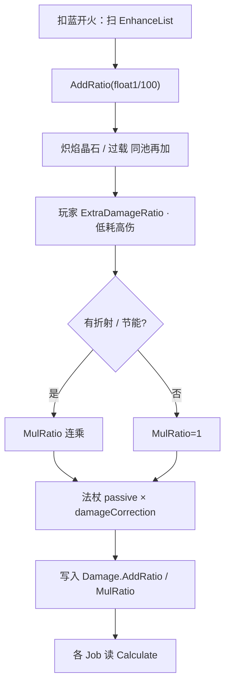

# 伤害强化（Spell3102 / EnhanceAttackRatio）逆向分析

> 范围：仅玩家法术增强符文「伤害强化」（`abilityType = 3102`，配置 ID `31021–31023`）。不展开遗物/诅咒逐条来源，也不复述触发器子组伤害继承。
> 方法：`SpellConfig.json` + 反编译 `Assembly-CSharp` 交叉验证。未标注「推测」的结论均有代码/数据直接证据。
> 配套：总览见《魔法工艺法术系统逆向报告.md》第 6 节，原始数值见《法术数值总表.md》，闪电链侧的同一套 `GetDamage` 见《闪电链逆向分析.md》。离线可开见 `伤害强化逆向分析.html`。

---

## 1. 身份与定位


| 项 | 值 |
| --- | --- |
| 中文名 | 伤害强化 |
| 英文名 | Damage Boost |
| `abilityType` | `3102` / `SpellAbilityType.EnhanceAttackRatio` |
| 配置 ID | `31021`（Lv1）/ `31022`（Lv2）/ `31023`（Lv3） |
| 稀有度 | 普通（`dropType=1`） |
| `useType` | `2`（Enhance 强化符文） |
| 槽位消耗 | `slotCost=1`，`mpCost=0`，自身 `damage=0` |
| 作用对象 | `haveEffecforMissileSpell=true`，`haveEffecforSummonSpell=true` |
| 合成 | Lv1→Lv2→Lv3（`canCompound`：Lv1/2=`true`，Lv3=`false`） |
| 售价（金币） | 9 / 27 / 81 |


**机制一句话**：插在主动/召唤法术**左侧**的纯数值符文；把 `float1%` 写进伤害的**加算池**（`AddRatio`），多张、跨等级、以及同池的炽焰晶石/过载都是**百分比相加**，不是连乘。



文案（`TextConfig_Spell` id `7131021–7131023`）：

> 法术伤害+**float1**%

名称（`7031021–7031023`）：伤害强化 / Damage Boost。三级名称相同，只有 `float1` 不同。

---

## 2. 数值结构

### 2.1 配置表原始值（`assets_export/SpellConfig.json`）


| ID | Level | float1（加算伤害%） | 售价 | 可合成 |
| --- | --- | --- | --- | --- |
| 31021 | 1 | **25** | 9 | true |
| 31022 | 2 | **50** | 27 | true |
| 31023 | 3 | **100** | 81 | false |


规律：`float1` 每级 ×2；售价每级 ×3。`float2/3`、`int1/2/3` 全 0。

### 2.2 字段语义


| 字段 | 语义 | 置信度 | 证据 |
| --- | --- | --- | --- |
| **float1** | 加算伤害百分比；运行时按 `float1 / 100` 调用 `RatioValue.AddRatio` | 高 | `CanShootSpellUtils.GetDamage`；文案占位 `float1` |
| float2/3、int1/2/3 | 未使用 | 高 | 配置恒 0，无引用 |
| `haveEffecforMissile/Summon` | 对弹幕与召唤都标为生效；**`GetDamage` 并不读这两个字段** | 高 | 字段恒 true；过滤只出现在自动填槽 `SpellAutoFullTool` |


伤害强化没有独立 `Spell3102*System` / Authoring。它不是 ECS 行为组件，只是被 `GetDamage` 读 `abilityType` 后改一个比率。

### 2.3 等级等价关系

因为叠加是加算，等级只改变**加数大小**，不改变叠加规则：

```
1×Lv2  = 2×Lv1  = +50%
1×Lv3  = 2×Lv2  = 4×Lv1  = +100%
```

槽位够时，多张低级卡在数值上可以完全替代一张高级卡。合成的意义是**省槽**，不是提高单点效率。

---

## 3. 叠加如何计算（核心）

### 3.1 结论

**多张伤害强化之间是加算，不是连乘。**

文案写「法术伤害 +25%」。两张 Lv1 的结果是 `+50%`（×1.50），不是 `1.25 × 1.25 = 1.5625`。

写入代码的步骤只有一步：`addRatio += float1 / 100`。`addRatio` 初值是 `1`，所以：

```
加算倍率 = 1 + Σ(每张伤害强化的 float1 / 100)
```

### 3.2 通用比率容器

`RatioValue` 把「百分比相加」和「百分比连乘」拆成两个字段：

```36:36:decompiled/Assembly-CSharp/RatioValue.cs
	public double ResultDouble => (BaseValue + addBase) * baseAddRatio * addRatio * mulRatio + addExtra;
```

```71:86:decompiled/Assembly-CSharp/RatioValue.cs
	public RatioValue AddRatio(double val)
	{
		addRatio += val;
		return this;
	}

	public RatioValue MulRatio(double val)
	{
		mulRatio *= val;
		return this;
	}
```

- `AddRatio(0.25)`：`addRatio` 从 1 变成 1.25，再加一张变成 1.50。
- `MulRatio(0.80)`：`mulRatio` 从 1 变成 0.80，再乘一张变成 0.64。

ECS 侧的 `AttributeValue.Calculate()` 写成 `(Base + AddBase) * (1 + AddRatio) * MulRatio + Extra`，其中 `AddRatio` 存的是「从 0 起算的增量」（0.25 而不是 1.25）。映射时：

```264:268:decompiled/Assembly-CSharp/ShootSpellUtils.cs
			Damage = new AttributeValue(configCopy.damage)
			{
				AddRatio = sip.extraDamageRatio,
				MulRatio = sip.finalDamageRatio,
				Extra = sip.finalDamageExtra
			},
```

`sip.extraDamageRatio` 来自 `CurrentAddRatioStartZero`（即 `addRatio - 1`），所以 Mono 的 `1 + Σ` 与 ECS 的 `(1 + AddRatio)` 是同一层。

### 3.3 `GetDamage`：谁进加算池

```7:39:decompiled/Assembly-CSharp/CanShootSpellUtils.cs
	public static RatioValue GetDamage(float baseDamage, IEnumerable<SpellConfig> enhances, SpellConfig stopTarget)
	{
		RatioValue ratioValue = new RatioValue(baseDamage);
		foreach (SpellConfig enhance in enhances)
		{
			if (enhance != stopTarget)
			{
				switch (enhance.abilityType)
				{
				case SpellAbilityType.EnhanceAttackRatio:
				case SpellAbilityType.FireCrystal:
				case SpellAbilityType.OverDrive:
					ratioValue.AddRatio(enhance.float1 / 100f);
					break;
				case SpellAbilityType.Refraction:
					ratioValue.MulRatio(enhance.float2 / 100f);
					break;
				case SpellAbilityType.PowerSavingMode:
					ratioValue.MulRatio(enhance.float3 / 100f);
					break;
				}
				continue;
			}
			return ratioValue;
		}
		return ratioValue;
	}
```

对伤害强化本身：

1. 命中 `EnhanceAttackRatio` 分支；
2. `AddRatio(float1 / 100)`；
3. 与炽焰晶石（`FireCrystal`）、过载（`OverDrive`）走**同一条** `AddRatio`；
4. 折射、节能模式走 `MulRatio`，是另一层。

`switch` 里没有「已处理过同类型就跳过」。同 `abilityType` 出现几次就加几次。

### 3.4 多张叠加公式

对一张主动/召唤法术，设其配置伤害为 `B`，其 `EnhanceList` 里（见第 4 节）有若干张伤害强化，则仅这一层：

```
加算倍率 addRatio = 1 + Σ(float1_i / 100)

仅伤害强化时的伤害 = B × addRatio
```

展开：

```
1 张 Lv1：B × (1 + 0.25)           = B × 1.25
2 张 Lv1：B × (1 + 0.25 + 0.25)    = B × 1.50
1 张 Lv2：B × (1 + 0.50)           = B × 1.50
1 张 Lv1 + 1 张 Lv2：B × 1.75
1 张 Lv3：B × (1 + 1.00)           = B × 2.00
4 张 Lv1：B × (1 + 0.25×4)         = B × 2.00
```

**没有衰减、没有上限、没有「只取最高级」。** 静态代码里 `GetDamage` 对 `EnhanceAttackRatio` 没有 `Max`、没有 `Min`、没有数量封顶。

### 3.5 常见误解


| 误解 | 实际 |
| --- | --- |
| 两张 +25% 连乘成 ×1.5625 | 加算成 ×1.50 |
| 高级覆盖低级，只算最大那张 | 全部求和 |
| 右侧那张也会强化左侧法术 | 只强化**自己右边**的主动/召唤（同段） |
| 只强化紧挨着的下一张法术 | 同段内它**之后的所有**主动/召唤都吃（`list2` 不清空） |
| 合成后单点变得更赚 | 数值线性；合成只是用 1 格换等价的更高 `float1` |


---

## 4. 谁吃得到这张卡

### 4.1 解析：同段左侧全部累积

`SpellGroupParser` 从左到右扫槽位。遇到 Enhance 就推进累积列表 `list2`，**不会在消耗后清空**；遇到 Missile / Summon（或触发器）时，把**当前累积快照**挂到该法术的 `EnhanceList` 上。

```32:48:decompiled/Assembly-CSharp/SpellGroupParser.cs
		foreach (SlotData item in spells.Where((SlotData e) => e != null && !e.isSealSlot))
		{
			SpellConfig finalConfig = item.GetFinalConfig();
			if (!item.IsTrigger())
			{
				SpellType useType = finalConfig.useType;
				if (useType != SpellType.Summon && useType != 0)
				{
					if (finalConfig.useType == SpellType.Enhance)
					{
						list2.Add(item);
					}
					continue;
				}
			}
			list.Add((item, list2.ToArray()));
		}
```

因此：

```
[伤害强化] [魔法弹] [滚球]
  → 魔法弹 EnhanceList = [伤害强化]
  → 滚球   EnhanceList = [伤害强化]     // 同一张继续往后传

[魔法弹] [伤害强化] [滚球]
  → 魔法弹 EnhanceList = []
  → 滚球   EnhanceList = [伤害强化]

[伤害强化A] [魔法弹] [伤害强化B] [滚球]
  → 魔法弹 EnhanceList = [A]
  → 滚球   EnhanceList = [A, B]
```

摆放顺序决定的是「这张卡从哪一张主动法术开始生效」，不是「只强化下一张」。

### 4.2 `normalSlots` 与 `postSlots` 分段

两段槽位**分别** `Parse`，互不串强化：

```2701:2704:decompiled/Assembly-CSharp/Wand.cs
		shootGroups = SpellGroupParser.Parse(WandCfg.normalSlots, WandCfg.shootCount).ToList();
		postSlotShootGroups = SpellGroupParser.Parse(WandCfg.postSlots, WandCfg.shootCount).ToList();
```

主槽的伤害强化加不到后槽法术上，反之亦然。

### 4.3 `stopTarget` 在主动法术上几乎不截断

主动法术走 `GetSpellDamage()`：

```524:528:decompiled/Assembly-CSharp/SpellShootData.cs
	public RatioValue GetSpellDamage()
	{
		RatioValue damage = CanShootSpellUtils.GetDamage(Spell.GetFinalConfig().damage, EnhanceList.Select((SlotData e) => e.GetFinalConfig()).ToArray(), Spell.GetFinalConfig());
		damage.Merge(OwnerGroup.GetGroupDamageRatio());
		return damage;
	}
```

这里 `stopTarget` 是**主动法术自己的配置**。`EnhanceList` 里只有强化符文，不含这张主动法术，所以循环会走完全表，**列表里每一张伤害强化都会加上**。

`stopTarget` 真正起截断作用的，是闪电链 / 生命线这种「以某张强化自己为基数」的入口（见第 7 节）：循环扫到那张强化就 `return`，因此**只有它左侧**的伤害强化计入该张链/生命线。

`enhance != stopTarget` 是**引用相等**。`SpellConfig.dic` 里同 ID 共用一个实例，两张 Lv1 伤害强化的 `GetFinalConfig()` 是同一个对象。这对主动法术无影响（`stopTarget` 是主动法术）；对闪电链则意味着「两张同级闪电链」会在扫到第一张同引用时停住——那是闪电链文档的议题，不是伤害强化自身的叠加 bug。

### 4.4 对弹幕和召唤都生效

配置两个 `haveEffecfor*` 均为 true。`GetDamage` 不读这两个字段，只看 `EnhanceList` 里有没有 `EnhanceAttackRatio`。只要解析器把这张卡挂进了某次施放的 `EnhanceList`，弹幕和召唤的基础伤害都会吃加算。

`haveEffecforMissileSpell` 在 `SpellAutoFullTool.Filter_SummonOnlyEnhance` 里用于自动填槽：伤害强化对弹幕也生效，不会被滤成「只给召唤」。

### 4.5 等级读取走 `GetFinalConfig()`

`EnhanceList` 取的是 `GetFinalConfig()`，不是卡面原始 ID。`SpellLevelEnhance`（魔能升阶）等提供的 `slotSpellExtraLevel` 会把 `31021` 抬成 `31022`/`31023`（不超过该 `abilityType` 最高级）。叠加规则不变，变的是那张卡送进 `AddRatio` 的 `float1`。

---

## 5. 与其他伤害层的关系

### 5.1 同加算池（和伤害强化直接相加）

`GetDamage` 里与伤害强化走同一 `AddRatio` 的强化：


| 符文 | abilityType | 写入值 | 典型 float1 |
| --- | --- | --- | --- |
| 伤害强化 | 3102 EnhanceAttackRatio | `float1/100` | 25 / 50 / 100 |
| 炽焰晶石 | 3111 FireCrystal | `float1/100` | 100（仅 Lv1） |
| 过载 | 3123 OverDrive | `float1/100` | 50 / 100 / 200 |


另外，玩家全局 `PlayerMgr.ExtraDamageRatio` 在最终入口里也是 `AddRatio`，与上面这些**进同一个 `addRatio`**：

```35:39:decompiled/Assembly-CSharp/CanShootSpellUtils.cs
	public static RatioValue GetDamage_FinalPlayerValue(...)
	{
		RatioValue damage = GetDamage(baseDamage, enhances, stopTarget);
		damage.AddRatio(PlayerMgr.Inst.ExtraDamageRatio).MulRatio(wand.passiveDamageRatio).MulRatio(wand.WandCfg.damageCorrection / 100f);
		return damage;
	}
```

实伤 SIP 组装也是把它们加进同一个 `extraDamageRatio`：

```171:171:decompiled/Assembly-CSharp/SpellInitialParameter.cs
			data.extraDamageRatio += PlayerMgr.Inst.ExtraDamageRatio;
```

```300:302:decompiled/Assembly-CSharp/SpellInitialParameter.cs
			RatioValue spellDamage = shootData.GetSpellDamage();
			data.extraDamageRatio += spellDamage.CurrentAddRatioStartZero;
			data.finalDamageRatio *= spellDamage.CurrentMulRatio;
```

`ExtraDamageRatio` 本身由多条遗物/诅咒累加（金钱即力量、诅咒战士、添伤遗物等，见 `PlayerMgr.ExtraDamageRatio`）。本文把它当作**一个已经加总好的加算源**，不逐条展开。

法杖特效 `CheapSpellHigherDamage`（低耗法术更高伤）同样 `extraDamageRatio += wand.float1/100`，还是这一层。

因此仅加算层：

```
addRatio = 1
         + Σ伤害强化(float1/100)
         + Σ炽焰晶石(float1/100)
         + Σ过载(float1/100)
         + ExtraDamageRatio
         + [低耗高伤法杖 float1/100]
```

### 5.2 乘算层（在加算之后相乘）

`GetDamage` 内：


| 符文 | 写入 | 典型值 |
| --- | --- | --- |
| 折射 Refraction | `MulRatio(float2/100)` | ×80% / 85% / 90% |
| 节能模式 PowerSavingMode | `MulRatio(float3/100)` | ×75% / 75% / 80% |


`GetDamage_FinalPlayerValue` / SIP 再乘：

- `wand.passiveDamageRatio`（遗物等挂在法杖上的乘算伤害率）
- `wand.WandCfg.damageCorrection / 100`（法杖表自带伤害修正）

多张折射/节能是 **`mulRatio` 连乘**（`MulRatio` 用 `*=`），与伤害强化的加算不同。

`GetGroupDamageRatio()` 目前只对奥术新星（`ArcaneNova`）按 `int2/100` 再 `MulRatio`，然后向父组递归 `Merge`。普通法术这一项为 1。

### 5.3 主动法术完整分层（忽略半径转伤等旁路）

```
最终伤害 ≈ Ceil(
    B
    × (1 + Σ加算% + ExtraDamageRatio + …)
    × Π(折射 float2/100)
    × Π(节能 float3/100)
    × wand.passiveDamageRatio
    × (damageCorrection / 100)
) + finalDamageExtra
```

Mono 实伤（`SpellBase`）：

```556:557:decompiled/Assembly-CSharp/SpellBase.cs
		damageRatio += initialParameter.extraDamageRatio;
		finalDamageRatio *= initialParameter.finalDamageRatio;
```

```772:772:decompiled/Assembly-CSharp/SpellBase.cs
		spellCfg.damage = Mathf.Ceil(spellCfg.damage * damageRatio * finalDamageRatio) + initialParameter.finalDamageExtra;
```

`damageRatio` 初值 1，再加上 `extraDamageRatio`（从 0 起算的加算增量），与 `RatioValue` 的 `addRatio` 对齐。末尾 `Ceil`。

### 5.4 三条入口不要混用


| 入口 | 用途 | 是否含 ExtraDamageRatio / 法杖乘算 |
| --- | --- | --- |
| `GetDamage` | 只结算 EnhanceList 里的加算/乘算符文 | 否 |
| `GetSpellDamage` | 主动法术：`GetDamage` + 组比率 | 否（玩家/法杖在 SIP 另加） |
| `GetDamage_FinalPlayerValue` | 闪电链/生命线/部分 UI | 是 |
| `GetSpellDamage_FinalPlayerValue` | 主动法术 UI；另含半径缩转伤、低耗高伤 | 是 |


实伤 SIP 对主动法术走 `GetSpellDamage()`，再在 `ProcessPlayerEffect` / `ProcessWandEffect` 里补 `ExtraDamageRatio` 与法杖乘算。数值上应与 `GetSpellDamage_FinalPlayerValue` 的主干一致，但后者还可能乘「半径缩小转伤害」——那是范围符文议题，不是伤害强化叠加。

炽焰晶石在 `ShootSpellUtils.ApplyElementSpell` 里也会 `Damage.AddRatio += float1/100`。那条路径是法杖染色/彩虹缎带把**颜色映射成晶石 ID** 时走的，不是槽位里那张炽焰晶石的第二次结算。槽位炽焰晶石只通过 `GetDamage` 进加算池一次。

---

## 6. 数值算例

基准：魔法弹 Lv1，`B = 10`（`SpellConfig` id `10011`）。先不算玩家全局、法杖修正、`Ceil`；需要时再单独写。

### 6.1 只叠伤害强化


| 槽位（左 → 右） | 加算% | 倍率 | 理论伤害 |
| --- | --- | --- | --- |
| `[弹]` | 0 | ×1.00 | 10 |
| `[强Lv1] [弹]` | +25 | ×1.25 | 12.5 → Ceil 13 |
| `[强Lv1] [强Lv1] [弹]` | +50 | ×1.50 | 15 |
| `[强Lv2] [弹]` | +50 | ×1.50 | 15 |
| `[强Lv1] [强Lv2] [弹]` | +75 | ×1.75 | 17.5 → Ceil 18 |
| `[强Lv3] [弹]` | +100 | ×2.00 | 20 |
| `[强Lv1]×4 [弹]` | +100 | ×2.00 | 20 |


两张 Lv1 **不是** `10 × 1.25 × 1.25 = 15.625`。

### 6.2 摆放顺序


| 槽位 | 魔法弹 | 滚球（B=45） |
| --- | --- | --- |
| `[强Lv1] [弹] [球]` | ×1.25 → 12.5 | ×1.25 → 56.25 |
| `[弹] [强Lv1] [球]` | ×1.00 → 10 | ×1.25 → 56.25 |
| `[强A] [弹] [强B] [球]` | 只吃 A（×1.25） | 吃 A+B（×1.50） |
| `[弹] [球] [强Lv1]` | ×1.00 | ×1.00（强化在右侧，作废） |


主槽的强化加不到后槽；后槽要自己再插。

### 6.3 与同池 / 乘算层混放

设 `B = 10`，忽略玩家与法杖。


| 组合（均在法术左侧） | 计算 | 结果 |
| --- | --- | --- |
| 强Lv1 + 过载Lv1（+50%） | `10 × (1+0.25+0.50)` | 17.5 |
| 强Lv1 + 炽焰晶石（+100%） | `10 × (1+0.25+1.00)` | 22.5 |
| 强Lv1 + 折射Lv1（×80%） | `10 × 1.25 × 0.80` | 10 |
| 强Lv1×2 + 折射Lv1 | `10 × 1.50 × 0.80` | 12 |
| 强Lv3 + 节能Lv1（×75%） | `10 × 2.00 × 0.75` | 15 |
| 强Lv1 + 过载Lv1 + 折射Lv1 | `10 × 1.75 × 0.80` | 14 |


加算先加总，再乘乘算层。把伤害强化理解成「先乘 1.25 再乘过载 1.50」是错的——过载也是加算。

### 6.4 加上玩家全局加算

设 `ExtraDamageRatio = 0.20`（+20%），两张 Lv1 伤害强化，无乘算符文、无法杖修正：

```
10 × (1 + 0.25 + 0.25 + 0.20) = 10 × 1.70 = 17
```

不是 `10 × 1.50 × 1.20 = 18`。全局伤害率与伤害强化同池。

### 6.5 槽位 vs 合成


| 目标加算 | 最小槽位方案 | 金币（仅卡面售价） |
| --- | --- | --- |
| +25% | 1×Lv1 | 9 |
| +50% | 2×Lv1（2 槽）或 1×Lv2（1 槽） | 18 或 27 |
| +100% | 4×Lv1 / 2×Lv2 / 1×Lv3 | 36 / 54 / 81 |


槽位紧时合成；槽位松时留多张低级卡更便宜，数值相同。

---

## 7. 闪电链 / 生命线怎么吃伤害强化

这两条不走主动法术的 `B`，而是用强化自己的基数，再套同一套 `GetDamage_FinalPlayerValue`，`stopTarget` 等于**那张强化自己**：

```
对 EnhanceList 中每一张闪电链 e：
  partial = GetDamage_FinalPlayerValue(e.int1, EnhanceList, stopTarget=e, wand)
闪电链总伤 = Ceil(Σ partial)
```

因此：

```
[强Lv1] [闪电链] [魔法弹]
  → 链伤害基数 12 吃 +25%（再加玩家/法杖）
  → 魔法弹也吃 +25%

[闪电链] [强Lv1] [魔法弹]
  → 链伤害不吃这张强（它在 stopTarget 右侧）
  → 魔法弹吃 +25%
```

生命线同理，基数是生命线的 `float1`。细节见《闪电链逆向分析.md》第 2.4 节。

伤害强化**不会**自己产生链或 DoT；它只改别人的 `AddRatio`。

---

## 8. 与构筑相关的行为摘要


| 行为 | 结果 |
| --- | --- |
| 多张伤害强化在同一主动左侧 | `float1` 全部加算 |
| 1×Lv2 / 2×Lv1 | 数值相同（+50%） |
| 1×Lv3 / 2×Lv2 / 4×Lv1 | 数值相同（+100%） |
| 与过载、炽焰晶石并放 | 继续加算，不连乘 |
| 与折射、节能并放 | 先加总再乘它们的 `float2/float3` |
| 与玩家 ExtraDamageRatio | 同一加算池 |
| 放在主动法术右侧 | 该法术吃不到；其后的法术吃得到 |
| 放在主槽最左 | 本段之后所有主动/召唤都吃 |
| 主槽强化 / 后槽法术 | 不加（分段 Parse） |
| 魔能升阶抬级 | 该张卡的 `float1` 按新等级算，叠加规则不变 |


---

## 9. 证据索引


| 结论 | 文件 |
| --- | --- |
| 配置数值 25/50/100 | `assets_export/SpellConfig.json`（31021–31023） |
| 描述文案 | `assets_export/TextConfig_Spell.json`（703102x / 713102x） |
| 加算写入 | `CanShootSpellUtils.GetDamage`（`EnhanceAttackRatio` → `AddRatio`） |
| 玩家/法杖最终层 | `CanShootSpellUtils.GetDamage_FinalPlayerValue` |
| 比率容器 | `RatioValue.AddRatio` / `MulRatio` / `ResultDouble` |
| ECS 映射 | `ShootSpellUtils`：`Damage.AddRatio = sip.extraDamageRatio` |
| ECS 计算公式 | `AttributeValue.Calculate`：`(Base+AddBase)*(1+AddRatio)*MulRatio+Extra` |
| 主动法术取 EnhanceList | `SpellShootData.GetSpellDamage` |
| 解析累积、不清空 | `SpellGroupParser` 构造函数 |
| 主槽/后槽分段 | `Wand`：`Parse(normalSlots)` / `Parse(postSlots)` |
| SIP 加算/乘算拆分 | `SpellInitialParameter`：`extraDamageRatio` / `finalDamageRatio` |
| Mono 实伤 Ceil | `SpellBase`：`damage * damageRatio * finalDamageRatio` |
| 枚举 | `SpellAbilityType.EnhanceAttackRatio = 3102` |


---

## 10. 待决 / 局限

1. **遗物/诅咒逐条**：`ExtraDamageRatio` 的每一项来源未在本文展开；只确认它们与伤害强化进入同一加算池。
2. **触发器子组**：命中/结束触发等对子组常乘 `finalDamageRatio` 或「继承父伤害 %」，那是另一条链；伤害强化通过提高父法术伤害间接影响，公式不在此复述。
3. **UI 染色与 Ceil**：卡面预览走 `GetSpellDamage_FinalPlayerValue`，实伤 Mono 路径末尾 `Ceil`。12.5 在 UI 与飘字之间可能差 1 点，以实伤 `Ceil` 为准。
4. **`haveEffecfor*`**：对伤害强化恒为 true，且 `GetDamage` 不读它们；若日后出现「只对召唤生效的伤害加算」，不能想当然复用本符文的结论。
5. **动态运行时再叠一层**：龙息等个别法术会在 Job 里改 `Damage.AddRatio`（充能层数等）。那是该法术自己的额外加算，与槽位伤害强化相加，不是伤害强化内部的连乘。
