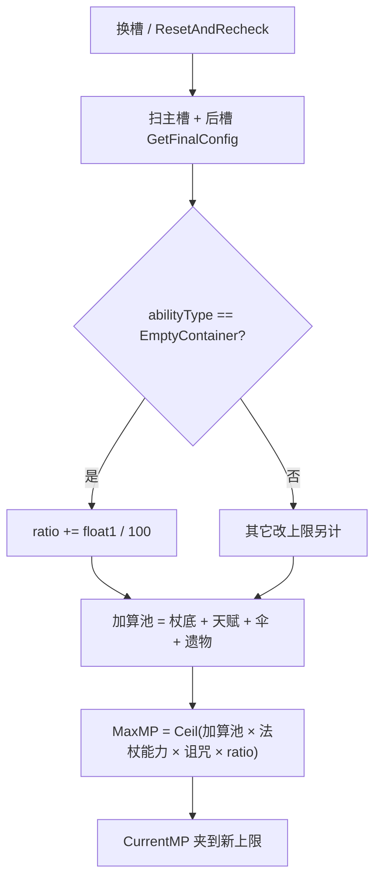

# 储魔之匣（Spell4002 / EmptyContainer）逆向分析

> 范围：仅玩家被动符文「储魔之匣」（`abilityType = 4002`，配置 ID `40021–40023`）。重点是 **`float1` 怎么进 `passiveWandMaxMpRatio`**，以及 **`Wand.MaxMP` 分层公式里谁先加、谁后乘**。
> 遗物 / 诅咒 / 法杖能力只点合成顺序，不逐条拆。宁静之花（回蓝）不是这张卡。
> 方法：`SpellConfig.json` + 反编译 `Assembly-CSharp` 交叉验证。未标注「推测」的结论均有代码/数据直接证据。
> 这张卡是法杖级被动，主路径在 `Wand`，没有 `Spell4002*System` / Authoring，也不进弹体 ECS。
> 配套：总览见《魔法工艺法术系统逆向报告.md》，原始数值见《法术数值总表.md》，同级被动骨架见《强制冷却逆向分析.md》，加算进上限见《奥术屏障逆向分析.md》。离线可开见 `储魔之匣逆向分析.html`。

---

## 1. 身份与定位


| 项 | 值 |
| --- | --- |
| 中文名 | 储魔之匣 |
| 英文名 | Magic Reservoir |
| 内部名 | `EmptyContainer` 空的容器（+MP 上限） |
| `abilityType` | `4002` / `SpellAbilityType.EmptyContainer` |
| 配置 ID | `40021`（Lv1）/ `40022`（Lv2）/ `40023`（Lv3） |
| 稀有度 | 普通（`dropType=1`） |
| `useType` | `3`（`SpellType.Passive` 被动符文） |
| 槽位消耗 | `slotCost=1`，自身 `mpCost=0`、`damage=0`、`shootCount=0` |
| 作用对象 | `haveEffecforMissileSpell=false`，`haveEffecforSummonSpell=false`（自动填槽的强化过滤用；运行时不读） |
| 合成 | Lv1→Lv2→Lv3（`canCompound`：Lv1/2=`true`，Lv3=`false`） |
| 售价（金币） | 8 / 24 / 72 |


**机制一句话**：插在法杖**任意有效槽**里的法杖级被动。不改伤害、冷却、施法间隔、回蓝、蓝耗；只把卡上的 `float1` 按百分比**加算**进 `passiveWandMaxMpRatio`。真正生效在 `Wand.MaxMP`：先加完杖底 / 天赋 / 屏障 / 遗物，再乘这份 ratio。左右位置不决定「强化谁」——吃的是这根法杖的蓝上限。



文案（`TextConfig_Spell` id `7140021–7140023`）：

> 法杖魔法值上限+**float1**%

名称（`7040021–7040023`）：储魔之匣 / Magic Reservoir。三级名称相同，只有 `float1` 不同。底部补充 `7240021` 全空。卡面靠 `GetDes` 替换 `float1`，不是 `GetInfo` 自动吐冷却那种行。

---

## 2. 数值与叠加

### 2.1 配置表（`assets_export/SpellConfig.json`）


| ID | Level | float1（上限 +%） | 售价 | 可合成 |
| --- | --- | --- | --- | --- |
| 40021 | 1 | **40** | 8 | true |
| 40022 | 2 | **80** | 24 | true |
| 40023 | 3 | **160** | 72 | false |


规律：售价每级 ×3（8 / 24 / 72，和时长强化 / 悬停同档）。`float1` 每级 ×2（40 → 80 → 160）。`float2/3`、`int1/2/3` 全 0。无耗蓝倍率。`coolDownRatio` 恒 1，自己不加不减冷却。

### 2.2 字段语义


| 字段 | 语义 | 运行时是否被读 | 置信度 |
| --- | --- | --- | --- |
| **`float1`** | 法杖蓝上限加算百分数；运行时 `ratio += float1/100` | 是 | 高 |
| float2 / float3 / int1 / int2 / int3 | 配置为 0 | **未读** | 高 |
| `coolDownRatio` / `coolDownAddSubRevise` / `shootIntervalAddSubRevise` | 1 / 0 / 0 | 扫描时会碰到加减字段，此卡贡献 0 | 高 |
| `haveEffecforMissileSpell` / `haveEffecforSummonSpell` | 表上均为 `false` | 仅自动填槽的强化过滤；`EmptyContainer` 分支 **不读** | 高 |


没有独立 `Spell4002*System` / Authoring。这张卡本身不挂伤害组件，也不进发射包。

`WandConfig.GetExtraMaxMP` 也读 `float1`，但当成**绝对点数**加，见第 6 节。那条不是运行时真源。

### 2.3 加算进 ratio，不是连乘，也不是取 max

两张 Lv1 是 **1.80**，不是 `1 × 1.40 × 1.40`，也不是 `max(1.40, 1.40)`。

```705:707:decompiled/Assembly-CSharp/Wand.cs
			case SpellAbilityType.EmptyContainer:
				passiveWandMaxMpRatio += spell.float1 / 100f;
				break;
```

循环里没有「已处理过同类型就跳过」。同类型出现几次加几次。无上限、无「只取最高级」。底数从 `1` 加，没有这张卡时 `passiveWandMaxMpRatio = 1`。

等级不能互替，但**同级两张合成一张，ratio 刚好相等**：


| 槽位 | ratio | 底数 50 的 MaxMP | 说明 |
| --- | --- | --- | --- |
| 无 | 1.00 | 50 | |
| 1×Lv1 | 1.40 | **70** | `Ceil(50×1.40)` |
| 1×Lv2 | 1.80 | **90** | |
| 1×Lv3 | 2.60 | **130** | |
| 2×Lv1 | 1+0.40+0.40 = 1.80 | **90** | 和 1×Lv2 相同 |
| Lv1+Lv2 | 1+0.40+0.80 = 2.20 | **110** | 比 1×Lv3 差 |
| 2×Lv3 | 1+1.60+1.60 = 4.20 | **210** | 无上限 |


和强制冷却相反：那边连乘，合成既省槽又更狠；这里同级两张合成一张，**ratio 不变、省一个槽**。`Lv1+Lv2` 不如一张 Lv3（2.20 vs 2.60）。自动填槽**不自排斥**（`SelfRepelSpells` 只有元素晶石），手摆和自动都可以叠多张。

写入时机：`ResetAndRecheck` / `ProcessSharedSpell` 里先解析拟态、魔力藤蔓层数、魔能升阶，再 `CheckWandSlotPassiveEffect`。每次重算都先把 `passiveWandMaxMpRatio` 置回 `1`，再扫一遍。没有「遗物 / 诅咒 / 杖底」进这个加算池——它们走 `MaxMP` 取值器的另外几层。

同池里还有别的卡会改这份 ratio，见 4.2。只插储魔之匣时，槽位左右顺序不影响结果（都是 `+=`）。

### 2.4 不改回蓝、不改蓝耗

`passiveBonusMpGen` / `passiveMpGenRatio` / `passiveMpCostCorrection` 都不读这张卡。回蓝是宁静之花（`4003` `ManaEssence`），耗蓝修正是蓄力模式等。文案写的是上限，不是回复。

### 2.5 魔能升阶抬的是这张卡的 `float1`

`CheckWandSlotPassiveEffect` 取 `GetFinalConfig()`。`SpellLevelEnhance`（魔能升阶）先把槽位的 `slotSpellExtraLevel` 加上，`GetFinalLevelId` 再把 `40021` 抬成 `40022` / `40023`（不超过该 `abilityType` 最高级）。叠加规则不变，变的是送进加算的百分数：40 → 80 → 160。

---

## 3. 谁吃得到这张卡

### 3.1 法杖级被动，不走 EnhanceList

`SpellGroupParser` 的左侧累积是给 Enhance / 触发器用的。储魔之匣是 `useType = Passive`，`CheckWandSlotPassiveEffect` 直接扫 `GetValidSlotsData`：主槽一遍、后槽一遍，每张有效槽的 `GetFinalConfig()` 丢进同一个 `action`。

左右位置不决定「强化谁」。插在魔法弹左边、右边、后槽，吃的都是**这根法杖**的 `MaxMP`。主槽加得到后槽——后槽里的一张同样加进同一个 `passiveWandMaxMpRatio`。

```
[匣] [弹]              法杖上限 ×1.40
[弹] [匣]              同样 ×1.40
[弹] …后槽 [匣]         同样 ×1.40
[匣A] [匣B] [弹]        ×1.80（两张 Lv1）
```

封印槽（`isSealSlot`）不进 `GetValidSlotsData`。空槽跳过。背包里没插上的不算。

### 3.2 `haveEffecfor* = false` 拦不住运行时

`EmptyContainer` 分支只看 `abilityType` 和 `float1`，不读两个 `haveEffecfor*`。表标「对导弹 / 召唤无效」只影响自动填槽的**强化过滤**；这张卡根本不是 Enhance，填槽走的是 Passive 通道。

### 3.3 自动填槽当普通被动

不在 `IgnoreSpells`（忽略的是触发器、传送石、全域强化、拟态、魔力藤蔓等），不在 `SelfRepelSpells`，不在 `SpellAvoidEnhances`。`AppendPassiveSpells` 只要求 `useType == Passive`。手摆和自动都可以叠多张。

### 3.4 全域强化会把右边那张抄走

`AllFieldEnhance`（`4010`）把**紧挨在自己右边**的那张卡复制到其它法杖。`[全域][储魔之匣]` 会让别的杖也带上一份同等级（等级被全域自己的等级封顶）。复制过去的槽同样走 `GetFinalConfig` + `EmptyContainer` 加算。这是「一张卡喂多根杖」的入口，不是这张卡自己的逻辑。

---

## 4. 谁真正吃到这份上限

真正用这份 ratio 的，是 `Wand.MaxMP` 取值器。谁读 `MaxMP`，谁就吃到；谁走 `GetExtraMaxMP`，谁就不是文案说的「上限 +N%」。

### 4.1 合成顺序：先加完加算池，再乘三层 ratio

```279:314:decompiled/Assembly-CSharp/Wand.cs
	public float MaxMP
	{
		get
		{
			if (WandCfg == null)
			{
				return 0f;
			}
			int num = WandCfg.maxMP;
			if (PlayerMgr.Inst.BaData != null)
			{
				num += PlayerMgr.Inst.BaData.mpMax;
			}
			num += Mathf.RoundToInt(passiveBonusMaxMp);
			if (PlayerMgr.Inst.ItemCtrller.relicCfg_MaxMP != null)
			{
				num += PlayerMgr.Inst.ItemCtrller.relicCfg_MaxMP.int1.result;
			}
			if (PlayerMgr.Inst.ItemCtrller.relicGroupConfigs.TryGetValue(3, out var value))
			{
				num += value.int1.result;
			}
			if (PlayerMgr.Inst.ItemCtrller.uiRelic_RuneWizard != null)
			{
				num += PlayerMgr.Inst.ItemCtrller.uiRelic_RuneWizard.GetRuneWizardSetBonusMP();
			}
			float num2 = 1f;
			num2 *= PlayerMgr.Inst.MaxMpRatioFromWandAbility();
			if (PlayerMgr.Inst.ItemCtrller.curseCfg_LoseMPLimit != null)
			{
				num2 *= 1f - (float)PlayerMgr.Inst.ItemCtrller.curseCfg_LoseMPLimit.int1.result / 100f;
			}
			num2 *= passiveWandMaxMpRatio;
			num = Mathf.CeilToInt((float)num * num2);
			return num;
		}
	}
```

```
加算池
  法杖底数            WandCfg.maxMP（常见 50，也有 45 / 80 / 100 / 220 等）
  + 天赋              BaData.mpMax（选世界时天赋升级写入）
  + 奥术屏障          Round(passiveBonusMaxMp)，40121 的 int2 = 400
  + 遗物加算          relicCfg_MaxMP / 套装组 3 / 符文巫师套
乘算池（从 1 连乘）
  × 法杖能力          AllWandMaxMpRatio（点名，不拆）
  × 失蓝上限诅咒      1 - int1/100（点名，不拆）
  × 储魔之匣等        passiveWandMaxMpRatio
最后                CeilToInt(加算池 × 乘算池)
```

加算在乘之前。`[奥术屏障][储魔之匣 Lv1]`、底数 `50`：先 `50+400=450`，再 `×1.40 → 630`。不是 `50×1.40 + 400 = 470`。

天赋、遗物加算同样被这份 ratio 放大。杖底越大，同一张匣加得越多。

`Battery` 法杖能力（`MaxManaAmountFromWandAbility`）**不在**这个取值器里。它是开火够不够蓝时，把其它电池杖的 `MaxMP` 另加一笔，见 4.4。

### 4.2 同一份 `passiveWandMaxMpRatio` 里还有谁

扫描按槽位从左到右、先主槽后后槽。`+=` 和 `*=` **按遇到的顺序交错**，不是「先加完再乘」。


| 来源 | abilityType | 怎么改 ratio | 和匣同场 |
| --- | --- | --- | --- |
| 储魔之匣 | `4002` EmptyContainer | `+= float1/100` | 自身 |
| 魔力藤蔓 | `4021` ManaTendril | `+= float2/100 × (specialInt+1)` | 同池加算；藤蔓自己的层数规则不拆 |
| 魔力接口 | `4009` ManaInterface | `*= float1/100` | 同池连乘。当前 `SpellConfig.json` **没有 4009 行**，代码分支还在 |
| 奥术屏障 | `4012` Umbrella | 不进 ratio；进加算池 `passiveBonusMaxMp` | 先被匣乘 |


只插匣时顺序无所谓。匣和接口同场时，`[匣][接口]` 与 `[接口][匣]` 结果不同——接口在匣前面会先把底数 1 乘下去，再加匣。玩家卡导出里目前看不到接口，这条只作代码入口。

`CheckWandManaRelatePassiveEffect`（扩槽后的蓝量旁路）会从 1 重算匣 / 藤蔓 / 屏障，**没有**接口分支。`Wand.Update` 在槽数真变时会立刻再 `ResetAndRecheck`，主路径会补回完整扫描。

### 4.3 上限变了，当前蓝只夹、不补满

两个扫描结尾都写 `CurrentMP = CurrentMP`。setter 把当前蓝 `Clamp(0, MaxMP)`：

- 插上匣、上限升高：当前蓝**不**立刻补到新上限，靠回蓝慢慢涨。
- 拔掉匣、上限下降：超出部分当场削掉。

`Update` 里若 `MaxMP` 和上一帧差超过 `0.01`，会再 `ResetAndRecheck` 一次。稳定后不再重入。

### 4.4 谁读 `MaxMP`（吃得到），谁不读

吃得到这份上限的：


| 表面 | 怎么用 MaxMP |
| --- | --- |
| 当前蓝条 / 回蓝夹顶 | `CurrentMP` 上限；回蓝涨到 `MaxMP` 停 |
| 开火够不够蓝 | `CheckMaxMpEnough`：`MaxMP + 其它电池杖的 MaxMP` ≥ 组耗蓝 |
| 奥术屏障 | 盾按这根杖的 `MaxMP` 换算「一点血等于多少蓝」 |
| 狴犴飞剑 | 飞剑数 `Ceil(MaxMP / 25)` |
| `UIInfoWand`（手上有活 `Wand`） | 直接读 `wand.MaxMP`（含天赋 / 遗物 / 诅咒 / 匣） |


不吃这份 %、或另算的：


| 表面 | 实际 |
| --- | --- |
| 弹体伤害 / 持续 / 半径 | 不读 MaxMP |
| 法杖冷却 / 施法间隔 | 不读 MaxMP |
| 宁静之花回蓝 | 加的是 `passiveBonusMpGen`，不是上限 |
| 电池杖「借蓝」 | 不改本杖 `MaxMP`；开火判定时把**其它**电池杖的 `MaxMP` 另加 |
| `GetExtraMaxMP` 预览 | 把 `float1` 当点数加，见第 6 节 |


组耗蓝 80、杖底 50：一张 Lv1 匣变成 70，仍然开不出；一张 Lv2 变成 90，开得出。验收看活 Wand 的 `MaxMP`，不要看商店预览。

### 4.5 这张卡不出伤、不改冷却

它只抬（或拔掉后降下）这根杖的蓝上限。出不出伤、转多快，看法术和法杖自己。

---

## 5. 和其它法术的关系（只写会改储魔之匣行为的）

齐射 / 多重 / 伤害强化 / 加速器 / 悬停只改发射或弹体，不改这份 ratio，不列。


| 对象 | 储魔之匣怎么变 |
| --- | --- |
| 魔能升阶 `3126` | 抬这张卡的 `float1`（40→80→160） |
| 拟态魔方 `3109` | `GetFinalConfig` 已解析；模仿成 4002 的那格也会再加一次 |
| 全域强化 `4010` | 紧挨右边的 4002 被抄到其它杖，那些杖各自加算 |
| 奥术屏障 `4012` | `+400` 进加算池，再被匣的 ratio 乘 |
| 魔力藤蔓 `4021` | 同池 `+=`；层数规则不拆 |
| 魔力接口 `4009` | 同池 `*=`；导出表缺行，只点入口 |
| 宁静之花 `4003` | 只加回蓝，不进 `MaxMP` |
| 蓄力 / 节能 / 过载 | 改耗蓝或间隔，不改上限 |
| 天赋 / 遗物加算 / 失蓝诅咒 / `AllWandMaxMpRatio` | 在取值器另外几层；只点顺序 |
| 电池杖能力 | 不进本杖 `MaxMP`；开火时借用其它电池杖上限 |


---

## 6. 运行时 vs 预览 / UI 对照

这张卡没有 ECS / Mono 双轨。对照的是「活 Wand」和「只拿着 WandConfig 的预览」。

和运行时对齐的部分：

- 加算、从 1 起、同类型出现几次加几次
- 主槽 + 后槽都算，封印槽不算
- 取值器最后乘 `passiveWandMaxMpRatio`，再 `CeilToInt`

差别在 `WandConfig.GetExtraMaxMP`：

```590:608:decompiled/Assembly-CSharp/WandConfig.cs
	public float GetExtraMaxMP()
	{
		float num = 0f;
		// 主槽 + 后槽：非封印且 abilityType == EmptyContainer
		num += SpellConfig.dic[slot.id].float1;
		return num;
	}
```

它把 `float1` 当成**绝对点数**加（Lv1 +40，不是 +40%），而且读的是槽位**原始 `id`**，不是 `GetFinalConfig()`。


| 表面 | 用的公式 | 吃不吃 4002 的 % |
| --- | --- | --- |
| `UIInfoWand`（手上有 `Wand`） | `wand.MaxMP` | **吃**（完整分层 + Ceil） |
| `UIInfoWand`（只有 `WandConfig`） | `maxMP + GetExtraMaxMP()` | **当点数加** |
| `UIRewardWand` | 同上 | **当点数加** |
| `UIGallery` | 同上 | **当点数加** |
| 卡面 `GetDes` | `上限+float1%` | 展示这张卡自己的百分数，不合成整杖 |


底数 50、一张 Lv1：运行时 **70**，预览 **90**（50+40）。底数恰好 100 时两边数字碰巧一样（100×1.40 = 100+40），不要拿 100 底的杖当验收。Lv3 预览是 50+160=210，运行时是 `Ceil(50×2.60)=130`。

预览还缺：天赋、遗物、诅咒、法杖能力、奥术屏障加算、藤蔓、魔能升阶 / 拟态后的最终 `float1`。商店 / 图鉴 / 奖励里的「魔法值: X」往往是底数加点。装备到活 Wand 之后，`UIInfoWand` 才走真公式。

`GetExtraMaxMP` **有调用方**（和强制冷却的 `GetCoolDownRatio` 零引用不同）。它是活着的错公式，不是死代码。

---

## 7. 证据索引


| 文件 | 作用 |
| --- | --- |
| `Wand.CheckWandSlotPassiveEffect` | 从 1 重算；`EmptyContainer` 加算 `float1/100` |
| `Wand.CheckWandManaRelatePassiveEffect` | 扩槽旁路；同样加算匣，无接口分支 |
| `Wand.MaxMP` | 加算池 → × 法杖能力 / 诅咒 / ratio → Ceil |
| `Wand.CurrentMP` setter | `Clamp(0, MaxMP)` |
| `Wand.Update` | 回蓝夹顶；槽数变或上限变则 `ResetAndRecheck` |
| `Wand.CheckMaxMpEnough` | `MaxMP + 电池杖 MaxMP` ≥ 组耗蓝 |
| `Wand.SpawnBiAnBlade` | `Ceil(MaxMP / 25)` |
| `Wand.CheckSpellListForLevelEnhanceEffect` | 先于被动扫描；抬 `slotSpellExtraLevel` |
| `Wand.GetWandAllFieldEnhanceSpell` | 全域抄走右边那张 |
| `PlayerWandAbilityExtend.MaxMpRatioFromWandAbility` | `AllWandMaxMpRatio` 连乘 |
| `PlayerWandAbilityExtend.MaxManaAmountFromWandAbility` | 电池杖另加，不进本杖 `MaxMP` |
| `WandConfig.GetValidSlotsData` | 非空且非封印 |
| `WandConfig.GetExtraMaxMP` | 全槽把匣的 raw `float1` 当点数加 |
| `SlotData.GetFinalConfig` / `GetFinalId` | 拟态 + 魔能升阶后的配置 |
| `SpellConfig.GetDes` | `714002*` 替换 `float1` |
| `UIInfoWand` | 有 Wand 用 `MaxMP`；否则 `maxMP + GetExtraMaxMP` |
| `UIRewardWand` / `UIGallery` | `maxMP + GetExtraMaxMP` |
| `SpellAutoFullTool.AppendPassiveSpells` | 当 Passive 填；不自斥、不忽略 |
| `SpellType.Passive` | `useType = 3` |
| `SpellConfig.json` `40021–40023` | 配置原始值 |
| `TextConfig_Spell` `704002*` / `714002*` | 名称与文案 |


---

## 8. 待决 / 局限

1. **魔力接口缺表**：`ManaInterface` 分支和 `714009*` 文案还在，`SpellConfig.json` 没有 `40091–40093`。和匣的左右顺序会改结果，但玩家当前可能摸不到这张卡。
2. **扩槽旁路**：`CheckWandManaRelatePassiveEffect` 会重算匣，不重算接口。主路径在槽数变化后会再 `ResetAndRecheck`。未对 `PlayerItemController` 每条扩槽调用是否都回到完整扫描做穷尽。
3. **全域复制等级封顶**：抄走时若源卡等级高于全域等级，会把复制 ID 压到全域等级。只点入口，不拆全域自己的规则。
4. **遗物 / 诅咒 / 符文巫师套**：只确认进加算池或乘算池。具体 `int1` 数值不拆。
5. **电池杖 / 狴犴 / 屏障读 MaxMP**：确认会读，机制本身见各自文档；不在这里展开。
6. **天赋 `BaData.mpMax`**：由 `talentUpgrade2.maxMP` 在进战斗时写入。具体升级表不拆。
