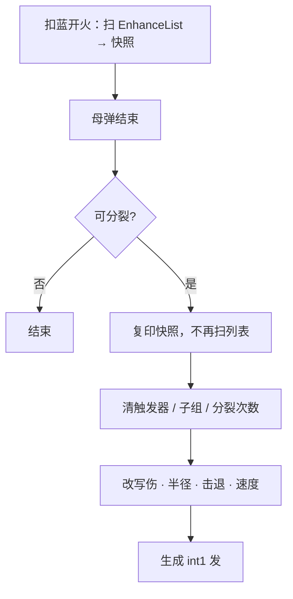

# 分裂（Spell3013 / SpellSplit）逆向分析

> 范围：仅玩家强化符文「分裂」（`abilityType = 3013`，配置 ID `30131–30133`）。重点是**子弹继承哪些其它 Buff / 强化 / 触发器**。
> 不展开绚丽烟火（`OnOverSplitTrigger = 3202`）、闪电链自身的分裂弹、召唤触手分裂、敌人分裂弹。
> 方法：`SpellConfig.json` + 反编译 `Assembly-CSharp` 交叉验证。未标注「推测」的结论均有代码/数据直接证据。
> 玩家施法主路径是 ECS。Mono `SpellBase.TrySplit` 为残留轨，系数略有不同，文末单独对照。
> 配套：总览见《魔法工艺法术系统逆向报告.md》，原始数值见《法术数值总表.md》，悬停结束才分裂见《悬停逆向分析.md》，闪电链分裂弹系数见《闪电链逆向分析.md》。

---

## 1. 身份与定位

| 项 | 值 |
| --- | --- |
| 中文名 | 分裂 |
| 英文名 | Split |
| `abilityType` | `3013` / `SpellAbilityType.SpellSplit` |
| 配置 ID | `30131`（Lv1）/ `30132`（Lv2）/ `30133`（Lv3） |
| 稀有度 | 普通（`dropType=1`） |
| `useType` | `2`（Enhance 强化符文） |
| 槽位消耗 | `slotCost=1`，自身 `mpCost=0`、`damage=0` |
| 作用对象 | `haveEffecforMissileSpell=true`，`haveEffecforSummonSpell=false` |
| 合成 | Lv1→Lv2→Lv3（`canCompound`：Lv1/2=`true`，Lv3=`false`） |
| 售价（金币） | 12 / 36 / 108 |

**机制一句话**：母弹生命结束（含悬停第二段走完）时，按发射快照再生成 `int1` 发子法术；子弹**不会再扫一遍 EnhanceList**，而是复制母弹发射时的 `SpellSpawnParams`，清掉触发器 / 子组 / 分裂次数，再改写伤害、半径、击退、速度。

> **EnhanceList 是发射前的 Buff 集合，只在扣蓝开火时扫描一次做计算；分裂只复印那次的计算结果。**
---
文案（`TextConfig_Spell` id `7130131–7130133`）：

> 法术结束时会分裂成 **int1** 个伤害 × **int2**% 的法术

名称（`7030131–7030133`）：分裂 / Split。三级名称相同，只有 `int1` 不同。

---

## 2. 数值结构

### 2.1 配置表（`assets_export/SpellConfig.json`）

| ID | Level | int1 分裂数 | int2 文案伤害% | float3 | float1 | float2 | 耗蓝倍率 | 售价 | 可合成 |
| --- | --- | --- | --- | --- | --- | --- | --- | --- | --- |
| 30131 | 1 | **3** | 33 | 0.33 | 0.5 | 0.7 | ×150% | 12 | true |
| 30132 | 2 | **5** | 33 | 0.33 | 0.5 | 0.7 | ×150% | 36 | true |
| 30133 | 3 | **8** | 33 | 0.33 | 0.5 | 0.7 | ×150% | 108 | false |

规律：`int1` 每级增加；售价每级 ×3。多张分裂的 `int1` **相加**（`SpellShootData.GetSplitCount`）。

### 2.2 字段语义

| 字段 | 语义 | 运行时是否被读 | 置信度 |
| --- | --- | --- | --- |
| **int1** | 分裂出的子弹数量（多张求和） | 是 | 高 |
| **int2** | 文案伤害百分比（33） | 仅文案 | 高 |
| **float3** | 与 int2 对应的 0.33 | ECS **未读**；`SipToSSP` 把 `DamageRatio` **写死为 0.33f** | 高 |
| float1 / float2 | 配置 0.5 / 0.7 | ECS `ToSplit` **未读** | 高 |
| `mpCostMulDivCorrection=150` | 母弹耗蓝 ×150%；子弹不再耗蓝 | 是（发射扣蓝时） | 高 |

ECS 子弹改写（与配置字段脱钩，以代码为准）：

| 项 | 系数 | 证据 |
| --- | --- | --- |
| 伤害 | `Damage.MulRatio *= 0.33` | `ToSplit` 读 `splitData.DamageRatio`；该值在 `SipToSSP` 写死 |
| 半径 | `Radius.Base/Extra *= 0.8` | `ToSplit` |
| 击退 | `Knockback *= 0.5` | `ToSplit` |
| 速度（非坠落） | `Speed *= 0.5` | `ToSplit` |
| 坠落 | 标记已落地反弹，`FallingReboundForceRatio *= 0.7` | `ToSplit` |
| 低帧 | 少生子弹，伤害 / `SpellEfficiency` 按比例补回 | `SpellDestroySystem.Split` |

---

## 3. 继承模型（核心）

子弹**不是「再跑一遍 EnhanceList」**。流程：

1. 发射时 `ShootSpellUtils.SipToSSP` 把左侧强化烘焙进 `SpellSpawnParams`，并存进 `SpellSingleton.SpellSpawnParamsStorage[entity]`。
2. 母弹挂 `SpellDestroyTag` 且带 `SpellSplitComponentData`、未标 `DisableSplitEffect` 时，`SpellDestroySystem.Split` 调 `ToSplit`。
3. `ToSplit`：**整包复制快照** → `ClearTriggerInfoAndSubGroup` → `IsSplitSpell=true`、`Split.Count=0` → 改写伤害 / 半径 / 击退 / 速度。
4. 子参数再进 `SpellShootSystem.SpawnSpellEntity`，快照里还在的栏位会重新挂到子弹上。

**继承的是发射当下的快照，不是母弹「现在剩多少」。** 穿透、反弹、持续、折射次数都是发射时的满额。计时器随快照重开（`DurationTimer` / `HoverTimer` 为 0），子弹重新飞完整段飞行 + 悬停。

唯一活体例外：若母弹有 `SpellChargeData`，`ChargeTimer` 从母弹**当前值**抄到子弹。

### 3.1 速查

| 判定 | 含义 | 代表 |
| --- | --- | --- |
| **传（已烘焙）** | 数值 / 运动 / 元素已写进快照，整包复制 | 伤害、持续、速度、范围、暴击、元素、穿透、反弹、折射、悬停、追赶 / 环绕、坠落、肥胖、聚爆、半途传送、闪电链（链伤再 ×0.35） |
| **不传（清掉或挡住）** | 生成前清掉，或 `IsSplitSpell` 不挂组件 | 五类触发器（见第 4 节）、后槽子组、再分裂、结束传送、常驻施法黏连、蓝符文回魔 |
| **不重跑** | 发射时已发生，子弹不再触发一次 | 齐射、多重施法、超载散射 |
| **满额重开** | 不是母弹剩余量（见 3.2） | 穿透、反弹、持续、悬停、折射次数 |

### 3.2 「满额重开」怎么理解

子弹拿到的是**开火当时的完整额度，并且计时从零再走一遍**；不是母弹死掉那一刻「还剩多少」。分裂复印的是发射快照，不是母弹身上已经被消耗过的活体状态。

| 例子 | 母弹飞行中 | 子弹拿到的 |
| --- | --- | --- |
| 穿透 3 | 已经穿了 2 个，还剩 1 | 仍是 **3**，不是 1 |
| 反弹 4 | 已经弹了 1 次，还剩 3 | 仍是 **4** |
| 折射 2 | 已经折过 1 次 | 仍是 **2** |
| 持续 5 秒 / 悬停 2 秒 | 飞了 4 秒、悬停也快走完才分裂 | `DurationTimer` / `HoverTimer` 都是 **0**，再飞满 5 秒 + 再悬停 2 秒 |

拆开两个字：

- **满额**：次数、时长用发射时算好的完整值
- **重开**：计时器归零，子弹当一发新法术重新活一遍

对照：伤害不是满额重开——快照里的伤害会再乘 0.33。只有穿透、反弹、持续、悬停、折射次数走这套「用满、重计」。

唯一例外是充能条 `ChargeTimer`：从母弹**当前值**抄，不是满额重开。

---

## 4. 明确不继承：触发器 / 子组 / 再分裂

**五类触发器**指法杖上挂在主动法术后面、靠时机再放后槽的 5 种触发符文（`Triggers`，不是 EnhanceList 里的伤害/穿透等强化）：

| 类型 | ID | 中文名 |
| --- | --- | --- |
| 结束触发 | 3201 `OnOverTrigger` | 二重奏 |
| 结束分裂触发 | 3202 `OnOverSplitTrigger` | 绚丽烟火 |
| 移动触发 | 3203 `OnMoveTrigger` | 连环 |
| 起始环绕触发 | 3204 `OnStartRotationTrigger` | 缠绕 |
| 命中触发 | 3205 `OnHitTrigger` | 回响 |

后槽整组（`SubGroup`）挂在这些触发器后面：触发器被清掉，后槽也不会再被子弹打出来。`ToSplit` 里 `ClearTriggerInfoAndSubGroup` 无条件执行：

| Buff | ID / 类型 | 子弹结果 |
| --- | --- | --- |
| 二重奏（结束触发） | 3201 `OnOverTrigger` | `OverTriggerComponentData` 清成 default，不挂 |
| 绚丽烟火（结束分裂触发） | 3202 `OnOverSplitTrigger` | `OverSplitTriggerBufferEntity = Null` |
| 连环（移动触发） | 3203 `OnMoveTrigger` | `MoveTriggerComponentData` 清掉 |
| 缠绕（起始环绕触发） | 3204 `OnStartRotationTrigger` | `TwineTriggerComponentData` 清掉 |
| 回响（命中触发） | 3205 `OnHitTrigger` | `HitTriggerComponentData` 清掉 |
| 触发器后槽整组 | `SubGroup` | `SubGroupEntity = Null`，后槽法术不再被触发 |
| 分裂自己 | 3013 `SpellSplit` | `SplitComponentData.Count = 0`，子弹不再分裂 |

母弹已经触发过的后槽，子弹**不会再触发一次**。

防递归还有第二道：`IsSplitSpell = true`。Mono 残留下 `TrySplit` 同样在 `isSplitSpell` 或 `spellSplitCount==0` 时直接返回空。

---

## 5. 快照里还在、但被 `IsSplitSpell` 挡住

| Buff / 行为 | 快照 | 生成条件 | 子弹实际 |
| --- | --- | --- | --- |
| 结束传送 3116 | `SpellEndTeleport` 仍为 true | `SpellEndTeleport && !IsSplitSpell` 才加 `SpellEndTeleportTag` | **不传送** |
| 龙息 / 分解射线 / 高压水枪常驻施法 | 元件条件仍在 | 再加 `!IsSplitSpell` | **不挂 KeepCasting、不黏玩家** |
| 加特林鸽（1031）环绕角 | — | `ShotGun && !IsSplitSpell` 才均分 360° | 子弹走一般环绕 |
| 加特林鸽射击音 | — | `PrefabId==1031 && IsSplitSpell` 不播 | 静音 |
| 蓝符文回魔 | 子弹实体仍是蓝符文 | `IsSplitSpell` 直接 `continue` | **不回魔** |

---

## 6. 已烘焙 → 子弹带着走

这些不是「再挂一张符文」，而是发射时已写入 `Config` / `Movement` / `Element` / 其它快照字段。

### 6.1 纯数值强化

| Buff | abilityType | 写入位置 | 子弹效果 |
| --- | --- | --- | --- |
| 伤害强化 | 3102 | `Damage.AddRatio` | 继承后再 ×0.33 |
| 过载 | 3123 | 同一加算池 | 同上 |
| 炽焰晶石的伤害段 | 3111 | `Damage.AddRatio` + 燃烧 Element | 伤害与燃烧都在 |
| 节能模式的伤害段 | 3104 | `Damage.MulRatio` | 继承 |
| 折射的伤害段 | 3121 | `Damage.MulRatio` | 继承；次数见 6.3 |
| 时长强化 | 3103 | `Duration.AddBase` | 满额重计时 |
| 节能模式的持续段 | 3104 | `Duration.MulRatio` | 同上 |
| 公转的额外持续 | 3009 | `Duration.Extra` | 同上 |
| 自由公转的持续 | 3117 | `Duration.AddBase` | 同上 |
| 主观缓时 | 3128 | 发射时已加进 Duration、乘进 Speed | 两段都在 |
| 精准施法 | 3105 | `CriticalChance` | 继承；溢出转伤旗标也在 |
| 加速器 | 3106 | Speed 加算 | 再 ×0.5（非坠落） |
| 寻踪的速度段 | 3010 | Speed 加算 | 同上 |
| 范围增强 | 3107 | `Radius.AddRatio` | 再 ×0.8 |
| 聚爆 | 3113 | `Radius.MulRatio` + `radiuDecrease*` | 半径与换伤比都在 |
| 虚胖法术 | 3124 | `SpellExtraSizeRatio` | 继承体积比 |
| 魔能升阶 | 3126 | 槽位阶段已改母法术等级 | 子弹用已升等的母法术数值 |
| 拟态魔方 | 3109 | `GetFinalConfig` 已解析 | 子弹是「模仿后的那发」 |

耗蓝修正（多重 / 分裂 / 节能 / 过载的 `mpCostMulDivCorrection`）只在**母弹发射扣蓝**时用过，子弹不扣蓝。

### 6.2 弹道形态

发射时 `GetSpellMovementType` **从右往左**只取第一个命中的运动类型，快照里只有这一种。

| Buff | 子弹运动 | 备注 |
| --- | --- | --- |
| 公转 3009 / 自由公转 3117 | `Rotation` | `AroundTarget` 改成母弹实体；母弹随即销毁，中心退回分裂点 |
| 寻踪 3010 | `ChaseMouse` | `ChaseMouseLerpSpeed` 一起复制 |
| 自动导航 3011 | `ChaseEnemy` | `ChaseRotateSpeed` 复制 |
| 自我追踪 3114 | `ChaseOwner` | 同上 |
| 悬停 3008 | `HoverDuration` | 计时器从 0 再走完；分裂发生在悬停第二段结束 |
| 坠落 3119 | `IsFallSpell` | 见第 2.2 节坠落改写 |
| 反向施法 3125 | `ReserveDirection` | 方向旗标在；不会再翻一次发射角 |
| 随机落点瞄鼠标 4022 | `RandomPosFocusMouse` → `SpellRemoteShootTag` | 继承 |

### 6.3 命中 / 生存（满额，不是母弹剩余）

| Buff | 子弹拿到的 |
| --- | --- |
| 穿透 3006 | 发射时的完整穿透次数 |
| 反弹 3012 | 完整次数 + `ReboundAddTime` |
| 折射 3121 | `RemainCount` = 发射时次数（母弹已折射过也不扣） |
| 半途传送 3130 | `HalfLifeTeleport` 次数 / 半径；坠落、符文锤、激光、龙息、高压水枪不挂 |
| 无视墙壁（遗物） | `IsIgnoreWall` |

### 6.4 元素晶石（`ElementComponentData` 整包复制）

| Buff | 继承字段 |
| --- | --- |
| 粘液晶石 3004 | 持续、移速比、法术速度比 |
| 毒液晶石 3005 | 持续、层数（生成时层数再 × `SpellEfficiency`） |
| 寒霜晶石 3014 | `FrozenDuration` |
| 炽焰晶石 3111 | 燃烧时长、每秒烧血% |
| 雷霆晶石 3101 | `ThunderHitRadius`、`ThunderHitDamageRatio`（半径已含范围强化） |
| 坍缩晶石 3129 | 虚空即死阈值、爆炸伤、爆炸范围 |
| 强力牵引 3112 | 拉扯范围 / 力 / 次数（在 Config，不在 Element） |

雷霆晶石的 **HitChance 没有写入 ECS Element**（母弹也没有），不是分裂特有缺口。

法杖随机染色 / 彩虹丝带在发射时已写入 Color + Element，子弹带着走。

### 6.5 闪电链 3007

- `LightningChainDamage` 在快照里，子弹会再走 `TrySpawnLightningChain`。
- 子弹链伤 = 快照链伤 **× 0.35**（还可能再乘低帧补偿）。
- 穿透用 `1 + BonusPenetrate`（发射时穿透数）。
- 彼岸刃 / 伞 / 符文锤 / 激光束本来就不在发射时生成链。

### 6.6 法杖 / 充能 / 击杀掉落

| 来源 | 子弹 |
| --- | --- |
| 击杀掉金币 / 水晶法杖 | `DropCoin/CrystalRatioOnKill` 继承 |
| 友伤降低法杖 | `UndifferDamageRatio` 继承 |
| 四向法杖角 | `FourDirectionWandAngle` 继承 |
| 充能模式 4004 | **从母弹当下 `ChargeTimer` 抄**（唯一活体例外） |
| 回响符文 / 后槽发射 | `FromEcho` / `FromPostSlot` 旗标在 |
| 红符文可触发 | `EnableTriggerRedRune` 在 |
| `Wand` 引用 | 同一把杖 |

---

## 7. 发射时一次性：不重触发

| Buff | 母弹发射时 | 子弹 |
| --- | --- | --- |
| 齐射 3001 | 多发同时生成 | 不再齐射 |
| 多重施法 3002 | 连发多发 | 不再连发；`MultiShootAddictionCount` 仍在，只给激光 / 破法者等读偏移 |
| 超载散射 3003 | 加同时发数 | 不再散射 |
| 均分角度（杖被动 / 散弹） | 发射时算角 | 子弹用分裂自己的均分角（360°/N + 随机起点） |

---

## 8. 召唤专用强化

分裂配置 `haveEffecforSummonSpell=false`（自动填槽不往召唤上插）。下列字段会进 `TeammateComponentData` 快照：挂在**弹道**上通常没有召唤体可作用；若极少数路径把召唤当法术实体再分裂，理论上会跟着走。

| Buff | 快照字段 |
| --- | --- |
| 寄生虫 3015 | 掉血、产虫数、攻速 / 移速比 |
| 脐带 3110 | `LifeLineDamage`；生命线实体自己会 `DisableSplitEffect` |
| 巨魔血清 3108 | 每秒回血、HP 比 |
| 融合召唤 3115 | 融合等级 |
| 精魄 3120 | 进阶技能等级 |
| 尸爆术 3118 | 即死阈值、爆炸 |
| 不屈 3122 | 延迟死亡时间 |
| 灵魂链接 3127 | 穿墙率、吸血比 |

其它会关掉分裂的路径：`DisableSplitEffect` 还出现在队友死亡、绿符文记录、红符文斩击、`SpellTools` 若干生成。

---

## 9. 逐条总表（强化 3001–3130 + 触发器 3201–3205）

图例：`继承` = 已烘焙效果传到子弹；`清除` = 明确清掉；`挡住` = 快照有、生成不挂；`不重跑` = 发射一次性；`满额` = 不是母弹剩余。

| ID | 中文名 | 类型 | 继承判定 | 子弹上实际发生什么 |
| --- | --- | --- | --- | --- |
| 3001 | 齐射 | 发射形态 | 不重跑 | 不再齐射 |
| 3002 | 多重施法 | 发射形态 | 不重跑 | 不再连发；偏移计数仍在 |
| 3003 | 超载散射 | 发射形态 | 不重跑 | 不再散射 |
| 3004 | 粘液晶石 | 元素 | 继承 | Element 整包 |
| 3005 | 毒液晶石 | 元素 | 继承 | 层数 × SpellEfficiency |
| 3006 | 穿透 | 生存 | 继承 / 满额 | 发射时完整次数 |
| 3007 | 闪电链 | 命中附加 | 继承后打折 | 再生成链，伤害 ×0.35 |
| 3008 | 悬停 | 生命周期 | 继承 / 满额 | Hover 从 0 再走完 |
| 3009 | 公转 | 运动 | 继承 | Rotation；中心退回分裂点 |
| 3010 | 寻踪 | 运动 | 继承 | ChaseMouse |
| 3011 | 自动导航 | 运动 | 继承 | ChaseEnemy |
| 3012 | 反弹 | 生存 | 继承 / 满额 | 完整次数 + 加时 |
| **3013** | **分裂** | **自身** | **清除** | **Count=0，不再分裂** |
| 3014 | 寒霜晶石 | 元素 | 继承 | FrozenDuration |
| 3015 | 寄生虫 | 召唤 | 快照在 / 弹道无对象 | Teammate 字段 |
| 3101 | 雷霆晶石 | 元素 | 继承（无 Chance） | 半径 + 伤害比 |
| 3102 | 伤害强化 | 数值 | 继承 | AddRatio 后再 ×0.33 |
| 3103 | 时长强化 | 数值 | 继承 / 满额 | 持续重开 |
| 3104 | 节能模式 | 数值 | 继承 | 伤 / 持续已烘焙；耗蓝不重扣 |
| 3105 | 精准施法 | 数值 | 继承 | CriticalChance |
| 3106 | 加速器 | 数值 | 继承 | 速度后再 ×0.5 |
| 3107 | 范围增强 | 数值 | 继承 | 半径后再 ×0.8 |
| 3108 | 巨魔血清 | 召唤 | 快照在 / 弹道无对象 | Teammate |
| 3109 | 拟态魔方 | 槽位解析 | 继承结果 | 已是模仿后的法术 |
| 3110 | 脐带 | 召唤 | 快照在；自身禁分裂 | DisableSplitEffect |
| 3111 | 炽焰晶石 | 数值+元素 | 继承 | 伤害加算 + 燃烧 |
| 3112 | 强力牵引 | 命中附加 | 继承 | 引力三字段 |
| 3113 | 聚爆 | 数值 | 继承 | 缩小 + 换伤 |
| 3114 | 自我追踪 | 运动 | 继承 | ChaseOwner |
| 3115 | 融合召唤 | 召唤 | 快照在 / 弹道无对象 | Teammate |
| 3116 | 结束传送 | 结束行为 | 挡住 | 不传送 |
| 3117 | 自由公转 | 运动 | 继承 | Rotation |
| 3118 | 尸爆术 | 召唤 | 快照在 / 弹道无对象 | Teammate |
| 3119 | 坠落 | 运动 | 继承 + 改写 | 已反弹、力 ×0.7 |
| 3120 | 精魄 | 召唤 | 快照在 / 弹道无对象 | Teammate |
| 3121 | 折射 | 生存+数值 | 继承 / 满额 | 次数满额 + 伤害倍率 |
| 3122 | 不屈 | 召唤 | 快照在 / 弹道无对象 | Teammate |
| 3123 | 过载 | 数值 | 继承 | 同伤害加算池 |
| 3124 | 虚胖法术 | 数值 | 继承 | ExtraSizeRatio |
| 3125 | 反向施法 | 发射旗标 | 继承旗标 / 不重跑翻角 | ReserveDirection |
| 3126 | 魔能升阶 | 槽位解析 | 继承结果 | 已升等的母法术 |
| 3127 | 灵魂链接 | 召唤 | 快照在 / 弹道无对象 | Teammate |
| 3128 | 主观缓时 | 数值 | 继承 | 速 / 持续已烘焙 |
| 3129 | 坍缩晶石 | 元素 | 继承 | 虚空三字段 |
| 3130 | 半途传送 | 生存 | 继承（部分法术不挂） | HalfLifeTeleport |
| 3201 | 二重奏 | 触发器 | 清除 | 不触发后槽 |
| 3202 | 绚丽烟火 | 触发器 | 清除 | 不结束分裂 |
| 3203 | 连环 | 触发器 | 清除 | 不移动触发 |
| 3204 | 缠绕 | 触发器 | 清除 | 不环绕触发 |
| 3205 | 回响 | 触发器 | 清除 | 不命中触发 |

---

## 10. 生成与特殊法术补丁

`SpellDestroySystem.Split` 在 `ToSplit` 之后还会按母弹**当前实体**补几项（不是整包改用活体 Config）：

| 法术 | 补丁 |
| --- | --- |
| 通用 | 位置 = 母弹当前位置；方向均分 360°；坠落用母弹坐标，否则沿方向偏移半径（或 0.333） |
| 审判之刃 | 生成点再沿方向偏 0.5/1，方向取反 |
| 魔力金币 | 抄活体 `CoinUseCount`、`BuffRatio` |
| 次元旅行者 | 重力清 0，抄活体坠落速度与加成伤 / 持续 |
| 破法者 | 抄 `Int3`；非坠落把 `AroundCenter` 设为母弹位置 |
| 落雷阵 `1018`（`ThunderAura`） | 重力与坠落速度清 0（`SpellDestroySystem.cs` L568–571）；子光环形态见 10.1 |

（本表原把 1018 写作「雷霆光环」，那是 `ThunderAura` 的直译；游戏内中文名是**落雷阵**，已更正。）

分裂发生在母弹销毁当帧。悬停法术要等 `HoverTimer` 走完才销毁，因此「悬停 + 分裂」的分裂点在悬停结束，不是飞行刚停（见《悬停逆向分析.md》）。

**激光 `1004` 的分裂点在射线尖端。** 激光是 hitscan，`Spell1004LaserJob` L651 把实体 `Transform.Position` 搬到了折线远端（`lineBuffer[0]`），而通用补丁的生成点 = 母弹**当前位置** —— 所以分裂子弹是从射线的**尖端 / 命中点**炸出来的，不是从施法者身上。又因为激光寿命只有 0.2 s（硬编码 `0.2 + HoverDuration`，不读 `Duration`），分裂在开火后约 0.2 s 就发生，体感接近「远程范围爆发」而不是「二段弹幕」。

子激光继承 `IsSplitSpell` 那套满额规则：等级、`Int1`（折射底数）、穿透、反弹都按**满额**重开（不是母弹剩余），伤害与 `Speed` 按 3.1 的比例减半 —— 对激光来说 `Speed` 就是射线长度预算，所以子激光是**半长**射线。母弹的 `SpellRefractionHitEntities` 缓冲不继承，子激光的折射忽略集从空开始。方向按均分 360°，跟母弹朝向无关。详见《激光逆向分析.md》§7.5。

### 10.1 落雷阵 `1018`：分裂把一个光环变成一圈光环

落雷阵是 `speed = 0`、`duration = 5`、`isDPS = true` 的静止光环，第 2.2 节那套改写落在它身上和落在飞弹上完全不是一回事。

| 改写项 | 母体（Lv3） | 子体 | 说明 |
| --- | --- | --- | --- |
| 伤害 `Damage.MulRatio` | `damage = 88`（每目标**每秒**） | ×0.33 → **29.04** | `isDPS` 再乘 `DamageInterval`，每 tick 每目标 `29.04 × 0.25 = 7.26` |
| 半径 `Radius.Base/Extra` | 3.2 | ×0.8 → **2.56** | 半径同时也是传导环带底数（×1.5）和分裂铺开半径 |
| 击退 `Knockback` | 0 | ×0.5 → 0 | 本来就是 0 |
| 速度 `Speed` | 0 | ×0.5 → **0** | 非坠落分支，对 `Speed = 0` 无意义 |
| 持续 `Duration` | 5 | **满额重开 5 秒** | `DurationTimer` 归零，见 3.2 |
| `Int1`（单次结算命中上限） | 7 | **7，不打折** | `ToSplit` 不动 `Int1` |

生成位置走通用补丁：角度 = `随机基角 + 360° × (i / N)`，位置 = `母体位置 + Direction × Radius.Calculate()`（`SpellDestroySystem.cs` L522–539）。`Radius` 在这里非 0，所以子体铺在母体**半径圈的边缘**，而不是原地叠一堆。

**净效果：母光环消失的瞬间，在它的半径圈上均匀铺开 N 个 80% 大小的子光环，各自再跑满 5 秒。** 落雷阵 Lv3 + 分裂 Lv3（`int1` 求和 = 8）满命中理论总伤 `8 × 20 tick × 7 目标 × 7.26 = 8131`，是母体 3080 的 **2.6 倍**；覆盖范围从一个 32 m² 的圆变成半径 3.2 圈上的 8 个 2.56 m 圆（总直径约 11.5 m）。**分裂是落雷阵最强的面积扩张手段。** 时长强化 / 悬停只是让分裂延后触发，和它不冲突。

顺带两条：

- `case SpellAbilityType.ThunderAura` 那条补丁（`Gravity = 0`、`CurrentFallSpeed = 0`）只在插了坠落时才看得出来：光环形态本身既没有重力也没有下坠速度，清零等于无事发生。
- 雷霆晶石在**销毁那一刻**落雷，所以「落雷阵 + 分裂 Lv3 + 雷霆晶石」= 母体 1 次 + 8 个子体各 1 次 = **9 次落雷**，这是落雷阵少见的能把雷霆晶石用起来的组合。

详见《落雷阵逆向分析.md》7.5 / 7.15。

---

## 11. Mono 残留轨对照

`SpellBase.TrySplit` / `CreateSplitSpell` 仍可能被分裂弹或旧路径走到。与 ECS 的差异：

| 项 | ECS（玩家主路径） | Mono |
| --- | --- | --- |
| 配置来源 | 发射快照 `SpellSpawnParams` | `InitialParameter.Copy()` + `ShootData.Copy`（`SubGroup=null`） |
| 伤害 | ×0.33 | ×0.35（`finalDamageRatio`） |
| 链伤 | 再生成时 ×0.35 | `lightningChainDamage × 0.5` 后 `CreateChains` |
| 半径 / 体型 | Radius ×0.8 | `finalSizeRatio × 0.8` |
| 击退 | ×0.5 | `finalKnockBackRatio × 0.5` |
| 速度 | 非坠落 ×0.5 | 非坠落 `finalSpeedRatio × 0.5` |
| 再分裂 | `Count=0` | `spellSplitCount=0` 且 `isSplitSpell=true` |
| 触发器 | 五类字段清掉 | `SubGroup=null`，`InitTriggerController` 无组则 Disable |

讨论玩家构筑时以 **ECS 表（第 9 节）** 为准。

---

## 12. 证据索引

| 文件 | 作用 |
| --- | --- |
| `SpellSpawnParamsStorage.ToSplit` / `ClearTriggerInfoAndSubGroup` | 复制快照、清触发器、改写系数、Count=0 |
| `SpellDestroySystem.Split` | 销毁时生成子弹、低帧减数、特殊法术补丁 |
| `SpellShootSystem.SpawnSpellEntity` | 按快照挂组件；`IsSplitSpell` 挡住结束传送 / 常驻施法 |
| `ShootSpellUtils.SipToSSP` | 发射时把 EnhanceList 烘焙进快照；`DamageRatio=0.33f` 写死 |
| `SpellInitialParameter.Builder.ProcessShootDataEffect` | Enhance → SIP 字段 |
| `SpellShootData.GetSplitCount` 等 | 各强化如何进 SIP |
| `CanShootSpellUtils.GetDamage` | 伤害强化 / 炽焰 / 过载加算，折射 / 节能乘算 |
| `SpellBase.TrySplit` / `CreateSplitSpell*` | Mono 残留 |
| `SpellConfig.json` `30131–30133` | 配置原始值 |
| `TextConfig_Spell` `703013*` / `713013*` | 名称与文案 |
