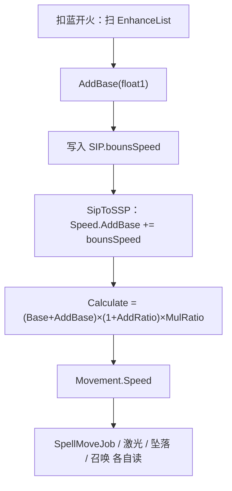

# 加速器（Spell3106 / EnhanceSpeedValue）逆向分析

> 范围：仅玩家强化符文「加速器」（`abilityType = 3106`，配置 ID `31061–31063`）。重点是**飞行速度怎么加算**，以及**会改这份速度怎么被读的其它法术**。
> 不展开遗物/诅咒逐条来源，也不穷尽每个 `abilityType` 的 Job。
> 方法：`SpellConfig.json` + 反编译 `Assembly-CSharp` 交叉验证。未标注「推测」的结论均有代码/数据直接证据。
> 玩家施法主路径是 ECS。Mono `SpellBase` 叠加上限与 ECS 一致，文末单独对照。
> 配套：总览见《魔法工艺法术系统逆向报告.md》，原始数值见《法术数值总表.md》，加算容器见《伤害强化逆向分析.md》，子弹速度再 ×0.5 见《分裂逆向分析.md》。

---

## 1. 身份与定位


| 项 | 值 |
| --- | --- |
| 中文名 | 加速器 |
| 英文名 | Accelerator |
| `abilityType` | `3106` / `SpellAbilityType.EnhanceSpeedValue` |
| 配置 ID | `31061`（Lv1）/ `31062`（Lv2）/ `31063`（Lv3） |
| 稀有度 | 普通（`dropType=1`） |
| `useType` | `2`（Enhance 强化符文） |
| 槽位消耗 | `slotCost=1`，自身 `mpCost=0`、`damage=0` |
| 作用对象 | `haveEffecforMissileSpell=true`，`haveEffecforSummonSpell=true` |
| 合成 | Lv1→Lv2→Lv3（`canCompound`：Lv1/2=`true`，Lv3=`false`） |
| 售价（金币） | 7 / 21 / 63 |


**机制一句话**：插在主动/召唤**左侧**的纯数值符文；把 `float1` 写进飞行速度的**加算池**（`AddBase`）。发射时只扫一次，烘焙成 `SIP.bounsSpeed` → 快照 `Speed.AddBase` → `AttributeValue.Calculate()` 得到实体 `Movement.Speed`。没有独立 ECS 系统。



文案（`TextConfig_Spell` id `7131061–7131063`）：

> 法术飞行速度+**float1**

名称（`7031061–7031063`）：加速器 / Accelerator。三级名称相同，只有 `float1` 不同。

---

## 2. 数值与叠加

### 2.1 配置表（`assets_export/SpellConfig.json`）


| ID | Level | float1 加算速度 | 售价 | 可合成 |
| --- | --- | --- | --- | --- |
| 31061 | 1 | **3** | 7 | true |
| 31062 | 2 | **6** | 21 | true |
| 31063 | 3 | **12** | 63 | false |


规律：`float1` 每级 ×2；售价每级 ×3。其余 `int/float` 全 0，不用。无耗蓝倍率。

### 2.2 字段语义


| 字段 | 语义 | 运行时是否被读 | 置信度 |
| --- | --- | --- | --- |
| **float1** | 飞行速度加算（多张**相加**） | 是 | 高 |
| int1 / int2 / int3 / float2 / float3 | 配置为 0 | ECS **未读** | 高 |
| `haveEffecforMissile/Summon` | 对弹幕与召唤都标为生效；**`GetSpellFlySpeed` 不读这两个字段** | 过滤只出现在自动填槽 | 高 |


叠加入口：`SpellShootData.GetSpellFlySpeed`。

```79:98:decompiled/Assembly-CSharp/SpellShootData.cs
	public RatioValue GetSpellFlySpeed()
	{
		RatioValue ratioValue = new RatioValue(Spell.GetFinalConfig().speed);
		// ...
			switch (finalConfig.abilityType)
			{
			case SpellAbilityType.AroundMouse:
			case SpellAbilityType.EnhanceSpeedValue:
				ratioValue.AddBase(finalConfig.float1);
				break;
			case SpellAbilityType.SpeedToDuration:
				ratioValue.MulRatio(finalConfig.float1 / 100f);
				break;
			}
		return ratioValue;
	}
```

两张 Lv1 是 **+6**，不是 +3 再各自乘一遍。等级只改加数大小：

```
1×Lv2  = 2×Lv1  = +6
1×Lv3  = 2×Lv2  = 4×Lv1  = +12
```

槽位够时，多张低级卡在数值上可以完全替代一张高级卡。合成的意义是**省槽**。

`AroundMouse` 是寻踪（`3010`），不是公转。寻踪的 `float1` 和加速器进**同一条** `AddBase`（见 4.1）。主观缓时走 `MulRatio`，不进加算池（见 4.2）。

这个函数**不读** `haveEffecforSummonSpell`。自动填槽会往召唤上插（配置为 true）；手动插在召唤左侧同样会把 `float1` 写进快照。

---

## 3. 主路径（核心）

加速器没有自己的 Job。它只改「发射时算出来的那个速度数」，之后谁读 `Movement.Speed`（或快照里的 `SpeedAttribute`），谁就变快。

最终公式：

```
Speed = (config.speed + AddBase) × (1 + AddRatio) × MulRatio
```

加速器只写 `AddBase`。当前配置下它自己不改 `AddRatio` / `MulRatio`。

### 3.1 发射时烘焙，只扫一次

`SpellInitialParameter.Builder.ProcessShootDataEffect` 调 `GetSpellFlySpeed`，把三个通道拆开写入 SIP：


| RatioValue | 写入 SIP | 加速器贡献 |
| --- | --- | --- |
| `CurrentAddBase` | `bounsSpeed +=` | `Σ float1` |
| `CurrentAddRatioStartZero` | `extraSpeedRatio +=` | **0** |
| `CurrentMulRatio` | `finalSpeedRatio *=` | **1**（除非同侧有主观缓时） |


```304:307:decompiled/Assembly-CSharp/SpellInitialParameter.cs
			RatioValue spellFlySpeed = shootData.GetSpellFlySpeed();
			data.extraSpeedRatio += spellFlySpeed.CurrentAddRatioStartZero;
			data.finalSpeedRatio *= spellFlySpeed.CurrentMulRatio;
			data.bounsSpeed += spellFlySpeed.CurrentAddBase;
```

同字段还会被**反向施法**加上：`reverseDirection` 为真时 `bounsSpeed += reverseCastBonusSpeed`（`3125` 的 `float1`）。这不是加速器的规则，但进的是同一个 `AddBase`。

实际发射**不走** `GetSpellMoveSpeed_FinalPlayerValue`。那个扩展函数会再乘诅咒「降低法术飞行速度」，只给攻击距离估算用。

### 3.2 快照：算出一个数，写进实体

`ShootSpellUtils.SipToSSP`：

```198:235:decompiled/Assembly-CSharp/ShootSpellUtils.cs
		attributeValue.Base = configCopy.speed;
		attributeValue.AddBase = ((sip.finalMovementType != SpellSpecialMovementType.Rotation) ? 0f : (sip.RotationMovementInfo?.extraSpeed ?? 0f)) + sip.bounsSpeed;
		attributeValue.AddRatio = sip.extraSpeedRatio;
		attributeValue.MulRatio = sip.finalSpeedRatio;
		// ...
			Speed = speedAttribute.Calculate(),
```

`AttributeValue.Calculate()`：`(Base + AddBase) * (1 + AddRatio) * MulRatio + Extra`。

只有运动类型是公转（`Rotation`）时，才把公转自己的 `extraSpeed` 并进 `AddBase`（见 4.3）。加速器的 `bounsSpeed` **无论什么运动类型都会加**。

同一份 `speedAttribute` 还会存进 `ssp.SpeedAttribute`。生成时若实体有 `SpellSpeedRatioValueData`（召唤），就把这份结构拷过去，供注册时重算（见 4.7）。

普通弹之后飞行中改的是实体上的 `Movement.Speed`。快照里仍是发射时的满额（分裂复印后再 ×0.5，见 4.4）。

### 3.3 飞行时怎么读

`SpellMoveJob` 多数分支是 `velocity.Linear = Direction * Speed`（或 lerp 到这个目标）。加速器不改方向、不改持续时间、不改碰撞。

以魔法弹（`10011`，`speed=16`）为例：


| 左侧 | `AddBase` | `Movement.Speed` |
| --- | --- | --- |
| 无加速器 | 0 | **16** |
| 一张 Lv1 | 3 | **19** |
| 两张 Lv1 / 一张 Lv2 | 6 | **22** |
| 一张 Lv3 | 12 | **28** |


持续仍是 0.5 秒。飞得更快，同一寿命里走得更远。

---

## 4. 和其它法术的关系

只写会改这份速度怎么叠、怎么被读的交互。伤害强化 / 范围增强 / 穿透只改别的通道，不列。

### 4.1 寻踪 3010

`GetSpellFlySpeed` 里寻踪（`AroundMouse`）和加速器走**同一句** `AddBase(float1)`。

寻踪三级 `float1` 是 1 / 2 / 4（文案也是「法术飞行速度+float1」）。`[加速器 Lv1][寻踪 Lv1][魔法弹]` 的加算是 **3+1=4**，速度 20，不是两套互斥。

寻踪还改运动类型为 `ChaseMouse`，并写 `ChaseMouseLerpSpeed`。加速器不改这些。追赶分支里 `Speed` 既当线速度，也常当 lerp 系数的一部分，所以加算会让「拧向鼠标」也更快。

### 4.2 主观缓时 3128

`SpeedToDuration`。配置 `31281`：`float1=50`（速度 ×50%），`float2=0.5`（每降 1 点速度 +0.5 秒）。

两件事，都读已经加过加速器的速度：

1. `GetSpellFlySpeed`：`MulRatio(float1/100)` → SIP `finalSpeedRatio *= 0.5`。最终速度是 `(config.speed + AddBase) × 0.5`。
2. 换持续：先用 `Result / speedRatio` 把乘算拆回去，得到「乘之前」的速度（**含加速器加算**），再：

```900:903:decompiled/Assembly-CSharp/GeneralTool.cs
	public static float GetSpellSpeedToBonusDuration(float finalSpeed, float decreaseRatio, float speedToDurationRatio)
	{
		return finalSpeed * (1f - decreaseRatio) * speedToDurationRatio;
	}
```

魔法弹 16 + 加速器 Lv1：

| | 无加速器 | 有加速器 Lv1 |
| --- | --- | --- |
| 飞行速度 | `16 × 0.5 = 8` | `(16+3) × 0.5 = 9.5` |
| 换来的持续 | `16 × 0.5 × 0.5 = 4s` | `19 × 0.5 × 0.5 = 4.75s` |


加速器让「被换成时间的那部分速度」也变大。文案「每降低 1 点 +0.5 秒」按乘之前的速度算，不是按乘完的 8 / 9.5 算。

### 4.3 公转 3009 / 自由公转 3117

公转**不进** `GetSpellFlySpeed`。它的速度来自 `GetSpellRotationInfo` 的 `float2`（`extraSpeed`）：Lv1=**0**，Lv2=5，Lv3=10。

`SipToSSP` 只在 `finalMovementType == Rotation` 时把这份 `extraSpeed` 加进 `Speed.AddBase`，和 `bounsSpeed` 相加。自由公转只改半径随机，不写 `extraSpeed`。

所以：

- 普通直线弹 + 公转：运动类型变成公转之后，Lv2/Lv3 的 `float2` 才会叠到速度上；加速器的 `bounsSpeed` 始终在。
- `[加速器 Lv1][公转 Lv2][魔法弹]`：`AddBase = 5 + 3 = 8`，速度 24。
- 公转 Lv1 自己不加速度（`float2=0`），加速器仍然 +3。

公转还会拆掉墙层（见《反弹逆向分析.md》4.2）。那是碰撞，不是速度。

### 4.4 分裂 3013

`ToSplit` 整包复制快照，然后非坠落：`Speed *= 0.5`。乘的是已经 `Calculate()` 过的最终速度，不是「只砍基础、保留加算」。

| 母弹 | 子弹拿到的 |
| --- | --- |
| 魔法弹 16 + 加速器 +3 → 19 | **9.5** |
| 无加速器 → 16 | **8** |


坠落分裂不砍 `Speed`，改砍落地弹力（见 4.5）。计时器随快照重开。详见《分裂逆向分析.md》3.2 / 6.1。

### 4.5 坠落 3119

`SipToSSP` 末尾：非召唤且 `IsFallSpell` 时，用**已经含加速器**的 `speedAttribute.Calculate()` 调 `SpellInitialFallData`：

1. `Gravity = max(43 × speed / 16, 12)`
2. `OriginalSpellHorizontalSpeed = CurrentFallSpeed = speed`
3. 水平 `Speed *= 落点距离 / 7`

加速器会同时抬竖直初速、重力和水平速度。追赶类分支在坠落时多数改读 `OriginalSpellHorizontalSpeed`，不读被距离缩放后的 `Speed`。

分裂子弹：`IsFallSpell` 时**不** `Speed *= 0.5`，只把 `FallingReboundForceRatio *= 0.7` 并标已落地反弹。

### 4.6 激光 1004 / 分解射线 1011

不走 `SpellMoveJob` 飞。初始化时把 `Movement.Speed` 抄走，再把实体速度清 0：

- 激光：`SpellSpeed = Speed`，`remainMaxDistance = Speed`，步进 `SpellSpeed × 0.05`，然后 `Speed = 0`。加速器拉长射线预算，步长也变大。
- 分解射线：`rayData.SpellSpeed = Speed`，然后 `Speed = 0`。

对激光来说这张卡是**唯一的射程来源**（表 `speed=15` 三级不变，且没有别的字段能改射线长度）：

| 槽位 | `Speed` | 射线总长 | 曲线单步 | 曲线段数 |
| --- | --- | --- | --- | --- |
| `[激光]` | 15 | **15** | 0.75 | 20 |
| `[加Lv1(+3)] [激光]` | 18 | **18** | 0.90 | 20 |
| `[加Lv2(+6)] [激光]` | 21 | **21** | 1.05 | 20 |
| `[加Lv3(+12)] [激光]` | 27 | **27** | 1.35 | 20 |
| `[加Lv3]×2 [激光]` | 39 | **39** | 1.95 | 20 |

段数恒为 20 是因为预算与步长同比放大（`Speed / (Speed × 0.05) = 20`）→ **加速器不改曲线形状的段数，只等比放大整条线**。但每步最大转角 = `ChaseRotateSpeed × Speed × 0.05` 含 `Speed` 因子，所以加速器会让**追踪型激光拐得更急**（与自动导航 3011 乘性耦合，见《自动导航逆向分析.md》§6）。两个例外：`Rotation`（公转）走 `for (36)` 固定 36 段、完全忽略长度预算；`ChaseMouse`（寻踪）走到鼠标附近就 `break`，剩余长度预算直接作废 —— 这两种形态下加速器基本白给。

另外，AI 的射程估算式比实装多 5：`SpellGroupAttackDistanceCalculator` L255–257 写 `5f + spellMoveSpeed_FinalPlayerValue.Result`（裸激光 20），实装是 15。那个 `5f` 是 Mono 时代预制体 `maxLength` 的遗留（Mono：`_remainDistance = maxLength + spellCfg.speed`），ECS 简化后没同步改估算式，只影响自动施法法杖 / 队友 AI 的开火距离。

这里不展开折线 / 折射（详见《激光逆向分析.md》§4 / §7.2）。激光晶石（`4014`）另把长度写成 `7 + Speed`，同样吃这份烘焙值。

### 4.7 召唤

配置 `haveEffecforSummonSpell=true`，自动填槽会插。`GetSpellFlySpeed` 不读这个旗标；手动插同样烘焙 `bounsSpeed`。

生成时 `SpeedAttribute` 写到 `SpellSpeedRatioValueData`。`TeammateRegisterSystem` **不用**弹幕那套 `config.speed`，而是：

```
Speed = (unitCfg.moveSpeed + Speed.AddBase) × (1 + AddRatio) × MulRatio × TeammateSpeedRatio
```

加速器的 `float1` 仍在 `AddBase` 里，加在召唤物自身移速上。`GetSummonMoveSpeedRatio` 只读寄生蠕虫的 `float3`，**不是**加速器。

`TeammateSpeedRatio` 在快照里写成 `1 + summonExtraAttackSpeedRatio`（攻速通道），和加速器无关。

自动填槽：`SpellAutoFullTool.SpellAvoidEnhances` 规定秘法爆炸（`1008`）**不要**配加速器。这只影响推荐填槽，不阻止手动插。

### 4.8 齐射 3001 / 多重 3002

不改速度公式。每发各自走一遍 `SipToSSP`，拿到的是同一份 `bounsSpeed` / `Calculate()`。齐射改发射次数与间隔，多重改扇形条数与夹角，都不碰 `Speed.AddBase`。

---

## 5. Mono 残留轨对照

`SpellBase.ApplyEnhanceSpell`：`bonusSpeed += float1`。和 ECS 一样是加算。

玩家主路径先把 SIP 的 `bounsSpeed` / `finalSpeedRatio` 写进 `bonusSpeed` / `finalSpeedRatio`，最后：

```
spellCfg.speed = (spellCfg.speed + bonusSpeed) × speedRatio × finalSpeedRatio
```

和 `AttributeValue.Calculate()` 同构。公转为真时 Mono 还会再加一份 `RotationMovementInfo.extraSpeed`，对应 ECS 在 `SipToSSP` 里并进 `AddBase`。

`extraEnhanceIds`（`shootFromSpellGroupV2`）会再跑一遍 `ApplyEnhanceSpell`。玩家 ECS 主路径以快照为准。

---

## 6. 证据索引


| 文件 | 作用 |
| --- | --- |
| `SpellShootData.GetSpellFlySpeed` | 加速器 / 寻踪 `AddBase`；主观缓时 `MulRatio` |
| `SpellShootData.GetSpeedToDurationData` | 主观缓时的乘算比与换时比 |
| `SpellShootData.GetSpellRotationInfo` | 公转 `extraSpeed`（`float2`） |
| `SpellInitialParameter.Builder` | `bounsSpeed` / `finalSpeedRatio`；换持续加时 |
| `GeneralTool.GetSpellSpeedToBonusDuration` | `(乘前速度) × (1-乘算比) × float2` |
| `ShootSpellUtils.SipToSSP` | `Speed.AddBase`、`Calculate()`、坠落入口 |
| `AttributeValue.Calculate` | `(Base+AddBase)×(1+AddRatio)×MulRatio` |
| `SpellMoveJob` | 普通弹 `Direction × Speed` |
| `SpellTools.SpellInitialFallData` | 坠落用最终速度写重力 / 竖直初速 / 水平缩放 |
| `SpellSpawnParamsStorage.ToSplit` | 非坠落 `Speed *= 0.5` |
| `Spell1004LaserJob` | 激光把 `Speed` 当长度预算 |
| `Spell1011DisintegrationRayJob` | 分解射线抄走 `Speed` 后清 0 |
| `SpellShootSystem.SpawnSpellEntity` | 召唤写入 `SpellSpeedRatioValueData` |
| `TeammateRegisterSystem` | 召唤移速：`unit.moveSpeed + AddBase` |
| `SpellAutoFullTool.SpellAvoidEnhances` | 秘法爆炸自动填槽避开加速器 |
| `SpellBase` `case EnhanceSpeedValue` | Mono 加算 |
| `SpellConfig.json` `31061–31063` | 配置原始值 |
| `TextConfig_Spell` `703106*` / `713106*` | 名称与文案 |
