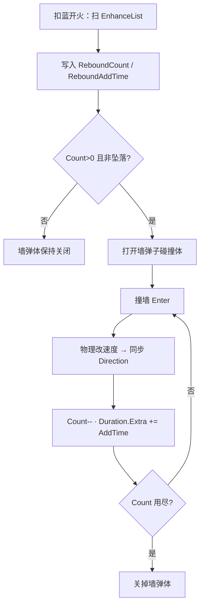

# 反弹（Spell3012 / Rebound）逆向分析

> 范围：仅玩家强化符文「反弹」（`abilityType = 3012`，配置 ID `30121–30123`）。重点是**墙弹怎么实现**，以及**会改反弹行为的其它法术**。
> 不展开敌人反弹弹、甲虫硬壳、法杖反弹飞弹。表里另有测试弹 `90181`（同样 `abilityType=3012`，`int1=1`、`float1=0`），本文不写。
> 坠落落地弹、激光折线只作为「3012 在这些法术上怎么变」来写，不写完整射线 / 坠落算法。
> 方法：`SpellConfig.json` + 反编译 `Assembly-CSharp` 交叉验证。未标注「推测」的结论均有代码/数据直接证据。
> 玩家施法主路径是 ECS。Mono `SpellBase` 叠加上限与 ECS 一致，文末单独对照。
> 配套：总览见《魔法工艺法术系统逆向报告.md》，原始数值见《法术数值总表.md》，分裂满额重开见《分裂逆向分析.md》，悬停第二段见《悬停逆向分析.md》。

---

## 1. 身份与定位


| 项 | 值 |
| --- | --- |
| 中文名 | 反弹 |
| 英文名 | Rebound |
| `abilityType` | `3012` / `SpellAbilityType.Rebound` |
| 配置 ID | `30121`（Lv1）/ `30122`（Lv2）/ `30123`（Lv3） |
| 稀有度 | 普通（`dropType=1`） |
| `useType` | `2`（Enhance 强化符文） |
| 槽位消耗 | `slotCost=1`，自身 `mpCost=0`、`damage=0` |
| 作用对象 | `haveEffecforMissileSpell=true`，`haveEffecforSummonSpell=false` |
| 合成 | Lv1→Lv2→Lv3（`canCompound`：Lv1/2=`true`，Lv3=`false`） |
| 售价（金币） | 10 / 30 / 90 |


**机制一句话**：发射时把次数和「每次加时」烘焙进 `SpellMovementComponentData`；生成时打开只撞墙 / 悬崖的子碰撞体。Unity Physics 负责改速度，`SpellMoveJob` 负责扣次、加持续、关碰撞体、播特效。



文案（`TextConfig_Spell` id `7130121–7130123`）：

> 法术反弹次数+**int1**
> 每次反弹持续时间+**float1**秒

名称（`7030121–7030123`）：反弹 / Rebound。三级名称相同，只有 `int1` 不同。

---

## 2. 数值与叠加

### 2.1 配置表（`assets_export/SpellConfig.json`）


| ID | Level | int1 次数 | float1 每次加时 | 售价 | 可合成 |
| --- | --- | --- | --- | --- | --- |
| 30121 | 1 | **2** | 1 | 10 | true |
| 30122 | 2 | **4** | 1 | 30 | true |
| 30123 | 3 | **8** | 1 | 90 | false |


规律：`int1` 每级 ×2；售价每级 ×3。`float1` 三级都是 1，合成不提高单次加时。其余 `int/float` 全 0，不用。无耗蓝倍率。

### 2.2 字段语义


| 字段 | 语义 | 运行时是否被读 | 置信度 |
| --- | --- | --- | --- |
| **int1** | 反弹次数（多张**相加**） | 是 | 高 |
| **float1** | 每次撞墙给 `Duration.Extra` 加的秒数（多张取 **Max**） | 是 | 高 |
| int2 / int3 / float2 / float3 | 配置为 0 | ECS **未读** | 高 |


叠加入口：`SpellShootData.GetReboundTime_FinalPlayerValue`。

```579:594:decompiled/Assembly-CSharp/SpellShootData.cs
	public (int count, float reboundAddTime) GetReboundTime_FinalPlayerValue()
	{
		int num = 0;
		float num2 = 0f;
		// ...
			if (finalConfig.abilityType == SpellAbilityType.Rebound)
			{
				num += finalConfig.int1;
				num2 = Mathf.Max(num2, finalConfig.float1);
			}
		return (num, num2);
	}
```

两张 Lv1 是 **4 次、每次 +1s**，不是 2 次、每次 +2s。当前三级 `float1` 都是 1，Max 永远是 1；若以后出更高 `float1` 的卡，才看得出 Max 和相加的差别。

这个函数**不读** `haveEffecforSummonSpell`。自动填槽不会往召唤上插；手动插在召唤左侧仍会把次数写进快照，但队友实体走另一套碰撞分支（见 4.9）。

---

## 3. 主路径（核心）

普通弹道（非激光 / 非坠落落地）走下面四步。墙弹角度**不是** `SpellMoveJob` 自己算的 `math.reflect`，而是 Unity Physics 的 `CollideRaiseCollisionEvents` 改 `PhysicsVelocity.Linear`，Job 再把速度同步回 `Direction`。

### 3.1 发射时烘焙，只扫一次

1. `SpellInitialParameter.Builder` 调 `GetReboundTime_FinalPlayerValue`，写入 `SIP.reboundInfo`。
2. `ShootSpellUtils.SipToSSP` 写进快照：

```231:237:decompiled/Assembly-CSharp/ShootSpellUtils.cs
		spellSpawnParams.MovementComponentData = new SpellMovementComponentData
		{
			// ...
			ReboundCount = sip.reboundInfo.count,
			ReboundAddTime = sip.reboundInfo.addTime,
```

之后飞行中改的是实体上的 `ReboundCount` / `Duration`。快照里仍是发射时的满额（分裂复印的是这份快照，见 4.5）。

### 3.2 生成时决定开不开墙弹体

`SpellShootSystem.SpawnSpellEntity`：

1. 公转或 `IsIgnoreWall`：整颗复合碰撞体 `CollidesWith &= ~Layer_Wall`（`4294967039` = 去掉 bit 8 / 256）。触发器和碰撞体都改。
2. **`ReboundCount <= 0` 或 `IsFallSpell`**：`SpellTools.DisableSpellReboundCollider`。
3. 否则墙弹子碰撞体保持 `CollideRaiseCollisionEvents`。

`DisableSpellReboundCollider` 只动复合体里 `CollidesWith` **恰好**是下面两个值的子碰撞体：


| CollidesWith | 含义 |
| --- | --- |
| `256` | `Layer_Wall`，对应 `GameConst.Filter_Wall` |
| `65792` | `256 \| 65536` = 墙 + 悬崖，对应 `Filter_Border` |


关掉时把这些子体的 `CollisionResponse` 设成 `None`；打开则设回 `CollideRaiseCollisionEvents`。其它子体（打单位的 Trigger 等）不动。

`Layer_SpellRebound = 16384` 是甲虫硬壳 / 法杖反弹飞弹用的层，**不是**这张卡打开的子碰撞体。

### 3.3 撞墙：扣次、加时、关体

`SpellMoveJob.Execute` 读 `StatefulCollisionEvent`，只处理 `Enter`，**一帧只吃第一次**：

1. 队友实体：跳过（`Summon4` 非寻踪会把 `ReboundCount` 清 0，见 4.9）。
2. `Direction = normalize(velocity.Linear)`（去 Z）。此时物理已经改过速度。
3. 不是冲刺：`ReboundCount--`，`Duration.Extra += ReboundAddTime`。
4. `ReboundCount <= 0`：关掉墙弹体。再撞墙不会弹，也不再加时。
5. 在当前位置生成 `Spell_Rebound` 特效。
6. `break`。

`SpellMoveJob` 明确排除常驻施法黏连、龙息、符文锤、魔法盾、鱼叉、自爆虫等。这些实体不走这套墙撞。

冲刺（`Dash = 1016`）会同步方向、播特效，但**不扣次、不加时**。次数不会被墙撞耗尽。

次数用尽后，墙弹体已关。若触发器再碰到 `HitType.Unknown`（墙 / 非单位），且没有 `CanThroughWall`，`SpellSystem` 会销毁——这是「最后一次弹完再撞墙就死」的来源。`ReboundCount > 0` 时同一条判定会 `continue`，不因 Unknown 触发器销毁。

---

## 4. 和其它法术的关系

只写会改反弹行为的交互。齐射 / 多重 / 伤害强化等只改发射或数值，不改墙弹，不列。

### 4.1 穿透 3006

两套独立计数，不互相扣。


| | 墙 | 单位 |
| --- | --- | --- |
| 事件 | `CollisionEvent`（墙弹子碰撞体） | `TriggerEvent`（打人 Trigger） |
| 计数 | `ReboundCount--` | `Penetrate.CostPenetrateValue()` |
| 用尽 | 关墙弹体；再撞 Unknown 可能销毁 | `Penetrate < 0` 时 `SpellTakeDamageResultSystem` 销毁 |


`SpellSystem` 里 `ReboundCount > 0` 和 `CanThroughWall` 一样，挡住「Trigger 碰到 Unknown 就销毁」。它**不阻止**穿透耗尽后的销毁。

所以：`[穿透][反弹][弹]` 可以先穿人再撞墙；穿人扣穿透，撞墙扣反弹。穿透先耗尽会在单位身上销毁，走不到后面的墙弹。悬停文档里的「命中且穿透耗尽走不到悬停」对反弹同样成立。

`CanThroughWall` 是预制体旗标；无视墙壁遗物走的是 `IsIgnoreWall`（下一节），不是这个旗标。

### 4.2 无视墙壁 / 公转 3009 / 自由公转 3117

`IsIgnoreWall` 只来自遗物 `relic_SpellThroughWall`（`GetSpellIgnoreWall`），不是一张强化符文。部分法杖随机落点也会把 `sip.IsIgnoreWall` 置真。

生成时公转和无视墙壁走同一句：所有子碰撞体去掉 `Layer_Wall`。墙弹子体若原来 `CollidesWith=256`，去掉墙位后变成 0，再也碰不到墙。`DisableSpellReboundCollider` 按「恰好 256 / 65792」识别子体，过滤改完后它也认不出来。

结论：公转或无视墙壁挂上后，**普通弹的墙弹基本失效**。次数还在快照里，激光 / 分解射线会自己读（见 4.8）。

### 4.3 坠落 3119

生成时 `IsFallSpell` 直接关掉墙弹体。`ReboundCount` 被**落地**逻辑复用，不再表示「撞墙几次」：

- `SpellMoveJob.Normal_Fall`：落到 `z≈0` 且 `ReboundCount > 0` 时调 `ReboundFallSpeed()`（或抛物线的 `BounceRatio`），并标 `IsFallRebounded`。
- 分裂子弹还会把 `FallingReboundForceRatio *= 0.7`，并标已经落地反弹（见《分裂逆向分析.md》）。

文案里的「每次 +1s」仍写在 `ReboundAddTime` 里，但墙弹体已关，普通坠落**不会**因撞墙走进 `Duration.Extra += ReboundAddTime`。加时只发生在 `SpellMoveJob` 那条墙撞分支。

陨石类文案「反弹会使陨石在地面弹跳」指的是这套落地复用，不是墙弹。

### 4.4 悬停 3008

悬停在 `DurationTimer >= Duration` 之后才开始。每次墙弹把 `Duration.Extra += ReboundAddTime`，飞行段被拉长，悬停第二段整体后移。

销毁仍在悬停走完之后（或穿透耗尽当场销毁）。因此：

- 打空 + 反弹：在墙上多活几次，每次 +1s，然后才悬停。
- 命中且穿透耗尽：直接销毁，**走不到**剩下的墙弹，也走不到悬停。

### 4.5 分裂 3013

`ToSplit` 整包复制 `SpellSpawnParams`，**不改** `ReboundCount` / `ReboundAddTime`。子弹拿到的是发射快照里的满额，不是母弹「还剩几次」。

| 母弹飞行中 | 子弹拿到的 |
| --- | --- |
| 反弹 4，已经弹了 1 次，还剩 3 | 仍是 **4**，加时仍是发射时的 Max |


计时器随快照重开（`DurationTimer` / `HoverTimer` 为 0）。详见《分裂逆向分析.md》3.2。

### 4.6 折射 3121

另一套组件：`SpellRefractionData.RemainCount`。单位命中时 `SpellTakeDamageResultSystem` 调 `TryRefract` 折向下一个敌人，**不读** `ReboundCount`。

墙弹不消耗折射次数；折射不打开墙弹体。激光上两者会一起出现，但是两条计数（见 4.8）。

坠落法术的折射被 `!IsFallSpell` 挡住，落地炸改走各坠落 Job 自己的折向。

### 4.7 寻踪 3010 / 自动导航 3011 / 自我追踪 3114

墙弹当帧：物理改速度 → Job 把 `Direction` 写成弹后速度。

同一帧后半，`SpellMoveJob` 按 `Movement.Type` 再跑追赶，把 `Direction` 往目标拧回去。弹是弹了，轨迹马上被追赶盖住。

公转不是追赶，是生成时直接拆掉墙层（4.2），通常根本走不到墙撞。

**不插任何追赶符文也可能被拧回。** 自带追踪的法术在 `Normal` 类型下走的是自己的分支，同样在墙撞之后覆写 `Direction`。蝴蝶 `1003` 是现成例子，而且它**分相位**：

| 相位 | 走哪条 | 墙弹方向是否被拧回 |
| --- | --- | --- |
| 减速段（`StartTraceTargets == false`，约前 0.38 s） | `Butterfly_Common` 末行 `velocity = Direction × Speed` | **不拧回**，老实沿反射方向飞 |
| 追踪段（`StartTraceTargets == true`） | `Butterfly_Common` 的 lerp 分支 | 拧回，但系数是硬编码 `5f·dt`，比自动导航的路程型柔和 |

所以蝴蝶前 0.38 秒的墙弹是「真反弹」，之后才逐渐被追踪盖住。另外 `Duration.Extra += ReboundAddTime` 对蝴蝶是纯收益——加的秒数全进追踪段，而时长对蝴蝶的边际价值本就偏高，两者相乘。详见《蝴蝶逆向分析.md》7.9。

### 4.8 激光 1004 / 分解射线 1011

不走 `SpellMoveJob` 墙撞（龙息直接被 Job 排除；激光用自己的步进 Job）。`ReboundCount` 在这里是**墙壁反射次数**，即折线还能被墙掰弯几次（`Spell1004LaserJob.CheckHitWallStep` L817–842）：

- 无视墙壁：墙检测直接 return，**次数不扣**（无视墙壁的激光穿墙且省下全部反弹次数）。
- 否则撞墙：`ReboundCount--`（分解射线抄到临时字段 `rebounceTime` 再扣），`stepDirection = math.reflect(movement.Direction, wallHit.SurfaceNormal)`。墙层过滤器 `BelongsTo=16777216u`（bit 24）/ `CollidesWith=256u`（bit 8）。
- 次数为 0 再撞墙：线段结束。

补三条激光专属结论（详见《激光逆向分析.md》§6）：

- **反弹不重置长度预算。** `stepVelocity *= wallHit.Fraction` 只把当前段截断到撞点，剩余预算继续从 `remainMaxDistance` 扣。所以反弹再多也射不出 `speed`（默认 15）这个总长之外，反弹在激光上是「折叠射程」而不是「延长射程」。
- **`ReboundAddTime` 对激光完全无效。** 它加的是 `Duration.Extra`，而激光被 `SpellSystem.UpdateDuration` 短路、寿命硬编码 `0.2 + HoverDuration`，不读 `Duration`。这一点和 4.7 蝴蝶「加时是纯收益」正好相反。
- **公转态不做墙检测。** `RotationLineGenerate` 只调 `CheckHitEnemyByStepVelocity`，没有 `CheckHitWallStep` → 公转激光穿墙，反弹次数一次都不消耗。

折射仍走单位命中，和墙折线分开（两条独立计数，同一发里可各自触发）。这里不展开完整射线算法。

龙息火线（`Spell1025FallSystemJob`）会把 `ReboundCount + 折射剩余` 加成额外段数，属于坠落专用，不是普通墙弹。

### 4.9 冲刺 / 召唤 / 常驻施法

| 对象 | 反弹怎么变 |
| --- | --- |
| 冲刺 `1016` | 墙撞仍同步方向、播特效；**不扣次、不加时** |
| 召唤（配置 `haveEffecforSummonSpell=false`） | 自动填槽不插。手动插仍会烘焙次数。带 `TeammateData` 的实体撞墙时 `SpellMoveJob` 直接 `continue`，不弹 |
| 破法者 `Summon4` | 非寻踪撞墙会把 `ReboundCount` 清 0；追敌时又把 `ReboundCount` 写成 1，当「还能沿当前方向飞」的旗标，不是墙弹次数 |
| 龙息 / 符文锤 / 鱼叉 / 魔法盾 / 常驻黏连 | 不进 `SpellMoveJob`，没有这套墙撞 |


---

## 5. Mono 残留轨对照

`SpellBase` 扫 Enhance 时同样：`rebounceTime += int1`，`reboundAddTime = Max(float1)`。和 ECS 叠加规则一致。

Mono 多写了一个 `extraReboundTime += int1`。玩家主路径以 ECS 的 `ReboundCount` / `ReboundAddTime` 为准。

---

## 6. 证据索引


| 文件 | 作用 |
| --- | --- |
| `SpellShootData.GetReboundTime_FinalPlayerValue` | 次数相加、加时取 Max |
| `SpellInitialParameter.Builder` | 写入 `SIP.reboundInfo` |
| `ShootSpellUtils.SipToSSP` | 快照 `ReboundCount` / `ReboundAddTime` |
| `SpellShootSystem.SpawnSpellEntity` | 公转 / 无视墙壁去墙层；坠落或次数≤0 关墙弹体 |
| `SpellTools.Disable/EnableSpellReboundCollider` | 只动 CollidesWith=256 / 65792 的子体 |
| `SpellMoveJob.Execute` | 撞墙 Enter：同步方向、扣次、加时、关体、特效 |
| `SpellSystem` | `ReboundCount>0` 时 Unknown Trigger 不销毁 |
| `SpellTakeDamageResultSystem` | 穿透耗尽销毁；折射走 `RemainCount` |
| `SpellMoveJob.Normal_Fall` / `ReboundFallSpeed` | 坠落复用次数做落地弹 |
| `SpellSpawnParamsStorage.ToSplit` | 分裂整包复制，次数满额 |
| `Spell1004LaserJob.CheckHitWallStep` | 激光自己 `math.reflect`、扣 `ReboundCount` |
| `Spell1011DisintegrationRayJob.CheckHitWallStep` | 分解射线同上（`rebounceTime`） |
| `SpellBase` `case Rebound` | Mono 叠加 |
| `GameConst` | `Layer_Wall=256`、`Filter_Border=65792` |
| `SpellConfig.json` `30121–30123` | 配置原始值 |
| `TextConfig_Spell` `703012*` / `713012*` | 名称与文案 |
