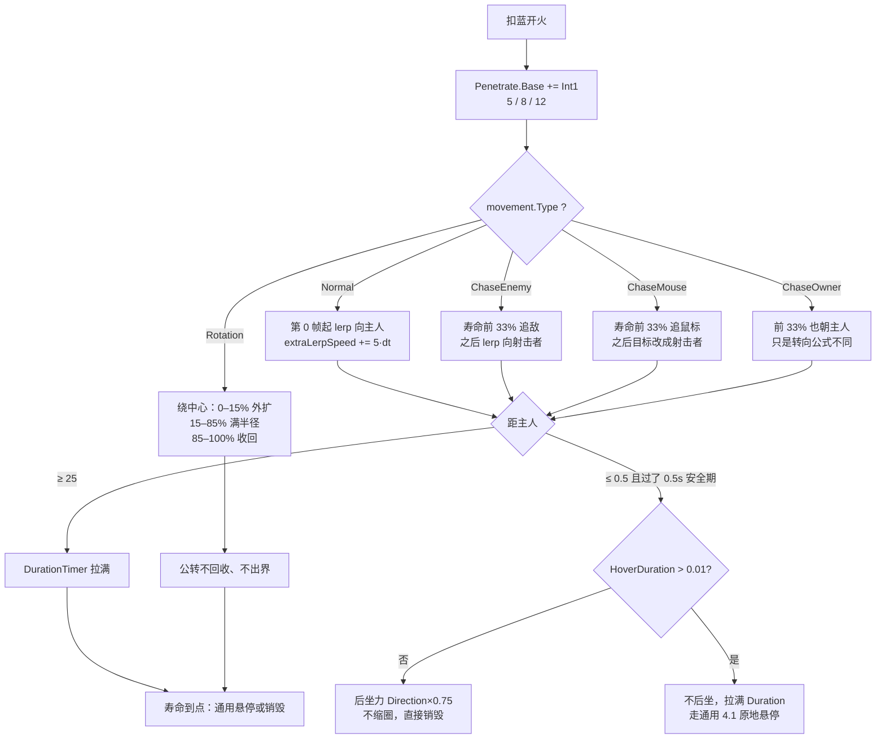

# 回旋之刃（Spell1022 / Boomerang）逆向分析

> 范围：仅玩家主动法术「回旋之刃」（`abilityType = 1022`，配置 ID `10221–10223`）。怪物侧 `Monster17` / `Monster17_Hat` / `Monster39_Sword` / `Elite6` 只把 `Boomerang` 列入可捕捉或可反射名单，各自是独立脚本，不在本文范围。
> 方法：`SpellConfig.json` + 反编译 `Assembly-CSharp` 交叉验证。未标注「推测」的结论均有代码/数据直接证据。
> 主路径：玩家施法走 **ECS**。位移在 `SpellMoveJob` 的四套 `Boomerang_*`；回收 / 出界 / 后坐力在 `Spell1022Job`；回收特效在 `Spell1022BoomerangDestroySystem`。Mono `Spell1022Boomerang` 为残留轨，第 9 节单独对照。
> 配套：总览见《魔法工艺法术系统逆向报告.md》，原始数值见《法术数值总表.md》。离线可开见 `回旋之刃逆向分析.html`。
> 本文修正了既有文档的 **2 处不完整 / 偏差**：《自动导航逆向分析.md》把回旋镖写成「寿命前 33% 才追敌」，漏了 Normal / ChaseMouse / ChaseOwner 三套；《悬停逆向分析.md》把「回旋镖悬停段」列成自管位移、并得出「不要按原地锁死来做」，与 ECS 实装不符。第 7 节对已逆向的 21 张增强符文做了逐一校验。

---

## 1. 身份与定位

| 项 | 值 |
| --- | --- |
| 中文名 | 回旋之刃 |
| 英文名 | Boomerang Blade |
| `abilityType` | `1022` / `SpellAbilityType.Boomerang` |
| 配置 ID | `10221`（Lv1）/ `10222`（Lv2）/ `10223`（Lv3） |
| 文案 ID | 名 `701022x` / 机制 `711022x`（三级都写穿透）/ 风味 `7210221` / 短评 `7310221` |
| 稀有度 | 普通（`dropType=1`） |
| `useType` | `0`（Missile 主动飞弹） |
| `needActivate` | **true**（角色图鉴解锁后才进掉落池，见 `BattleData`） |
| 槽位 / 蓝耗 | `slotCost=1`；`mpCost` = 9 / 11 / 15（`shootCount=1`，不均摊） |
| 伤害 | `damage` = 16 / 32 / 64 |
| 自带暴击率 | `criticalChance` = **20 / 20 / 20**（`criticalDamageMultiplier = 2`） |
| 自带穿透 | `int1` = **5 / 8 / 12**（总命中次数 = `int1 + 1`，见 5.2） |
| 弹道 | `speed=26`、`duration=5`、`angle=0`、`knockback=7`、`recoil=1` |
| 死字段 | `float2=30`（**专属路径全不读**，见 2.2） |
| 预制体 | 三级共用 `prefab="10221"`，图标 `1022` |
| 合成 | Lv1→Lv2→Lv3（`canCompound`：Lv1/2=`true`，Lv3=`false`） |
| 售价（金币） | 8 / 24 / 72 |
| 复杂度 | `CalculateSpellComplexity` 记 **1** 分（与魔法弹、烟花、回蓝、宾箭同档） |
| AI 射程估算 | 硬编码 **8**（不读 `speed × duration`） |

**机制一句话**：实体飞弹，飞出去之后把方向不断弯回施法者；碰到主人就回收，可附带一记后坐力。升级只加伤害和穿透。文案里的「魔法电锯」靠 Mono 周期性关碰撞盒连打同一目标——**ECS 主路径没有这套重开，同一目标每个接近周期只吃一次 Enter**。



文案（`TextConfig_Spell`）：

- 名称 `7010221–7010223`：回旋之刃 / Boomerang Blade（三级同名）
- 机制 `7110221–7110223`：> 法术穿透: int1
- 风味 `7210221`：> 不要被飞向自己的回旋之刃吓到，只会攻击敌人的回旋之刃是制作魔法电锯的核心法术。
- 短评 `7310221`：> 施放后会逐渐回到身边

三段都能在代码里落地，但落地位置不同：

| 文案 | 对应实装 | 注意 |
| --- | --- | --- |
| 「法术穿透: int1」 | `SpellSpawnParamsProcessor` 把 `Int1` 加进 `Penetrate.Base` | 总命中 = `int1 + 1`，见 5.2 |
| 「不要被飞向自己的……吓到」 | 回收时 `TakeKnockback(Direction × 0.75)` | 有悬停则**不**后坐，见 4.3 |
| 「只会攻击敌人」 | `SpellSystem` 同阵营 / `IgnorePlayerSpellHitTag` 直接跳过 | 玩家和队友都不会被刃打到 |
| 「逐渐回到身边」 | 四套 `Boomerang_*` 都把方向弯回主人 | Normal 从第 0 帧就开始弯，不是先直飞再折返 |
| 「魔法电锯」 | Mono `CheckHitBoxState` 周期性关碰撞盒，制造下一次 Enter | **ECS 没有对等实现**，见 5.3 |

---

## 2. 数值结构

### 2.1 配置表原始值（`assets_export/SpellConfig.json`）

| ID | Level | damage | mpCost | criticalChance | int1 | speed | duration | angle | knockback | recoil | float2 | 售价 | 可合成 |
| --- | --- | --- | --- | --- | --- | --- | --- | --- | --- | --- | --- | --- | --- |
| 10221 | 1 | **16** | 9 | 20 | **5** | 26 | 5 | 0 | 7 | 1 | 30 | 8 | true |
| 10222 | 2 | **32** | 11 | 20 | **8** | 26 | 5 | 0 | 7 | 1 | 30 | 24 | true |
| 10223 | 3 | **64** | 15 | 20 | **12** | 26 | 5 | 0 | 7 | 1 | 30 | 72 | false |

规律：升级只动三样——`damage`、`mpCost`、`int1`。`speed` / `duration` / `angle` / `knockback` / `recoil` / `criticalChance` / `float2` 三级完全不变。`float1` / `float3` / `int2` / `int3` / `radius` / `gravity` / `upSpeed` / `summonID` 全 0。

`isDPS=false`、`isKeepCasting=false`、`isParentTypeSpell=false`、`isSplitSpell=false`、`needActivate=true`、`shootCount=1`、`shootIntervalAddSubRevise=0`、`coolDownAddSubRevise=0`。

`haveEffecforMissileSpell` / `haveEffecforSummonSpell` 两个字段都是 **false**——它们只对 `useType=2` 的强化符文有意义，主动法术这两位不被任何逻辑读取。

`DPSDamageInterval` 配了 0.25，但 `isDPS=false`，写入组件时 `DamageInterval = 0`，这个 0.25 是死值。

### 2.2 字段语义

| 字段 | 语义 | 置信度 | 证据 |
| --- | --- | --- | --- |
| **int1 = 5/8/12** | 自带穿透底数，发射时 `Penetrate.Base += Int1` | 高 | `SpellSpawnParamsProcessor` L129–132；文案 `711022x`；Mono `penetrateTime += spellCfg.int1` |
| **speed = 26** | 线速度。转弯时 `Direction` 不归一化，实际速率 = `\|Direction\| × Speed` | 高 | `Boomerang_Common` L1051–1055 |
| **duration = 5** | 飞行段寿命。33% 窗口、公转包络、出界拉满，都读 `Duration.Calculate()` | 高 | `Spell1022Job` L172；`Boomerang_ChaseTarget` L827 |
| **angle = 0** | 散射锥角底数为 0 → 裸刃完全笔直出手 | 高 | 配置；`SpellShootData.GetSpellScatter` |
| **criticalChance = 20** | 自带暴击率（百分数），三级一样；`criticalDamageMultiplier = 2` | 高 | 配置；`GameConst` L227 |
| **knockback = 7** | 打敌人时的击退 | 高 | 配置；`SipToSSP` 写入 `Knockback` |
| **recoil = 1** | **开火时**法杖后坐力，走通用 `GetSpellRecoil` | 高 | `SpellShootData` L545–547 |
| 回收后坐力 | **不是** `recoil`。硬编码 `Direction × 0.75` | 高 | `Spell1022Job` L208 |
| **float2 = 30** | **死字段。** 专属路径全不读 | 高 | 见下 |
| AI 射程 | 硬编码 8，不读 `speed × duration` | 高 | `SpellGroupAttackDistanceCalculator` L292–294 |

**`float2` 是死字段的论证。**

1. `Spell1022Job` / `Spell1022BoomerangDestroySystem` / 四套 `Boomerang_*` / `SpellSpawnParamsProcessor` 的 Boomerang 分支，全部不出现 `Float2`。
2. 通用层会把配置拷进 `SpellConfigComponentData.Float2`（`ShootSpellUtils` L295），但没有任何按 `abilityType == Boomerang` 的读取点。
3. 数字 30 对不上任何硬编码：出界距离是 **25**，追敌窗口是寿命的 **33%**，公转包络是 **15% / 85%**，回收半径是 **0.5**，安全期是 **0.5s**。
4. Mono 侧也不读 `spellCfg.float2`——出界用的是预制体字段 `maxDistance`。

即这个 30 是配置表里的历史残留。**推测**（无证据）：早期版本的出界距离或回程开始时间，后来分别被 Job 里的 `25f` 与「第 0 帧起弯回」取代。这条推测不影响任何结论。

### 2.3 发射后处理只做一件事

```129:132:decompiled/Assembly-CSharp/SpellSpawnParamsProcessor.cs
		_processors.Add(SpellAbilityType.Boomerang, delegate(ShootSpellUtils.SpellShootInfo info, SpellInitialParameter sip, ref SpellSpawnParams ssp)
		{
			ssp.ConfigComponentData.Penetrate.Base += ssp.ConfigComponentData.Int1;
		});
```

不改速度、寿命、反弹、追鼠标系数。穿透从「符文 3006 写入的 `Penetrate.Extra`」之外，再叠一层 `Int1` 到底数。

### 2.4 状态组件

`Spell1022BoomerangData` 四个字段：

| 字段 | 初值（Baker） | 谁写 | 谁读 |
| --- | --- | --- | --- |
| `IsInitialize` | false | `Spell1022Job` 首帧改 true | 公转首帧把位置掰回圆心 |
| `IgnoreRecycleDurationTimer` | 0 | 每帧 `+= DeltaTime` | 安全期 0.5s；`Elite6` 捕捉时清零 |
| `extraLerpSpeed` | 0 | 三套非公转位移每帧 `+= 5·dt` | lerp 系数；`Elite6` 捕捉时清零 |
| `IsRecycleByPlayer` | false（C# 默认） | 触碰主人时改 true | 销毁 Job 用来决定要不要播 `1022_End_{色}` |

Baker 不写 `IsRecycleByPlayer`，默认 false。只有玩家回收这条路径会置真；寿命到点、撞墙、穿透耗尽的销毁都不播这套回收特效。

---

## 3. 核心机制：四种运动，一个回家

回旋之刃**走** `SpellMoveJob`（和激光相反）。`SpellMoveJob` 在悬停前置分支之后，按 `movement.Type` 分派到四套专属函数。没有 `Boomerang` case 的类型会落到 `default`，但 `ChaseOwner` 与 `ChaseEnemy` 共用同一个 switch，所以自我追踪也会进 `Boomerang_ChaseTarget`。

### 3.1 Normal：第 0 帧就开始弯回

```1048:1056:decompiled/Assembly-CSharp/SpellMoveJob.cs
	private void Boomerang_Common(...)
	{
		float3 to = ((!TransformLookup.HasComponent(data.OwnerEntity)) ? (transform.Position + movement.Direction) : TransformLookup[data.OwnerEntity].Position);
		boomerang.extraLerpSpeed += 5f * DeltaTime;
		float t = (movement.Speed + boomerang.extraLerpSpeed) * DeltaTime * 0.05f;
		float3 @float = math.lerp(movement.Direction, DTool.IgnoreZDir(in to, in transform.Position), t);
		velocity.Linear = @float * movement.Speed;
		movement.Direction = @float;
	}
```

要点：

1. **没有「先直飞再折返」的延迟。** Mono 有 `rollingBackStartTime`，ECS 没有。出手当下就开始把 `Direction` 往主人身上拉。
2. `extraLerpSpeed` 每秒 +5，转弯越来越急。`t ≈ (26 + 5t) · dt · 0.05`，60 FPS 下首帧约 0.022，1 秒后约 0.026，2 秒后约 0.029。
3. **lerp 之后不归一化。** 两个单位向量的 lerp 更短，于是 `velocity = Direction × Speed` 的实际速率小于 `Speed`。弯得越狠，飞得越慢。这是弧线回旋手感的来源之一。
4. 主人实体没了，目标退化成「当前位置 + 当前方向」，等于沿原方向惯性飞。

体感上仍是「飞出去再回来」：出手方向是射击方向，`t` 很小，前零点几秒几乎照直飞；之后弧线越来越弯，最后贴向玩家。不是先到最远端再 180° 掉头。

### 3.2 ChaseEnemy / ChaseOwner：寿命前 33% 追，之后回家

`ChaseEnemy` 和 `ChaseOwner` 共用 `Boomerang_ChaseTarget`：

```822:841:decompiled/Assembly-CSharp/SpellMoveJob.cs
	private void Boomerang_ChaseTarget(...)
	{
		float num = (movement.IsFallSpell ? movement.OriginalSpellHorizontalSpeed : movement.Speed);
		boomerang.extraLerpSpeed += DeltaTime * 5f;
		GetValidChasePosition(..., out var hasTarget, out var targetPosition);
		if (hasTarget && config.DurationTimer <= config.Duration.Calculate() * 0.33f)
		{
			// DirMoveTowards + lerp，系数是 ChaseRotateSpeed
			...
		}
		else
		{
			float3 to = movement.UpdateSelfChasePosition(TransformLookup, data.Shooter);
			movement.Direction = math.lerp(movement.Direction, DTool.IgnoreZDir(in to, in transform.Position), (boomerang.extraLerpSpeed + num) * DeltaTime * 0.05f);
		}
		velocity.Linear = movement.Direction * num;
	}
```

`GetValidChasePosition` 对两种 Type 的差别：

| Type | `hasTarget` | 前 33% 追谁 |
| --- | --- | --- |
| `ChaseEnemy` | 当前锁敌仍可被选中，否则 `FindMinAngleTarget` 重锁 | 敌人 |
| `ChaseOwner` | **恒 true** | 射击者（和后 67% 同一目的地，只是转向公式不同） |

33% 窗口跟 `Duration.Calculate()` 走。裸刃 5 秒 → 前 **1.65 秒**追；插时长强化 +2 → 前 **2.31 秒**追。窗口被拉长，不是固定秒数。

坠落态用 `OriginalSpellHorizontalSpeed` 代替当前 `Speed`，避免坠落把水平速度改掉之后转弯系数跟着塌。

《自动导航逆向分析.md》第 6 节那句「寿命前 33% 才追敌，之后回施法者」只覆盖了 `ChaseEnemy`。完整四套见本节与 7.1。

### 3.3 ChaseMouse：33% 切鼠标，之后切射击者

```644:653:decompiled/Assembly-CSharp/SpellMoveJob.cs
	private void Boomerang_ChaseMouse(...)
	{
		boomerang.extraLerpSpeed += 5f * DeltaTime;
		float3 @float = movement.UpdateSelfChasePosition(TransformLookup, data.Shooter);
		float num = ((config.DurationTimer / (config.Duration.Calculate() * 0.33f) > 1f) ? 1 : 0);
		float3 to = MousePosition + (@float - MousePosition) * num;
		float3 float2 = math.lerp(movement.Direction, DTool.IgnoreZDir(in to, in transform.Position), (movement.Speed + boomerang.extraLerpSpeed) * DeltaTime * 0.05f * 1.5f);
		velocity.Linear = movement.Speed * float2;
		movement.Direction = float2;
	}
```

`num` 是 0/1 开关，不是渐变：

- 前 33%：`to = Mouse`
- 后 67%：`to = 射击者`

lerp 系数比 Normal 多乘 **1.5**，弯得更快。`Direction` 同样不归一化。

### 3.4 Rotation：从圆心长出来，再收回去

公转首帧（`Spell1022Job`）把位置掰到 `AroundCenter`，速度清零。`SpellShootSystem` L395–398 在算完环绕点之后，又专门把回旋镖的生成点改回圆心——两处一起保证「从身上长出来」，而不是直接出现在圆周上。

```792:807:decompiled/Assembly-CSharp/SpellMoveJob.cs
	private void Boomerang_Rotation(...)
	{
		movement.UpdateAroundFollowAndGetAroundPositionWhenAround(TransformLookup);
		float num = (movement.IsFallSpell ? movement.OriginalSpellHorizontalSpeed : movement.Speed);
		float num2 = 360f / (MathF.PI * 2f * movement.AroundRadius / num) * DeltaTime;
		movement.AroundAngle += num2;
		...
		float percent = GetPercent(config.DurationTimer / config.Duration.Calculate(), 0.15f, 0.85f);
		percent = math.clamp(percent, 0f, 1f);
		transform.Position.xy = (movement.AroundCenter + (float3)Tool2D.GetDir(movement.AroundAngle) * percent * movement.AroundRadius).xy;
		velocity.Linear = float3.zero;
	}
```

`GetPercent(t, 0.15, 0.85)` 的包络：

| 寿命进度 | 半径系数 |
| --- | --- |
| 0 → 15% | 0 → 1（外扩） |
| 15% → 85% | 1（满半径公转） |
| 85% → 100% | 1 → **0.025**（收回，不是收到 0） |

角速度与普通公转相同：`360 / (2πr / speed) · dt`。位置直接写 `transform`，`velocity = 0`。`MoveTrigger` 的路程计数按弧长累加。

公转**不做**回收、不出 25 单位的界（`Spell1022Job` 显式排除 `Rotation`）。刃一直转到寿命走完，再进通用销毁 / 悬停。

公转寿命还吃 `Duration.Extra`：`SipToSSP` 在 `Type == Rotation` 时把 `RotationMovementInfo.extraDuration` 写进 Extra。公转符文 3009 的 `float1` 进的就是这个 Extra（`GetSpellRotationInfo`），Lv1 是 +4 秒 → 飞行段变成 9 秒，15% / 85% 切点跟着拉长。

### 3.5 悬停期位移被通用层掐掉

`SpellMoveJob` L254–258：`HoverTimer > 0 && HoverDuration > 0` 时把 `Speed` 和 `Linear` 清零，**整段 movement switch 不跑**。回旋镖没有自己的悬停位移。所谓「悬停段」只是回收时读一下 `HoverDuration` 决定要不要后坐力，然后把 `DurationTimer` 拉满，之后走《悬停逆向分析.md》4.1 的原地锁死。

这是对《悬停逆向分析.md》第 8 节第 1 条的更正，见文首与第 7.4 节。

---

## 4. 回收、出界、后坐力

全部在 `Spell1022Job`。系统挂 `SpacialSpellSystemGroup`，查询要有 `Spell1022BoomerangData` + `PhysicsVelocity` + `Shadow_Dots`。

每帧先把影子的旋转和缩放抄自 `EffectsCollectorData.Effect1`（刀光表现），再做生命周期。`DurationTimer >= Duration` 时整段回收逻辑直接 return——寿命到点之后不再检测出界、不再碰人回收。

### 4.1 0.5 秒安全期

```191:194:decompiled/Assembly-CSharp/Spell1022Job.cs
	private bool IsBoomerangIgnoreRecycle(float timer)
	{
		return timer <= 0.5f;
	}
```

`IgnoreRecycleDurationTimer` 从发射起累加。0.5 秒内既不出界、也不因贴着主人回收。没有这段，刃生成在玩家身上会立刻被吃掉。

`Elite6` 把捕捉到的回旋镖重新射出去时，会把 `IgnoreRecycleDurationTimer` 和 `extraLerpSpeed` 一起清零，等于再给一次安全期、转弯重新从 0 加速。这是怪物侧，点到为止。

### 4.2 出界：水平距离 ≥ 25 就到期

过了安全期、且不是公转、主人还在：

```179:187:decompiled/Assembly-CSharp/Spell1022Job.cs
			float num = DTool.IgnoreZDistance(in transform.Position, in componentData.Position);
			if (num >= 25f)
			{
				config.DurationTimer = config.Duration.Calculate();
			}
			if (num <= 0.5f)
			{
				TouchOwnerUnitCheck(...);
			}
```

25 是硬编码，与配置 `float2=30`、Mono `maxDistance` 都无关。触发后只是把 `DurationTimer` 拉满，**不**置 `IsRecycleByPlayer`。之后走通用寿命结束：有悬停就原地停，没有就缩圈 / 销毁。出界点可以离玩家很远，悬停会停在 25 单位开外。

### 4.3 碰主人：0.5 米回收

```196:212:decompiled/Assembly-CSharp/Spell1022Job.cs
	private void TouchOwnerUnitCheck(...)
	{
		if (IsBoomerangIgnoreRecycle(data.IgnoreRecycleDurationTimer))
		{
			return;
		}
		data.IsRecycleByPlayer = true;
		if (config.HoverDuration <= 0.01f)
		{
			spellData.ReduceSizeWhenLifeEnd = false;
			if (UnitLookUp.EntityExists(spellData.OwnerEntity))
			{
				UnitLookUp.GetRefRW(spellData.OwnerEntity).ValueRW.TakeKnockback(movement.Direction * 0.75f);
			}
		}
		config.DurationTimer = config.Duration.Calculate();
	}
```

| 条件 | 行为 |
| --- | --- |
| 安全期内 | 什么都不做 |
| 过了安全期，无悬停（`HoverDuration ≤ 0.01`） | 标回收、关缩圈、主人吃 `Direction × 0.75` 后坐、寿命拉满 → 当帧走销毁 |
| 过了安全期，有悬停 | 标回收、**不后坐**、寿命拉满 → 刃停在脚边进入 4.1 悬停 |

回收后坐力与配置 `recoil=1` 无关。开火后坐走通用 `GetSpellRecoil`；回家后坐是这记 0.75。方向是**当前** `movement.Direction`（弯回来时大致指向玩家），不是出手方向。

`IsRecycleByPlayer` 只在这里置真。销毁系统据此播 `1022_End_{ColorEnum}` 粒子。寿命到点、撞墙、穿透耗尽都不会走这套特效。

### 4.4 坠落态回收是「停脑、不停掉」

`UpdateDuration` 对 `IsFallSpell` 短路：只加 `DurationTimer`，不加 `HoverTimer`，也不因寿命销毁（《悬停逆向分析.md》4.2）。`TouchOwner` / 出界把 `DurationTimer` 拉满之后，`Spell1022Job` 提前 return，回收与出界检测停掉；刃继续按坠落位移飞，活到落地再决定死活。

有悬停的坠落刃：`HoverDuration` 仍在快照里，但 4.1 走不到，回收时那次「有悬停就不后坐」仍生效。

---

## 5. 命中与穿透

回旋之刃没有专属伤害 Job。命中走 `SpellSystem` 通用触发：只处理 `StatefulEventState.Enter`。

### 5.1 同阵营免疫

`DTool.IsSameCamp(ShooterType, Player)` 时，带 `IgnorePlayerSpellHitTag` 的目标直接 `continue`。玩家和队友不会被自己的刃打到。这就是风味文案「只会攻击敌人」。

### 5.2 穿透次数 = `int1 + 1`

`PenetrateValue` 的构造把符文 3006 的次数放进 `Extra`，`Base` 起步为 0。Boomerang 处理器再 `Base += Int1`。`Calculate() = Extra + Base`。每次有效命中 `CostPenetrateValue()`：先扣 Extra，再扣 Base。`Calculate() < 0` 时挂 `SpellDestroyTag`。

从 N 扣到 −1 才销毁，值为 0 的那一次仍能打。因此：

| 槽位 | 起始 `Calculate()` | 能打中的次数 |
| --- | --- | --- |
| `[回旋Lv1]` | 5 | **6** |
| `[回旋Lv2]` | 8 | **9** |
| `[回旋Lv3]` | 12 | **13** |
| `[穿Lv3(+4)] [回旋Lv1]` | 5+4=9 | **10** |

文案写「法术穿透: int1」按游戏惯例是「额外穿透 int1 次」，加上必有的第一次，正好对上 `int1 + 1`。

撞墙且 `ReboundCount == 0` 且不能穿墙，会直接销毁（`SpellSystem` L217–243），不走穿透计数。

### 5.3 ECS 没有「电锯」连打

`SpellSystem` 只认 Enter，Stay / Exit 全部跳过。刃和同一个敌人保持重叠，不会再结算。

Mono 用 `hitboxRestartInterval` 周期性关掉碰撞盒再打开，强制下一次 Enter，这才是「电锯」。`Spell1022Job`、通用碰撞、`SpellHoverDamageSystem`（回旋之刃 Baker 不挂 `SpellHoverDamageData`）都没有对等实现。

结论：ECS 主路径上，同一目标每个接近周期只吃一次伤害。要再打它，必须先离开碰撞再进入。穿透堆的是「能再穿几个不同目标」，不是「对同一目标砍几刀」。

这是本文最重要的一条 ECS / Mono 偏差，与文案「魔法电锯」对不上。代码事实确定；是否为刻意改动未定，见第 13 节。

---

## 6. 墙壁、反弹、坠落

回旋之刃走通用墙碰与反弹，没有自己的 `math.reflect`。`SpellMoveJob` 开头处理 `CollisionEvent`：`ReboundCount--`、反射方向、耗尽则关反弹碰撞体并生成反弹特效。反弹还会 `Duration.Extra += ReboundAddTime`（《反弹逆向分析.md》）。

对回旋镖的附加效果：寿命被加长 → 33% 窗口和公转包络都被拉长。反弹本身不改「弯回主人」的目标。

坠落走末尾统一的 `Normal_Fall`。回旋镖不在坠落排除名单。坠落态三套非公转位移都改读 `OriginalSpellHorizontalSpeed`。落地打 `SpellGroundedTag`，之后由坠落文档那套落地伤 / 反弹 / 回收接管。

范围增强对非坠落回旋镖几乎没用（`radius=0`，命中靠预制体碰撞盒）。坠落落地圆才吃半径，见 7.3。

---

## 7. 增强符文 × 回旋之刃 逐一校验矩阵

对已逆向的 21 张增强符文逐条核对「原文档结论」与「回旋之刃实际走到的代码分支」。

| # | 符文 | abilityType | 原文档结论对回旋之刃是否成立 | 回旋之刃实际分支 | 判定 |
| --- | --- | --- | --- | --- | --- |
| 1 | 自动导航 | 3011 FollowTarget | ⚠ **不完整** | 专属 `Boomerang_ChaseTarget`：前 33% 追敌，之后回家；不是通用 `Normal_ChaseTarget` | **需回写**（7.1） |
| 2 | 加速器 | 3106 EnhanceSpeedValue | ✓ 成立 | `Speed` 直接进 lerp 系数和线速度；弯得更快、飞得更远，也更容易顶到 25 出界 | 一致（7.2） |
| 3 | 范围增强 | 3107 EnhanceRadiusRatio | ✓ 成立 | 非坠落命中不读 `radius`；坠落落地圆才吃 | 一致（7.3） |
| 4 | 时长强化 | 3103 EnhanceDurationValue | ✓ 成立 | `Duration.AddBase`；33% 窗口、公转包络、5 秒飞行段一起变长 | 一致（7.5） |
| 5 | 悬停 | 3008 SpellHover | ⚠ **偏差** | 回收时只决定后坐力；位移走通用 4.1 原地锁死，不是自管悬停段 | **需回写**（7.4） |
| 6 | 反弹 | 3012 Rebound | ✓ 成立 | 通用碰撞反射；`ReboundAddTime` 拉长寿命，进而拉长 33% | 一致（第 6 节） |
| 7 | 坠落 | 3119 Fall | ✓ 成立 | 走 `Normal_Fall`；回收只停脑不停掉；水平速度改读 `OriginalSpellHorizontalSpeed` | 一致（第 6 节） |
| 8 | 精准施法 | 3105 EnhanceCriticalChance | ✓ 成立 | `angle` 底数已是 0；暴击加在自带 20 之上 | 一致（7.6） |
| 9 | 齐射 | 3001 Volley | ✓ 成立 | `int2 × (N−1)` 进散射池，把「笔直出手」抵消掉 | 一致（7.7） |
| 10 | 伤害强化 | 3102 EnhanceAttackRatio | ✓ 成立 | `Damage.AddRatio`；每个 Enter 目标都吃满 | 一致 |
| 11 | 节能模式 | 3104 PowerSavingMode | ✓ 成立 | `Damage.MulRatio` 与 `Duration.MulRatio` 都生效（寿命缩短会压缩 33% 窗口） | 一致 |
| 12 | 分裂 | 3013 SpellSplit | ✓ 成立 | 母弹第二段结束才裂；子弹重新跑完整套弯回 / 安全期 | 一致（7.9） |
| 13 | 寒霜晶石 | 3014 Frozen | ✓ 成立 | 每个 Enter 目标各自 `SetFrozen` | 一致 |
| 14 | 毒液晶石 | 3005 VenomCrystal | ✓ 成立 | 每个 Enter 目标各叠 `int2` 层，`shootCount=1` 不倍增 | 一致 |
| 15 | 粘液晶石 | 3004 MucusCrystal | ✓ 成立 | 减的是被命中单位 | 一致 |
| 16 | 闪电链 | 3007 LightningChain | ✓ 成立 | 回旋之刃不在排除名单；每个 Enter 是一个链源 | 一致 |
| 17 | 雷霆晶石 | 3101 ThunderCrystal | ✓ 成立 | 销毁落雷不排除 1022；玩家回收、穿透耗尽、撞墙销毁都会落 | 一致 |
| 18 | 奥术屏障 | 4012 Umbrella | ✓ 成立 | 伞不飞；`GetUnusedSlotsAndType` 返回空 | 一致 |
| 19 | 蓄力模式 | 4004 ChargeMode | ✓ 成立 | `IsChargingSpell()` 只认 1026/1027 | 一致 |
| 20 | 强制冷却 | 4006 ForceCoolDown | ✓ 成立 | 法杖层；回旋之刃自己的 CD 修正为 0 | 一致 |
| 21 | 储魔之匣 | 4002 EmptyContainer | ✓ 成立 | 法杖层，不进发射包 | 一致 |

穿透 3006 尚未单独成文，但发射链路清楚：`GetSpellPenetrateCount` 只累加 `abilityType == Penetrate` 的 `int1`（1/2/4），写入 `Penetrate.Extra`，再与 `Int1` 相加。见 5.2。

以下展开非平凡项。公转 3009 / 寻踪 3010 / 自我追踪 3114 / 多重施法 3002 / 超载散射 3003 尚无独立逆向文档，只在必要处引用其代码行为。

### 7.1 自动导航（3011）：不是通用追敌，是「先追再回家」

插上自动导航后 `movement.Type = ChaseEnemy`。《自动导航逆向分析.md》第 6 节把回旋镖写成「寿命前 33% 才追敌，之后回施法者」——对 `ChaseEnemy` 这一句是对的，但会让人以为：

1. 所有运动类型都有 33% 窗口；
2. 回旋镖走的是通用 `Normal_ChaseTarget`。

两边都不对。`SpellMoveJob` 的 `ChaseEnemy` / `ChaseOwner` switch **有** `Boomerang` case，走的是 `Boomerang_ChaseTarget`，不是 `default → Normal_ChaseTarget`。Normal 更是从第 0 帧就回家，根本没有 33%。

和蝴蝶正好相反：蝴蝶插导航会丢掉专属位移；回旋镖插导航**保住**专属位移，只是把「一直弯回」改成「先追一会儿再弯回」。

无敌人时 `hasTarget` 为假，当帧就走回家分支——等于退化成带 `extraLerpSpeed` 的 Normal。

### 7.2 加速器（3106）：速度同时加快飞和加快弯

`Speed` 出现在 lerp 系数 `(Speed + extraLerpSpeed) · dt · 0.05` 和线速度 `Direction × Speed` 两处。加速器让刃飞得更快，也让它更早拐回来。出界阈值是绝对距离 25，加速后更容易在安全期结束后顶到这根尺子，提前结束飞行段。

AI 射程估算仍是 8，不吃加速器。

### 7.3 范围增强（3107）：非坠落几乎无用

配置 `radius=0`。非坠落命中靠预制体碰撞盒，不读 `config.Radius`。坠落落地圆才吃范围增强（与《范围增强逆向分析.md》《坠落逆向分析.md》同一条链路）。

### 7.4 悬停（3008）：只改回收后坐力，位移走 4.1

`GetSpellHoverDuration` 把 `float1` 相加写入 `HoverDuration`（2/3/5，多张累加）。回旋之刃不在 `UpdateDuration` 短路名单里，飞行结束之后：

1. `Speed = 0`
2. `HoverTimer` 累加到 `HoverDuration`
3. 再走缩圈 / 销毁

`Spell1022Job` 只在 `TouchOwnerUnitCheck` 读一次 `HoverDuration`：`> 0.01` 就不后坐、不关缩圈。之后仍然把 `DurationTimer` 拉满，让 4.1 接手。悬停期 `SpellMoveJob` 的前置分支会跳过全部 `Boomerang_*`，刃原地锁死。

和《悬停逆向分析.md》第 8 节第 1 条的差别：回旋镖**不是**「不走 4.1、不要按原地锁死来做」的那一类。它走 4.1，就是原地锁死。专属逻辑只决定「回家时要不要推玩家一把」。

玩家回收 + 悬停的组合：刃停在脚边，`IsRecycleByPlayer` 已置真，悬停结束销毁时仍会播 `1022_End` 粒子。

### 7.5 时长强化（3103）：窗口和包络一起变长

`GetSpellDuration` 对 `EnhanceDurationValue` 做 `AddBase(float1)`。回旋之刃读的是 `Duration.Calculate()`，所以：

| 槽位 | 飞行段 | Chase 追敌窗口（33%） | 公转满半径段（15–85%） |
| --- | --- | --- | --- |
| `[回旋]` | 5 | 1.65 | 3.5 |
| `[时Lv1(+2)] [回旋]` | 7 | 2.31 | 4.9 |
| `[公转Lv1(+4 Extra)] [回旋]`（Rotation） | 9 | 不走 Chase | 6.3 |

节能模式的 `Duration.MulRatio` 同样压缩这些窗口。

### 7.6 精准施法（3105）：散射已经是 0，只加暴击

裸刃 `angle=0`。精准施法的暴击加算叠在自带 20% 上。散射池已经是 0，这张卡改不了「出手方向」（出手方向由射击方向决定，弯回是之后的事）。

### 7.7 齐射（3001）：把「笔直出手」抵消掉

`GetSpellScatter` 底数是 `angle`（0），再加上 `GetGroupShootScatterFromVolley` 的 `int2 × (N−1)` 和其它卡的 `angle`。齐射让多枚刃以扇形出手，各自弯回主人。每枚有自己的安全期、出界和穿透。

### 7.8 伤害强化（3102）与元素晶石

`Damage.AddRatio` 作用于每一次 Enter。元素晶石（寒霜 / 毒液 / 粘液 / 雷霆）走通用命中与销毁通道，回旋之刃不在任何排除名单。雷霆在**销毁**时落雷，玩家回收、穿透耗尽、撞墙都会触发一次。

### 7.9 分裂（3013）：子弹重新安全期、重新弯回

《分裂逆向分析.md》：子弹继承发射时的穿透次数，`HoverTimer` 重置为 0，再飞完整段 + 再悬停。回旋镖的 `Spell1022BoomerangData` 由 Baker 给默认值，子弹的 `IgnoreRecycleDurationTimer` / `extraLerpSpeed` 从 0 再计。母弹若因玩家回收销毁，分裂点在第二段结束——有悬停时是悬停走完之后。

### 7.10 尚未独立成文、但会改写运动类型的卡

| 符文 | 效果 | 回旋之刃走到的函数 |
| --- | --- | --- |
| 公转 3009 | `Type = Rotation`；`float1` 进 `Duration.Extra` | `Boomerang_Rotation`；不回收、不出界 |
| 寻踪 3010 | `Type = ChaseMouse` | `Boomerang_ChaseMouse`；前 33% 追鼠标 |
| 自我追踪 3114 | `Type = ChaseOwner` | `Boomerang_ChaseTarget`；前 33% 也朝主人，转向用 `ChaseRotateSpeed` |
| 超载散射 3003 | `angle` 进同一散射池 | 与齐射叠加，改出手扇面 |
| 多重施法 3002 | 不在激光那种钳制名单里 | 多出发射次数，每发独立实体 |

自我追踪是这几张里最容易误读的：前 33% 和后 67% 目的地都是主人，差别只是「`DirMoveTowards` + `ChaseRotateSpeed`」对「`lerp` + `0.05`」。加上 0.5 秒安全期和 0.5 米回收，刃可能还没飞远就被吃掉。

---

## 8. 数值算例

以下均按 60 FPS、`dt = 1/60`、玩家静止、出手方向水平向右。只算数量级，用来对照手感，不是逐帧模拟。

### 8.1 裸 Lv1：伤害、穿透、寿命

- 单次 Enter：16，暴击 20% 时 32
- 能打中 6 个不同目标（或同一目标 6 次离开再进入）
- 飞行最多 5 秒；贴玩家 0.5 米且过了 0.5 秒就会提前回家
- 水平离玩家 25 单位强制到期。直线理论时间 `25/26 ≈ 0.96s`，但方向一直在弯，实际很少沿直线顶到这根尺子

### 8.2 `[穿Lv3] [回旋Lv3]`

- 伤害 64
- 穿透 `12 + 4 = 16`，能打中 **17** 次
- 仍无同目标连打

### 8.3 `[时Lv1] [悬Lv1] [回旋Lv1]` 回收在脚边

- 飞行段 7 秒（或更早被回收）
- 回到脚边：不后坐（`HoverDuration = 2 > 0.01`）
- 原地再停 2 秒，期间 `Speed = 0`，碰撞盒还在，**新进入**的敌人仍会吃 Enter
- 悬停结束按 `ReduceSizeWhenLifeEnd` 缩圈后销毁，播 `1022_End`

### 8.4 `[公转Lv1] [回旋Lv1]`

- `Type = Rotation`，生成点在圆心
- 寿命 `5 + 4 = 9` 秒
- 0–1.35s 外扩，1.35–7.65s 满半径转，最后 1.35s 收到 0.025 半径
- 9 秒内不因贴玩家回收、不因 25 单位出界

### 8.5 蓝耗效率（只算打满穿透、不暴击）

| 等级 | 蓝 | 单次伤害 | 满穿透次数 | 总伤害 / 蓝 |
| --- | --- | --- | --- | --- |
| Lv1 | 9 | 16 | 6 | 10.7 |
| Lv2 | 11 | 32 | 9 | 26.2 |
| Lv3 | 15 | 64 | 13 | 55.5 |

升级的实质是「更疼 × 更能穿」，不是飞得更久或更快。

---

## 9. Mono 残留轨对照

`Spell1022Boomerang` 仍在工程里，实现了一套更「完整」的回旋镖。ECS 没有 1:1 搬过来。只列对玩家手感有影响的差异，不逐字段对照预制体序列化值。

| 项 | Mono | ECS |
| --- | --- | --- |
| 回程何时开始 | `rollingBackStartTime` 之后才弯（`SpellNormalTransform`） | Normal **第 0 帧**就弯 |
| 转弯加速 | 预制体 `lerpSpeedIncreaseSpeed` / `speedLerpValue` | 写死 `+5/s`、`×0.05`（鼠标再 `×1.5`） |
| 追敌 / 追鼠标窗口 | 预制体 `chaseTargetEffectDuration` / `chaseMouseEffectDuration`，再乘 `spellDurationBuffRatio` | `Duration × 0.33` |
| 出界 | 预制体 `maxDistance` | 硬编码 **25** |
| 安全期 | 预制体 `safeTime` | 硬编码 **0.5** |
| 回收判定 | 距离 ≤ `scale² / 2`（随缩放变） | 硬编码 **0.5** |
| 回收后坐 | `Direction × recoil × endRecoilRatio × 法杖后坐倍率` | `Direction × 0.75`，不看法杖 |
| 电锯连打 | `hitboxRestartInterval` 关盒再开 | **无** |
| 公转 | 用 `fullCurve` 和 `rotateMovementDuration`，转完进入 hover | `GetPercent(15%, 85%)` 包络，转完走通用寿命 |
| 穿透 | `penetrateTime += spellCfg.int1` | `Penetrate.Base += Int1`（语义对齐） |
| 坠落回收 | 还要求 `Height ≤ 1` | 只停回收脑，坠落继续 |
| 墙 | `OnHitWallAndSolidObj` 空函数 | 走通用反弹 / 销毁 |
| 表现 | `Spell1022Effect` 按 `speed × bodySpriteRotateSpeedRatio` 转刀面 | Job 只同步影子旋转；刀面转在特效预制体上 |

Mono 还有 `IOnLaunchFromUnitNotPlayer`：非玩家单位（如 `Teammate52`）发射时改 `ownerPpt`。ECS 用 `OwnerEntity` / `Shooter`，同一件事在生成参数里完成。

---

## 10. 怪物侧（不展开）

`Monster17` / `Monster17_Hat` / `Monster39_Sword` / `Elite6` 的名单里有 `SpellAbilityType.Boomerang`。`Elite6` 捕捉后会重置 `extraLerpSpeed` 和 `IgnoreRecycleDurationTimer`。这些是怪物自己的脚本，和玩家 1022 不是同一套 Job。本文不展开。

---

## 11. 与构筑相关的行为摘要

| 想做的事 | 实际效果 | 依据 |
| --- | --- | --- |
| 多砍几下同一只怪 | ECS **做不到**电锯；必须离开再进入 | 5.3 |
| 多穿几个目标 | 升级 `int1` 或插穿透 3006 | 5.2 |
| 刃在身上转 | 公转 3009：不回收、包络外扩再收回 | 3.4 |
| 先追敌再回家 | 自动导航：前 33% 追，之后回家 | 3.2 / 7.1 |
| 跟着鼠标甩 | 寻踪 3010：前 33% 追鼠标 | 3.3 |
| 停在脚边打后来的人 | 悬停：回家不后坐，原地锁死；新 Enter 仍结算 | 7.4 |
| 飞得更久 | 时长强化 / 公转 Extra / 反弹加时 | 7.5 |
| 飞得更快 | 加速器；也更容易 25 出界 | 7.2 |
| 扇形多刃 | 齐射 / 超载散射 | 7.7 |
| 落地炸 | 坠落；水平段仍弯回，回收只停脑 | 第 6 节 |
| 回家推自己一把 | **不要**插悬停；裸刃回收才有 `×0.75` | 4.3 |
| 加暴击 | 自带 20%；精准施法再加 | 7.6 |
| 当持续施法按住 | 不是。`isKeepCasting=false`，不在持续施法名单 | 2.1 |

---

## 12. 证据索引

| 命题 | 位置 |
| --- | --- |
| 配置三级原始值 | `SpellConfig.json` `10221–10223` |
| 文案 | `TextConfig_Spell` `701022x` / `711022x` / `7210221` / `7310221` |
| `abilityType = 1022` | `SpellAbilityType.cs` L25 |
| 发射只加 `Int1` 到穿透 | `SpellSpawnParamsProcessor.cs` L129–132 |
| `PenetrateValue` 构造 / 扣减 / `< 0` 销毁 | `PenetrateValue.cs`；`ShootSpellUtils.cs` L281；`SpellTakeDamageResultSystem.cs` L206–209、L342–344 |
| 穿透符文只进 Extra | `SpellShootData.cs` L383–395 |
| Normal 第 0 帧弯回 | `SpellMoveJob.cs` L1048–1056 |
| Chase 33% 再回家 | `SpellMoveJob.cs` L822–841 |
| ChaseMouse 0/1 开关 | `SpellMoveJob.cs` L644–653 |
| ChaseOwner 恒有目标 | `SpellMoveJob.cs` L1065–1078 |
| 公转包络 15% / 85% | `SpellMoveJob.cs` L792–820 |
| 公转生成点掰回圆心 | `SpellShootSystem.cs` L395–398；`Spell1022Job.cs` L158–165 |
| 悬停前置掐位移 | `SpellMoveJob.cs` L254–258 |
| 安全期 0.5 / 出界 25 / 回收 0.5 | `Spell1022Job.cs` L176–212 |
| 回收后坐 `×0.75` | `Spell1022Job.cs` L208 |
| 回收特效 | `Spell1022BoomerangDestroySystem.cs` L152–161 |
| 只处理 Enter | `SpellSystem.cs` L193–198 |
| 同阵营跳过 | `SpellSystem.cs` L200–203 |
| 寿命 / 悬停 4.1 | `SpellSystem.cs` L266–307 |
| 公转 Extra 寿命 | `ShootSpellUtils.cs` L278；`SpellShootData.GetSpellRotationInfo` L264–279 |
| 时长强化 | `SpellShootData.GetSpellDuration` L128–149 |
| 散射池 | `SpellShootData.GetSpellScatter` L117–126 |
| 开火后坐 | `SpellShootData.GetSpellRecoil` L545–547 |
| AI 射程 8 | `SpellGroupAttackDistanceCalculator.cs` L292–294 |
| 复杂度 1 | `SpellTools.cs` L3011–3013 |
| 状态四字段 | `Spell1022BoomerangData.cs`；Baker `Spell1022BoomerangAuthoring.cs` L11–16 |
| `Elite6` 重置 | `Elite6.cs` L669–674 |
| Mono 电锯 / 延迟回程 / 后坐公式 | `Spell1022Boomerang.cs` L116–127、L291–309、L207–224 |
| Mono 刀面旋转 | `Spell1022Effect.cs` L39–42 |
| 暴击倍率 2 | `GameConst.cs` L227 |
| 图鉴解锁才进池 | `BattleData.cs` L250–256 |

---

## 13. 待决 / 局限

1. **ECS 丢掉电锯，是 bug 还是刻意改动？** 5.3 节确认主路径只有 Enter、没有碰撞盒重开，与 Mono 和风味文案都不一致。代码事实确定，**性质判定未定**。需要实机验证「刃贴在精英身上持续重叠」的跳字次数是 1 还是按间隔连跳。这是本文优先级最高的待验证项。
2. **`float2 = 30` 的历史含义未确认。** 「死字段」有专属路径检索支撑（置信度高），「曾经是出界距离或回程时间」只是推测。若能拿到旧版本配置表或预制体默认 `maxDistance` 可以确认。
3. **公转 3009 / 寻踪 3010 / 自我追踪 3114 / 多重施法 3002 / 超载散射 3003 / 穿透 3006 尚无独立逆向文档。** 本文只在必要处引用其代码行为，未做逐一校验。飞弹侧后续文档铺开时应回补，并回写第 7.10 节。
4. **坠落落地圆半径。** 配置 `radius=0`，范围增强是否通过 `FallRadius` 给落地圆一个非零底数，属于坠落文档的范围。回旋之刃本身不读 `radius`。
5. **`Direction` 不归一化的长期数值稳定性。** 连续 lerp 会让向量越来越短，速率趋向 0。有没有隐式归一化（物理步进、其它 Job）未逐帧核对。从代码直读，弯回段会越飞越慢。
6. **自我追踪的实机手感。** 前 33% 和后 67% 都朝主人，加上 0.5s 安全期，刃可能几乎不离身。未实测。
7. **`ReduceSizeWhenLifeEnd` 预制体默认值。** Authoring 有这个字段，1022 Baker 不改它。玩家回收无悬停时会被 Job 强制改 false；其它销毁路径是否缩圈，取决于预制体序列化值，未从资源里核对。
8. **系统组帧序。** `Spell1022BoomerangSystem` 在 `SpacialSpellSystemGroup`，`SpellMoveJob` 在 `OrderLast`，`UpdateDuration` 在 `SpellSystem`。同一帧里「回收拉满 Duration」和「4.1 开始加 HoverTimer」的先后未做时间线核对，不影响结论，只影响「回收当帧是否还动一格」。
