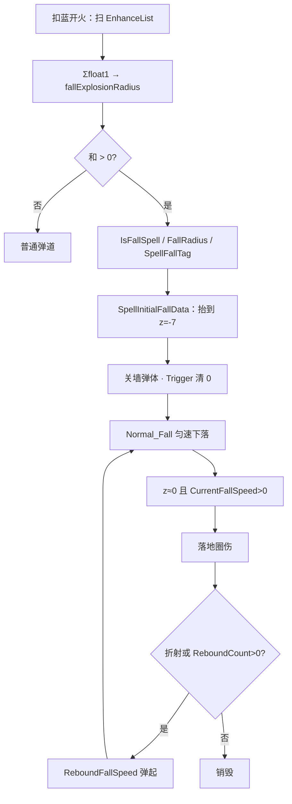

# 坠落（Spell3119 / Fall）逆向分析

> 范围：仅玩家强化符文「坠落」（`abilityType = 3119`，配置 ID `31191–31193`）。重点是**怎么把弹变成从天而降、落地炸**，以及**会改坠落行为的其它法术**。
> 不展开陨石 / 龙息 / 超新星 / 审判之刃等固有坠落法术的专属 Job。它们只作为「3119 在这些法术上怎么变」来写。
> 方法：`SpellConfig.json` + 反编译 `Assembly-CSharp` 交叉验证。未标注「推测」的结论均有代码/数据直接证据。
> 玩家施法主路径是 ECS。Mono `SpellBase` 叠加上限与 ECS 一致，落地圈公式略有差别，文末单独对照。
> 配套：总览见《魔法工艺法术系统逆向报告.md》，原始数值见《法术数值总表.md》，落地弹次数见《反弹逆向分析.md》，附加圈乘算见《范围增强逆向分析.md》，竖直初速见《加速器逆向分析.md》，子弹改写见《分裂逆向分析.md》，悬停短路见《悬停逆向分析.md》。

---

## 1. 身份与定位


| 项 | 值 |
| --- | --- |
| 中文名 | 坠落 |
| 英文名 | Fall |
| `abilityType` | `3119` / `SpellAbilityType.Fall` |
| 配置 ID | `31191`（Lv1）/ `31192`（Lv2）/ `31193`（Lv3） |
| 稀有度 | 普通（`dropType=1`） |
| `useType` | `2`（Enhance 强化符文） |
| 槽位消耗 | `slotCost=1`，自身 `mpCost=0`、`damage=0` |
| 作用对象 | `haveEffecforMissileSpell=true`，`haveEffecforSummonSpell=false` |
| 合成 | Lv1→Lv2→Lv3（`canCompound`：Lv1/2=`true`，Lv3=`false`） |
| 售价（金币） | 12 / 36 / 108 |


**机制一句话**：发射时把 `float1` **求和**成落地附加圈；只要和 > 0，整发进入坠落态。生成时把弹抬到落点上空 `z=-7`，关掉墙弹和飞行 Trigger；首落匀速下坠，落地用 `Radius.Calculate()` 炸一圈，再决定弹跳、折射或销毁。



坐标系：`z=0` 是地面，`z` 越负越高。`CurrentFallSpeed > 0` 表示往地面掉。

文案（`TextConfig_Spell` id `7131191–7131193`）：

> 法术将从天而降，触地时对周围**float1**米内目标造成伤害

名称（`7031191–7031193`）：坠落 / Fall。三级名称相同，只有 `float1` 不同。

---

## 2. 数值与叠加

### 2.1 配置表（`assets_export/SpellConfig.json`）


| ID | Level | float1 附加圈 | float2 | 售价 | 可合成 |
| --- | --- | --- | --- | --- | --- |
| 31191 | 1 | **1** | 1 | 12 | true |
| 31192 | 2 | **1.5** | 1 | 36 | true |
| 31193 | 3 | **2.3** | 1 | 108 | false |


规律：售价每级 ×3。`float1` 不是整倍：两张 Lv1 = **2.0**，大于一张 Lv2 的 1.5；两张 Lv2 = **3.0**，大于一张 Lv3 的 2.3。`int1/2/3`、`float3` 全 0。无耗蓝倍率。

### 2.2 字段语义


| 字段 | 语义 | 运行时是否被读 | 置信度 |
| --- | --- | --- | --- |
| **float1** | 落地附加圈（米），多张**相加** | 是 | 高 |
| float2 | 配置三级都是 1 | ECS 坠落路径 **未读** | 高 |
| int1 / int2 / int3 / float3 | 配置为 0 | ECS **未读** | 高 |


叠加入口：`SpellShootData.GetSpellFallExplosionRadius`。

```596:602:decompiled/Assembly-CSharp/SpellShootData.cs
	public float GetSpellFallExplosionRadius()
	{
		return (from e in EnhanceList
			select e.GetFinalConfig() into e
			where e.abilityType == SpellAbilityType.Fall
			select e).Sum((SpellConfig e) => e.float1);
	}
```

`spellIsFall` 不是单独旗标，而是派生：

```640:640:decompiled/Assembly-CSharp/SpellInitialParameter.cs
	public bool spellIsFall => fallExplosionRadius > 0f;
```

一张 Lv1 就把整发改成坠落。这个函数**不读** `haveEffecforMissileSpell` / `haveEffecforSummonSpell`。自动填槽的 `Filter_SummonOnlyEnhance` 只看导弹标记；坠落的导弹标记是 true，所以自动填也会给召唤配。手动插同样会把圈写进快照，但队友实体不走 `SpellInitialFallData`（见 4.12）。

卡面半径：主法术 `radius != 0` 或附加圈 > 0 时显示。龙息、超新星直接不显示半径行。实体落地圈以 `Radius.Calculate()` 为准，见 3.5。

---

## 3. 主路径（核心）

普通弹道（能进 `SpellMoveJob`、且没用 `DisableDefaultFallDamage`）走下面五步。陨石是唯一不靠 3119 也强制 `IsFallSpell` 的主动技，见 4.13。

### 3.1 发射时烘焙，只扫一次

1. `SpellInitialParameter.Builder` 调 `GetSpellFallExplosionRadius`，写入 `SIP.fallExplosionRadius`。
2. 聚爆若 `radiuDecreaseRatio < 1`，且表半径 > 0 **或** 附加圈 > 0，把 `(表半径 + 附加圈)` 折进伤害倍率。`radius=0` 的魔法弹只挂坠落、也能进这句。
3. `ShootSpellUtils.SipToSSP`：

```244:260:decompiled/Assembly-CSharp/ShootSpellUtils.cs
			IsFallSpell = sip.spellIsFall,
			// ...
			FallTargetPosition = (sip.finalShootSpatialInfo.Target ?? info.CreatePosition),
		// ...
			Radius = new RadiusAttributeValue(configCopy.radius)
			{
				FallRadius = sip.fallExplosionRadius,
```

`IsFallSpell` 和 `FallRadius` 从此绑在快照上。后面临时把一份 `radius` 副本的 `FallRadius` 清 0、去算公转半径，**不动** `ConfigComponentData.Radius`。

陨石额外：`abilityType == Meteor` 时再把 `IsFallSpell` 写成 true。没挂 3119 时 `FallRadius` 仍是 0。

### 3.2 `SpellInitialFallData`：改出生点和速度

`SipToSSP` 末尾：`IsFallSpell` 且**不是召唤**，用已经 `Calculate()` 过的最终速度（含加速器）调用：

```1887:1898:decompiled/Assembly-CSharp/SpellTools.cs
	public static void SpellInitialFallData(ref SpellSpawnParams spawnParams, float3 targetPos, float spellSpeed)
	{
		spawnParams.MovementComponentData.Gravity = math.max(43f * spellSpeed / 16f, 12f);
		spawnParams.MovementComponentData.OriginalSpellHorizontalSpeed = spellSpeed;
		spawnParams.MovementComponentData.CurrentFallSpeed = spellSpeed;
		float3 input = targetPos;
		float3 @float = -spawnParams.MovementComponentData.Direction;
		spawnParams.SpawnPosition = input + @float * 2f + new float3(0f, 0f, -7f);
		float3 x = spawnParams.SpawnPosition.IgnoreZ();
		float3 y = input.IgnoreZ();
		spawnParams.MovementComponentData.Speed *= math.distance(x, y) / 7f;
	}
```

默认值：`Gravity=0`、`CurrentFallSpeed=0`、`FallingReboundForceRatio=1`。初始化之后：

| 字段 | 值 |
| --- | --- |
| 出生点 | 瞄准点沿 `-Direction` 退 2，再抬到 `z=-7` |
| `CurrentFallSpeed` | 最终飞行速度（首落匀速） |
| `OriginalSpellHorizontalSpeed` | 同上，追赶分支后头改读这个 |
| `Gravity` | `max(43 × speed / 16, 12)`，**首落不用**，落地弹才用 |
| `Speed` | 再 ×（水平距离 / 7）。方向单位化时距离是 2，即 ×`2/7` |

水平 2、竖直 7、竖直速度 = `spellSpeed`：落地时间 ≈ `7 / spellSpeed`，需要的水平速度正好是 `spellSpeed × 2/7`。

### 3.3 生成时改碰撞、打标签

`SpellShootSystem.SpawnSpellEntity`：

1. `IsFallSpell`：加 `SpellFallTag`。
2. `ReboundCount <= 0` **或** `IsFallSpell`：`DisableSpellReboundCollider`（墙 / 悬崖子体关掉）。坠落不再走墙弹。
3. `IsFallSpell`：Trigger 的 `CollidesWith &= 0`（只改 Trigger，不改 Collider）。飞行中 Trigger 不打人、也不因 Unknown 墙销毁。
4. 半途传送：`IsFallSpell` 时整句不挂。
5. 坠落弹不计入法术组后坐力（`GetGroupRecoilData` 直接滤掉 `fallExplosionRadius > 0`）。

### 3.4 飞行：`Normal_Fall`，首落不加重力

`SpellMoveJob` 末尾对大多数法术调 `Normal_Fall`，再 `Position.z += CurrentFallSpeed * dt`，并夹到 `z <= 0`。火球非坠落走 `TrickMine_Fall`，不走这套。龙息 / 符文锤 / 鱼叉 / 魔法盾 / 常驻黏连不进这个 Job。

```532:557:decompiled/Assembly-CSharp/SpellMoveJob.cs
	private void Normal_Fall(...)
	{
		fallGrounded = false;
		if (movement.IsFallRebounded || ParabolaLookup.HasComponent(spell))
		{
			movement.CurrentFallSpeed += movement.Gravity * DeltaTime;
		}
		if (!(transform.Position.z >= -0.001f) || !(movement.CurrentFallSpeed > 0f))
		{
			return;
		}
		fallGrounded = true;
		transform.Position = transform.Position.IgnoreZ();
		if (movement.ReboundCount > 0)
		{
			// 抛物线非坠落：乘 BounceRatio；否则 ReboundFallSpeed()
		}
		movement.IsFallRebounded = true;
	}
```

要点：

- **第一次下落不加重力。** `IsFallRebounded` 为假且没有抛物线组件时，`CurrentFallSpeed` 保持初值。
- 落地条件：`z ≈ 0` 且还在往下掉。当帧把位置拍到地面，打开 `SpellGroundedTag`。
- `Normal_Fall` 在 `ReboundCount > 0` 时会先改一次竖直速度，**不扣次数**。真正扣次在落地伤害 Job。
- `ReboundFallSpeed()`：`CurrentFallSpeed = -√Gravity × FallingReboundForceRatio × 1.8`（负值 = 往上弹）。
- 朝向：`SpellLookDirectionJob` 把水平速度和 `CurrentFallSpeed` 合成后再算转角；非坠落只看平面 `Direction`。

`SpellSystem.UpdateDuration`：坠落只加 `DurationTimer`，**不**因时长用尽销毁，也**不**进悬停。活到落地再决定死活。

### 3.5 落地：`SpellFallDamageSystem`

查询：`SpellGroundedTag` + `SpellFallTag`。默认：

1. 在地面播 `3119_Fall_{颜色}` 粒子（`DisableAutoCreateFallEffect` 可关）。
2. 若未 `DisableDefaultFallDamage`：
   - 半径 = `config.Radius.Calculate()` = `(表半径 + FallRadius) × (1+AddRatio) × MulRatio + Extra`
   - `GetAttackableEntitiesInRange` 圈人，`CostPenetrate = false`
   - `TryRefractOrReboundWhenFall`：打到人且有折射 → `TryRefract`（改 `Direction` / `FallTargetPosition`，再 `ReboundFallSpeed`）；否则 `TryReboundWhenFall`（`ReboundCount--` 再弹）
   - 两者都失败 → `SpellDestroyTag`
3. 清掉 `SpellGroundedTag`（除非 `DisableAutoClearFallGroundedTag`）。

`TryReboundWhenFall`：

```1952:1961:decompiled/Assembly-CSharp/SpellTools.cs
	public static bool TryReboundWhenFall(ref SpellMovementComponentData movement)
	{
		if (movement.ReboundCount <= 0)
		{
			return false;
		}
		movement.ReboundCount--;
		movement.ReboundFallSpeed();
		return true;
	}
```

没有反弹时：落地一次就炸、就死。`ReboundCount = N` 时可以再弹 N 次，第 N+1 次落地销毁。文案「每次反弹 +1s」仍写在 `ReboundAddTime` 里，但这条墙撞加时分支坠落进不去。

部分预制体 `DisableDefaultFallDamage=true`，改走自己的 Fall Job（破法者、审判之刃、蛇行、符文锤等）。通用管线到「打开 GroundedTag」为止，后面的炸和弹由它们自己写。

---

## 4. 和其它法术的关系

只写会改坠落行为的交互。齐射 / 多重 / 伤害强化等只改发射或数值，不改从天而降，不列。

### 4.1 反弹 3012

生成时墙弹体已关。`ReboundCount` 被落地复用，不再表示撞墙几次。

| | 墙弹（非坠落） | 落地弹（坠落） |
| --- | --- | --- |
| 开不开墙弹体 | `Count>0` 才开 | 一律关 |
| 谁扣次 | `SpellMoveJob` 撞墙 Enter | `TryReboundWhenFall` |
| 加时 | `Duration.Extra += ReboundAddTime` | **不加** |
| 弹起速度 | Unity Physics 改水平速度 | `ReboundFallSpeed()` 只改竖直 |


分裂子弹还会把 `FallingReboundForceRatio *= 0.7`，并预标 `IsFallRebounded`（见 4.2）。详情见《反弹逆向分析.md》4.3。

### 4.2 分裂 3013

`ToSplit` 整包复制快照，**不改** `IsFallSpell` / `FallRadius` / `ReboundCount`。然后：

```48:57:decompiled/Assembly-CSharp/SpellSpawnParamsStorage.cs
		if (ssp.MovementComponentData.IsFallSpell)
		{
			ssp.MovementComponentData.FallingReboundForceRatio *= 0.7f;
			ssp.MovementComponentData.IsFallRebounded = true;
			ssp.MovementComponentData.ReboundFallSpeed();
		}
		else
		{
			ssp.MovementComponentData.Speed *= 0.5f;
		}
```

| | 非坠落子弹 | 坠落子弹 |
| --- | --- | --- |
| 速度 | `Speed *= 0.5` | **不砍** `Speed` |
| 弹力 | — | `FallingReboundForceRatio *= 0.7` |
| 重力 | — | 预标已落地，出生就加重力、先往上弹 |
| 表半径 | `Base *= 0.8` | 同样 `Base *= 0.8`；**`FallRadius` 不缩** |


位置：坠落用母弹当前坐标，不沿方向再偏半径。计时器随快照重开。详见《分裂逆向分析.md》3.2。

### 4.3 范围增强 3107

`FallRadius` 和表半径进同一套 `(1+AddRatio)×MulRatio`。多张坠落先求和，再被范围增强放大。

`[坠落Lv1][范Lv1][魔法弹]`：`radius=0`，落地圈 = `1 × 1.3 = 1.3`。`[坠落][范][分裂][陨石]` 的子弹：表半径 ×0.8，附加圈仍按母弹满额吃范围增强。

完整乘算见《范围增强逆向分析.md》4.1。

### 4.4 加速器 3106

`SpellInitialFallData` 吃的是已经含加速器的 `speedAttribute.Calculate()`。加速器同时抬：

- 竖直初速 `CurrentFallSpeed`
- 重力 `max(43×speed/16, 12)`
- 水平 `Speed`（再被距离 / 7 缩放）

追赶类在坠落时多数改读 `OriginalSpellHorizontalSpeed`，不读被距离缩放后的 `Speed`。详见《加速器逆向分析.md》4.5。

### 4.5 穿透 3006

飞行 Trigger 已清 0，普通坠落**飞过单位不扣穿透**。落地圈 `CostPenetrate = false`，炸完也不扣。

穿透耗尽销毁这条，对默认坠落落地基本用不上。专属 Fall Job 若自己打人，仍可能读穿透；这里不展开。

### 4.6 折射 3121

单位命中折射被 `!IsFallSpell` 挡住（`SpellTakeDamageResultSystem`）。坠落改走落地那句 `TryRefractOrReboundWhenFall`：

- 当帧圈到人，且 `RemainCount > 0`：折向下一个敌人，扣折射，弹起。
- 否则才试落地弹（扣 `ReboundCount`）。
- 两样都没有：销毁。

墙弹不消耗折射；落地折射不打开墙弹体。

### 4.7 悬停 3008

`UpdateDuration` 对 `IsFallSpell` 短路：只加 `DurationTimer`，不加 `HoverTimer`，也不因时长销毁。`SpellHoverDamageJob` 带 `WithNone<SpellFallTag>`，坠落实体不进悬停第二段。

秒数仍写进快照，通用坠落不用。高压水枪等会把悬停折进 `Duration`，属于专属 Job。

### 4.8 寻踪 3010 / 自动导航 3011 / 自我追踪 3114 / 公转 3009

追赶在坠落时改读 `OriginalSpellHorizontalSpeed`，把 `Direction` 往目标拧。水平轨迹会被追赶盖住；竖直仍由 `CurrentFallSpeed` 管。

寻踪 + 尚未落地：审判之刃那种「落地前先锁当前方向」是专属分支，通用追赶没有这句。

公转：`SpellInitialFallData` 仍把出生点抬到天上；`SpawnSpellEntity` 再把 XY 铺到环上，**保留** `SpawnPosition.z`（-7）。公转半径烘焙时用的是清过 `FallRadius` 的副本，坠落圈不进环半径。

### 4.9 无视墙壁

坠落自己已经清掉 Trigger，AI 的 `SpellGroupWillIgnoreWall` 见到 3119 直接当无视墙。遗物 `IsIgnoreWall` / 公转还会在生成时去掉墙层，和坠落叠在一起只是更彻底，不改落地炸。

### 4.10 激光 1004 / 分解射线 1011

不走 `SpellMoveJob` 的 `Normal_Fall`。各自步进 Job 会读 `IsFallSpell` / `CurrentFallSpeed` 做落地线，不写完整射线算法。

激光这边坠落改的**不只是轨迹，而是整个伤害模型**（五种运动类型各有一条 Fall 变体，共 10 条线生成路径）：

- **沿线不再检测单位。** `NormalFallLineGenerate` 全程**没有任何** `CheckHitEnemyByStepVelocity` 调用 —— 非坠落激光靠射线沿途命中，坠落激光的射线只负责画到落点。
- **伤害全部来自落点圆。** `TouchGroundExplosion`（`Spell1004LaserJob` L1406–1427）取 `radius = config.Radius.Calculate()`，再 `GetAttackableEntitiesInRange(touchGroundPos, radius, ...)`。坠落态的折射搜敌半径也是同一个值。
- **于是范围增强 3107 从废槽变成必需品。** 激光配置 `radius = 0`，非坠落时这张卡毫无作用；坠落时它是伤害圈与折射圈的唯一来源 —— 而 `AddRatio` 是加算比例，`0 × (1 + 0.3)` 仍是 0，所以没有其它半径来源时 `[坠落][激光]` 几乎打不出伤害（**置信度中**，见下）。
- **落点还有随机偏移**：`Random.NextFloat3Direction() × Scatter × 0.06`，所以齐射 / 超载散射会让坠落激光的落点散开。
- **悬停绊线拿不到。** L652 的重扫块第四道门是 `!valueRW.IsFallSpell`，`[坠落][悬停][激光]` 只剩加时。

待验证：零半径的 `GetAttackableEntitiesInRange` 在 Unity Physics 下是否仍返回包含该点的碰撞体，以及坠落是否通过 `FallRadius` 之类给出非零底数。详见《激光逆向分析.md》§4.5 与待决项②。

### 4.11 半途传送 3130

`SpawnSpellEntity`：`IsFallSpell` 时不挂 `SpellHalfLifeTeleportData`。符文锤 / 激光 / 龙息 / 高压水枪本来也不挂。

### 4.12 冲刺 / 召唤 / 常驻施法

| 对象 | 坠落怎么变 |
| --- | --- |
| 冲刺 `1016` | **毁卡**。非坠落 +15 `ReboundCount`；挂上坠落不再加。更关键的是 `Spell1016DashSystem` 的两个主循环开头都是 `if (movement.IsFallSpell) continue;` —— **不载人、不无敌、不响应 WASD**，冲刺退化成一颗普通落地弹。它专属的 `SpellFallTag` Job（L139–163）**只放粒子和音效，不造成任何伤害**，落地伤害仍由通用 `SpellFallDamageSystem` 出；Lv2+ 的结束爆炸不看 `IsFallSpell`，仍会炸。详见《闪电疾行逆向分析.md》§7.4 |
| 召唤（`haveEffecforSummonSpell=false`） | 自动填仍可能配（只看导弹标记）。快照会写 `IsFallSpell` / `FallRadius`，但 `SipToSSP` **跳过** `SpellInitialFallData`，队友不从天上掉 |
| 破法者 `Summon4` | 非坠落 +15 反弹；坠落时不走这句。落地改走自己的 Fall Job |
| 龙息 / 符文锤 / 鱼叉 / 魔法盾 / 常驻黏连 | 不进 `SpellMoveJob`，没有这套 `Normal_Fall` |


### 4.13 固有坠落 / 会改初速的主动技

只写 3119 或通用管线在它们身上怎么变，不写专属算法。


| 对象 | 怎么变 |
| --- | --- |
| 陨石 `1013` | `SipToSSP` 硬编码 `IsFallSpell=true`。不挂 3119 时 `FallRadius=0`，落地圈只用表半径 |
| 火球 / 奥术新星 / 冲刺 / 悬停火把 / 预兆烟花 | 非坠落 +15 `ReboundCount`；挂上坠落**不再加** |
| 火球非坠落 | 走 `TrickMine_Fall`，不走 `Normal_Fall` |
| 蝴蝶 `1003` | 坠落时三速 ×0.35，**并且核心机制整个关掉**（见下） |
| 黑洞 | 坠落时上述三速 ×6 |
| 巨型泡泡 | `CurrentFallSpeed += 2`，`Speed += \|2 / tan(75°)\|` |
| 霰弹 | 坠落时不走散射偏角 |
| 奥爆 | 生成时 `Speed=0`、时长改 0.6s；非坠落关掉自动导航一类逻辑时，坠落反而会开 |
| 龙息 / 超新星 / 审判之刃 / 闪耀星矢 / 符文锤 / 高压水枪 | 有自己的 Fall Job；`DisableDefaultFallDamage` 或根本不进 `SpellMoveJob` |

**蝴蝶补充：`×0.35` 不是主要影响。** `Spell1003Job` 的守卫是 `!data.StartTraceTargets && !movement.IsFallSpell`，坠落蝴蝶的 `StartTraceTargets` **恒为 false**，于是整个 `if` 块永远跳过：

- **不减速**——`Speed` 保持 `15 × 0.35 = 5.25` 不变
- **不追踪**——`Butterfly_Common` 里 `if (StartTraceTargets)` 恒假，直接落到末行 `velocity.Linear = movement.Direction * movement.Speed`，等价于 `Normal_Common`

即「坠落 + 蝴蝶」= 一枚 5.25 m/s 的普通坠落弹，蝴蝶的减速—相变—追踪全部失效，只保留「一次 3~5 发、单只伤害低」。玩家侧看到的是「蝴蝶不追人了」，比速度 ×0.35 显眼得多。落地处理本身不特殊（`Normal_Fall` + z 轴积分，`radius=0` 时落地圈只有 `FallRadius`）。详见《蝴蝶逆向分析.md》7.3。

这是一条**通用教训**：坠落改的不只是运动学，凡是自身 Job 带 `!IsFallSpell` 守卫的法术，坠落会连带关掉它的专属机制。复刻时要按法术清查这类守卫，而不是只看速度字段。


---

## 5. Mono 残留轨对照

`SpellBase` 的 Enhance 开关**没有** `case Fall`。坠落态完全看 `SIP.spellIsFall`（同一份 `GetSpellFallExplosionRadius`）。

落地：`Height` 从正落到 ≤0 时 `OnFallingGround` → 圈伤 → `TryFallingRefract` / `TryFallingRebound`（扣 `rebounceTime`）→ 失败则回收。首落同样不加重力，弹起后才用 `InFallingReboundingGravity`。

落地圈公式不同：

| | 公式 |
| --- | --- |
| ECS | `(Base + FallRadius) × (1+AddRatio) × MulRatio + Extra` |
| Mono `GetFallingGroundDamageRadius` | `spellCfg.radius + SIP.fallExplosionRadius × radiusRatio × finalRadiusRatio` |


若 `spellCfg.radius` 还是表值、没有先乘过半径比，Mono 圈会偏小。玩家主路径以 ECS 为准。

分裂：Mono 对非坠落才 `finalSpeedRatio *= 0.5`，坠落位置用当前坐标，和 ECS 一致。

---

## 6. 证据索引


| 文件 | 作用 |
| --- | --- |
| `SpellShootData.GetSpellFallExplosionRadius` | `float1` 求和 |
| `SpellInitialParameter.spellIsFall` / `Builder` | `fallExplosionRadius > 0` 即坠落；写入 SIP |
| `ShootSpellUtils.SipToSSP` | `IsFallSpell`、`FallRadius`、陨石强制坠落、`SpellInitialFallData` |
| `SpellTools.SpellInitialFallData` | 重力、竖直初速、出生点 `z=-7`、水平速度缩放 |
| `SpellTools.TryReboundWhenFall` / `TryRefractOrReboundWhenFall` | 落地弹 / 落地折射 |
| `SpellShootSystem.SpawnSpellEntity` | `SpellFallTag`、关墙弹、Trigger 清 0、半途传送不挂 |
| `SpellMoveJob.Normal_Fall` / `ReboundFallSpeed` | 首落无重力；落地标 Grounded、弹起 |
| `SpellFallDamageSystem` | 默认落地圈伤、粒子、销毁 |
| `RadiusAttributeValue.Calculate` | `(Base+Fall)×(1+Add)×Mul+Extra` |
| `SpellSystem.UpdateDuration` | 坠落不加悬停、不因时长销毁 |
| `SpellHoverDamageJob` | `WithNone<SpellFallTag>` |
| `SpellTakeDamageResultSystem` | 单位命中折射被 `!IsFallSpell` 挡住 |
| `SpellSpawnParamsStorage.ToSplit` | 坠落不砍 Speed，弹力 ×0.7 |
| `SpellSpawnParamsProcessor` | 蝴蝶 / 黑洞 / 泡泡等改初速；若干法术非坠落 +15 反弹 |
| `SpellLookDirectionJob` | 坠落朝向合成竖直速度 |
| `SpellGroupAttackDistanceCalculator` | 坠落当无视墙；攻击距离估成 0 |
| `SpellShootGroup.GetGroupRecoilData` | 坠落不计入后坐力 |
| `SpellBase.OnFallingGround` / `GetFallingGroundDamageRadius` | Mono 落地 |
| `SpellConfig.json` `31191–31193` | 配置原始值 |
| `TextConfig_Spell` `703119*` / `713119*` | 名称与文案 |
