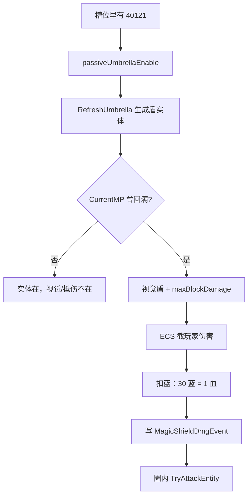

# 奥术屏障（Spell4012 / Umbrella）逆向分析

> 范围：仅玩家被动符文「奥术屏障」（`abilityType = 4012`，配置 ID `40121`）。含 `Wand.RefreshUmbrella` 生成、`UmbrellaShieldController` 抵伤 / 反伤、`Spell4012MagicShield*` ECS。
> 保护伞法杖（`WandConfig` `4012`）只写**如何启用盾**，不做法杖全属性表。
> 不展开 3001–3130 逐条空表；只核实盾会读的强化。不写敌人护盾、其它 40xx 自动法术。
> 方法：`SpellConfig.json` + 反编译 `Assembly-CSharp` 交叉验证。未标注「推测」的结论均有代码/数据直接证据。
> 玩家挨打主路径是 ECS。Mono `UnitProperty.considerUmbrella` 为残留轨，文末单独对照。
> 配套：总览见《魔法工艺法术系统逆向报告.md》，原始数值见《法术数值总表.md》，伤害加算池见《伤害强化逆向分析.md》，半径加算见《范围增强逆向分析.md》，子弹分裂（不是盾分裂）见《分裂逆向分析.md》。晶石自扫旁路见《毒液晶石逆向分析.md》《雷霆晶石逆向分析.md》。

---

## 1. 身份与定位


| 项 | 值 |
| --- | --- |
| 中文名 | 奥术屏障 |
| 英文名 | Arcane Barrier |
| `abilityType` | `4012` / `SpellAbilityType.Umbrella` |
| 配置 ID | `40121`（只有 1 级） |
| 文案 ID | 名 `7040121` / 机制 `7140121` / 风味 `7240121` |
| 稀有度 | 史诗（`dropType=3`） |
| `useType` | `3`（Passive 被动，法杖核心机制） |
| 槽位消耗 | `slotCost=3`，自身 `mpCost=0`、`damage=0` |
| 作用对象 | `haveEffecforMissileSpell=false`，`haveEffecforSummonSpell=false` |
| 合成 | 不可合成（`canCompound=false`） |
| 售价（金币） | 75 |
| 预制体字段 | `prefab=""`；ECS 用 `PrefabId = 40121/10 = 4012` |
| 视觉 / 爆炸 | `Prefabs/Spell/4012/40121Shield`、`4012_Explosion` |


**机制一句话**：插在法杖上的被动。先把法杖蓝上限 **+int2**；这根杖**曾经回满过一次**之后，玩家挨打时用蓝按「**float2 点蓝 = 1 点血**」抵伤，并按「**耗蓝 × int1 × 伤害倍率**」对周围打一圈反伤。抵伤看的是**当前这根杖还够不够付 30 蓝**，不是「必须一直满蓝」。



> **和分裂相反：分裂是开火扫一次 EnhanceList、子弹只复印快照。盾是「生成时烘焙一份给实体元素」，挨打时再扫一遍整杖强化算伤 / 齐发点数 / 分裂点数。**

文案（`TextConfig_Spell` id `7140121`）：

> 法杖魔法值上限+**int2**
> 奥术屏障可以用 **float2** 点魔法值抵消 1 点伤害，并对半径 **float3** 米内的目标造成所消耗魔法值 **int1** 倍的伤害

名称（`7040121`）：奥术屏障 / Arcane Barrier。

风味（`7240121`）：

> 只有在法杖满魔力时才会生成屏障，当法杖魔力耗尽时屏障消失。

风味后半句和实现不一致，见 3.2。

---

## 2. 数值结构

### 2.1 配置表（`assets_export/SpellConfig.json`）


| ID | Level | int1 伤倍 | int2 蓝上限 | float1 | float2 蓝/血 | float3 半径 | 售价 | 可合成 |
| --- | --- | --- | --- | --- | --- | --- | --- | --- |
| 40121 | 1 | **3** | **400** | 0.12 | **30** | **4** | 75 | false |


只有这一行。`int3=0`，`speed/duration/knockback/radius` 全 0。

### 2.2 字段语义


| 字段 | 语义 | 运行时是否被读 | 置信度 |
| --- | --- | --- | --- |
| **int1** | 反伤 = 耗蓝 × int1 × 伤害倍率 | 是（`Mp2DamageRatio`） | 高 |
| **int2** | 法杖蓝上限加算（`passiveBonusMaxMp`） | 是（`CheckWandSlotPassiveEffect`） | 高 |
| **float2** | 抵 1 点血要花的蓝 | 是（`GetWandOneHpAsMp` **直接返回 30**） | 高 |
| **float3** | 爆炸半径（米） | 是（`DamageRadius`） | 高 |
| **float1** | 抵伤后的无敌帧（秒） | 是（`InvincibleTime`）；**文案未写** | 高 |
| `Mp2HpRatio` | `float2/100 = 0.3` | **全工程无读取** | 高 |
| `mpCostRatio` | 扫描强化的耗蓝倍率再乘杖修正 | 写了，**抵伤不读** | 高 |


`GetWandOneHpAsMp(float maxMp)` 的参数没用，恒返回 `SpellConfig.dic[40121].float2`。

保护伞杖本体 `WandConfig 4012`：`maxMP=110`、`mpRecovery=19`、`costCorrection=80`、`specialAbility=0`。插上奥术屏障后上限变成 `ceil((110 + 其它加算 + 400) × 各种倍率)`，不是「这把杖自带盾」。任意杖插 `40121` 都能开盾。

---

## 3. 生成与开关

### 3.1 两套对象

插上符文后其实有两件东西：


| 对象 | 谁生成 | 何时存在 | 干什么 |
| --- | --- | --- | --- |
| ECS 盾实体（`Spell4012MagicShieldData`） | `Wand.RefreshUmbrella` → `SpawnUmbrella` | 只要 `passiveUmbrellaEnable` | 挂 `MagicShieldDmgEvent` 缓冲、带发射时烘焙的 Element |
| 视觉罩（`40121Shield`） | `UmbrellaShieldController.SpawnShieldObject` | 至少一根杖 **enable + MpFull** | 跟着玩家、按总蓝比变色、播受击/破碎 |


`RefreshUmbrella` 先 `ClearAutoSpell(typeof(Spell4012MagicShieldData))` 清掉本杖旧实体，再 `ShootSpellGroup`。生成组是 `GetApplyWandAllEnhanceEffectShootGroup`：主动法术用**这根杖前后槽全部 Enhance**，不是「奥术屏障左边那几张」。

同一杖多张 `40121`：`int2` 蓝上限**相加**，实体只按**第一张** Umbrella 槽的 ID 生成一次。

`SpellMoveJob` / 寿命计时都把 `Umbrella` 排除在外：盾实体不飞、不靠 `duration` 回收，直到槽位刷新或卸符文。

### 3.2 `passiveUmbrellaMpFull` 闩锁

`Wand.CurrentMP` 的 setter：

1. 第一次插上时若原先没开伞，强制 `MpFull = false`。
2. `CurrentMP >= MaxMP` 且 `MaxMP > 0` → 闩上（满过）。
3. `CurrentMP < 30` 或 `MaxMP <= 0` → 打开（不够付 1 点血）。

**不是「掉下满蓝就碎」，也不是风味写的「蓝耗尽（0）才碎」。** 满过一次之后，蓝可以花到只剩 ≥30，视觉和抵伤都还在；降到 30 以下才从 `GetTargetWands` 里踢出去，视觉破碎。

插上的当帧 MaxMP 已经 +400，必须把**新的更大上限**回满，闩才会合上。

### 3.3 谁算「目标杖」

```330:336:decompiled/Assembly-CSharp/UmbrellaShieldController.cs
	private Wand[] GetTargetWands()
	{
		List<Wand> list = PlayerMgr.Inst.Wands.Where((Wand w) => (object)w != null && w.passiveUmbrellaEnable && w.passiveUmbrellaMpFull && w.WandCfg != null).ToList();
		// ...
	}
```

多根杖各自闩锁。视觉只有一个，颜色用这些杖的 **当前蓝总和 / 上限总和**。

---

## 4. 抵伤：蓝换血

### 4.1 ECS 主路径

`Spell4012MagicShieldDamageChangeSystem` 挂在 `UnitTakeDamageGroup`，`TakeDamageInfoPreProcessSystem` 之后、`UnitPropertySystem` 之前。

条件：

- 目标 `unitType == Player`（队友不挡）
- 目标当前不是无敌
- `!ignoreUmbrella`
- `attackerType != FromUI`

然后用 Controller 上的 `maxBlockDamage`（本帧 Update 里按当前蓝算出来的「还能挡几滴血」）去削 `TakeDamageInfo_Dots.damage`：

- 伤害 ≤ 剩余格挡：玩家这发伤害清 0，记入 `hitMagicShieldDamage`，`damageBlockThisFrame += 伤害`，`maxBlockDamage -= 伤害`
- 伤害更大：只挡掉剩余格挡，余数继续打玩家，`maxBlockDamage = 0`

同一帧多段伤害会按顺序吃同一份 `maxBlockDamage`，吃完就不再挡。

`ignoreUmbrella` 会出现在部分特殊物件、战斗脚本、遗物结算、UI 伤害上。那些打的是「真伤 / 扣费」，不进盾。

### 4.2 实际扣蓝发生在下一拍 Update

ECS 只记账。`UmbrellaShieldController.Update`：

1. 对上杖 ↔ 实体
2. 按闩锁决定视觉在不在
3. `maxBlockDamage = Σ floor(CurrentMP / 30)`（只计目标杖）
4. `CheckBlockDamage`：若上一拍 `damageBlockThisFrame > 0`，调用 `UnderDamage`
5. 走盾分裂延迟
6. `InvincibleTimer -= dt`

`UnderDamage`：

- `damage <= 0` 或 `InvincibleTimer > 0` → **直接返回**，不扣蓝、不爆炸
- 否则 `CostMpByHp((int)damage)`：在目标杖之间**轮流**每次扣 30 蓝，直到伤害扣完或大家都付不起
- 再给**每根目标杖**各打一轮反伤（见第 5 节）
- `InvincibleTimer = 0.12`

`float1=0.12` 的无敌只挡 **UnderDamage**（扣蓝 + 爆炸）。ECS 格挡仍按 `maxBlockDamage` 走。短时间内连挨打：第一拍会扣蓝并爆炸，0.12 秒内后续格挡**可能不再扣蓝、不再爆炸**。

### 4.3 算例（单杖，无伤害强化）

MaxMP 因 int2 变大。满蓝后挨 10 点：

- 格挡 10，扣 `10 × 30 = 300` 蓝
- 反伤基数 `300 × 3 = 900`
- 杖上还剩的蓝只要 ≥30，闩还在，视觉不碎

蓝不足 30 时：ECS 这帧 `maxBlockDamage` 已是 0，余伤打玩家本体。

---

## 5. 反伤爆炸

### 5.1 公式

对每根目标杖：

```
mp      = 本轮总耗蓝 × GetDamageRatio() / 目标杖数量
damage  = int1 × mp          // 3 × mp
radius  = float3 × ShieldSize × GetRadiusRatio()
```

`GetDamageRatio() = (sip.extraDamageRatio + 1) × sip.finalDamageRatio`。

`sip` **不是**生成盾时那份快照，而是挨打当下 `UpdateShieldBuffState` 用假法术 `10001`（`abilityType=1000`，`damage=0`）再跑一遍 `ApplySpellShootDataEffect` 建出来的。假法术的基础伤害是 0，但加算 / 乘算池照常进 SIP，所以伤害强化仍然改倍率。

多杖时总反伤仍是 `int1 × 总耗蓝 × 倍率`；每根杖各放一圈，单圈伤害按杖数均分。各杖强化不同则各用各的 `GetDamageRatio`。

### 5.2 半径实际上是 4

`GetRadiusRatio` 一进来就判断 `ProtectTarget`。反编译里这个字段**从未赋值**，恒为 null，函数恒返回 `1`。

因此：

- 爆炸半径 = `4 × ShieldSize`（`ShieldSize` 默认 1）
- 范围增强 / 虚胖写进了 SIP 的 `extraSizeRatio` / `finalSizeRatio`，**爆炸读不到**
- 悬停说明里的 `float3` 也会按 `GetRadiusRatio()==1` 显示，不会因范围强化变色

聚爆仍能改**伤害**（见 7.2），但不缩小这圈半径。

### 5.3 结算

`MakeDamageDots` 往该杖盾实体的 `MagicShieldDmgEvent` 写 `{damage, Position, radius}`。`Spell4012MagicShieldSystem` 用物理圈查可攻击单位（含脆片），`TakeDamageInfo_Dots.NewInfo` 抄盾实体的 Config / Movement / **Element**，再把 `info.damage` **覆盖成事件里的值**。`CostPenetrate=false`，`CostRefraction=false`。不生成闪电链（`SpellShootSystem` 显式排除 `Umbrella`）。

元素效果用的是**生成盾实体时**烘焙进实体的 `SpellElementEffectComponentData`，不是挨打时 Controller 里那些 `spellVenomTime` 字段。

### 5.4 视觉

爆炸预制体按「目标杖总蓝比」取渐变色。挨打播 `SE_UmbrellaHit` + Hit 动画；没目标杖时播破碎并 2 秒后销毁视觉。

---

## 6. 盾分裂（不是 ECS `ToSplit`）

挨打时若 `spellSplitCount > 0`（杖上分裂符文的 `int1` 求和）：

- 主爆炸伤害仍是满额 `int1 × mp`
- 0.25 秒后，在每个主爆点周围再放 `spellSplitCount` 个点
- 子爆伤害 **×0.33**，半径 **×0.5**
- 不再递归

这是 Controller 本地延迟 AoE，**不走** `SpellSpawnParamsStorage.ToSplit`，没有低帧减数，也不清触发器。和《分裂逆向分析.md》里的子弹分裂是两套。

齐发点数见下一节：读的是 **多重施法 3002**，不是齐射 3001。

---

## 7. 强化怎么作用（对照分裂）

盾吃强化有三条时间线：


| 时间 | 做什么 | 爆炸时谁还在用 |
| --- | --- | --- |
| 槽位刷新 `SpawnUmbrella` | 整杖 EnhanceList 烘焙进盾实体 | Element、实体 Config（暴击等走通用预处理） |
| 挨打 `UpdateShieldBuffState` | 再扫一遍强化 + 用 `10001` 重建 SIP | 伤害倍率、聚爆换伤、多重点数、分裂点数 |
| Controller 自扫字段 | 粘液 / 毒 / 冻 / 烧 / 雷 / 牵引 / 坍缩 | **爆炸不读**（毒的 `int1` 累进 `spellVenomBonusStackCount` 也没人读） |


槽位一变会 `RefreshUmbrella`，实体会重建，生成时那份 Element 会跟上。

### 7.1 挨打时 switch 真会改爆炸的


| Buff | abilityType | 盾上实际 |
| --- | --- | --- |
| **多重施法** | 3002 `Multishot` | `multiShootCount += int1`（1/2/4 → 总共 2/3/5 个爆点）。`==1` 时在脚下；`>1` 时沿 360° 均分，半径取爆炸半径一半 |
| **分裂** | 3013 `SpellSplit` | 见第 6 节 |
| 粘液 / 毒 / 寒霜 / 炽焰 / 雷霆 / 牵引 / 坍缩 | 3004 / 3005 / 3014 / 3111 / 3101 / 3112 / 3129 | 写入 Controller 字段后**没有读者** |


注意命名：`SpellAbilityType.Multishot` 是 **3002 多重施法**，不是 3001 齐射。齐射不进这个 switch。

### 7.2 挨打时 SIP 重建：改伤害倍率

`GetDamageRatio` 读假法术 `10001` + 整杖 Enhance 的 SIP，规则与《伤害强化逆向分析.md》同一套池：


| Buff | 池 | 盾爆 |
| --- | --- | --- |
| 伤害强化 3102 | `extraDamageRatio` 加算 | 继承 |
| 炽焰晶石 3111 的伤害段 | 同一加算池 | 继承 |
| 过载 3123 | 同一加算池 | 继承 |
| 折射 3121 / 节能 3104 的乘段 | `finalDamageRatio` | 继承 |
| 聚爆 3113 | `radiuDecreaseRatio < 1` 时再乘 `1 + GetSpellRadiusToDamageRatio(4×ShieldSize×1, …)` | **只改伤，不缩圈** |
| 法杖 `damageCorrection` / `passiveDamageRatio` / 玩家全局加伤 | Build SIP 时进同一套 | 继承 |
| 节能 / 过载 / 多重 的 `mpCostMulDivCorrection` | 写入 `mpCostRatio` | **抵伤不读**，30 蓝/血不变 |


`GetCriticalChance()` 只给 `SpellInfoFormatters` 悬停说明用。爆炸是否暴击看盾**实体**快照里的 CriticalChance，走通用预处理，不看 Controller 这份 SIP。

### 7.3 生成时烘焙、爆炸命中会带上的

`SpawnUmbrella` 走正常 `SipToSSP`。爆炸 `NewInfo` 带上实体 `Element`，命中附加与普通弹同一套管线：


| Buff | 爆炸命中 |
| --- | --- |
| 粘液晶石 3004 | Element 在则上粘液 |
| 毒液晶石 3005 | Element 在则上毒（层数 × `SpellEfficiency`）；Controller 多写的 `int1` 无效 |
| 寒霜晶石 3014 | `FrozenDuration` |
| 炽焰晶石 3111 | 燃烧段在 Element |
| 坍缩晶石 3129 | 虚空三字段在 Element |
| 雷霆晶石 3101 | 半径 / 伤比写进 Element；**落雷要实体 Destroy 且仍是雷色**。盾平时不销毁，爆炸不当「法术结束」。卸符文 `ClearAutoSpell` 毁掉实体时，才可能走一次销毁落雷 |
| 闪电链 3007 | 生成时被排除，不建链 |
| 法杖随机染色 / 彩虹 | 生成时写入 Color + Element，命中带着走 |


### 7.4 写了但爆炸当空气


| Buff | 原因 |
| --- | --- |
| 齐射 3001 / 超载散射 3003 | switch 不读；也不会再「齐射一次盾」 |
| 穿透 / 反弹 / 折射次数 / 悬停 / 坠落 / 公转 / 寻踪 / 导航 | 盾不飞 |
| 范围增强 3107 / 虚胖 3124 | SIP 有尺寸比，`GetRadiusRatio` 短路为 1 |
| 加速器 / 时长 / 主观缓时 | 无飞行、无寿命 |
| 结束传送 / 半途传送 | 盾不走这些销毁/半命路径 |
| 五类触发器 3201–3205 | EnhanceList 里会带着生成，盾不是普通弹，时机用不上 |
| 召唤专用（寄生 / 脐带 / 血清…） | 可能进 Teammate 快照，盾上没召唤体 |
| 精准施法 3105 | 只稳定影响悬停文案里的暴击显示 |


有伞（以及锤 / 激光晶石 / 彼岸刃 / 鱼叉）时，`GetUnusedSlotsAndType` 直接返回空：杖不会提示「这些强化没人用」。

---

## 8. 明确的死字段 / 文案差


| 项 | 结论 |
| --- | --- |
| `Mp2HpRatio = float2/100` | 从未被读；真公式用的是裸 `float2=30` |
| `mpCostRatio` | 强化耗蓝倍率乘进去了，扣蓝不用 |
| `GetWandOneHpAsMp(maxMp)` | 忽略参数 |
| `Spell4012MagicShieldData.ShieldMaxReduce` / `IsInitialized` | 结构有，无人写无人读 |
| Controller 元素字段（粘液/毒/冻/烧/雷/牵引/坍缩） | 挨打时重写，爆炸不读 |
| `UmbrellaShieldController.thunderColliderTags` / `thunderColliderBuffer` | 声明后**全文零引用**。tag 表里写了 `"RollBall"` / `"Butterfly"`，但伞爆不会去碰这两类脆弱法术实体——**己方蝴蝶不会被自己的伞爆打碎** |
| 风味「蓝耗尽才消失」 | 代码阈值是 **<30 蓝**，不是 0 |
| `float1=0.12` | 无敌帧，机制文案没写 |


---

## 9. 多杖、排除、保护伞杖

### 9.1 多杖

每根插了 `40121` 且闩上的杖都进 `GetTargetWands`。扣蓝轮流付 30。视觉共用。反伤按杖数均分后再各自放圈。

### 9.2 不挡的伤害

- `unitType != Player`（召唤物自己挨打不吃这面盾）
- `ignoreUmbrella`
- `AttackerType.FromUI`
- 目标已无敌（系统直接 `continue`）

### 9.3 保护伞杖

`WandConfig 4012` 中文名「保护伞 / Protective Umbrella」，`specialAbility=0`，**没有**单独的开盾被动。盾只来自槽位里的 `40121`。这把杖可以不插屏障；别的杖插屏障也能开。

---

## 10. Mono 残留轨对照

`UnitProperty` 在 `considerUmbrella && UmbrellaCtrl.CanUnderDamage` 时直接 `UnderDamage(info.damage)`。`CanUnderDamage` = 任一目杖蓝 ≥30。

和 ECS 的差别：


| 项 | ECS（玩家主路径） | Mono |
| --- | --- | --- |
| 入口 | `Spell4012MagicShieldDamageChangeSystem` | `UnitProperty` 受伤 |
| 格挡上限 | 本帧预先算的 `maxBlockDamage` | 立刻按伤害扣蓝 |
| 记帐 vs 扣蓝 | 先改伤害数字，Update 再扣蓝 / 爆炸 | 同步扣蓝并爆炸 |
| 队友 | `unitType==Player` 才进 | 只有玩家身上挂着 Controller |
| 忽略 | `ignoreUmbrella` / FromUI | `considerUmbrella==false` |


讨论玩家挨打以 **ECS** 为准。

---

## 11. 证据索引


| 文件 | 作用 |
| --- | --- |
| `Wand.CheckWandSlotPassiveEffect` / `RefreshUmbrella` / `SpawnUmbrella` | 启用、+400 蓝、生成实体、整杖 Enhance |
| `Wand.CurrentMP` setter | MpFull 闩锁（满上 / 低于 30） |
| `Wand.GetWandAllEnhanceList` | 前后槽全部 Enhance |
| `UmbrellaShieldController` | 视觉、扣蓝、爆炸、分裂延迟、自扫强化 |
| `Spell4012MagicShieldDamageChangeSystem` | ECS 截玩家伤害 |
| `Spell4012MagicShieldSystem` | 消费 `MagicShieldDmgEvent` 圈伤 |
| `Spell4012MagicShieldData` / Authoring | 标签 + 伤害缓冲 |
| `Spell40121MPRatioEffect` / `ExplosionMPRatioEffect` | 按蓝比染色 |
| `SpellInfoFormatters` `4012` | 悬停：半径 / int1 乘当下倍率 |
| `SpellShootSystem` / `SpellSystem` / `SpellMoveJob` | 排除链、排除寿命、排除位移 |
| `SpellConfig.json` `40121` | 配置原始值 |
| `TextConfig_Spell` `7040121` / `7140121` / `7240121` | 名称、机制、风味 |
| `WandConfig.json` `4012` | 保护伞杖本体（仅启用关系） |
