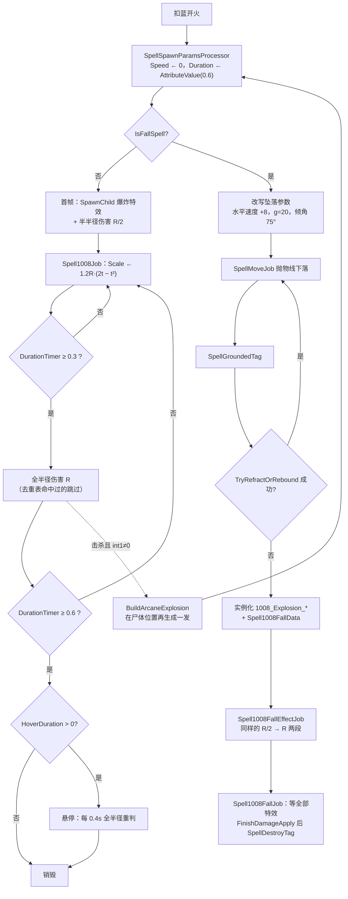

# 奥爆术（Spell1008 / Arcane Explosion）逆向分析

> 范围：玩家主动法术「奥爆术」（`abilityType = 1008`，配置 ID `10081–10083`），含 2/3 级自带的**击杀连锁**与**坠落形态**两条派生路径。
> 方法：`SpellConfig.json` + 反编译 `Assembly-CSharp` 交叉验证。未标注「推测」的结论均有代码/数据直接证据。
> 主路径：玩家施法走 **ECS**（`Spell1008ArcaneExplosionSystem` + 四个 Job）。Mono `Spell1008ArcaneExplosion` 为残留轨，本文按约定不展开，仅在 4.3 作为对照物出现。
> 配套：总览见《魔法工艺法术系统逆向报告.md》，原始数值见《法术数值总表.md》。离线可开见 `奥爆术逆向分析.html`。
> **本文是「零速度瞬发范围法术」的第一篇文档**。奥爆术的 `speed` 与 `duration` 在运行时被硬覆盖，导致整整一类依赖飞行的增强符文对它完全空转——第 7 节逐一校验了 21 张已逆向符文，并列出需要回写既有文档的 4 处。

---

## 1. 身份与定位


| 项             | 值                                                                                            |
| ------------- | -------------------------------------------------------------------------------------------- |
| 中文名           | 奥爆术                                                                                          |
| 英文名           | Arcane Explosion                                                                             |
| `abilityType` | `1008` / `SpellAbilityType.ArcaneExplosion`                                                  |
| 配置 ID         | `10081`（Lv1）/ `10082`（Lv2）/ `10083`（Lv3）                                                     |
| 文案 ID         | 名 `701008x` / 机制 `711008x`（**Lv1 为空**）/ 风味 `7210081` / 短评 `7310081`                          |
| 稀有度           | 普通（`dropType=1`）                                                                             |
| `useType`     | `0`（Missile 主动飞弹）——**但它不飞**，见 2.3                                                            |
| 槽位 / 蓝耗       | `slotCost=1`；`mpCost` = 9 / 18 / 36                                                          |
| 伤害            | `damage` = 16 / 48 / 144                                                                     |
| 影响半径          | `radius` = 3.0 / 3.2 / 3.5                                                                   |
| 暴击率           | `criticalChance=25`（**全表偏高档**，对比魔法弹的 0）                                                      |
| 击退            | `knockback=6`                                                                                |
| 关键字段          | `int1`=0/1/1（击杀连锁开关）、`float1`=0/0.7/1.0（**ECS 路径未实现**，见 4.3）                                 |
| 配置里恒为 0       | `speed`、`duration`、`angle`、`float2/3`、`int2/3`、`gravity`、`upSpeed`、`summonID`；`shootCount=1` |
| 预制体           | 三级共用 `prefab="10081"`，图标 `1008`                                                              |
| 合成            | Lv1→Lv2→Lv3（`canCompound`：Lv1/2=`true`，Lv3=`false`）                                          |
| 售价（金币）        | 9 / 27 / 81                                                                                  |


**机制一句话**：在法杖枪口原地瞬发一个圆形爆炸，判定分两段——**生成瞬间先用半半径** `R/2` **打一次**，`0.3` 秒后**再用全半径** `R` **补一次**，同一敌人靠去重表保证只挨一次；实体在 `0.6` 秒后销毁。2/3 级额外携带**击杀连锁**：被它打死的单位会在尸体位置免费再生成一发同参数奥爆术，且没有递归深度上限。




文案（`TextConfig_Spell`）：

- 名称 `7010081–7010083`：奥爆术 / Arcane Explosion（三级同名）
- 机制 `7110081`：**空字符串**（Lv1 没有连锁，无可解释）
- 机制 `7110082`：> 击杀敌方单位时立刻生成一次 float1 倍半径的奥爆术
- 机制 `7110083`：> 击杀敌方单位时立刻生成一次奥爆术
- 风味 `7210081`：> 据说是引线的最佳伴侣，很多法师都沉迷于这种将魔力聚集在杖端爆发的体验。
- 短评 `7310081`：> 施法处瞬间爆发的范围法术

三个要点：风味文案里的「**杖端**爆发」是准确的——爆炸中心就是法杖射击点而非鼠标位置（见 3.1）；短评的「瞬间」也准确，但**不完整**，实际有 0.3 秒的第二段判定；而机制文案 `7110082` 承诺的「float1 倍半径」在 ECS 路径上**没有实现**（见 4.3）。

---


## 2. 数值结构


### 2.1 配置表原始值（`assets_export/SpellConfig.json`）


| ID    | Level | damage  | mpCost | radius  | criticalChance | knockback | float1 | int1  | 售价  | 可合成   |
| ----- | ----- | ------- | ------ | ------- | -------------- | --------- | ------ | ----- | --- | ----- |
| 10081 | 1     | **16**  | 9      | **3.0** | 25             | 6         | 0      | **0** | 9   | true  |
| 10082 | 2     | **48**  | 18     | **3.2** | 25             | 6         | 0.7    | **1** | 27  | true  |
| 10083 | 3     | **144** | 36     | **3.5** | 25             | 6         | 1.0    | **1** | 81  | false |


规律：`damage` 每级 **×3**（16→48→144），`mpCost` 每级 **×2**（9→18→36），`radius` 只涨 3.0→3.2→3.5（总共 ×1.167，面积 ×1.36）。升级的收益压倒性地集中在伤害上，半径几乎是陪跑；真正的质变在 Lv2 —— `int1` 从 0 变 1，解锁击杀连锁。

`speed=0`、`duration=0`、`angle=0`、`shootCount=1`、`gravity=0`、`upSpeed=0`、`float2=float3=0`、`int2=int3=0`、`summonID=0`。`isDPS=false`、`isKeepCasting=false`、`isParentTypeSpell=false`、`isSplitSpell=false`、`needActivate=false`。

`haveEffecforMissileSpell` / `haveEffecforSummonSpell` 都是 **false**——它们只对 `useType=2` 的强化符文有意义，主动法术这两位不被任何逻辑读取。

### 2.2 字段语义


| 字段                       | 语义                                              | 置信度     | 证据                                                     |
| ------------------------ | ----------------------------------------------- | ------- | ------------------------------------------------------ |
| **radius = 3.0/3.2/3.5** | 爆炸判定半径，进 `RadiusAttributeValue`。**第一段判定只用它的一半** | 高       | `Spell1008TakeDamageJob` L174                          |
| **int1 = 0/1/1**         | 击杀连锁开关，非 0 即触发                                  | 高       | `SpellTakeDamageResultSystem` L282                     |
| **float1 = 0/0.7/1.0**   | 文案称「连锁爆炸半径倍率」，**ECS 路径上从未被读取**                  | 高（否定结论） | 全 `Spell1008*.cs` 检索 + `BuildArcaneExplosion` L235–243 |
| **criticalChance = 25**  | 基础暴击率，`/100` 后与 `sip.extraCriticalChance` 相加    | 高       | `ShootSpellUtils` L272                                 |
| **knockback = 6**        | 击退力度，方向为「爆炸中心 → 目标」                             | 高       | `Spell1008TakeDamageJob` L189                          |
| **speed = 0**            | 死字段。运行时被无条件覆盖为 0，配置写多少都一样                       | 高       | `SpellSpawnParamsProcessor` L46                        |
| **duration = 0**         | 死字段。运行时被无条件覆盖为 `0.6`                            | 高       | `SpellSpawnParamsProcessor` L47                        |
| **angle = 0**            | 散射锥角为 0；`shootCount=1` 时本就不产生散射                 | 高       | 配置 + `CalculateRandomAngle`                            |
| float2/3、int2/3          | 恒 0，无引用                                         | 高       | 配置 + 全工程检索                                             |


两个硬编码常量**不在配置里**，因此无法通过任何符文调节：第二段判定的触发时刻 `0.3f`（`Spell1008Job` L178），悬停期的重判间隔 `0.4f`（同文件 L191）。

### 2.3 两个被硬覆盖的字段：`Speed` 与 `Duration`

这是理解奥爆术全部符文交互的钥匙。`SipToSSP`（法术发射包组装函数）在**最后一步**调用 `SpellSpawnParamsProcessor.Process`：

```517:518:decompiled/Assembly-CSharp/ShootSpellUtils.cs
		SpellSpawnParamsProcessor.Process(info, sip, ref ssp);
		return ssp;
```

而奥爆术的处理器做了两件极其粗暴的事：

```44:48:decompiled/Assembly-CSharp/SpellSpawnParamsProcessor.cs
		_processors.Add(SpellAbilityType.ArcaneExplosion, delegate(ShootSpellUtils.SpellShootInfo info, SpellInitialParameter sip, ref SpellSpawnParams ssp)
		{
			ssp.MovementComponentData.Speed = 0f;
			ssp.ConfigComponentData.Duration = new AttributeValue(0.6f);
		});
```

注意第二行不是「修改 Base」，而是**整个赋值一个新的** `AttributeValue`。而 `AttributeValue(float)` 构造函数会把所有修正位清空：

```16:27:decompiled/Assembly-CSharp/AttributeValue.cs
	public AttributeValue(float baseValue = 0f)
	{
		this = default(AttributeValue);
		Base = baseValue;
		MulRatio = 1f;
	}

	[BurstCompile]
	public readonly float Calculate()
	{
		return (Base + AddBase) * (1f + AddRatio) * MulRatio + Extra;
	}
```

对比几行之前 `SipToSSP` 辛辛苦苦攒出来的 `Duration`：

```274:279:decompiled/Assembly-CSharp/ShootSpellUtils.cs
			Duration = new AttributeValue(configCopy.duration)
			{
				AddBase = sip.extraDuration,
				MulRatio = sip.finalDurationRatio,
				Extra = ((sip.finalMovementType != SpellSpecialMovementType.Rotation) ? 0f : (sip.RotationMovementInfo?.extraDuration ?? 0f))
			},
```

`sip.extraDuration`（时长强化）、`sip.finalDurationRatio`（节能模式的时长折扣）、公转的 `extraDuration`——**全部在 3 行代码后被丢弃**。`Duration.Calculate()` 对奥爆术恒等于 `0.6`，一个符文也改不动。

`Speed` 同理：`speedAttribute` 里攒了加速器的 `bounsSpeed`、`extraSpeedRatio`、`finalSpeedRatio`，算完写进 `MovementComponentData.Speed`，然后被覆盖成 0。

**唯一的例外是坠落形态**，这是个执行顺序上的巧合：

```511:517:decompiled/Assembly-CSharp/ShootSpellUtils.cs
		if (ssp.MovementComponentData.IsFallSpell && !ssp.ConfigComponentData.IsTeammate)
		{
			SpellTools.SpellInitialFallData(ref ssp, sip, speedAttribute.Calculate());
		}
		ProcessPlayerEffect(ref ssp, info, sip);
		ProcessWandRandomColor(ref ssp, sip);
		SpellSpawnParamsProcessor.Process(info, sip, ref ssp);
```

`SpellInitialFallData` 在 L513 就已经把 `speedAttribute.Calculate()`（**含加速器加成**）写进了 `CurrentFallSpeed` / `OriginalSpellHorizontalSpeed`，而处理器在 L517 只归零 `Speed` 这一个字段。所以**加速器对坠落形态的奥爆术是生效的，对普通形态完全无效**（见 7.2）。

### 2.4 每级性价比


| Level | 伤害  | 蓝耗  | 伤害/蓝 | 半径  | 覆盖面积    | 内圈面积（`R/2`） | 售价  |
| ----- | --- | --- | ---- | --- | ------- | ----------- | --- |
| 1     | 16  | 9   | 1.78 | 3.0 | 28.3 m² | 7.07 m²     | 9   |
| 2     | 48  | 18  | 2.67 | 3.2 | 32.2 m² | 8.04 m²     | 27  |
| 3     | 144 | 36  | 4.00 | 3.5 | 38.5 m² | 9.62 m²     | 81  |


「伤害/蓝」是**每目标**的值。奥爆术真正的效率取决于圈里站了几个人：Lv3 一发 36 蓝，砸中 5 个目标就是 720 伤害、20 伤害/蓝，这个数字在主动法术里非常高。再叠上击杀连锁（衍生体**不扣蓝**，见 4.2），清杂兵波次时的实际蓝耗效率还要再翻。

单目标场景则相反：Lv3 单挑 Boss 是 144 伤害 / 36 蓝 = 4.0，属于中下水平。**奥爆术是一张严格的清场牌，不是单体牌。**

---


## 3. 核心机制：两段式爆炸


### 3.1 生成即爆，中心在枪口

奥爆术不经过任何飞行阶段。实体在 `SpawnPosition` 生成后，`Spell1008ArcaneExplosionSystem` 首帧就处理带 `Spell1008InitializedTag` 的实体：

```492:519:decompiled/Assembly-CSharp/Spell1008ArcaneExplosionSystem.cs
			if (!uncheckedRefRW.ValueRO.IsFallSpell)
			{
				if (uncheckedRefRW2.ValueRO.SpellEffectEntity == Entity.Null)
				{
					nativeList.Add(in value);
					continue;
				}
				entityCommandBuffer.SetComponentEnabled<Spell1008InitializedTag>(value, value: false);
				entityCommandBuffer.AppendToBuffer(singletonEntity3, new ScreenShakeData
				{
					Radius = 0.05f,
					Speed = 5f,
					Time = 0.1f
				});
				seName = "Shoot";
				singletonBuffer.Add(new SEData(DTool.GetSpellSEName(1008, in seName)));
				float3 rootPosition = InternalCompilerInterface.GetComponentAfterCompletingDependency(ref __TypeHandle.__Unity_Transforms_LocalTransform_RO_ComponentLookup, ref state, value).Position;
				float3 layerPosition = DTool.GetLayerPosition(in rootPosition, LayerCorrectType.Coordinate);
				seName = "ExplosionTrail";
				float3 position = rootPosition + layerPosition;
				float scale = uncheckedRefRO.ValueRO.Radius.Calculate();
				cmd.CreateSpellGlobalParticle(0, in seName, in position, in scale, in uncheckedRefRO.ValueRO, in uncheckedRefRW2.ValueRO, in spellSingleton, in float3.zero);
				entityCommandBuffer.AppendToBuffer(value, new Spell1008TakeDamageBuffer
				{
					HitPosition = rootPosition + new float3(0f, 0f, -0.3f),
					IsFullRangeDamage = false,
					EffectEntity = uncheckedRefRW2.ValueRO.SpellEffectEntity
				});
			}
```

第一帧走的是 `SpellEffectEntity == Entity.Null` 分支，进 `nativeList` 等待挂特效子实体（L605–618 的 `SpellTools.SpawnChild`）；第二帧特效就位，才真正打出第一发伤害。**所以「瞬发」实际上有一帧的延迟**，对 60 帧约 16ms，玩家无感。

爆炸中心 `SpawnPosition` 来自：

```217:217:decompiled/Assembly-CSharp/ShootSpellUtils.cs
		spellSpawnParams.SpawnPosition = info.CreatePosition;
```

`info.CreatePosition` 是法杖的射击点（`Wand.GetShootPosition()`，即 `tsf_ShootPoint`，缺省退回玩家点位），**不是鼠标位置**。鼠标只影响 `Direction`，而 `Speed=0` 让方向彻底失去意义。这就是风味文案说「杖端爆发」的由来，也是奥爆术手感上最大的约束：**你不能把它扔到远处**，只能贴脸炸。

### 3.2 半径分两段：`R/2` 打一次，`R` 再打一次

伤害的实际执行在 `Spell1008TakeDamageJob`，它消费挂在法术实体上的 `Spell1008TakeDamageBuffer`：

```167:198:decompiled/Assembly-CSharp/Spell1008TakeDamageJob.cs
	private void Execute([ChunkIndexInQuery] int chunkIndex, DynamicBuffer<Spell1008TakeDamageBuffer> buffers, in SpellComponentData data, in SpellMovementComponentData movement, in LocalTransform transform, in SpellElementEffectComponentData elementEffect, ref SpellConfigComponentData config, Entity entity)
	{
		foreach (Spell1008TakeDamageBuffer item in buffers)
		{
			Spell1008TakeDamageBuffer current = item;
			NativeList<Entity> entities = new NativeList<Entity>(Allocator.Temp);
			ref float3 hitPosition = ref current.HitPosition;
			float radius = (current.IsFullRangeDamage ? config.Radius.Calculate() : (config.Radius.Calculate() / 2f));
			SpellTools.GetAttackableEntitiesInRange(in hitPosition, in radius, in config.ShooterType, containsBrittleness: true, in UnitPropertyLookup, in SpellConfigLookup, in PhysicsWorld, ref entities);
			NativeArray<Spell1008HitTargetsData> array = SpellHitTargetLookUp[current.EffectEntity].ToNativeArray(Allocator.Temp);
			TakeDamageInfo_Dots.NewInfo(entity, CostPenetrate: false, in config, in movement, in transform, in elementEffect, in data, out var info);
			foreach (Entity item2 in entities)
			{
				Entity target = item2;
				if (array.IndexOf(target) < 0)
				{
					CMD.AppendToBuffer(chunkIndex, current.EffectEntity, new Spell1008HitTargetsData
					{
						SpellEntity = target
					});
					float3 position = TransformLookup[target].Position;
					info.spell.HitPosition = position + new float3(0f, 0f, -0.3f);
					info.SetKnockbackForceIgnoreZBySpell(position - transform.Position);
					CMD.TryAttackEntity(chunkIndex, in target, in info, in UnitPropertyLookup, in SpellConfigLookup);
				}
			}
		}
		if (buffers.Length > 0)
		{
			buffers.Clear();
		}
	}
```

半径来自 `IsFullRangeDamage` 这个 bool（L174）。两段判定的入队时刻分别是：


| 段   | 时刻                    | `IsFullRangeDamage` | 半径      | 入队位置                                  |
| --- | --------------------- | ------------------- | ------- | ------------------------------------- |
| 第一段 | 生成后第 2 帧              | `false`             | `R / 2` | `Spell1008ArcaneExplosionSystem` L516 |
| 第二段 | `DurationTimer ≥ 0.3` | `true`              | `R`     | `Spell1008Job` L178–187               |


```178:187:decompiled/Assembly-CSharp/Spell1008Job.cs
		if (spell.Config.ValueRO.DurationTimer >= 0.3f && !data.IsFullRangeDamage)
		{
			data.IsFullRangeDamage = true;
			CMD.AppendToBuffer(chunkIndex, spell.Entity, new Spell1008TakeDamageBuffer
			{
				HitPosition = spell.Transform.ValueRO.Position + new float3(0f, 0f, -0.3f),
				IsFullRangeDamage = true,
				EffectEntity = spell.Data.ValueRO.SpellEffectEntity
			});
		}
```

`Radius.Calculate()` 的公式与 `AttributeValue` 略有不同，多了一个专供坠落符文使用的 `FallRadius` 加法位：

```23:27:decompiled/Assembly-CSharp/RadiusAttributeValue.cs
	[BurstCompile]
	public readonly float Calculate()
	{
		return (Base + FallRadius) * (1f + AddRatio) * MulRatio + Extra;
	}
```


### 3.3 命中去重：每个敌人只挨一次

去重表是挂在**特效子实体**（`EffectEntity`）上的 `Spell1008HitTargetsData` buffer。每次入队伤害时，Job 先把整张表拉成数组（L176），命中前查 `array.IndexOf(target) < 0`（L181），命中后追加（L183）。这张表**在实体生命周期内从不清空**。

由此得到奥爆术最反直觉的一条性质：

- 站在 `R/2` 内圈的敌人，在第一段就被记进去重表，**第二段直接跳过**；
- 站在 `R/2 ~ R` 外环的敌人，第一段够不着，**第二段才挨打**；
- 结论：**每个敌人对每一发奥爆术，有且仅有一次伤害**。两段判定不是「打两次」，而是「内圈的人早 0.3 秒挨打」。

这条性质直接决定了奥爆术不是 DPS 型法术（`isDPS=false` 也印证了这点），也决定了悬停符文的收益模式（见 7.7）。

> **一处理论竞态**：`array` 是在处理每条 buffer 项时快照的，而写入走 `CMD.AppendToBuffer`（ECB，延迟到帧末回放）。如果同一帧内有两条 buffer 项共享同一个 `EffectEntity`，两条都会读到同样的旧快照，导致同一目标被打两次。正常时序下两段判定间隔 0.3 秒、悬停跳间隔 0.4 秒，不会撞在同一帧，因此这条路径**理论存在、实际不可达**。置信度：中（未实测）。


### 3.4 判定领先于表现

爆炸球的视觉尺寸由 `Spell1008Job` 驱动：

```148:158:decompiled/Assembly-CSharp/Spell1008Job.cs
			float num4 = spell.Config.ValueRO.Duration.Calculate();
			float num5 = spell.Config.ValueRW.DurationTimer;
			if (spell.Config.ValueRO.HoverDuration > 0f && num <= num3)
			{
				num5 = num4 - num;
			}
			RefRW<LocalTransform> refRW = TransformLookUp.GetRefRW(spell.Data.ValueRO.SpellEffectEntity);
			spell.Config.ValueRW.DurationTimer = math.clamp(spell.Config.ValueRW.DurationTimer, 0f, 1f);
			float num6 = num5;
			float x = (num6 * 2f - math.pow(num6, 2f)) * 1.2f * spell.Config.ValueRO.Radius.Calculate();
			refRW.ValueRW.Scale = math.max(x, 0.01f);
```

注意 `num6` 取的是 `DurationTimer` 的**原始秒数**（L149 取值早于 L155 的钳位），不是归一化进度。所以视觉半径的时间曲线是：

$$R_{vis}(t) = 1.2 \cdot R \cdot (2t - t^2)$$

把两段判定的时刻代进去：


| 时刻              | 视觉半径    | 判定半径       | 差距             |
| --------------- | ------- | ---------- | -------------- |
| `t = 0`（第一段）    | ≈ 0     | **0.50 R** | 判定领先，画面上什么都还没有 |
| `t = 0.3`（第二段）  | 0.612 R | **1.00 R** | 判定领先 63%       |
| `t = 0.6`（寿命终点） | 1.008 R | ——         | 视觉刚好追平判定半径     |


**整个生命周期里，判定始终跑在表现前面。** 玩家看到的火球边缘刚扩到六成，站在圈子最外沿的敌人就已经结算完伤害了。这是奥爆术手感「比看起来大」的根因，也解释了为什么它在实战里比 3 米的标称半径显得更宽容。

`t=0.6` 时 `1.2 × (1.2 − 0.36) = 1.008`，视觉尺寸精确收敛到 1.0 倍半径——这个 `1.2` 系数显然是照着 `0.6` 秒寿命调出来的，两者是绑定的魔法数字。

> **顺带一个被 0.6 秒救下来的隐患**：L155 每帧把 `DurationTimer` 钳到 `[0, 1]`，而销毁条件是 `DurationTimer >= Duration.Calculate()`（`SpellSystem` L280）。如果 `Duration` 能被抬到 1 秒以上，计时器会永远卡在 1.0、永远追不上寿命，爆炸实体将**永不销毁**。之所以没出事，纯粹是因为 2.3 节那句 `new AttributeValue(0.6f)` 让 `Duration` 恒为 0.6，任何符文都碰不到它。两个 bug 互相抵消。


### 3.5 System / Job 分工与时序

`Spell1008ArcaneExplosionSystem` 隶属 `SpacialSpellSystemGroup`，`OnUpdate` 里先跑两段主线程 `foreach`（初始化分支 + 落地分支），再依次调度四个 Job：


| 顺序    | 名称                       | 查询条件                          | 职责                                  |
| ----- | ------------------------ | ----------------------------- | ----------------------------------- |
| 主线程 ① | `IFE_..._0`              | `Spell1008InitializedTag`     | 挂特效子实体 / 入队首段伤害 / 改写坠落参数            |
| 主线程 ② | `IFE_..._1`              | `SpellGroundedTag`            | 落地后实例化地面爆炸预制体 + `Spell1008FallData` |
| Job 1 | `Spell1008Job`           | 非坠落主实体                        | 视觉缩放曲线 + 入队第二段/悬停伤害                 |
| Job 2 | `Spell1008OnGroundJob`   | `SpellGroundedTag`            | 折射判定 / 停止坠落 / 置 `ReadyToDeath`      |
| Job 3 | `Spell1008FallJob`       | `Spell1008ReadyToDeathTag`    | 等所有地面爆炸结算完 → `SpellDestroyTag`      |
| Job 4 | `Spell1008TakeDamageJob` | 有 `Spell1008TakeDamageBuffer` | **真正造成伤害**，消费后清空 buffer             |


`Spell1008ArcaneEffectSystem` 是并列的第二个 System，只调度 `Spell1008FallEffectJob`，负责坠落形态落地后那个**独立的地面爆炸特效实体**的动画与伤害入队（见 5.3）。

伤害入队与伤害执行分离在两个 Job 里，且 `Spell1008TakeDamageJob` 排在最后——这保证了同一帧内入队的伤害当帧就能结算，不会跨帧延迟。

---


## 4. 击杀连锁（`int1`）


### 4.1 触发链

连锁不写在 `Spell1008*` 任何一个文件里，而是挂在通用的伤害结算后处理系统上：

```281:287:decompiled/Assembly-CSharp/SpellTakeDamageResultSystem.cs
			case SpellAbilityType.ArcaneExplosion:
				if (spell.Config.ValueRO.Int1 != 0 && info.isTargetDead && info.isTriggerDeadEvent)
				{
					SpellSpawnParams element = SpellSingleton.SpellSpawnParamsStorage[spell.Entity].BuildArcaneExplosion(TransformLookup.GetRefRO(targetEntity).ValueRO.Position, targetEntity.Index);
					CMD.AppendToBuffer(chunkIndex, SpellSpawnParamsBufferEntity, element);
				}
				break;
```

三个条件缺一不可：

1. `Int1 != 0` —— Lv1 的 `int1=0`，**1 级奥爆术没有连锁**；
2. `info.isTargetDead` —— 本次伤害把目标打死了（`UnitPropertyJob` 在 HP ≤ 0 时置位）；
3. `info.isTriggerDeadEvent` —— 目标的 `unitCfg.triggerDeadEvent` 为真。这一位会过滤掉尸体和不触发死亡事件的单位，因此**反复鞭尸不会刷出连锁**。

生成位置是 `targetEntity` 的 `LocalTransform.Position`，即**死者所在处**，不是原爆炸中心。这让连锁能沿着尸体链条向外蔓延。

### 4.2 衍生体继承了什么

`BuildArcaneExplosion` 直接复制宿主的整个发射包，只改三个字段：

```235:243:decompiled/Assembly-CSharp/SpellSpawnParamsStorage.cs
	public SpellSpawnParams BuildArcaneExplosion(float3 spawnPosition, float randomAngle)
	{
		SpellSpawnParams ssp = Params;
		ClearTriggerInfoAndSubGroup(ref ssp);
		ssp.SpawnPosition = spawnPosition;
		ssp.MovementComponentData.AroundAngle = randomAngle;
		ssp.MovementComponentData.FallTargetPosition = spawnPosition;
		return ssp;
	}
```

而 `ClearTriggerInfoAndSubGroup` 只清触发器，不碰任何数值：

```13:21:decompiled/Assembly-CSharp/SpellSpawnParamsStorage.cs
	private static void ClearTriggerInfoAndSubGroup(ref SpellSpawnParams ssp)
	{
		ssp.SubGroupEntity = Entity.Null;
		ssp.OverSplitTriggerBufferEntity = Entity.Null;
		ssp.HitTriggerComponentData = default(SpellHitTriggerComponentData);
		ssp.MoveTriggerComponentData = default(SpellMoveTriggerComponentData);
		ssp.OverTriggerComponentData = default(SpellOverTriggerComponentData);
		ssp.TwineTriggerComponentData = default(SpellTwineTriggerComponentData);
	}
```

所以衍生爆炸**完整继承**：


| 继承项                              | 后果                                           |
| -------------------------------- | -------------------------------------------- |
| `Damage`（含法杖/符文全部加成）             | 连锁爆炸和主爆炸一样疼                                  |
| `Radius`（含范围增强）                  | 连锁爆炸和主爆炸一样大                                  |
| `CriticalChance`                 | 一样能暴击                                        |
| `ElementComponentData`（冰/毒/雷/虚空） | 元素效果照常挂                                      |
| `ColorType`                      | 视觉与元素配色一致                                    |
| `Int1`                           | **衍生体自己也能再连锁**，见 4.4                         |
| `IsFallSpell`                    | 若配了坠落符文，连锁体也是坠落形态，会从尸体处再抛一次                  |
| `ManaCost`                       | 只是个数据字段——**衍生体不走** `ShootSpellUtils`**，不扣蓝** |


最后一条是奥爆术的核心价值：**连锁完全免费**。一发 36 蓝的 Lv3 奥爆术如果炸死 4 个杂兵，会免费追加 4 发 144 伤害的爆炸。

### 4.3 `float1` 在 ECS 路径上没有实现

机制文案 `7110082` 明确写着「生成一次 **float1 倍半径** 的奥爆术」，配置里 Lv2 的 `float1 = 0.7`。但：

- `BuildArcaneExplosion`（上引 L235–243）**没有任何 Radius 或 Float1 的运算**；
- 全部 20 个 `Spell1008*.cs` 文件中，`Float1` 没有出现在任何 gameplay 分支；
- `SpellSpawnParamsProcessor` 的 ArcaneExplosion 分支也不读它。

而 Mono 残留轨里是有这行的：

```209:209:decompiled/Assembly-CSharp/Spell1008ArcaneExplosion.cs
		spellInitialParameter.finalSizeRatio *= base.spellCfg.float1;
```

**判定**：`float1` 是从 Mono 时代遗留下来、迁移到 ECS 时漏掉的字段。当前 ECS 路径下，**2 级奥爆术的连锁爆炸半径与主爆炸完全相同（不是 0.7 倍）**，文案与实现不符。Lv3 的 `float1 = 1.0` 恰好等于「不缩放」，所以 3 级看不出差异——这也解释了为什么这个 bug 一直没被发现。

置信度：高（静态分析层面确定）。唯一的残余不确定性是运行时是否仍有 Mono 路径接管，但 `SpellTakeDamageResultSystem` 是 ECS 伤害管线的必经之路，Mono 侧的 `KillSomeOne` 需要 `Spell1008ArcaneExplosion` MonoBehaviour 实例才会跑，玩家施法路径上不存在该实例。

> 实测验证方法：拿 2 级奥爆术炸死一个杂兵，对比连锁爆炸的特效直径与主爆炸是否一致。若一致则确认本节结论。


### 4.4 连锁没有深度上限

衍生体继承了 `Int1 = 1`，而 `ClearTriggerInfoAndSubGroup` 不清它，代码里也不存在任何「连锁计数」「递归深度」字段。因此：

**A 炸死甲 → 在甲处生成 B → B 炸死乙 → 在乙处生成 C → ……** 理论上可以无限延伸。

实际收敛靠三个天然限制：

1. 每次死亡只生成 **1** 发（不是每个死者一发的批量，而是 `OnMakeDamage` 里逐目标触发，所以实际是「每个死者一发」）；
2. `isTriggerDeadEvent` 过滤了尸体，同一个单位不会重复触发；
3. 敌人总量有限，链条打完一波就断了。

这意味着在**高密度杂兵房**里，一发 2/3 级奥爆术可以引发全屏连爆。这是奥爆术最强的构筑场景，也是它「普通」稀有度下强度偏高的原因。

---


## 5. 坠落形态（`IsFallSpell`）

配上坠落符文（3119）后，奥爆术从「原地瞬爆」变成「抛物线砸落 + 落地爆炸」，代码路径几乎完全不同。

### 5.1 参数改写

初始化分支的 `else`（坠落侧）重新计算了全套运动参数：

```541:546:decompiled/Assembly-CSharp/Spell1008ArcaneExplosionSystem.cs
			uncheckedRefRW.ValueRW.OriginalSpellHorizontalSpeed += 8f;
			uncheckedRefRW.ValueRW.Gravity = 20f;
			uncheckedRefRW.ValueRW.CurrentFallSpeed = uncheckedRefRW.ValueRW.OriginalSpellHorizontalSpeed * (float)((!uncheckedRefRW2.ValueRO.IsSplitSpell) ? 1 : (-1));
			uncheckedRefRW.ValueRW.Speed = uncheckedRefRW.ValueRW.CurrentFallSpeed / math.tan(1.3089969f) * (float)((!uncheckedRefRW2.ValueRO.IsSplitSpell) ? 1 : (-1));
```

- `+= 8f`：水平速度硬加 8。这一步**建立在** `OriginalSpellHorizontalSpeed` **已有值的基础上**，而那个值来自 2.3 节说的 `SpellInitialFallData`，含加速器加成。
- `Gravity = 20`：重力硬编码。
- `1.3089969` 弧度 = **75°**，`tan(75°) ≈ 3.732`。抛射角固定 75°，`Speed = CurrentFallSpeed / 3.732`，即水平分量约为垂直分量的 26.8%——一条又高又陡的抛物线。
- `IsSplitSpell` 时两个速度都取反，分裂出来的坠落奥爆术会朝反方向抛。

注意这里**重新给** `Speed` **赋了值**，绕过了处理器的归零。这就是坠落形态能动起来的原因。

### 5.2 落地：折射优先于爆炸

`SpellMoveJob` 的通用坠落逻辑在 Z 触地时置 `SpellGroundedTag`，随后 `Spell1008OnGroundJob` 接手：

```169:207:decompiled/Assembly-CSharp/Spell1008OnGroundJob.cs
	private void Execute([ChunkIndexInQuery] int chunkIndex, ref SpellMovementComponentData movement, ref SpellConfigComponentData config, ref LocalTransform transform, ref Spell1008ArcaneExplosionData data, SpellGroundedTag _, PhysicsVelocity physics, Entity entity)
	{
		CMD.AppendToBuffer(chunkIndex, ScreenShakeSingleton, new ScreenShakeData
		{
			Radius = 0.05f,
			Speed = 5f,
			Time = 0.1f
		});
		NativeList<Entity> entities = new NativeList<Entity>(Allocator.Temp);
		ref float3 position = ref transform.Position;
		float radius = config.Radius.Calculate();
		SpellTools.GetAttackableEntitiesInRange(in position, in radius, in config.ShooterType, containsBrittleness: true, in UnitPropertyLookup, in SpellConfigLookup, in PhysicsWorld, ref entities);
		ref float3 position2 = ref transform.Position;
		UnitType shooterType = config.ShooterType;
		ref ComponentLookup<SpellRefractionData> spellRefractionLookUp = ref SpellRefractionLookUp;
		ref BufferLookup<SpellRefractionHitEntities> spellRefractHitLookUp = ref SpellRefractHitLookUp;
		ref CurrentRoomEntitiesSingleton currentRoomEntities = ref CurrentRoomEntities;
		NativeArray<Entity> theEntitiesHitByThisDamage = entities.ToArray(Allocator.Temp);
		if (!SpellTools.TryRefractOrReboundWhenFall(in entity, in position2, shooterType, in spellRefractionLookUp, in spellRefractHitLookUp, ref movement, in currentRoomEntities, in theEntitiesHitByThisDamage, hitUnitInThisDamage: true))
		{
			CMD.SetComponentEnabled<SpellGroundedTag>(chunkIndex, entity, value: false);
			CMD.SetComponentEnabled<Spell1008ReadyToDeathTag>(chunkIndex, entity, value: true);
			movement.CurrentFallSpeed = 0f;
			config.DurationTimer = 0f;
			movement.Speed = 0f;
			movement.Gravity = 0f;
			physics.Linear = float3.zero;
			transform.Position.z = 0.1f;
			CMD.AppendToBuffer(chunkIndex, EffectDestroyEntity, new SpellEffectSystem.Destroy
			{
				Name = "FallSpell",
				Entity = entity
			});
		}
		else
		{
			CMD.SetComponentEnabled<SpellGroundedTag>(chunkIndex, entity, value: false);
		}
		entities.Dispose();
	}
```

两个值得注意的细节：

1. **这里的范围查询不造成伤害**。`entities` 只是作为参数喂给 `TryRefractOrReboundWhenFall` 判断折射条件，伤害仍然走后面的 `Spell1008TakeDamageBuffer` 管线。
2. `hitUnitInThisDamage` **是硬编码的** `true`（L187 参数列表末尾）。也就是说，即使落点周围一个敌人都没有，折射也会照常判定成功并弹起。对折射符文而言，奥爆术是「每次落地必定消耗一次折射」而非「命中才消耗」。置信度：高（字面常量）。

折射成功则只关掉 `SpellGroundedTag`，法术继续抛飞；失败才进入 `ReadyToDeath` 并清空全部运动状态。

### 5.3 地面爆炸是一个独立实体

折射失败后，主 System 的第二段 `foreach` 会实例化一个**全新的爆炸实体**，而不是复用法术实体：

```570:602:decompiled/Assembly-CSharp/Spell1008ArcaneExplosionSystem.cs
			if (spellSingleton.Prefabs.TryGetValue($"1008_Explosion_{result2}", out var item13))
			{
				item13 = state.EntityManager.Instantiate(item13);
				state.EntityManager.SetComponentData(item13, new LocalTransform
				{
					Position = rootPosition2,
					Rotation = quaternion.identity,
					Scale = 0f
				});
				FixedString32Bytes seName = "Shoot";
				singletonBuffer.Add(new SEData(DTool.GetSpellSEName(1008, in seName)));
				dynamicBuffer2.Add(new Spell1008HitExplosionEffectData
				{
					EffectEntity = item13
				});
				float3 layerPosition2 = DTool.GetLayerPosition(in rootPosition2, LayerCorrectType.Coordinate);
				seName = "ExplosionTrail";
				float3 position = rootPosition2 + layerPosition2;
				float scale = spellConfig.Radius.Calculate();
				cmd.CreateSpellGlobalParticle(0, in seName, in position, in scale, in spellConfig, in uncheckedRefRO2.ValueRO, in spellSingleton, in float3.zero);
				entityCommandBuffer.AddComponent(item13, new Spell1008FallData
				{
					Radius = spellConfig.Radius.Calculate(),
					IsVoidColor = (spellConfig.ColorType == SpellColorType.Void),
					SpellEntity = entity2,
					HoverDuration = spellConfig.HoverDuration
				});
				entityCommandBuffer.AppendToBuffer(entity2, new Spell1008TakeDamageBuffer
				{
					HitPosition = rootPosition2 + new float3(0f, 0f, -0.3f),
					IsFullRangeDamage = false,
					EffectEntity = item13
				});
			}
```

这个 `1008_Explosion_{颜色}` 实体带 `Spell1008FallData`，由 `Spell1008ArcaneEffectSystem` → `Spell1008FallEffectJob` 驱动，跑的是**和非坠落形态一模一样的两段曲线**：

```137:205:decompiled/Assembly-CSharp/Spell1008FallEffectJob.cs
		if (fallData.DurationTimer < 0.6f)
		{
			fallData.DurationTimer += DeltaTime;
		}
		else
		{
			fallData.HoverTimer += DeltaTime;
		}
		...
		float x = (num6 * 2f - math.pow(num6, 2f)) * 1.2f * fallData.Radius;
		transform.Scale = math.max(x, 0.01f);
		...
		if (fallData.DurationTimer >= 0.3f && !fallData.IsFullRangeDamage)
		{
			fallData.IsFullRangeDamage = true;
			CMD.AppendToBuffer(index, fallData.SpellEntity, new Spell1008TakeDamageBuffer
			{
				HitPosition = transform.Position + new float3(0f, 0f, -0.3f),
				IsFullRangeDamage = true,
				EffectEntity = e
			});
```

注意 `0.6f` 和 `0.3f` 在这里是**直接写死的字面量**，不再读 `Duration.Calculate()`。所以坠落形态的时序即使在配置层面被改动也不会变。

去重表的宿主是 `EffectEntity = e`（地面爆炸实体自己），伤害 buffer 却挂在 `fallData.SpellEntity`（法术实体）上——**多次折射产生的多个落点各有各的去重表**，同一个敌人可以被不同落点分别命中。这是折射 × 坠落 × 奥爆术能打出多段伤害的机制根源。

### 5.4 销毁握手

法术实体不能在地面爆炸播完之前销毁，否则伤害 buffer 会丢。`Spell1008FallJob` 负责这个握手：

```130:145:decompiled/Assembly-CSharp/Spell1008FallJob.cs
	private void Execute(Spell1008ReadyToDeathTag _, DynamicBuffer<Spell1008HitExplosionEffectData> buffers, [ChunkIndexInQuery] int chunkIndex, ref Spell1008ArcaneExplosionData data, Entity e)
	{
		bool flag = true;
		foreach (Spell1008HitExplosionEffectData item in buffers)
		{
			if (fallDataLookup.HasComponent(item.EffectEntity) && !fallDataLookup[item.EffectEntity].FinishDamageApply)
			{
				flag = false;
			}
		}
		if (flag)
		{
			CMD.SetComponentEnabled<Spell1008ReadyToDeathTag>(chunkIndex, e, value: false);
			CMD.SetComponentEnabled<SpellDestroyTag>(chunkIndex, e, value: true);
		}
	}
```

`FinishDamageApply` 由 `Spell1008FallEffectJob` 在两种情况下置真：无悬停时在第二段伤害入队后立刻置真（L187–190），有悬停时在悬停剩余不足 0.15 秒时置真（L154–158）。

---


## 6. 悬停：把一次性爆炸变成滞留力场

`HoverDuration` 是**唯一一个能改变奥爆术时序的外部输入**，因为处理器只覆盖 `Duration`，不碰它：

```284:284:decompiled/Assembly-CSharp/ShootSpellUtils.cs
			HoverDuration = sip.SpellHoverDuration,
```

通用寿命系统在 `Duration` 用尽后进入悬停阶段而非直接销毁：

```280:306:decompiled/Assembly-CSharp/SpellSystem.cs
					if (valueRW.DurationTimer < valueRW.Duration.Calculate())
					{
						valueRW.DurationTimer += DeltaTime;
						return;
					}
					spell.Movement.ValueRW.Speed = 0f;
					if (valueRW.HoverTimer < valueRW.HoverDuration)
					{
						valueRW.HoverTimer += DeltaTime;
					}
					...
					else
					{
						destroySelf = true;
					}
```

而 `Spell1008Job` 在悬停期每 0.4 秒重新入队一次**全半径**伤害：

```188:201:decompiled/Assembly-CSharp/Spell1008Job.cs
		if (spell.Config.ValueRO.HoverTimer > 0f)
		{
			data.HoverDamageTimer += DeltaTime;
			if (data.HoverDamageTimer >= 0.4f)
			{
				data.HoverDamageTimer -= 0.4f;
				CMD.AppendToBuffer(chunkIndex, spell.Entity, new Spell1008TakeDamageBuffer
				{
					HitPosition = spell.Transform.ValueRO.Position + new float3(0f, 0f, -0.3f),
					IsFullRangeDamage = true,
					EffectEntity = spell.Data.ValueRO.SpellEffectEntity
				});
			}
		}
```

**但去重表在悬停期同样不清空。** 所以悬停跳数 ≈ `floor(HoverDuration / 0.4)`，每跳只能打到**在此之前从未被这发爆炸命中过的新目标**。悬停在奥爆术上的实际语义是：

> 把一次性的爆炸变成一个持续 `HoverDuration` 秒的**滞留区域**，任何走进圈内的新敌人会在下一个 0.4 秒节拍上挨一次伤害。对已经站在圈里挨过打的敌人，悬停一点收益都没有。

视觉上，悬停期间 `Spell1008Job` 的缩放块会被整体跳过（L146 的三重否定条件），爆炸球**冻结**在 `t=0.45` 对应的 0.837 R 尺寸上；直到悬停剩余不足 0.15 秒，才用 `num5 = 0.6 − 剩余悬停` 把动画补完最后一段并淡出。

---


## 7. 增强符文 × 奥爆术 逐一校验矩阵

对已逆向的 21 张增强符文逐条核对「原文档结论」与「奥爆术实际走到的代码分支」，另附 5 张已在《落雷阵逆向分析.md》分析过、尚无独立文档的符文。

判定列含义：**生效** = 与原文档描述一致；**空转** = 代码路径存在但对奥爆术无任何可观测效果；**质变** = 改变法术形态而非叠加数值；**需回写** = 既有文档的结论对奥爆术不成立或不完整。


| #   | 符文   | abilityType                | 作用点                          | 奥爆术实际分支                                                  | 判定               |
| --- | ---- | -------------------------- | ---------------------------- | -------------------------------------------------------- | ---------------- |
| 1   | 时长强化 | 3103 EnhanceDurationValue  | `Duration.AddBase`           | `new AttributeValue(0.6f)` 整体覆盖，修正位被清空                   | **空转**（7.1，需回写）  |
| 2   | 加速器  | 3106 EnhanceSpeedValue     | `Speed` 各修正位                 | 非坠落被归零；坠落态经 `SpellInitialFallData` 提前落袋                  | **分形态**（7.2，需回写） |
| 3   | 齐射   | 3001 Volley                | `shootCount` + 散射            | 多发**同点完全重叠**，散射惩罚对 `Speed=0` 无意义                         | **强生效**（7.3）     |
| 4   | 多重施法 | 3002 Multishot             | 额外整份法术                       | `CalculateMultiShootEffectPosition` 横向铺开，**不重叠**         | **生效（铺开）**（7.3）  |
| 5   | 范围增强 | 3107 EnhanceRadiusRatio    | `Radius.AddRatio`            | 同时放大 `R/2` 与 `R` 两段判定                                    | **强生效**（7.4）     |
| 6   | 穿透   | 3006 Penetrate             | `Penetrate` 计数               | `NewInfo(..., CostPenetrate: false, ...)` 显式拒绝           | **空转**（7.5）      |
| 7   | 折射   | 3121 Refraction            | 折射次数 + 伤害折扣                  | 仅 `Spell1008OnGroundJob`（坠落）调用；非坠落只剩伤害惩罚                 | **分形态**（7.6，需回写） |
| 8   | 悬停   | 3008 SpellHover            | `HoverDuration`              | 生效，但去重表不清 → 只打新进场目标                                      | **生效（受限）**（7.7）  |
| 9   | 坠落   | 3119 Fall                  | `IsFallSpell` + `FallRadius` | 整条代码路径切换，且半径吃 `FallRadius` 加成                            | **质变**（7.8）      |
| 10  | 分裂   | 3013 SpellSplit            | 销毁时分裂                        | 0.6s 必定销毁 → 必定分裂；子弹 `Speed×0.5=0` 同点叠加                   | **生效**（7.9）      |
| 11  | 精准施法 | 3105 EnhanceCriticalChance | 散射 + 暴击率                     | 散射半边对 `angle=0` 无意义；暴击半边正常叠加                             | **半生效**（7.10）    |
| 12  | 伤害强化 | 3102 EnhanceAttackRatio    | `Damage.AddRatio`            | 处理器不碰 `Damage`，正常生效                                      | 生效               |
| 13  | 节能模式 | 3104 PowerSavingMode       | 伤害/时长/蓝耗折扣                   | 伤害与蓝耗折扣生效；**时长折扣被覆盖清空**                                  | **半生效**（7.1）     |
| 14  | 反弹   | 3012 Rebound               | `ReboundCount` + 加时长         | `Speed=0` 永不撞墙；加时长也会被 `Duration` 覆盖抹掉                    | **空转**           |
| 15  | 自动导航 | 3011 FollowTarget          | 运动类型 → `ChaseEnemy`          | 运动类型改了，但 `Speed=0` 使一切位移为零                               | **空转**           |
| 16  | 寒霜晶石 | 3014 Frozen                | `FrozenDuration`             | 进 `SpellElementEffectComponentData`，随 `NewInfo` 带入       | 生效               |
| 17  | 毒液晶石 | 3005 VenomCrystal          | `VenomDuration/ApplyCount`   | 同上                                                       | 生效               |
| 18  | 粘液晶石 | 3004 MucusCrystal          | `MucusDuration` 等            | 同上                                                       | 生效               |
| 19  | 雷霆晶石 | 3101 ThunderCrystal        | 销毁时落雷                        | 奥爆术 0.6s 必定销毁，落雷条件必然满足                                   | 生效（置信度中）         |
| 20  | 闪电链  | 3007 LightningChain        | 生成时建链                        | `SpellShootSystem` L606 的排除列表**不含** ArcaneExplosion      | 生效（受 0.6s 寿命限制）  |
| 21  | 强制冷却 | 4006 ForceCoolDown         | 法杖层 CD                       | 不进发射包，与法术形态无关                                            | 生效               |
| 22  | 储魔之匣 | 4002 EmptyContainer        | 法杖层 MP 上限                    | 同上                                                       | 生效               |
| 23  | 蓄力模式 | 4004 ChargeMode            | 法杖层蓄力                        | 同上                                                       | 生效               |
| 24  | 奥术屏障 | 4012 Umbrella              | 独立主动法术                       | 与奥爆术无共享代码路径                                              | 无交互              |
| 25  | 公转   | 3009 AroundOwner           | 运动类型 → `Rotation`            | `Speed=0` + 公转的 `extraDuration` 走 `Duration.Extra`，被覆盖抹掉 | **空转**           |
| 26  | 寻踪   | 3010 AroundMouse           | 运动类型 → `ChaseMouse`          | 同 #15                                                    | **空转**           |


以下展开非平凡项。

### 7.1 时长强化（3103）与节能模式（3104）：被一行赋值抹掉

`sip.extraDuration` 是时长强化的产物，`sip.finalDurationRatio` 是节能模式时长折扣的产物。两者都在 `SipToSSP` L274–279 被正确地写进 `Duration` 的 `AddBase` 与 `MulRatio`，然后在 L517 的处理器里被 `new AttributeValue(0.6f)` 连同 `Base` 一起整体替换。

`AttributeValue(float)` 构造函数 `this = default(AttributeValue)` 那一句是关键——它把 `AddBase`、`AddRatio`、`Extra` 全部归零，`MulRatio` 重置为 1。**不是「被覆盖了 Base」，是「整个结构体被换掉了」。**

净效果：

- **时长强化对奥爆术是 100% 的废槽位**，一点收益都没有，且游戏内没有任何提示。
- **节能模式只剩伤害折扣和蓝耗折扣**（这两项走 `Damage.MulRatio` 与蓝耗管线，处理器不碰），它的时长惩罚/收益那一档在奥爆术上不存在。对奥爆术而言节能模式是「纯粹的伤害换蓝耗」，比在其它法术上更容易评估。

> 《时长强化逆向分析.md》与《节能模式逆向分析.md》需补一条例外说明：`ArcaneExplosion`（以及同样被处理器整体覆盖 `Duration` 的 `RedRune`）不受影响。


### 7.2 加速器（3106）：非坠落归零，坠落态却生效

处理器只归零 `MovementComponentData.Speed` 一个字段，而坠落形态真正使用的是 `CurrentFallSpeed` 与 `OriginalSpellHorizontalSpeed`。这两个字段在 L513 的 `SpellInitialFallData` 里就已经从 `speedAttribute.Calculate()`（含加速器全部加成）算好了，比 L517 的处理器早 4 行。

随后 `Spell1008ArcaneExplosionSystem` L541 在这个已经含加成的值上 `+= 8f`，并按 75° 反推 `Speed`。

净效果：


| 形态       | 加速器是否生效 | 表现                     |
| -------- | ------- | ---------------------- |
| 普通（原地瞬爆） | **否**   | `Speed` 被归零，法术本就不动     |
| 坠落       | **是**   | 抛得更远、落得更快，落点距离随加速器线性增长 |


> 《加速器逆向分析.md》需补：对 `ArcaneExplosion` 的加成只在坠落形态下可见，原因是执行顺序而非专门设计。


### 7.3 齐射（3001）vs 多重施法（3002）：一个叠伤，一个铺开

这是奥爆术上最值得记住的一组对比，两者机制看起来相似，结果完全相反。

**齐射**通过抬 `shootCount` 让同一次施法生成多个实体。发射包组装的双重循环里，所有 `InShootCountIndex` 共享同一个 `CreatePosition`：

```782:799:decompiled/Assembly-CSharp/ShootSpellUtils.cs
		for (int inShootCountIndex = 0; inShootCountIndex < config.shootCount; inShootCountIndex++)
		{
			for (int inMultiShootIndex = 0; inMultiShootIndex < multiShootCount; inMultiShootIndex++)
			{
				yield return new SpellShootInfo
				{
					SpellId = shoot.Spell.GetFinalConfig().id,
					ShootData = shoot,
					MultiShootCount = multiShootCount,
					MultiShootGap = multiShootData.gap,
					InMultiShootIndex = inMultiShootIndex,
					ShootCount = config.shootCount,
					InShootCountIndex = inShootCountIndex,
					CreatePosition = position,
					IsCopyShoot = isCopyShoot,
					LowFrameMultiShootDamageRatio = lowFrameMultiSHootDamageRatio,
					MultiCastSpellEfficiency = lowFrameMultiSHootDamageRatio
				};
			}
		}
```

齐射带来的散射只作用于 `Direction`，而 `Speed = 0` 让方向完全失效。于是 **N 发奥爆术精确重叠在同一个点上**。每一发有自己的 `SpellEffectEntity`，也就有自己独立的去重表，因此每一发都会对圈内所有敌人完整结算一次。

> **齐射对奥爆术是纯粹的伤害倍增，没有任何散射惩罚。** 在其它飞弹上齐射是「用精度换弹幕」的取舍，在奥爆术上它是无代价的 ×N。再叠上齐射自身的蓝耗折扣，这是奥爆术的第一优先级符文。

**多重施法**则相反，它会横向平移生成点：

```684:692:decompiled/Assembly-CSharp/ShootSpellUtils.cs
	private static IEnumerable<Vector3> CalculateMultiShootEffectPosition(SpellShootInfo[] spells, Vector3 lookDirection)
	{
		Vector3 dir = Tool2D.GetDir(lookDirection, 90f);
		return spells.Select(delegate(SpellShootInfo e)
		{
			float num = (float)(e.MultiShootCount - 1) * e.MultiShootGap * -0.5f + e.MultiShootGap * (float)e.InMultiShootIndex;
			return e.CreatePosition + num * dir;
		});
	}
```

`Tool2D.GetDir(lookDirection, 90f)` 是朝向的垂直方向，偏移量以 `MultiShootGap` 为间距、以施法点为中心对称展开。所以多重施法产生的是**一排并列的爆炸**，覆盖一条横带而非叠在一点。

净效果对比：


| 符文   | 几何结果              | 对单个敌人        | 对成群敌人                 |
| ---- | ----------------- | ------------ | --------------------- |
| 齐射   | N 发完全重叠           | **N 倍伤害**    | N 倍伤害，覆盖面积不变          |
| 多重施法 | N 发横向排开（间距 `gap`） | 1 倍（除非站在重叠区） | 覆盖面积近似 N 倍，总伤害 N 倍但分散 |


打 Boss 或精英选齐射，清一整排杂兵选多重施法。

### 7.4 范围增强（3107）：唯一同时放大两段判定的符文

`Radius.AddRatio` 由 `sip.extraSizeRatio` 注入（`ShootSpellUtils` L261），而 `Spell1008TakeDamageJob` L174 的两个分支都调用同一个 `config.Radius.Calculate()`——一个取全值、一个除以 2。所以范围增强按同一比例放大内圈和外圈。

面积按平方增长：半径 `+r%` → 覆盖面积 `×(1+r)²`。由于奥爆术的伤害是「圈内每人一次」，覆盖面积几乎线性地转化为总伤害。配合 3.4 节「判定领先表现」的性质，范围增强的实际手感收益比数值看起来更大。

配置层面 `radius` 三级只从 3.0 涨到 3.5，**范围增强单张符文提供的半径增幅很可能超过两级升级的总和**，是奥爆术性价比最高的搭配之一。

### 7.5 穿透（3006）：代码显式拒绝

`Spell1008TakeDamageJob` 构造伤害信息时把 `CostPenetrate` 写死为 `false`：

```177:177:decompiled/Assembly-CSharp/Spell1008TakeDamageJob.cs
			TakeDamageInfo_Dots.NewInfo(entity, CostPenetrate: false, in config, in movement, in transform, in elementEffect, in data, out var info);
```

加上奥爆术的伤害走范围查询（`GetAttackableEntitiesInRange`）而非碰撞体命中，穿透计数从来不会被消耗，也从来不会被检查。**穿透符文在奥爆术上是纯粹的废槽位**，且不像时长强化那样至少还有个数字变化——它连数字都不变。

### 7.6 折射（3121）：非坠落形态下是纯负收益

`SpellTools.TryRefractOrReboundWhenFall` 在整个 1008 代码路径里**只有一处调用**，就是 `Spell1008OnGroundJob` L187，而该 Job 的查询条件是 `SpellGroundedTag`——只有坠落形态才会被置上这个 tag。

非坠落的奥爆术永远不落地，永远不进这个 Job，折射次数一次也用不掉。而折射符文的伤害乘算惩罚（走 `Damage.MulRatio`，处理器不碰）是**照常生效**的。

> **净效果：给普通奥爆术配折射 = 白白降低伤害，零补偿。** 只有同时配了坠落符文，折射才有意义——而且此时它相当强，因为 5.3 节说过每个落点有独立的去重表，同一个敌人会被多个落点分别命中。

> 《折射逆向分析.md》需补：`ArcaneExplosion` 非坠落形态下折射完全无法触发。


### 7.7 悬停（3008）：只吃新进场的敌人

机制已在第 6 节展开。这里只强调符文评价：

悬停在绝大多数法术上是「延长存在时间 = 延长伤害窗口」，但奥爆术的去重表让「延长窗口」只对**尚未被命中过的目标**有价值。实战语义是把爆炸变成一个持续数秒的门禁区域。

- 打站桩目标：**零收益**（已经挨过一次，之后永远跳过）；
- 守路口 / 卡门 / 应对持续刷怪：收益显著，每 0.4 秒收一次新进场的敌人；
- 与击杀连锁配合良好：连锁生成的新爆炸有自己的去重表，不受母体影响。


### 7.8 坠落（3119）：质变加半径加成

除了第 5 节讲的整条路径切换外，坠落符文还有一个容易被忽略的数值加成：

```258:263:decompiled/Assembly-CSharp/ShootSpellUtils.cs
			Radius = new RadiusAttributeValue(configCopy.radius)
			{
				FallRadius = sip.fallExplosionRadius,
				AddRatio = sip.extraSizeRatio,
				MulRatio = info.ShootData.GetSpellDecreaseRadiuSpeedInfo().radiusRatio
			},
```

`sip.fallExplosionRadius` 是坠落符文提供的，它以**加法**形式进入 `Base + FallRadius`，然后才乘范围增强的 `AddRatio`。所以「坠落 + 范围增强」是乘法叠加关系，两者一起配收益超过各自单配之和。

代价是奥爆术从「贴脸瞬爆」变成「抛物线延迟命中」，失去了原本最大的优势——即时性。

### 7.9 分裂（3013）：同点叠加

分裂在法术销毁时触发，而奥爆术**必定**在 0.6 秒后销毁，所以分裂条件必然满足。子弹参数由 `ToSplit` 生成：

```36:58:decompiled/Assembly-CSharp/SpellSpawnParamsStorage.cs
	public SpellSpawnParams ToSplit(Entity sourceSpell, SpellSplitComponentData splitData)
	{
		SpellSpawnParams ssp = Params;
		ClearTriggerInfoAndSubGroup(ref ssp);
		ssp.SetShooter(sourceSpell, ssp.OwnerUnit);
		ssp.MovementComponentData.AroundTarget = sourceSpell;
		ssp.IsSplitSpell = true;
		ssp.SplitComponentData.Count = 0;
		ssp.ConfigComponentData.Damage.MulRatio *= splitData.DamageRatio;
		ssp.ConfigComponentData.Radius.Base *= 0.8f;
		ssp.ConfigComponentData.Radius.Extra *= 0.8f;
		ssp.ConfigComponentData.Knockback *= 0.5f;
		if (ssp.MovementComponentData.IsFallSpell)
		{
			ssp.MovementComponentData.FallingReboundForceRatio *= 0.7f;
			ssp.MovementComponentData.IsFallRebounded = true;
			ssp.MovementComponentData.ReboundFallSpeed();
		}
		else
		{
			ssp.MovementComponentData.Speed *= 0.5f;
		}
		return ssp;
	}
```

非坠落分支只做 `Speed *= 0.5f`——对 0 乘任何数还是 0。`ToSplit` 也**不改写** `SpawnPosition`，沿用 `Params` 里的原施法点。而奥爆术全程不移动，母体死亡处就是原施法点。

净效果：分裂子弹是一组 `0.8×` 半径、`DamageRatio×` 伤害、`0.5×` 击退的奥爆术，**全部叠在母体的同一个位置上**，各自带独立去重表。等价于在原地追加一轮伤害。

置信度：中。`ToSplit` 的行为是确定的，但分裂子弹的最终落点还受 `SpellSplitSystem` 侧可能的位置改写影响，本文未追到那一层。建议实测确认子弹是否真的完全重合。

### 7.10 精准施法（3105）：散射半边失效，暴击半边高价值

精准施法同时做两件事：减散射角、加暴击率。

- **散射半边**：奥爆术 `angle = 0`、`shootCount = 1`，散射池本就是 0，减也减不动（`Scatter = ((result < 0f) ? 0f : result)`，`ShootSpellUtils` L282 还做了负值钳零）。即使配了齐射把散射抬起来，7.3 节说过散射只影响 `Direction`，对 `Speed=0` 无意义。**散射半边在任何配置下都无效。**
- **暴击半边**：`CriticalChance = configCopy.criticalChance / 100f + sip.extraCriticalChance`（`ShootSpellUtils` L272），处理器不碰这个字段，正常叠加。

关键在于奥爆术的**基础暴击率是 25%**，在主动法术里属于高档（魔法弹、蝴蝶都是 0）。暴击加成是乘在一个已经不低的基数上，且奥爆术是「圈内每人各自独立结算暴击」，多目标场景下暴击的方差被平均掉，期望收益稳定兑现。

单发期望伤害 = `damage × (1 − p) + damage × 2 × p = damage × (1 + p)`。Lv3 基础 `p=0.25`：`144 × 1.25 = 180`。

### 7.11 已核验的无交互项

- **奥术屏障（4012）**：独立主动法术，与奥爆术无共享数据或代码路径。
- **强制冷却（4006）/ 储魔之匣（4002）/ 蓄力模式（4004）**：均为法杖层（`useType=3`），在发射包组装之前就完成作用，不受 `SpellSpawnParamsProcessor` 影响，对奥爆术与对其它法术行为一致。
- **三张晶石（寒霜 3014 / 毒液 3005 / 粘液 3004）**：元素数据存放在 `SpellElementEffectComponentData`，由 `TakeDamageInfo_Dots.NewInfo` 随伤害一并带出，处理器不碰该组件。由于奥爆术对每个目标只结算一次，元素层数也**只挂一层**——这一点与多段命中的法术（激光、落雷阵）有本质区别，堆叠流构筑需要注意。

---


## 8. 数值算例


### 8.1 单发期望伤害

含 25% 基础暴击（暴击 ×2）：


| Level | 基础伤害 | 期望伤害  | 蓝耗  | 单目标期望效率 |
| ----- | ---- | ----- | --- | ------- |
| 1     | 16   | 20.0  | 9   | 2.22 /蓝 |
| 2     | 48   | 60.0  | 18  | 3.33 /蓝 |
| 3     | 144  | 180.0 | 36  | 5.00 /蓝 |


### 8.2 多目标是奥爆术的真实战场

设圈内有 `n` 个敌人，每人挨一次：

$$\text{总期望伤害} = 180n \quad (\text{Lv3}), \qquad \text{效率} = \frac{180n}{36} = 5n \ \text{伤害/蓝}$$


| 圈内人数 | Lv3 总伤害 | 伤害/蓝 |
| ---- | ------- | ---- |
| 1    | 180     | 5.0  |
| 3    | 540     | 15.0 |
| 5    | 900     | 25.0 |
| 8    | 1440    | 40.0 |


作为对照，蝴蝶 Lv3 整发 170 伤害 / 15 蓝 = 11.3 伤害/蓝（且需要全部命中）。奥爆术在 3 人以上的场合就全面超过它。

### 8.3 击杀连锁的期望增益

设一发 Lv3 奥爆术圈内 `n` 人，其中 `k` 人被这一发打死。连锁会免费追加 `k` 发同参数爆炸，每发再覆盖各自尸体周围的敌人。

第一层增益（不考虑二次连锁）：

$$\text{总伤害} \ge 180n + 180k \cdot \bar{m}$$

其中 `m̄` 是每个尸体位置周围的平均剩余敌人数。由于连锁**不扣蓝**，蓝耗仍是 36：

$$\text{效率} = \frac{180(n + k\bar{m})}{36} = 5(n + k\bar{m})$$

在杂兵密集的房间里 `k` 与 `m̄` 都不小，且连锁可以递归（4.4），实际效率会远超上式的一阶估算。**这是奥爆术作为普通稀有度法术却强度偏高的数值根源。**

### 8.4 齐射的代数

齐射把 `shootCount` 从 1 抬到 `1 + int1`，`N = 1 + int1` 发完全重叠（7.3）。每发独立去重、独立结算暴击：

$$\text{总期望伤害} = 180 \cdot N \cdot n$$

蓝耗方面，`SipToSSP` 把整发蓝耗均摊到每个实体：

```215:215:decompiled/Assembly-CSharp/ShootSpellUtils.cs
		spellSpawnParams.ManaCost = spellManaCost_FinalPlayerValue.Result / (float)spellFinalCount_FinalPlayerValue;
```

总蓝耗由 `GetSpellManaCost_FinalPlayerValue` 决定，齐射在其中带 `Pow` 折扣（详见《齐射逆向分析.md》），因此总蓝耗增幅小于 `N` 倍。**伤害严格 ×N，蓝耗次线性增长**，齐射在奥爆术上的收益是超线性的。

### 8.5 两段判定的时间线（Lv3，无符文）


| 时刻         | 事件                              | 判定半径   | 视觉半径   |
| ---------- | ------------------------------- | ------ | ------ |
| 0 帧        | 实体生成，等待特效子实体                    | —      | —      |
| 1 帧（≈16ms） | 首段伤害入队并结算                       | 1.75 m | ≈0     |
| 0.30 s     | 第二段伤害入队并结算                      | 3.50 m | 2.14 m |
| 0.60 s     | `DurationTimer` 达 `Duration`，销毁 | —      | 3.53 m |


全程 0.6 秒，两次判定，同一敌人只挨一次。

---


## 9. 与构筑相关的行为摘要

**奥爆术是一张贴脸清场牌。** 它没有射程（爆炸中心固定在枪口）、没有飞行、没有 DPS，全部价值集中在「一次性覆盖身边一圈 + 击杀免费连锁」。

强搭配（按优先级）：

1. **齐射（3001）** —— 无代价的伤害 ×N，多发完全重叠。奥爆术的第一符文。
2. **范围增强（3107）** —— 面积按平方增长，直接转化为命中人数；同时放大两段判定。
3. **伤害强化（3102）** —— 抬高每次结算的数值，且被击杀连锁完整继承。
4. **精准施法（3105）** —— 只吃暴击那一半，但基数是 25% 的高起点。
5. **多重施法（3002）** —— 横向铺开，适合清成排杂兵（与齐射的叠加是不同的几何）。

废槽位（配了等于少一格）：

- **穿透（3006）** —— 代码显式 `CostPenetrate: false`，连数字都不动。
- **时长强化（3103）** —— 被 `new AttributeValue(0.6f)` 整体抹掉。
- **反弹（3012）/ 自动导航（3011）/ 公转（3009）/ 寻踪（3010）** —— 全部依赖位移，而 `Speed` 被硬归零。
- **折射（3121）** —— 非坠落形态下无法触发，只留下伤害惩罚，是**负收益**。

形态改变：

- **坠落（3119）** —— 换成抛物线延迟命中，牺牲即时性换取半径加成（`FallRadius` 加法位）与折射的可用性。是否值得取决于是否同时配折射。

需要注意的反直觉点：

- **每个敌人对每发奥爆术只挨一次伤害**，两段判定不是打两次。因此元素层数只挂一层，堆叠流不适用。
- **悬停对已命中目标零收益**，只拦新进场的敌人。
- **1 级没有击杀连锁**（`int1 = 0`），从 1 级升到 2 级是质变而非量变。
- **2 级连锁爆炸的半径没有按文案缩小到 0.7 倍**（4.3），实际与主爆炸等大——这对玩家是隐藏的正收益。

---


## 10. 证据索引


| 结论                                                    | 文件                                    | 行号          |
| ----------------------------------------------------- | ------------------------------------- | ----------- |
| `Speed` 归零 / `Duration` 覆盖为 0.6                       | `SpellSpawnParamsProcessor.cs`        | 44–48       |
| 处理器是 `SipToSSP` 的最后一步                                 | `ShootSpellUtils.cs`                  | 511–518     |
| `AttributeValue(float)` 清空全部修正位                       | `AttributeValue.cs`                   | 16–27       |
| `RadiusAttributeValue.Calculate()` 含 `FallRadius` 加法位 | `RadiusAttributeValue.cs`             | 23–27       |
| 爆炸中心 = 法杖射击点                                          | `ShootSpellUtils.cs`                  | 217         |
| 蓝耗按最终发数均摊                                             | `ShootSpellUtils.cs`                  | 215         |
| `Duration` 修正位的来源（随后被抹）                               | `ShootSpellUtils.cs`                  | 274–279     |
| `Radius` 各修正位来源                                       | `ShootSpellUtils.cs`                  | 258–263     |
| `CriticalChance` 组装                                   | `ShootSpellUtils.cs`                  | 272         |
| `HoverDuration` 来源                                    | `ShootSpellUtils.cs`                  | 284         |
| 齐射多发共享同一 `CreatePosition`                             | `ShootSpellUtils.cs`                  | 782–799     |
| 多重施法横向偏移生成点                                           | `ShootSpellUtils.cs`                  | 684–692     |
| 首段半半径伤害入队                                             | `Spell1008ArcaneExplosionSystem.cs`   | 492–519     |
| 坠落参数改写（+8 / g=20 / 75°）                               | `Spell1008ArcaneExplosionSystem.cs`   | 541–546     |
| 落地生成独立爆炸实体 + `FallData`                               | `Spell1008ArcaneExplosionSystem.cs`   | 561–603     |
| 视觉缩放曲线 `1.2R(2t−t²)`                                  | `Spell1008Job.cs`                     | 148–158     |
| `DurationTimer` 被钳到 `[0,1]`                           | `Spell1008Job.cs`                     | 155         |
| 第二段全半径伤害（`t ≥ 0.3`）                                   | `Spell1008Job.cs`                     | 178–187     |
| 悬停每 0.4s 重判                                           | `Spell1008Job.cs`                     | 188–201     |
| 半径二选一 + 去重表 + 击退                                      | `Spell1008TakeDamageJob.cs`           | 167–198     |
| `CostPenetrate: false`                                | `Spell1008TakeDamageJob.cs`           | 177         |
| 落地折射判定（`hitUnitInThisDamage: true` 硬编码）               | `Spell1008OnGroundJob.cs`             | 169–207     |
| 地面爆炸动画与两段伤害                                           | `Spell1008FallEffectJob.cs`           | 135–205     |
| 销毁握手                                                  | `Spell1008FallJob.cs`                 | 130–145     |
| 寿命 / 悬停 / 销毁的通用逻辑                                     | `SpellSystem.cs`                      | 275–310     |
| 击杀连锁触发条件                                              | `SpellTakeDamageResultSystem.cs`      | 281–287     |
| `BuildArcaneExplosion` 只改三个字段                         | `SpellSpawnParamsStorage.cs`          | 235–243     |
| `ClearTriggerInfoAndSubGroup` 不清数值                    | `SpellSpawnParamsStorage.cs`          | 13–21       |
| 分裂子弹参数                                                | `SpellSpawnParamsStorage.cs`          | 36–58       |
| Mono 残留轨读取 `float1`                                   | `Spell1008ArcaneExplosion.cs`         | 209         |
| 闪电链排除列表不含 ArcaneExplosion                             | `SpellShootSystem.cs`                 | 606         |
| 配置原始值                                                 | `assets_export/SpellConfig.json`      | 1124–1275   |
| 机制文案 `7110082` / `7110083`                            | `assets_export/TextConfig_Spell.json` | 7923 / 7943 |


组件定义：`Spell1008ArcaneExplosionData.cs`（`IsFullRangeDamage` / `HoverDamageTimer` / `ReadyToDestroySelf`）、`Spell1008FallData.cs`（10 个字段，含独立的 `DurationTimer` 与 `FinishDamageApply`）、`Spell1008HitTargetsData.cs`（去重表）、`Spell1008TakeDamageBuffer.cs`（伤害入队项）。

---


## 11. 待决 / 局限

1. `float1` **未实现的运行时确认（4.3）**。静态分析层面证据充分，但没有实机验证。验证方法：2 级奥爆术炸死杂兵，对比连锁爆炸与主爆炸的特效直径。如果确实等大，可以据此向开发者提 bug，或在攻略中说明「2 级的连锁比文案描述的更强」。
2. **分裂子弹的最终位置（7.9）**。`ToSplit` 不改 `SpawnPosition`，但没有追到 `SpellSplitSystem` 那一层确认是否有后续位置改写。当前结论「完全重叠」置信度为中。
3. **雷霆晶石（3101）的销毁落雷（矩阵 #19）**。判断依据是「奥爆术必定销毁」，但没有逐行确认落雷的触发点是否对 `SpellDestroyTag` 无差别响应，也没确认 `ThunderHitRadius` 在零速度法术上的取值。置信度中。
4. **闪电链（3007）的实际可用性（矩阵 #20）**。已确认 `SpellShootSystem` L606 的排除列表不含 ArcaneExplosion，但链条建立在相邻两发法术实体之间，而奥爆术寿命只有 0.6 秒。射速低于 1.67 发/秒时，前一发已经销毁，链大概率建不起来。未实测。
5. **同帧双命中的理论竞态（3.3）**。ECB 延迟回放导致的去重失效，正常时序下不可达，但在极高帧率或异常时序（例如同一帧内悬停跳与第二段判定重合）下是否可能触发，未做压力验证。
6. **怪物侧换皮**。按约定本次未覆盖 `abilityType = 1008` 是否存在怪物版配置。快速检索显示 `UnitConfig.json` 无 1008 系法术引用，但未穷举 Boss 脚本。
7. **Mono 残留轨**。按约定未展开 `Spell1008ArcaneExplosion.cs` 的完整对照，仅在 4.3 引用了 `float1` 那一行。若后续需要完整的新旧行为差异表，这是一个独立的工作项。

---


## 12. 需回写既有文档的清单

以下 4 处是本次分析发现的、既有文档结论对奥爆术不成立或不完整的地方。**《法术数值总表.md》与《魔法工艺法术系统逆向报告.md》已按本次结论回写**，其余为建议项。


| #   | 目标文档                        | 需补充的内容                                                                                              | 状态      |
| --- | --------------------------- | --------------------------------------------------------------------------------------------------- | ------- |
| 1   | 《法术数值总表.md》L54–56           | 「速度」「持续」两列为空会被误读为「无此属性」，实际是运行时硬覆盖（`Speed=0` / `Duration=0.6`）；`float1` 需标注为 ECS 未实现；`int1` 需标注语义    | **已回写** |
| 2   | 《魔法工艺法术系统逆向报告.md》4.1        | `float1-3` / `int1-3` 多态语义表缺 `ArcaneExplosion` 一行，且它是「配置有值但 ECS 不读」的典型案例，正好佐证该节的方法论                 | **已回写** |
| 3   | 《时长强化逆向分析.md》/《节能模式逆向分析.md》 | 补例外说明：`ArcaneExplosion` 与 `RedRune` 的 `Duration` 被 `SpellSpawnParamsProcessor` 整体替换，两张符文的时长档对它们完全无效 | 建议      |
| 4   | 《折射逆向分析.md》/《加速器逆向分析.md》    | 补形态相关说明：折射对非坠落奥爆术无法触发（纯负收益）；加速器对奥爆术只在坠落形态下生效（执行顺序所致）                                                | 建议      |


