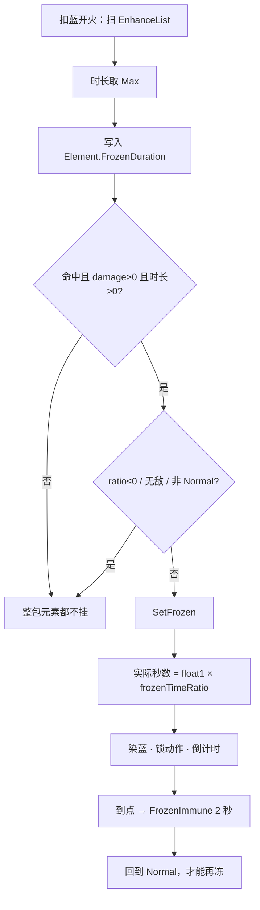

# 寒霜晶石（Spell3014 / Frozen）逆向分析

> 范围：仅玩家强化符文「寒霜晶石」（`abilityType = 3014`，配置 ID `30141–30143`）。重点是**法术侧怎么合成时长**，以及**命中后 `SetFrozen` 怎么上冻、怎么解冻、怎么吃 `frozenTimeRatio`**。
> 不展开敌人冰弹、冰球 `9015`、药水免疫。地面水迹只作为「颜色决定铺不铺地」来写，不穷尽各法术的半径公式。
> 方法：`SpellConfig.json` + 反编译 `Assembly-CSharp` 交叉验证。未标注「推测」的结论均有代码/数据直接证据。
> 玩家施法主路径是 ECS。Mono `SpellBase` 叠加上限与 ECS **不一致**（组卡 Max vs 相加），文末单独对照。
> 配套：总览见《魔法工艺法术系统逆向报告.md》，原始数值见《法术数值总表.md》，槽位解析骨架见《伤害强化逆向分析.md》，子弹整包继承元素见《分裂逆向分析.md》，同管线晶石见《粘液晶石逆向分析.md》《毒液晶石逆向分析.md》《雷霆晶石逆向分析.md》。离线可开见 `寒霜晶石逆向分析.html`。

---

## 1. 身份与定位


| 项 | 值 |
| --- | --- |
| 中文名 | 寒霜晶石 |
| 英文名 | Frost Crystal |
| `abilityType` | `3014` / `SpellAbilityType.Frozen`（枚举名就是 `Frozen`，没有 `FrostCrystal`） |
| 配置 ID | `30141`（Lv1）/ `30142`（Lv2）/ `30143`（Lv3） |
| 稀有度 | 普通（`dropType=1`） |
| `useType` | `2`（Enhance 强化符文） |
| 槽位消耗 | `slotCost=1`，自身 `mpCost=0`、`damage=0` |
| 作用对象 | `haveEffecforMissileSpell=true`，`haveEffecforSummonSpell=true` |
| 合成 | Lv1→Lv2→Lv3（`canCompound`：Lv1/2=`true`，Lv3=`false`） |
| 售价（金币） | 12 / 36 / 108 |


**机制一句话**：插在主动/召唤**左侧**的元素附着符文。发射时把冻结秒数烘焙进 `SpellElementEffectComponentData.FrozenDuration`；命中且伤害 > 0、时长 > 0 时调用 `SetFrozen`：目标必须处于 `Normal`，实际冻结秒数 = 法术包时长 × `unitCfg.frozenTimeRatio`。冻住期间锁动作；到点进入 **2 秒** `FrozenImmune`，期间再打不上。没有独立 `Spell3014*System`。



文案（`TextConfig_Spell` id `7130141–7130143`）三级相同，只替换 `float1`：

> 法术命中单位后使其冰冻**float1**秒

名称（`7030141–7030143`）：寒霜晶石 / Frost Crystal。底部补充（`7230141`）是整类元素附着的共享说明：

> 当存在多种元素附着强化时，外观上会随机选择一种颜色，但命中目标时仍然产生所有元素附着强化的效果。

---

## 2. 数值与叠加

### 2.1 配置表（`assets_export/SpellConfig.json`）


| ID | Level | float1 冻结秒 | 售价 | 可合成 |
| --- | --- | --- | --- | --- |
| 30141 | 1 | **1.5** | 12 | true |
| 30142 | 2 | **3** | 36 | true |
| 30143 | 3 | **6** | 108 | false |


规律：售价每级 ×3。`float1` 每级 ×2（1.5 → 3 → 6）。`float2/3`、`int1/2/3` 全 0。无耗蓝倍率。比伤害强化（9/27/81）贵一档，比毒液（11/33/99）再贵一点。

### 2.2 字段语义


| 字段 | 语义 | 运行时是否被读 | 置信度 |
| --- | --- | --- | --- |
| **float1** | 法术包冻结秒数；组卡多张取 **Max** | 是 | 高 |
| float2 / float3 / int1 / int2 / int3 | 配置为 0 | **未读** | 高 |
| `haveEffecforMissile/Summon` | 对弹幕与召唤都标为生效 | `GetFrozenElementData` **不读** | 高 |


没有层数、没有每秒伤害。这张卡只写一个秒数。命中后真正挂在目标身上的是 `affect_FrozenTime = float1 × frozenTimeRatio`，文案里的「冰冻 float1 秒」只对 `ratio=1` 的普通小怪成立。

### 2.3 文案 vs 实现

「命中冰冻 float1 秒」和主路径对得上。实现上多三处文案没写的细节：

1. **已冻结 / 免疫期再打不上**。`SetFrozen` 要求 `FronzenState == Normal`。冻住中、以及解冻后 2 秒 `FrozenImmune`，更长的卡也**不能刷新**。这和毒（层数继续加、时长可刷新）、粘液（新 > 剩余才刷新）都相反。
2. **实际秒数乘 `frozenTimeRatio`**。玩家常见 `0.5`，精英 / Boss 常见 `0.1`，`ratio<=0` 直接不上冻。粘液只对精英 / Boss 乘这个字段；冰冻对**所有单位类型**都乘。
3. **组卡取 Max，彩虹灌卡却是相加**。`GetFrozenElementData` 是 `math.max`；`ApplyElementSpell` 是 `FrozenDuration += float1`。已经插了寒霜、彩虹又抽到冰，时长会再加一张对应等级的 `float1`。

### 2.4 法术侧：组卡时合成一包（只取 Max）

```485:498:decompiled/Assembly-CSharp/SpellShootData.cs
	public float GetFrozenElementData()
	{
		float num = 0f;
		SlotData[] enhanceList = EnhanceList;
		for (int i = 0; i < enhanceList.Length; i++)
		{
			SpellConfig finalConfig = enhanceList[i].GetFinalConfig();
			if (finalConfig.abilityType == SpellAbilityType.Frozen)
			{
				num = math.max(num, finalConfig.float1);
			}
		}
		return num;
	}
```

- **时长**：取最大，不累加。两张 Lv1 仍是 **1.5 秒**，不是 3 秒。
- 这个函数**不读** `haveEffecfor*`，也不读其它 float / int。

`SipToSSP` 原样写入，飞行中不再重算。低帧优化 / 激光晶石只乘毒层层数，**不改** `FrozenDuration`。

等级**不能**按「2×Lv1 = 1×Lv2」换算——低级叠在一起连时长都加不上去：

```
2×Lv1：时长 1.5
1×Lv2：时长 3
3×Lv1：时长 1.5
1×Lv3：时长 6
Lv1+Lv2：时长 3
```

合成的意义几乎只是**省槽换更长**。手插两张同级寒霜，ECS 主路径和一张没区别。

`SipToSSP`：

```305:305:decompiled/Assembly-CSharp/ShootSpellUtils.cs
			FrozenDuration = sip.FrozenDuration,
```

### 2.5 谁吃得到这张卡

`SpellGroupParser` 从左到右扫，只强化自己右边、同一段。主槽加不到后槽。

```
[霜] [弹]                 弹带冻包
[弹] [霜]                 弹带不到
[霜] [弹] [弹]            两发都带
[霜A] [弹] [霜B] [滚球]   弹吃 A；滚球吃 Max(A, B)
```

自动填槽：`SelfRepelSpells` 含 `Frozen`，**同一根杖不会自动再塞第二张**。手摆可以叠，但组卡只取 Max，测试相加必须走彩虹 / 随机色 / 鱼叉冰头遗物。

魔能升阶把 `30141` 抬成 `30142` / `30143`。叠加规则不变，变的是送进 Max 的那个 `float1`。

---

## 3. 主路径（核心）

普通弹道走下面三步。冰冻**不是**命中当场结算的一包伤害，是挂在目标身上的硬直状态。

### 3.1 发射时烘焙，只扫一次

1. `SpellInitialParameter.Builder` 调 `GetFrozenElementData`，写入 `SIP.FrozenDuration`。
2. `ShootSpellUtils.SipToSSP` 写 `ElementComponentData.FrozenDuration`。
3. `GetSpellColor`：`Frozen` **在** `ToSpellColor()` 里，映射 `SpellColorType.Frozen`。和粘 / 毒 / 火 / 虚空一起抽外观。雷晶石 `float3%` 先手覆盖，见《雷霆晶石逆向分析.md》。

飞行中不再重算。时长强化不读这份字段，见《时长强化逆向分析.md》5.6。

### 3.2 命中：门槛是时长，不是外观

`UnitPropertyJob`：

- `immuneDamage` 或 **`damage <= 0`**：只结算击退，**整包元素都不挂**（毒 / 粘 / 冰 / 烧 / 虚空一起跳过）。
- 法术实体为空：不挂。
- 条件是 `FrozenDuration > 0`，不是看 `ColorType`。

然后 `SetFrozen`：

```541:569:decompiled/Assembly-CSharp/UnitProperty_Dots.cs
	public void SetFrozen(float time)
	{
		if (!(unitCfg.frozenTimeRatio <= 0f) && !IsInvincible && FronzenState == UnitProperty.Affect_FrozenState.Normal)
		{
			FronzenState = UnitProperty.Affect_FrozenState.Frozening;
			ChangeColor(GameConst.color_BodyFrozen);   // 蓝 0.25, 0.5, 1
			// 所有单位类型同一句：
			affect_FrozenTime = time * unitCfg.frozenTimeRatio;
			frozenStateChanged = true;
		}
	}
```

三道门同时成立才上冻：`frozenTimeRatio > 0`、非无敌、状态是 `Normal`。没有单独的 `IsImmuneFrozen`；`ratio<=0` 就是免疫。

| | 法术侧（组卡） | 目标侧（命中） |
| --- | --- | --- |
| 时长 | 多张取 Max | **直接写入** `time × ratio`；已冻 / 免疫期直接 return |
| 层数 / 系数 | 无 | 无 |


`PurifyAbnormalState` 会清掉整层。玩家 `800001` 默认 `frozenTimeRatio=0.5`，能被冻，时长减半。

### 3.3 冻住期间：锁动作，不跳字

状态机是三段：`Normal` → `Frozening` → `FrozenImmune`（写死 **2 秒**）→ `Normal`。

`UnitEnvironmentSystem`（Mono 对称在 `UnitProperty`）：

1. `Frozening`：`affect_FrozenTimer` 每帧加。到 `>= affect_FrozenTime`：`ClearFrozenState`，进入 `FrozenImmune`，还原颜色。
2. `FrozenImmune`：再攒 **2 秒**，计时器清零，回到 `Normal`。
3. `frozenStateChanged` 为真时：非混合体、且不是玩家 `800001`，把刚体改成 kinematic、线速度清零；解冻再还原。玩家 / 混合体走 `UnitLateSyncSystem` 调 Mono `SetFrozen` / `ClearFrozenState`。

锁动作的落地点：

- `UnitProperty_Dots.LockMotion`：冻住时为 true。`UnitBaseJob` 直接 return，不写位移。
- `UnitBase.IsLocked`：冻住或坠渊都视为锁。
- 玩家 `PlayerController.isFrozen`：挡射击、翻滚、移动。
- 动画：`UnitBase.SetFrozen` 把 `Anima.speed` / `SAnima.timeScale` 置 0。
- 特效：`UnitAttachEffectSystem` 在 `Frozening && showAffect` 时挂 `Prefabs/EF/EF_Frozen_Dots`。

没有碎冰伤害、没有「打冻体加伤」。`FronzenState` 只用来锁动作、染色、播特效，以及部分怪物部件（触手 / 翅膀）跟着主体停。

### 3.4 `frozenTimeRatio` 典型值

配置在 `UnitConfig.frozenTimeRatio`。`SetFrozen` 对所有 `unitType` 都乘，不像粘液只乘精英 / Boss。


| 单位 | 表上常见值 | Lv1 1.5 秒实际冻结 | 说明 |
| --- | --- | --- | --- |
| 普通小怪 | **1**（170/291） | **1.5** | 文案原值 |
| 玩家 `800001` | **0.5** | **0.75** | 只有这一条玩家配置 |
| 精英 | **0.1**（16/31） | **0.15** | 也有 11 条是 1、4 条是 0 |
| Boss | **0.1**（22/23） | **0.15** | 另有 1 条 0.05 |
| 队友 | **1** | 1.5 | `TeammateNotAttack` 全是 0 |
| 易碎物 / 多数摆设 | **0** | 不上冻 | `ratio<=0` 直接 return |


无尽房会再乘 `frozenTimeRatioFix`（`0.5 ^ (层数相关)`），不展开。个别怪进阶段会把 `ratio` 临时改成 0（例如 `Monster7` / `Monster21`），阶段结束还原。

---

## 4. 和其它法术的关系

只写会改冰冻行为的交互。齐射 / 多重 / 伤害强化只改发射或弹体伤害，不改冻结公式，不列。

### 4.1 其它元素晶石 / 雷霆外观

命中并列挂，不看颜色。弹是火颜色，只要 `FrozenDuration > 0` 仍上冻。

雷晶石先手改外观，**不挡**上冻。雷霆销毁落雷若 `damage > 0`，会带着原弹 Element 再走一遍 `UnitPropertyJob`——圈里没被母弹打到的人也可能被冻；**已经被冻住 / 处在 2 秒免疫**的人，这次 `SetFrozen` 会 return。见《雷霆晶石逆向分析.md》3.2。

### 4.2 地面水迹（跟颜色，不跟晶石包）

`ColorType == Frozen` 才会 `CreateWaterRequest`（滚球撞墙、抛物落地、高压水枪销毁、陨石 / 诡雷爆炸、大泡泡等）。带了寒霜晶石但随机成了毒色：命中仍上冻，**不铺水**。

地上的水**不是**第二套冰冻。`UnitEnvironmentSystem` 会查 `VenomTag` / `MucusTag`，**不查** `WaterTag`。踩上去不上冻、不减速、不跳字。`WaterTag` 只给 `WaterSystem` 自己管实体，以及个别敌人（如 `Monster4`）认「这是水」。


| | 晶石命中 | 踩到地上水迹 |
| --- | --- | --- |
| 条件 | `FrozenDuration > 0` 且伤害 > 0 | `ColorType==Frozen` 留下的 `WaterTag` |
| 冻结 | `float1 × frozenTimeRatio` | **无** |
| 友伤 / 减速 | 打谁谁冻 | **无** |
| 与晶石共存 | — | 互不影响 |


半径公式各法术不同（有的 `Scale/2`，有的 `Radius.Calculate()`），这里不穷尽。多数请求**不带**持续字段，也不读晶石 `float1`。

### 4.3 分裂 3013

`ToSplit` 整包复制 `FrozenDuration`。子弹生成时**不再**乘 `SpellEfficiency`（那一刀只砍毒层层数）。低帧不打薄冻结秒数。详见《分裂逆向分析.md》6.4。

### 4.4 悬停 / 坠落 / 爆炸圈 / 穿透

只要打出 `damage > 0` 的 `TakeDamageInfo`，就走同一条元素门。圈的大小是范围增强的事；冰冻只问「这发实体上的时长是否 > 0」。

穿透耗尽当场销毁：已经打出的那下仍上冻。同一发打两个敌人：各冻各的。同一敌人被第二发冻弹打中：若还在 `Frozening` 或 `FrozenImmune`，直接忽略。

### 4.5 彩虹丝带 / 随机色杖

先定 `ColorType`，再 `ApplyElementSpell(ToSpellId(1 或 2))`。抽到冰会再灌一张 `30141`（或高级色的 `30142`）：

```
FrozenDuration += 灌入卡 float1
```

注意这里是**相加**，不是组卡的 Max：

```
[霜Lv1] [弹] + 彩虹抽到冰     → 1.5 + 1.5 = 3
[霜Lv3] [弹] + 彩虹抽到冰     → 6 + 1.5 = 7.5
只靠彩虹、槽位没有寒霜       → 灌入卡自己的 float1
抽到别的色                   → 冻数据不动，另加那种元素
```

鱼叉冰头遗物在 `SpellSpawnParamsProcessor` 里 `FrozenDuration += relic.float1`，和彩虹一样走加算，发生在烘焙之后。

### 4.6 闪电链 3007 / 生命线 / 召唤 / 光之柱


| 对象 | 怎么带冻 |
| --- | --- |
| 闪电链 ECS | `Spell3007Job` 从宿主抄整份 Element，命中仍 `SetFrozen` |
| 闪电链 / 鱼叉链 Mono | 抄 `spellFrozenTime` / `frozenTime` |
| 召唤物攻击 / 撞击 | 生成时带上召唤法术的 Element |
| 光之柱 2004 | `Spell2004TriggerJob` **不经伤害门**，每 0.15 秒直接 `SetFrozen`；已冻 / 免疫期仍 return |
| 只拷 `ColorType`、不拷 Element | **会丢冻结** |


激光晶石 4014：只 `VenomApplyCount *= LaserCrystalPowerRatio`，**不改** `FrozenDuration`。

### 4.7 公转 / 寻踪 / 反弹 / 时长强化

不改冻数据包。时长强化加的是子弹寿命，不是 `FrozenDuration`。

---

## 5. Mono 残留轨对照

`SpellBase.ApplyEnhanceSpell` / `ApplyElementSpell`（`case Frozen`）都是：

```
spellFrozenTime += spellConfig.float1
```

**相加**，不是 ECS 组卡的 Max。玩家主路径以 `GetFrozenElementData` 为准。彩虹 / 随机色的 `extraEnhanceIds` 在 Mono 里再跑一遍，和 ECS `ApplyElementSpell` 同语义（都是 +=）。

命中：`spellFrozenTime > 0` 时调同一个 `SetFrozen`。门槛和 ECS 一致（都看时长 > 0）。

伞盾 `UmbrellaShieldController` 同样 `spellFrozenTime += float1`。全工程没有读这个字段的代码，等于没生效。见《奥术屏障逆向分析.md》。

地面铺水走 `WaterController.CreateWater`，和 ECS `CreateWaterRequest` 一样只看颜色。

玩家被冻：ECS 写好 `affect_FrozenTime` 后，`UnitLateSyncSystem` 用 `affect_FrozenTime / frozenTimeRatio` 再调一次 Mono `SetFrozen`，两边最终时长仍是 `time × ratio`。`800001` 的刚体冻结不走 `UnitEnvironmentSystem` 那条 kinematic 分支。

---

## 6. 算例

先不算彩虹 / 随机色杖 / 鱼叉冰头 / 无尽衰减。实际冻结 = 法术包时长 × `frozenTimeRatio`。解冻后固定再免 2 秒。


| 槽位 | 法术包时长 | 小怪 ratio=1 | 玩家 0.5 | Boss 0.1 |
| --- | --- | --- | --- | --- |
| `[弹]` | 无 | — | — | — |
| `[霜Lv1] [弹]` | 1.5 | **1.5** | 0.75 | 0.15 |
| `[霜Lv2] [弹]` | 3 | **3** | 1.5 | 0.3 |
| `[霜Lv3] [弹]` | 6 | **6** | 3 | 0.6 |
| `[霜Lv1]×2 [弹]` | 1.5（Max） | 1.5 | 0.75 | 0.15 |
| `[霜Lv1][霜Lv2] [弹]` | 3 | 3 | 1.5 | 0.3 |
| `[霜Lv1] [弹]` + 彩虹抽到冰 | 3（1.5+1.5） | 3 | 1.5 | 0.3 |
| `[霜Lv3] [弹]` + 彩虹抽到冰 | 7.5 | 7.5 | 3.75 | 0.75 |
| 先冻住再被第二发打中 | — | **忽略**（非 Normal） | 同左 | 同左 |
| `ratio=0` 的摆设 / 阶段无敌 | — | 不上冻 | — | — |


`[粘][霜] [弹]`：外观黄或蓝各 50%（再被雷晶石概率改色）；命中同时上粘液和冰。粘液时长对 Boss 也乘 `frozenTimeRatio`，和冰冻共用这个字段。

同一发穿透打两个敌人：各冻一份，互不分享。同一敌人要等解冻 + 2 秒免疫结束，才能被下一发再冻。

**一次施放多个实体的法术会浪费大半冻结。** `shootCount > 1` 的法术（蝴蝶 `1003` 三级 3/4/5 只、霰弹 `1031` 等）每个实体都各自带一份 `FrozenDuration`，命中时各自调 `SetFrozen`；但只要几只在同一目标上先后命中，**第一只把目标打成 `Frozening` 后，其余全部直接 return**。Lv3 蝴蝶 5 只全中一个目标，只有 1 份 1.5/3/6 秒生效，另外 4 份白给。

这不是 bug，是 `FronzenState == Normal` 这道门的必然结果。构筑含义：寒霜晶石配**单发高伤**弹优于配多发弹；多发弹应改配毒液（层数按只数倍增）。见《毒液晶石逆向分析.md》与《蝴蝶逆向分析.md》8.2。

**同一个实体反复打同一个目标，浪费得更彻底。** 落雷阵 `1018` 是 `isDPS = true`、`DPSDamageInterval = 0.25`、`speed = 0` 的原地光环：一次施放只有一个实体，但活满 5 秒、每 0.25 秒结算一次，对站在圈里的同一个目标就是 **20 次上冻尝试**。第 1 次成功后目标进 `Frozening`，冻结期挡掉 6/12/24 次，解冻后 2 秒 `FrozenImmune` 再挡掉约 8 次：


| 寒霜 | 小怪实际冻结 | 一个完整周期（冻结 + 2 秒免疫） | 5 秒窗口内生效次数 | 20 次尝试的浪费率 |
| --- | --- | --- | --- | --- |
| Lv1 | 1.5 | 3.5 | **2** | 90% |
| Lv2 | 3 | 5 | **1** | 95% |
| Lv3 | 6 | 8 | **1** | 95% |


也就是说 20 份 `FrozenDuration` 里只有 1~2 份真的落地。**这是「高频命中 × 寒霜」不对称的极端案例**：同一个载体上，毒液晶石的 20 次结算是 20 次全叠（Lv3 = 80 层），寒霜是 20 次里废 18~19 次，两张晶石的结论完全相反。详见《落雷阵逆向分析.md》7.13 / 7.14。

注意免疫期那 **2 秒是写死的、不乘 `frozenTimeRatio`**（3.3），所以 `ratio` 越低周期反而越短：Boss（`ratio=0.1`）被 Lv3 寒霜冻 0.6 秒，周期只有 2.6 秒，5 秒窗口内能生效 2 次——次数变多，但每次只有 0.6 秒，总硬直仍然远低于小怪。

---

## 7. 证据索引


| 文件 | 作用 |
| --- | --- |
| `SpellShootData.GetFrozenElementData` | 组卡时长 Max |
| `SpellInitialParameter.Builder` | 写入 `SIP.FrozenDuration` |
| `ShootSpellUtils.SipToSSP` | 快照 `FrozenDuration` |
| `ShootSpellUtils.ApplyElementSpell` | 彩虹 / 随机色再灌一张；冰是 **+=** |
| `SpellTools.GetSpellColor` / `ToSpellColor` / `ToSpellId` | 冰色进随机池；`Frozen → 30140+level`；雷晶石先判定 |
| `UnitPropertyJob` | `damage<=0` 整包跳过；门槛 `FrozenDuration>0` |
| `UnitProperty_Dots.SetFrozen` / `ClearFrozenState` / `LockMotion` | 三道门、乘 ratio、不可刷新、锁动作 |
| `UnitEnvironmentSystem` | 倒计时、2 秒免疫、kinematic（跳过玩家 / 混合体） |
| `UnitAttachEffectSystem` | `EF_Frozen_Dots` |
| `UnitLateSyncSystem` | 玩家 / 混合体把 ECS 状态同步到 Mono |
| `UnitBase.SetFrozen` / `PlayerController.SetFrozen` | 刚体 + 动画停；玩家挡射击 / 翻滚 / 移动 |
| `GameConst.color_BodyFrozen` | 身体蓝 `(0.25, 0.5, 1)` |
| `SpellSystem` / `SpellParabolaSystem` 等 | `ColorType==Frozen` 才 `CreateWaterRequest` |
| `WaterSystem` / `WaterTag` | 地面水迹实体；环境系统不读 |
| `SpellSpawnParamsStorage.ToSplit` | 元素整包复制 |
| `Spell3007Job` / `Spell3007LightningChain.SetElementEffect` | 闪电链抄宿主冻包 |
| `Spell2004TriggerJob` | 光之柱绕过伤害门直接 `SetFrozen` |
| `SpellSpawnParamsProcessor` | 鱼叉冰头 `FrozenDuration += relic.float1` |
| `Spell4014CrystalPowerRatioApplySystem` | 只乘毒层层数，不改冻 |
| `SpellTools.GetSpellElementDataWithTimeScale` | 低帧只乘毒层层数 |
| `SpellAutoFullTool.SelfRepelSpells` | 自动填槽自排斥 |
| `SpellBase` `case Frozen` / `ApplyElementEffect` | Mono 叠加是 **+=**；门槛用时长 |
| `UmbrellaShieldController` | 写入未使用的 `spellFrozenTime` |
| `SpellConfig.json` `30141–30143` | 配置原始值 |
| `TextConfig_Spell` `703014*` / `713014*` / `7230141` | 名称、文案、共享外观 |
| `UnitConfig.json` | `frozenTimeRatio` 典型值 |


---

## 8. 待决 / 局限

1. **各法术铺水半径 / 寿命**：不读晶石 `float1`。未逐技能列公式。
2. **`frozenTimeRatio` 全表**：已按 `unitType` 汇总常见值；未逐怪列出阶段里临时改 0 的入口。
3. **无尽衰减 / 鱼叉冰头具体秒数**：确认会乘 / 会加；遗物与层数数值不展开。
4. **Mono 组卡 += vs ECS Max**：玩家主路径以 ECS 为准。若某发走纯 Mono 且槽位叠了两张寒霜，时长会按相加算，和主路径不一致。
5. **没有碎冰**：当前玩家 ECS / Mono 未见「打冻体加伤 / 碎裂结算」。不排除未反编译到的表现层或后续版本补上。
