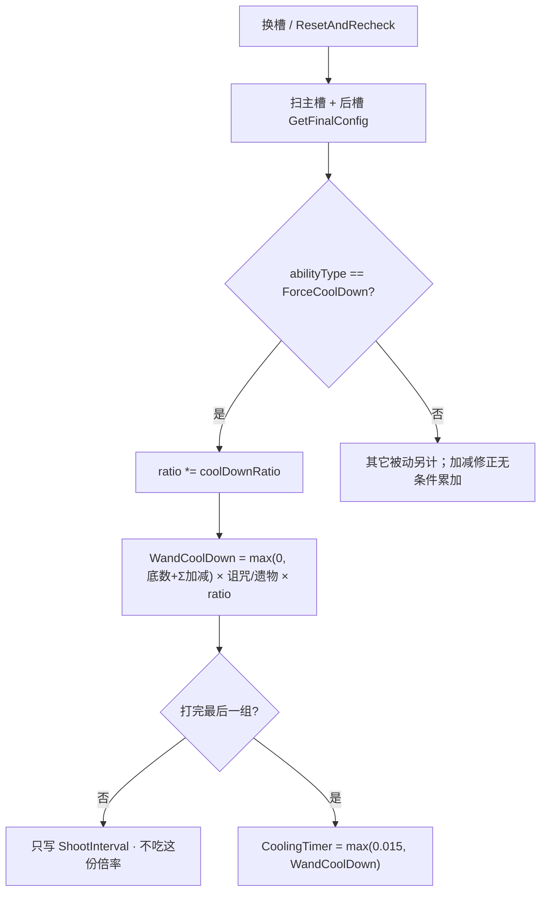

# 强制冷却（Spell4006 / ForceCoolDown）逆向分析

> 范围：仅玩家被动符文「强制冷却」（`abilityType = 4006`，配置 ID `40061–40063`）。重点是 **`coolDownRatio` 怎么进法杖冷却**，以及**谁真正吃到这份连乘**。
> 不展开 `4014` 激光晶体的 `ForceCooling`、遗物/诅咒独立 CD、施法间隔。遗物 / 诅咒只点合成顺序，不逐条拆。
> 方法：`SpellConfig.json` + 反编译 `Assembly-CSharp` 交叉验证。未标注「推测」的结论均有代码/数据直接证据。
> 这张卡是法杖级被动，主路径在 `Wand`，没有 `Spell4006*System` / Authoring，也不进弹体 ECS。
> 配套：总览见《魔法工艺法术系统逆向报告.md》，原始数值见《法术数值总表.md》，槽位解析骨架见《伤害强化逆向分析.md》。

---

## 1. 身份与定位


| 项 | 值 |
| --- | --- |
| 中文名 | 强制冷却 |
| 英文名 | Forced Cooldown |
| 内部名 | `ForceCoolDown` 强制冷却 |
| `abilityType` | `4006` / `SpellAbilityType.ForceCoolDown` |
| 配置 ID | `40061`（Lv1）/ `40062`（Lv2）/ `40063`（Lv3） |
| 稀有度 | 普通（`dropType=1`） |
| `useType` | `3`（`SpellType.Passive` 被动符文） |
| 槽位消耗 | `slotCost=1`，自身 `mpCost=0`、`damage=0`、`shootCount=0` |
| 作用对象 | `haveEffecforMissileSpell=false`，`haveEffecforSummonSpell=false`（自动填槽的强化过滤用；运行时不读） |
| 合成 | Lv1→Lv2→Lv3（`canCompound`：Lv1/2=`true`，Lv3=`false`） |
| 售价（金币） | 7 / 21 / 63 |


**机制一句话**：插在法杖**任意有效槽**里的法杖级被动。不改伤害、半径、速度、蓝耗、施法间隔；只把卡上的 `coolDownRatio` 连乘进 `passiveWandCoolDownTimeRatio`。没有独立 System。左右位置不决定「谁吃得到」——吃的是这根法杖的整轮冷却。



卡面没有独立机制文案。`TextConfig_Spell` `7140061–7140063`、底部补充 `7240061` 全空。名称（`7040061–7040063`）：强制冷却 / Forced Cooldown。三级名称相同，只有 `coolDownRatio` 不同。展示靠 `SpellConfig.GetInfo` 自动吐一行：

> ◆ 冷却 **×60 / ×30 / ×15**%

`×60%` 的意思是冷却变成原来的 **60%**，不是「减少 60%」。

---

## 2. 数值与叠加

### 2.1 配置表（`assets_export/SpellConfig.json`）


| ID | Level | coolDownRatio | 售价 | 可合成 |
| --- | --- | --- | --- | --- |
| 40061 | 1 | **0.6**（×60%） | 7 | true |
| 40062 | 2 | **0.3**（×30%） | 21 | true |
| 40063 | 3 | **0.15**（×15%） | 63 | false |


规律：售价每级 ×3（7 / 21 / 63，比悬停的 8 / 24 / 72 便宜 1 金）。`coolDownRatio` 每级 ÷2（0.6 → 0.3 → 0.15）。`float1/2/3`、`int1/2/3` 全 0，不用。无耗蓝倍率。`coolDownAddSubRevise` 也是 0——这张卡自己不加不减秒数。

### 2.2 字段语义


| 字段 | 语义 | 运行时是否被读 | 置信度 |
| --- | --- | --- | --- |
| **`coolDownRatio`** | 法杖冷却连乘系数；多张相乘写入 `passiveWandCoolDownTimeRatio` | 是 | 高 |
| `coolDownAddSubRevise` | 配置为 0 | 扫描时会 `+=`，此卡贡献 0 | 高 |
| `shootIntervalAddSubRevise` | 配置为 0 | 进施法间隔池，此卡贡献 0 | 高 |
| float1 / float2 / float3 / int1 / int2 / int3 | 配置为 0 | **未读** | 高 |
| `haveEffecforMissileSpell` / `haveEffecforSummonSpell` | 表上均为 `false` | 仅自动填槽的强化过滤；`ForceCoolDown` 分支 **不读** | 高 |


没有独立 `Spell4006*System` / Authoring。这张卡本身不挂伤害组件，也不进发射包。

玩家卡里，`coolDownRatio ≠ 1` 的只有 `40061–40063`。`WandConfig.GetCoolDownRatio` 会乘「任意槽」的该字段，但**没有任何调用方**，见第 6 节。

### 2.3 连乘，不是加算，也不是取 min

两张 Lv1 是 **×0.36**，不是 `0.6 + 0.6`，也不是 `min(0.6, 0.6)`。

```721:723:decompiled/Assembly-CSharp/Wand.cs
			case SpellAbilityType.ForceCoolDown:
				passiveWandCoolDownTimeRatio *= spell.coolDownRatio;
				break;
```

循环里没有「已处理过同类型就跳过」。同类型出现几次乘几次。无上限、无「只取最高级」。底数从 `1` 乘，没有这张卡时 `passiveWandCoolDownTimeRatio = 1`。

等级不能互替。法杖底数先按常见的 `0.5s` 算（多数 `WandConfig.coolDown` 是这个数），先不算加减 / 诅咒 / 遗物 / 0.015 地板：


| 槽位 | 连乘 | 最终 CD | 说明 |
| --- | --- | --- | --- |
| 无 | 1 | 0.50 | |
| 1×Lv1 | 0.6 | **0.30** | |
| 1×Lv2 | 0.3 | **0.15** | |
| 1×Lv3 | 0.15 | **0.075** | |
| 2×Lv1 | 0.6×0.6 = 0.36 | **0.18** | 比 1×Lv2 差 |
| Lv1+Lv2 | 0.6×0.3 = 0.18 | **0.09** | 比 1×Lv3 差 |
| 2×Lv3 | 0.15×0.15 = 0.0225 | **0.01125 → 地板 0.015** | 见 4.4 |


和悬停相反：悬停叠两张 Lv1 比一张 Lv2 更「多」；这里倍率越小越好，**合成既省槽又更狠**。自动填槽**不自排斥**（`SelfRepelSpells` 只有元素晶石），手摆和自动都可以叠多张。

写入时机：`ResetAndRecheck` / `ProcessSharedSpell` 里先解析拟态、魔能升阶，再 `CheckWandSlotPassiveEffect`。每次重算都先把 `passiveWandCoolDownTimeRatio` 置回 `1`，再扫一遍。没有「遗物 / 诅咒 / 法杖底数」进这个连乘池——它们走 `WandCoolDown` 取值器的另外几层。

### 2.4 不进施法间隔

`WandShootInterval` 只加 `passiveWandShootIntervalAddSubAmount`，再乘慢杖诅咒 / 静止专注，**没有** `passiveWandCoolDownTimeRatio`。这张卡的 `shootIntervalAddSubRevise` 是 0。组与组之间的等待不吃这份连乘，见 4.2。

### 2.5 魔能升阶抬的是这张卡的 `coolDownRatio`

`CheckWandSlotPassiveEffect` 取 `GetFinalConfig()`。`SpellLevelEnhance`（魔能升阶）先把槽位的 `slotSpellExtraLevel` 加上，`GetFinalLevelId` 再把 `40061` 抬成 `40062` / `40063`（不超过该 `abilityType` 最高级）。叠加规则不变，变的是送进连乘的系数。

---

## 3. 谁吃得到这张卡

### 3.1 法杖级被动，不走 EnhanceList

`SpellGroupParser` 的左侧累积是给 Enhance / 触发器用的。强制冷却是 `useType = Passive`，`CheckWandSlotPassiveEffect` 直接扫 `GetValidSlotsData`：主槽一遍、后槽一遍，每张有效槽的 `GetFinalConfig()` 丢进同一个 `action`。

左右位置不决定「强化谁」。插在魔法弹左边、右边、后槽，吃的都是**这根法杖**的 `WandCoolDown`。主槽加得到后槽——后槽里的一张同样乘进同一个 `passiveWandCoolDownTimeRatio`。

```
[强冷] [弹]              法杖 CD ×0.6
[弹] [强冷]              同样 ×0.6
[弹] …后槽 [强冷]         同样 ×0.6
[强冷A] [强冷B] [弹]      ×0.6 ×0.6
```

封印槽（`isSealSlot`）不进 `GetValidSlotsData`。空槽跳过。背包里没插上的不算。

### 3.2 `haveEffecfor* = false` 拦不住运行时

`ForceCoolDown` 分支只看 `abilityType` 和 `coolDownRatio`，不读两个 `haveEffecfor*`。表标「对导弹 / 召唤无效」只影响自动填槽的**强化过滤**；这张卡根本不是 Enhance，填槽走的是 Passive 通道。

### 3.3 自动填槽当普通被动

不在 `IgnoreSpells`（忽略的是触发器、传送石、全域强化、拟态等），不在 `SelfRepelSpells`，不在 `SpellAvoidEnhances`。`AppendPassiveSpells` 只要求 `useType == Passive`。手摆和自动都可以叠多张。

### 3.4 全域强化会把右边那张抄走

`AllFieldEnhance`（`4010`）把**紧挨在自己右边**的那张卡复制到其它法杖。`[全域][强制冷却]` 会让别的杖也带上一份同等级（等级被全域自己的等级封顶）。复制过去的槽同样走 `GetFinalConfig` + `ForceCoolDown` 连乘。这是「一张卡喂多根杖」的入口，不是这张卡自己的逻辑。

---

## 4. 谁真正吃到这份倍率

真正用这份连乘的，是 `Wand.WandCoolDown` 取值器，以及打完**最后一组**时写入的 `CoolingTimer`。谁不走这条，谁就不是文案说的「冷却 ×N%」。

### 4.1 合成顺序：先加减夹 0，再乘诅咒/遗物，最后乘这份 ratio

```364:384:decompiled/Assembly-CSharp/Wand.cs
	public float WandCoolDown
	{
		get
		{
			float num = 0f;
			if (WandCfg != null)
			{
				num = WandCfg.coolDown;
			}
			num += passiveWandCoolDownAddSubAmount;
			num = Mathf.Max(0f, num);
			if (PlayerMgr.Inst.ItemCtrller.curseCfg_SlowWand != null && num > 0f)
			{
				num *= 1f + (float)PlayerMgr.Inst.ItemCtrller.curseCfg_SlowWand.int1.result / 100f;
			}
			if (PlayerMgr.Inst.ItemCtrller.relic_StayAndFocus != null && num > 0f)
			{
				num *= 1f - PlayerMgr.Inst.ItemCtrller.relic_StayAndFocus.Cfg.floatTimer;
			}
			return num * passiveWandCoolDownTimeRatio;
		}
	}
```

```
法杖底数          WandCfg.coolDown
+ 槽位加减        Σ coolDownAddSubRevise（任意卡，不限 4006）
夹 0              max(0, ·)
× 慢杖诅咒        仅 num > 0；点名，不拆
× 静止专注        仅 num > 0；点名，不拆
× 强制冷却连乘    最后一层
```

加减在乘之前。`[超载散射 Lv1][强制冷却 Lv1]`、底数 `0.5`：先 `0.5 - 0.15 = 0.35`，再 `×0.6 = 0.21`。不是 `0.5×0.6 - 0.15 = 0.15`。

底数加完若已经是 0，诅咒 / 遗物那两段因 `num > 0` 不走，结果仍是 `0 × ratio = 0`。写入计时器时还会被地板托住，见 4.4。

`CheckWandManaRelatePassiveEffect`（扩槽后的蓝量旁路）会再 `+= coolDownAddSubRevise`，但**不改** `passiveWandCoolDownTimeRatio`。这份连乘只在 `CheckWandSlotPassiveEffect` 里从 1 重算。加减底数会不会被加两次，不在此穷尽。

### 4.2 只有打完最后一组才写入 CoolingTimer

```2355:2371:decompiled/Assembly-CSharp/Wand.cs
	public void EnterNextGroup(bool setCoolDownOrInterval)
	{
		currentSpellGroupsIndex++;
		if (currentSpellGroupsIndex >= shootGroups.Count)
		{
			if (setCoolDownOrInterval)
			{
				float fps = GameMgr.Inst.GetFps();
				float num2 = (CoolingTimer = (GeneralTool.IsLowFpsOptimizeActive(40f) ? Mathf.Max(Mathf.Max(0.015f, WandCoolDown), 0.08f * (fps / 40f)) : Mathf.Max(0.015f, WandCoolDown)));
			}
			...
			currentSpellGroupsIndex = 0;
		}
		else if (setCoolDownOrInterval)
		{
			ShootIntervalTimer = WandShootInterval;
		}
	}
```

```
组未打完          写 ShootIntervalTimer = WandShootInterval     不吃 4006
最后一组打完      写 CoolingTimer = max(0.015, WandCoolDown)   吃 4006
冷却中            CoolingTimer -= PlayerDeltaTime
能开火            CoolingTimer ≤ 0 且 ShootIntervalTimer ≤ 0
```

一根杖若被拆成多组（多张主动按解析切组），组间等待是施法间隔，强制冷却插了也缩短不了。只有整轮打完，才按 `WandCoolDown` 休息。只有一组时，每一轮结束都走冷却，这张卡每轮都生效。

`setCoolDownOrInterval == false` 的切组（蓝不够等）不写计时器。

### 4.3 不改弹体寿命，也不改施法间隔

它只改法杖「整轮打完之后等多久」。弹体 `Duration` / `HoverDuration`、持续施法锁、组间 `WandShootInterval` 都不读 `passiveWandCoolDownTimeRatio`。

### 4.4 写入后有 0.015s 地板

`CoolingTimer = max(0.015, WandCoolDown)`。低帧优化打开时，再和 `0.08 × (fps/40)` 取 max。

`WandCoolDown` 算出来小于 0.015（例如底数 0.5、两张 Lv3 → `0.5×0.0225 = 0.01125`）时，实际仍按 **0.015s** 冷却。`WandCoolDown == 0` 同样被托到 0.015。连乘能把取值器吐出的数压到接近 0，但计时器不会真的变成 0——除非后面被法杖特殊能力清掉。

### 4.5 写入后可能被立刻清零

`ChanceInstentCoolDownAndFullMana` 法杖能力在 `EnterNextGroup` 写完 `CoolingTimer` 之后掷骰：`float2` 概率把 `CoolingTimer` 置 0。倍率已经进了 `WandCoolDown`，只是这发没用上。

`FreeShoot`（回响等免费射击）：若开火前 `CoolingTimer` 已经是 0，打完切组后会再把 `CoolingTimer` 清 0。免费射击不因为插了强制冷却就「白写一轮 CD」。

### 4.6 没挂上活 Wand 的 UI 看不到这份连乘

| 表面 | 用的公式 | 吃不吃 4006 |
| --- | --- | --- |
| `UIInfoWand`（手上有 `Wand`） | `wand.WandCoolDown` | **吃**（含诅咒 / 遗物 / 地板之前的连乘） |
| `UIInfoWand`（只有 `WandConfig`） | `coolDown + GetExtraCoolDown()` | **不吃** |
| `UIRewardWand` / `UIGallery` | 同上，只加加减 | **不吃** |
| 卡面 `GetInfo` | 单独一行 `×60%` | 展示这张卡自己的系数，不合成整杖 |

商店 / 图鉴 / 奖励预览里的「冷却: X」往往还是底数加加减。装备到活 Wand 之后，`UIInfoWand` 才会把连乘算进去。不要按商店数字验收运行时。

### 4.7 这张卡不出伤、不改蓝

它只缩短（或在极端叠乘后被地板托住的）整轮冷却。出不出伤、耗多少蓝，看法术和法杖自己。

---

## 5. 和其它法术的关系（只写会改强制冷却行为的）

齐射 / 多重 / 伤害强化 / 加速器 / 悬停只改发射或弹体，不改这份连乘，不列。


| 对象 | 强制冷却怎么变 |
| --- | --- |
| 魔能升阶 `3126` | 抬这张卡的 `coolDownRatio`（0.6→0.3→0.15） |
| 拟态魔方 `3109` | `GetFinalConfig` 已解析；模仿成 4006 的那格也会再乘一次 |
| 全域强化 `4010` | 紧挨右边的 4006 被抄到其它杖，那些杖各自连乘 |
| 带 `coolDownAddSubRevise` 的卡（超载散射 `3003`、激光 `1004` 等） | 先加减再乘；改的是被乘的底数，不是 ratio 本身 |
| 慢杖诅咒 / 静止专注 | 在 ratio **之前**乘；只点名 |
| 法杖能力「概率立刻冷却」 | 写完 `CoolingTimer` 后可能清 0 |
| 回响免费射击 | 开火前不在 CD 时，写完再清 0 |
| 节能模式 `3104` 等改间隔的卡 | 不进 `WandCoolDown` |


---

## 6. 运行时 vs 预览 / UI 对照

这张卡没有 ECS / Mono 双轨。对照的是「活 Wand」和「只拿着 WandConfig 的预览」。

和运行时对齐的部分：

- 连乘、从 1 起、同类型出现几次乘几次
- 主槽 + 后槽都算，封印槽不算
- 取值器最后乘 `passiveWandCoolDownTimeRatio`

差别：


| | 活 Wand（运行时） | WandConfig / 多数 UI |
| --- | --- | --- |
| 读哪份配置 | `slot.GetFinalConfig()`（拟态、魔能升阶后） | `SpellConfig.dic[id]` 原始 ID；`GetExtraCoolDown` 只加加减 |
| 是否检查 `abilityType == ForceCoolDown` | **是**，只乘这一种 | `GetCoolDownRatio` 会乘**任意**槽的 `coolDownRatio`，但该方法**零引用** |
| 最终展示 | `UIInfoWand` 走 `WandCoolDown` | 奖励 / 图鉴：`coolDown + GetExtraCoolDown()`，**不加 ratio** |
| 0.015 地板 / 低帧地板 | `EnterNextGroup` 写入时才有 | UI 数字没有地板 |


玩家主路径以 `Wand.WandCoolDown` + `EnterNextGroup` 为准。`WandConfig.GetCoolDownRatio` 不要当成预览真源——没有人调用它。

---

## 7. 证据索引


| 文件 | 作用 |
| --- | --- |
| `Wand.CheckWandSlotPassiveEffect` | 从 1 重算；`ForceCoolDown` 连乘 `coolDownRatio` |
| `Wand.WandCoolDown` | 底数 + 加减 → 夹 0 → 诅咒 / 遗物 → × ratio |
| `Wand.WandShootInterval` | 无 ratio；组间等待不吃 4006 |
| `Wand.EnterNextGroup` | 最后一组写 `CoolingTimer`；未完写间隔 |
| `Wand.Update` | `CoolingTimer -= PlayerDeltaTime` |
| `Wand.FreeShoot` | 开火前不在 CD 则写完再清 0 |
| `Wand.TryUseWandAbility_ChangeInstentCoolDownAndFullMana_InstentCoolDown` | 写完后概率清 0 |
| `Wand.CheckSpellListForLevelEnhanceEffect` | 先于被动扫描；抬 `slotSpellExtraLevel` |
| `Wand.GetWandAllFieldEnhanceSpell` | 全域抄走右边那张 |
| `Wand.CheckWandManaRelatePassiveEffect` | 蓝量旁路；不改 ratio |
| `WandConfig.GetValidSlotsData` | 非空且非封印 |
| `WandConfig.GetCoolDownRatio` | 全槽连乘 raw `coolDownRatio`；**无调用方** |
| `WandConfig.GetExtraCoolDown` | 只加 `coolDownAddSubRevise` |
| `SlotData.GetFinalConfig` / `GetFinalId` | 拟态 + 魔能升阶后的配置 |
| `SpellConfig.GetInfo` | `coolDownRatio ≠ 1` 时吐 `×N%` |
| `UIInfoWand` | 有 Wand 用 `WandCoolDown`；否则只加加减 |
| `UIRewardWand` / `UIGallery` | `coolDown + GetExtraCoolDown()` |
| `SpellAutoFullTool.AppendPassiveSpells` | 当 Passive 填；不自斥、不忽略 |
| `SpellType.Passive` | `useType = 3` |
| `SpellConfig.json` `40061–40063` | 配置原始值 |
| `TextConfig_Spell` `704006*` / `714006*` | 名称与空文案 |


---

## 8. 待决 / 局限

1. **加减底数旁路**：`CheckWandManaRelatePassiveEffect` 会再累加 `coolDownAddSubRevise` 且不先清零。是否会在扩槽路径把底数加两次，未对 `PlayerMgr.WandCheckSlotCount` 全路径核对。不影响「ratio 从 1 重算」这条结论。
2. **法杖能力与免费射击**：只确认会清 `CoolingTimer`。各回响 / 自动杖切组是否每次都 `setCoolDownOrInterval: true`，不逐条拆。
3. **全域复制等级封顶**：抄走时若源卡等级高于全域等级，会把复制 ID 压到全域等级。只点入口，不拆全域自己的规则。
4. **低帧地板**：`0.08 × (fps/40)` 的触发条件是 `IsLowFpsOptimizeActive(40f)`，未核玩家设置项。
5. **90261 等非玩家卡**的 `coolDownRatio = 0`：不进 `ForceCoolDown` 分支，运行时连乘不会吃到。`GetCoolDownRatio` 若被调用会乘进去，但该方法无引用。
