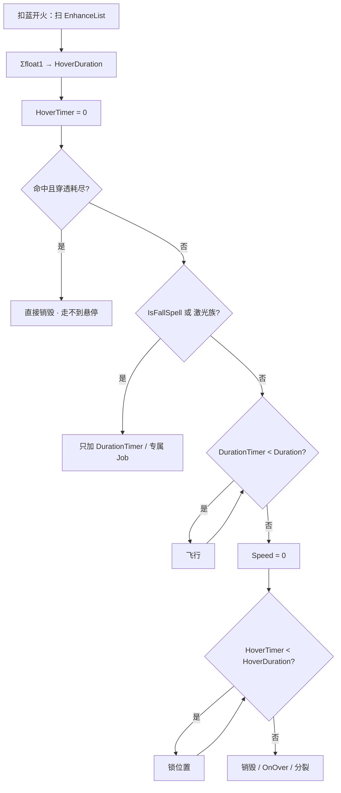

# 悬停（Spell3008 / SpellHover）逆向分析

> 范围：仅玩家强化符文「悬停」（`abilityType = 3008`，配置 ID `30081–30083`）。重点是**秒数怎么进独立的 HoverDuration**，以及**谁真正走到第二段**。
> 不展开悬浮鬼火（`HoverTorch = 1006`）、减速悬停子弹（`9021x`）、UI 鼠标悬停。固有坠落 / 激光族只写「3008 在它们身上怎么变」，不拆专属 Job。
> 方法：`SpellConfig.json` + 反编译 `Assembly-CSharp` 交叉验证。未标注「推测」的结论均有代码/数据直接证据。
> 玩家施法主路径是 ECS。Mono `SpellBase` 叠加上限与 ECS 一致，个别法术把秒数折进 `duration`，文末单独对照。
> 配套：总览见《魔法工艺法术系统逆向报告.md》，原始数值见《法术数值总表.md》，槽位解析骨架见《伤害强化逆向分析.md》，坠落短路见《坠落逆向分析.md》，第二段结束才分裂见《分裂逆向分析.md》，悬停圈乘半径见《范围增强逆向分析.md》，「悬停期继续满速输出」的唯一例见《落雷阵逆向分析.md》。
> 第 8 节已更正：回旋之刃不是「自管悬停段」，回收后走 4.1 原地锁死。详见《回旋之刃逆向分析.md》3.5 / 7.4。

---

## 1. 身份与定位


| 项 | 值 |
| --- | --- |
| 中文名 | 悬停 |
| 英文名 | Hover |
| 内部名 | `SpellHover` 悬浮 |
| `abilityType` | `3008` / `SpellAbilityType.SpellHover` |
| 配置 ID | `30081`（Lv1）/ `30082`（Lv2）/ `30083`（Lv3） |
| 稀有度 | 普通（`dropType=1`） |
| `useType` | `2`（Enhance 强化符文） |
| 槽位消耗 | `slotCost=1`，自身 `mpCost=0`、`damage=0` |
| 作用对象 | `haveEffecforMissileSpell=true`，`haveEffecforSummonSpell=false` |
| 合成 | Lv1→Lv2→Lv3（`canCompound`：Lv1/2=`true`，Lv3=`false`） |
| 售价（金币） | 8 / 24 / 72 |


**机制一句话**：插在主动/召唤**左侧**的生命周期符文。飞行段走完后不立刻销毁，而是在原地再停 `float1` 秒。它不改伤害、半径、速度、蓝耗；只往发射包里写一个独立的 `HoverDuration`。没有 `Spell3008*System` / Authoring。



文案（`TextConfig_Spell` id `7130081–7130083`）：

> 法术结束时会在原地悬停 **float1** 秒

名称（`7030081–7030083`）：悬停 / Hover。三级名称相同，只有 `float1` 不同。底部补充 `7230081` 为空。

---

## 2. 数值与叠加

### 2.1 配置表（`assets_export/SpellConfig.json`）


| ID | Level | float1 悬停秒 | 售价 | 可合成 |
| --- | --- | --- | --- | --- |
| 30081 | 1 | **2** | 8 | true |
| 30082 | 2 | **3** | 24 | true |
| 30083 | 3 | **5** | 72 | false |


规律：售价每级 ×3（8 / 24 / 72，比伤害强化的 9 / 27 / 81 便宜 1 金）。`float1` **不是**每级 ×2，而是 2 → 3 → 5。其余 `int/float` 全 0，不用。无耗蓝倍率。

### 2.2 字段语义


| 字段 | 语义 | 运行时是否被读 | 置信度 |
| --- | --- | --- | --- |
| **float1** | 悬停秒数；多张相加写入 `HoverDuration` | 是 | 高 |
| float2 / float3 / int1 / int2 / int3 | 配置为 0 | ECS **未读** | 高 |
| `haveEffecforMissileSpell` | 自动填槽：不是「只给召唤」 | 仅自动填槽 | 高 |
| `haveEffecforSummonSpell` | 表上是 `false` | `GetSpellHoverDuration` **不读** | 高 |


没有独立 `Spell3008*System` / Authoring。这张卡本身不挂伤害组件。`SpellHoverDamageData` 是部分法术预制体自带的驻留伤害，**不是悬停符文加进去的**。

### 2.3 加算秒数，不是取 max，也不是连乘

两张 Lv1 是 **4 秒**，不是 `max(2,2)`，也不是 `2 × 2`。

```398:411:decompiled/Assembly-CSharp/SpellShootData.cs
	public float GetSpellHoverDuration()
	{
		float num = 0f;
		SlotData[] enhanceList = EnhanceList;
		for (int i = 0; i < enhanceList.Length; i++)
		{
			SpellConfig finalConfig = enhanceList[i].GetFinalConfig();
			if (finalConfig.abilityType == SpellAbilityType.SpellHover)
			{
				num += finalConfig.float1;
			}
		}
		return num;
	}
```

循环里没有「已处理过同类型就跳过」。同类型出现几次加几次。无上限、无「只取最高级」。底数从 0 加，没有悬停时 `HoverDuration = 0`。

等级不能互替：

```
1×Lv2 = 3s    2×Lv1 = 4s
1×Lv3 = 5s    Lv1+Lv2 = 5s   （只有这一档碰巧相等）
```

合成省槽，但不提高单点效率。自动填槽**不自排斥**（`SelfRepelSpells` 只有元素晶石），手摆和自动都可以叠多张。

写入发射包：`SpellInitialParameter.SpellHoverDuration` → `ShootSpellUtils` 填 `HoverDuration`，`HoverTimer` 初始为 0。没有 `GetSpellHoverDuration_FinalPlayerValue`，遗物 / 诅咒 / 法杖**不进**这个池。

### 2.4 不进 Duration

`GetSpellDuration()` 只读时长强化（`3103`）、节能模式（`3104` 的 `float2`）、公转 / 自由公转的额外秒数，**没有 `SpellHover` 分支**。悬停不进 `Duration`，只进 `HoverDuration`。

飞行距离仍是 `speed × Duration`（再加各运动 Buff）。反弹加时写进 `Duration.Extra`，推迟的是飞行段结束、从而推迟第二段起点，不是把秒数并进悬停。

### 2.5 魔能升阶抬的是这张卡的 `float1`

`EnhanceList` 取 `GetFinalConfig()`。`SpellLevelEnhance`（魔能升阶）把 `30081` 抬成 `30082` / `30083`（不超过该 `abilityType` 最高级）。叠加规则不变，变的是送进求和的秒数。

---

## 3. 谁吃得到这张卡

### 3.1 只强化自己右边、同一段

`SpellGroupParser` 从左到右扫。遇到 Enhance 推进累积列表 `list2`，**消耗后不清空**；遇到 Missile / Summon（或触发器）时，把当前累积快照挂到该法术的 `EnhanceList`。主槽和后槽分别 `Parse`，互不串。

```
[悬] [弹]              弹吃 2s
[弹] [悬]              吃不到
[悬] [奥爆] [弹]        两张都吃
[悬A] [奥爆] [悬B] [弹]  奥爆吃 A；弹吃 A+B
```

主槽最左的一张会强化本段之后所有主动/召唤。主槽加不到后槽。

### 3.2 `haveEffecforSummonSpell=false` 拦不住手动

`GetSpellHoverDuration` 只看 `EnhanceList` 里有没有 `SpellHover`，不读两个 `haveEffecfor*`。手动插在召唤左侧，召唤物实体仍会带上 `HoverDuration`。部分召唤（`Teammate3` / `Teammate51` / `SpellWorm`）会从召唤者法术抄 `SpellHoverTime`。

自动填槽另说：`haveEffecforMissileSpell=true`，`Filter_SummonOnlyEnhance` 不会把它滤成「只给召唤」。

### 3.3 自动填槽不避开

不在 `IgnoreSpells`、不在 `SelfRepelSpells`、不在 `SpellAvoidEnhances`。奥爆 / 陨石 / 诡雷 / 阿瓦达没有避开悬停。避开只约束自动填；手动怎么插，运行时都按 `EnhanceList` 加。

---

## 4. 谁真正走到第二段

通用 ECS 路径在 `SpellSystem.UpdateDuration`。谁走这条，谁才是文案说的「结束时原地停 `float1` 秒」。谁跳过、谁把秒数折进 `Duration`，谁就不是这个意思。

### 4.1 两段计时

```275:307:decompiled/Assembly-CSharp/SpellSystem.cs
			if (!spell.Movement.ValueRO.IsFallSpell)
			{
				SpellAbilityType abilityType = spell.Config.ValueRO.AbilityType;
				if (abilityType != Laser && ... && abilityType != HighPressureWasher && ...)
				{
					if (valueRW.DurationTimer < valueRW.Duration.Calculate())
					{
						valueRW.DurationTimer += DeltaTime;
						return;
					}
					spell.Movement.ValueRW.Speed = 0f;
					if (valueRW.HoverTimer < valueRW.HoverDuration)
					{
						valueRW.HoverTimer += DeltaTime;
					}
					else
					{
						// 缩小回收 或 destroySelf = true
					}
				}
			}
			valueRW.DurationTimer += DeltaTime;   // 坠落 / 激光族：只加 Duration，不走上面的悬停分支
```

```
飞行中          DurationTimer < Duration          正常移动、正常命中
刚结束          Duration 用尽                      Speed = 0，进入悬停
悬停中          HoverTimer < HoverDuration        锁位置，实体还在
悬停结束        HoverTimer >= HoverDuration       销毁 / 缩小 / OnOver / 分裂
```

`HoverDuration = 0` 时，`HoverTimer < 0` 为假，飞行结束当帧就销毁。没有「默认再停一会儿」。

魔法弹 Lv1（`duration = 0.5`），先不算玩家和法杖。打空，让它活到寿命结束：


| 槽位 | 飞行 | 悬停 | 总存活 | 说明 |
| --- | --- | --- | --- | --- |
| `[弹]` | 0.5 | 0 | 0.5 | 到点销毁 |
| `[悬Lv1] [弹]` | 0.5 | **2** | 2.5 | |
| `[悬Lv2] [弹]` | 0.5 | **3** | 3.5 | |
| `[悬Lv3] [弹]` | 0.5 | **5** | 5.5 | |
| `[悬Lv1]×2 [弹]` | 0.5 | **4** | 4.5 | 加算 |
| `[时Lv1] [弹]` | 2.5 | 0 | 2.5 | 时长强化 `+2` 进 Duration |
| `[时Lv1] [悬Lv1] [弹]` | 2.5 | **2** | 4.5 | 两段分开加 |
| `[悬Lv1] [弹]` 命中且无穿透 | — | — | ≈0 | 走不到悬停 |


### 4.2 按机制族


| 机制族 | 走不走 4.1 | 怎么走 | 边界 |
| --- | --- | --- | --- |
| 通用导弹（魔法弹等） | **走** | `Duration` 用尽 → `Speed=0` → 加 `HoverTimer` | 命中且穿透耗尽会直接销毁 |
| 回旋之刃 `1022` | **走** | 同通用导弹。`Spell1022Job` 只在回收时读 `HoverDuration` 决定后坐力，然后把 `DurationTimer` 拉满，位移仍走 4.1 原地锁死 | 公转不回收；坠落回收只停脑不停掉。详见《回旋之刃逆向分析.md》7.4 |
| 蝴蝶 `1003` | **走** | 同通用导弹。悬停前置分支在 `switch (movement.Type)` 之前，所以专属 `Butterfly_Common` 悬停期根本不被调用——原地不动、不追踪 | 与自身减速 Job 有一处理论竞态，见 4.3 |
| 落雷阵 `1018` | **走**，且**悬停期继续全速输出** | `Duration` 用尽 → `Speed=0` → 加 `HoverTimer`，实体不销毁；而它的结算 Job **完全不看生命周期**，照样每 0.25 s 劈一次、伤害一分不减 | 唯一一个「悬停 ≡ 时长强化」的法术，与时长强化可叠加，见下方展开 |
| 坠落 `IsFallSpell` | **不走** | 只加 `DurationTimer`，不加 `HoverTimer`，也不因时长销毁 | 秒数仍写入快照；通用坠落活到落地再决定死活 |
| 激光 `1004` | **通用路径不走**，但这是激光**唯一的加时来源** | 专属 Job：`totalTime = 0.2f + HoverDuration`（0.2 硬编码）。打空时开启「激光绊线」，见下方展开 | 打中任何目标就 `totalTime = 0.2f`，把加时**覆盖掉**；坠落态拿不到绊线 |
| 符文锤 / 激光束 / 彼岸致命刃 / 保护伞 / 高压水枪 / 戴夫鱼叉 | **通用路径不走** | `UpdateDuration` 把它们和坠落一起短路 | 各专属 Job 自己读 `HoverDuration` |
| 高压水枪 `1019`、诡雷 `1012`（非坠落） | **折进 Duration** | `Duration.Extra += HoverDuration`，然后 `HoverDuration = 0` | 继续喷 / 继续活，不是停在原地 |
| 分解射线 `1011` | 销毁走 4.1；表现自己管 | 不在短路名单里；Job 在 `DurationTimer > Duration` 后标 `IsInHover` | 线还在，不是把弹锁死 |
| 冲刺 `1016` | **走**（不在短路名单里） | `Duration` 用尽 → `Speed=0` → 加 `HoverTimer`，球停在原地 | **玩家在悬停段仍被驾驶且仍然无敌**，但这段时间**不计入过热**，见下方展开 |
| 冲刺施法锁 | 不算进飞行 | 按住时长 = `Duration + Σ悬停` | 只有 `Dash`；分解射线 / 高压水枪 / 龙息只取 `Duration`。**注意这个"施法锁"只作用于队友 AI，不是玩家**，见 4.9 |
| 分裂子弹 | 继承秒数 | `ToSplit` **不改** `HoverDuration`；新实体 `HoverTimer = 0` | 再飞完整段 + 再悬停；分裂点在母弹第二段结束 |
| 奥爆自带驻留 | 走 4.1 之后 | `HoverTimer > 0` 时约每 **0.4s** 再打一圈 | 这是 `1008` 自己的 `HoverDamageTimer`，不是 3008 加的 |
| 带 `SpellHoverDamageData` 的预制体 | **不依赖这张卡** | `Stay` 重叠满 `Interval`（默认 0.33s）后按 `Radius.Calculate()` 打圈 | `WithNone<SpellFallTag>`；穿透耗尽会销毁 |
| 召唤 | 写入 `HoverDuration` | 部分队友 / 蠕虫抄 `SpellHoverTime` | 表标了召唤无效，运行时不读 |
| 保护伞盾 `4012` | 不走 | 在短路名单里；盾不飞 | 见《奥术屏障逆向分析.md》 |

**展开：激光 `1004` 的「绊线」。** 激光是 hitscan，首帧就把整条折线和伤害算完，此后实体只是个挂 `LineRenderer` 的壳。3008 在它身上做两件事：

1. **唯一的加时卡。** `totalTime = 0.2f + HoverDuration`。时长强化 3103 因为短路而完全无效，反弹的 `ReboundAddTime` 同理无效 —— 想让激光在场上多留一会儿，只有这张卡。
2. **打空时把射线变成静态绊线。** `Spell1004LaserJob` L652–671 的重扫块在 `IsInitialize` 之外，**每帧**都跑，四道门全开才生效：`HoverDuration > 0 && !IsLaserHit && !IsHoverHit && !IsFallSpell`。满足时每帧沿首帧存下的折线重做一次射线检测（`HoverHitCheck`）。

| 槽位 | 打中时存活 | 打空时存活 / 绊线时长 |
| --- | --- | --- |
| `[激光]` | 0.2 s | 0.2 s |
| `[悬Lv1(+2)] [激光]` | 0.2 s | **2.2 s** |
| `[悬Lv2(+3)] [激光]` | 0.2 s | **3.2 s** |
| `[悬Lv3(+5)] [激光]` | 0.2 s | **5.2 s** |
| `[悬Lv3]×2 [激光]` | 0.2 s | **10.2 s** |

绊线的四条细节：

- 绊中时折线被**截断到命中点**（`HoverHitCheck` L901–915 把命中点之前的点全 `RemoveAt(0)`），视觉上激光「缩」到敌人身上；随后 `totalTime = max(DurationTimer + 0.1f, 0.2f)`，0.1 s 后销毁。
- 绊中命中**不消耗任何次数**：`CostPenetrate: false`、`CostRefraction: false`。
- 脆弱物 / 敌方蝴蝶会吃伤害但**不置** `IsHoverHit` → 绊线继续挂着，可以一路清掉视线上后续刷出来的脆弱物。
- **坠落被第四道门排除**：`[坠落][悬停][激光]` 拿不到绊线，只剩加时。

详见《激光逆向分析.md》§7.4。

**展开：冲刺 `1016` 的「免费无敌」。** 冲刺是全表唯一一个「法术反过来驾驶施法者」的法术：开火当帧法术实体给玩家挂 `FlyRegister()` + `InvincibleRegister()`，此后每帧把玩家坐标同步到法术实体上。结束时按**驾驶时长**换算一段过热。3008 在这条链上撬开了一个口子：

1. `SpellSystem.UpdateDuration` 里冲刺**不在**短路名单，所以 `DurationTimer >= Duration` 之后**停止累加**，改累加 `HoverTimer`。
2. `Spell1016DashSystem` 每帧把 `Spell1016DirverCleanupData.DashTimer` 同步为 `DurationTimer` —— 悬停段这个值**冻结**。
3. `Spell1016CleanupSystem` 用这个冻结值算过热：`GetOverheatTime(DashTimer)`。
4. 而 `FlyRegister` / `InvincibleRegister` 直到**实体销毁**才解除，位置同步循环也**不检查任何计时**，只要 `Dirver != Null` 就一直钉着玩家。

⇒ **悬停段里玩家仍然无敌、仍被驾驶（速度 0，原地悬空），但这段时间完全不进过热计算。**

| 槽位 | 飞行 | 悬停 | 总无敌 | 过热 | 无敌 / 过热 |
| --- | --- | --- | --- | --- | --- |
| `[冲刺]` | 1.0 | 0 | 1.0 | 1.00 | 1.00 |
| `[悬Lv1(+2)] [冲刺]` | 1.0 | 2.0 | **3.0** | 1.00 | **3.00** |
| `[悬Lv3(+5)] [冲刺]` | 1.0 | 5.0 | **6.0** | 1.00 | **6.00** |
| `[悬Lv3]×2 [冲刺]` | 1.0 | 10.0 | **11.0** | 1.00 | **11.0** |

对比：走时长强化把 `duration` 堆到 7 秒，过热要付 3.14 秒。**悬停是冲刺过热效率最高的一张卡。**

两个代价：悬停段 `Speed = 0`，球碾不到新敌人（纯防御时间）；玩家仍处于 `inDashSpell`，手动开火依然被掐断——是一段什么都做不了的无敌。

详见《闪电疾行逆向分析.md》§4.3。

**展开：落雷阵 `1018` 的「悬停期继续全速输出」。** 4.1 的四段状态表默认「悬停 = 锁位置、不再产出」，落雷阵是目前唯一一个把这个默认踩穿的法术。两边各让一步就凑成了这个结果：

1. **`UpdateDuration` 那边**：落雷阵不在短路名单里，走完整的 4.1。`Duration` 用尽后先把 `Speed` 压 0（它本来就是 0），再累加 `HoverTimer` 直到 `HoverDuration`，**期间不置 `SpellDestroyTag`**，实体一直活着。
2. **法术自己那边**：`Spell1018Job` 的查询只有 `Spell1018ThunderAuraData` + `SpellAspect` + `WithNone<SpellFallTag>`（`Spell1018ThunderAuraSystem.cs` L25、L57–61），**没有任何生命周期条件**；`Execute`（L157–237）里也**既不读 `DurationTimer` 也不读 `HoverTimer`**，只认自己的 `DamageTimer`。

⇒ **悬停期的落雷阵以完全相同的频率、完全相同的伤害继续结算。悬停对它等价于第二张时长强化，而且和真正的时长强化可以叠加。**

落雷阵 Lv3（`damage = 88`、`isDPS`、`DPSDamageInterval = 0.25`、`int1 = 7`、`duration = 5`），按满命中、每 0.25 s 一次结算算：


| 槽位 | 飞行 | 悬停 | 有效结算时长 | 结算次数 | 满命中总伤 | 蓝耗 |
| --- | --- | --- | --- | --- | --- | --- |
| `[落雷阵Lv3]` | 5.0 | 0 | 5.0 | 20 | 3080 | 56 |
| `[悬Lv1(+2)] [落雷阵Lv3]` | 5.0 | 2.0 | **7.0** | 28 | **4312** | 56 |
| `[悬Lv2(+3)] [落雷阵Lv3]` | 5.0 | 3.0 | **8.0** | 32 | **4928** | 56 |
| `[悬Lv3(+5)] [落雷阵Lv3]` | 5.0 | 5.0 | **10.0** | 40 | **6160** | 56 |
| `[时Lv3(+6)] [悬Lv3(+5)] [落雷阵Lv3]` | 11.0 | 5.0 | **16.0** | 64 | **9856** | 56 |


蓝耗全程不变（一次性 56）。悬停 Lv3 的 +5 s 几乎等价于时长强化 Lv3 的 +6 s，而两张一起插直接把有效时长推到 3.2 倍。

对比一下这张卡在别处的性价比：对飞弹是纯亏（停止推进、只剩一个不动的碰撞盒），对滚球是小赚，对冲刺是买无敌时间。**只有落雷阵能把悬停秒数一比一换成伤害。**

复刻提示：这条不是 3008 的特权，而是「法术自己的结算 Job 没有对生命周期设门」的结果。凡是专属 Job 只认私有计时器、不读 `DurationTimer` / `HoverTimer` 的法术，都会有同样的行为；反过来说，想让悬停期停火就必须在 Job 里显式加门。详见《落雷阵逆向分析.md》7.4。

### 4.3 进悬停当帧就要锁位置

`SpellMoveJob` 在 `HoverTimer > 0 && HoverDuration > 0` 时把 `Speed` 和 `PhysicsVelocity.Linear` 都写成 0。第一帧 `HoverTimer` 仍可能是 0（MoveJob 若先于 `UpdateDuration`），靠 `UpdateDuration` 里那句 `Speed = 0` 刹住；下一帧 MoveJob 才接手锁死。

不要只做「`HoverTimer > 0` 才停」，会漏一帧位移。停在当时的坐标，寻踪 / 导航 / 公转不再跟——速度为 0，按路程转的转角也是 0。

**反向竞态：自身 Job 可能把速度抬回来。** `SpellMoveJob` 在 `FixedStepSimulationSystemGroup` 里压 0，而某些法术的专属 System 在 `SpellSimulationSystemGroup` 里、每帧晚于它执行，可能覆写 `Speed`。蝴蝶是现成例子：若某帧进入悬停时 `StartTraceTargets` 仍为 false，`Spell1003Job` 会算 `lerp(0, 0, 5·dt) = 0 < InitialSpeed × 0.15`，于是把 `Speed` **从 0 抬回地板值**并置 `StartTraceTargets = true`；下一个固定步长里 MoveJob 的悬停分支再压回 0，最多漏一帧位移，且此后闩锁已置真不再复发。

触发前提是「`duration` 用尽早于该法术自己的相变」。蝴蝶需要有效 `duration < 0.379 s`，而 `GetSpellDuration` 里唯一的乘算是节能模式的 `float2/100`（最低 0.75），三张节能也只能把 3.5 s 压到约 1.48 s——**当前配置下无法触发**，属理论问题。复刻时若给专属 System 写速度覆写，要么让它读悬停状态，要么保证顺序在 MoveJob 之前。详见《蝴蝶逆向分析.md》7.8。

### 4.4 回收和触发器在第二段之后

`destroySelf == true` 时 `SpellSystem` 打开 `SpellDestroyTag`。`SpellDestroySystem` 在销毁当帧做分裂（`ToSplit`），结束传送、结束触发也挂在这条回收上。雷霆晶石的落雷同样走销毁（`SpellDestroyEventJob.CheckFallThunderDamage`）。

所以：

- `[悬停][弹][结束触发]`：触发弹在悬停 **2 / 3 / 5 秒后**才出，不是飞行结束立刻出。
- `[悬停][分裂][弹]`：子弹在第二段走完才生成；子弹自己的 `HoverTimer` 从 0 再走完（见《分裂逆向分析.md》）。
- 命中且穿透耗尽会直接销毁，**走不到悬停**。打空、打墙反弹耗尽寿命，才会停在终点。
- 半途传送仍看 `Duration / 2`，发生在飞行段。悬停期间 `DurationTimer` 已经停在 `≥ Duration`，不会再触发一次。

有结束触发 / 结束分裂触发且挂了子组时，`UpdateDuration` 会关掉「缩小回收」，改成立即 `destroySelf`，避免缩完才放后槽。

### 4.5 这张卡不出伤

它只延长实体存活、锁位置。出不出伤看法术自己：


| 情况 | 悬停阶段 |
| --- | --- |
| 普通弹（`Enter` 命中） | 新走进碰撞盒的单位仍吃 `Enter`；已经重叠的 `Stay` **不会**再结算 |
| `isDPS` / 自带 `DamageInterval`（如黑洞） | 实体还在，DPS 计时器通常继续转 |
| 落雷阵 `1018` | **确证**上一行：结算 Job 不读 `DurationTimer` / `HoverTimer`，悬停期同频同伤继续劈，见 4.2 展开 |
| 奥爆 `1008` | 自带 `HoverDamageTimer`，`HoverTimer > 0` 后约每 0.4s 再全范围结算一次 |
| 带 `SpellHoverDamageData` 的预制体 | 独立 Job：`Stay` 重叠满 `Interval` 后对 `Radius.Calculate()` 内单位打一圈 |
| 命中已死的弹 | 没有实体，无悬停 |


不要做成「悬停 = 自动 DPS」。也不要把 `SpellHoverDamageAuthoring` 当成这张卡的运行时组件。

`SpellHoverDamageJob` 读的圈是 `Radius.Calculate()`。表 `radius=0` 且没有坠落附加圈时，圈仍是 0——范围增强乘上去还是 0。碰撞盒、特效、音效在悬停期间都还在；视觉上应停住，不要播完飞行就淡出。

### 4.6 分裂：继承秒数，计时器重开

`ToSplit` 整包复制快照，**不改** `HoverDuration`。新实体烘焙时 `HoverTimer = 0`。

母弹飞了多久、悬停还剩多少，子弹都不看。拿到的是发射时的满额秒数，再飞完整段飞行 + 再悬停。分裂发生在母弹销毁当帧，因此「悬停 + 分裂」的分裂点在第二段结束，不是飞行刚停。

高压水枪喷点用的 `BuildHighPressureWaterPoint` 会把子点的 `HoverDuration` 清 0——那是水枪自己的旁路，不是通用 `ToSplit`。

### 4.7 坠落短路

`UpdateDuration` 对 `IsFallSpell` 直接走「只加 `DurationTimer`」。不加 `HoverTimer`，也不因时长用尽销毁。`SpellHoverDamageJob` 带 `WithNone<SpellFallTag>`，坠落实体不进那条驻留圈。

秒数仍写进快照。通用坠落不用；高压水枪等会把悬停折进 `Duration`，属于专属 Job。详见《坠落逆向分析.md》4.7。

### 4.8 折进 Duration 的法术

已知把秒数并进寿命、然后清掉 `HoverDuration` 的（点名，不拆 Job）：


| 法术 | 做法 | 结果 |
| --- | --- | --- |
| 高压水枪 `1019` | `Duration.Extra += HoverDuration`，`HoverDuration = 0` | 继续喷，不是停在原地 |
| 诡雷 `1012`（**非**坠落） | 同上 | 寿命变长；坠落态不折 |
| 巨型泡泡 `1024`（**Mono**） | `spellCfg.duration += SpellHoverTime` | 只确认 Mono；ECS 未找到同等折法 |


复刻通用管理器时，不要假设「所有法术都走 4.1」。

### 4.9 持续施法锁（**只作用于队友 AI**）

`SpellGroupShootDurationCalculator.GetMaxKeepCastSpellDuration`：

- 冲刺：`Duration + Σ悬停`
- 分解射线 / 高压水枪 / 龙息：只取 `Duration`，不把悬停算进施法锁
- 槽位里有坠落：整句不进（`flag2`）

按住时长和弹体第二段不是同一件事。冲刺按住会多等悬停那些秒；龙息 / 水枪的施法锁不加，弹体或射线自己另算。

**这个函数的调用范围比"施法锁"这个词听起来窄得多。** 全工程检索 `GetMaxKeepCastSpellDuration` 只有 `GetMaxCastDuration` 一个调用者，而后者只被 `Teammate5.cs`（L636、L910）与 `Teammate5FuseController.cs`（L651、L884）调用——都是**法杖精灵 / 召唤伙伴**的施法状态机，用它决定 `castingSkillRemainingTimer` 和 `moveSpeedRatio *= 0.6f`。

**玩家自己的开火节流完全不走这里**：冲刺靠 `PlayerMgr.inDashSpell`（`PlayerController.Shoot()` L707 早退）与过热（`Wand.CanShoot` L1968），龙息 / 分解射线 / 高压水枪靠 `UnitKeepCastingSpells` 缓冲（`SpellShootSystem` L545–563）。读本节时不要把它理解成玩家侧行为。详见《闪电疾行逆向分析.md》7.5。

### 4.10 半途传送、反弹、充能

半途传送在 `UpdateDuration` 开头：`DurationTimer >= Duration / 2` 就启用，然后 `return`。发生在飞行段，和悬停无关。

反弹加时写 `Duration.Extra`，飞行更久，第二段起点后移。`HoverDuration` 本身不变。

正在充能（`ChargingTag` 启用）时，`SpellSystem` **整段不跑** `UpdateDuration`。那是充能法术自己的锁，不是悬停。

---

## 5. 和其它法术的关系（只写会改悬停行为的）

齐射 / 多重 / 伤害强化 / 加速器只改发射或数值，不改这两段计时，不列。


| 对象 | 悬停怎么变 |
| --- | --- |
| 时长强化 `3103` | 只加 `Duration`；两段分开加 |
| 节能模式 `3104` | `Duration` 乘算（`float2`），不进 `HoverDuration` |
| 坠落 `3119` | 通用路径短路；秒数写入但通用坠落不用 |
| 分裂 `3013` | `HoverDuration` 满额继承；`HoverTimer` 从 0；分裂点在第二段结束 |
| 反弹 `3012` | 加时进 `Duration.Extra`，推迟第二段起点 |
| 穿透 `3006` | 耗尽直接销毁，走不到悬停 |
| 半途传送 `3130` | 看 `Duration / 2`，与悬停无关 |
| 寻踪 `3010` / 自动导航 `3011` / 自我追踪 `3114` | 悬停后速度 0，不再转 |
| 公转 `3009` / 自由公转 `3117` | 锁位置，不再绕 |
| 范围增强 `3107` | 这张卡不改半径；悬停圈若读 `Calculate()` 则吃加算 |
| 雷霆晶石 `3101` | 落雷挂销毁，即第二段走完（坠落另说） |
| 结束触发 `3201` / 结束分裂 `3202` / 结束传送 `3116` | 第二段结束才放后槽 / 才传玩家 |
| 高压水枪 `1019` / 诡雷 `1012` | 非坠落时折进 `Duration` |
| 冲刺 `1016` | **过热效率之王**：悬停段全额无敌但**完全不计入过热**（过热只读冻结的 `DurationTimer`）。代价是原地不动、碾不到人、也不能开火。队友侧的施法锁 = `Duration + Σ悬停` |
| 落雷阵 `1018` | **悬停 ≡ 时长强化**：结算 Job 不设生命周期门，悬停期同频同伤继续输出，蓝耗不变；与 3103 可叠加。全表独一份，见 4.2 展开 |
| 分解射线 `1011` / 龙息 `1025` | 施法锁不算悬停；Job 自己读 |
| 奥爆 `1008` | 走 4.1；`HoverTimer > 0` 后每 0.4s 再打圈 |
| 魔能升阶 `3126` | 抬这张卡的 `float1` |
| 拟态魔方 `3109` | `GetFinalConfig` 已解析；吃的是模仿后那发的悬停秒数 |


---

## 6. Mono 残留轨对照

`SpellBase` 两处都是 `SpellHoverTime += float1`（约 1238、2170 行）。和 ECS 的 `GetSpellHoverDuration` 求和是同一层。

`Spell1001Bullet.Update`：非坠落才加 `DurationTimer`；`DurationTimer > duration` 后 `isFlyFinish = true`、速度清零，再把 `SpellHoverTimer` 加满，最后 `PoolRecycle`。`PoolRecycle` 才调 `OnNeedTriggerOnOver`、分裂、结束传送。

和 ECS 对齐的部分：

- 两段计时，悬停不进 `duration`
- 进悬停当帧清速度（`isFlyFinish` 那帧，此时 `SpellHoverTimer` 仍可能是 0）
- 命中销毁走不到悬停
- 坠落不加这段 `DurationTimer` / 不走这条悬停

差别：


| | ECS | Mono |
| --- | --- | --- |
| 高压水枪 / 诡雷折进寿命 | 初始化时 `Duration.Extra += HoverDuration`，再清 0 | 水枪用 `duration + SpellHoverTime` 判断停喷；诡雷同样把两段加在一起看 |
| 巨型泡泡 | **未找到**同等折法 | `spellCfg.duration += SpellHoverTime` |
| 分裂子弹的悬停 | `ToSplit` 原样复制 `HoverDuration` | 走 SIP / `SpellHoverTime` 拷贝 |
| 缩小回收 | `ReduceSizeWhenLifeEnd` 且无结束触发 | 无分裂且无 OnOver 时缩缩放再回收 |


玩家主路径以 ECS 为准。

---

## 7. 证据索引


| 文件 | 作用 |
| --- | --- |
| `SpellShootData.GetSpellHoverDuration` | 多张 `float1` 相加 |
| `SpellShootData.GetSpellDuration` | 无 `SpellHover` 分支 |
| `SpellInitialParameter.Builder` | `SpellHoverDuration = GetSpellHoverDuration()` |
| `ShootSpellUtils.SipToSSP` | `HoverDuration` 写入；`HoverTimer = 0` |
| `SpellSystem.UpdateDuration` | 通用两段生命周期；坠落 / 激光族短路 |
| `SpellMoveJob` | `HoverTimer > 0` 时速度与线速度清零 |
| `SpellDestroySystem.Split` | 销毁当帧 `ToSplit` |
| `SpellDestroyEventJob` | 销毁时落雷 |
| `SpellSpawnParamsStorage.ToSplit` | 不改 `HoverDuration` |
| `SpellSpawnParamsStorage.BuildHighPressureWaterPoint` | 子点 `HoverDuration = 0` |
| `SpellGroupParser` | 同段左侧累积、主后槽分段 |
| `SpellAutoFullTool` | 不自斥、不避开、导弹标记为 true |
| `SpellGroupShootDurationCalculator` | 仅冲刺把悬停算进施法锁；**该函数只被队友 AI 调用**，见 4.9 |
| `Spell1019HighPressureInitializedSystem` | 折进 `Duration.Extra` |
| `Spell1012TrickMineSystem` | 非坠落才折 |
| `Spell1011DisintegrationRayJob` | `IsInHover`；`Duration + Hover` 后销毁 |
| `Spell1008Job` | `HoverTimer > 0` 后每 0.4s 再伤 |
| `Spell1018ThunderAuraSystem` L25、L57–61、L157–237 | 落雷阵结算 Job 的查询与 `Execute` **都不读生命周期**，悬停期照常结算 |
| `SpellHoverDamageAuthoring` / `SpellHoverDamageJob` | 预制体驻留伤；`WithNone<SpellFallTag>` |
| `SpellBase` | Mono `SpellHoverTime += float1` |
| `Spell1001Bullet` | Mono 两段寿命与 `PoolRecycle` |
| `Spell1024GiantBubble` | Mono 把悬停折进 `duration` |
| `Teammate3` / `Teammate51` / `SpellWorm` | 召唤抄 `SpellHoverTime` |
| `SpellConfig.json` `30081–30083` | 配置原始值 |
| `TextConfig_Spell` `703008*` / `713008*` | 名称与文案 |


---

## 8. 待决 / 局限

1. **各法术专属 Job**：流星停高、审判之刃落地伤、龙息淡出等，是该法术自己读 `HoverDuration` 的层，不在此穷尽。结论停在「不走 4.1 的，不要按原地锁死来做」。**回旋之刃不在这一类**：`Spell1022Job` 只在回收时读 `HoverDuration` 决定要不要后坐力，随后把 `DurationTimer` 拉满，位移走本文 4.1 原地锁死。详见《回旋之刃逆向分析.md》3.5 / 7.4。
2. **巨型泡泡 ECS**：只确认 Mono 把秒数加进 `duration`。ECS 侧未找到对等的 `Duration.Extra += HoverDuration`。
3. **召唤物逐条**：只确认 `Teammate3` / `Teammate51` / `SpellWorm` 会抄 `SpellHoverTime`，不逐召唤对寿命公式。
4. **维度旅者**：`UpdateDuration` 在悬停走完后，若 `CurrentFallSpeed > 0` 会按下销毁。属于该法术自己的例外，未展开。
5. **对象池与特效回收时序**：Mono `PoolRecycle` 与 ECS `DestroyEntity` 的特效/音效先后，未逐预制体核对。
