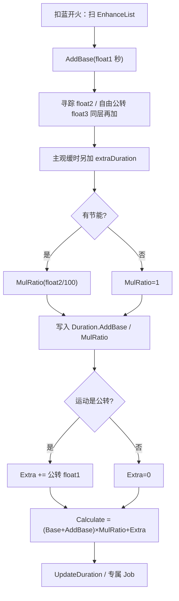

# 时长强化（Spell3103 / EnhanceDurationValue）逆向分析

> 范围：仅玩家法术增强符文「时长强化」（`abilityType = 3103`，配置 ID `31031–31033`）。重点是**秒数怎么加算**、**和其它持续来源怎么分层**，以及**哪些法术真正读 `Duration`**。
> 不展开遗物/诅咒逐条来源，也不复述悬停第二段全文。
> 方法：`SpellConfig.json` + 反编译 `Assembly-CSharp` 交叉验证。未标注「推测」的结论均有代码/数据直接证据。
> 玩家施法主路径是 ECS。Mono `SpellBase` 对公转加时的乘算位置不同，文末单独对照。
> 配套：总览见《魔法工艺法术系统逆向报告.md》，原始数值见《法术数值总表.md》，槽位解析骨架见《伤害强化逆向分析.md》，两段计时见《悬停逆向分析.md》，子弹满额重开见《分裂逆向分析.md》，主观缓时换秒见《加速器逆向分析.md》。离线可开见 `时长强化逆向分析.html`。

---

## 1. 身份与定位


| 项 | 值 |
| --- | --- |
| 中文名 | 时长强化 |
| 英文名 | Duration Boost |
| `abilityType` | `3103` / `SpellAbilityType.EnhanceDurationValue` |
| 配置 ID | `31031`（Lv1）/ `31032`（Lv2）/ `31033`（Lv3） |
| 稀有度 | 普通（`dropType=1`） |
| `useType` | `2`（Enhance 强化符文） |
| 槽位消耗 | `slotCost=1`，`mpCost=0`，自身 `damage=0` |
| 作用对象 | `haveEffecforMissileSpell=true`，`haveEffecforSummonSpell=false` |
| 合成 | Lv1→Lv2→Lv3（`canCompound`：Lv1/2=`true`，Lv3=`false`） |
| 售价（金币） | 8 / 24 / 72 |


**机制一句话**：插在主动/召唤法术**左侧**的纯数值符文；把 `float1` **秒**写进持续的**加算池**（`AddBase`），多张、跨等级都是秒数相加。它不加悬停第二段，也不改元素 DoT / 闪电链自己的计时。



文案（`TextConfig_Spell` id `7131031–7131033`）：

> 法术持续时间+**float1**秒

名称（`7031031–7031033`）：时长强化 / Duration Boost。三级名称相同，只有 `float1` 不同。

---

## 2. 数值结构

### 2.1 配置表原始值（`assets_export/SpellConfig.json`）


| ID | Level | float1（加算秒） | 售价 | 可合成 |
| --- | --- | --- | --- | --- |
| 31031 | 1 | **2** | 8 | true |
| 31032 | 2 | **3.5** | 24 | true |
| 31033 | 3 | **6** | 72 | false |


规律：售价每级 ×3。`float1` **不是**每级 ×2（和伤害强化 / 范围增强不同）。`float2/3`、`int1/2/3` 全 0。无耗蓝倍率。

### 2.2 字段语义


| 字段 | 语义 | 置信度 | 证据 |
| --- | --- | --- | --- |
| **float1** | 加算秒数；运行时 `RatioValue.AddBase(float1)` | 高 | `SpellShootData.GetSpellDuration`；文案占位 `float1` |
| float2/3、int1/2/3 | 未使用 | 高 | 配置恒 0，无引用 |
| `haveEffecforMissileSpell` | 自动填槽：不是「只给召唤」 | 高 | `SpellAutoFullTool.Filter_SummonOnlyEnhance` |
| `haveEffecforSummonSpell` | 表上是 `false` | 高 | `GetSpellDuration` **不读**这两个字段 |


时长强化没有独立 `Spell3103*System` / Authoring。它不是 ECS 行为组件，只是被 `GetSpellDuration` 读 `abilityType` 后改一个加数。

### 2.3 等级不能互替

伤害强化 / 范围增强是线性等价（`1×Lv2 = 2×Lv1`）。时长强化**不是**：

```
1×Lv2  = +3.5s    2×Lv1 = +4s
1×Lv3  = +6s      3×Lv1 = +6s     （只有这一档碰巧相等）
2×Lv2  = +7s      Lv1+Lv2 = +5.5s
```

合成省槽，但不提高单点效率。`3×Lv1` 和 `1×Lv3` 数值相同、槽位差 2。自动填槽**不自排斥**（`SelfRepelSpells` 只有元素晶石），手摆和自动都可以叠多张。

---

## 3. 叠加如何计算（核心）

### 3.1 结论

**多张时长强化之间是秒数相加，不是连乘，也不是百分比。**

文案写「法术持续时间 +2 秒」。两张 Lv1 的结果是 `+4 秒`，不是 `×2 ×2`，也不是「再加 2%」。

写入代码的步骤只有一步：`addBase += float1`。

```
加算秒数 = Σ(每张时长强化的 float1)
最终飞行段 ≈ (表 duration + 加算秒数 + 其它 AddBase) × 节能乘算 + Extra
```

### 3.2 通用比率容器

`RatioValue` 把「绝对值相加」和「百分比连乘」拆开：

```36:36:decompiled/Assembly-CSharp/RatioValue.cs
	public double ResultDouble => (BaseValue + addBase) * baseAddRatio * addRatio * mulRatio + addExtra;
```

```59:63:decompiled/Assembly-CSharp/RatioValue.cs
	public RatioValue AddBase(double val)
	{
		addBase += val;
		return this;
	}
```

ECS 侧 `AttributeValue.Calculate()`：

```24:26:decompiled/Assembly-CSharp/AttributeValue.cs
	public readonly float Calculate()
	{
		return (Base + AddBase) * (1f + AddRatio) * MulRatio + Extra;
	}
```

持续这条 `AddRatio` 通常是 0。映射时：

```274:279:decompiled/Assembly-CSharp/ShootSpellUtils.cs
			Duration = new AttributeValue(configCopy.duration)
			{
				AddBase = sip.extraDuration,
				MulRatio = sip.finalDurationRatio,
				Extra = ((sip.finalMovementType != SpellSpecialMovementType.Rotation) ? 0f : (sip.RotationMovementInfo?.extraDuration ?? 0f))
			},
```

`sip.extraDuration` 来自 `GetSpellDuration().CurrentAddBase`（再加主观缓时，见第 6 节）。`sip.finalDurationRatio` 来自 `CurrentMulRatio`（目前只有节能会改）。`DurationTimer` 初始为 0。

### 3.3 `GetSpellDuration`：谁进加算池

```128:149:decompiled/Assembly-CSharp/SpellShootData.cs
	public RatioValue GetSpellDuration()
	{
		RatioValue ratioValue = new RatioValue(Spell.GetFinalConfig().duration);
		foreach (SpellConfig item in EnhanceList.Select((SlotData e) => e.GetFinalConfig()))
		{
			switch (item.abilityType)
			{
			case SpellAbilityType.EnhanceDurationValue:
				ratioValue.AddBase(item.float1);
				break;
			case SpellAbilityType.PowerSavingMode:
				ratioValue.MulRatio(item.float2 / 100f);
				break;
			case SpellAbilityType.RandomRotationRadiu:
				ratioValue.AddBase(item.float3);
				break;
			case SpellAbilityType.AroundMouse:
				ratioValue.AddBase(item.float2);
				break;
			}
		}
		return ratioValue;
	}
```

对时长强化本身：

1. 命中 `EnhanceDurationValue` 分支；
2. `AddBase(float1)`（单位是秒，**不除 100**）；
3. 与寻踪（`AroundMouse` 的 `float2`）、自由公转（`RandomRotationRadiu` 的 `float3`）走**同一条** `AddBase`；
4. 节能模式走 `MulRatio(float2/100)`，是另一层。

`switch` 里没有「已处理过同类型就跳过」。同 `abilityType` 出现几次就加几次。

**不在这个函数里的**：悬停、公转（`AroundOwner`）、主观缓时、反弹加时。它们走别的字段，见第 6 节。

`GetSpellDuration_FinalPlayerValue` 直接 `return GetSpellDuration()`，**没有**再加玩家遗物 / 法杖持续。卡面预览和施法锁用的也是这一层（不含公转 Extra、不含主观缓时）。

### 3.4 多张叠加公式

对一张主动/召唤法术，设其配置持续为 `B` 秒，其 `EnhanceList` 里有若干张时长强化，则仅这一层：

```
AddBase = Σ float1_i

仅时长强化、无节能时的飞行段 = B + AddBase
```

展开（`B = 0.5`，魔法弹 Lv1）：

```
1 张 Lv1：0.5 + 2            = 2.5
2 张 Lv1：0.5 + 2 + 2        = 4.5
1 张 Lv2：0.5 + 3.5          = 4.0
1 张 Lv1 + 1 张 Lv2：0.5 + 5.5 = 6.0
1 张 Lv3：0.5 + 6            = 6.5
3 张 Lv1：0.5 + 6            = 6.5
```

**没有衰减、没有上限、没有「只取最高级」。**

### 3.5 常见误解


| 误解 | 实际 |
| --- | --- |
| 两张 +2 秒连乘成更长 | 加算成 +4 秒 |
| 文案是百分比（+2%） | 绝对值秒 |
| 高级覆盖低级，只算最大那张 | 全部求和 |
| `1×Lv2 = 2×Lv1` | 3.5 ≠ 4；只有 `3×Lv1 = 1×Lv3 = +6` |
| 右侧那张也会强化左侧法术 | 只强化**自己右边**的主动/召唤（同段） |
| 同时加长悬停 | 只加 `Duration`；悬停走另一段 |
| 合成后单点变得更赚 | 数值不线性；合成只是用 1 格换更高 `float1` |


---

## 4. 谁吃得到这张卡

### 4.1 解析：同段左侧全部累积

`SpellGroupParser` 从左到右扫槽位。遇到 Enhance 就推进累积列表 `list2`，**不会在消耗后清空**；遇到 Missile / Summon（或触发器）时，把**当前累积快照**挂到该法术的 `EnhanceList` 上。主槽和后槽分别 `Parse`，互不串。

```
[时] [弹] [滚球]
  → 魔法弹 EnhanceList = [时]
  → 滚球   EnhanceList = [时]

[弹] [时] [滚球]
  → 魔法弹吃不到
  → 滚球吃 +2s

[时A] [弹] [时B] [滚球]
  → 弹只吃 A
  → 滚球吃 A+B
```

摆放顺序决定的是「这张卡从哪一张主动法术开始生效」，不是「只强化下一张」。

### 4.2 `haveEffecforSummonSpell=false` 拦不住手动

全工程只有配置拷贝写这个字段，`GetSpellDuration` 不读。手动插在召唤左侧，召唤实体仍会带上 `Duration.AddBase`。部分召唤会拿它改寿命（见 5.5）。

自动填槽：`haveEffecforMissileSpell=true`，`Filter_SummonOnlyEnhance` 不会把它滤成「只给召唤」。不在 `IgnoreSpells`、不在 `SelfRepelSpells`、不在 `SpellAvoidEnhances`。奥爆 / 陨石 / 激光都不会被自动填避开这张卡。

### 4.3 魔能升阶抬的是这张卡的 `float1`

`EnhanceList` 取 `GetFinalConfig()`。`SpellLevelEnhance`（魔能升阶）把 `31031` 抬成 `31032` / `31033`（不超过该 `abilityType` 最高级）。叠加规则不变，变的是送进 `AddBase` 的秒数。

---

## 5. 谁真正读到这份 Duration

它不自己计时。运行时飞行段是：

```
Duration.Calculate()
  = (表 duration + extraDuration) × finalDurationRatio + Extra
  = (B + Σ时长 + Σ寻踪float2 + Σ自由公转float3 + 主观缓时换秒)
    × Π(节能 float2/100)
    + [公转 Extra，仅运动类型是 Rotation]
    + [运行时再加的 Extra：反弹加时等]
```

谁拿 `Duration.Calculate()` 当寿命、谁拿 `Duration.AddBase` 当加数、谁完全不读，结果差很多。

### 5.1 按机制族


| 机制族 | 吃不吃 | 怎么吃 | 边界 |
| --- | --- | --- | --- |
| 通用导弹（魔法弹等） | **吃** | `UpdateDuration`：`DurationTimer` 走到 `Calculate()` 再销毁 / 进悬停 | 命中且穿透耗尽会直接销毁，走不到寿命结束 |
| 悬停第二段 | **不吃** | `HoverDuration` 只加悬停自己的 `float1` | 两段分开；总存活 = 飞行 + 悬停 |
| 坠落 `IsFallSpell` | **写入但不销毁** | 只加 `DurationTimer`，不因时长用尽销毁 | 通用坠落活到落地；秒数仍在快照里 |
| 激光 `1004` / 符文锤 / 激光束 / 彼岸刃 / 保护伞 / 戴夫鱼叉 | **通用路径不吃** | `UpdateDuration` 短路，只加 `DurationTimer` | 激光寿命是 `0.2 + HoverDuration`，**不读** `Calculate()` |
| 高压水枪 `1019` | 吃 Extra / 折算 | 专属初始化：`Duration.Extra += HoverDuration`，然后清悬停 | 继续喷，不是停在原地 |
| 分解射线 / 龙息 / 冲刺 | **吃施法锁** | `GetMaxKeepCastSpellDuration` 用 `GetSpellDuration().Result` | 冲刺再加 Σ悬停；有坠落则整句不进。**这个"施法锁"只作用于队友 AI**，见 5.3 |
| 冲刺 `1016` | **吃，且一份钱买三样** | `Calculate()` 同时是飞行段长度、**玩家无敌窗口**、**过热换算的输入** | 过热是驾驶时长的**凹函数**（封顶 8s），堆越多越划算，见 5.8 |
| 黑洞等 `isDPS` | **吃** | 实体还在，DPS 间隔继续转 | 黑洞 Lv1 表持续 5s，+2 变成 7s |
| 落雷阵 `1018` | **吃，且收益严格线性** | `duration = 5`，每 0.25s 一次结算；加的每一秒都换成 4 次结算 | 坠落形态下**完全无效**（`!IsFallSpell` 守卫）。收益模型见 5.9 |
| 奥爆 `1008` | **写入，行为怪** | 表 `duration=0`；Job 把 `DurationTimer` 夹到 1 做缩放 | `Calculate()>1` 时通用寿命能否走完，需实机确认 |
| 召唤 | **部分吃 AddBase** | 不读 `Calculate()` 当通用寿命；个别用 `AddBase` / `MulRatio` | 表标了召唤无效，运行时不读这个旗标 |
| 元素 DoT / 冰冻 | **不吃** | 各晶石自己的 `float1` / `int` | 燃烧、毒、粘液、冰冻都不走 `GetSpellDuration` |
| 闪电链 | **不吃** | 链没有寿命计时器 | 存在时间由两端实体决定，见《闪电链逆向分析.md》 |
| 分裂子弹 | **吃，满额重开** | 快照整包复制；`DurationTimer=0` | 不是母弹剩余量 |


### 5.2 通用导弹：飞行段就是这份秒

`SpellSystem.UpdateDuration`（非坠落、非激光族）：

```
飞行中     DurationTimer < Calculate()     正常移动、正常命中
刚结束     时长用尽                         Speed=0，进入悬停
悬停中     HoverTimer < HoverDuration      锁位置
悬停结束   HoverTimer 走完                  销毁 / 缩小 / 分裂 / 结束触发
```

没有悬停时，飞行结束当帧销毁。魔法弹 Lv1（`B=0.5`），打空让它活到寿命结束：


| 槽位 | 飞行 | 悬停 | 总存活 |
| --- | --- | --- | --- |
| `[弹]` | 0.5 | 0 | 0.5 |
| `[时Lv1] [弹]` | **2.5** | 0 | 2.5 |
| `[时Lv2] [弹]` | **4.0** | 0 | 4.0 |
| `[时Lv3] [弹]` | **6.5** | 0 | 6.5 |
| `[时Lv1]×2 [弹]` | **4.5** | 0 | 4.5 |
| `[悬Lv1] [弹]` | 0.5 | **2** | 2.5 |
| `[时Lv1] [悬Lv1] [弹]` | **2.5** | **2** | 4.5 |


同一张「+2 秒」：时长强化加在飞行，悬停加在第二段。总存活碰巧都是 2.5，但飞行距离只有时长强化会拉长（`speed × Duration`）。

半途传送看 `Duration / 2`，发生在飞行段。时长强化会把传送点往后推。

正在充能（`ChargingTag`）时，`UpdateDuration` 整段不跑。闪耀星矢蓄力期寿命冻结，松手后才扣这份 Duration。

### 5.3 常驻施法锁（**只作用于队友 AI**）

`SpellGroupShootDurationCalculator.GetMaxKeepCastSpellDuration`：


| 法术 | 按住时长 |
| --- | --- |
| 分解射线 / 高压水枪 / 龙息 | `GetSpellDuration().Result`（含时长、寻踪、自由公转、节能；**不含**公转 Extra、主观缓时） |
| 冲刺 | 上面这份 **再加** Σ悬停 |
| 槽位里有坠落 | 整句不进（`flag2`） |
| 其它法术 | 0（不锁按住） |


龙息 Lv1 表持续 3s，一张时长 Lv1 → 施法锁 5s。激光**不在**这张表里：它不是 keep-cast，寿命也不读 Duration。

**这个函数的调用范围比"施法锁"这个词听起来窄得多。** 全工程检索 `GetMaxKeepCastSpellDuration` 只有 `GetMaxCastDuration` 一个调用者，而后者只被 `Teammate5.cs`（L636、L910）与 `Teammate5FuseController.cs`（L651、L884）调用——都是**法杖精灵 / 召唤伙伴**的施法状态机。**玩家自己的开火节流完全不走这里**：冲刺靠 `PlayerMgr.inDashSpell` 与过热（`Wand.CanShoot`），龙息 / 分解射线 / 高压水枪靠 `SpellShootSystem` 的 `UnitKeepCastingSpells` 缓冲。

冲刺把这份 Duration 用得比谁都狠——一份钱买三样，见 5.8。

### 5.4 表 `duration=0`

激光、奥爆术配置持续都是 0。`AddBase` 仍会写入。

- **激光**：专属 Job 的 `totalTime = 0.2 + HoverDuration`。时长强化**不加**这条寿命；要延长激光，得插悬停。
- **奥爆**：走通用 `UpdateDuration`。无时长时 `Calculate()=0`，当帧结束（或进悬停）。插了时长后 `Calculate()` 变成 2 / 3.5 / 6；同时 `Spell1008Job` 每帧把 `DurationTimer` 夹到 `[0, 1]` 做缩放动画。这两套对 `DurationTimer` 的用法冲突，**是否卡在场上需实机确认**。

自动填槽不会因为 `duration=0` 避开这张卡（没有等价于范围增强那样的 `Filter_EffectRangeEnhance`）。

### 5.5 召唤

配置写了不对召唤生效，运行时不读这个旗标。手动插在召唤左侧：

- 队友实体生成时带上同一份 `Duration.AddBase` / `MulRatio` / `Extra`
- **克总之手**（`2003`）：触手 `LifeDuration = ((Level+1)×10 + Duration.AddBase) × Duration.MulRatio`。Lv1 基础 20s，+2 → 22s，再乘节能
- **寄生虫**（`3015`）：蠕虫 `exitTimer = 6 + Duration.AddBase`（**不乘** `MulRatio`）
- **自爆虫**（`SpellTools`）：`LifeTime = (6 + AddBase) × MulRatio`（有进阶技能则底数改 10）
- **啵啵子弹**（`2001`）：子弹 `BuildBoboBullet` 只把 `Duration.Extra + Duration.AddBase` 当 bonus，不走完整 `Calculate()`
- **Teammate1** 自己射出的弹：`(duration + bonusDuration) × finalDurationRatio`（Mono 召唤物残留）

大多数召唤体的「在场多久」看各自的队友寿命 / 数量上限，**不是**通用 `UpdateDuration`。不要默认「插一张时长，所有召唤都 +2 秒」。

### 5.6 元素 DoT、冰冻、闪电链

这些计时器在发射时已经写成 Element 字段，**不读** `GetSpellDuration`：


| 来源 | 自己的持续字段 |
| --- | --- |
| 毒液晶石 | `GetVenomElementData` 的 `float1`（取 max） |
| 炽焰晶石 | `GetFireElementData` 的 `float2` |
| 粘液晶石 | 自己的持续 / 移速比 |
| 寒霜晶石 | `FrozenDuration` |
| 闪电链 | 无寿命；两端实体没了链就没了 |


`[时][毒][弹]`：子弹飞得更久，毒的持续仍是毒晶石自己的秒数。子弹活得久只是「有更多机会把毒涂上去」，不是把毒时长短拉长。

### 5.7 分裂：满额重开

`ToSplit` 整包复制快照，**不改** `Duration.AddBase / MulRatio / Extra`。新实体 `DurationTimer = 0`。

母弹已经飞了多久，子弹不看。拿到的是开火当时的完整秒数，再飞完整段。见《分裂逆向分析.md》3.2。

### 5.8 冲刺 `1016`：一份 Duration 买三样

冲刺是全表把 `Duration` 用得最狠的法术——`Calculate()` 同时决定三件事：

1. **飞行段长度**（`speed = 19`，位移 = `19 × Duration`）
2. **玩家的无敌 + 飞行 + 无碰撞窗口**（法术销毁才解除）
3. **结束后的过热时长**（`Spell1016CleanupSystem.GetOverheatTime`）

第 3 项是个**分段线性的凹函数**：

```
d <= 1    →  d
d <= 8    →  0.357 * d + 0.643
d <= 50   →  0.107 * d + 2.65
d >  50   →  8            // 硬封顶
```

| 槽位 | 驾驶时长 d | 距离 | 过热 f(d) | 驾驶 / 过热 |
| --- | --- | --- | --- | --- |
| `[冲刺]` | 1.0 | 19 | 1.00 | 1.00 |
| `[时Lv1(+2)] [冲刺]` | 3.0 | 57 | 1.71 | 1.75 |
| `[时Lv2(+3.5)] [冲刺]` | 4.5 | 85.5 | 2.25 | 2.00 |
| `[时Lv3(+6)] [冲刺]` | 7.0 | 133 | 3.14 | **2.23** |
| `[时Lv3]×2 [冲刺]` | 13.0 | 247 | 4.04 | **3.22** |
| `[时Lv3]×3 [冲刺]` | 19.0 | 361 | 4.68 | **4.06** |
| 任何 `d > 50` | >50 | — | **8.00 封顶** | **无上限** |

**边际成本递减**：第一张 +2 秒换来 +0.71 秒过热；从 13 秒堆到 19 秒（+6 秒）只换来 +0.64 秒过热。理论上把 `duration` 堆过 50 秒后，冲刺就变成「50 秒无敌换 8 秒不能用这一组」。

两条容易踩的边界：

- **加速器不改过热**（过热只看 `duration`），所以「跑得远」有零代价的替代品；时长强化买的是**无敌时间**，不是位移。
- 过热锁的是**组**不是杖（`Wand.CanShoot` L1968 用 `currentShootGroup.HasShootableSpell(Dash, deepSearch: false)`），冲刺单独占一组时过热期间会自动轮空那一组继续打别的组。

详见《闪电疾行逆向分析.md》§4。

### 5.9 `isDPS` 法术：收益是严格线性的

前面几节的收益都带拐点——冲刺的过热是凹函数（5.8）、一次性飞弹的时长只是延长命中窗口、蝴蝶有一段固定的减速相变。**对 `isDPS = true` 且靠 `duration` 计时的法术，时长强化的收益是严格线性的**：这类法术没有「减速段」「飞行段」这类摊在寿命里的固定开销，寿命的每一秒都是等价的产出时间，加的每一秒都原样换成 `1 / DPSDamageInterval` 次结算。

```
总伤 ≈ damage × (表 duration + Σfloat1)          // 满命中时再乘命中数
边际收益 = 每秒结算次数 × 每次伤害                // 与已加的秒数无关
```

蓝耗那边一分不涨（`GetSpellManaCost` 不看 `isDPS`，一次性扣），所以这条线的伤害/蓝比也是严格线性上升的。

**实例：落雷阵 `1018`。** `damage = 22/44/88`、`isDPS = true`、`DPSDamageInterval = 0.25`、`duration = 5`——5 秒 = 20 次结算。按 Lv3（`damage = 88`、`int1 = 7`）满命中算：


| 槽位 | `Duration.Calculate()` | 结算次数 | 满命中总伤 | 相对默认 | 蓝耗 |
| --- | --- | --- | --- | --- | --- |
| `[落雷阵Lv3]` | 5.0 | 20 | 3080 | — | 56 |
| `[时Lv1(+2)] [落雷阵Lv3]` | **7.0** | 28 | 4312 | **+40%** | 56 |
| `[时Lv2(+3.5)] [落雷阵Lv3]` | **8.5** | 34 | 5236 | **+70%** | 56 |
| `[时Lv3(+6)] [落雷阵Lv3]` | **11.0** | 44 | 6776 | **+120%** | 56 |


百分比和秒数完全成比例（`+2/5 = 40%`、`+3.5/5 = 70%`、`+6/5 = 120%`），没有任何衰减或加成。**落雷阵是全表时长强化收益最干净的载体**：不用算飞行距离、不用算命中窗口、不用算相变，直接乘。

一个配套结论：3.5 那条「1×Lv2 ≠ 2×Lv1」在这里直接翻译成伤害差——两张 Lv1（+4s）对落雷阵是 +80%，一张 Lv2（+3.5s）是 +70%，槽位换伤害的账可以直接按秒数比。

**例外：坠落形态下这张卡完全无效。** `SpellSystem.UpdateDuration` L275 的 `!IsFallSpell` 守卫让坠落态根本不跑 duration 分支（5.1 表里那行「写入但不销毁」）。对普通弹这只是「不因时长销毁、活到落地」；对落雷阵后果更彻底——它的坠落态寿命由 `ReboundCount` 决定（每 0.1 s 跳一次，跳完即销毁），`Duration.Calculate()` 从头到尾没人读。`[坠落] [时长强化] [落雷阵]` 里那张时长强化是一个纯空槽位，要延长坠落态得插反弹。

同理，悬停（3008）对落雷阵**不是**这里说的两段分开加，而是等价于第二张时长强化——那是法术自己的结算 Job 不设生命周期门造成的，详见《悬停逆向分析.md》4.2 与《落雷阵逆向分析.md》7.3 / 7.4。

---

## 6. 与其它持续来源的关系

### 6.1 同加算池（和时长强化直接相加）

`GetSpellDuration` 里与时长强化走同一 `AddBase` 的强化：


| 符文 | abilityType | 写入值 | 典型值 |
| --- | --- | --- | --- |
| 时长强化 | 3103 EnhanceDurationValue | `float1` 秒 | 2 / 3.5 / 6 |
| 寻踪 | 3010 AroundMouse | `float2` 秒 | 1 / 2 / 4 |
| 自由公转 | 3117 RandomRotationRadiu | `float3` 秒 | 3（仅 Lv1） |


`[时Lv1][寻踪Lv1][弹]`：`AddBase = 2+1 = 3`，飞行 3.5s。不是两套互斥。

### 6.2 乘算层：节能模式

节能（`3104`）文案：「法术持续时间 ×**float2**%」。配置 `float2 = 75 / 75 / 80`。

`MulRatio(float2/100)` 连乘。多张节能是 **`mulRatio` 连乘**。

节能乘的是 `(Base + AddBase)`，**包括时长强化**。ECS 的 `Extra`（公转加时、反弹加时）在乘算之后，**不被节能缩小**。

```
[时Lv1][节能Lv1][弹] = (0.5+2) × 0.75 = 1.875s
```

不是 `0.5×0.75 + 2 = 2.375`。先加再乘。

### 6.3 公转 Extra（另一层，且看运动类型）

公转（`3009` / `AroundOwner`）**不进** `GetSpellDuration`。它的加时来自 `GetSpellRotationInfo` 的 `float1`（4 / 7 / 11），只在 `finalMovementType == Rotation` 时写入 `Duration.Extra`。

运动类型从右往左只取第一个。公转被寻踪 / 导航挡住时，这份 Extra **不会**加上；寻踪自己的 `float2` 仍在 AddBase 里。

```
ECS：Calculate = (B + 时长 + …) × 节能 + 公转Extra
[时Lv1][公转Lv1][弹] = (0.5+2) × 1 + 4 = 6.5s
[时Lv1][节能Lv1][公转Lv1][弹] = 1.875 + 4 = 5.875s
```

卡面 `GetSpellDuration()` **不含**这笔 Extra，预览会比实飞短一截。

### 6.4 主观缓时 3128

不在 `GetSpellDuration` 里。`ProcessShootDataEffect` 在取完 `CurrentAddBase` 之后：

```
extraDuration += GetSpellSpeedToBonusDuration(速度/降速比, 降速比, 0.5)
```

魔法弹 16 速、一张主观缓时：换来 **+4s**，再写进同一个 `extraDuration`（AddBase）。节能会乘上这笔。卡面 `GetSpellDuration()` **不含**它。细节见《加速器逆向分析.md》4.2。

### 6.5 悬停、反弹

| 来源 | 写到哪 | 和时长强化 |
| --- | --- | --- |
| 悬停 3008 | `HoverDuration` | 两段分开加；不进 `GetSpellDuration` |
| 反弹 3012 | 运行时 `Duration.Extra += ReboundAddTime` | 飞行更久；加在 Extra，节能不乘 |
| 高压水枪 / 非坠落诡雷 | `Duration.Extra += HoverDuration`，然后 `HoverDuration=0` | 悬停秒数并进寿命，时长强化仍在 AddBase |

### 6.6 分层不要混用


| 入口 | 含什么 |
| --- | --- |
| `GetSpellDuration` | 表 duration + 时长 + 寻踪 float2 + 自由公转 float3，再乘节能 |
| `GetSpellDuration_FinalPlayerValue` | 同上，不再加遗物 |
| SIP `extraDuration` | 上面的 `CurrentAddBase` **再加**主观缓时 |
| ECS `Duration.Calculate()` | `(Base+extraDuration)×节能 + 公转Extra + 运行时 Extra` |
| 卡面 / 施法锁 | 只用 `GetSpellDuration().Result` |


---

## 7. 数值算例

基准：魔法弹 Lv1，`B = 0.5`，速度 16。先不算玩家和法杖。打空。

### 7.1 只叠时长强化


| 槽位（左 → 右） | AddBase | 飞行 | 距离（速×时） |
| --- | --- | --- | --- |
| `[弹]` | 0 | 0.5 | 8 |
| `[时Lv1] [弹]` | +2 | 2.5 | 40 |
| `[时Lv1]×2 [弹]` | +4 | 4.5 | 72 |
| `[时Lv2] [弹]` | +3.5 | 4.0 | 64 |
| `[时Lv3] [弹]` | +6 | 6.5 | 104 |
| `[时Lv1]×3 [弹]` | +6 | 6.5 | 104 |


两张 Lv1 **不是** `0.5 × 3 × 3`。`1×Lv2` 比 `2×Lv1` 短 0.5 秒。

### 7.2 摆放顺序


| 槽位 | 魔法弹 | 滚球（设 B 相同量级时只看是否吃到） |
| --- | --- | --- |
| `[时] [弹] [球]` | +2 | +2 |
| `[弹] [时] [球]` | 0 | +2 |
| `[时A] [弹] [时B] [球]` | 只吃 A | 吃 A+B |
| `[弹] [球] [时]` | 0 | 0（强化在右侧，作废） |


主槽的强化加不到后槽。

### 7.3 与其它持续层混放


| 组合（均在法术左侧） | 计算 | 飞行 |
| --- | --- | --- |
| 时Lv1 + 寻踪Lv1（+1s） | `0.5+2+1` | 3.5 |
| 时Lv1 + 节能Lv1（×75%） | `(0.5+2)×0.75` | 1.875 |
| 时Lv1 + 悬停Lv1 | 飞行 2.5，悬停 2 | 总存活 4.5 |
| 时Lv1 + 公转Lv1（Extra +4） | `(0.5+2)+4` | 6.5 |
| 时Lv1 + 节能Lv1 + 公转Lv1 | `1.875+4` | 5.875 |
| 时Lv1 + 主观缓时（弹速 16 → +4s） | `0.5+2+4` | 6.5 |


把时长理解成「先乘 2 再乘节能」是错的——时长是加秒，节能是乘整段。

### 7.4 槽位 vs 合成


| 目标加算 | 最小槽位方案 | 金币（仅卡面售价） |
| --- | --- | --- |
| +2s | 1×Lv1 | 8 |
| +3.5s | 1×Lv2（1 槽）；2×Lv1 是 +4s | 24 或 16 |
| +6s | 1×Lv3 或 3×Lv1 | 72 或 24 |


要 +6s：三张 Lv1 更便宜，但占 3 槽。槽位紧时合成。

---

## 8. 与构筑相关的行为摘要


| 行为 | 结果 |
| --- | --- |
| 多张时长强化在同一主动左侧 | `float1` 全部加算 |
| 1×Lv2 / 2×Lv1 | **不相同**（3.5 vs 4） |
| 1×Lv3 / 3×Lv1 | 数值相同（+6s） |
| 与寻踪、自由公转并放 | 继续加算 |
| 与节能并放 | 先加总再乘 `float2%` |
| 与公转并放 | 公转走 Extra（仅 Rotation），节能不乘 Extra |
| 与悬停并放 | 只加飞行段 |
| 与主观缓时并放 | 换来的秒再进 AddBase，节能会乘 |
| 放在主动法术右侧 | 该法术吃不到；其后的法术吃得到 |
| 主槽强化 / 后槽法术 | 不加（分段 Parse） |
| 插在 `isDPS` 法术左侧（落雷阵 `1018` 等） | **收益严格线性**：+2/+3.5/+6 秒 = +40%/+70%/+120% 总伤，蓝耗不变（5.9） |
| 插在坠落态的落雷阵左侧 | **完全无效**：`!IsFallSpell` 守卫让它不跑 duration，寿命由 `ReboundCount` 决定 |
| 插在激光左侧 | 写入快照，激光寿命仍是 `0.2+悬停` |
| 插在召唤左侧 | 旗标拦不住；只有部分召唤读 `AddBase` |
| 魔能升阶抬级 | 该张卡的 `float1` 按新等级算 |
| 分裂子弹 | 满额重开，计时器归零 |


---

## 9. Mono 残留轨对照

`SpellBase` 仍可能被旧路径走到：

```
bonusDuration += extraDuration          // 时长 + 寻踪 + 自由公转 + 主观缓时
finalDurationRatio *= 节能
若 Rotation：bonusDuration += 公转 float1
spellCfg.duration = (duration + bonusDuration) × finalDurationRatio
```

和 ECS 的差异：


| 项 | ECS（玩家主路径） | Mono |
| --- | --- | --- |
| 时长 / 寻踪 / 自由公转 | `AddBase` | `bonusDuration` |
| 节能 | `MulRatio`，不乘 Extra | 乘整段 `(duration+bonusDuration)` |
| 公转加时 | `Duration.Extra`，**节能不乘** | 先加进 `bonusDuration`，**节能会乘** |
| 计时 | `DurationTimer` vs `Calculate()` | `DurationTimer` vs `spellCfg.duration` |


讨论玩家构筑时以 **ECS** 为准。`[时][节能][公转]` 在 Mono 里公转那 4 秒也会被 ×75%，ECS 不会。

---

## 10. 证据索引


| 结论 | 文件 |
| --- | --- |
| 配置数值 2 / 3.5 / 6 | `assets_export/SpellConfig.json`（31031–31033） |
| 描述文案 | `assets_export/TextConfig_Spell.json`（703103x / 713103x） |
| 加算写入 | `SpellShootData.GetSpellDuration`（`EnhanceDurationValue` → `AddBase`） |
| 预览不再加遗物 | `SpellShootDataExtend.GetSpellDuration_FinalPlayerValue` |
| 比率容器 | `RatioValue.AddBase` / `MulRatio` / `ResultDouble` |
| ECS 映射 | `ShootSpellUtils`：`Duration.AddBase = extraDuration`，`Extra` 仅 Rotation |
| ECS 计算公式 | `AttributeValue.Calculate`：`(Base+AddBase)×(1+AddRatio)×MulRatio+Extra` |
| 解析累积、不清空 | `SpellGroupParser` |
| 主槽/后槽分段 | `Wand`：`Parse(normalSlots)` / `Parse(postSlots)` |
| SIP 拆分 | `SpellInitialParameter`：`extraDuration` / `finalDurationRatio`；主观缓时后加 |
| 通用寿命 | `SpellSystem.UpdateDuration` |
| 施法锁 | `SpellGroupShootDurationCalculator.GetMaxKeepCastSpellDuration` |
| 激光寿命 | `Spell1004LaserJob`：`totalTime = 0.2 + HoverDuration` |
| `isDPS` 单次伤害 = `damage × DPSDamageInterval` | `ShootSpellUtils.cs` L286；`TakeDamageInfo_Dots.cs` L153 |
| 落雷阵结算 Job 不读生命周期（悬停也照打） | `Spell1018ThunderAuraSystem.cs` L25、L57–61、L157–237 |
| 落雷阵坠落态不跑 duration | `SpellSystem.cs` L275、L310；`Spell1018ThunderAuraSystem.cs` L638–691 |
| 克总之手寿命 | `Spell2003SummonSystem`：`LifeDuration` |
| 蠕虫寿命 | `Spell3015WormSystem`：`exitTimer = 6 + AddBase` |
| 公转 Extra | `SpellShootData.GetSpellRotationInfo`（`AroundOwner.float1`） |
| Mono 实伤 | `SpellBase`：`(duration + bonusDuration) * finalDurationRatio` |
| 枚举 | `SpellAbilityType.EnhanceDurationValue = 3103` |


---

## 11. 待决 / 局限

1. **奥爆 + 时长**：`Spell1008Job` 把 `DurationTimer` 夹到 1，和 `Calculate()>1` 冲突。卡死 / 提前结束 / 只影响缩放，需实机确认。
2. **召唤逐只寿命**：只点名了克总之手、寄生虫、自爆虫、啵啵子弹。其它召唤是否读 `AddBase` 未逐只拆完。
3. **卡面 vs 实飞**：预览不含公转 Extra、不含主观缓时。以实体 `Calculate()` 为准。
4. **`haveEffecforSummonSpell`**：对时长强化恒为 false，且运行时不读；若日后出现「只对召唤生效的持续加算」，不能想当然复用本符文的结论。
5. **动态再加 Extra**：反弹、半途传送、次元旅行者、巨型泡泡等会在 Job 里改 `Duration.Extra`。那是该法术自己的加时，与槽位时长强化相加，不是时长强化内部的连乘。
