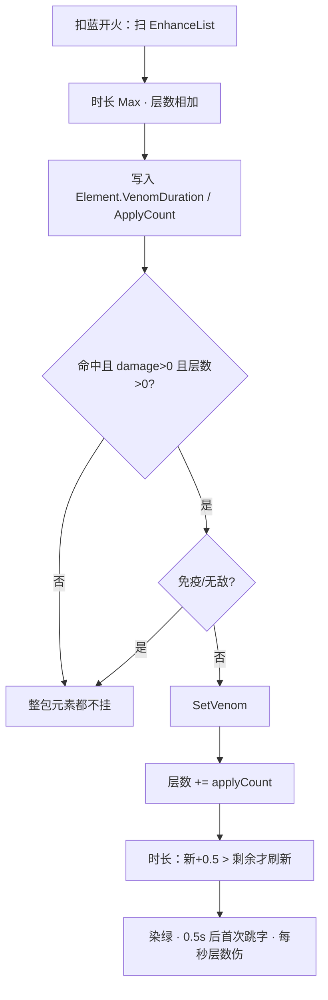

# 毒液晶石（Spell3005 / VenomCrystal）逆向分析

> 范围：仅玩家强化符文「毒液晶石」（`abilityType = 3005`，配置 ID `30051–30053`）。重点是**法术侧怎么合成时长和层数**，以及**命中后 `SetVenom` 怎么叠层、怎么跳字**。
> 不展开敌人毒雾 / 毒卵、药水免疫、地上毒液怪。地面毒痕只作为「颜色决定铺不铺地」来写，不穷尽各法术的半径公式。
> 方法：`SpellConfig.json` + 反编译 `Assembly-CSharp` 交叉验证。未标注「推测」的结论均有代码/数据直接证据。
> 玩家施法主路径是 ECS。Mono `SpellBase` 叠加上限与 ECS 一致，上毒门槛用时长而不是层数，文末单独对照。
> 配套：总览见《魔法工艺法术系统逆向报告.md》，原始数值见《法术数值总表.md》，槽位解析骨架见《伤害强化逆向分析.md》，子弹整包继承元素见《分裂逆向分析.md》，同管线晶石见《粘液晶石逆向分析.md》《雷霆晶石逆向分析.md》。

---

## 1. 身份与定位


| 项 | 值 |
| --- | --- |
| 中文名 | 毒液晶石 |
| 英文名 | Venom Crystal |
| `abilityType` | `3005` / `SpellAbilityType.VenomCrystal` |
| 配置 ID | `30051`（Lv1）/ `30052`（Lv2）/ `30053`（Lv3） |
| 稀有度 | 普通（`dropType=1`） |
| `useType` | `2`（Enhance 强化符文） |
| 槽位消耗 | `slotCost=1`，自身 `mpCost=0`、`damage=0` |
| 作用对象 | `haveEffecforMissileSpell=true`，`haveEffecforSummonSpell=true` |
| 合成 | Lv1→Lv2→Lv3（`canCompound`：Lv1/2=`true`，Lv3=`false`） |
| 售价（金币） | 11 / 33 / 99 |


**机制一句话**：插在主动/召唤**左侧**的元素附着符文。发射时把时长和层数烘焙进 `SpellElementEffectComponentData`；命中且伤害 > 0、层数 > 0 时调用 `SetVenom`：层数**相加**，时长只在「新值更长」时刷新。之后由 `UnitEnvironmentSystem` 每秒跳一次等于当前层数的固定伤害。没有独立 `Spell3005*System`。



文案（`TextConfig_Spell` id `7130051–7130053`）：

> 法术命中单位后使其叠加**int2**层中毒并在**float1**秒内每秒受到中毒层数的伤害

名称（`7030051–7030053`）：毒液晶石 / Venom Crystal。三级名称相同，只有 `float1` / `int1` / `int2` 不同。

底部补充（`7230051`）：

> 地面上的毒液痕迹会对友方造成伤害。
> 当存在多种元素附着强化时，外观上会随机选择一种颜色，但命中目标时仍然产生所有元素附着强化的效果。

---

## 2. 数值与叠加

### 2.1 配置表（`assets_export/SpellConfig.json`）


| ID | Level | float1 持续秒 | int2 层数 | int1 | 售价 | 可合成 |
| --- | --- | --- | --- | --- | --- | --- |
| 30051 | 1 | **3** | **1** | 80 | 11 | true |
| 30052 | 2 | **4** | **2** | 180 | 33 | true |
| 30053 | 3 | **5** | **4** | 380 | 99 | false |


规律：售价每级 ×3。`int2` 按 1→2→4。`float2` / `float3` / `int3` 全 0。无耗蓝倍率。比伤害强化（9/27/81）贵一点，比粘液（6/18/54）贵一档。

### 2.2 字段语义


| 字段 | 语义 | 运行时是否被读 | 置信度 |
| --- | --- | --- | --- |
| **float1** | 中毒持续（秒）；多张取 **Max** | 是 | 高 |
| **int2** | 每次命中加上的层数；多张 **相加** | 是 | 高 |
| **int1** | 配置有值（80 / 180 / 380） | ECS / `SpellBase` **未读**。伞盾写进一个之后没人用的字段 | 高 |
| float2 / float3 / int3 | 配置为 0 | 未读 | 高 |
| `haveEffecforMissile/Summon` | 对弹幕与召唤都标为生效 | `GetVenomElementData` **不读** | 高 |


`int1` 很像旧版「每层伤害」残留。当前跳字伤害等于**当前层数本身**（1 层跳 1，4 层跳 4），不读 `int1`。文案也只提 `int2` 和 `float1`。

### 2.3 文案 vs 实现

「命中叠 int2 层、float1 秒内每秒受到层数伤害」和主路径对得上。实现上多两处文案没写的细节：

1. 写入目标的计时器是 `float1 + 0.5`。首次跳字在上毒后 **0.5 秒**，之后每 1 秒一次。3 秒卡实际跳 **3** 下（0.5 / 1.5 / 2.5），到点清层不再跳。所以「float1 秒内每秒」成立，靠的是这 +0.5。
2. 再上毒：层数继续加；时长只在 `新时长+0.5 > 当前剩余` 时刷新。较短的卡砍不短已经更长的毒。

精英 / Boss **不**乘 `frozenTimeRatio`（粘液、冰冻会乘）。毒的时长和跳字对 Boss 是满额。

### 2.4 法术侧：组卡时合成一包（Max + 相加）

```413:428:decompiled/Assembly-CSharp/SpellShootData.cs
	public (float duration, float count) GetVenomElementData()
	{
		// ...
			if (finalConfig.abilityType == SpellAbilityType.VenomCrystal)
			{
				num = math.max(num, finalConfig.float1);
				num2 += (float)finalConfig.int2;
			}
		return (num, num2);
	}
```

- **时长**：取最大，不累加。
- **层数**：相加。两张 Lv1 是 **2 层、3 秒**，不是 1 层、6 秒。
- 这个函数**不读** `haveEffecfor*`、也不读 `int1`。

`SipToSSP` 原样写时长，层数再乘收割者遗物系数：

```300:301:decompiled/Assembly-CSharp/ShootSpellUtils.cs
			VenomDuration = sip.VenomElementData.VenomDuration,
			VenomApplyCount = sip.VenomElementData.VenomApplyCount * sip.VenomEffectRatio,
```

`VenomEffectRatio` 默认 1。收割者遗物把它乘上 `(int)relic.float1`。生成实体时低帧优化还会再 `VenomApplyCount *= SpellEfficiency`（`SpellShootSystem`；`GetSpellElementDataWithTimeScale` 在低帧时也乘 `LastFrameTimeScale`）。分裂子弹生成时再乘一次，见 4.3。

等级**不能**按「2×Lv1 = 1×Lv2」换算：

```
2×Lv1：时长 3，层数 2
1×Lv2：时长 4，层数 2
3×Lv1：时长 3，层数 3
1×Lv3：时长 5，层数 4
```

合成省槽，换「更长、单卡更多层」。叠三张 Lv1 层数还不如一张 Lv3，但一张 Lv3 更长。

### 2.5 谁吃得到这张卡

`SpellGroupParser` 从左到右扫，只强化自己右边、同一段。主槽加不到后槽。

```
[毒] [弹]           弹带毒包
[弹] [毒]           弹带不到
[毒] [弹] [弹]      两发都带
[毒A] [弹] [毒B] [滚球]   弹吃 A；滚球吃 A+B（层数相加，时长取 max）
```

自动填槽：`SelfRepelSpells` 含 `VenomCrystal`，**同一根杖不会自动再塞第二张**。手摆可以叠。测试相加必须手插。

魔能升阶把 `30051` 抬成 `30052` / `30053`。叠加规则不变。

---

## 3. 主路径（核心）

普通弹道走下面三步。毒**不是**命中当场结算的一包伤害，是挂在目标身上的跳字。

### 3.1 发射时烘焙，只扫一次

1. `SpellInitialParameter.Builder` 调 `GetVenomElementData`，写入 `SIP.VenomElementData`。
2. `ShootSpellUtils.SipToSSP` 写 `VenomDuration` / `VenomApplyCount`。
3. `GetSpellColor`：`VenomCrystal` **在** `ToSpellColor()` 里，映射 `Venom`。和粘/冰/火/虚空一起抽外观。雷晶石 `float3%` 先手覆盖，见《雷霆晶石逆向分析.md》。

飞行中不再重算。

### 3.2 命中：门槛是层数，不是外观

`UnitPropertyJob`：

- `immuneDamage` 或 **`damage <= 0`**：只结算击退，**整包元素都不挂**（毒 / 粘 / 冰 / 烧 / 虚空一起跳过）。
- 法术实体为空：不挂。
- 条件是 `VenomApplyCount > 0`，不是看 `ColorType`，也不是看 `VenomDuration`。

然后 `SetVenom`：

```500:515:decompiled/Assembly-CSharp/UnitProperty_Dots.cs
	public void SetVenom(float duration, float applyCount)
	{
		if (!IsImmuneVenom && !IsInvincible)
		{
			if (affect_VenomDurationTimer == 0f)
			{
				ChangeColor(GameConst.color_BodyVenom);   // 绿 0,1,0
				affect_VenomInjureTimer = 0.5f;
			}
			if (affect_VenomDurationTimer < duration + 0.5f)
				affect_VenomDurationTimer = duration + 0.5f;
			affect_VenomCurrentStack += applyCount;
		}
	}
```

| | 法术侧（组卡） | 目标侧（命中） |
| --- | --- | --- |
| 时长 | 多张取 Max | `新+0.5 > 剩余` 才刷新 |
| 层数 | 多张相加 | **继续加**，不覆盖、不封顶 |


免疫（`IsImmuneVenom` / `immnueVenomCounter` / 配置 `immuneVenom`）或无敌直接 return。`PurifyAbnormalState` 清掉时长和层数。

玩家默认能中毒。胃痛药水、部分遗物会 `ImmuneVenomRegister`。

### 3.3 跳字：每秒等于当前层数

`UnitEnvironmentSystem`（Mono 对称在 `UnitProperty`）：

1. 计时器每帧减。到 0：`ClearVenomState`（层数清 0），还原颜色。
2. `affect_VenomInjureTimer` 累加。`时长 > 0` 且间隔 ≥ 1 秒：跳一次。
3. 伤害 `damage = affect_VenomCurrentStack`，`AttackerType.Venom`，`damageRecordId = 3005`，`ignoreBeHitColor = true`。这包 info **没有**法术实体，不会再走一遍元素门，不会自己叠毒。
4. 有表现则播 `Prefabs/EF/EF_Poisoning`。

首次：上毒时若原来没毒，间隔计时器置 0.5，再攒 0.5 秒满 1。之后每次清零再攒 1 秒。

层数是浮点累加，跳字用当前值。低帧把 `VenomApplyCount` 乘成 0.7 这类小数时，两次命中可能是 1.4 层，跳 1.4。

图鉴套装 8：怪物（排除 id `10501`）层数达到 `SetConfig[8].unlockInt1` 时记一次收集，不改伤害。

---

## 4. 和其它法术的关系

只写会改毒行为的交互。齐射 / 多重 / 伤害强化只改发射或弹体伤害，不改跳字公式，不列。

### 4.1 其它元素晶石 / 雷霆外观

命中并列挂，不看颜色。弹是火颜色，只要 `VenomApplyCount > 0` 仍上毒。

雷晶石先手改外观，**不挡**上毒。雷霆销毁落雷若 `damage > 0`，会带着原弹 Element 再 `SetVenom` 一次——圈里没被母弹打到的人也可能中毒，已被命中的人再加一层。见《雷霆晶石逆向分析.md》3.2。

### 4.2 地面毒痕（跟颜色，不跟晶石包）

`ColorType == Venom` 才会 `CreateVenomRequest`（滚球撞墙、抛物落地、高压水枪销毁、陨石 / 诡雷爆炸、大泡泡等）。带了毒晶石但随机成了粘液色：命中仍上毒，**不铺地**。

地上毒液是另一套，不要和晶石混用：


| | 晶石命中 | 踩到地上毒液 |
| --- | --- | --- |
| 条件 | `VenomApplyCount > 0` 且伤害 > 0 | `ColorType==Venom` 留下的 `Venom_Dots`；非飞行、非免疫地面 |
| 层数 | 法术包里的相加层数 | 固定 **+2** |
| 时长 | float1（写入 +0.5） | 固定 **2** 秒（写入 2.5） |
| 友伤 | 打谁谁中 | **友方也吃**（文案 `7230051`） |
| 与晶石共存 | — | 已有毒（timer>0）时进场不加；**每次跳字**若还站在毒上会再 `SetVenom(2, 2)` |


多数 `CreateVenomRequest` 的地面持续写死 `2f`，**不读**晶石 `float1`。半径公式各法术不同（有的 `Scale/2`，有的 `Radius.Calculate()`），这里不穷尽。

### 4.3 分裂 3013

`ToSplit` 整包复制 `VenomDuration` / `VenomApplyCount`。子弹生成时再 `VenomApplyCount *= SpellEfficiency`。低帧会把层数打薄，时长不改。详见《分裂逆向分析.md》6.4。

### 4.4 悬停 / 坠落 / 爆炸圈 / 穿透

只要打出 `damage > 0` 的 `TakeDamageInfo`，就走同一条元素门。圈的大小是范围增强的事；毒只问「这发实体上的层数是否 > 0」。

穿透耗尽当场销毁：已经打出的那下仍上毒。打空飞到时：没打到人就不上。

### 4.5 彩虹丝带 / 随机色杖

先定 `ColorType`，再 `ApplyElementSpell(ToSpellId(1 或 2))`。抽到毒会再灌一张 `30051`（或高级色的 `30052`）：

```
VenomDuration = Max(已有, 灌入卡 float1)
VenomApplyCount += 灌入卡 int2
```

已经插了毒晶石、彩虹又抽到绿：层数再 +1（或 +2），时长再 Max。抽到别的色：毒数据不动，另加那种元素。

收割者遗物只乘槽位烘焙的那份层数（`VenomEffectRatio`），发生在 `SipToSSP`；彩虹灌晶在这之后，**不再**乘收割者。

### 4.6 闪电链 3007 / 生命线 / 召唤

| 对象 | 怎么带毒 |
| --- | --- |
| 闪电链 ECS | `Spell3007Job` 从宿主抄整份 Element，命中仍 `SetVenom` |
| 闪电链 / 鱼叉链 Mono | 抄 `spellVenomTime` / `spellVenomOnceCount` |
| 召唤物攻击 / 撞击 | 生成时带上召唤法术的 Element |
| 只拷 `ColorType`、不拷 Element | **会丢跳字** |


鱼叉毒头遗物在 `SpellSpawnParamsProcessor` 里 `VenomApplyCount += relic.int1`，和晶石层数是同一字段。

激光晶石 4014：`VenomApplyCount *= LaserCrystalPowerRatio`。只改层数，不改时长。

### 4.7 公转 / 寻踪 / 反弹

不改毒数据包。

---

## 5. Mono 残留轨对照

`SpellBase.ApplyEnhanceSpell` 同样：`spellVenomTime = Max(float1)`，`spellVenomOnceCount += int2`。和 ECS 叠加规则一致。**也不读** `int1`。

命中：`spellVenomTime > 0` 时调同一个 `SetVenom`。ECS 门槛是 **层数 > 0**。正常卡两条件同时成立；层数为 0、时长 > 0 的残包，Mono 会挂 0 层毒（只刷新时长），ECS 不挂。

彩虹 / 随机色的 `extraEnhanceIds` 在 Mono 里再跑一遍 `ApplyEnhanceSpell`。玩家主路径以 ECS 为准。

伞盾 `UmbrellaShieldController` 除了同样的时长 / 层数，还把 `int1` 累加进 `spellVenomBonusStackCount`。全工程没有读这个字段的代码，等于没生效。

跳字特效路径：`Prefabs/EF/EF_Poisoning`。地面铺毒走 `VenomController.CreateVenom`，持续常用 `spellVenomTime * 2`（和 ECS 地面写死 2 秒不是同一套）。

---

## 6. 算例

普通小怪，先不算彩虹 / 随机色杖 / 收割者 / 低帧。跳字次数按 3.3：3 秒跳 3 下，4 秒跳 4 下，5 秒跳 5 下。


| 槽位 | 命中后（层 / 秒） | 全程跳字合计（不站毒地） |
| --- | --- | --- |
| `[弹]` | 无 | 0 |
| `[毒Lv1] [弹]` | 1 层 / 3 秒 | 1×3 = **3** |
| `[毒Lv2] [弹]` | 2 层 / 4 秒 | 2×4 = **8** |
| `[毒Lv3] [弹]` | 4 层 / 5 秒 | 4×5 = **20** |
| `[毒Lv1]×2 [弹]` | 2 层 / 3 秒 | 2×3 = **6** |
| `[毒Lv1][毒Lv2] [弹]` | 3 层 / 4 秒 | 3×4 = **12** |
| 先 Lv3 再被 Lv1 打中 | 5 层；剩余时长仍按较长的那头 | 视剩余秒数 |
| `[毒Lv1] [弹]` + 彩虹抽到绿 | 2 层 / 3 秒 | 6 |
| `[粘][毒] [弹]` | 外观黄或绿各 50%（再被雷晶石概率改色）；命中同时上粘液和毒 | 毒按上表 |


同一发穿透打两个敌人：各加一份层数，互不分享。同一敌人被两发各带 1 层的弹打中：2 层，时长按较长的那发刷新。

**叠层载体对比：层数只跟「打了几次」走。** 3.2 的 `SetVenom` 没有任何「已中毒则跳过」的门，每一次 `damage > 0` 的命中都无条件 `+= applyCount`。所以单目标总层数 = `int2` × 对该目标的命中次数，载体选得对差出一个数量级：


| 载体 | 对同一目标的命中次数 | 毒 Lv1 | 毒 Lv2 | 毒 Lv3 |
| --- | --- | --- | --- | --- |
| 普通单发弹 | 1 | 1 | 2 | 4 |
| 蝴蝶 `1003` Lv3（5 只全中同一个） | 5 | 5 | 10 | **20** |
| **落雷阵 `1018`** | **20** | **20** | **40** | **80** |


落雷阵是 `isDPS = true`、`DPSDamageInterval = 0.25`、`speed = 0` 的原地光环：一次施放**只有一个实体**，但它活满 `duration = 5` 秒、每 0.25 秒结算一次，对站在圈里不走的同一个目标就是 **20 次独立命中**，每次各叠一份 `int2`。再叠时长强化 Lv3（44 次结算）和悬停 Lv3（悬停期光环仍全速结算），单目标可以堆到 **256 层**。**落雷阵是全表最强的毒液叠层载体**，远超蝴蝶。详见《落雷阵逆向分析.md》7.14。

顺带记一条低帧细节：`SpellTools.GetSpellElementDataWithTimeScale`（`SpellTools.cs` L3250–3258）在低帧优化生效时会把 `VenomApplyCount` 乘上 `LastFrameTimeScale`——**整包 `SpellElementEffectComponentData` 里只有毒层这一个字段会被低帧逻辑改写**，冻结秒数、粘液时长、伤害本身都不动。落雷阵每次结算前都调它一次（`Spell1018ThunderAuraSystem.cs` L183），所以掉帧时它的层数会按帧长缩放，而不是整跳漏掉。

---

## 7. 证据索引


| 文件 | 作用 |
| --- | --- |
| `SpellShootData.GetVenomElementData` | 时长 Max、层数相加 |
| `SpellInitialParameter.Builder` | 写入 `SIP.VenomElementData`；收割者乘 `VenomEffectRatio` |
| `ShootSpellUtils.SipToSSP` | 快照 Duration / ApplyCount |
| `ShootSpellUtils.ApplyElementSpell` | 彩虹 / 随机色再灌一张晶石 |
| `SpellShootSystem.SpawnSpellEntity` | `VenomApplyCount *= SpellEfficiency` |
| `SpellTools.GetSpellElementDataWithTimeScale` | 低帧再乘层数（元素包里唯一被低帧改写的字段；落雷阵每 tick 调一次） |
| `UnitPropertyJob` | `damage<=0` 整包跳过；门槛 `VenomApplyCount>0` |
| `UnitProperty_Dots.SetVenom` | 免疫/无敌、+0.5 时长、层数累加、染色 |
| `UnitEnvironmentSystem` | 倒计时、每秒跳层数伤、地面再叠 2/2、套装 8 |
| `UnitProperty` | Mono 跳字与地面 |
| `SpellTools.GetSpellColor` / `ToSpellColor` | 毒色进随机池；雷晶石先判定 |
| `SpellSystem` / `SpellParabolaSystem` 等 | `ColorType==Venom` 才 `CreateVenomRequest` |
| `VenomSystem.CreateVenom` | 地面毒液实体 |
| `SpellSpawnParamsStorage.ToSplit` | 元素整包复制 |
| `Spell3007Job` | 闪电链抄宿主 Element |
| `SpellAutoFullTool.SelfRepelSpells` | 自动填槽自排斥 |
| `SpellBase` `case VenomCrystal` / `ApplyElementEffect` | Mono 叠加；门槛用时长 |
| `UmbrellaShieldController` | 多写未使用的 `int1` |
| `SpellConfig.json` `30051–30053` | 配置原始值 |
| `TextConfig_Spell` `703005*` / `713005*` / `7230051` | 名称、文案、地面友伤 + 共享外观 |


---

## 8. 待决 / 局限

1. **int1**：当前玩家 ECS / `SpellBase` 未读。伞盾写入后无读者。不排除编辑器或未反编译到的测试法术仍用。
2. **各法术铺地半径 / 持续**：多数 ECS 写死 2 秒；Mono 常用 `spellVenomTime * 2`。未逐技能列公式。
3. **玩家 / Boss 配置**：默认能中毒、不乘 `frozenTimeRatio` 已由代码证实；未穷尽每张 `UnitConfig.immuneVenom`。
4. **收割者 / 低帧 / 激光晶石倍率**：确认会乘层数；遗物逐条数值不展开。
