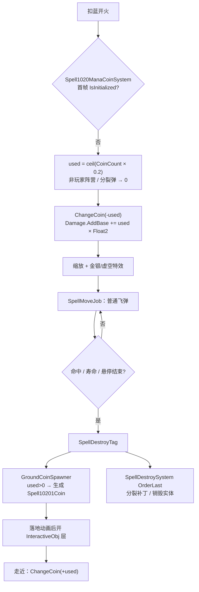

# 注魔硬币（Spell1020 / ManaCoin）逆向分析

> 范围：仅玩家主动法术「注魔硬币」（`abilityType = 1020`，配置 ID `10201`）。同预制体落地金币也会被财富药水 / 房间重建借用，第 10 节只点名。怪物侧把 `ManaCoin` 列入可捕捉或可反射名单，各自是独立脚本，不在本文范围。
> 方法：`SpellConfig.json` + 反编译 `Assembly-CSharp` 交叉验证。未标注「推测」的结论均有代码/数据直接证据。
> 主路径：玩家施法走 **ECS**。扣金加伤在 `Spell1020ManaCoinSystem`；位移走通用 `SpellMoveJob.Normal_*`；销毁当帧 `Spell1020GroundCoinSpawnerSystem` 在落地位置生成 `Spell10201Coin`；拾取在 `PlayerControllerSystem`。Mono `Spell1020ManaCoin` 为残留轨，第 9 节单独对照。
> 配套：总览见《魔法工艺法术系统逆向报告.md》，原始数值见《法术数值总表.md》。离线可开见 `注魔硬币逆向分析.html`。
> 第 7 节对当前已有独立逆向文档的 21 张增强符文做了逐一校验。本文修正了《分裂逆向分析.md》第 10 节把补丁写成「抄活体 `CoinUseCount`、`BuffRatio`」的不完整表述。

---

## 1. 身份与定位

| 项 | 值 |
| --- | --- |
| 中文名 | 注魔硬币 |
| 英文名 | Enchanting Coin |
| `abilityType` | `1020` / `SpellAbilityType.ManaCoin` |
| 配置 ID | `10201`（**只有 Lv1**） |
| 文案 ID | 名 `7010201` / 机制 `7110201` / 风味 `7210201` / 短评 `7310201` |
| 稀有度 | 特殊（`dropType=4` / `ItemDropType.Special`） |
| `useType` | `0`（Missile 主动飞弹） |
| `needActivate` | **false**（开局就进掉落池，见 `BattleData` L250–260） |
| 槽位 / 蓝耗 | `slotCost=1`；`mpCost=20`（`shootCount=1`，不均摊） |
| 表伤 | `damage=60`（开火后再加金币加算，见 3.2） |
| 弹道 | `speed=18`、`duration=2`、`angle=0`、`knockback=5`、`recoil=0` |
| 关键字段 | `float1=20`（文案 / UI / Mono 的扣金百分比）；`float2=6`（每枚金币 +6 基础伤害）；`int1=8`（**死字段**，见 2.2） |
| 预制体 | `prefab="10201"`，图标 `1020` |
| 合成 | **不可合成**（`canCompound=false`，没有 Lv2/Lv3） |
| 售价（金币） | 25 |
| 复杂度 | `CalculateSpellComplexity` 记 **2** 分（与奥爆术、审判之剑、红符、蓝符同档） |
| AI 射程估算 | `speed × duration = 36`（普通飞弹公式） |

**机制一句话**：射出一枚实体飞弹，首帧按**当前金币的 20%**（向上取整）扣钱，每扣 1 枚给这发弹 `Damage.AddBase += 6`；飞 2 秒后走通用寿命 / 悬停 / 销毁。销毁当帧在落点吐出一堆可捡的金币，金额等于刚才扣掉的数。没钱就飞一枚银色空壳，表伤 60，落地不掉钱。



文案（`TextConfig_Spell`）：

- 名称 `7010201`：注魔硬币 / Enchanting Coin
- 机制 `7110201`：> 消耗并射出float1%的金币，每消耗1枚金币法术基础伤害+float2。法术结束时金币会重新掉落
- 风味 `7210201`：> 金钱的力量，只有钱不到位，没有伤害不够（记得捡）。
- 短评 `7310201`：> 消耗金钱提高威力的硬币

机制文案的三句话各自对应一条真机制：扣当前金币的 `float1%`、每枚 +`float2` 基础伤害、结束时掉回地面。**ECS 主路径把第一句的 `float1` 写成了字面量 `0.2f`**，和表值 20 碰巧相等，见 3.1。

---

## 2. 数值结构

### 2.1 配置表原始值（`assets_export/SpellConfig.json`）

| ID | Level | damage | shootCount | mpCost | speed | duration | angle | knockback | float1 | float2 | int1 | 售价 | 可合成 |
| --- | --- | --- | --- | --- | --- | --- | --- | --- | --- | --- | --- | --- | --- |
| 10201 | 1 | **60** | 1 | 20 | 18 | 2 | 0 | 5 | 20 | 6 | 8 | 25 | false |

全表只有这一级。`float3`、`int2/3`、`radius`、`gravity`、`upSpeed`、`summonID`、`recoil`、`criticalChance` 全 0。`isDPS=false`、`isKeepCasting=false`、`isParentTypeSpell=false`、`isSplitSpell=false`、`needActivate=false`、`canCompound=false`。

`haveEffecforMissileSpell` / `haveEffecforSummonSpell` 两个字段都是 **false**——它们只对 `useType=2` 的强化符文有意义，主动法术这两位不被任何逻辑读取。

### 2.2 字段语义

| 字段 | 语义 | 置信度 | 证据 |
| --- | --- | --- | --- |
| **float1 = 20** | 文案 / UI / Mono 的扣金百分比。`used = ceil(金币 × float1 / 100)` | 高（UI/Mono）；ECS **不读** | `CanShootSpellUtils.GetManaCoinDamageRatio_FinalPlayerValue` L49；`Spell1020ManaCoin.cs` L14。ECS 用字面量 `0.2f`（`Spell1020ManaCoinSystem` L226） |
| **float2 = 6** | 每消耗 1 枚金币，`Damage.AddBase += 6` | 高 | `Spell1020ManaCoinSystem` L244；分裂子弹改写成 `AddRatio += Int3 × Float2 / 100`（L241） |
| **int1 = 8** | 配置有值，专属路径与穿透烘焙**全不读** | 高 | `SpellSpawnParamsProcessor` 没有 `ManaCoin` 分支；`GetSpellPenetrateCount` 只累加 `Penetrate` 符文。与高压水流等卡的模板残留同型 |
| float3 / int2 / int3 | 配置恒 0 | 高 | 配置 |
| `Int3`（运行时） | 销毁分裂时写入母弹的 `CoinUseCount` | 高 | `SpellDestroySystem` L547–549 |
| `Float3`（运行时） | 销毁分裂时写入母弹的 `BuffRatio` | 高 | 同上；`BuffRatio` 烘焙后从未再写，恒 0 |
| `haveEffecfor*` | 主动法术不读 | 高 | 仅出现在 `SpellAutoFullTool` 的强化过滤 |

`GameConst.ManaCoinCostPercentage = 0.2f` 和 ECS 字面量 `0.2f`、表 `float1=20` 三者碰巧相等。改表 `float1` 只会改 UI / 机制文案 / Mono，**不会改玩家主路径的扣金比例**。

### 2.3 蓝耗是整发价

`shootCount=1`，`SipToSSP` 的均摊除数是 1，`mpCost=20` 就是这一发的价。齐射把多张可施放卡塞进同一组时，蓝耗另走齐射的 `(float1/100)^(N-1)`，与金币无关。

### 2.4 性价比（裸卡，按当前金币）

表伤 60 是「没钱」时的保底。真正打出去的伤害是

```
(60 + used × 6) × (1 + AddRatio) × MulRatio + Extra
```

`used = ceil(金币 × 0.2)`。几个常用档：

| 当前金币 | used | AddBase | 裸伤 | 伤/蓝 | 每枚金币换伤 |
| --- | --- | --- | --- | --- | --- |
| 0 | 0 | 0 | **60** | 3.00 | — |
| 5 | 1 | 6 | 66 | 3.30 | 6 |
| 25 | 5 | 30 | 90 | 4.50 | 6 |
| 100 | 20 | 120 | **180** | 9.00 | 6 |
| 500 | 100 | 600 | **660** | 33.0 | 6 |

金币是借的：打完会在落点吐回 `used` 枚，捡回来就回本。没捡到才是真消耗。蓝耗固定 20，金币越多，每点蓝的效率越高。

---

## 3. 核心机制：扣金加伤

### 3.1 ECS 首帧只跑一次

`Spell1020ManaCoinSystem` 在 `SpacialSpellSystemGroup`，查询所有带 `Spell1020ManaCoinData` 的实体。`IsInitialized` 为假才进账：

```220:261:decompiled/Assembly-CSharp/Spell1020ManaCoinSystem.cs
			if (uncheckedRefRW.ValueRO.IsInitialized)
			{
				continue;
			}
			uncheckedRefRW.ValueRW.IsInitialized = true;
			uncheckedRefRW3.ValueRW.Scale = SpellTools.CallulateSpellScaleByDamage(__query_895942107_1.GetSingleton<SpellSingleton>().Configs[uncheckedRefRW2.ValueRO.Id].damage, uncheckedRefRW2.ValueRO.Damage.Calculate()) + InternalCompilerInterface.GetComponentAfterCompletingDependency(ref __TypeHandle.__SpellNeedResize_RO_ComponentLookup, ref base.CheckedStateRef, entity2).ExtraSizeRatio;
			int num = Mathf.CeilToInt((float)PlayerMgr.Inst.CoinCount * 0.2f);
			if (InternalCompilerInterface.HasComponentAfterCompletingDependency(ref __TypeHandle.__UnitProperty_Dots_RO_ComponentLookup, ref base.CheckedStateRef, uncheckedRefRW4.ValueRW.OwnerEntity))
			{
				if (!DTool.IsSameCamp(InternalCompilerInterface.GetComponentRWAfterCompletingDependency(ref __TypeHandle.__UnitProperty_Dots_RW_ComponentLookup, ref base.CheckedStateRef, uncheckedRefRW4.ValueRW.OwnerEntity).ValueRW.unitCfg.unitType, UnitType.Player))
				{
					num = 0;
				}
			}
			else
			{
				num = 0;
			}
			if (uncheckedRefRW4.ValueRW.IsSplitSpell)
			{
				num = 0;
				uncheckedRefRW2.ValueRW.Damage.AddRatio += (float)uncheckedRefRW2.ValueRO.Int3 * uncheckedRefRW2.ValueRO.Float2 / 100f;
			}
			PlayerMgr.Inst.ChangeCoin(-num);
			uncheckedRefRW2.ValueRW.Damage.AddBase += (float)num * uncheckedRefRW2.ValueRO.Float2;
			// ... 特效颜色 ...
			uncheckedRefRW.ValueRW.CoinUseCount = num;
```

六个要点：

1. **扣金比例写死 `0.2f`**，不读 `config.Float1`。
2. **只有玩家阵营扣钱。** 主人没有 `UnitProperty_Dots`，或阵营不是 Player，`num = 0`。
3. **分裂弹不扣钱**，改走 `AddRatio`，见 5.3。
4. `ChangeCoin(-num)` 立刻改 `PlayerMgr.Inst.CoinCount`。同一帧里若有多枚未初始化的硬币（一组里多张注魔硬币、或同帧多发），**后处理的实体看到的是已经被前面扣过的余额**。
5. 加伤是 `AddBase`，不是改 `Base`。命中时 `AttributeValue.Calculate()` = `(Base + AddBase) × (1 + AddRatio) × MulRatio + Extra`，所以伤害强化 / 节能模式的比率**会放大金币买来的那截加算**。
6. 缩放用的是「加金之后」的 `Damage.Calculate()` 对表伤 60 开三次方根，见 6.1。注意：这段 `Scale =` 写在 `AddBase` **之前**。首帧先按「还没加金」的伤害算一次缩放，加金发生在后面。`SpellResizeSystem` 之后还会按最新伤害再写一次 Scale——实机体型跟的是加金后的值。若某一帧命中发生在 Resize 之前，碰撞盒可能偏小一帧。标为待决。

### 3.2 伤害公式（ECS / UI 一致，Mono 不一致）

ECS 命中：

```
used     = ceil(当前金币 × 0.2)          // 分裂 / 非玩家 = 0
最终伤害 = (60 + used × 6) × (1+AddRatio) × MulRatio + Extra
```

UI 面板（`SlotData` L366–370）走另一条看起来像百分比的函数，最后却加回了同一笔加算：

```42:50:decompiled/Assembly-CSharp/CanShootSpellUtils.cs
	public static float GetManaCoinDamageRatio_FinalPlayerValue(SpellConfig spell, int totalCoinCount)
	{
		if (spell.abilityType != SpellAbilityType.ManaCoin)
		{
			Debug.LogError("不是金币弹不要调用这个方法！");
			return 0f;
		}
		return spell.float2 * (float)Mathf.CeilToInt((float)totalCoinCount * spell.float1 / 100f) / 100f;
	}
```

`GetManaCoinDamageRatio × 100 = float2 × used`。`SlotData` 把它 `AddBase` 进已经算过强化的 `GetSpellDamage`。对原版 `float1=20`、`float2=6`，UI 显示的伤害和 ECS 打出去的数对得上。

Mono 残留轨把同一个 ratio 当成**乘数**：

```
damage = ceil(表伤 × (1 + ratio) × damageRatio × finalDamageRatio) + extra
```

100 金时 Mono 是 `60 × 2.2 = 132`，ECS / UI 是 `60 + 120 = 180`。玩家主路径以 ECS 为准。

面板上那一行 `1002006`（通用「额外描述」文案）写的是 `ratio × 100`，100 金时显示 `120`。它看起来像百分比，对应的是 `used × float2` 这笔加算，不是 `×120%`。

### 3.3 没钱 / 非玩家：银色空壳

`num <= 0` 且运行时 `Int3 <= 0` 时，特效走银币：

- 硬币预制 `1020_Coin_Silver`
- 玩家颜色被改写成 `"Silver"`，光环 `1020_Ring_Silver`
- 虚空染色优先：`ColorType == Void` 时强制 `1020_Coin_Void`，不看金币

分裂子弹带着母弹的 `Int3 = CoinUseCount`，即使自己 `num = 0` 也保持金色。

### 3.4 状态组件

`Spell1020ManaCoinData` 三个字段：

| 字段 | 烘焙 | 运行时 |
| --- | --- | --- |
| `IsInitialized` | false | 首帧置 true，之后空转 |
| `CoinUseCount` | 0 | 写成本次 `num`；销毁时抄到分裂快照 `Int3` |
| `BuffRatio` | 0 | **从未再写**。销毁时抄到 `Float3`，子弹 init **不读** `Float3` |

Baker 还挂了 `GroundCoinsBuffer`（`IsInitialized` / `CoinAmount` / `Position` / `SourceEntity`）。全工程只有 Baker `AddBuffer`，没有任何 System 读写——**死缓冲**。落地金币走的是另一套 `Spell10201Coin` 实体。

---

## 4. 弹道：普通飞弹

注魔硬币**没有** `SpellMoveJob` 专属 case，也没有 `SpellSpawnParamsProcessor` 专属烘焙。运动类型只由强化符文决定：

| `SpellSpecialMovementType` | 由谁写入 | 硬币走哪个函数 |
| --- | --- | --- |
| `Normal`（默认） | 无运动符文 | `Normal_Common`：直线，`velocity = Direction × Speed` |
| `ChaseEnemy` | 自动导航 3011 | `Normal_ChaseTarget` |
| `ChaseMouse` | 寻踪 3010 | `Normal_Mouse` |
| `ChaseOwner` | 自我追踪 3114 | `Normal_ChaseTarget`（目标换成主人） |
| `Rotation` | 公转 3009 / 自由公转 | `Normal_Rotation` |
| 任意 + 坠落 | 坠落 3119 | `Normal_Fall`（落地圆，见《坠落逆向分析.md》） |

寿命走 `SpellSystem.UpdateDuration` 的通用 4.1：`DurationTimer` 到 `Duration.Calculate()`（默认 2 秒）后 `Speed = 0`，再走 `HoverTimer`；没有悬停就销毁（或缩圈）。硬币不在 `UpdateDuration` 的短路名单里（激光 / 高压水流 / 奥术屏障那一串）。

墙体、反弹、穿透全部走通用通道：

- 自带穿透 = 0（`int1=8` 不进 `Penetrate.Base`）
- 穿透符文 3006 的 `int1` 进 `Penetrate.Extra`
- 默认打中一个目标就销毁，然后落地吐钱

AI 射程：`18 × 2 = 36`，在「免修正名单」里（`SpellGroupAttackDistanceCalculator` L157），不乘任何特殊系数。

---

## 5. 落地金币与拾取

### 5.1 谁在什么时候生成

`Spell1020GroundCoinSpawnerSystem` 在 `SpellEndSystemGroup`（**不是** `OrderLast`）。`SpellDestroySystem` 同组且 `OrderLast = true`。销毁当帧顺序：

1. Spawner 看见 `SpellDestroyTag + Spell1020ManaCoinData + LocalTransform`
2. `CoinUseCount > 0` 才生成；否则跳过（空壳、分裂弹、非玩家弹都不掉）
3. 位置先做 Theme6 / 第三章捷径房间的矩形钳制，再 `GetNavMeshPointIngoreZ`
4. `QuickCreateSystem.CreateMixedEtt("Spell10201Coin", startPoint)`，写入 `coinCount` 和 `belongRoomMapPos`
5. 然后 `SpellDestroySystem` 才做分裂补丁、销毁母弹

所以：**钱掉在母弹销毁点，分裂发生在吐钱之后。** 子弹不会再吐一份。

第三章窄廊（`Theme6_Chapter3` / `Theme22_Chapter3_Shortcut1`）会把落点夹进房间矩形往里缩 1 米，避免金币掉出可走区域。Mono `DropCoin` 有同一套钳制。

### 5.2 落地实体 `Spell10201Coin`

这不是法术实体，是可交互掉落物。`Spell10201CoinSystem`（`ISystem`，Burst）负责：

| 条件 | 表现 |
| --- | --- |
| `needFlyHigh` | 动画 `Play(1)`，否则 `Play(0)`。硬币自己的生成路径不置这个位，走普通落地 |
| `coinCount > 50` | 打开 `ett_MR100` |
| `> 20` | `ett_MR50` |
| `> 10` | `ett_MR20` |
| 其余 | `ett_MR5` |
| 动画事件 `intParam == 0` | 碰撞盒改到 `Layer_InteractiveObj`（`33554432`），播 `SE_ItemDrop_Base` |
| `onPick` | `DestroyEntity` |

没播完落地动画之前碰撞盒不在交互层，捡不到。

### 5.3 拾取

`PlayerControllerSystem` 用玩家 `interactiveRadius` 做 `OverlapSphere`。碰到 `Spell10201Coin` 且尚未 `onPick`：

- 飘字 `"+" + coinCount`（`UITextFloatType.GetCoin`）
- `PlayerMgr.Inst.ChangeCoin(+coinCount)`
- `SEMgr.Inst.itemPick_Coin` + `EF_ItemPickup`
- `onPick = true`，下一帧 System 销毁实体

**不走** `ResourceAbilityType.Coin` 那条。捡普通地上的钱会滚 `curseCfg_GetCoinLoseHP`（捡钱掉血诅咒）；捡注魔硬币吐出来的堆**不会**。

### 5.4 房间归属

`belongRoomMapPos` 记下生成时所在房间。切房间再回来时，`PlayerItemController` 会按这个坐标把还在的 `Spell10201Coin` 重新 `CreateMixedEtt` 一份（位置加一个 0.5 随机偏移），金额原样保留。没捡的钱不会因为切房蒸发。

财富药水溢出（`Potion_Fortune`，金币 ≥ 5000 的余数）也会生成同一套 `Spell10201Coin`。那是药水的掉落，不是这张卡的生命周期，第 10 节点名。

### 5.5 分裂补丁：抄的是计数，用的是另一套公式

`SpellDestroySystem` 在 `ToSplit` 之后：

```547:549:decompiled/Assembly-CSharp/SpellDestroySystem.cs
			case SpellAbilityType.ManaCoin:
				elem.ConfigComponentData.Int3 = ...CoinUseCount;
				elem.ConfigComponentData.Float3 = ...BuffRatio;
```

子弹带着 `IsSplitSpell = true` 进 `Spell1020ManaCoinSystem`：

- `num = 0`，不扣钱、不写 `CoinUseCount`、落地 Spawner 直接跳过
- `Damage.AddRatio += Int3 × Float2 / 100`

母弹 100 金、`used = 20` 时：

| | 伤害（忽略其它强化） |
| --- | --- |
| 母弹 | `(60 + 120) = 180`，然后 `ToSplit` ×0.33 → 快照里已是 **59.4** |
| 子弹再加 | `AddRatio += 20 × 6 / 100 = 1.2` → `59.4 × (1 + 1.2) = 130.68` |

母弹的金币加算已经在被复印的 `Damage` 里，子弹又按同一笔 `used` 加了一层 120% 比率。这是**双重计算**，不是「子弹继承母弹最终伤害」。`BuffRatio` / `Float3` 全程空转。

《分裂逆向分析.md》第 10 节原写作「抄活体 `CoinUseCount`、`BuffRatio`」，已按本节回写。

---

## 6. 外观与缩放

### 6.1 体型跟伤害走

```1727:1735:decompiled/Assembly-CSharp/SpellTools.cs
	public static float CallulateSpellScaleByDamage(float originDamage, float finalDamage)
	{
		float x = 0f;
		if (originDamage >= 0f && finalDamage >= 0f)
		{
			x = math.pow(finalDamage / originDamage, 0.3333f);
		}
		return math.max(x, 0.1f);
	}
```

原点是表伤 60。100 金裸弹最终 180，缩放 `3^0.3333 ≈ 1.44`。0 金时为 1。虚胖法术的 `ExtraSizeRatio` 加在这个值外面。

Mono `UpdateSizeByDamageAndVolumeRatio` 用 `(damageRatio × finalDamageRatio)^0.3333`，**不含金币加算**，体型几乎不变。又一条 ECS / Mono 分叉。

### 6.2 特效

`CreateCoinEffects` 给法术实体挂两个子物体：硬币 `1020_Coin_{Gold|Silver|Void}`，光环 `1020_Ring_{颜色}`。再往 `SpellEffectSystem.Require` 推 1020 号特效表。

Mono `Spell1020Effect` 用 `usedCoin` 在金币 / 银币 / 虚空贴图和银色命中、银色坠落爆炸之间切换。ECS 主路径不走这个 Mono 组件。

---

## 7. 增强符文 × 注魔硬币 逐一校验矩阵

对当前已有独立逆向文档的 21 张增强符文逐条核对「原文档结论」与「注魔硬币实际走到的代码分支」。

| # | 符文 | abilityType | 原文档结论对硬币是否成立 | 硬币实际分支 | 判定 |
| --- | --- | --- | --- | --- | --- |
| 1 | 自动导航 | 3011 FollowTarget | ✓ 成立 | `ChaseEnemy` → `Normal_ChaseTarget`；扣金加伤不看运动类型 | 一致（7.1） |
| 2 | 加速器 | 3106 EnhanceSpeedValue | ✓ 成立 | `Speed.AddBase`；航程 `v × 2s` 变长，扣金不变 | 一致（7.2） |
| 3 | 范围增强 | 3107 EnhanceRadiusRatio | ✓ 成立 | `radius=0`；非坠落几乎无用，坠落落地圆才吃 | 一致（7.3） |
| 4 | 时长强化 | 3103 EnhanceDurationValue | ✓ 成立 | `Duration.AddBase`；只延长命中窗口，不改扣金 | 一致（7.4） |
| 5 | 悬停 | 3008 SpellHover | ✓ 成立 | 通用 4.1 原地锁死；吐钱推迟到悬停结束 | 一致（7.5） |
| 6 | 反弹 | 3012 Rebound | ✓ 成立 | 通用墙撞反射；`ReboundAddTime` 拉长寿命 | 一致 |
| 7 | 坠落 | 3119 Fall | ✓ 成立 | `Normal_Fall`；仍首帧扣金，落地销毁才吐钱 | 一致（7.6） |
| 8 | 精准施法 | 3105 EnhanceCriticalChance | ✓ 成立 | `angle` 底数已是 0；只加暴击 | 一致（7.7） |
| 9 | 齐射 | 3001 Volley | ✓ 成立，补一句金币 | 不复制卡；组里**每张**注魔硬币各自扣一次 20% | 一致（7.8） |
| 10 | 伤害强化 | 3102 EnhanceAttackRatio | ✓ 成立，且更赚 | `AddRatio` 连 `used × 6` 一起乘 | 一致（7.9） |
| 11 | 节能模式 | 3104 PowerSavingMode | ✓ 成立 | `MulRatio` 连金币加算一起砍；时长折扣只缩窗口 | 一致（7.9） |
| 12 | 分裂 | 3013 SpellSplit | ⚠ **不完整** | 母弹先吐钱再裂；子弹不扣金、再叠一层 `AddRatio` | **已回写**（5.3 / 7.10） |
| 13 | 寒霜晶石 | 3014 Frozen | ✓ 成立 | 每个 Enter 各自 `SetFrozen`；`shootCount=1` 无只数倍增 | 一致 |
| 14 | 毒液晶石 | 3005 VenomCrystal | ✓ 成立 | 每个 Enter 叠 `int2` 层 | 一致 |
| 15 | 粘液晶石 | 3004 MucusCrystal | ✓ 成立 | 减的是被命中单位 | 一致 |
| 16 | 闪电链 | 3007 LightningChain | ✓ 成立 | 不在排除名单；命中是链源 | 一致 |
| 17 | 雷霆晶石 | 3101 ThunderCrystal | ✓ 成立 | 销毁落雷不排除 1020；寿命 / 命中 / 坠落销毁都会落 | 一致 |
| 18 | 奥术屏障 | 4012 Umbrella | ✓ 成立 | 伞不飞；`GetUnusedSlotsAndType` 返回空 | 一致 |
| 19 | 蓄力模式 | 4004 ChargeMode | ✓ 成立 | `IsChargingSpell()` 只认 1026/1027 | 一致 |
| 20 | 强制冷却 | 4006 ForceCoolDown | ✓ 成立 | 法杖层，不进发射包 | 一致 |
| 21 | 储魔之匣 | 4002 EmptyContainer | ✓ 成立 | 法杖层，不进发射包 | 一致 |

穿透 3006 尚未单独成文：`GetSpellPenetrateCount` 只累加 `Penetrate` 的 `int1`（1/2/4）进 `Penetrate.Extra`。硬币自己的 `int1=8` 不参与。默认一发打一个目标。

公转 3009 / 寻踪 3010 / 自我追踪 3114 / 多重施法 3002 / 超载散射 3003 尚无独立逆向文档，只在必要处引用。

### 7.1 自动导航（3011）：普通追敌，不改经济

`GetSpellMovementType` 写成 `ChaseEnemy` 之后，`SpellMoveJob` 没有 `ManaCoin` case，落到 `Normal_ChaseTarget`。扣金、加伤、吐钱都不读 `movement.Type`。导航只改「飞向谁」，不改「扣多少钱」。

### 7.2 加速器（3106）：飞得更远，钱数不变

`Speed` 进线速度。默认 2 秒窗口内航程近似线性变长。`used` 在首帧就钉死，加速既不让你多扣，也不让你少扣。AI 射程 `speed × duration` **会**吃加速器。

### 7.3 范围增强（3107）：非坠落几乎无用

配置 `radius=0`。非坠落命中靠预制体碰撞盒。坠落落地圆才吃范围增强（与《范围增强逆向分析.md》《坠落逆向分析.md》同一条链路）。体型主要由 6.1 的伤害缩放决定，不靠 `radius`。

### 7.4 时长强化（3103）：只买命中窗口

`GetSpellDuration` 对 `EnhanceDurationValue` 做 `AddBase(float1)`。硬币读 `Duration.Calculate()`，2 / 4 / 8 秒只延长「还能撞到谁」。钱在第 0 帧已经扣完，加时长不会多扣，也不会多吐。

对一次性飞弹，这和《时长强化逆向分析.md》的通用结论一致：时长只延长命中窗口。

### 7.5 悬停（3008）：吐钱推迟

`HoverDuration` 累加 `float1`（2/3/5）。飞行段结束 `Speed = 0`，原地锁死，等 `HoverTimer` 走完才挂 `DestroyTag`。Spawner 看见 DestroyTag 才吐钱，所以悬停 = 晚一点才能捡。专属逻辑不读 `HoverDuration`。

### 7.6 坠落（3119）：先扣金，落地再吐

没有 `ManaCoin` 的坠落特化。`IsFallSpell` 走 `Normal_Fall`。首帧照常扣金加伤；落地销毁走同一条 Spawner。Mono `OnFallingGround` 会播坠落爆炸并 `MakeFallingGroundDamageToAround`，ECS 落地伤走通用坠落通道。

### 7.7 精准施法（3105）：散射已经是 0

裸卡 `angle=0`。精准施法的 `angle` 负数钳到 0，改不了出手方向。暴击按通用 `criticalChance/100` 加算，硬币自己没有自带暴击。

### 7.8 齐射（3001）：不复制这张卡，但组里每张硬币各扣一次

齐射加的是「一组能塞几张可施放」，不是把注魔硬币复制成 N 发（《齐射逆向分析.md》第 1 节）。`[齐射][硬币]` 仍然只有一发。

若一组里塞了**两张**注魔硬币，`Spell1020ManaCoinSystem` 同一帧按实体顺序各算一次：

| 顺序 | 当时金币 | used | 该发裸伤 | 余额 |
| --- | --- | --- | --- | --- |
| 第 1 张 | 100 | 20 | 180 | 80 |
| 第 2 张 | 80 | 16 | 156 | 64 |

总扣 36，落地两堆。不是「两发都按 100 的 20%」。多重施法 3002（跨帧再射）同理：后一发看见的是前一发扣完的余额。

### 7.9 伤害强化（3102）与节能模式（3104）：比率吃到金币加算

`Calculate = (60 + used×6) × (1+AddRatio) × MulRatio`。

| 槽位（100 金） | 公式 | 伤害 |
| --- | --- | --- |
| `[硬币]` | 60+120 | **180** |
| `[伤Lv1 +25%] [硬币]` | 180 × 1.25 | **225** |
| `[伤Lv3 +100%] [硬币]` | 180 × 2 | **360** |
| `[节Lv1 ×0.75] [硬币]` | 180 × 0.75 | **135** |
| `[伤Lv3] [节Lv1] [硬币]` | 180 × 2 × 0.75 | **270** |

金币买的 +120 会被伤害强化放大、被节能模式打折。节能的 `Duration.MulRatio` 只缩命中窗口，不改 `used`。硬币 `isDPS=false`，效率比走一次性飞弹那档：`0.75/0.60 = 1.25`（Lv1 划算），与《节能模式逆向分析.md》一致。

### 7.10 分裂（3013）：母弹吐钱，子弹再吃一层比率

见 5.3。要点：

1. Spawner 先于 `SpellDestroySystem`，母弹销毁点吐 `used` 枚，只吐一次。
2. 子弹 `IsSplitSpell`，不扣钱、不吐钱。
3. 子弹在已经 ×0.33 的伤害上再 `AddRatio += used × 0.06`。
4. `BuffRatio` 是死字段。

悬停 + 分裂：吐钱和分裂都推迟到悬停结束，两者仍是先吐再裂。

### 7.11 尚未独立成文、但会改写运动或发数的卡

| 符文 | 效果 | 硬币走到的函数 |
| --- | --- | --- |
| 公转 3009 | `Type = Rotation`；`float1` 进 `Duration.Extra` | `Normal_Rotation`；扣金不变 |
| 寻踪 3010 | `Type = ChaseMouse` | `Normal_Mouse` |
| 自我追踪 3114 | `Type = ChaseOwner` | `Normal_ChaseTarget`（追自己） |
| 超载散射 3003 | `angle` 进同一散射池 | 裸卡 `angle=0`，这张才让出手散开 |
| 多重施法 3002 | 多次扣蓝开火 | 每发独立扣 20% **当时**余额 |

---

## 8. 数值算例

以下只算数量级，用来对照面板和手感。强化按单张、玩家静止、60 金 / 100 金两档。

### 8.1 裸卡

| 金币 | used | 裸伤 | 缩放 | 落地堆 |
| --- | --- | --- | --- | --- |
| 0 | 0 | 60 | 1.00（银色） | 无 |
| 60 | 12 | 132 | ≈1.30 | +12 |
| 100 | 20 | 180 | ≈1.44 | +20 |
| 200 | 40 | 300 | ≈1.71 | +40 |

飞行最多 2 秒，速度 18，直线航程 36。默认无穿透，撞第一个敌人就销毁、就地吐钱。

### 8.2 伤害强化把金币加算一起乘

100 金：

- `[伤Lv3] [硬币]`：`(60+120)×2 = 360`
- 同一笔 +120，无伤强时贡献 120，有伤强时贡献 240

没钱时伤强只放大 60：`60×2 = 120`。**越有钱，伤害强化越值。**

### 8.3 一组两张硬币（齐射容量或两张卡）

100 金，两发同帧初始化：20 + 16 = 36 枚，伤害 180 与 156，落地两堆。总期望 336，比「一张 180」高，但第二发吃的是折扣后的余额。

### 8.4 分裂 Lv1（3 发子弹）

100 金，母弹打出 180 后销毁：

- 落地 +20
- 每发子弹：`180 × 0.33 × (1 + 1.2) = 130.68`
- 3 发全中：`392`，外加母弹已经打出去的 180

子弹不再耗金。这是「一笔钱打母弹 + 打裂片」的结构，不是「每发再扣 20%」。

---

## 9. Mono 残留轨对照

`Spell1020ManaCoin` 仍可能被旧路径或非 ECS 生成走到。

| 项 | ECS（玩家主路径） | Mono |
| --- | --- | --- |
| 扣金比例 | 字面量 `0.2f` | `spellCfg.float1 / 100` |
| 加伤 | `Damage.AddBase += used × Float2` | `表伤 × (1 + float2×used/100) × 一堆比率` |
| 100 金裸伤 | **180** | **132** |
| 缩放 | `(最终伤/60)^0.3333`（含金币） | `(damageRatio×finalDamageRatio)^0.3333`（**不含金币**） |
| 非玩家 | `num = 0` | 根本不进 `ChangeCoin` 分支，`usedCoin` 保持 0 |
| 落地 | ECS `Spell10201Coin` | Mono `Spell1020CoinOnGround`（对象池 `10201CoinOnGround`） |
| 落地阈值 | `>50 / >20 / >10` | 预制体 `coinTheshhold[]` 数组，未从资源核对 |
| 寿命 / 悬停 / 缩圈 | 通用 4.1 | 自己 `Update`：到点停、悬停、再 `tsf_Layer` 每秒缩 5 |
| 银色贴图 | `1020_Coin_Silver` 等 | `Spell1020Effect` 切 `SilverSprite` / 银色 Hit / 银色坠落爆炸 |
| 分裂 | `AddRatio += Int3×Float2/100` | 未见对等分支 |

Mono 落地堆进 `PlayerMgr.Inst.manaCoinList`，交互走 `InteractiveObj.Interact`。ECS 落地堆不进这个 List。

---

## 10. 怪物侧与借用（不展开）

`Monster17` / `Monster17_Hat` / `Monster39_Sword` / `Elite6` 把 `ManaCoin` 列入可捕捉或可反射的能力类型名单。它们用的是各自的脚本，不走 `Spell1020ManaCoinSystem` 的玩家扣金。非玩家阵营在 ECS 里会被强制 `num = 0`。

`Potion_Fortune` 在金币 ≥ 5000 时把余数打成一枚 `Spell10201Coin`（`needFlyHigh` 仍默认 false）。`PlayerItemController` 的房间重建会复制当前房间尚未捡走的 `Spell10201Coin`。这两处共用落地预制，不是这张卡的开火循环。

`WorldData` 有一段 NPC 对话条件：图鉴里解锁过「特殊法术、且不是 `ManaCoin`」。只解锁注魔硬币，这段对话不会开。`SpecialObj8_T6TongueCluster` 抽特殊法术时 `exceptID=10201`，会避开这张卡。

---

## 11. 与构筑相关的行为摘要

| 行为 | 结果 |
| --- | --- |
| 裸放、身上有钱 | 首帧扣 20%，每枚 +6 基础伤，2 秒直线，打中或到期后原地吐回 |
| 裸放、没钱 | 银色 60 伤空壳，不掉钱 |
| 插伤害强化 | 连 `used×6` 一起乘；钱越多越值 |
| 插节能模式 | 连金币加算一起 ×0.75 / 0.75 / 0.80；蓝耗打折，窗口缩短 |
| 插时长 / 悬停 | 只推迟销毁和吐钱，不改扣金 |
| 插加速器 | 飞得更远；AI 射程跟着涨 |
| 插自动导航 | 普通追敌；经济不变 |
| 插精准施法 | 散射已是 0，只加暴击 |
| 插齐射 | 不复制这张卡；组里每张硬币各扣一次当时余额的 20% |
| 插多重施法 | 每发独立再扣 20% 当时余额 |
| 插分裂 | 母弹吐钱；子弹不扣金，再吃一层 `used×6%` 的 `AddRatio` |
| 插坠落 | 先扣金，落地再吐 |
| 插穿透 | 才能在销毁前打多个目标；自带 `int1=8` 不是穿透 |
| 插雷霆 / 闪电链 / 元素晶石 | 走通用命中与销毁，不在排除名单 |
| 蓄力 / 强制冷却 / 储魔之匣 / 奥术屏障 | 法杖层或伞不飞 |
| 捡回落地堆 | 回本；**不触发**捡钱掉血诅咒 |
| 切房再回来 | 没捡的堆按 `belongRoomMapPos` 重建 |

---

## 12. 证据索引

| 命题 | 位置 |
| --- | --- |
| 配置原始值 | `SpellConfig.json` `10201` |
| 文案 | `TextConfig_Spell` `7010201` / `7110201` / `7210201` / `7310201` |
| `abilityType = 1020` | `SpellAbilityType.cs` L23 |
| ECS 扣金 / 加伤 / 特效 | `Spell1020ManaCoinSystem.cs` L220–309 |
| 状态三字段 | `Spell1020ManaCoinData.cs` |
| Baker + 死缓冲 | `Spell1020ManaCoinAuthoring.cs` L11–18；`GroundCoinsBuffer.cs` |
| UI 比率函数 | `CanShootSpellUtils.cs` L42–50 |
| UI 面板加算 | `SlotData.cs` L256–257、L366–370 |
| 伤害 `Calculate` | `AttributeValue.cs` L24–27 |
| 缩放 | `SpellTools.cs` L1727–1735 |
| 复杂度 2 | `SpellTools.cs` L3015–3020 |
| AI 射程 `v×t` | `SpellGroupAttackDistanceCalculator.cs` L157、L247–249 |
| 运动类型只看强化 | `SpellShootDataExtend.cs` L99–116 |
| 寿命 / 悬停 4.1 | `SpellSystem.cs` L266–307 |
| 穿透只吃符文 | `SpellShootData.cs` L383–395；`SpellSpawnParamsProcessor` 无 1020 分支 |
| 分裂抄 Int3 / Float3 | `SpellDestroySystem.cs` L547–549 |
| 落地生成 | `Spell1020GroundCoinSpawnerSystem.cs` L168–203 |
| 落地表现 / 销毁 | `Spell10201CoinSystem.cs` L278–328；`Spell10201Coin.cs` |
| 拾取 | `PlayerControllerSystem.cs` L278–289 |
| 交互层 | `GameConst.cs` L52（`Layer_InteractiveObj`） |
| 房间重建 | `PlayerItemController.cs` L2794–2810 |
| 常量 0.2 | `GameConst.cs` L651（`ManaCoinCostPercentage`）；System 用的是字面量 |
| 开局进池 | `BattleData.cs` L250–260（`needActivate=false`） |
| 对话排除只解锁硬币 | `WorldData.cs` L505 |
| 舌头簇避开 10201 | `SpecialObj8_T6TongueCluster.cs` L246 |
| Mono 扣金加伤 | `Spell1020ManaCoin.cs` L8–21、L68–104 |
| Mono 银色特效 | `Spell1020Effect.cs` |
| Mono 地面堆 | `Spell1020CoinOnGround.cs` |
| 财富药水借用预制 | `Potion_Fortune.cs` L39–45 |
| 怪物名单 | `Monster17.cs` L62；`Monster17_Hat.cs` L25；`Monster39_Sword.cs` L113；`Elite6.cs` L142 |

---

## 13. 待决 / 局限

1. **首帧 Scale 写在 AddBase 之前。** `Spell1020ManaCoinSystem` L225 用的是还没加金的 `Damage.Calculate()`。`SpellResizeSystem` 之后会按新伤害重写。同一帧若已经结算命中，碰撞盒可能偏小一帧。未做系统组时间线核对。
2. **`float1` 与字面量 `0.2f` 是否曾经解耦。** 现版本三者相等。若旧版改过表、或 Mod 改 `float1`，UI 和实伤会分叉。没有旧表对照。
3. **`BuffRatio` 的历史含义。** 字段还在、分裂还在抄、谁都不读。推测是废弃的「金币伤害倍率」残留，与 Mono 那条 `×(1+ratio)` 同源，未证实。
4. **`GroundCoinsBuffer` / `int1=8`。** 死缓冲和死字段，历史用途不明。
5. **落地阈值 `>50 / >20 / >10` 与 Mono `coinTheshhold[]` 是否同一套。** ECS 写死在 System 里；Mono 读预制体数组。未从资源核对数组内容。
6. **公转 3009 / 寻踪 3010 / 自我追踪 3114 / 多重施法 3002 / 超载散射 3003 / 穿透 3006 尚无独立逆向文档。** 本文只在必要处引用。飞弹侧后续文档铺开时应回补。
7. **一组多张硬币的实体遍历顺序。** `foreach` 顺序决定谁先扣金。未验证 Entity 排序是否稳定。
8. **捡堆是否触发其它「获得金币」遗物。** 确认了不走 `ResourceAbilityType.Coin`、不滚捡钱掉血诅咒。其它监听 `ChangeCoin` 的遗物会不会吃到这次加钱，要看各遗物是钩 `ChangeCoin` 还是钩资源拾取，未逐条核对。
9. **系统组帧序。** `Spell1020ManaCoinSystem` 在 `SpacialSpellSystemGroup`，寿命在 `SpellSystem`，Spawner 在 `SpellEndSystemGroup`（先于 `OrderLast` 的 Destroy）。「开火当帧能否命中」和「销毁当帧子弹是否已看见 Int3」按代码顺序应该成立，未做时间线实测。
