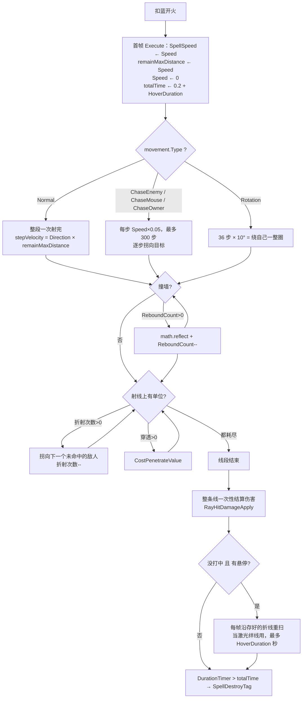

# 激光（Spell1004 / Laser）逆向分析

> 范围：仅玩家主动法术「激光」（`abilityType = 1004`，配置 ID `10041–10043`）。**棱镜核心 / 激光束**（`LaserBeam = 4014`）是完全不同的持续 DPS 机制，只在第 10 节做一次差异对照，不展开。怪物侧的 `Boss*Laser` / `Elite*Laser` / `Monster*Laser` 均为独立脚本，不在本文范围。
> 方法：`SpellConfig.json` + 反编译 `Assembly-CSharp` 交叉验证。未标注「推测」的结论均有代码/数据直接证据。
> 主路径：玩家施法走 **ECS**（`Spell1004LaserSystem` + `Spell1004LaserJob`）。Mono `Spell1004Laser` 为残留轨，第 9 节单独对照。
> 配套：总览见《魔法工艺法术系统逆向报告.md》，原始数值见《法术数值总表.md》。离线可开见 `激光逆向分析.html`。
> 本文修正了既有文档的 **1 处事实错误**（《雷霆晶石逆向分析.md》把 `LaserBeam` 的 ID 写成 1004，进而得出「激光不落雷」的错误结论），并解决了《法术能力类型字段语义表.xlsx》里 1004 行标注为 `unknown` 的 `float1` / `float2`。第 7 节对已逆向的 21 张增强符文做了逐一校验。

---

## 1. 身份与定位

| 项 | 值 |
| --- | --- |
| 中文名 | 激光 |
| 英文名 | Laser |
| `abilityType` | `1004` / `SpellAbilityType.Laser` |
| 配置 ID | `10041`（Lv1）/ `10042`（Lv2）/ `10043`（Lv3） |
| 文案 ID | 名 `701004x` / 机制 `711004x`（**Lv1 为空**，Lv2/3 讲折射）/ 风味 `7210041` / 短评 `7310041` |
| 稀有度 | 普通（`dropType=1`） |
| `useType` | `0`（Missile 主动飞弹） |
| 槽位 / 蓝耗 | `slotCost=1`；`mpCost` = 2 / 3 / 4（`shootCount=1`，不均摊） |
| 伤害 | `damage` = 8 / 11 / 15 |
| 自带暴击率 | `criticalChance` = **0 / 25 / 50**（`criticalDamageMultiplier = 2`） |
| 折射次数 | `int1` = **0 / 1 / 2** |
| 射线 | `speed=15`（**是长度，不是速度**，见 2.3）、`duration=0`、`angle=0`、`knockback=0.5` |
| 法杖层加成 | `shootIntervalAddSubRevise=-0.05`、`coolDownAddSubRevise=-0.1`（每张各自累加） |
| 死字段 | `float1=4`、`float2=2`（**全工程无引用**，见 2.2） |
| 预制体 | 三级共用 `prefab="10041"`，图标 `1004` |
| 合成 | Lv1→Lv2→Lv3（`canCompound`：Lv1/2=`true`，Lv3=`false`） |
| 售价（金币） | 8 / 24 / 72 |
| 复杂度 | `CalculateSpellComplexity` 记 3 分（与滚球、蝴蝶、霰弹同档） |

**机制一句话**：开火当帧一次性把整条折线算完（hitscan），`speed` 是这条折线的**总长度预算**；线上所有异阵营目标同帧各吃一次伤害；实体本身只作为一个存活 **0.2 秒**的表现载体，随后销毁。Lv2/3 把「穿透」变成「折射」——撞到单位后不再穿过去，而是拐向下一个没打过的敌人。



文案（`TextConfig_Spell`）：

- 名称 `7010041–7010043`：激光 / Laser（三级同名）
- 机制 `7110041`：**空字符串**（Lv1 不解释任何机制）
- 机制 `7110042` / `7110043`：> 法术穿透+int1，法术穿透会变为折射效果
- 风味 `7210041`：> 将魔力集中在一点并笔直施放，在这霓虹般的光芒下法杖也愿意更快施放法术。\升级后会获得折射能力。
- 短评 `7310041`：> 瞬间完成攻击的激光射线

三段文案各自对应一条真机制，而且都能在代码里落地：「笔直施放」= `angle=0`（散射底数为 0，见 7.2）；「法杖也愿意更快施放法术」= `shootIntervalAddSubRevise` / `coolDownAddSubRevise` 两个法杖层字段（见 2.5）；「瞬间完成攻击」= hitscan（见第 3 节）。只有 `7110042` 那句「穿透**会变为**折射」与 ECS 实装不符——ECS 是「穿透**又能当**折射」，见 5.3。

---

## 2. 数值结构

### 2.1 配置表原始值（`assets_export/SpellConfig.json`）

| ID | Level | damage | mpCost | criticalChance | int1 | speed | duration | angle | knockback | float1 | float2 | 射速间隔 | CD | 售价 | 可合成 |
| --- | --- | --- | --- | --- | --- | --- | --- | --- | --- | --- | --- | --- | --- | --- | --- |
| 10041 | 1 | **8** | 2 | **0** | **0** | 15 | 0 | 0 | 0.5 | 4 | 2 | −0.05 | −0.1 | 8 | true |
| 10042 | 2 | **11** | 3 | **25** | **1** | 15 | 0 | 0 | 0.5 | 4 | 2 | −0.05 | −0.1 | 24 | true |
| 10043 | 3 | **15** | 4 | **50** | **2** | 15 | 0 | 0 | 0.5 | 4 | 2 | −0.05 | −0.1 | 72 | false |

规律：升级只动三样——`damage`、`criticalChance`、`int1`。`speed` / `duration` / `angle` / `knockback` / `float1` / `float2` / 两个法杖层字段三级完全不变，`float3`、`int2/3`、`radius`、`gravity`、`upSpeed`、`summonID` 全 0。`isDPS=false`、`isKeepCasting=false`、`isParentTypeSpell=false`、`isSplitSpell=false`、`needActivate=false`、`shootCount=1`。

**注意 `isKeepCasting=false`。** 激光不是持续施法法术，也不在 `GetMaxKeepCastSpellDuration` 的名单里（分解射线 / 高压水枪 / 龙息 / 冲刺 才在）。玩家体感上「按住不放连发激光」来自射速间隔 −0.05 与 CD −0.1，不是按住锁。

`haveEffecforMissileSpell` / `haveEffecforSummonSpell` 两个字段都是 **false**——它们只对 `useType=2` 的强化符文有意义，主动法术这两位不被任何逻辑读取。

### 2.2 字段语义

| 字段 | 语义 | 置信度 | 证据 |
| --- | --- | --- | --- |
| **speed = 15** | **折线总长度预算**，不是速度。首帧 `remainMaxDistance = Speed` 后立刻 `Speed = 0` | 高 | `Spell1004LaserJob` L198–210 |
| **duration = 0** | 不被读取。寿命是 Job 内硬编码的 `0.2 + HoverDuration` | 高 | 同上 L211；`SpellSystem` L275–310 短路 |
| **int1 = 0/1/2** | 折射次数底数，与穿透相加 | 高 | `HaveRefractionCheck` L1225–1240；文案 `7110042` |
| **criticalChance = 0/25/50** | 自带暴击率（百分数）；`criticalDamageMultiplier = 2` | 高 | 配置；`GameConst` L227 |
| **angle = 0** | 散射锥角底数为 0 → 裸激光完全笔直 | 高 | `SpellShootData.GetSpellScatter` |
| **knockback = 0.5** | 击退，与蝴蝶同为全表偏低档 | 高 | 配置 |
| `shootIntervalAddSubRevise = −0.05` | 每张激光让整杖射速间隔 −0.05s，**多张累加** | 高 | `Wand` L595–596；`WandConfig.GetExtraShootInterval` L631–648 |
| `coolDownAddSubRevise = −0.1` | 每张激光让整杖 CD −0.1s，**多张累加** | 高 | 同上；`WandConfig.GetExtraCoolDown` L650–668 |
| **float1 = 4** | **死字段。** 全工程无任何读取点 | 高 | 见下 |
| **float2 = 2** | **死字段。** 同上 | 高 | 见下 |
| float3 / int2 / int3 / radius / gravity / upSpeed | 恒 0，无引用 | 高 | 配置 + 全工程检索 |

**`float1` / `float2` 是死字段的论证。** 《法术能力类型字段语义表.xlsx》1004 行原本把这两个字段标为 `unknown(配置4)` / `unknown(配置2)`。检索确认：

1. 读 `config.Float1` / `config.Float2` 的位置全部在**按 `abilityType` 分派的专属系统**里（`Spell1003ButterFlySystem`、`Spell9021SlowDownBulletJob`、`Spell1029DimensionTravellerSystem`、`Spell4014LaserCrystalJob` 等），以及两处显式判型的通用代码（`UnitPropertyJob` L275 判 `Bullet`、`SpellTools` L2770 判 `Rollball`）。没有一处会落到 1004。
2. 激光自己的三个系统 `Spell1004LaserJob` / `Spell1004LaserSystem` / `Spell1004LaserLineApplySystem` 完全不出现 `Float1` / `Float2`。
3. Mono 侧 `Spell1004Laser` 也不读 `spellCfg.float1` / `spellCfg.float2`——它的射线长度与寿命来自**预制体序列化字段** `maxLength` / `duration`（L39、L37），与配置表无关。

即这两个数是配置表里的历史残留。**推测**（无证据）：`float2 = 2` 可能是早期版本的寿命秒数，`float1 = 4` 可能是早期的射线长度，后来分别被 Job 里的 `0.2f` 与 `speed` 取代。这条推测不影响任何结论。

### 2.3 `speed` 是长度，不是速度

这是理解激光的第一个关键点。首帧初始化只做四件事，其中两件与 `Speed` 有关：

```198:211:decompiled/Assembly-CSharp/Spell1004LaserJob.cs
			data.SpellSpeed = valueRW.Speed;
			lineBuffer.Insert(0, new LaserBodyPoint
			{
				Value = valueRW4.Position
			});
			NativeList<float> heightList = new NativeList<float>(Allocator.Temp);
			float num = data.SpellSpeed * 0.05f;
			float3 stepVelocity = float3.zero;
			float3 stepDirection = valueRW.Direction;
			float3 normalStepPos = default(float3);
			float remainMaxDistance = valueRW.Speed;
			float3 @float = valueRW.Direction;
			valueRW.Speed = 0f;
			data.totalTime = 0.2f + valueRW2.HoverDuration;
```

- `remainMaxDistance = Speed`：这一发激光**总共能延伸多少距离**。默认 15 个单位。
- `num = SpellSpeed × 0.05`：曲线模式下的**单步长度**。默认 0.75。
- `Speed = 0`：实体从此不再移动。它只是个挂着 `LineRenderer` 的壳。

`Normal` 模式下更极端——单步长度直接就是全部剩余预算：

```972:977:decompiled/Assembly-CSharp/Spell1004LaserJob.cs
	private void StraightGoLinePosStep(ref float3 stepVelocity, ref float3 normalStepPos, in float3 fromPos, in SpellMovementComponentData movement, float remainMaxDistance)
	{
		stepVelocity = movement.Direction * remainMaxDistance;
		normalStepPos = fromPos + stepVelocity;
	}
```

**所以裸激光 = 一条长 15 的单次射线检测。** while 循环只在「撞墙反弹」或「折射」把线掰弯时才会跑第二轮。

由此推出加速器（3106）在激光身上的真实作用：**线性延长射程**，而不是「更快」。

| 槽位 | `Speed` | 射线总长 | 曲线模式单步 | 曲线模式段数 |
| --- | --- | --- | --- | --- |
| `[激光]` | 15 | **15** | 0.75 | 20 |
| `[加Lv1(+3)] [激光]` | 18 | **18** | 0.90 | 20 |
| `[加Lv2(+6)] [激光]` | 21 | **21** | 1.05 | 20 |
| `[加Lv3(+12)] [激光]` | 27 | **27** | 1.35 | 20 |
| `[加Lv3]×2 [激光]` | 39 | **39** | 1.95 | 20 |

段数恒为 20 是因为预算与步长同比放大（`Speed / (Speed × 0.05) = 20`）。这个不变量有个副作用：曲线模式下**每步的最大转角 = `ChaseRotateSpeed × Speed × 0.05`，会随加速器一起变大**，所以加速器让追踪型激光拐得更急，见 7.1。

### 2.4 AI 射程估算比实装多 5

```255:257:decompiled/Assembly-CSharp/SpellGroupAttackDistanceCalculator.cs
				case SpellAbilityType.Laser:
					num2 = 5f + spellMoveSpeed_FinalPlayerValue.Result;
					break;
```

估算值 `5 + 15 = 20`，实装长度 15。这个 `5f` 是 Mono 时代预制体 `maxLength` 的遗留——Mono 的 `_remainDistance = maxLength + spellCfg.speed`（L113），ECS 改成只用 `speed` 后没有同步改估算式。影响面仅限自动施法法杖 / 队友 AI 的开火距离判断（会稍微偏远），不影响玩家手动施法。激光同时在 `IsSpellNeedTargetDistance` 的返回 `false` 名单里（L142–153）。

### 2.5 蓝耗与每级性价比

`shootCount = 1`，所以 `SipToSSP` 那句「整发蓝耗除以最终只数」对激光是除以 1，`mpCost` 就是单发价。

把自带暴击算进去（暴击 ×2，即期望倍率 `1 + 暴击率`）：

| Level | damage | 暴击率 | 期望伤害 | 蓝耗 | 期望伤害/蓝 | 折射次数 | 售价 |
| --- | --- | --- | --- | --- | --- | --- | --- |
| 1 | 8 | 0% | **8.0** | 2 | 4.00 | 0 | 8 |
| 2 | 11 | 25% | **13.75** | 3 | 4.58 | 1 | 24 |
| 3 | 15 | 50% | **22.5** | 4 | 5.63 | 2 | 72 |

只看 `damage` 的话 Lv1→Lv3 才 1.88 倍，效率几乎没长；把暴击算进去是 2.81 倍，再加上折射带来的额外命中数，实际收益远高于面板。**激光的升级买的是暴击率和折射，不是伤害。**

对比：`criticalChance > 0` 的主动法术共 13 个，激光 Lv3 的 50% 处于偏高档但不是最高（滚球 Lv3 80%、火球 Lv3 80%、冲刺 70%）。激光的特殊之处是**只有它把暴击率写成随等级递增**（滚球 30/50/80 同样递增，其余多为三级恒定）。

---

## 3. 核心机制：一帧成线的 hitscan

### 3.1 首帧算完，之后只是个空壳

`Spell1004LaserJob.Execute` 的整个几何生成与伤害结算都包在 `if (!data.IsInitialize)` 里，跑完就把标志置真，此后**永不再进**：

```633:651:decompiled/Assembly-CSharp/Spell1004LaserJob.cs
			data.IsLaserHit = hitList.Length > 0;
			if (data.IsLaserHit)
			{
				data.totalTime = 0.2f;
			}
			RayHitGlobalEffect(in hitDataList, in valueRW2, chunkIndex);
			RayHitDamageApply(in hitList, in hitDataList, entity, in valueRW2, in valueRW, in valueRW4, in elementEffect, in valueRW3, chunkIndex);
			foreach (float3 item in touchGList)
			{
				float3 touchGroundPos = item;
				TouchGroundExplosion(in valueRW2, in spellAspect, in valueRW3, in valueRW, in elementEffect, in touchGroundPos, chunkIndex);
			}
			HitNodeEffectApply(ref effNodeList, in valueRW2, chunkIndex);
			data.IsInitialize = true;
			data.IsSetLinePos = true;
			valueRW4.Position = new Vector3(lineBuffer[0].Value.x, lineBuffer[0].Value.y, -0.3f);
			valueRW.Gravity = 0f;
			valueRW.CurrentFallSpeed = 0f;
```

四个要点：

1. **伤害是同帧一次性结算的**，不存在「激光扫过去」的过程。`hitList` 里每个实体各收一份 `TakeDamageInfo_Dots`。
2. **`hitList` 去重**。`CheckHitEnemyByStepVelocity` 里 `if (!hitList.Contains(...))` 才 Add，所以同一个实体在一发激光里**最多吃一次伤害**——反弹折回来打到同一个人不会二次结算。
3. **实体位置被搬到折线末端**（`lineBuffer[0]` 是最后插入的点，因为全程 `Insert(0, ...)`）。这决定了雷霆晶石的落雷圈心在射线尖端，不在玩家脚下，见 7.10。
4. **命中任何东西会把寿命压回 0.2 秒**（`IsLaserHit → totalTime = 0.2f`），覆盖掉悬停给的加时。悬停对激光只在「打空」时有意义，见 7.4。

状态存在一个七字段组件上，Authoring 烘焙时全默认值（`default(Spell1004LaserData)`），另挂一个 `LaserBodyPoint` 动态缓冲当折线容器：

```9:14:decompiled/Assembly-CSharp/Spell1004LaserAuthoring.cs
			Entity entity = GetEntity(TransformUsageFlags.Dynamic);
			Spell1004LaserData component = default(Spell1004LaserData);
			AddComponent(entity, in component);
			AddBuffer<LaserBodyPoint>(entity);
```

因为初值全是 `false` / `0`，**任何由这个预制体生成的新实体都会从头跑一遍完整的线生成**——包括分裂子弹（见 7.5）。

### 3.2 寿命：硬编码 0.2 秒，`duration` 完全不参与

激光被 `SpellSystem.UpdateDuration` 的正常分支显式排除：

```275:283:decompiled/Assembly-CSharp/SpellSystem.cs
			if (!spell.Movement.ValueRO.IsFallSpell)
			{
				SpellAbilityType abilityType = spell.Config.ValueRO.AbilityType;
				if (abilityType != SpellAbilityType.Laser && abilityType != SpellAbilityType.RuneHammer && abilityType != SpellAbilityType.LaserBeam && abilityType != SpellAbilityType.BiAnLethalBlade && abilityType != SpellAbilityType.Umbrella && abilityType != SpellAbilityType.HighPressureWasher && abilityType != SpellAbilityType.DaveHarpoons)
				{
					if (valueRW.DurationTimer < valueRW.Duration.Calculate())
					{
						valueRW.DurationTimer += DeltaTime;
						return;
					}
```

短路后只剩最后一句 `valueRW.DurationTimer += DeltaTime;`（L310），即**只累加计时器，永不因 `Duration` 用尽而销毁**。销毁改由激光自己判：

```672:677:decompiled/Assembly-CSharp/Spell1004LaserJob.cs
		if (valueRW2.DurationTimer > data.totalTime)
		{
			CMD.SetComponentEnabled<SpellDestroyTag>(chunkIndex, entity, value: true);
			SetBubbleVFX(in lineBuffer, in valueRW2, chunkIndex);
			valueRW4.Position = lineBuffer[0].Value;
		}
```

| 情况 | `totalTime` | 实际存活 |
| --- | --- | --- |
| 打中了任何目标 | `0.2` | 0.2 s |
| 打空，无悬停 | `0.2 + 0 = 0.2` | 0.2 s |
| 打空，`[悬Lv1]` | `0.2 + 2 = 2.2` | 最多 2.2 s（中途绊到人则提前 0.1 s 结束） |
| 打空，`[悬Lv3]` | `0.2 + 5 = 5.2` | 最多 5.2 s |

**时长强化（3103）对激光的寿命完全无效**，这一点《时长强化逆向分析.md》5.1 / 5.4 已有正确记载。要延长激光只有悬停一条路。

### 3.3 命中判定：收 4 类目标，脆弱物与蝴蝶免费穿过

单位检测走 `SpellTools.GetAttackablesInRaycast`（`containsBrittleness: true`），再按 `HitType` 过滤：

```704:723:decompiled/Assembly-CSharp/Spell1004LaserJob.cs
	private bool RaycastCastHit(float3 startOnLine, float3 endOnLine, UnitType shooterType, out NativeList<(Unity.Physics.RaycastHit, SpellTools.HitType)> hitList)
	{
		hitList = default(NativeList<(Unity.Physics.RaycastHit, SpellTools.HitType)>);
		if (SpellTools.GetAttackablesInRaycast(in startOnLine, in endOnLine, in shooterType, containsBrittleness: true, in UnitPropertyLookup, in SpellConfigLookup, in PhysicsWorld, out var hitList2))
		{
			hitList = new NativeList<(Unity.Physics.RaycastHit, SpellTools.HitType)>(Allocator.Temp);
			foreach (Unity.Physics.RaycastHit item in hitList2)
			{
				Entity target = item.Entity;
				SpellTools.HitType entityHitType = SpellTools.GetEntityHitType(in target, in shooterType, in UnitPropertyLookup, in SpellConfigLookup);
				if ((uint)(entityHitType - 3) <= 3u)
				{
					(Unity.Physics.RaycastHit, SpellTools.HitType) value = (item, entityHitType);
					hitList.Add(in value);
				}
			}
			return true;
		}
		return false;
	}
```

`(uint)(t - 3) <= 3u` 就是 `t ∈ {3,4,5,6}`，对照 `SpellTools.HitType` 枚举（L18–27）= `Unit` / `Brittleness` / `RollBall` / `Butterfly`。`Unknown` / `SameCamp` / `IgnoreSpell` 被丢掉，所以**己方阵营与己方法术不会被自己的激光打到**。

命中处理里有一条容易漏的分支：

```865:868:decompiled/Assembly-CSharp/Spell1004LaserJob.cs
				if (hitList2[i].Item2 == SpellTools.HitType.Brittleness || hitList2[i].Item2 == SpellTools.HitType.Butterfly)
				{
					continue;
				}
```

**脆弱物与敌方蝴蝶照常吃伤害（前面已进 `hitList`），但既不消耗折射、也不消耗穿透、更不会终止射线。** 激光穿过一片箱子/敌方蝴蝶群时是完全免费的，只有 `Unit` 和 `RollBall` 会消耗次数。这和滚球需要扣血条、蝴蝶碰到就碎的模型都不同。

按距离排序后逐个处理，`Fraction` 排序器保证「先近后远」：

```850:856:decompiled/Assembly-CSharp/Spell1004LaserJob.cs
			hitList2.Sort<(Unity.Physics.RaycastHit, SpellTools.HitType), RaycastEntityHitDistanceComparer>(default(RaycastEntityHitDistanceComparer));
			for (int i = 0; i < hitList2.Length; i++)
			{
				if (hitList2[i].Item1.Fraction <= 0.0001f && hitDataList.Length > 0)
				{
					continue;
				}
```

零距离命中只在「已经打中过别人」时才跳过，所以**贴脸开火（目标碰撞体已经包住枪口）仍然算命中**。

### 3.4 System 执行顺序

| System | 所属组 | 频率 | 职责 |
| --- | --- | --- | --- |
| `Spell1004LaserSystem`（含 `Spell1004LaserJob`） | `SpacialSpellSystemGroup` ⊂ `SpellSimulationSystemGroup` | 每渲染帧 1 次 | 结构变更 + 线生成 + 伤害 + 销毁判定 |
| `Spell1004LaserLineApplySystem` | `SpellEffectSystemGroup` | 每渲染帧 1 次 | 把折线灌进 `LineRenderer`，纯表现 |
| `SpellSystem.UpdateDuration` | — | 每渲染帧 1 次 | 只给激光累加 `DurationTimer` |

**激光完全不进 `SpellPhysicsSystemGroup`。** `SpellMoveJob` 里没有 Laser 分支，`Speed=0` 也让通用位移无事可做。这就是《反弹逆向分析.md》4.8、《坠落逆向分析.md》4.10、《自动导航逆向分析.md》第 6 节都把激光列为「跳过通用路径」的原因。

`Spell1004LaserSystem.OnUpdate` 在调度 Job **之前**先做一次主线程结构变更，这是 Lv2+ 折射的准备工作：

```164:182:decompiled/Assembly-CSharp/Spell1004LaserSystem.cs
		EntityManager entityManager = state.EntityManager;
		EntityQuery _query_769558242_ = __query_769558242_0;
		using NativeArray<Entity> nativeArray = _query_769558242_.ToEntityArray(Allocator.Temp);
		using NativeArray<SpellConfigComponentData> nativeArray2 = _query_769558242_.ToComponentDataArray<SpellConfigComponentData>(Allocator.Temp);
		for (int i = 0; i < nativeArray.Length; i++)
		{
			if (nativeArray2[i].Level > 1)
			{
				entityManager.AddBuffer<SpellRefractionHitEntities>(nativeArray[i]);
				if (!entityManager.HasComponent<SpellRefractionData>(nativeArray[i]))
				{
					entityManager.AddComponentData(nativeArray[i], new SpellRefractionData
					{
						RemainCount = 0
					});
				}
			}
		}
```

查询是 `WithAll<Spell1004LaserData, SpellConfigComponentData>().WithNone<SpellRefractionHitEntities>()`（L212–216），加完 buffer 就自动退出查询，所以每个实体只处理一次。**关键：`Level > 1` 才加。** Lv1 激光拿不到 `SpellRefractionData`，`HaveRefractionCheck` 必然返回 false。

### 3.5 表现层：折线宽度曲线

`Spell1004LaserLineApplySystem` 在 `IsSetLinePos` 为真的那一帧把 `LaserBodyPoint` 缓冲整份灌进两个 `LineRenderer`（本体 + 阴影），然后交给 `Spell1004LaserCustomCtrl` 跑宽度动画：前 0.1 s 张开、中段保持、末 0.2 s 收拢（L21–38）。销毁时 `SetBubbleVFX` 沿折线每 0.1 单位撒一个粒子点进 `Spell1004LaserTrailBED` 缓冲（L680–702）。**全部不影响任何数值。**

---

## 4. 五种运动类型 = 五套线生成器

`movement.Type` 决定用哪套几何。激光是全表少数**五种类型全都有专属实现**的法术（对比蝴蝶只有 `Normal` / `ChaseMouse` 两个专属分支）。每种还再分「非坠落 / 坠落」两套，共 10 条路径。

| `SpellSpecialMovementType` | 由谁写入 | 非坠落几何 | 段数 |
| --- | --- | --- | --- |
| `Normal`（默认） | — | 单次全长直线 | 1（+反弹/折射额外段） |
| `Rotation` | 公转 `AroundOwner` 3009 | **绕自己一整圈** | 36 |
| `ChaseEnemy` | 自动导航 `FollowTarget` 3011 | 逐步拐向最小夹角敌人 | ≤20 |
| `ChaseMouse` | 寻踪 `AroundMouse` 3010 | 逐步拐向鼠标 | ≤20 |
| `ChaseOwner` | 自我追踪 3114 | 逆时针绕回施法者 | ≤20 |

四种非 `Normal` 类型的循环都带同一个死循环护栏：

```424:430:decompiled/Assembly-CSharp/Spell1004LaserJob.cs
				while (remainMaxDistance > 0.01f)
				{
					num2++;
					if (num2 > 300)
					{
						break;
					}
```

### 4.1 `Rotation`（公转）：一整圈，且不受长度预算约束

```302:321:decompiled/Assembly-CSharp/Spell1004LaserJob.cs
				for (int num6 = 0; num6 < 36; num6++)
				{
					RotationGoLinePosStep(ref stepVelocity, ref normalStepPos, lineBuffer[0].Value, ref stepDirection, ref valueRW);
					bool lineEnd2 = false;
					LaserBodyPoint laserBodyPoint = lineBuffer[0];
					CheckHitEnemyByStepVelocity(in laserBodyPoint.Value, ref normalStepPos, ref valueRW2, in spellAspect.Entity, ref hitList, ref hitDataList, ref lineEnd2, ref stepVelocity, ref stepDirection, ref count, ref effNodeList, out var isPreEnded);
```

`RotationGoLinePosStep` 默认 `angleSpeed = 10f`（L1053），36 步 × 10° = **360°**。循环是 `for (36)` 而不是 `while (remainMaxDistance > 0)`，**长度预算在这条路径上被完全忽略**——公转激光的几何只由公转半径决定，加速器不改它的形状。

另外这条路径**不做墙壁检测**（只调 `CheckHitEnemyByStepVelocity`，没有 `CheckHitWallStep`），所以公转激光穿墙。这与《反弹逆向分析.md》L188「公转或无视墙壁挂上后普通弹的墙弹基本失效」的结论方向一致。

### 4.2 `ChaseEnemy`（自动导航）：把射线掰成弧

```1063:1078:decompiled/Assembly-CSharp/Spell1004LaserJob.cs
	private void ChaseEnemyLinePosStep(ref float3 stepVelocity, ref float3 normalStepPos, ref float3 stepDirection, float3 prevPos, float orgStepLength, in float remainMaxDistance, ref SpellMovementComponentData movement, in SpellConfigComponentData config, in bool hasTarget, in float3 targetPos)
	{
		if (hasTarget)
		{
			float3 source = movement.Direction;
			float3 target = DTool.IgnoreZDir(in targetPos, in prevPos);
			stepDirection = DTool.DirMoveTowardsIgnoreZ(in source, in target, movement.ChaseRotateSpeed * orgStepLength);
			stepVelocity = stepDirection * orgStepLength;
			normalStepPos = prevPos + stepVelocity;
		}
		else
		{
			StraightGoLinePosStep(ref stepVelocity, ref normalStepPos, in prevPos, in movement, remainMaxDistance);
		}
	}
```

每步转角上限 = `ChaseRotateSpeed × orgStepLength`（度），`orgStepLength = Speed × 0.05`。**无目标时直接退化成全长直线**（`else` 分支），这也是为什么房间清空后自动导航激光看起来又变直了。

目标由 `GetValidChaseEnemyPosition`（L1138–1161）提供：先复用 `movement.ChaseTarget`，失效才 `FindMinAngleTarget` 重锁。和蝴蝶一样是**最小夹角、不是最近**，而且激光只在首帧取一次目标——整条弧线朝同一个点弯。

### 4.3 `ChaseMouse`（寻踪）：带收敛提前退出

```522:530:decompiled/Assembly-CSharp/Spell1004LaserJob.cs
					ref float3 mousePosition = ref PlayerCtrller.mousePosition;
					LaserBodyPoint laserBodyPoint = lineBuffer[0];
					float3 end = DTool.IgnoreZDir(in mousePosition, in laserBodyPoint.Value);
					float t = math.clamp(valueRW.ChaseMouseLerpSpeed * data.SpellSpeed * 0.08f, 0f, 1f);
					@float = math.lerp(@float, end, t);
					if (math.length(@float) < 0.2f && math.length(lineBuffer[0].Value - PlayerCtrller.mousePosition) < 0.5f)
					{
						break;
					}
```

插值系数含 `SpellSpeed` 因子并被 `clamp` 到 1。特有的是那个提前 `break`：**折线走到鼠标附近 0.5 单位内且方向矢量已经缩短到 0.2 以下就停止延伸**，剩下的长度预算直接作废。所以寻踪激光的实际射程是「到鼠标位置为止」，不是 15。

### 4.4 `ChaseOwner`（自我追踪）：逆时针绕回来，步长带 0.6–1.4 倍缩放

```612:617:decompiled/Assembly-CSharp/Spell1004LaserJob.cs
					float3 target = position - lineBuffer[0].Value;
					float lerp = Mathf.Abs(Mathf.Abs(GetDegreeIgnorZ(valueRW.Direction, target)) - 90f) / 90f;
					float3 source = valueRW.Direction;
					DirMoveTowardsCounterClockwise3d(in source, in target, num * valueRW.ChaseRotateSpeed, out stepDirection);
					stepVelocity = stepDirection * DTool.Lerp(0.6f, 1.4f, lerp) * num;
```

`DirMoveTowardsCounterClockwise` 强制单向（逆时针）旋转，配合 `lerp` 系数——与施法者方向夹角接近 90° 时步长压到 0.6×，接近 0°/180° 时放大到 1.4×。净效果是一条绕着玩家的螺旋。

### 4.5 坠落态：另一套完全不同的伤害模型

坠落（3119）下五种类型各有一套抛物线/贝塞尔生成器（`NormalFallLineGenerate` L979–1043、`RotationFallRefraction`、`ChaseEnemy` 的三段贝塞尔 L327–417 等）。共同点是：

**坠落激光沿线不做单位检测。** `NormalFallLineGenerate` 全程只调 `GetFallHeightFixByDistance` / `StraightGoFallGroundStep` / `AddGroundPoint`，**没有任何 `CheckHitEnemyByStepVelocity` 调用**。伤害只来自落点圆：

```1406:1427:decompiled/Assembly-CSharp/Spell1004LaserJob.cs
	private void TouchGroundExplosion(in SpellConfigComponentData config, in SpellAspect spellAspect, in SpellComponentData data, in SpellMovementComponentData movement, in SpellElementEffectComponentData elementEffect, in float3 touchGroundPos, [ChunkIndexInQuery] int chunkIndex)
	{
		config.ColorType.ColorEnumToString(out var result);
		GlobalParticleEmitParams globalParticleEmitParams = default(GlobalParticleEmitParams);
		globalParticleEmitParams.Name = $"3119_Fall_{result}";
		globalParticleEmitParams.Alpha = 1f;
		globalParticleEmitParams.Position = new float3(touchGroundPos.xy, 1.08f);
		globalParticleEmitParams.Size = config.Radius.Calculate();
		GlobalParticleEmitParams element = globalParticleEmitParams;
		CMD.AppendToBuffer(chunkIndex, GlobalParticleSystemBufferEntity, element);
		NativeList<Entity> entities = new NativeList<Entity>(Allocator.Temp);
		float radius = config.Radius.Calculate();
		SpellTools.GetAttackableEntitiesInRange(in touchGroundPos, in radius, in config.ShooterType, containsBrittleness: true, in UnitPropertyLookup, in SpellConfigLookup, in PhysicsWorld, ref entities);
		foreach (Entity item in entities)
		{
			Entity target = item;
			TakeDamageInfo_Dots damage = spellAspect.MakeDamageInfo(costPenetrate: false);
			damage.spell.HitPosition = TransformLookup[target].Position;
			CMD.TryAttackEntity(chunkIndex, in target, in damage, in UnitPropertyLookup, in SpellConfigLookup);
		}
	}
```

半径用的是 `config.Radius.Calculate()`，而激光配置 `radius = 0`。这直接导出 7.3 的结论：**坠落激光的伤害范围强依赖范围增强**。另外坠落态的折射搜敌半径也是同一个 `Radius.Calculate()`（L1000、L1016、L1039 等多处），所以范围增强在坠落激光身上同时管伤害圈和折射搜索圈。

坠落激光也是唯一会调 `TouchGroundExplosion` 的路径——非坠落激光的 `touchGList` 恒空。

---

## 5. 折射：Lv2/3 的真正核心

### 5.1 折射次数从哪来

```1225:1240:decompiled/Assembly-CSharp/Spell1004LaserJob.cs
	private bool HaveRefractionCheck(Entity entity, in SpellConfigComponentData config, out int count)
	{
		if (SpellRefractionLookup.HasComponent(entity))
		{
			count = SpellRefractionLookup.GetRefRO(entity).ValueRO.RemainCount + config.Int1 + config.Penetrate.Calculate();
			return count > 0;
		}
		if (config.Level > 1)
		{
			count = math.max(0, config.Int1 + config.Penetrate.Calculate());
			return count > 0;
		}
		count = 0;
		return false;
	}
```

三个来源相加：

| 来源 | 值 | 说明 |
| --- | --- | --- |
| `SpellRefractionData.RemainCount` | 遗物/其它折射源 | `SpellShootSystem` L362–370 只在 `RemainCount > 0` 时挂；激光 Lv2+ 另由 `Spell1004LaserSystem` 挂一个 `RemainCount=0` 的空壳 |
| `config.Int1` | **0 / 1 / 2** | 激光自己的等级奖励 |
| `config.Penetrate.Calculate()` | 穿透符文 3006 的 `int1` = 1/2/4 每张 | `SpellShootData.GetSpellPenetrateCount` L383–395 |

因为 `Spell1004LaserSystem` 保证 Lv2+ 一定有 `SpellRefractionData`（3.4 节），第一个分支总是命中，第二个分支实际是给「Lv2+ 但组件还没加上」的兜底。**Lv1 激光两个分支都进不去，`count = 0`，永不折射。**

### 5.2 折射优先于穿透

```869:893:decompiled/Assembly-CSharp/Spell1004LaserJob.cs
				if (refractionCount > 0 && hitList2[i].Item2 == SpellTools.HitType.Unit)
				{
					DynamicBuffer<SpellRefractionHitEntities> hitEntities = SpellRefractionHitEntitiesLookup[spellEntity];
					float3 hitPosition = hitList2[i].Item1.Position;
					Entity value = hitList2[i].Item1.Entity;
					if (RefractionDirectionSet(ref stepDirection, in hitPosition, ref config, hitEntities, in value))
					{
						stepVelocity *= hitList2[i].Item1.Fraction;
						normalStepPos = previousPos + stepVelocity;
						refractionCount--;
						isPreEnded = true;
						lineEnd = false;
						break;
					}
				}
				if (config.Penetrate.Calculate() <= 0)
				{
					lineEnd = true;
					isPreEnded = true;
					stepVelocity *= hitList2[i].Item1.Fraction;
					normalStepPos = previousPos + stepVelocity;
					break;
				}
				config.Penetrate.CostPenetrateValue();
```

顺序上折射先试。三个细节：

- **只对 `HitType.Unit` 折射。** 滚球（`RollBall`）走的是下面的穿透分支，脆弱物/蝴蝶前面已 `continue`。
- **折射成功时 `lineEnd = false` 并 `break`**，回到外层 while 用新方向继续射，剩余长度预算不重置——所以折射次数再多也受总长度 15 限制。
- **折射失败（找不到新目标）时会掉进穿透分支。** `RefractionDirectionSet` 返回 false 的条件是 `FindReflectionTarget` 两次都失败（第二次清空忽略集重试，L1118–1128），即场上确实没有别的可打目标。

### 5.3 ECS 没有扣掉穿透，与游戏内文案不符

游戏内 `7110042` / `7110043` 写的是「法术穿透**会变为**折射效果」。Mono 侧确实是这么实现的——转换后把穿透清零：

```97:102:decompiled/Assembly-CSharp/Spell1004Laser.cs
		base.remainRefractCount += base.spellCfg.int1;
		if (base.spellCfg.level > 1)
		{
			base.remainRefractCount += base.penetrateTime;
			base.penetrateTime = 0;
		}
```

而 ECS 的 `HaveRefractionCheck` **只做加法，不清零**。`config.Penetrate` 在整个折射过程中从未被 `CostPenetrateValue()`（折射分支 `break` 在扣穿透那两行之前）。净效果是**同一份穿透被用了两遍**：

| 槽位 | 折射次数 | 折射用尽后还剩的穿透 | 单位命中数上限 |
| --- | --- | --- | --- |
| `[激光Lv1]` | 0 | 0 | 1 |
| `[激光Lv3]` | 2 | 0 | 3 |
| `[穿透Lv1(+1)] [激光Lv1]` | 0 | 1 | 2 |
| `[穿透Lv1(+1)] [激光Lv3]` | `2+1=3` | **1** | **5** |
| `[穿透Lv3(+4)] [激光Lv3]` | `2+4=6` | **4** | **11** |
| `[穿透Lv3]×2 [激光Lv3]` | `2+8=10` | **8** | **19** |

对照 Mono 的口径，`[穿透Lv3] [激光Lv3]` 应该是 6 次折射、0 次穿透，上限 7 次命中；ECS 实装是 11 次。

**这是本文最重要的一条待回写结论，但它没有对应的既有文档**（穿透 3006 与折射机制都还没有单独逆向），所以只在本文和第 12 节记录。判定为**疑似实装偏差**而非有意设计，理由是 Mono 与文案两边口径一致、只有 ECS 这一处不同。是否为刻意的平衡性改动需要实机验证或开发者确认。

### 5.4 折射目标选择：粘住已打过的，找不到就清空重试

```1101:1136:decompiled/Assembly-CSharp/Spell1004LaserJob.cs
	private bool RefractionDirectionSet(ref float3 stepDirection, in float3 hitPosition, ref SpellConfigComponentData config, DynamicBuffer<SpellRefractionHitEntities> hitEntities, in Entity currentHitEntity)
	{
		float3 startPoint = DTool.IgnoreZPosition(in hitPosition);
		hitEntities.Add(new SpellRefractionHitEntities
		{
			Entity = currentHitEntity
		});
		NativeHashSet<Entity> ignoreEntities = new NativeHashSet<Entity>(hitEntities.Length, Allocator.Temp);
		foreach (SpellRefractionHitEntities item in hitEntities)
		{
			ignoreEntities.Add(item.Entity);
		}
		Entity target;
		float3 targetPosition;
		UnitProperty_Dots targetPpt;
		bool flag = CurrentRoomEntities.FindReflectionTarget(startPoint, config.ShooterType, in ignoreEntities, out target, out targetPosition, out targetPpt);
		if (!flag)
		{
			hitEntities.Clear();
			hitEntities.Add(new SpellRefractionHitEntities
			{
				Entity = currentHitEntity
			});
			ignoreEntities.Clear();
			ignoreEntities.Add(currentHitEntity);
			flag = CurrentRoomEntities.FindReflectionTarget(startPoint, config.ShooterType, in ignoreEntities, out target, out targetPosition, out targetPpt);
		}
		if (!flag)
		{
			return false;
		}
		float3 input = math.normalizesafe(targetPosition - hitPosition);
		stepDirection = input.IgnoreZ();
		return true;
	}
```

`SpellRefractionHitEntities` 缓冲累积「这一发已经折射过的目标」，每次搜索都把它们排除。第一次失败会**清空缓冲只留当前目标再搜一次**——这意味着在只有 2 个敌人的房间里，激光可以在两者之间来回折射多次（第二次搜索时前一个目标已不在忽略集里）。但 `hitList.Contains` 的去重（3.1 节要点 2）保证**每个敌人仍然只吃一次伤害**，来回折射只是浪费次数和长度预算。

缓冲在首帧被清空一次（L216–219），所以不会跨发累积。

---

## 6. 墙壁与反弹

墙检测用一个独立的碰撞过滤器，只与墙层相交：

```733:748:decompiled/Assembly-CSharp/Spell1004LaserJob.cs
	private bool RaycastWallHits(float3 start, float3 end, out Unity.Physics.RaycastHit hitResult, in PhysicsWorldSingleton physicsWorld)
	{
		hitResult = default(Unity.Physics.RaycastHit);
		RaycastInput raycastInput = default(RaycastInput);
		raycastInput.Start = start;
		raycastInput.End = end;
		raycastInput.Filter = new CollisionFilter
		{
			BelongsTo = 16777216u,
			CollidesWith = 256u,
			GroupIndex = 0
		};
```

`CollidesWith = 256 = 1 << 8` → 只碰第 8 层。命中后按反弹次数分流：

```817:842:decompiled/Assembly-CSharp/Spell1004LaserJob.cs
	private bool CheckHitWallStep(ref float3 stepVelocity, ref float3 normalStepPos, ref float3 stepDirection, float3 fromPos, ref SpellMovementComponentData movement, ref bool lineEnd, out int wallHitType, out Unity.Physics.RaycastHit wallHit)
	{
		if (movement.IsIgnoreWall)
		{
			wallHitType = 0;
			wallHit = default(Unity.Physics.RaycastHit);
			return false;
		}
		if (CheckHitWallByStepVelocity(in fromPos, ref normalStepPos, ref stepVelocity, out wallHit))
		{
			if (movement.ReboundCount <= 0)
			{
				wallHitType = 1;
				lineEnd = true;
			}
			else
			{
				movement.ReboundCount--;
				wallHitType = 2;
				stepDirection = math.reflect(movement.Direction, wallHit.SurfaceNormal);
			}
			return true;
		}
		wallHitType = 0;
		return false;
	}
```

要点：

- **反弹用的是 Job 自己算的 `math.reflect`**，不是普通弹那套 Unity Physics 碰撞事件（《反弹逆向分析.md》L103 已正确记载这个差别）。
- `IsIgnoreWall` 时**次数不扣**——无视墙壁的激光穿墙且省下所有反弹次数。
- 墙反弹与折射是**两条独立计数**，可以在同一发里各自触发（与《反弹逆向分析.md》L225 一致）。
- 反弹**不重置长度预算**：`stepVelocity *= wallHit.Fraction` 只截断到撞点，剩余预算继续用。所以反弹次数再多也射不出总长 15 之外。
- `Rotation` 路径不调这个函数（4.1 节），公转激光无视墙。

反弹给普通弹的 `Duration.Extra += ReboundAddTime` 对激光**无效**，因为激光不读 `Duration`（3.2 节）。

---

## 7. 增强符文 × 激光 逐一校验矩阵

对已逆向的 21 张增强符文逐条核对「原文档结论」与「激光实际走到的代码分支」。

| # | 符文 | abilityType | 原文档结论对激光是否成立 | 激光实际分支 | 判定 |
| --- | --- | --- | --- | --- | --- |
| 1 | 雷霆晶石 | 3101 ThunderCrystal | ✗ **错误** | `SpellDestroyEventJob` 排除的是 `LaserBeam`(**4014**)，激光 1004 **不在**排除名单，照常落雷 | **需回写**（7.10） |
| 2 | 范围增强 | 3107 EnhanceRadiusRatio | ⚠ **不完整** | 非坠落态确实全程用不到；坠落态是伤害圈+折射圈的唯一来源 | **需回写**（7.3） |
| 3 | 自动导航 | 3011 FollowTarget | ⚠ **不完整** | 激光有专属 `ChaseEnemy` 线生成器，`ChaseRotateSpeed` 决定弧度 | **需回写**（7.1） |
| 4 | 加速器 | 3106 EnhanceSpeedValue | ✓ 成立 | `remainMaxDistance = Speed`，线性延长射程；段数不变、每步转角变大 | 一致（7.2） |
| 5 | 时长强化 | 3103 EnhanceDurationValue | ✓ 成立 | `UpdateDuration` 短路，寿命 `0.2 + HoverDuration` 不读 `Duration` | 一致（7.5） |
| 6 | 悬停 | 3008 SpellHover | ✓ 成立 | 唯一能延长激光的卡，且开启「绊线」重扫 | 一致（7.4） |
| 7 | 反弹 | 3012 Rebound | ✓ 成立 | 自己 `math.reflect` 扣 `ReboundCount`；不加时 | 一致（第 6 节） |
| 8 | 坠落 | 3119 Fall | ⚠ 未展开 | 沿线不检测单位，伤害全靠落点圆 | 一致但可补（7.3） |
| 9 | 精准施法 | 3105 EnhanceCriticalChance | ✓ 成立 | `angle` 池已经是 0；暴击加在自带 0/25/50 之上 | 一致（7.6） |
| 10 | 齐射 | 3001 Volley | ✓ 成立 | `int2 × (N−1)` 把激光从「笔直」变成有散射 | 一致（7.7） |
| 11 | 伤害强化 | 3102 EnhanceAttackRatio | ✓ 成立 | `Damage.AddRatio`；线上每个目标都吃满 | 一致（7.8） |
| 12 | 节能模式 | 3104 PowerSavingMode | ✓ 成立 | `Damage.MulRatio` 生效；`Duration.MulRatio` 对激光是空转 | 一致 |
| 13 | 分裂 | 3013 SpellSplit | ✓ 成立 | 子弹从射线末端重跑完整线生成，长度减半 | 一致（7.9） |
| 14 | 寒霜晶石 | 3014 Frozen | ✓ 成立 | 线上每个目标各自 `SetFrozen`，**目标不同所以不互相挡** | 一致（7.11） |
| 15 | 毒液晶石 | 3005 VenomCrystal | ✓ 成立 | 每个命中目标各叠 `int2` 层，`shootCount=1` 不倍增 | 一致 |
| 16 | 粘液晶石 | 3004 MucusCrystal | ✓ 成立 | 减的是被命中单位 | 一致 |
| 17 | 闪电链 | 3007 LightningChain | ✓ 成立 | 激光不在排除名单；同帧多命中给出多个链源 | 一致 |
| 18 | 奥术屏障 | 4012 Umbrella | ✓ 成立 | 伞不飞；`GetUnusedSlotsAndType` 返回空 | 一致 |
| 19 | 蓄力模式 | 4004 ChargeMode | ✓ 成立 | `IsChargingSpell()` 只认 1026/1027 | 一致 |
| 20 | 强制冷却 | 4006 ForceCoolDown | ✓ 成立 | 法杖层；与激光的 `coolDownAddSubRevise` 先加减再乘 | 一致 |
| 21 | 储魔之匣 | 4002 EmptyContainer | ✓ 成立 | 法杖层，不进发射包 | 一致 |

以下展开非平凡项。

### 7.1 自动导航（3011）：不是「跳过」，而是把射线掰成弧

《自动导航逆向分析.md》第 6 节把激光列在「Init 关掉 `enableFollowTarget`」表里（L225，「自己画线/喷流」）。这对 Mono 侧准确，但会让人以为**自动导航对激光没用**。实际上激光有一整套专属 `ChaseEnemy` 线生成器（4.2 节），并且读的就是自动导航写的那份 `ChaseRotateSpeed`。

每步转角上限 = `ChaseRotateSpeed × Speed × 0.05` 度：

| 槽位 | `ChaseRotateSpeed` | 单步长度 | 每步转角上限 | 20 步累计可转 |
| --- | --- | --- | --- | --- |
| `[导Lv1(12)] [激光]` | 12 | 0.75 | **9°** | 180° |
| `[导Lv2(22)] [激光]` | 22 | 0.75 | **16.5°** | 330° |
| `[导Lv3(38)] [激光]` | 38 | 0.75 | **28.5°** | 570°（早已收敛） |
| `[导Lv1] [加Lv3] [激光]` | 12 | 1.35 | **16.2°** | 324° |

Lv3 只用 1~3 步就把方向拧到目标上，之后基本是直线——视觉上是「从枪口拐一个急弯然后直射敌人」。Lv1 则是一条明显的长弧。

**加速器会放大自动导航在激光上的效果**（每步转角含 `Speed` 因子），这和加速器对蝴蝶「抬高巡航速度」是完全不同的耦合方式。

> 《自动导航逆向分析.md》第 6 节已补一行 ECS 侧说明。

### 7.2 加速器（3106）：唯一的射程来源

见 2.3 的表。补两条非直觉结论：

1. **曲线段数恒为 20**，与加速器档位无关（预算与步长同比放大）。
2. `ChaseMouse` 下加速器基本白给——4.3 节的提前 `break` 让射线到鼠标就停，多出来的预算作废。想给寻踪激光加射程没有意义。

《加速器逆向分析.md》4.6 已正确写出 `remainMaxDistance = Speed` / 步进 `× 0.05` / `Speed = 0`，无需修正。

### 7.3 范围增强（3107）：非坠落全程无用，坠落态是命门

《范围增强逆向分析.md》L202 写「激光 / 分解射线 | 看用法 | 部分折线 / 落地探测用 `Calculate()` | `radius=0` 时这段就是 0」。方向对，但太模糊，而且漏了最要紧的一半。

激光读 `Radius.Calculate()` 的位置共三类：

| 位置 | 用途 | 非坠落 | 坠落 |
| --- | --- | --- | --- |
| `TouchGroundExplosion` L1418 | **落点圆的伤害半径** | 不调用 | **唯一伤害来源** |
| `NormalFallRefraction` / `RotationFallRefraction` L1000/1016/1039/1246 | 折射的搜敌半径 | 不调用 | 决定能否折射 |
| `HitNodeEffectApply` L1086 | 节点粒子大小，`clamp(x, 1, ∞)` | 纯表现 | 纯表现 |

**非坠落激光完全不读半径**（沿线命中走射线检测，与 `Radius` 无关）。所以裸激光配范围增强是纯浪费槽位。

**坠落激光反过来极度依赖它。** 4.5 节已证明坠落态沿线不检测单位，伤害只来自 `GetAttackableEntitiesInRange(touchGroundPos, radius)`，而 `radius = Radius.Calculate()`、激光配置 `radius = 0`。范围增强 `float1` = 30/60/120 走 `AddRatio`，`0 × (1 + 0.3) = 0`——**乘算加在 0 上仍然是 0**。

这就得出一条很强的结论：**`[坠落] [激光]` 在没有其它半径来源的情况下几乎打不出伤害**，落点圆半径为 0，只能命中碰撞体正好包住落点的敌人。

**置信度：中。** 逻辑链本身有代码直接证据，但两点未验证：（a）Unity Physics 的零半径 `OverlapSphere` 对包含该点的碰撞体是否仍返回命中（若返回，则退化为「点命中」而非「完全无伤害」）；（b）坠落符文自身是否通过 `FallRadius` 等其它通道给出一个非零底数——`TouchGroundExplosion` 读的是 `config.Radius` 而非 `FallRadius`，但《蝴蝶逆向分析.md》7.3 提到过 `FallRadius` 的存在。这两点列入第 12 节待决。

> 《范围增强逆向分析.md》L202 的激光行已改写成分坠落/非坠落两栏。

### 7.4 悬停（3008）：唯一的加时卡，还附带一套「激光绊线」

悬停是激光身上收益结构最特殊的一张。它做两件事：

**其一，加时——但只在打空时。** `totalTime = 0.2 + HoverDuration`（L211），而 `IsLaserHit` 会把它压回 0.2（L633–637）。打中就没有悬停。

**其二，开启每帧重扫。** 这段在 `IsInitialize` 块**外面**，所以是持续跑的：

```652:671:decompiled/Assembly-CSharp/Spell1004LaserJob.cs
		if (valueRW2.HoverDuration > 0f && !data.IsLaserHit && !data.IsHoverHit && !valueRW.IsFallSpell)
		{
			NativeList<Entity> hitEntities = new NativeList<Entity>(Allocator.Temp);
			data.IsHoverHit = HoverHitCheck(lineBuffer, valueRW2.ShooterType, ref hitEntities, out var hitUnit);
			foreach (Entity item2 in hitEntities)
			{
				Entity target2 = item2;
				TakeDamageInfo_Dots.NewInfo(entity, CostPenetrate: false, in valueRW2, in valueRW, in valueRW4, in elementEffect, in valueRW3, out var info, CostRefraction: false);
				CMD.TryAttackEntity(chunkIndex, in target2, in info, in UnitPropertyLookup, in SpellConfigLookup);
			}
			if (data.IsHoverHit)
			{
				TakeDamageInfo_Dots.NewInfo(entity, CostPenetrate: false, in valueRW2, in valueRW, in valueRW4, in elementEffect, in valueRW3, out var info2, CostRefraction: false);
				info2.SetKnockbackForceIgnoreZBySpell(hitUnit.Item3);
				info2.spell.HitPosition = hitUnit.Item2;
				CMD.TryAttackEntity(chunkIndex, in hitUnit.Item1, in info2, in UnitPropertyLookup, in SpellConfigLookup);
				data.IsSetLinePos = true;
				data.totalTime = math.max(valueRW2.DurationTimer + 0.1f, 0.2f);
			}
		}
```

四道门：有悬停、首帧没打中、还没绊到人、非坠落。满足时**每帧沿着首帧存下来的那条折线重新做一次射线检测**，等于把激光变成一条留在场上的静态绊线。绊到人时：

- 目标吃一次完整伤害（`CostPenetrate: false`、`CostRefraction: false`——不消耗任何次数）
- 折线被**截断到命中点**（`HoverHitCheck` L901–915 把命中点之前的所有点 `RemoveAt(0)` 掉，再把命中点插到 0 位），视觉上激光"缩"到绊中的敌人身上
- `IsHoverHit = true` 关掉重扫，`totalTime` 改成「当前时间 + 0.1」，0.1 秒后销毁

脆弱物和敌方蝴蝶的处理和主流程一样是**免费**的：

```928:933:decompiled/Assembly-CSharp/Spell1004LaserJob.cs
				if (hitList[i].Item2 == SpellTools.HitType.Brittleness || hitList[i].Item2 == SpellTools.HitType.Butterfly)
				{
					Entity value = hitList[i].Item1.Entity;
					hitEntities.Add(in value);
					continue;
				}
```

它们进 `hitEntities` 吃伤害（上面那个 `foreach`），但**不设 `IsHoverHit`**，所以绊线继续挂着。一条悬停激光可以一路清掉视线上刷出来的脆弱物而不消失。

| 槽位 | 打空时存活 | 绊线可用时长 |
| --- | --- | --- |
| `[激光]` | 0.2 s | — |
| `[悬Lv1(+2)] [激光]` | 2.2 s | 2.2 s |
| `[悬Lv2(+3)] [激光]` | 3.2 s | 3.2 s |
| `[悬Lv3(+5)] [激光]` | 5.2 s | 5.2 s |
| `[悬Lv3]×2 [激光]` | 10.2 s | 10.2 s |

**注意坠落被第四道门排除**，`[坠落] [悬停] [激光]` 拿不到绊线。

《悬停逆向分析.md》L220 已把激光族列为「通用路径不走，各专属 Job 自己读 `HoverDuration`」，结论正确；本节是对「激光的专属 Job 具体怎么读」的展开。

### 7.5 时长强化（3103）：确认无效

`Duration` 在激光身上的三处潜在读取点全部堵死：

1. `UpdateDuration` 的 `Calculate()` 比较——被 abilityType 短路（3.2 节）
2. 半途传送的 `Duration / 2` 判定——`SpellShootSystem` L246–255 把激光排除在 `SpellHalfLifeTeleportData` 之外，组件根本不存在
3. `GetMaxKeepCastSpellDuration` 施法锁——激光 `isKeepCasting=false`，不在名单
4. AI 射程估算——激光走的是 `5f + speed` 分支，不乘 `duration`

`Duration.AddBase` 仍会正常写进快照，只是没人读。《时长强化逆向分析.md》5.1、5.4、L542、L593 四处均已正确记载，无需修正。

### 7.6 精准施法（3105）：散射已经是 0，只剩暴击

激光 `angle = 0`，是散射底数最小的主动法术之一。精准施法的 `angle` = −30/−60/−100 加进同一个池后被钳到 0，**没有任何变化**（裸激光本来就笔直）。

有意义的只有暴击那一半。精准施法把 `criticalChance/100` 加进 `CriticalChance`，与激光自带的叠加：

| 槽位 | 自带 | 符文 | 总暴击率 | 期望伤害倍率 |
| --- | --- | --- | --- | --- |
| `[激光Lv3]` | 50% | — | 50% | ×1.50 |
| `[精Lv1] [激光Lv3]` | 50% | +? | 见下 | — |

精准施法的 `criticalChance` 字段在配置里是 0（三级 `float1`/`criticalChance` 都是 0，只有 `angle` 是 −30/−60/−100）。**所以这张卡对激光实际上只是一张纯减散射卡，而激光的散射本来就是 0——`[精准施法] [激光]` 是完全的空槽位**，除非同槽还有别的高 `angle` 法术需要收束（散射池是整组共享的，见 7.7）。

这修正了一个容易犯的直觉错误：符文名字叫「精准施法」，但它在这个版本里不给暴击率，暴击率来自法术自身的 `criticalChance` 字段。

### 7.7 齐射（3001）：把「笔直」这个卖点抵消掉

齐射的 `int2`（10/15/20）通过 `GetGroupShootScatterFromVolley` 进的是**和 `angle` 同一个加算池**：

```117:126:decompiled/Assembly-CSharp/SpellShootData.cs
	public RatioValue GetSpellScatter()
	{
		RatioValue ratioValue = new RatioValue(Spell.GetFinalConfig().angle);
		ratioValue.AddBase(OwnerGroup.GetGroupShootScatterFromVolley(this));
		foreach (SpellConfig item in EnhanceList.Select((SlotData e) => e.GetFinalConfig()))
		{
			ratioValue.AddBase(item.angle);
		}
		return ratioValue;
	}
```

激光底数 0，所以散射完全由外来项决定：

| 槽位（N = 齐射后同帧法术数） | θ | 偏角范围 |
| --- | --- | --- |
| `[激光]` | 0 | **±0°（完全笔直）** |
| `[齐Lv1] [激光] [魔法弹] [滚球]`，N=3 | 0 + 10×2 = 20 | ±10° |
| `[齐Lv3] [激光] [魔法弹] [滚球]`，N=3 | 0 + 20×2 = 40 | ±20° |
| `[齐Lv3] [精Lv1] [激光] …`，N=3 | 40 − 30 = 10 | ±5° |
| `[齐Lv3] [精Lv2] [激光] …`，N=3 | 40 − 60 = −20 → **0** | **±0°** |
| `[超载Lv1] [激光]` | 0 + 60 = 60 | ±30° |

对激光这种「一条 15 长的细线」来说，±20° 的散射在远端就是 ±5 个单位的偏移，命中率损失很直观。**这是 7.6 那张「空槽位」卡唯一有用的场合**：`[齐射] [精准施法] [激光]` 里精准施法把齐射带来的散射抵掉，恢复笔直。

另外 `Scatter` 在坠落态还有第二个用途——落点随机偏移 `Random.NextFloat3Direction() × Scatter × 0.06`（L332、L454、L493），即散射越大坠落激光落点越散。

### 7.8 伤害强化（3102）：作用于每一个命中目标

激光 `shootCount = 1`，只有一个实体，所以伤害强化就是简单的 `Damage.AddRatio` 加算。但因为一条激光可能命中多个目标（折射 + 穿透，5.3 节算到 Lv3+穿透Lv3 上限 11 个），伤害强化的**总收益 = 倍率 × 命中数**。

| 槽位 | 单目标倍率 | 单目标期望伤害 | 上限命中数 | 上限总期望 |
| --- | --- | --- | --- | --- |
| `[激光Lv1]` | ×1.00 | 8.0 | 1 | 8.0 |
| `[激光Lv3]` | ×1.00 | 22.5 | 3 | 67.5 |
| `[伤Lv3(+100%)] [激光Lv3]` | ×2.00 | 45.0 | 3 | 135.0 |
| `[伤Lv3] [穿Lv3] [激光Lv3]` | ×2.00 | 45.0 | 11 | **495.0** |
| `[伤Lv3] [节Lv1] [激光Lv3]` | ×2.00×0.75 = 1.50 | 33.75 | 3 | 101.25（蓝耗 4×0.7=2.8） |

（期望伤害已含 Lv3 的 50% 自带暴击，即 `damage × 1.5`。`Ceil` 与法杖修正忽略。）

### 7.9 分裂（3013）：子弹从射线末端重跑

`ToSplit` 整包复制发射快照，非坠落时 `Speed *= 0.5`。子弹用同一个预制体 `10041`，带着 `default(Spell1004LaserData)` 初值，所以：

- 从母弹的销毁位置（= 折线末端，3.1 节要点 3）生成
- `remainMaxDistance = 7.5`（母弹长度 ×0.5），重跑一遍完整线生成
- 伤害 `Damage.MulRatio *= 0.33`
- `Level` 跟着复制，所以 **Lv3 母弹的子弹也有 2 次折射**

`[分裂Lv3(int1=8)] [激光Lv3]`：一发激光在 0.2 秒后从射线尖端炸出 8 条长 7.5 的短激光，各带 2 次折射、伤害 `15 × 0.33 ≈ 5`（含暴击期望 ≈ 7.4）。因为母弹寿命只有 0.2 秒，**分裂几乎是即时发生的**——这和蝴蝶要等 3.5 秒才分裂完全不同，激光的分裂在体感上就是「一次范围爆发」。

《分裂逆向分析.md》L235 已正确记载激光不挂半途传送。

### 7.10 雷霆晶石（3101）：既有文档结论是错的

《雷霆晶石逆向分析.md》有四处把 `LaserBeam` 的 ID 误写为 1004，并由此得出错误结论：

- L210：> 排除三种自己管落雷的法术：`LaserBeam`（1004）、`DaveHarpoons`（4024）、`BiAnLethalBlade`（4019）。
- L252：> 激光 1004 被 Job 排除，槽位上的 3101 **不会**走这套销毁落雷。
- L327 表：> 激光 1004 | 烘焙了，但销毁 Job **排除** `LaserBeam`
- L388 证据索引：> 排除 1004 / 4024 / 4019
- L38 流程图节点：> 排除激光 / 鱼叉 / 彼岸刃?

实际枚举值：

```5:7:decompiled/Assembly-CSharp/SpellAbilityType.cs
	Butterfly = 1003,
	Laser = 1004,
	PreFirework = 1005,
```

```107:107:decompiled/Assembly-CSharp/SpellAbilityType.cs
	LaserBeam = 4014,
```

排除名单：

```127:131:decompiled/Assembly-CSharp/SpellDestroyEventJob.cs
		SpellAbilityType abilityType = spell.Config.ValueRO.AbilityType;
		if (abilityType != SpellAbilityType.DaveHarpoons && abilityType != SpellAbilityType.BiAnLethalBlade && abilityType != SpellAbilityType.LaserBeam)
		{
			CMD.CheckFallThunderDamage(chunkIndex, spell3101Buffer, spell.Transform.ValueRO.Position, UnitPropertyLookup, Physics, in spell.Config.ValueRO, in spell.Movement.ValueRO, in spell.Transform.ValueRO, in spell.ElementEffect.ValueRO, in spell.Data.ValueRO, spell.Entity);
		}
```

`LaserBeam` = **4014**（棱镜核心，《法术数值总表.md》L331 的 `40141 棱镜核心 Prism Core`）。**激光 1004 不在排除名单里，`[雷霆晶石] [激光]` 会正常触发销毁落雷。**

而且落点很有意思：3.1 节要点 3 与 3.2 节都把 `Transform.Position` 写成 `lineBuffer[0]`，即**折线的远端**。所以：

- 打中敌人 → 折线被截断在命中点 → 落雷圈心在被击中的敌人身上
- 打空 → 落雷圈心在射线最远端（默认 15 个单位外）
- 经过折射/反弹 → 圈心在最后一段的终点
- 挂悬停并绊到人 → 折线截断到绊中位置，圈心在那里

因为激光寿命只有 0.2 秒且必然销毁，**这套落雷是 100% 触发的**（前提是 `ColorType == Thunder`，雷霆晶石的门闩只看颜色，见该文 3.2）。激光其实是雷霆晶石的优质载体：射速快、必定销毁、圈心能靠射线送到远处。

同时该文 L327 表格里那句「处理器里 `ThunderHitChance>0` 且颜色不是 `Player` 时会强行涂雷（`Random.Range(0,1)==0` 对整数恒真），只改外观」说的是 `SpellSpawnParamsProcessor` 里的 `LaserBeam` 条目（L234–238），也是 4014 而不是 1004。**`SpellSpawnParamsProcessor` 里没有 `SpellAbilityType.Laser` 的条目**，激光没有任何发射参数后处理。

> 《雷霆晶石逆向分析.md》上述五处已修正。

### 7.11 寒霜晶石（3014）：激光没有蝴蝶那个浪费问题

《蝴蝶逆向分析.md》8.2 指出多发弹 × 寒霜的不对称：5 只蝴蝶打同一个目标，只有第一只的 `SetFrozen` 能过 `FronzenState == Normal` 那道门，另外 4 份时长全废。

激光**不受这个影响**，因为它的多命中来自「一条线穿过多个不同目标」，而 `SetFrozen` 的门是**按目标**判的。`[寒霜Lv3] [穿透Lv3] [激光Lv3]` 一发最多能给 11 个不同敌人各上 6 秒冻结，没有任何浪费。

同理毒液晶石：每个命中目标各叠 `int2` 层（Lv3 = 4 层），因为 `shootCount = 1` 所以不像蝴蝶那样按只数倍增，但横向覆盖的目标数更多。

**「多发弹叠同一个目标」与「单线穿多个目标」在元素结算上是两种完全不同的模型**，蝴蝶属前者、激光属后者。这条对照值得记在两边。

---

## 8. 数值算例

基准：激光 Lv3，`damage = 15`，自带暴击 50%（`×2`），蓝耗 4。期望伤害 = `15 × 1.5 = 22.5`。忽略法杖修正与 `Ceil`。

### 8.1 命中数上限与总输出

| 槽位 | 折射 | 折射后剩余穿透 | 命中上限 | 单目标期望 | 总期望 | 蓝耗 |
| --- | --- | --- | --- | --- | --- | --- |
| `[激光Lv1]` | 0 | 0 | 1 | 8.0 | 8.0 | 2 |
| `[激光Lv2]` | 1 | 0 | 2 | 13.75 | 27.5 | 3 |
| `[激光Lv3]` | 2 | 0 | 3 | 22.5 | 67.5 | 4 |
| `[穿Lv1] [激光Lv3]` | 3 | 1 | 5 | 22.5 | 112.5 | 4 |
| `[穿Lv3] [激光Lv3]` | 6 | 4 | 11 | 22.5 | 247.5 | 4 |
| `[伤Lv3] [穿Lv3] [激光Lv3]` | 6 | 4 | 11 | 45.0 | **495.0** | 4 |

「命中上限」的两个现实约束：房间里得有那么多敌人（`FindReflectionTarget` 找不到就退化成穿透），以及总长度预算 15 得够折射这么多段走完。

### 8.2 射程

| 槽位 | 射线总长 | 备注 |
| --- | --- | --- |
| `[激光]` | 15 | AI 估算写的是 20（2.4 节） |
| `[加Lv3] [激光]` | 27 | |
| `[加Lv3]×2 [激光]` | 39 | |
| `[寻踪] [激光]` | ≤15，到鼠标即止 | 加速器白给（7.2） |
| `[公转] [激光]` | 与预算无关 | 36 步绕一整圈（4.1） |
| `[坠落] [激光]` | 折线约 4 长的落地弧 | 伤害看落点圆半径（7.3） |

### 8.3 存活时长

| 槽位 | 打中 | 打空 |
| --- | --- | --- |
| `[激光]` | 0.2 s | 0.2 s |
| `[时Lv3] [激光]` | 0.2 s | 0.2 s（时长强化无效） |
| `[悬Lv3] [激光]` | 0.2 s | 5.2 s 绊线 |
| `[悬Lv3] [坠落] [激光]` | 0.2 s | 0.2 s（坠落被绊线的门排除） |

---

## 9. Mono 残留轨对照

`Spell1004Laser : SpellBase` 仍在程序集里（约 1160 行，比 ECS 侧的线生成器更长）。玩家施法主路径是 ECS，这条轨对玩家激光不生效，但它是理解设计意图的参考，也是几处 ECS 遗留常量的出处。

### 9.1 关键差异

| 项 | ECS（玩家主路径） | Mono |
| --- | --- | --- |
| 射线长度 | `remainMaxDistance = Speed`（配置 `speed`） | `_remainDistance = maxLength + spellCfg.speed`（预制体字段 + 配置，L113） |
| 寿命 | `totalTime = 0.2 + HoverDuration`（硬编码 0.2） | 预制体字段 `duration`；悬停从 `duration/2` 处开始插入（L145–149） |
| 穿透→折射 | `Int1 + Penetrate` 相加，**穿透不清零**（5.3） | `remainRefractCount += penetrateTime; penetrateTime = 0`（L97–102，真转换） |
| 折射半径 | 无半径概念，直接 `FindReflectionTarget` | `RefractionInfo.radius`，Lv2+ 写成 `9999f`（L90–94） |
| 悬停重扫间隔 | **每帧** | `hoverRecheckTargetInterval` 定时（L148–154） |
| 打碎敌方蝴蝶 | 走通用伤害（`HitType.Butterfly` 进 `hitList`） | 显式调 `spell1003Butterfly.Break()`（L176–179、L308、L456、L897、L1031） |
| 打敌方滚球 | 走通用伤害（`HitType.RollBall`） | 显式 `((Spell1002RollBall)c).TakeDamage(spellCfg.damage)` | 
| 步进时基 | 长度预算 `remainMaxDistance` | `CurrentSpeed × followTargetTimeInterval`（预制体字段） |
| 死循环护栏 | `num2 > 300`（曲线）/ `for(36)`（公转） | `num >= 500` + `Debug.LogError("死循环 请检查")`（L369–371）、`normalMovement` 里 `num >= 300`（L841–845） |

三处值得单独说：

1. **`maxLength` 是 2.4 节那个 `5f` 的出处。** Mono 时代长度 = 预制体 `maxLength` + 配置 `speed`；ECS 简化成只用 `speed`，但 `SpellGroupAttackDistanceCalculator` 的 `5f + speed` 没跟着改。
2. **Mono 的穿透→折射是真转换。** 这是 5.3 判定「ECS 疑似偏差」的主要依据。
3. **Mono 悬停从寿命一半开始，ECS 从首帧就开始。** Mono 的 `durationTimer >= duration / 2f` 才进悬停分支，且进去后 `durationTimer -= Time.deltaTime` 把主计时冻住；ECS 的重扫是首帧结算完就立即可用。ECS 版的绊线窗口更长、更好用。

### 9.2 Mono 特有：悬停命中后改道追下一个敌人

```997:1011:decompiled/Assembly-CSharp/Spell1004Laser.cs
		if (base.penetrateTime <= 0 || base.spellCfg.level <= 1)
		{
			return;
		}
		foreach (UnitProperty monsterPpt in LevelMgr.Inst.CurrentRoomCtrller.MonsterPpts)
		{
			if (!HitedEnemy.Contains(monsterPpt))
			{
				_laserPoints.Add(_hit.point);
				_nodePoints.Add(_hit.point);
				base.Direction = Tool2D.IgnoreZPoint(monsterPpt.transform.position - _hit.point).normalized;
				removeOtherMovement = true;
				break;
			}
		}
```

Mono 的悬停命中会**顺手做一次折射**（`removeOtherMovement = true` 之后走 `normalMovement` 继续延伸折线）。**ECS 侧没有等价逻辑**——绊线命中就是截断折线、0.1 秒后销毁，不会继续折射。这是一处 Mono 独有行为。

### 9.3 其它 Mono 侧行为

- `InitSpeedAndPosition` 覆写：坠落时直接把 `transform.position` 设到 `finalShootSpatialInfo.Target`（非分裂）或 `.Start`（分裂），L1141–1159。
- `SpawnBubble` 用 `SkinnedMeshRenderer` + 运行时 `SpawnBubbleMesh` 从折线生成双层顶点带（L1052–1128）；ECS 改成往 `Spell1004LaserTrailBED` 缓冲撒粒子点。
- `TransparencyController.ForceNoTransparent`：非玩家/队友施放时强制不透明（L114）。
- `OutputDamage` 覆写会把 `RollBall` / `Butterfly` 标签的 GO 换成父对象再走基类（L1016–1019）。
- 公转分支用 `circleCount`（预制体字段）而不是 ECS 的硬编码 36。

### 9.4 怪物侧的反射特例

`Monster17_Hat` / `Monster17` / `Monster39_Sword` 的 `allowRebounceType` 都含 `Laser`，但激光被特殊处理——反射时不是「原方向取反」，而是**随机方向 + 从反射者身上重新生成**：

```96:120:decompiled/Assembly-CSharp/Monster17_Hat.cs
	public static SpellSpawnParams CreateRebounceSpell(TakeDamageInfo_Dots.SpellData sourceSpell, Vector3 position, UnitBase rebounceUnit)
	{
		Vector3 direction = -sourceSpell.Movement.Direction;
		if (sourceSpell.Config.AbilityType == SpellAbilityType.Laser)
		{
			direction = Tool2D.GetDir();
		}
		...
		Vector3 spawnPosition = position;
		if (sourceSpell.Config.AbilityType == SpellAbilityType.Laser)
		{
			spawnPosition = rebounceUnit.transform.position + Vector3.back * 0.3f;
		}
```

原因是激光的 `Movement.Direction` 在折线生成过程中被反复改写（每步都写 `movement.Direction = stepDirection`），末值是最后一段的方向，取反没有意义。反射伤害另按 `Clamp(Damage.Base / 2, 2, 20)` 重算。

`Boss6_Stage2` 也把激光归到「瞬时命中」类（`hitTime = 0.01f`、进 `instantHitList`，L2043–2049），与死亡蝰蛇、激光束同档。

---

## 10. 与棱镜核心（`LaserBeam = 4014`）的差异

只做一次对照，避免和本文的 1004 混淆——既有文档里已经出现过一次 ID 混淆（7.10）。

| 项 | 激光 `1004` | 棱镜核心 / 激光束 `4014` |
| --- | --- | --- |
| `useType` | 0（主动飞弹） | 法杖核心机制符文 |
| 中文名 | 激光 | 棱镜核心（Prism Core） |
| 伤害模型 | hitscan，一帧结算 | 持续 DPS，`DPSDamageInterval = 0.08` |
| 系统 | `Spell1004LaserJob` | `Spell4014LaserCrystalJob` + `Spell4014LaserDamageApplySystem` |
| 长度 | `Speed`（=15） | `7 + Speed` |
| `float1` / `float2` | **死字段** | `float1` = 每秒蓝耗基数、`float2` = `KeepHittingRate` 变化率 |
| 销毁落雷 | **会触发** | 被 `SpellDestroyEventJob` 排除（自己管落雷） |
| 多重施法 | 不被钳制 | `ShootSpellUtils` L757 强制 `count = 1` |

两者共用 `SpellRefractionData` / `SpellRefractionHitEntities` 折射基础设施，但 `HaveRefractionCheck` 的实现不同——4014 只读 `RemainCount`，不加 `Int1` 与 `Penetrate`（`Spell4014LaserCrystalJob` L884–893）。

---

## 11. 与构筑相关的行为摘要

| 行为 | 结果 |
| --- | --- |
| 裸放 | 一条长 15 的笔直射线，同帧结算，命中 1 个目标后终止；存活 0.2 s |
| 升级 | 买的是**暴击率**（0→25→50%）和**折射次数**（0→1→2），伤害只涨 1.88 倍 |
| 插穿透 | Lv1 是纯穿透；**Lv2+ 同一份穿透既当折射又当穿透**（疑似实装偏差，5.3） |
| 插加速器 | **唯一的射程来源**，线性延长；曲线段数不变但每步转角变大 |
| 插时长强化 | **完全无效**，激光寿命不读 `Duration` |
| 插悬停 | 唯一加时卡；打空时把激光变成最长 5.2 s 的**绊线**，坠落态除外 |
| 插自动导航 | 射线被掰成弧；Lv3 几乎瞬间对准，Lv1 是长弧。与加速器**乘性耦合** |
| 插寻踪 | 射线延伸到鼠标即止，加速器白给 |
| 插公转 | 绕自己画一整圈（36 段），无视墙、无视长度预算 |
| 插自我追踪 | 逆时针螺旋绕回施法者 |
| 插反弹 | 自己 `math.reflect`；不重置长度预算；`ReboundAddTime` 无效 |
| 插坠落 | 沿线不再检测单位，伤害全靠落点圆——而落点圆半径来自 `radius=0`，**需要范围增强才有意义**（7.3，置信度中） |
| 插范围增强 | 非坠落态**纯废槽**；坠落态是伤害圈与折射圈的唯一来源 |
| 插精准施法 | 散射底数已是 0，**单插等于废槽**；只在有齐射/超载散射时用来抵消 |
| 插齐射 | 容量与折扣是正收益，但 `int2` 让激光失去「笔直」这个卖点 |
| 插伤害强化 | 总收益 = 倍率 × 命中数，和折射/穿透乘起来 |
| 插分裂 | 0.2 s 后从射线尖端炸出 `int1` 条半长短激光，体感是范围爆发 |
| 插雷霆晶石 | **会落雷**（修正既有文档），圈心在射线远端 / 命中点 |
| 插寒霜/毒液晶石 | 线上每个目标各自结算，**没有蝴蝶那种叠同目标的浪费**（7.11） |
| 多张激光同槽 | 射速间隔与 CD 各自累加（−0.05 / −0.1 每张） |
| 打敌方蝴蝶/脆弱物 | 照常造成伤害，但**不消耗折射/穿透、不终止射线**（3.3） |
| 己方法术/己方阵营 | 打不到（`HitType` 过滤掉 `SameCamp` / `IgnoreSpell`） |
| 被 Monster17 / Monster39 反射 | 随机方向 + 从反射者位置重生成，伤害 `Clamp(Base/2, 2, 20)` |

---

## 12. 证据索引

| 结论 | 文件 / 位置 |
| --- | --- |
| 配置数值 8/11/15、crit 0/25/50、int1 0/1/2、float1=4、float2=2 | `assets_export/SpellConfig.json`（10041–10043） |
| 文案（Lv1 机制为空，Lv2/3 讲折射） | `assets_export/TextConfig_Spell.json`（701004x / 711004x / 7210041 / 7310041） |
| 暴击倍率 = 2 | `GameConst.cs` L227（`criticalDamageMultiplier`） |
| `speed` 当长度、`Speed=0`、`totalTime=0.2+Hover` | `Spell1004LaserJob.cs` L198–211 |
| `Normal` 单步吃满全部预算 | `Spell1004LaserJob.cs` L972–977（`StraightGoLinePosStep`） |
| 公转 36 步 × 10°、无墙检测 | `Spell1004LaserJob.cs` L302–321、L1053–1061 |
| 自动导航弧线转角公式 | `Spell1004LaserJob.cs` L1063–1078（`ChaseEnemyLinePosStep`） |
| 寻踪提前收敛退出 | `Spell1004LaserJob.cs` L522–530 |
| 自我追踪逆时针 + 0.6~1.4 步长缩放 | `Spell1004LaserJob.cs` L612–617、L1176–1196 |
| 死循环护栏 300 步 | `Spell1004LaserJob.cs` L424–430（各曲线分支同构） |
| 同帧一次性结算 + `IsLaserHit` 压回 0.2 | `Spell1004LaserJob.cs` L633–651 |
| 伤害逐目标发送 | `Spell1004LaserJob.cs` L780–792（`RayHitDamageApply`） |
| 命中类型过滤 `{Unit, Brittleness, RollBall, Butterfly}` | `Spell1004LaserJob.cs` L704–723；枚举 `SpellTools.cs` L18–27 |
| 脆弱物/蝴蝶不消耗次数、不终止 | `Spell1004LaserJob.cs` L865–868（主线）、L928–933（悬停线） |
| 命中去重 | `Spell1004LaserJob.cs` L858–864（`hitList.Contains`） |
| 折射次数 = `RemainCount + Int1 + Penetrate` | `Spell1004LaserJob.cs` L1225–1240（`HaveRefractionCheck`） |
| 折射优先于穿透、穿透未被扣减 | `Spell1004LaserJob.cs` L869–893 |
| 折射目标选择与清空重试 | `Spell1004LaserJob.cs` L1101–1136（`RefractionDirectionSet`） |
| Lv2+ 才挂折射组件 | `Spell1004LaserSystem.cs` L164–182；查询 L212–216 |
| 墙检测过滤器与反弹 | `Spell1004LaserJob.cs` L733–748、L817–842 |
| 悬停绊线四道门 + 折线截断 | `Spell1004LaserJob.cs` L652–671、L898–917（`HoverHitCheck`） |
| 坠落沿线不检测单位、落点圆用 `Radius` | `Spell1004LaserJob.cs` L979–1043、L1406–1427（`TouchGroundExplosion`） |
| 寿命被 `UpdateDuration` 短路 | `SpellSystem.cs` L275–283（排除名单）、L310（只累加） |
| 销毁判定 | `Spell1004LaserJob.cs` L672–677 |
| **销毁落雷不排除 1004** | `SpellDestroyEventJob.cs` L127–131；枚举 `SpellAbilityType.cs` L7（`Laser=1004`）、L107（`LaserBeam=4014`） |
| 不挂半途传送 | `SpellShootSystem.cs` L246–255 |
| 折射组件的另一个来源 | `SpellShootSystem.cs` L362–370 |
| 穿透次数来源（符文 3006，int1=1/2/4） | `SpellShootData.cs` L383–395；`SpellConfig.json`（30061–30063） |
| 悬停时长来源（符文 3008，float1=2/3/5） | `SpellShootData.cs` L399–411 |
| 散射底数与加算池 | `SpellShootData.cs` L117–126（`GetSpellScatter`） |
| 法杖层射速/CD 累加 | `Wand.cs` L595–596；`WandConfig.cs` L631–648、L650–668 |
| AI 射程估算 `5 + speed`、免修正名单 | `SpellGroupAttackDistanceCalculator.cs` L255–257、L142–153 |
| 复杂度 3 分 | `SpellTools.cs` L3018–3030（`CalculateSpellComplexity`） |
| 无发射参数后处理 | `SpellSpawnParamsProcessor.cs`（全文无 `SpellAbilityType.Laser` 条目） |
| 多重施法不被钳制 | `ShootSpellUtils.cs` L757（名单含 `LaserBeam`，不含 `Laser`） |
| 状态组件七字段 | `Spell1004LaserData.cs` |
| 烘焙全默认值 + 折线缓冲 | `Spell1004LaserAuthoring.cs` L9–14 |
| 折线灌 LineRenderer（纯表现） | `Spell1004LaserLineApplySystem.cs` L177–225；`Spell1004LaserCustomCtrl.cs` L21–38 |
| 销毁气泡粒子 | `Spell1004LaserJob.cs` L680–702（`SetBubbleVFX`） |
| Mono 穿透→折射真转换 | `Spell1004Laser.cs` L90–102 |
| Mono 长度 = `maxLength + speed` | `Spell1004Laser.cs` L39、L113 |
| Mono 悬停从寿命一半开始 + 定时重扫 | `Spell1004Laser.cs` L145–154 |
| Mono 悬停命中顺手折射（ECS 无） | `Spell1004Laser.cs` L997–1011 |
| Mono 死循环护栏与报错 | `Spell1004Laser.cs` L369–371、L841–845 |
| 怪物反射激光特例 | `Monster17_Hat.cs` L96–120；`Boss6_Stage2.cs` L2043–2049 |
| `float1`/`float2` 无引用（全工程） | 检索 `\.Float1|\.Float2` 全部命中点均为其它 abilityType 的专属系统 |
| 4014 对照 | `Spell4014LaserCrystalJob.cs` L337、L884–893；`Spell4014LaserDamageApplySystem.cs` L229–235 |

---

## 13. 待决 / 局限

1. **穿透→折射未扣减，是 bug 还是刻意改动？** 5.3 节确认 ECS 的 `HaveRefractionCheck` 把 `Penetrate` 加进折射次数却不清零，与 Mono 实现和游戏内文案两边都不一致。代码事实确定，**性质判定未定**。需要实机验证 `[穿透Lv3] [激光Lv3]` 的实际命中数是 7 还是 11。这是本文优先级最高的待验证项。
2. **坠落激光落点圆半径为 0 的实际后果。** 7.3 节给出的「几乎打不出伤害」是推论，两个前提未验证：（a）Unity Physics 零半径 `OverlapSphere` 是否仍返回包含该点的碰撞体；（b）坠落符文是否通过 `FallRadius` 或别的通道给 `config.Radius` 一个非零底数。`TouchGroundExplosion` 读的确实是 `config.Radius`，但 `FallRadius` 的完整链路属于坠落文档的范围。**置信度中。**
3. **`float1 = 4` / `float2 = 2` 的历史含义未确认。** 「死字段」这个结论有全工程检索支撑（置信度高），但「曾经是长度和寿命」只是推测。若能拿到旧版本配置表可以确认。
4. **`FindReflectionTarget` 的搜索半径与候选集未展开。** 它在 `CurrentRoomEntitiesSingleton` 上，决定折射「能拐多远」。这是激光 Lv3 实际有效范围的关键参数，但属于通用折射/锁敌系统的议题，与《蝴蝶逆向分析.md》12.4 的 `FindMinAngleTarget` 是同一类待办。
5. **`Rotation` 与 `ChaseOwner` 的坠落分支未逐行核对。** 4.5 节只展开了 `NormalFallLineGenerate`。`RotationFallRefraction`（L1283–1350）里那个 `while (refractRemain > 0)` 之后紧跟一个 `for (j < refractRemain)` 的写法看起来是死代码（前一个循环退出时 `refractRemain` 必然 ≤ 0，后一个循环体永不执行），但也可能是 `return` 提前退出留下的可达路径。**未下结论。**
6. **悬停绊线的重扫频率没有节流。** 7.4 节的重扫是每帧沿整条折线做 `linePoints.Length - 1` 次射线检测。默认折线只有 2 个点（`Normal` 模式），但公转激光有 37 个点、自动导航有 21 个点，配上 `[悬Lv3]×2` 的 10 秒窗口就是每帧几十次 raycast × 10 秒。性能影响未测。
7. **`shootIntervalAddSubRevise` / `coolDownAddSubRevise` 的下限未查。** 两个字段在整杖上无上限累加（多张激光可以堆到很负），但射速间隔与 CD 的最终结算是否有地板值不在本文范围，属《强制冷却逆向分析.md》的议题。
8. **多重施法 3002、超载散射 3003、寻踪 3010、自我追踪 3114、公转 3009 尚无逆向文档。** 本文只在必要处引用其代码行为（如 3009 触发 `Rotation` 的 36 段圆环、3010 触发提前收敛、3003 的 `angle` 同池），未做逐一校验。飞弹侧后续文档铺开时应回补。
