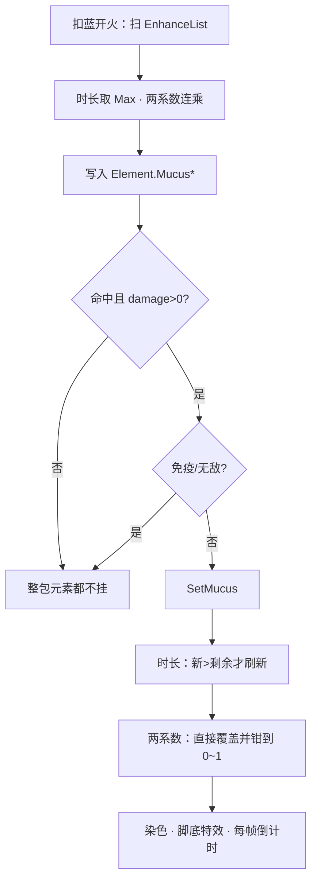

# 粘液晶石（Spell3004 / MucusCrystal）逆向分析

> 范围：仅玩家强化符文「粘液晶石」（`abilityType = 3004`，配置 ID `30041–30043`）。重点是**法术侧怎么合成一包粘液数据**，以及**命中后 `SetMucus` 怎么覆盖**。
> 不展开敌人史莱姆弹、药水免疫、地上粘液怪。共享「元素附着」管线（颜色随机 / 命中全生效）写在第 5 节，不逐条展开冰冻 / 毒 / 燃烧。
> 方法：`SpellConfig.json` + 反编译 `Assembly-CSharp` 交叉验证。未标注「推测」的结论均有代码/数据直接证据。
> 玩家施法主路径是 ECS。Mono `SpellBase` 叠加上限与 ECS 基本一致，时长取法不同，文末单独对照。
> 配套：总览见《魔法工艺法术系统逆向报告.md》，原始数值见《法术数值总表.md》，槽位解析骨架见《伤害强化逆向分析.md》，子弹整包继承元素见《分裂逆向分析.md》。

---

## 1. 身份与定位


| 项 | 值 |
| --- | --- |
| 中文名 | 粘液晶石 |
| 英文名 | Slime Crystal |
| `abilityType` | `3004` / `SpellAbilityType.MucusCrystal` |
| 配置 ID | `30041`（Lv1）/ `30042`（Lv2）/ `30043`（Lv3） |
| 稀有度 | 普通（`dropType=1`） |
| `useType` | `2`（Enhance 强化符文） |
| 槽位消耗 | `slotCost=1`，自身 `mpCost=0`、`damage=0` |
| 作用对象 | `haveEffecforMissileSpell=true`，`haveEffecforSummonSpell=true` |
| 合成 | Lv1→Lv2→Lv3（`canCompound`：Lv1/2=`true`，Lv3=`false`） |
| 售价（金币） | 6 / 18 / 54 |


**机制一句话**：插在主动/召唤**左侧**的元素附着符文。发射时把时长和两个速度系数烘焙进 `SpellElementEffectComponentData`；命中且伤害 > 0 时调用 `SetMucus`：减速 + 让目标自己射出的法术变慢。没有独立 `Spell3004*System`。



文案（`TextConfig_Spell` id `7130041–7130043`）：

> 法术命中单位后使其在 **float1** 秒内移动速度×**float2**% 且施放的法术飞行速度×**float3**%

名称（`7030041–7030043`）：粘液晶石 / Slime Crystal。三级名称相同，只有三个 `float` 不同。

底部补充（`7230041`）是整类元素附着的共享说明，见第 5 节。

---

## 2. 数值与叠加

### 2.1 配置表（`assets_export/SpellConfig.json`）


| ID | Level | float1 持续秒 | float2 移速×% | float3 飞行速度×% | 售价 | 可合成 |
| --- | --- | --- | --- | --- | --- | --- |
| 30041 | 1 | **3** | **60** | **70** | 6 | true |
| 30042 | 2 | **4** | **45** | **50** | 18 | true |
| 30043 | 3 | **5** | **30** | **30** | 54 | false |


规律：售价每级 ×3。等级**不是**「每级 ×2」：时长微增，两个减速系数各自变狠。`int1/2/3` 全 0，不用。无耗蓝倍率。比伤害强化（9/27/81）便宜一档。

### 2.2 字段语义


| 字段 | 语义 | 运行时是否被读 | 置信度 |
| --- | --- | --- | --- |
| **float1** | 附着时长（秒）；多张取 **Max** | 是 | 高 |
| **float2** | 目标移速系数（文案是「×float2%」，不是「减 float2%」）；多张 **连乘** `float2/100` | 是 | 高 |
| **float3** | 目标**自己施放**的法术飞行速度系数；多张 **连乘** `float3/100` | 是 | 高 |
| int1 / int2 / int3 | 配置为 0 | ECS **未读** | 高 |
| `haveEffecforMissile/Summon` | 对弹幕与召唤都标为生效 | `GetMucusElementData` **不读** | 高 |


`float2=60` 就是 `×0.6`（慢 40%），不是再乘一次 60%。

### 2.3 法术侧：组卡时合成一包（Max + 连乘）

当前主路径是 `SpellShootData.GetMucusElementData` → `SIP.MucusElementData` → `SpellElementEffectComponentData`：

```430:447:decompiled/Assembly-CSharp/SpellShootData.cs
	public (float moveSpeedRatio, float spellSpeedRatio, float duration) GetMucusElementData()
	{
		float num = 0f;
		float num2 = 1f;
		float num3 = 1f;
		// ...
			if (finalConfig.abilityType == SpellAbilityType.MucusCrystal)
			{
				num = math.max(num, finalConfig.float1);
				num2 *= finalConfig.float2 / 100f;
				num3 *= finalConfig.float3 / 100f;
			}
		return (num2, num3, num);
	}
```

- **时长**：取最大，不累加。
- **两个速度系数**：连乘，无上限、不「只取最高级」。
- 初始必须是 `(1, 1, 0)`。结构体默认值是 `0`，从 0 连乘会变成永久静止。

因此等级**不能**按「2×Lv1 = 1×Lv2」换算：

```
2×Lv1：时长 3，移速 ×0.36，飞行 ×0.49   （更慢，更短）
1×Lv2：时长 4，移速 ×0.45，飞行 ×0.50
3×Lv1：时长 3，移速 ×0.216，飞行 ×0.343
1×Lv3：时长 5，移速 ×0.30，飞行 ×0.30
```

合成省槽，也换「更长、单卡更狠」；多张低级在减速上往往更狠。

`SipToSSP` 原样写入：

```302:304:decompiled/Assembly-CSharp/ShootSpellUtils.cs
			MucusDuration = sip.MucusElementData.MucusDuration,
			MucusMoveSpeedRatio = sip.MucusElementData.MucusMoveSpeedRatio,
			MucusSpellSpeedRatio = sip.MucusElementData.MucusSpellSpeedRatio,
```

之后飞行中不再重算。分裂复印的是这份快照（见 4.2）。

### 2.4 目标侧：命中时覆盖，不是再乘

```473:498:decompiled/Assembly-CSharp/UnitProperty_Dots.cs
	public void SetMucus(float time, float moveSpeedRatio, float spellSpeedRatio, bool changeColor = true)
	{
		if (IsImmuneMucus || IsInvincible) return;
		// 精英/Boss：时长 *= frozenTimeRatio
		if (affect_MucusHitTimer < num)
			affect_MucusHitTimer = num;          // 时长只在「新 > 剩余」时刷新
		affect_MucusMoveSpeedRatio = Clamp(moveSpeedRatio, 0, 1);
		affect_MucusSpellSpeedRatio = Clamp(spellSpeedRatio, 0, 1);  // 直接覆盖
	}
```

两层不要混：

| | 法术侧（组卡） | 目标侧（命中） |
| --- | --- | --- |
| 时长 | 多张取 Max | 新时长 > 剩余才刷新，短的砍不短 |
| 移速 / 飞行系数 | 多张连乘 | **直接覆盖**，再钳到 `[0, 1]` |


后一发**较弱**的粘液会把已经更慢的系数盖回去。系数钳在 `[0, 1]`，加速不了。

精英 / Boss 时长再乘 `unitCfg.frozenTimeRatio`（常见 Boss `0.1`，玩家 `0.5`，小怪 `1`）。和冰冻共用这个字段。系数不乘。

免疫（`IsImmuneMucus` / `immnueMucusCounter`）或无敌直接 return。`PurifyAbnormalState` 会清掉整层。

---

## 3. 谁吃得到这张卡

### 3.1 只强化自己右边、同一段

`SpellGroupParser` 从左到右扫。遇到 Enhance 推进累积列表 `list2`，**消耗后不清空**；遇到 Missile / Summon（或触发器）时，把当前累积快照挂到该法术的 `EnhanceList`。主槽和后槽分别 `Parse`，互不串。

```
[粘] [弹]           弹带粘液
[弹] [粘]           弹带不到
[粘] [弹] [弹]      两发都带
[粘A] [弹] [粘B] [滚球]   弹吃 A；滚球吃 A+B（系数连乘，时长取 max）
```

主槽加不到后槽。

### 3.2 `haveEffecfor*` 拦不住

两个标记都是 `true`，但 `GetMucusElementData` 不读它们。只要解析器把这张卡挂进 `EnhanceList`，弹幕和召唤都会带上数据包。

自动填槽：`SelfRepelSpells` 含 `MucusCrystal`，**同一根杖不会自动再塞第二张**。手摆可以叠，按 2.3 连乘。测试连乘必须手插。

### 3.3 命中还有一道门

`UnitPropertyJob`：

- `immuneDamage` 或 **`damage <= 0`**：只结算击退，**整包元素都不挂**（粘液 / 毒 / 冰 / 烧 / 虚空一起跳过）。
- 法术实体为空：不挂。
- 条件是 `MucusDuration > 0`，不是看外观颜色。

护盾、无敌帧、`damage<=0` 的触发弹不要指望还能上粘液。

### 3.4 玩家也能被挂

玩家 `800001`：`immuneMucus=false`，`frozenTimeRatio=0.5`。被命中后自己的法术也会慢——「飞行速度×70%」减的是**被命中单位往外射的法术**，不是你这发弹自己的速度。

落地：`MoveSpeed *= affect_MucusMoveSpeedRatio`；`UnitBase.ShootSpell` 以及若干怪物射击 Job 再乘 `affect_MucusSpellSpeedRatio`。

### 3.5 魔能升阶抬的是这张卡的三个 float

`EnhanceList` 取 `GetFinalConfig()`。魔能升阶把 `30041` 抬成 `30042` / `30043`。叠加规则不变，变的是送进 Max / 连乘的那组数。

---

## 4. 主路径与边界

### 4.1 命中后发生什么

```
法术 EnhanceList 合成 MucusDuration / Move / Spell 系数
        ↓ 命中且伤害 > 0
   SetMucus（免疫/无敌无效）
        ↓
   affect_IsMucusHit = true
   身体染色 GameConst.color_BodyMucus（黄 1,1,0）
   每帧倒计时；到点 ClearMucusState，还原颜色
   减速期间挂脚底特效 Prefabs/EF/EF_Deceleration_Dots（请求名 3004_Decelerate）
```

`affect_IsMucusDecelerate` 在倒计时期间为 true，用来驱动脚底特效，不是第二套数值。

### 4.2 分裂：整包复制，满额

`ToSplit` 复印 `SpellSpawnParams`，`ElementComponentData` 原样留下。子弹拿到发射时的时长和连乘系数，不是母弹「现在还剩多少附着」。子弹命中仍走 `SetMucus`。

低帧效率会再乘毒层层数一类字段，**不改**粘液三个数。详见《分裂逆向分析.md》6.4。

### 4.3 悬停 / 坠落 / 爆炸圈

悬停第二段、坠落炸、奥爆等只要打出 `damage > 0` 的 `TakeDamageInfo`，就会走同一条 `UnitPropertyJob` 元素门。圈的大小是范围增强的事；粘液只问「这发实体上的 `MucusDuration` 是否 > 0」。

表 `radius=0` 且没有坠落附加圈时，悬停圈可能打不到人，数据包还在快照里。

### 4.4 闪电链 / 生命线 / 召唤

| 对象 | 怎么带粘液 |
| --- | --- |
| 闪电链 ECS | `Spell3007Job` 从宿主抄整份 `SpellElementEffectComponentData`，命中仍 `SetMucus` |
| 闪电链 / 鱼叉链 Mono | 抄 `spellMucusTime` / 两个 ratio |
| 生命线 | 从宿主抄同一组 Mono 字段 |
| 召唤物攻击 / 撞击 | 生成时带上召唤法术的 Element；或从 `SummonerSpellBase.spellMucus*` 再 `SetMucus` |
| 只拷 `ColorType`、不拷 Element | **会丢减速** |


继承要拷数据，不要只拷颜色。

### 4.5 彩虹丝带 / 随机色杖：可能再乘一张 Lv1

法杖随机色或彩虹丝带先定 `ColorType`，再 `ApplyElementSpell(ToSpellId(1 或 2))`。颜色抽到粘液时，会再灌一张 `30041`（或高级色的对应等级）进已经烘焙好的包：

```
MucusDuration = Max(已有, 灌入卡 float1)
两系数再 *= 灌入卡的 float2/100、float3/100
```

已经插了粘液晶石、彩虹又抽到黄色：系数会**再乘一次** Lv1。抽到别的色：粘液数据不动，另加那种元素。

### 4.6 公转 / 寻踪 / 反弹 / 穿透

不改粘液数据包。穿透耗尽会在单位身上销毁，走不到后面的墙，但**已经打出的那下**若 `damage > 0` 仍会挂粘液。

---

## 5. 共享元素附着管线

文案 `7230041`：

> 当存在多种元素附着强化时，外观上会随机选择一种颜色，但命中目标时仍然产生所有元素附着强化的效果。

### 5.1 颜色只决定外观（和地面痕迹）

`SpellTools.GetSpellColor` 从 `EnhanceList` 里收集 `ToSpellColor()` 的去重结果，再随机抽一个：


| abilityType | 颜色 |
| --- | --- |
| `MucusCrystal` 3004 | `Mucus` |
| `VenomCrystal` 3005 | `Venom` |
| `Frozen` 3014 | `Frozen` |
| `FireCrystal` 3111 | `Fire` |
| `DeathInfect` 3129 | `Void` |


雷晶石**不在**这张映射里；它用自己的 `float3` 概率把颜色改成 `Thunder`，先于随机抽取。

没有元素色时回落到 `Player`。法杖「随机颜色」已定时，`useRandomColorByWand` 直接用当前色，不再从列表抽。

### 5.2 效果按数据全上，不看颜色

`UnitPropertyJob` 对毒 / 冰 / 粘 / 烧 / 虚空是**并列 if**，不互斥。弹是火颜色，只要 `MucusDuration > 0` 仍会减速。

### 5.3 地面痕迹跟颜色，不跟效果包

`ColorType == Mucus` 才会 `CreateMucusRequest`（滚球撞墙、抛物落地、高压水枪销毁、陨石 / 诡雷爆炸等）。带了粘液晶石但随机成了毒色：命中仍减速，**不铺地**。

地上粘液是另一套，不要和晶石混用：


| | 晶石命中 | 踩到地上粘液 |
| --- | --- | --- |
| 条件 | `MucusDuration > 0` 且伤害 > 0 | `ColorType==Mucus` 留下的 `MucusTag`；非飞行、非免疫地面 |
| 移速 | 法术包里的连乘系数 | 固定 `Min(0.6, 当前系数)` |
| 飞行速度 | 有 | **无** |
| 时长 | float1（精英/Boss 再乘 `frozenTimeRatio`） | 站上去才有，离开即无 |
| 与晶石共存 | — | 已有 `affect_IsMucusHit` 时**不再**吃地面层 |


史莱姆怪、药水「免疫粘液」走 `immuneMucus` / `ImmuneMucusRegister`，不是这张卡。毒液痕迹伤友军，粘液痕迹不伤人。

---

## 6. 算例

普通小怪（`frozenTimeRatio=1`），先不算彩虹丝带 / 随机色杖。


| 槽位 | 命中后（移速 ×，飞行 ×，秒） |
| --- | --- |
| `[弹]` | 无 |
| `[粘Lv1] [弹]` | ×0.60 / ×0.70 / 3 |
| `[粘Lv2] [弹]` | ×0.45 / ×0.50 / 4 |
| `[粘Lv3] [弹]` | ×0.30 / ×0.30 / 5 |
| `[粘Lv1]×2 [弹]` | ×0.36 / ×0.49 / 3 |
| `[粘Lv1][粘Lv2] [弹]` | ×0.27 / ×0.35 / 4 |
| 先 Lv3 再被 Lv1 打中 | 系数变成 ×0.60 / ×0.70，剩余时长仍按较长的那头 |
| 同上，打在 `frozenTimeRatio=0.1` 的 Boss 上 | 时长 0.5 秒，系数仍是法术包里的值 |
| `[粘Lv1] [弹]` + 彩虹抽到黄 | ×0.36 / ×0.49 / 3（再乘一张 Lv1） |


`[粘][毒][弹]`：外观黄或绿各 50%（再被雷晶石概率改色）；命中同时上粘液和毒。

---

## 7. Mono 残留轨对照

`SpellBase.ApplyEnhanceSpell` 同样：两系数连乘。时长写成 `spellMucusTime = Mathf.Max(spellConfig.float1)`（单参数，等于**覆盖成最后一张**）。ECS 是对已有值取 `math.max`。玩家主路径以 `GetMucusElementData` 为准。

命中：`spellMucusTime > 0` 时调同一个 `SetMucus`。彩虹 / 随机色的 `extraEnhanceIds` 在 Mono 里会再跑一遍 `ApplyEnhanceSpell`，和 ECS `ApplyElementSpell` 同语义。

伞盾 `UmbrellaShieldController` 自己扫 Enhance，规则与 Mono 相同。

---

## 8. 证据索引


| 文件 | 作用 |
| --- | --- |
| `SpellShootData.GetMucusElementData` | 时长 Max、两系数连乘 |
| `SpellInitialParameter.Builder` | 写入 `SIP.MucusElementData` |
| `ShootSpellUtils.SipToSSP` | 快照 `ElementComponentData.Mucus*` |
| `ShootSpellUtils.ApplyElementSpell` | 彩虹 / 随机色再灌一张晶石 |
| `UnitPropertyJob` | `damage<=0` 整包跳过；并列挂元素 |
| `UnitProperty_Dots.SetMucus` | 免疫/无敌、Boss 时长、覆盖系数、钳制 |
| `UnitProperty_Dots.MoveSpeed` | 移速落地 |
| `UnitBase.ShootSpell` | 目标外射法术乘 `affect_MucusSpellSpeedRatio` |
| `UnitEnvironmentSystem` | 倒计时、地面层 0.6、不叠在晶石上 |
| `UnitAttachEffectSystem` | 脚底特效 `3004_Decelerate` |
| `SpellTools.GetSpellColor` / `ToSpellColor` | 颜色随机；雷晶石先判定 |
| `SpellSystem` / `SpellParabolaSystem` 等 | `ColorType==Mucus` 才 `CreateMucusRequest` |
| `SpellSpawnParamsStorage.ToSplit` | 元素整包复制 |
| `Spell3007Job` | 闪电链抄宿主 Element |
| `SpellAutoFullTool.SelfRepelSpells` | 自动填槽自排斥 |
| `SpellBase` `case MucusCrystal` | Mono 叠加；时长覆盖成最后一张 |
| `SpellConfig.json` `30041–30043` | 配置原始值 |
| `TextConfig_Spell` `703004*` / `713004*` / `7230041` | 名称、文案、共享说明 |


---

## 9. 待决 / 局限

1. **各怪物射击 Job**：已核对 `UnitBase.ShootSpell` 和若干 `Monster3xxSystem` 乘了射速系数；未逐只怪穷尽。
2. **彩虹丝带与随机色杖**：确认会 `ApplyElementSpell` 再灌对应等级晶石；遗物 / 法杖逐条配置不展开。
3. **粘液免疫来源**：`immuneMucus` 配置位、药水、计数器 `immnueMucusCounter` 只确认入口，不列全部来源。
4. **地面粘液寿命 / 半径**：各法术 `CreateMucusRequest` 的半径公式不同（有的 `Scale/2`，有的 `Radius.Calculate()`），不在此穷尽。
