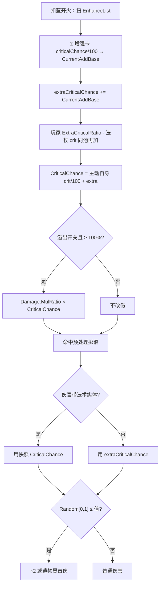

# 精准施法（Spell3105 / EnhanceCriticalChance）逆向分析

> 范围：仅玩家强化符文「精准施法」（`abilityType = 3105`，配置 ID `31051–31053`）。重点是**百分点怎么进 `extraCriticalChance` / `CriticalChance`**，以及**谁真正掷骰、谁溢出转伤、谁只改 UI**。
> 不逐条拆遗物 / 诅咒 / 法杖暴击来源，同池只点入口。闪耀星矢蓄力暴击、奥术屏障文案暴击只写和 3105 相交处。
> 方法：`SpellConfig.json` + 反编译 `Assembly-CSharp` 交叉验证。未标注「推测」的结论均有代码/数据直接证据。
> 玩家施法主路径是 ECS。Mono `SpellBase` 叠加上限与 ECS 一致，溢出转伤只在 ECS 发射时做，文末单独对照。
> 配套：总览见《魔法工艺法术系统逆向报告.md》，原始数值见《法术数值总表.md》，槽位解析骨架见《伤害强化逆向分析.md》，子弹继承见《分裂逆向分析.md》，蓄力加暴击见《闪耀星矢逆向分析.md》，盾文案暴击见《奥术屏障逆向分析.md》。

---

## 1. 身份与定位


| 项 | 值 |
| --- | --- |
| 中文名 | 精准施法 |
| 英文名 | Precise Casting |
| 内部名 | `EnhanceCriticalChance` 暴击率强化 |
| `abilityType` | `3105` / `SpellAbilityType.EnhanceCriticalChance` |
| 配置 ID | `31051`（Lv1）/ `31052`（Lv2）/ `31053`（Lv3） |
| 稀有度 | 普通（`dropType=1`） |
| `useType` | `2`（Enhance 强化符文） |
| 槽位消耗 | `slotCost=1`，自身 `mpCost=0`、`damage=0`、`shootCount=0` |
| 作用对象 | `haveEffecforMissileSpell=true`，`haveEffecforSummonSpell=true` |
| 合成 | Lv1→Lv2→Lv3（`canCompound`：Lv1/2=`true`，Lv3=`false`） |
| 售价（金币） | 10 / 30 / 90 |


**机制一句话**：插在主动/召唤**左侧**的纯数值符文。读的不是 `float1`，而是卡上的 **`criticalChance` 百分点**，加算进发射包的 `extraCriticalChance`，再和主动法术自身暴击、玩家、法杖拼成实体快照 `CriticalChance`。没有 `Spell3105*System` / Authoring。`angle`（-30 / -60 / -100）**会被读**，进散射加算池，把锥角往下压。



卡面没有独立机制文案。`TextConfig_Spell` `7131051–7131053`、底部补充 `7231051` 全空。名称（`7031051–7031053`）：精准施法 / Precise Casting。三级名称相同。展示靠 `SpellConfig.GetInfo` 自动吐两行属性：

> ◆ 暴击率 **+10 / +20 / +40**%
> ◆ 散射 **-30 / -60 / -100**°

强化卡的暴击率带 `+` 前缀；散射为负时不加 `+`。

---

## 2. 数值与叠加

### 2.1 配置表（`assets_export/SpellConfig.json`）


| ID | Level | criticalChance 暴击% | angle 散射° | 售价 | 可合成 |
| --- | --- | --- | --- | --- | --- |
| 31051 | 1 | **10** | **-30** | 10 | true |
| 31052 | 2 | **20** | **-60** | 30 | true |
| 31053 | 3 | **40** | **-100** | 90 | false |


规律：`criticalChance` 每级 ×2；`angle` 绝对值大致 ×2（30 → 60 → 100，最后一档多 20）；售价每级 ×3（10 / 30 / 90，比伤害强化的 9 / 27 / 81 贵 1 金）。`float1/2/3`、`int1/2/3` 全 0，不用。无耗蓝倍率。

### 2.2 字段语义


| 字段 | 语义 | 运行时是否被读 | 置信度 |
| --- | --- | --- | --- |
| **`criticalChance`** | 暴击百分点；`/100` 后 `AddBase` 进暴击池 | 是 | 高 |
| **`angle`** | 散射加算（负数收锥）；`GetSpellScatter` 逐张加 | 是 | 高 |
| float1 / float2 / float3 / int1 / int2 / int3 | 配置为 0 | ECS **未读** | 高 |
| `shootCount` | 配置为 0 | 这张卡不当主动，不读 | 高 |
| `haveEffecforMissileSpell` | 自动填槽：不是「只给召唤」 | 仅自动填槽 | 高 |
| `haveEffecforSummonSpell` | 表上是 `true` | `GetSpellCriticalChance` **不读** | 高 |


没有独立 `Spell3105*System` / Authoring。它不是 ECS 行为组件，只被 `GetSpellCriticalChance` / `GetSpellScatter` 读字段。

### 2.3 加算百分点，不看 `abilityType`

两张 Lv1 是 **+20%**，不是 `max(10,10)`，也不是 `10% × 10%`。

```234:242:decompiled/Assembly-CSharp/SpellShootData.cs
	public RatioValue GetSpellCriticalChance()
	{
		RatioValue ratioValue = new RatioValue(Spell.GetFinalConfig().criticalChance / 100f);
		foreach (SpellConfig item in EnhanceList.Select((SlotData e) => e.GetFinalConfig()))
		{
			ratioValue.AddBase(item.criticalChance / 100f);
		}
		return ratioValue;
	}
```

和伤害强化不同：这里**没有** `abilityType == EnhanceCriticalChance` 分支。循环把 `EnhanceList` 里每张卡的 `criticalChance` 都加进去。当前表里非 0 的增强卡只有：

- 精准施法 `3105`：10 / 20 / 40
- 强力牵引 `3112`：三级都是 **5**

复刻时不要写成「只认 3105」。`3112` 也会往同一池加 5%。

`RatioValue` 底数是**主动/召唤自己的** `criticalChance / 100`，增强卡走 `AddBase`：

```
Result = 主动自身 crit/100 + Σ(增强卡 crit/100)
CurrentAddBase = Σ(增强卡 crit/100)     // 不含主动自身
```

循环里没有「已处理过同类型就跳过」。同类型出现几次加几次。无上限、无「只取最高级」。

等级可以互替：

```
1×Lv2 = 2×Lv1 = +20%
1×Lv3 = 2×Lv2 = 4×Lv1 = +40%
```

合成省槽，不提高单点效率。自动填槽**不自排斥**（`SelfRepelSpells` 只有元素晶石），手摆和自动都可以叠多张。

### 2.4 写入发射包：只送 `CurrentAddBase`

`ProcessShootDataEffect` 不把整份 `Result` 写进 SIP，只加增强段：

```310:310:decompiled/Assembly-CSharp/SpellInitialParameter.cs
			data.extraCriticalChance += shootData.GetSpellCriticalChance().CurrentAddBase;
```

玩家和法杖在另外两步同池再加：

```172:172:decompiled/Assembly-CSharp/SpellInitialParameter.cs
			data.extraCriticalChance += PlayerMgr.Inst.ExtraCriticalRatio;
```

```210:210:decompiled/Assembly-CSharp/SpellInitialParameter.cs
			data.extraCriticalChance += shooterWand.WandCfg.criticalChance / 100f;
```

烘焙实体时，主动自身暴击在这里补上，避免和 `CurrentAddBase` 双计：

```272:272:decompiled/Assembly-CSharp/ShootSpellUtils.cs
			CriticalChance = configCopy.criticalChance / 100f + sip.extraCriticalChance,
```

所以运行时快照是：

```
CriticalChance = 主动自身/100 + Σ增强卡/100 + ExtraCriticalRatio + 法杖crit/100
```

`GetSpellCriticalChance_FinalPlayerValue` 把玩家和法杖加在 `GetSpellCriticalChance()` 上，给 UI / 蓄力时长用，和上面同一层。

`ExtraCriticalRatio` 入口：`BattleData.extraCriticalChance`、遗物 `relicCfg_AddCriticalChance`、诅咒 `curseCfg_ReduceCriticalRatio`、符文法师套装。本文不拆来源。

### 2.5 魔能升阶抬的是这张卡的 `criticalChance` 和 `angle`

`EnhanceList` 取 `GetFinalConfig()`。`SpellLevelEnhance`（魔能升阶）把 `31051` 抬成 `31052` / `31053`（不超过该 `abilityType` 最高级）。叠加规则不变，变的是送进求和的百分点和散射角。

### 2.6 `angle` 会改散射，不是死字段

`GetSpellScatter` 同样不看 `abilityType`，把每张增强卡的 `angle` 加进加算池：

```117:126:decompiled/Assembly-CSharp/SpellShootData.cs
	public RatioValue GetSpellScatter()
	{
		RatioValue ratioValue = new RatioValue(Spell.GetFinalConfig().angle);
		ratioValue.AddBase(OwnerGroup.GetGroupShootScatterFromVolley(this));
		foreach (SpellConfig item in EnhanceList.Select((SlotData e) => e.GetFinalConfig()))
		{
			ratioValue.AddBase(item.angle);
		}
		return ratioValue;
	}
```

`ProcessShootDataEffect`：`extraScatter += CurrentAddBase`（齐射散射 + 增强卡 `angle`）。`SipToSSP` 写 `Scatter` 时用 `Result`，**小于 0 钳成 0**——减到没有散射为止，不会变成「负锥角再对称」。

当前表里另一张会改增强 `angle` 的是超载散射 `3003`（+60 / +90 / +150），和 3105 同池相加。散射系统本身不在此展开。

**对 `angle` 底数大的多发弹，这条钳零是质变。** 蝴蝶 `1003` 的 `angle = 90`：

| 槽位 | 锥角 | 每只偏角 |
| --- | --- | --- |
| `[蝶]` | 90 | ±45° |
| `[精Lv1] [蝶]` | 60 | ±30° |
| `[精Lv2] [蝶]` | 30 | ±15° |
| `[精Lv1]×2 [蝶]` | 30 | ±15° |
| `[精Lv3] [蝶]` | 90 − 100 = −10 → **0** | **±0°** |
| `[精Lv1] [精Lv2] [蝶]` | 0 | **±0°** |

单张 Lv3、或 Lv1+Lv2，就能让一发 3~5 只蝴蝶**初始方向完全相同**。注意这不等于「叠成一发」：实体仍各自独立，只是初始方向一致；蝴蝶减速段结束后各锁各自的最小夹角目标，很快散开。实际效果是把前约 0.38 秒压成一束，近距离表现为集火。

同理，多发弹的暴击是**每只独立掷骰**（各实体带自己的 `CriticalChance` 快照）。Lv3 蝴蝶 5 只 × 40% 的期望暴击数是 2 只，方差小于单发弹——多发弹吃暴击率的期望值而非运气。详见《蝴蝶逆向分析.md》7.2。

**对 `angle = 0` 且 `shootCount = 1` 的法术，钳零不是塌缩，是彻底空转。** 落雷阵 `1018` 的 `angle = 0`、`shootCount = 1`、`speed = 0`：

| 步骤 | 蝴蝶 `1003` + 精 Lv3 | 落雷阵 `1018` + 精 Lv3 |
| --- | --- | --- |
| 加算池 `Result` | 90 − 100 = −10 | 0 − 100 = −100 |
| 钳零后锥角 | 0（本来 90，**扇形塌成一束**） | 0（本来就是 0，**没有扇形可塌**） |
| 偏角写去哪 | 每只蝴蝶的初速方向 | `Direction`，而 `Direction × Speed = 0` |
| 可观测变化 | 有（前约 0.38 秒集火） | **无** |

钳零其实做了两次：`SipToSSP` 写快照时钳一次（`ShootSpellUtils.cs` L282），`CalculateRandomAngle` 算锥角时再钳一次（同文件 L632–635）。落雷阵两次都是 0 进 0 出。插了坠落 `3119` 也一样：那条分支改的是瞄准点（`Target += 随机单位向量 × 锥角 × 0.06`，同文件 L708–714），锥角本来是 0，负角减不出东西来。

落雷阵每次结算只读 `Transform.Position` 和 `Radius`，`Direction` 没有消费方；`Config.Scatter` 快照也只有激光 `1004`、龙息 `1025`、破法者 `1021` 等自带读取的法术才用。所以这里既没有「扇形塌缩」，也没有任何别的落点。

**所以精准施法在落雷阵身上只剩暴击率这一半功能**——但这一半的期望值利用率是全表最高的。4.2 的掷骰是**逐条 `TakeDamageInfo` 独立进行**，而落雷阵每 0.25 秒对每个命中目标各写一条伤害信息：

| 载体 | 一次施放的掷骰次数（Lv3、满命中） | 40% 暴击率的表现 |
| --- | --- | --- |
| 单发弹 | 1 | 纯运气，暴或不暴 |
| 蝴蝶 `1003` | 5（每只一次） | 期望 2 只 |
| 落雷阵 `1018` | 7 目标 × 20 tick = **140** | 方差极小，几乎必然吃满期望值 |

注意暴击的 ×2 乘在**已经 ×0.25 的单 tick 伤害**上（`isDPS` 管线，见《落雷阵逆向分析.md》2.3），所以「每 tick 独立暴击」在总量上等价于「整段伤害乘 1 + 暴击率」，只是抖动被 140 次掷骰摊平了。

---

## 3. 谁吃得到这张卡

### 3.1 只强化自己右边、同一段

`SpellGroupParser` 从左到右扫。遇到 Enhance 推进累积列表 `list2`，**消耗后不清空**；遇到 Missile / Summon（或触发器）时，把当前累积快照挂到该法术的 `EnhanceList`。主槽和后槽分别 `Parse`，互不串。

```
[精] [弹]              弹吃 +10%
[弹] [精]              吃不到
[精] [奥爆] [弹]        两张都吃
[精A] [奥爆] [精B] [弹]  奥爆吃 A；弹吃 A+B
```

主槽最左的一张会强化本段之后所有主动/召唤。主槽加不到后槽。

### 3.2 `haveEffecfor*` 拦不住手动

`GetSpellCriticalChance` 只看 `EnhanceList` 里各卡的 `criticalChance`，不读两个 `haveEffecfor*`。表上两者都是 `true`，和悬停那种「表标召唤无效、运行时仍写入」不同；手动插在召唤左侧，召唤物实体一样带上 `CriticalChance`。

自动填槽：`haveEffecforMissileSpell=true`，`Filter_SummonOnlyEnhance` 不会把它滤成「只给召唤」。

### 3.3 自动填槽不避开

不在 `IgnoreSpells`、不在 `SelfRepelSpells`、不在 `SpellAvoidEnhances`。奥爆 / 陨石 / 诡雷 / 阿瓦达没有避开精准施法。避开只约束自动填；手动怎么插，运行时都按 `EnhanceList` 加。

---

## 4. 谁真正掷到暴击

通用 ECS 掷骰在 `TakeDamageInfoPreProcessSystem`。谁把值写进法术实体快照，谁才是这张卡说的「法术暴击率 +N%」。谁只读 SIP 给 UI、谁走遗物自己的 `extraCriticalChance`，谁就不是这个意思。

### 4.1 快照公式

先不算玩家和法杖。魔法弹 Lv1（`criticalChance = 0`）、奥爆术 Lv1（`criticalChance = 25`）：


| 槽位 | 快照暴击 | 说明 |
| --- | --- | --- |
| `[弹]` | 0% | 掷骰条件 `> 0` 为假，不暴击 |
| `[精Lv1] [弹]` | **10%** | |
| `[精Lv2] [弹]` | **20%** | |
| `[精Lv3] [弹]` | **40%** | |
| `[精Lv1]×2 [弹]` | **20%** | 加算 |
| `[奥爆]` | 25% | 法术自带 |
| `[精Lv1] [奥爆]` | **35%** | 自身 + 增强 |
| `[精Lv3]×3 [弹]` | **120%** | 无上限；见 4.3 |


### 4.2 命中预处理掷骰

`TakeDamageInfo_Dots.NewInfo(..., in config, ...)` 把整份 `SpellConfigComponentData` 拷进 `info.spell.Config`，里面带着 `CriticalChance`。预处理：

```334:354:decompiled/Assembly-CSharp/TakeDamageInfoPreProcessSystem.cs
				if (reference.isDamageCritical)
				{
					continue;
				}
				float num = reference.extraCriticalChance;
				if (reference.spell.Entity != Entity.Null)
				{
					num = reference.spell.Config.CriticalChance;
				}
				if (num > 0f && DTool.RandomValue(ref gRandom.ValueRW.random) <= num)
				{
					reference.isDamageCritical = true;
					if (relic_AddCriticleDamageRatio > 0f && ... IsSameCamp(UnitType.Player))
					{
						reference.damage *= relic_AddCriticleDamageRatio;
					}
					else
					{
						reference.damage *= 2f;
					}
				}
```

要点：

- 已经标了 `isDamageCritical` 的，不再掷。
- **有法术实体**：完全改用快照 `CriticalChance`，伤害结构上的 `extraCriticalChance` 被盖掉。
- **没有法术实体**：才用 `extraCriticalChance`（遗物直伤常见，见 4.5）。
- `DTool.RandomValue` 是 `[0, 1)`。`CriticalChance ≥ 1` 时几乎必中。
- 默认暴击伤 ×2；玩家侧若有 `relicCfg_AddCriticalDamage`，改乘 `int1 / 100`。

这张卡本身不出伤、不改暴击倍率，只改掷中的概率。

### 4.3 溢出转伤：红符文杖开关，不钳暴击

3105 **不打开**这个开关。开关在法杖：

```390:399:decompiled/Assembly-CSharp/Wand.cs
	public bool EnableOverFlowCriticalChanceConvertToDamage
	{
		get
		{
			if (passiveRedRuneCount > 0)
			{
				return PlayerMgr.Inst.GetRuneEffectLevel(PlayerMgr.Inst.GetPlayerRuneCount().RedRune) >= 3;
			}
			return false;
		}
	}
```

杖上有红符文，且玩家红符文套装等级 ≥ 3，才把 `OverFlowCriticalChanceToDamage` 写进 SIP → 实体。发射末尾：

```415:418:decompiled/Assembly-CSharp/ShootSpellUtils.cs
		if (ssp.OverFlowCriticalChanceToDamage && ssp.ConfigComponentData.CriticalChance >= 1f)
		{
			ssp.ConfigComponentData.Damage.MulRatio *= ssp.ConfigComponentData.CriticalChance;
		}
```

它**不**把 `CriticalChance` 减回 1，也不只乘溢出段。120% 暴击时：

- 伤害先 ×1.2
- 掷骰仍按 1.2，几乎必暴，再 ×2（或遗物暴击伤）

名字像「溢出换成伤害」，实现是「满 100% 之后，整份暴击率再乘一层伤害」，暴击判定还在。3105 的作用是把快照往 100% 以上推，让这扇门更容易开。

闪耀星矢结束蓄力还有自己的溢出公式（相对 `baseCritical`），见《闪耀星矢逆向分析.md》。

### 4.4 只改 UI、和运行时不是同一条

法杖上主动法术的悬停说明走 `GetSpellCriticalChance_FinalPlayerValue`，和 4.1 同一层，数字对得上。

例外：

- **精准施法自己**：`GetInfo` 只显示这张卡的 `+N%` / `-N°`，不显示「插到某发之后合计多少」。
- **奥术屏障 / 若干符文卡**：`GetApplyWandAllEnhanceEffectSIP` 把**整杖**主槽 + 后槽所有 Enhance 挂到一个假法术上，再读 `extraCriticalChance` 画文案。这和「只强化自己右边」不是同一份 `EnhanceList`。屏障爆炸是否暴击看盾**实体**快照，不看 Controller 这份 SIP。既有结论：3105 只稳定影响悬停文案里的暴击显示（见《奥术屏障逆向分析.md》7.2 / 7.4）。

`UmbrellaShieldController.GetCriticalChance()` 直接返回 `sip.extraCriticalChance`，只给 formatter 用。

### 4.5 遗物直伤不吃 EnhanceList

圣剑、挡格、跟随幽灵、贪食蛇身、黄老饼等走遗物伤害时，常见写法是 `damageInfo.extraCriticalChance = PlayerMgr.Inst.ExtraCriticalRatio`，再没有法术实体。预处理走 4.2 的「无实体」分支，只吃玩家全局暴击，**不吃**槽位里的 3105。

### 4.6 分裂：整包继承

`ToSplit` 复制整份 `SpellSpawnParams`，只改伤害倍率、半径、击退、速度等，**不改** `CriticalChance`，也不改溢出旗标。子弹掷的是母弹发射时的满额快照，不是再扫一遍 EnhanceList。

### 4.7 闪耀星矢：3105 抬的是蓄力底数

蓄力开始把当时的 `CriticalChance` 存成 `baseCritical`，之后每秒 +0.25（ECS 写死，不读卡 `float1`）。3105 加高底数，会：

- 缩短充到文案阈值 `float3%` 的时间：`(float3/100 - Result) / (float1/100)`（`SpellGroupShootDurationCalculator`）
- 让结束蓄力时的快照更高，也更容易跨过 100% 去走 4.3 / 星矢自己的溢出乘伤

蓄力曲线、档位特效见《闪耀星矢逆向分析.md》，这里不拆 Job。

### 4.8 强行暴击旁路

引力晶石拉人伤在 `SpellTools` 里直接 `isDamageCritical = true`、`CriticalChance = 1`。那是 3112 自己的「暴击时牵引」，不经过 3105 的掷骰。3112 卡上那 5% `criticalChance` 仍会进 2.3 的加算池——两件事叠在同一张卡上。

---

## 5. 和其它法术的关系（只写会改这份暴击或读法的）

齐射 / 多重 / 伤害强化 / 加速器 / 时长只改发射或别的池，不列。


| 对象 | 精准施法怎么变 |
| --- | --- |
| 强力牵引 `3112` | 同池再 `AddBase(0.05)`；拉人伤另有强制暴击 |
| 超载散射 `3003` | 同散射池，`angle` 正加；和 3105 的负角对冲 |
| 落雷阵 `1018` | `angle` 段**彻底空转**（底数 0、`shootCount=1`、`speed=0`）；只剩暴击率，但 140 次掷骰把期望吃满，见 2.6 |
| 魔能升阶 `3126` | 抬这张卡的 `criticalChance` 和 `angle` |
| 拟态魔方 `3109` | `GetFinalConfig` 已解析；吃的是模仿后那发的暴击 |
| 分裂 `3013` | `CriticalChance` 满额继承；溢出旗标也在 |
| 闪耀星矢 `1026` | 加高 `baseCritical`；蓄力时长和溢出乘伤见 4.7 |
| 奥术屏障 `4012` | 文案走整杖假 SIP；爆炸看实体快照 |
| 红符文杖（套装 ≥3） | 打开 4.3 溢出乘伤；3105 只负责把值推过 100% |
| 玩家遗物 / 诅咒 / 法杖 crit | 同池加算，不经 3105 |
| 遗物直伤 | 不读 EnhanceList |


---

## 6. Mono 残留轨对照

`SpellBase` 的增强 `switch` **没有** `EnhanceCriticalChance` 分支。暴击只在初始化时写一次：

```785:785:decompiled/Assembly-CSharp/SpellBase.cs
		overalCriticalChance = spellCfg.criticalChance / 100f + InitialParameter.extraCriticalChance;
```

`GetCriticalChance()` 返回这份值。`UnitProperty.TakeDamage(SpellBase)` 把它加进 `info.criticalChance`，`FinalTakeDamage` 用 `UnityEngine.Random.value <= criticalChance` 掷骰，默认 ×2。

和 ECS 对齐的部分：

- 增强卡走 SIP 的 `CurrentAddBase`，主动自身在 `spellCfg.criticalChance / 100` 再加，不双计
- 加算、无上限、不看 `haveEffecfor*`
- `angle` 同样经 `extraScatter` 进 `_angle`

差别：


| | ECS | Mono |
| --- | --- | --- |
| 溢出转伤 | `SipToSSP` 在 `CriticalChance ≥ 1` 时 `Damage.MulRatio *= CriticalChance` | **未找到**同等乘伤；`SpellBase` 不读溢出旗标 |
| 掷骰 | 预处理：有实体用快照，无实体用 `extraCriticalChance` | `UnitProperty` 用 `overalCriticalChance` |
| 闪耀星矢加暴击 | 专属 Job 改实体 `CriticalChance` | `GetCriticalChanceByHoldingTime` 改 `overalCriticalChance` |


玩家主路径以 ECS 为准。

---

## 7. 证据索引


| 文件 | 作用 |
| --- | --- |
| `SpellShootData.GetSpellCriticalChance` | 主动自身为底，增强卡 `criticalChance/100` 加算 |
| `SpellShootDataExtend.GetSpellCriticalChance_FinalPlayerValue` | 再加玩家、法杖；UI / 蓄力时长 |
| `SpellShootData.GetSpellScatter` | 增强卡 `angle` 加算 |
| `SpellInitialParameter.Builder` | `extraCriticalChance` 三段相加；只送 `CurrentAddBase` |
| `ShootSpellUtils.SipToSSP` | 快照 `CriticalChance`；溢出乘伤；`Scatter` 钳 0 |
| `Wand.EnableOverFlowCriticalChanceConvertToDamage` | 红符文杖 + 套装 ≥3 |
| `TakeDamageInfo_Dots.NewInfo` | 拷贝实体 `CriticalChance` |
| `TakeDamageInfoPreProcessSystem` | 有实体用快照掷骰；默认 ×2 |
| `SpellSpawnParamsStorage.ToSplit` | 不改 `CriticalChance` |
| `SpellGroupParser` | 同段左侧累积、主后槽分段 |
| `SpellAutoFullTool` | 不自斥、不避开、导弹标记为 true |
| `SpellGroupShootDurationCalculator` | 星矢充到阈值的时间吃合计暴击 |
| `Spell1026ShiningStarEndChargingSystem` | 星矢自己的溢出乘伤 |
| `SpellInfoFormatters` / `UmbrellaShieldController.GetCriticalChance` | 盾等文案暴击 |
| `Wand.GetApplyWandAllEnhanceEffectSIP` | 整杖 Enhance 假包，给 UI |
| `Wand.GetWandAllEnhanceList` | 主槽 + 后槽全部 Enhance |
| `SpellConfig.GetInfo` | 卡面自动吐 `+暴击%` / 散射° |
| `SpellBase` | Mono `overalCriticalChance` |
| `UnitProperty.FinalTakeDamage` | Mono 掷骰 |
| `PlayerMgr.ExtraCriticalRatio` | 玩家同池入口 |
| `SpellConfig.json` `31051–31053` | 配置原始值 |
| `TextConfig_Spell` `703105*` / `713105*` / `723105*` | 名称有、机制文案空 |


---

## 8. 待决 / 局限

1. **散射落地细节**：确认 `angle` 进 `extraScatter`、`Scatter` 钳 0。齐射均分、超载散射、`SpellSpawnParamsProcessor` 里 `extraScatter + 45` 的弹形，不在此拆。
2. **召唤物逐条**：只确认写入快照的路径与导弹相同；不逐召唤对抄 `GetCriticalChance` 的公式。
3. **奥术屏障实体快照**：文案路径已对上。盾爆炸是否稳定带上槽位 3105，沿用《奥术屏障逆向分析.md》的结论，未再拆 `SpawnUmbrella`。
4. **溢出乘伤的体验**：满 100% 后是「必暴 ×2 再乘整份暴击率」，不是「超出部分改成伤害、暴击率锁 100%」。未做局内对照录屏。
5. **对象池与跳字**：暴击跳字、红符文充能（`PostslotCriticalHitChargeRatio`）挂在掷中之后，不在此展开。
