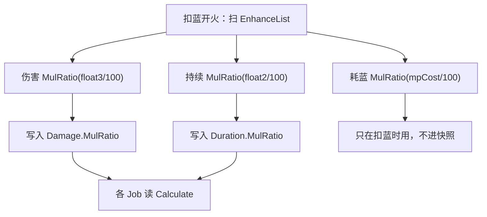

# 节能模式（Spell3104 / PowerSavingMode）逆向分析

> 范围：仅玩家强化符文「节能模式」（`abilityType = 3104`，配置 ID `31041–31043`）。重点是**三轴乘算怎么进快照**，以及**哪些字段是死的**。
> 不展开遗物/诅咒逐条来源，也不穷尽每个 `abilityType` 的 Job。
> 方法：`SpellConfig.json` + 反编译 `Assembly-CSharp` 交叉验证。未标注「推测」的结论均有代码/数据直接证据。
> 玩家施法主路径是 ECS。Mono `SpellBase.ApplyEnhanceSpell` 会多砍召唤 HP，文末单独对照。
> 配套：总览见《魔法工艺法术系统逆向报告.md》，原始数值见《法术数值总表.md》，加算/乘算容器见《伤害强化逆向分析.md》，持续与悬停分家见《悬停逆向分析.md》，子弹继承伤/持续见《分裂逆向分析.md》，`isDPS` 法术双重打折的取证实例见《落雷阵逆向分析.md》7.9。

---

## 1. 身份与定位


| 项 | 值 |
| --- | --- |
| 中文名 | 节能模式 |
| 英文名 | Energy Saving Mode |
| `abilityType` | `3104` / `SpellAbilityType.PowerSavingMode` |
| 配置 ID | `31041`（Lv1）/ `31042`（Lv2）/ `31043`（Lv3） |
| 稀有度 | 普通（`dropType=1`） |
| `useType` | `2`（Enhance 强化符文） |
| 槽位消耗 | `slotCost=1`，自身 `mpCost=0`、`damage=0` |
| 作用对象 | `haveEffecforMissileSpell=true`，`haveEffecforSummonSpell=true` |
| 合成 | Lv1→Lv2→Lv3（`canCompound`：Lv1/2=`true`，Lv3=`false`） |
| 售价（金币） | 11 / 33 / 99 |


**机制一句话**：插在主动/召唤**左侧**的三轴乘算符文。发射时扫一次 EnhanceList：伤害 `MulRatio(float3/100)`、持续 `MulRatio(float2/100)`、耗蓝 `MulRatio(mpCostMulDivCorrection/100)`。没有独立 ECS 系统。



文案（`TextConfig_Spell` id `7131041–7131043`）只写两段：

> 法术持续时间 ×**float2**%
> 法术伤害 ×**float3**%

名称（`7031041–7031043`）：节能模式 / Energy Saving Mode。三级名称相同。

卡面数值行还会额外打出 `mpCostMulDivCorrection`（`SpellConfig` / `SlotData` 在该字段非 0 时追加「耗蓝 ×N%」）。`float1`、`int1` **不出现在文案里**。

---

## 2. 数值与字段语义

### 2.1 配置表（`assets_export/SpellConfig.json`）


| ID | Level | float2 持续% | float3 伤害% | 耗蓝倍率 | float1 | int1 | 售价 | 可合成 |
| --- | --- | --- | --- | --- | --- | --- | --- | --- |
| 31041 | 1 | **75** | **75** | **×60%** | 70 | 30 | 11 | true |
| 31042 | 2 | **75** | **75** | **×50%** | 50 | 45 | 33 | true |
| 31043 | 3 | **80** | **80** | **×40%** | 30 | 70 | 99 | false |


规律：售价每级 ×3。**Lv1 与 Lv2 的伤 / 持续完全相同**，Lv2 只多省蓝。Lv3 伤 / 持续惩罚变轻（75%→80%），耗蓝再降到 ×40%。

### 2.2 字段语义


| 字段 | 语义 | 运行时是否被读 | 置信度 |
| --- | --- | --- | --- |
| **float3** | 伤害乘算百分比；`MulRatio(float3 / 100)` | 是 | 高 |
| **float2** | 持续乘算百分比；`MulRatio(float2 / 100)` | 是 | 高 |
| **`mpCostMulDivCorrection`** | 耗蓝乘算百分比；与多重 / 分裂 / 过载同开关 | 是（发射扣蓝时） | 高 |
| **float1** | 配置 70 / 50 / 30 | ECS / Mono **均未读** | 高 |
| **int1** | 配置 30 / 45 / 70 | ECS / Mono **均未读** | 高 |
| int2 / int3 | 配置为 0 | 未读 | 高 |
| `haveEffecforMissile/Summon` | 对弹幕与召唤都标为生效；三个入口**不读**这两个字段 | 过滤只出现在自动填槽 | 高 |


`PowerSavingMode` 在整个 `Assembly-CSharp` 里只有四处 `case`：`CanShootSpellUtils.GetDamage`、`SpellShootData.GetSpellDuration`、`SpellShootData.GetSpellManaCost`、`SpellBase.ApplyEnhanceSpell`。四处都只碰 `float3` / `float2` / `mpCostMulDivCorrection`，没有一处读 `float1` 或 `int1`。

没有 `Spell3104*System` / Authoring。它不是行为组件，只是被三个 getter 读 `abilityType` 后改比率。

### 2.3 等级没有线性等价

伤害强化是加算，`1×Lv2 = 2×Lv1`。节能是**连乘**，而且等级改的不是同一组数：


| 组合 | 伤害 / 持续 | 耗蓝 |
| --- | --- | --- |
| 1×Lv1 | ×0.75 | ×0.60 |
| 1×Lv2 | ×0.75（与 Lv1 相同） | ×0.50 |
| 1×Lv3 | ×0.80 | ×0.40 |
| 2×Lv1 | ×0.5625 | ×0.36 |
| Lv1+Lv2 | ×0.5625 | ×0.30 |


合成 Lv1→Lv2：**伤 / 持续不变**，只把耗蓝从 ×60% 换成 ×50%，并省 1 格。合成 Lv2→Lv3：伤 / 持续惩罚变轻，耗蓝再降。两张低级卡连乘会把伤 / 持续打得比一张 Lv3 狠得多。

### 2.4 效率比：三轴里有几项砍到总伤

效率比 = **总伤系数 ÷ 耗蓝系数**，大于 1 才算划算。三轴里伤害和持续**都可能砍到总伤**，所以效率比不是一个固定数字，而取决于这张卡在该法术上砍的是一项还是两项。三处作用点的取值（代码见 3.1 / 3.2 / 3.3）：


| 作用点 | 字段 | 入口 | Lv1 | Lv2 | Lv3 |
| --- | --- | --- | --- | --- | --- |
| 伤害 | `Damage.MulRatio` ← `float3/100` | `CanShootSpellUtils.GetDamage`（L24–26） | ×0.75 | ×0.75 | ×0.80 |
| 时长 | `Duration.MulRatio` ← `float2/100` | `SpellShootData.GetSpellDuration`（L138–140） | ×0.75 | ×0.75 | ×0.80 |
| 耗蓝 | `mpCostMulDivCorrection/100` | `SpellShootData.GetSpellManaCost`（L635–640） | ×0.60 | ×0.50 | ×0.40 |


**一次性飞弹**（一发只打一次，`duration` 只决定命中窗口的长短，不决定打几下）：持续那一项不改变总伤，只有伤害轴生效。


| 卡 | 总伤系数 | 耗蓝系数 | 效率比 |
| --- | --- | --- | --- |
| Lv1 | ×0.75 | ×0.60 | **1.25** |
| Lv2 | ×0.75 | ×0.50 | **1.50** |
| Lv3 | ×0.80 | ×0.40 | **2.00** |


**`isDPS` 且靠 `duration` 计时的法术**（总伤 = 每秒伤害 × 时长）：伤害轴和持续轴**同时**生效，两个 `MulRatio` 各自落在乘式的一个因子上，构成**双重打折**。


| 卡 | 伤害 | 时长 | 总伤系数 | 耗蓝系数 | 效率比 |
| --- | --- | --- | --- | --- | --- |
| Lv1 | ×0.75 | ×0.75 | **×0.5625** | ×0.60 | **0.94** |
| Lv2 | ×0.75 | ×0.75 | **×0.5625** | ×0.50 | **1.13** |
| Lv3 | ×0.80 | ×0.80 | **×0.64** | ×0.40 | **1.60** |


**Lv1 插在这类法术上是负收益**：总伤掉了 44%，蓝只省了 40%。Lv2 勉强打平，只有 Lv3 明显划算。这是节能模式全表唯一一处会算出效率比 < 1 的场景，和飞弹「三级都划算」的判定正好相反。

判据是「**总伤是否与 `Duration` 成正比**」，而不是 `isDPS` 这个旗标本身。核对一张 DPS 法术时先过这三道：


| 情形 | 吃几项 | 用哪张表 |
| --- | --- | --- |
| `isDPS = true`，寿命由 `Duration.Calculate()` 决定 | 伤害 + 时长 | **双重打折表** |
| 寿命被自己的 Job 短路，不读 `Duration` | 只吃伤害 | 飞弹表（1.25 / 1.50 / 2.00） |
| 坠落形态 | 只吃伤害 | 同上，`UpdateDuration` 有 `!IsFallSpell` 守卫 |


第二行的名单是硬编码的：`SpellSystem.UpdateDuration` 把 `Laser`（`1004`）/ `RuneHammer`（`4013`）/ `LaserBeam`（`4014`）/ `BiAnLethalBlade` / `Umbrella` / `HighPressureWasher`（`1019`）/ `DaveHarpoons` 排除在 `DurationTimer` 比较之外（`SpellSystem.cs` L275–307）。**这几张即使是 DPS 也吃不到持续那一层折扣**，回到 1.25 / 1.50 / 2.00。

**落雷阵（`1018`）是双重打折的第一个取证实例**：`damage = 22/44/88`（`isDPS = true`，面板值实为「每目标每秒伤害」）、`DPSDamageInterval = 0.25`、`duration = 5`，不在上面那份例外名单里。Lv3 满命中 5 秒总伤 3080；插 `[节Lv1]` 后伤害 ×0.75、时长 5 s → 3.75 s（结算次数 20 → 15），总伤 1733，蓝耗只从 56 降到 33.6。详见《落雷阵逆向分析.md》7.9。

**龙息（`1025`）要单独算**：它的耗蓝底数本身是 `float2 × GetSpellDuration().Result`（见 5.3），持续打折会**同时**压低耗蓝。若它的总伤同样与时长成正比（未逆向核实），时长因子在分子分母上抵消，效率比回到 1.25 / 1.50 / 2.00——它是「双吃」但不是「双亏」。

---

## 3. 三轴怎么叠（核心）

三轴都是 `MulRatio`，内部 `mulRatio *= val`，初值 1。同 `abilityType` 出现几次乘几次。无上限、无「只取最高级」。

### 3.1 伤害：加算之后再乘

```7:33:decompiled/Assembly-CSharp/CanShootSpellUtils.cs
	public static RatioValue GetDamage(float baseDamage, IEnumerable<SpellConfig> enhances, SpellConfig stopTarget)
	{
		RatioValue ratioValue = new RatioValue(baseDamage);
		foreach (SpellConfig enhance in enhances)
		{
			if (enhance != stopTarget)
			{
				switch (enhance.abilityType)
				{
				case SpellAbilityType.EnhanceAttackRatio:
				case SpellAbilityType.FireCrystal:
				case SpellAbilityType.OverDrive:
					ratioValue.AddRatio(enhance.float1 / 100f);
					break;
				case SpellAbilityType.Refraction:
					ratioValue.MulRatio(enhance.float2 / 100f);
					break;
				case SpellAbilityType.PowerSavingMode:
					ratioValue.MulRatio(enhance.float3 / 100f);
					break;
				}
				continue;
			}
			return ratioValue;
		}
		return ratioValue;
	}
```

`RatioValue.ResultDouble = (Base + addBase) * baseAddRatio * addRatio * mulRatio + addExtra`。

因此仅槽位层：

```
最终伤害 ≈ B × (1 + Σ加算%) × Π(折射 float2/100) × Π(节能 float3/100)
```

伤害强化 / 炽焰 / 过载先加总，节能和折射再连乘。`GetDamage_FinalPlayerValue` / SIP 还会再乘法杖 `passiveDamageRatio`、`damageCorrection/100`。详见《伤害强化逆向分析.md》第 5 节。

烘焙：

```
sip.extraDamageRatio += GetSpellDamage().CurrentAddRatioStartZero
sip.finalDamageRatio *= GetSpellDamage().CurrentMulRatio
Damage.MulRatio = sip.finalDamageRatio
```

实体：`AttributeValue.Calculate() = (Base + AddBase) * (1 + AddRatio) * MulRatio + Extra`。

### 3.2 持续：乘 (Base + AddBase)，不乘 Extra

```128:149:decompiled/Assembly-CSharp/SpellShootData.cs
	public RatioValue GetSpellDuration()
	{
		RatioValue ratioValue = new RatioValue(Spell.GetFinalConfig().duration);
		foreach (SpellConfig item in EnhanceList.Select((SlotData e) => e.GetFinalConfig()))
		{
			switch (item.abilityType)
			{
			case SpellAbilityType.EnhanceDurationValue:
				ratioValue.AddBase(item.float1);
				break;
			case SpellAbilityType.PowerSavingMode:
				ratioValue.MulRatio(item.float2 / 100f);
				break;
			case SpellAbilityType.RandomRotationRadiu:
				ratioValue.AddBase(item.float3);
				break;
			case SpellAbilityType.AroundMouse:
				ratioValue.AddBase(item.float2);
				break;
			}
		}
		return ratioValue;
	}
```

`GetSpellDuration_FinalPlayerValue` 原样返回，没有玩家额外层。

SIP / 快照：

```
sip.extraDuration += GetSpellDuration().CurrentAddBase     // 时长 + 寻踪 float2 + 自由公转 float3
sip.finalDurationRatio *= GetSpellDuration().CurrentMulRatio
之后再 += 主观缓时换来的秒
Duration.AddBase = sip.extraDuration
Duration.MulRatio = sip.finalDurationRatio
Duration.Extra    = 公转 3009 的 extraDuration（仅运动类型是 Rotation 时）
```

```
实体持续 = (表 duration + AddBase) × Π(节能 float2/100) + Extra
```

`Extra` 在 `MulRatio` **之后**相加，公转 3009 自己那截额外持续**不被节能打折**。

表 `duration = 0` 且没有 AddBase 时，乘完仍是 0。文案「持续时间 ×75%」只对「已经有持续」的法术有可见效果。

### 3.3 耗蓝：与多重 / 分裂 / 过载同开关

```614:643:decompiled/Assembly-CSharp/SpellShootData.cs
	public RatioValue GetSpellManaCost(...)
	{
		RatioValue ratioValue = new RatioValue(finalConfig.mpCost);
		// 组倍率、召唤杖倍率、后槽发数 …
		switch (finalConfig2.abilityType)
		{
		case SpellAbilityType.Multishot:
		case SpellAbilityType.SpellSplit:
		case SpellAbilityType.PowerSavingMode:
		case SpellAbilityType.OverDrive:
			ratioValue.MulRatio(finalConfig2.mpCostMulDivCorrection / 100f);
			break;
		}
	}
```

`GetSpellManaCost_FinalPlayerValue` 再乘 `wand.GetWandMpCorrection()`（杖表 `costCorrection`、杖被动、全杖能力、耗蓝诅咒）。

耗蓝修正**只在母弹发射扣蓝时用过**，不写入 `SpellSpawnParams`。分裂子弹、回响再放都不重扣这一层。

### 3.4 常见误解


| 误解 | 实际 |
| --- | --- |
| 两张 Lv1 伤变成 ×0.75+0.75 | 连乘成 ×0.5625 |
| Lv2 比 Lv1 伤更低 | 伤 / 持续相同，只是更省蓝 |
| 节能一定省蓝，插了不亏 | 对 `isDPS` 且靠 `duration` 计时的法术，伤害轴和持续轴同时生效，总伤 ×0.5625 而蓝只 ×0.60，Lv1 效率比 **0.94** 是负收益（见 2.4） |
| 「持续 ×75%」对 DPS 法术只是少打一会儿 | 少打的那部分就是总伤的一部分，它和伤害折扣相乘，不是取其一 |
| 持续也会打折悬停第二段 | 悬停走 `HoverDuration`，`GetSpellHoverDuration` 只加悬停自己的 `float1` |
| 耗蓝打折会进快照、子弹再扣一次 | 只在开火扣蓝用 |
| `float1` / `int1` 是隐藏的速度或冷却 | 配置非零，运行时无引用 |
| 召唤血量也按 float3 打折 | ECS `GetSummonHp` **没有** `PowerSavingMode` 分支 |

---

## 4. 谁吃得到这张卡

### 4.1 只强化自己右边、同一段

`SpellGroupParser` 从左到右扫。遇到 Enhance 推进累积列表 `list2`，**消耗后不清空**；遇到 Missile / Summon（或触发器）时，把当前累积快照挂到该法术的 `EnhanceList`。主槽和后槽分别 `Parse`，互不串。

```
[节能] [弹] [球]     两张都吃三轴
[弹] [节能] [球]     只有球吃
[弹] [球] [节能]     都吃不到
[节能A] [弹] [节能B] [球]   弹吃 A；球吃 A×B
```

主槽最左的一张会强化本段之后所有主动/召唤（含同一段里触发器后的后槽法术，它们在第一遍扫描时已经挂上同一份累积列表）。主槽加不到 `postSlots`。

### 4.2 `stopTarget` 对主动法术不截断

主动法术 `GetSpellDamage()` 的 `stopTarget` 是自己，不在 EnhanceList 里，列表里每张节能都会乘上。

闪电链 / 生命线以「强化自己」为基数调用 `GetDamage`：循环扫到那张链/线就 `return`，因此**只有它左侧**的节能计入该张链伤 / 生命线伤。

### 4.3 魔能升阶抬的是这张卡的等级

`EnhanceList` 取 `GetFinalConfig()`。`SpellLevelEnhance`（魔能升阶）把 `31041` 抬成 `31042` / `31043`。叠加规则不变，变的是送进三个 `MulRatio` 的百分比。Lv1→Lv2 抬完伤 / 持续仍是 75%，只有耗蓝从 60 变成 50。

### 4.4 自动填槽

`SpellAutoFullTool` 没有针对 `3104` 的专用滤网。`haveEffecforMissileSpell=true`，不会被滤成「只给召唤」。避让表也不避开节能。

---

## 5. 谁真正读到这三轴

### 5.1 伤害

谁读 `Damage.Calculate()`（或 SIP 等价的 `B × (1+AddRatio) × MulRatio`），谁就吃 `float3`。包括弹幕直伤、召唤体攻击（走同一份 `GetSpellDamage`）、闪电链（`GetLightningChainDamage_FinalPlayerValue`）、生命线（`GetLifeLineDamage_FinalPlayerValue`）。

链 / 线以自身为 `stopTarget`，只吃自己左边的节能。

### 5.2 持续


| 机制 | 吃不吃 | 怎么吃 |
| --- | --- | --- |
| 弹幕寿命（`DurationTimer >= Calculate()`） | 吃 | 表持续 + AddBase 后乘 `MulRatio` |
| `isDPS` 法术的**总伤**（落雷阵 `1018` 等） | **双吃** | 结算次数随时长一起被砍，再乘上伤害轴的折扣，两个 `MulRatio` 相乘；见 2.4 |
| 寿命被 Job 短路的法术（激光 `1004` / 符文锤 `4013` / 激光晶石 `4014` / 高压水流 `1019` 等） | **不吃** | `SpellSystem.UpdateDuration` 的例外名单，不读 `Duration`，只被砍伤害 |
| 时长强化 `3103` | 吃 | `AddBase` 先加秒，再被节能乘 |
| 寻踪 `3010` 的 `float2` | 吃 | `GetSpellDuration` `AddBase` |
| 自由公转 `3117` 的 `float3` | 吃 | 同上 |
| 主观缓时 `3128` 换来的秒 | 吃 | 写入 `extraDuration`（AddBase）之后乘 |
| 公转 `3009` 的 `float1` | **不吃** | 进 `Duration.Extra`，加在乘之后 |
| 悬停 `3008` | **不吃** | `GetSpellHoverDuration` 只加悬停 `float1`，不进 `Duration` |
| 冷却 / 射击间隔 | **不吃** | `GetSpellDuration` 不改 `WandCoolDown` / `shootInterval` |
| 飞行速度 | **不吃** | 不进 `GetSpellFlySpeed` |
| 半途传送 | 间接吃 | 半程点按 `Calculate()/2`，寿命短则更早传 |
| 龙息耗蓝 | **双吃** | 见 5.3 |
| 部分召唤寿命 | 吃 | `LifeTime` / `LifeDuration` 手写 `(基数 + AddBase) × MulRatio` |


加特林鸽等把持续折进射程的法术，会读到已经乘过节能的 `Duration` / `extraDuration × finalDurationRatio`。

### 5.3 耗蓝


| 机制 | 吃不吃 | 怎么吃 |
| --- | --- | --- |
| 主动 / 召唤开火扣蓝 | 吃 | `GetSpellManaCost` 连乘 |
| 多重 / 分裂 / 过载的耗蓝修正 | 同层连乘 | 同一 `switch` |
| 法杖 / 诅咒耗蓝修正 | 再乘一层 | `GetWandMpCorrection` |
| 后槽整组 | 看 EnhanceList | 同段左侧的节能会挂到后槽法术上，各自再乘；`GetGroupManaCostRatioFromMultiShoot` **只**再乘多重，不再乘节能 |
| 分裂子弹 / 回响再放 | **不重扣** | 修正不进快照 |
| 奥术屏障抵伤 | **不吃** | 写了 `mpCostRatio` 也不读，30 蓝/血不变（见《奥术屏障逆向分析.md》） |
| 低耗高伤法杖 | 间接吃 | 节能把实扣蓝压到杖 `int1` 以下时，再 `AddRatio(杖 float1/100)`；这笔加算仍会被节能的伤害 `MulRatio` 乘一次 |
| 龙息 `1025` | **双吃** | `BaseValue` 改写成 `float2 × GetSpellDuration().Result`（持续已被节能乘过），`mulRatio` 里的耗蓝 ×60%/50%/40% 还在 |


### 5.4 召唤 HP：ECS 不砍

`GetSummonHp` 只认巨魔血清（加算）和尸爆/献祭（乘算），**没有** `PowerSavingMode`。`SipToSSP` 的 `TeammateHpRatio.MulRatio` 来自这份 getter。玩家主路径召唤血量不按 `float3` 打折。

Mono 残留会砍，见第 7 节。

### 5.5 分裂：伤 / 持续已烘焙，耗蓝不重扣

`ToSplit` 整包复制快照。节能的伤害 `MulRatio`、持续 `MulRatio` 已经在母弹发射时写进去，子弹带着走，再额外 ×0.33 伤、×0.8 半径、×0.5 速度（非坠落）。耗蓝修正不会再跑一遍。详见《分裂逆向分析.md》6.1。

---

## 6. 和其它法术的关系（只写会改这三轴行为的）

齐射 / 加速器 / 范围增强 / 虚胖只改发射或其它栏位，不改这张卡的连乘规则，不列。


| 对象 | 节能怎么变 |
| --- | --- |
| 伤害强化 `3102` / 炽焰 `3111` / 过载 `3123` | 先加算再乘节能 `float3` |
| 折射 `3121` | 与节能同层连乘（折射用 `float2`，节能用 `float3`） |
| 时长强化 `3103` | 加的秒被节能 `float2` 乘 |
| 悬停 `3008` | 第二段时长不乘；寿命段仍乘 |
| 公转 `3009` | 自己的 `float1` 进 Extra，不乘 |
| 寻踪 `3010` / 自由公转 `3117` | 进 AddBase 的秒要乘 |
| 主观缓时 `3128` | 换来的秒进 AddBase，要乘 |
| 落雷阵 `1018` 等 `isDPS` 主动法术 | 伤害轴 × 持续轴 = 总伤双重打折，Lv1 效率比 0.94（见 2.4） |
| 坠落 `3119` | 坠落实体不跑 `UpdateDuration`，持续那一项作废，只剩伤害折扣 |
| 多重 `3002` / 分裂 `3013` / 过载 `3123` | 耗蓝同开关连乘各自的 `mpCostMulDivCorrection` |
| 闪电链 `3007` | 链伤走 `GetDamage`，只吃链左边的节能 |
| 生命线 `3110` | 同上 |
| 魔能升阶 `3126` | 抬这张卡的等级（Lv1→Lv2 伤/持续不变） |
| 拟态魔方 `3109` | `GetFinalConfig` 已解析；吃的是模仿后那发的表伤 / 表持续 / 表耗蓝 |
| 强制冷却 `4006` | 不进 `WandCoolDown` |
| 奥术屏障 | 抵伤不读耗蓝倍率 |


---

## 7. Mono 残留轨对照

玩家主路径 `shootFromSpellGroupV2 = true`，走 SIP 烘焙 + `ApplyShootGroupV2EnhanceEffect`。V2 的 `switch` **没有** `PowerSavingMode`，伤 / 持续 / 耗蓝都以 SIP 为准，与 ECS 同一套 getter。

旧路径 `ApplyOldShootGroupEnhanceEffect` → `ApplyEnhanceSpell`：

```2207:2210:decompiled/Assembly-CSharp/SpellBase.cs
		case SpellAbilityType.PowerSavingMode:
			damageRatio *= spellConfig.float3 / 100f;
			SpellSUmmonFinalHpRatio *= spellConfig.float3 / 100f;
			break;
```


| 项 | ECS / SIP（玩家主路径） | Mono `ApplyEnhanceSpell` |
| --- | --- | --- |
| 伤害 | `GetDamage` → `Damage.MulRatio` | `damageRatio *= float3/100`（同层） |
| 持续 | `GetSpellDuration` → `Duration.MulRatio` | 此 `case` **不改**持续（若仍走 SIP 初始化则持续仍在） |
| 耗蓝 | `GetSpellManaCost` | 此 `case` **不改** |
| 召唤 HP | `GetSummonHp` **不乘**节能 | **`SpellSUmmonFinalHpRatio *= float3/100`** |


讨论玩家构筑时以 **ECS 表**为准：召唤血量不被节能砍。

---

## 8. 证据索引


| 文件 | 作用 |
| --- | --- |
| `CanShootSpellUtils.GetDamage` | 节能 `float3` 进伤害 `MulRatio`；与折射同层 |
| `SpellShootData.GetSpellDuration` | 节能 `float2` 进持续 `MulRatio` |
| `SpellShootData.GetSpellManaCost` | 节能 / 多重 / 分裂 / 过载的 `mpCostMulDivCorrection` |
| `SpellShootData.GetSpellHoverDuration` | 只加悬停，证明持续轴不进第二段 |
| `SpellShootData.GetSummonHp` | 无 `PowerSavingMode`，ECS 不砍召唤血 |
| `SpellShootDataExtend.GetSpellDamage_FinalPlayerValue` | 低耗高伤法杖读已打折的耗蓝 |
| `SpellShootDataExtend.GetSpellManaCost_FinalPlayerValue` | 杖修正；龙息用持续重写 `BaseValue` |
| `SpellInitialParameter.Builder.ProcessShootDataEffect` | 伤 / 持续烘焙进 SIP |
| `ShootSpellUtils.SipToSSP` | `Damage.MulRatio` / `Duration.MulRatio`；`Duration.Extra` 来自公转 |
| `AttributeValue.Calculate` | `(Base+AddBase)×(1+AddRatio)×MulRatio+Extra` |
| `SpellGroupParser` | 同段左侧累积、主后槽分段 |
| `SpellSpawnParamsStorage.ToSplit` | 整包复制，耗蓝不重跑 |
| `SpellSystem` | `DurationTimer` 与 `Calculate()` 比寿命 |
| `SpellSystem.UpdateDuration`（L275–307） | 寿命例外名单（激光 / 符文锤 / 激光晶石 / 彼岸刃 / 奥术屏障 / 高压水流 / 鱼叉）与 `!IsFallSpell` 守卫：这些吃不到持续那一层折扣 |
| `SpellConfig.isDPS` / `DPSDamageInterval`；`TakeDamageInfo_Dots`（L153） | 单次伤害 = `damage × DPSDamageInterval`，总伤与时长成正比的来源，2.4 双重打折的前提 |
| `SpellBase.ApplyEnhanceSpell` | Mono 残留：伤 + 召唤 HP |
| `SpellConfig` / `SlotData` | 卡面追加耗蓝 ×N% |
| `SpellConfig.json` `31041–31043` | 配置原始值 |
| `TextConfig_Spell` `703104*` / `713104*` | 名称与文案 |


---

## 9. 待决 / 局限

1. **`float1` / `int1` 的设计意图**：配置随等级单调变（70→50→30，30→45→70），很像旧版速度 / 冷却 / 省蓝百分比，但当前二进制无引用。标「未读」，不猜旧语义。
2. **各法术 Job 手写寿命**：充能泡、闪亮星矢、鱼叉等可能在 `Calculate()` 之外再改计时。那是该法术自己的层，与槽位节能相乘或覆盖，不在此穷尽。
3. **召唤寿命**：确认部分路径读 `Duration.MulRatio`；未逐个召唤 prefab 核对是否另有写死秒数。
4. **遗物 / 诅咒耗蓝**：只确认走 `GetWandMpCorrection` 再乘一层，不逐条展开。
5. **2.4 的双重打折只逐条核对了落雷阵（`1018`）**。其余 `isDPS` 法术（龙息 `1025`、高压水流 `1019`、激光晶石 `4014` 等）没有逐个确认「总伤是否与 `Duration` 成正比」，只按 `UpdateDuration` 的例外名单做了归类。龙息那条「时长因子在耗蓝里抵消」是按 5.3 的公式推的，未实测。
