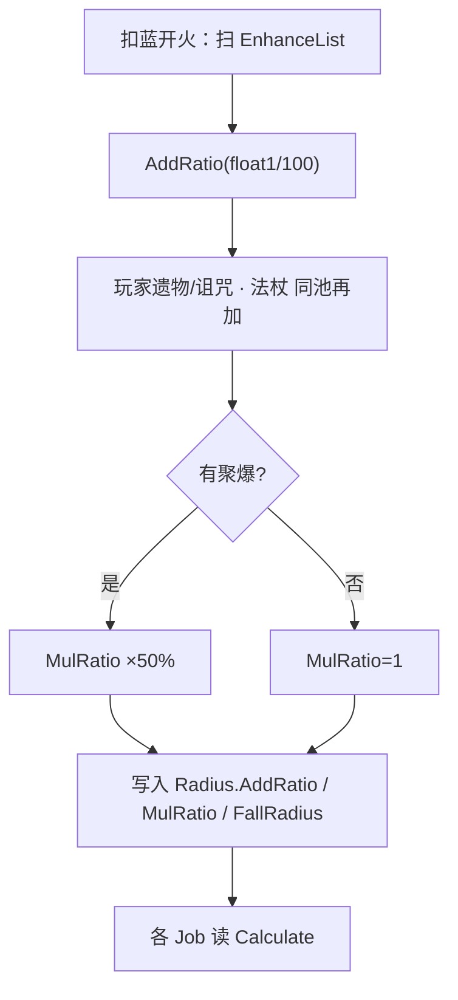

# 范围增强（Spell3107 / EnhanceRadiusRatio）逆向分析

> 范围：仅玩家强化符文「范围增强」（`abilityType = 3107`，配置 ID `31071–31073`）。重点是**加算怎么进半径**，以及**谁真正乘到这个半径**。
> 不展开遗物/诅咒逐条来源，也不穷尽每个 `abilityType` 的 Job。
> 方法：`SpellConfig.json` + 反编译 `Assembly-CSharp` 交叉验证。未标注「推测」的结论均有代码/数据直接证据。
> 玩家施法主路径是 ECS。Mono `SpellBase` 叠加上限与 ECS 一致，分裂对坠落附加圈的处理不同，文末单独对照。
> 配套：总览见《魔法工艺法术系统逆向报告.md》，原始数值见《法术数值总表.md》，加算容器与槽位解析骨架见《伤害强化逆向分析.md》，子弹半径再 ×0.8 见《分裂逆向分析.md》。

---

## 1. 身份与定位


| 项 | 值 |
| --- | --- |
| 中文名 | 范围增强 |
| 英文名 | Range Boost |
| `abilityType` | `3107` / `SpellAbilityType.EnhanceRadiusRatio` |
| 配置 ID | `31071`（Lv1）/ `31072`（Lv2）/ `31073`（Lv3） |
| 稀有度 | 普通（`dropType=1`） |
| `useType` | `2`（Enhance 强化符文） |
| 槽位消耗 | `slotCost=1`，自身 `mpCost=0`、`damage=0` |
| 作用对象 | `haveEffecforMissileSpell=true`，`haveEffecforSummonSpell=false` |
| 合成 | Lv1→Lv2→Lv3（`canCompound`：Lv1/2=`true`，Lv3=`false`） |
| 售价（金币） | 9 / 27 / 81 |


**机制一句话**：插在主动/召唤**左侧**的纯数值符文；把 `float1%` 写进半径的**加算池**（`AddRatio` → `extraSizeRatio` → `Radius.AddRatio`）。没有独立 ECS 系统，谁读 `Radius.Calculate()`（或等价的 `(1+AddRatio)*MulRatio`），谁就变大。



文案（`TextConfig_Spell` id `7131071–7131073`）：

> 法术影响半径+**float1**%

名称（`7031071–7031073`）：范围增强 / Range Boost。三级名称相同，只有 `float1` 不同。

---

## 2. 数值与叠加

### 2.1 配置表（`assets_export/SpellConfig.json`）


| ID | Level | float1 加算半径% | 售价 | 可合成 |
| --- | --- | --- | --- | --- |
| 31071 | 1 | **30** | 9 | true |
| 31072 | 2 | **60** | 27 | true |
| 31073 | 3 | **120** | 81 | false |


规律：`float1` 每级 ×2；售价每级 ×3。其余 `int/float` 全 0，不用。无耗蓝倍率。

### 2.2 字段语义


| 字段 | 语义 | 运行时是否被读 | 置信度 |
| --- | --- | --- | --- |
| **float1** | 加算半径百分比；`AddRatio(float1 / 100)` | 是 | 高 |
| float2 / float3 / int1 / int2 / int3 | 配置为 0 | ECS **未读** | 高 |
| `haveEffecforMissileSpell` | 自动填槽：不是「只给召唤」 | 仅自动填槽 | 高 |
| `haveEffecforSummonSpell` | 表上是 `false` | `GetSpellEffectRadius` **不读** | 高 |


没有 `Spell3107*System` / Authoring。它不是行为组件，只被 `GetSpellEffectRadius` 读 `abilityType` 后改一个比率。

### 2.3 加算，不是连乘

两张 Lv1 是 **+60%**（×1.60），不是 `1.3 × 1.3 = 1.69`。

```244:261:decompiled/Assembly-CSharp/SpellShootData.cs
	public RatioValue GetSpellEffectRadius()
	{
		RatioValue ratioValue = new RatioValue(Spell.GetFinalConfig().radius);
		// ...
			case SpellAbilityType.EnhanceRadiusRatio:
				ratioValue.AddRatio(finalConfig.float1 / 100f);
				break;
			case SpellAbilityType.RadiuRatioDown:
				ratioValue.MulRatio(finalConfig.float1 / 100f);
				break;
```

`switch` 里没有「已处理过同类型就跳过」。同类型出现几次加几次。无上限、无「只取最高级」。

等级只改加数：

```
1×Lv2  = 2×Lv1  = +60%
1×Lv3  = 2×Lv2  = 4×Lv1  = +120%
```

合成省槽，不提高单点效率。

### 2.4 `RatioValue` 与 ECS 半径怎么对上

`RatioValue.AddRatio` 把内部 `addRatio`（初值 1）加上去；`MulRatio` 连乘 `mulRatio`（初值 1）。映射到实体时：

```
sip.extraSizeRatio += CurrentAddRatioStartZero    // addRatio - 1，即 Σ(float1/100)
sip.finalSizeRatio *= CurrentMulRatio             // 目前只有聚爆会改
```

```258:263:decompiled/Assembly-CSharp/ShootSpellUtils.cs
			Radius = new RadiusAttributeValue(configCopy.radius)
			{
				FallRadius = sip.fallExplosionRadius,
				AddRatio = sip.extraSizeRatio,
				MulRatio = info.ShootData.GetSpellDecreaseRadiuSpeedInfo().radiusRatio
			},
```

`RadiusAttributeValue.Calculate()`：

```
(Base + FallRadius) * (1 + AddRatio) * MulRatio + Extra
```

`SipToSSP` 的 `MulRatio` 直接取聚爆的 `radiusRatio`，不读 `sip.finalSizeRatio`。当前只有聚爆写乘算，两边数值相同；分裂缩小半径不走这个字段（见 4.2）。

### 2.5 同加算池：遗物 / 诅咒 / 法杖

`extraSizeRatio` 在 SIP 里分三次加上去，最后写进同一个 `Radius.AddRatio`：


| 来源 | 写入 | 条件 |
| --- | --- | --- |
| 范围增强 | `GetSpellEffectRadius` → `CurrentAddRatioStartZero` | `EnhanceList` 里每张都加 |
| `ExtraRadiusOfInfluence(isSpell: true)` | `ProcessPlayerEffect` | 远程射击遗物（只在 `isSpell=true`）、加影响半径遗物、减半径诅咒 |
| `EffectRadiuRatioFromWandAbility() / 100` | `ProcessWandEffect` | 法杖能力 `AllWandEffectRadiuRatio`，多杖求和 |


预览用的 `GetSpellEffectRadius_FinalPlayerValue` 也是：先 `GetSpellEffectRadius()`，再把玩家和法杖 `AddRatio` 进去。先加总再乘聚爆。

**不是射程。** 不改速度、持续时间、蓝耗。弹体飞多远仍是 `speed × duration`（再加各运动 Buff）。

---

## 3. 谁吃得到这张卡

### 3.1 只强化自己右边、同一段

`SpellGroupParser` 从左到右扫。遇到 Enhance 推进累积列表 `list2`，**消耗后不清空**；遇到 Missile / Summon（或触发器）时，把当前累积快照挂到该法术的 `EnhanceList`。主槽和后槽分别 `Parse`，互不串。

```
[范] [奥爆] [弹]     两张都吃
[奥爆] [范] [弹]     只有弹吃
[奥爆] [弹] [范]     都吃不到
[范A] [奥爆] [范B] [弹]   奥爆吃 A；弹吃 A+B
```

主槽最左的一张会强化本段之后所有主动/召唤。主槽加不到后槽。

### 3.2 `haveEffecforSummonSpell=false` 拦不住手动

`GetSpellEffectRadius` 只看 `EnhanceList` 里有没有 `EnhanceRadiusRatio`，不读两个 `haveEffecfor*`。手动插在召唤左侧，召唤物的爆炸 / 撞击 / 探测圈仍会变大。

自动填槽另说：`haveEffecforMissileSpell=true`，`Filter_SummonOnlyEnhance` 不会把它滤成「只给召唤」；真正的限制是「主法术表半径 > 0」和避让表（见 4.8）。

### 3.3 魔能升阶抬的是这张卡的 `float1`

`EnhanceList` 取 `GetFinalConfig()`。`SpellLevelEnhance`（魔能升阶）把 `31071` 抬成 `31072` / `31073`（不超过该 `abilityType` 最高级）。叠加规则不变，变的是送进 `AddRatio` 的百分比。

---

## 4. 谁真正乘到这个半径

它不自己画圈。运行时半径是：

```
最终半径 = (表 radius + 坠落附加圈) × (1 + Σ范围增强 + 遗物/诅咒 + 法杖) × 聚爆乘算 + Extra
```

谁调用 `Radius.Calculate()` / `CalculateIgnoreFall()`，或手写等价的 `(1+AddRatio)*MulRatio`，谁就吃到。

### 4.1 按机制族


| 机制族 | 吃不吃 | 怎么吃 | 边界 |
| --- | --- | --- | --- |
| 表半径爆炸（奥爆、悬停圈、坠落炸、虚空炸） | 吃 | `Calculate()` = `(Base+Fall)×(1+Add)×Mul` | 奥爆 Lv1 `R=3` → 一张 Lv1 变成 3.9 |
| 坠落附加圈 | 吃 | `FallRadius` 先加进 `Base` 再乘加算 | 多张坠落 `float1` **求和**；和表半径同一套倍率 |
| 硬编码圈（部分召唤自爆 / 撞击 / 探测） | 吃 | 基数写死，再乘 `(1+AddRatio)*MulRatio` | 表 `radius=0` 也能变大 |
| 公转半径 | **基本不吃** | `AroundRadius` 来自公转自己的 `float3`，烘焙时**不乘** `extraSizeRatio` | AI 距离估算会乘 `CurrentFinalRatio`；个别法术（破法者）用半径比做随机偏移 |
| 弹体碰撞盒 | **不自动吃** | 预制体碰撞体，不读 `Calculate()` | 除非该法术把 `Scale` 设成 `Calculate()`（奥爆、冲刺、黑洞等） |
| 虚胖体积 | **另一条** | `FatSpell` → `SpellExtraSizeRatio` → `SpellNeedResize.ExtraSizeRatio` | 和 `Radius.AddRatio` 不是同一个字段 |
| 引力晶石牵引 | **不吃** | `GravitationalAttackRange = PullRange` 原样写入 | 不乘半径比 |
| 半途传送半径 | **不吃** | 读传送自己的 `float1` | 与 3107 无关 |
| 闪电链牵引 | 间接吃 | 从宿主抄 `radiusRatio` / `finalRadiusRatio` | 链自己不重算 `GetSpellEffectRadius` |
| 遗物自己的圈（圣剑、戒指、减速盾等） | **不吃这张卡** | `ExtraRadiusOfInfluence(isSpell: false)` | 远程射击遗物也不进这条；加半径遗物 / 减半径诅咒仍进遗物圈 |
| 弹道射程 | **不吃** | `speed × duration` | 文案是「影响半径」，不是飞行距离 |
| 激光 / 分解射线 | 看用法 | 部分折线 / 落地探测用 `Calculate()` | `radius=0` 时这段就是 0，加算乘上去仍是 0 |
| 龙息 / 超新星 | 吃，但卡面可能不显示 | 龙息自己用 `AddRatio` 算火线最长距和落地圈 | 提示框对这两种直接跳过半径行 |


奥爆术 Lv1（`R=3`），先不算玩家和法杖：


| 槽位 | 半径 |
| --- | --- |
| `[奥爆]` | 3.0 |
| `[范Lv1] [奥爆]` | 3.9 |
| `[范Lv1]×2` 或 `[范Lv2]` | 4.8 |
| `[范Lv3]` 或 `[范Lv1]×4` | 6.6 |
| 范Lv1 + 玩家 +20% | `3 × 1.50 = 4.5`（加算，不是 `3 × 1.30 × 1.20`） |
| 范Lv1 + 聚爆 ×50% | `3 × 1.30 × 0.50 = 1.95` |


### 4.2 分裂：继承加算，再缩底数

`ToSplit` 整包复制快照，**不改** `AddRatio` / `MulRatio` / `FallRadius`，只做：

```
Radius.Base  *= 0.8
Radius.Extra *= 0.8
```

子弹拿到的是发射时的满额加算，不是「母弹现在的圈」。表半径先乘 0.8 再套同一套 `(1+AddRatio)*MulRatio`，效果上等价于「范围增强也再 ×0.8」。

**坠落附加圈不乘 0.8。** `FallRadius` 原样留下，再被 `(1+AddRatio)*MulRatio` 放大。`[坠落][范][分裂][陨石]` 的子弹：表半径缩小，坠落附加圈仍按母弹满额吃范围增强。

### 4.3 聚爆：乘算，并且转伤吃加算后的米

聚爆（`3113` / `RadiuRatioDown`）是半径的**乘算层**：`MulRatio(float1/100)`。当前配置 `float1=50`、`float2=100`，即半径 ×50%，少掉的米按 100% 转伤害。

转伤公式（`GeneralTool.GetSpellRadiusToDamageRatio`）：

```
finalRadius / decreaseRatio × (1 - decreaseRatio) × convertRatio
```

`finalRadius` 已经含范围增强。范围增强把圈做大后，聚爆「少掉的米」也变多，转伤更高——这是聚爆吃加算层，不是范围增强自己转伤。

开火烘焙（`ProcessShootDataEffect`）算转伤时，用的是 `GetSpellEffectRadius()`，**只有槽位里的范围增强和聚爆**，不含遗物 / 法杖。实体上的真实爆炸圈则含遗物 / 法杖。结果：遗物把圈撑大，聚爆仍按 ×50% 缩小这块，但转伤那段少算了遗物 / 法杖多出来的米。

转伤还要求 `表 radius > 0` 或 `坠落附加圈 > 0`。魔法弹 `radius=0` 且没挂坠落时，聚爆转伤整句不进；范围增强改不了这件事。

### 4.4 表 `radius=0`

魔法弹等配置半径是 0。`Calculate() = FallRadius × (1+AddRatio) × MulRatio`。

- 没挂坠落：数值半径仍是 0。自动填槽不会给它们配这张卡（`Filter_EffectRangeEnhance` 要求主法术 `radius > 0`）。
- 手动插上：硬编码圈、召唤探测 / 自爆、以及「把 `Scale` 设成 `Calculate()`」的法术，仍按 `1+AddRatio` 放大。弹体预制碰撞盒不会只因为这张卡变大。
- 只挂范围增强、不挂坠落：悬停第二段的 `HoverDamageJob` 也读 `Calculate()`，圈仍是 0。

### 4.5 召唤

配置写了不对召唤生效，运行时不读。手动插在召唤左侧：

- 队友实体生成时带上同一份 `Radius` / `extraSizeRatio` / `finalSizeRatio`
- 撞击、自爆、虚空炸、探测距离按各召唤自己的基数 × 半径比
- 体型缩放有的加 `SpellNeedResize.ExtraSizeRatio`（虚胖），有的乘 `extraSizeRatio`（范围增强），不要混

### 4.6 虚胖不是范围增强

虚胖（`3124` / `FatSpell`）走 `GetSpellVolumeRatio` → `SpellSpawnParams.SpellExtraSizeRatio` → `SpellNeedResize.ExtraSizeRatio`。`SpellResizeSystem` 只在 `ResizeByDamage` 时把它叠到 `LocalTransform.Scale`。

范围增强从不写 `SpellExtraSizeRatio`。两张卡可以同时在：一张改命中/爆炸半径，一张改体积缩放。

### 4.7 公转 / 自由公转

`GetSpellRotationInfo` 的 `rotationRadiu` 只来自公转 / 自由公转自己的 `float3`。`SipToSSP` 写成 `AroundRadius`，不乘 `extraSizeRatio`。

`SpellGroupAttackDistanceCalculator` 估算最小攻击距离时，会把公转半径再乘 `GetSpellEffectRadius_FinalPlayerValue.CurrentFinalRatio`。这是 AI / 距离估算，不是飞行实体上的 `AroundRadius`。

破法者一类会用 `(1+AddRatio)*MulRatio` 做随机环绕偏移，属于该法术自己的读法，不是公转通用规则。

### 4.8 自动填槽

三道和这张卡有关的滤网：

1. `Filter_EffectRangeEnhance`：目标是范围增强时，主法术必须 `radius > 0`。
2. `SpellAvoidEnhances`：陨石（`Meteor`）、诡雷（`FireBall`）、阿瓦达啃大瓜（`DeathAdder`）**避开**范围增强（也避开自我追踪）。
3. `Filter_SummonOnlyEnhance`：因为 `haveEffecforMissileSpell=true`，不会被滤成只给召唤。

避开只约束自动填。手动把范围增强插在陨石 / 诡雷 / 阿瓦达左侧，爆炸圈 / 地面圈仍吃加算。这三张表半径都不是 0（陨石 1.2、诡雷 1.5、阿瓦达 0.8，均为 Lv1）。

### 4.9 卡面半径和实伤圈

提示框对龙息、超新星直接不显示半径。其它法术在 `radius != 0` 或有坠落附加圈时显示：

```
GetSpellEffectRadius_FinalPlayerValue.Result
+ Fall × (GetSpellEffectRadius 的加算 + ExtraRadiusOfInfluence) × 聚爆乘算
```

`FinalPlayerValue.Result` 已经含法杖；坠落那一项只加了遗物、**没再加法杖**。实体 `Calculate()` 则是 `(Base+Fall)` 一起乘「增强+遗物+法杖」。有坠落 + 全杖半径% 时，卡面可能比实圈略小。以实体为准。

---

## 5. 和其它法术的关系（只写会改半径行为的）

齐射 / 多重 / 伤害强化 / 加速器只改发射或数值，不改这张卡的加算规则，不列。


| 对象 | 范围增强怎么变 |
| --- | --- |
| 聚爆 `3113` | 乘算 ×50%；转伤吃加算后的米（槽位增强计入，遗物/法杖在开火转伤里不计） |
| 分裂 `3013` | `AddRatio` 满额继承；`Base/Extra ×0.8`；`FallRadius` 不缩 |
| 坠落 `3119` | `FallRadius` 与表半径同一套 `(1+Add)×Mul` |
| 悬停 `3008` | 第二段伤害圈读 `Calculate()`；`radius=0` 且无坠落则仍是 0 |
| 虚胖 `3124` | 另一条体积字段，不进 `Radius.AddRatio` |
| 公转 `3009` / 自由公转 `3117` | 环绕半径基本不吃；见 4.7 |
| 引力晶石 `3112` | 牵引距离不吃 |
| 闪电链 `3007` | 链伤不走半径；暴击牵引抄宿主半径比 |
| 魔能升阶 `3126` | 抬这张卡的 `float1` |
| 拟态魔方 `3109` | `GetFinalConfig` 已解析；吃的是模仿后那发的表半径 |
| 无视墙壁 / 寻踪 / 反弹 | 不改半径 |


---

## 6. Mono 残留轨对照

`SpellBase` 用 `radiusRatio += extraSizeRatio`、`finalRadiusRatio *= finalSizeRatio`，再 `spellCfg.radius *= radiusRatio * finalRadiusRatio`。和 ECS 的 `(1+AddRatio)*MulRatio` 是同一层。

坠落圈：`spellCfg.radius + fallExplosionRadius * radiusRatio * finalRadiusRatio`。表半径已经乘过一遍，坠落再乘一遍，结果仍是 `(Base+Fall)×半径比`。

和 ECS 的差别在分裂：

| | ECS `ToSplit` | Mono `CreateSplitSpellInitialParameter` |
| --- | --- | --- |
| 表半径 | `Base *= 0.8` | `finalSizeRatio *= 0.8`（随后乘到 `spellCfg.radius`） |
| 坠落附加圈 | **不缩** | 跟着 `finalRadiusRatio` **一起 ×0.8** |
| 伤害系数 | ×0.33（写死） | ×0.35 |


玩家主路径以 ECS 为准。

---

## 7. 证据索引


| 文件 | 作用 |
| --- | --- |
| `SpellShootData.GetSpellEffectRadius` | 范围增强 `AddRatio`、聚爆 `MulRatio` |
| `SpellShootDataExtend.GetSpellEffectRadius_FinalPlayerValue` | 再加玩家遗物/诅咒、法杖 |
| `SpellShootData.GetSpellFallExplosionRadius` | 坠落 `float1` 求和 |
| `SpellShootData.GetSpellDecreaseRadiuSpeedInfo` | 聚爆乘算与转伤比 |
| `SpellShootData.GetSpellVolumeRatio` | 虚胖，与 3107 无关 |
| `PlayerMgr.ExtraRadiusOfInfluence` | `isSpell` 决定远程射击遗物进不进 |
| `PlayerWandAbilityExtend.EffectRadiuRatioFromWandAbility` | 全杖影响半径% 求和 |
| `SpellInitialParameter.Builder` | `extraSizeRatio` / `finalSizeRatio` / 聚爆转伤 |
| `ShootSpellUtils.SipToSSP` | `Radius.AddRatio` / `MulRatio` / `FallRadius` |
| `RadiusAttributeValue.Calculate` | `(Base+Fall)×(1+Add)×Mul+Extra` |
| `SpellGroupParser` | 同段左侧累积、主后槽分段 |
| `SpellSpawnParamsStorage.ToSplit` | `Base/Extra ×0.8`，`FallRadius` 不动 |
| `GeneralTool.GetSpellRadiusToDamageRatio` | 聚爆转伤 |
| `SpellAutoFullTool.Filter_EffectRangeEnhance` / `SpellAvoidEnhances` | 自动填槽 |
| `SpellHoverDamageJob` | 悬停圈读 `Calculate()` |
| `Spell1025InitJob.GetFallDamageRange` | 龙息落地圈手写同一套倍率 |
| `SpellResizeSystem` | 只吃虚胖的 `ExtraSizeRatio` |
| `SpellBase` | Mono 叠加；分裂 `finalSizeRatio *= 0.8` |
| `Spell3007LightningChain` / `Spell1030HarpoonsLightingchain` | 牵引抄宿主半径比 |
| `SpellConfig.json` `31071–31073` | 配置原始值 |
| `TextConfig_Spell` `703107*` / `713107*` | 名称与文案 |


---

## 8. 待决 / 局限

1. **遗物/诅咒逐条**：`ExtraRadiusOfInfluence` 只确认三类来源（远程射击、加半径遗物、减半径诅咒），不逐条展开。
2. **各法术 Job 额外改半径**：部分法术在飞行中再改 `Scale` 或临时半径（充能泡、闪亮星矢层数等）。那是该法术自己的层，与槽位范围增强相乘或相加，不在此穷尽。
3. **魔法弹命中盒**：预制体碰撞体是否另有缩放，未逐预制体核对；结论停在「`Calculate()` 为 0 时，这张卡不会凭空变出爆炸圈」。
4. **公转实体半径**：烘焙不乘；若日后有通用 Job 改成乘 `AddRatio`，需要重验 4.7。
