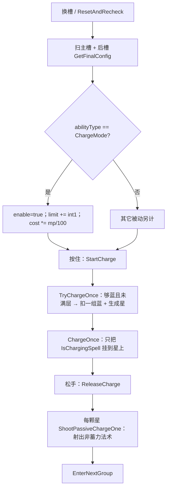

# 蓄力模式（Spell4004 / ChargeMode）逆向分析

> 范围：仅玩家被动符文「蓄力模式」（`abilityType = 4004`，配置 ID `40041–40043`）。重点是**按住怎么攒星、松手怎么射星**，以及**耗蓝修正 / 层数怎么叠**。
> 不展开遗物 / 诅咒逐条来源。闪耀星矢 / 超新星的暴击曲线、档位特效只写挂接点，公式见《闪耀星矢逆向分析.md》。魔导书 `2005` 有自己的挂星，不拆。
> 方法：`SpellConfig.json` + 反编译 `Assembly-CSharp` 交叉验证。未标注「推测」的结论均有代码/数据直接证据。
> 这张卡是法杖级被动。扫描和攒星主路径在 `Wand`；星星是 Mono + `Spell4004StartData`，挂上去的法术走 ECS。
> 配套：总览见《魔法工艺法术系统逆向报告.md》，原始数值见《法术数值总表.md》，同级被动骨架见《强制冷却逆向分析.md》《储魔之匣逆向分析.md》，蓄力法术见《闪耀星矢逆向分析.md》，子弹抄 `ChargeTimer` 见《分裂逆向分析.md》。离线可开见 `蓄力模式逆向分析.html`。

---

## 1. 身份与定位


| 项 | 值 |
| --- | --- |
| 中文名 | 蓄力模式 |
| 英文名 | Charge Mode |
| 内部名 | `ChargeMode` 蓄力模式 |
| `abilityType` | `4004` / `SpellAbilityType.ChargeMode` |
| 配置 ID | `40041`（Lv1）/ `40042`（Lv2）/ `40043`（Lv3） |
| 稀有度 | 稀有（`dropType=2`） |
| `useType` | `3`（`SpellType.Passive` 被动符文） |
| 槽位消耗 | `slotCost=1`，自身 `mpCost=0`、`damage=0`、`shootCount=0` |
| 作用对象 | `haveEffecforMissileSpell=false`，`haveEffecforSummonSpell=false`（自动填槽的强化过滤用；运行时不读） |
| 合成 | Lv1→Lv2→Lv3（`canCompound`：Lv1/2=`true`，Lv3=`false`） |
| 售价（金币） | 14 / 42 / 126 |


**机制一句话**：插在法杖**任意有效槽**里的法杖级被动。装上之后，按住施法不再走 `TryShoot()`，改成「每扣一次当前组蓝，生成一颗绕枪口转的星」。蓄力法术（星矢 / 超新星）在**攒星当时**挂到星上；其余法术在**松手**时从星上射出。左右位置不决定「强化谁」——吃的是这根法杖的整条射击路径。



文案（`TextConfig_Spell` id `7140041–7140043`）三级相同，只替换 `int1`：

> 按住施法键积累法术，最多**int1**次

名称（`7040041–7040043`）：蓄力模式 / Charge Mode。底部补充 `7240041` 全空。

卡面数值行还会额外打出 `mpCostMulDivCorrection`（`SpellConfig.GetInfo` 在该字段非 0 时追加「耗蓝 ×N%」）。`float2` **不出现在文案里**。

---

## 2. 数值与叠加

### 2.1 配置表（`assets_export/SpellConfig.json`）


| ID | Level | int1 最大层数 | 耗蓝倍率 | float2（写入后未读） | 售价 | 可合成 |
| --- | --- | --- | --- | --- | --- | --- |
| 40041 | 1 | **6** | **×90%** | 0.3 | 14 | true |
| 40042 | 2 | **12** | **×80%** | 0.25 | 42 | true |
| 40043 | 3 | **24** | **×70%** | 0.2 | 126 | false |


规律：售价每级 ×3（14 / 42 / 126）。`int1` 每级 ×2（6 → 12 → 24）。耗蓝倍率每级再降 10 个百分点。`float1/3`、`int2/3` 全 0。

### 2.2 字段语义


| 字段 | 语义 | 运行时是否被读 | 置信度 |
| --- | --- | --- | --- |
| **`int1`** | 最大攒星数；多张**相加**写入 `passiveChargeCountLimit` | 是 | 高 |
| **`mpCostMulDivCorrection`** | 法杖耗蓝连乘；`passiveMpCostCorrection *= 该值/100` | 是 | 高 |
| **`float2`** | 写入 `passiveChargeInterval = Min(..., float2)` | 字段被写，**之后全工程零读取** | 高 |
| float1 / float3 / int2 / int3 | 配置为 0 | **未读** | 高 |
| `haveEffecforMissileSpell` / `haveEffecforSummonSpell` | 表上均为 `false` | 仅自动填槽的强化过滤；`ChargeMode` 分支 **不读** | 高 |


没有 `Spell4004*Job`。星星是 `Spell4004ChargeStars`（Mono）+ `Spell4004StartData`（ECS 影子实体）。挂上去的法术才进弹体 ECS。

`passiveChargeInterval` 是 `private`，只在 `CheckWandSlotPassiveEffect` 里被 `Mathf.Min` 写入。`TryChargeOnce` 把间隔写成 `WandShootInterval`，**不读**这份 float。旧表《法术能力类型字段语义表》把 `float2` 标成「蓄力间隔(秒)」，和运行时不一致。

### 2.3 层数加算，耗蓝连乘，不是取 max

```711:716:decompiled/Assembly-CSharp/Wand.cs
			case SpellAbilityType.ChargeMode:
				passiveChargeEnable = true;
				passiveMpCostCorrection *= spell.mpCostMulDivCorrection / 100f;
				passiveChargeCountLimit += spell.int1;
				passiveChargeInterval = Mathf.Min(passiveChargeInterval, spell.float2);
				break;
```

循环里没有「已处理过同类型就跳过」。同类型出现几次加几次、乘几次。无上限、无「只取最高级」。

耗蓝底数从 `1` 乘；层数从 `0` 加。没有这张卡时 `passiveChargeEnable = false`，输入走普通 `TryShoot()`。


| 槽位 | 层数 | 耗蓝连乘 | 说明 |
| --- | --- | --- | --- |
| 无 | 0 | 1 | 普通射击 |
| 1×Lv1 | 6 | **×0.90** | |
| 1×Lv2 | 12 | **×0.80** | |
| 1×Lv3 | 24 | **×0.70** | |
| 2×Lv1 | 6+6=**12** | 0.9×0.9=**×0.81** | 层数追平 Lv2，耗蓝略贵 |
| Lv1+Lv2 | 18 | ×0.72 | 比 1×Lv3 层数少、更省蓝 |
| 2×Lv2 | 24 | ×0.64 | 层数追平 Lv3，更省蓝，占两槽 |


合成的意义是**省槽**。两张低级在层数上可以替代一张高级；耗蓝连乘没有「一张高级 = 两张低级」这种整齐关系。

写入时机：`ResetAndRecheck` / `ProcessSharedSpell` 里先解析拟态、魔能升阶，再 `CheckWandSlotPassiveEffect`。每次重算都先把 `enable=false`、`limit=0`、`interval=∞`、`cost=1`，再扫一遍。

### 2.4 攒星节奏吃的是法杖施法间隔，不是 float2

`Wand.Update` 每帧 `ChargeControlUpdate` → `TryChargeOnce`。成功攒一颗之后：

```
ShootIntervalTimer = WandShootInterval
```

下一颗要等 `CanShootCurrentGroup()`：`ShootIntervalTimer ≤ 0` 且 `CoolingTimer ≤ 0`，再扣得起一组蓝。

`WandShootInterval` = 杖底 `shootInterval` + 被动加减，再乘慢杖诅咒 / 静止专注。这张卡自己的 `shootIntervalAddSubRevise` 是 0，**不改**这份间隔。杖底间隔是 0 时，蓝够就可以每帧攒一颗，直到顶层。

### 2.5 耗蓝进 `GetWandMpCorrection`，不是 EnhanceList

```2671:2681:decompiled/Assembly-CSharp/Wand.cs
	public float GetWandMpCorrection()
	{
		float num = 1f;
		num *= (float)WandCfg.costCorrection / 100f;
		num *= passiveMpCostCorrection;
		num *= PlayerMgr.Inst.MpCostRatioFromWandAbility();
		if (PlayerMgr.Inst.ItemCtrller.curseCfg_CostCorrection != null)
		{
			num *= (float)PlayerMgr.Inst.ItemCtrller.curseCfg_CostCorrection.int1.result / 100f;
		}
		return num;
	}
```

组蓝耗 `GetGroupManaCost_FinalPlayerValue` 会 `MulRatio(GetWandMpCorrection())`。节能模式 / 齐射 / 分裂的 `mpCostMulDivCorrection` 在**另一层**（Enhance / 组公式），见 5.5。

`GetWandAllEnhanceMpCorrection` 只扫 `useType == Enhance`，**不读**这张 Passive。

### 2.6 魔能升阶抬的是这张卡的等级

`CheckWandSlotPassiveEffect` 取 `GetFinalConfig()`。`SpellLevelEnhance`（魔能升阶）先把槽位的 `slotSpellExtraLevel` 加上，`GetFinalLevelId` 再把 `40041` 抬成 `40042` / `40043`。叠加规则不变，变的是送进加算 / 连乘的 `int1` 和耗蓝倍率。

---

## 3. 主路径（核心）

### 3.1 输入分流：有这张卡就不走 TryShoot

`PlayerController.Shoot()` 每帧在按住时：

```743:743:decompiled/Assembly-CSharp/PlayerController.cs
		flag = ((!PlayerMgr.Inst.SelectedWand.passiveChargeEnable) ? PlayerMgr.Inst.SelectedWand.TryShoot() : WandChargeEffect(chargeStart: true));
```

`WandChargeEffect(true)`：还没在蓄力就 `StartCharge()`；已经在蓄力则空操作。它**永远返回 false**。按住期间的攒星不靠这里连打，靠 `Wand.Update` → `ChargeControlUpdate`。

松手：`ShootCanceld` → `WandChargeEffect(false)` → `ReleaseCharge()`。换杖（`PlayerMgr` 选杖）、改槽（`ResetAndRecheck` 若正在蓄力）、部分 UI 关界面，也会走松手。

### 3.2 开始蓄力

`StartCharge`：

1. 从对象池取出 `EF_WandChargeMagicCircle`（`Spell4004ChargeController`），开环绕特效和循环音。
2. 立刻 `TryChargeOnce()`（第一颗不必再等一帧）。

`IsCharging` 就是 `chargeAura` 非空。

满层时 `chargeAura.WandFullCharge()`：关掉 `normalCharge`，打开 `fullCharge`。只换圈，不停攒（已经满了，`TryChargeOnce` 也不会再扣蓝）。

### 3.3 攒一颗星：先扣整组蓝，再拆开发射

```2604:2616:decompiled/Assembly-CSharp/Wand.cs
	public void TryChargeOnce()
	{
		if (CanShootCurrentGroup() && ChargeStars.Count < passiveChargeCountLimit)
		{
			float groupManaCost_FinalPlayerValue = currentShootGroup.GetGroupManaCost_FinalPlayerValue(this);
			CostMp(groupManaCost_FinalPlayerValue);
			ChargeOnce();
			ShootIntervalTimer = WandShootInterval;
		}
		if (ChargeStars.Count >= passiveChargeCountLimit)
		{
			chargeAura.WandFullCharge();
		}
	}
```

门禁和普通射击同一套：`CanShootIgnoreMp`（间隔 / 冷却 / 持续施法锁）+ 当前组 MaxMP 够 + 当前蓝够。付不起当前组会 `EnterNextGroup(false)` 跳组，和 `TryShoot` 一样。

`ChargeOnce` 做两件事：

1. 生成 `EF_WandChargeStars`，绕枪口转（半径随已有星数略变大；方向随机）。`Initialized` 时创建一个只有 `LocalTransform` + `Spell4004StartData` 的 ECS 实体，`Released = false`。
2. **复制当前组**，只留下 `abilityType.IsChargingSpell()` 的条目，立刻 `ShootNormalSlotsSpellGroup`。SIP 里 `ChargeStar = 这颗星`，`Shooter = 星的 Entity`。

```2376:2383:decompiled/Assembly-CSharp/SpellTools.cs
	public static bool IsChargingSpell(this SpellAbilityType abilityType)
	{
		if (abilityType != SpellAbilityType.ShiningStar)
		{
			return abilityType == SpellAbilityType.SuperNova;
		}
		return true;
	}
```

只认闪耀星矢 `1026` 和超新星 `1027`。组里没有这两种时，星星仍然生成，只是当时不发射任何东西。

### 3.4 松手：每颗星再打一次「非蓄力」半组

`ReleaseCharge`：

1. `ShootPassiveCharge`：对当时列表里的每颗星调用 `ShootPassiveChargeOne`。
2. 射出过至少一颗（`Count > 0`，在清空之前记下）则 `EnterNextGroup(true)`，并播 `spell4004Shoot`。
3. `CancelCharge`：停圈、回收还挂在列表里的星（正常路径此时列表已空）。

`ShootPassiveChargeOne` 同样复制当前组，但过滤条件相反：`!IsChargingSpell()`。从**星星当前位置**朝当前瞄准方向发射。SIP 同样带 `ChargeStar` 和 `Shooter = 星.Entity`。打完 `star.Release()`（`Spell4004StartData.Released = true`），再从 `ChargeStars` 里移除。

所以同一组蓝在攒星时已经付过了。松手不再扣蓝。一组里同时有星矢和魔法弹时：

| 时机 | 发出去的 |
| --- | --- |
| 攒星当时 | 星矢 / 超新星，贴在这颗星上继续蓄 |
| 松手 | 魔法弹等其余法术，从星的位置飞出 |
| 星 `Released` | 贴在星上的星矢结束蓄力，按《闪耀星矢逆向分析.md》飞出去 |

只有星矢、没有普通弹：松手半组是空的，仍然 `Release()` 星星，星矢照样结束蓄力。

只有普通弹、没有星矢：攒星当时半组是空的，松手才从每颗星各打一组普通弹。视觉上就是「按住攒发射次数」。

### 3.5 后坐、回响、切组

`ShootPassiveCharge` 在打完所有星之后 `ApplyShootGroupRecoil` 一次（按当前组），不是每颗星后坐一次。

`!fromEcho` 时先 `WandExtend.TryTriggerEchoEffect`：让**其它**带回响的杖 `TryShoot(fromEcho: true)`。回响杖即使自己也插了蓄力模式，走的仍是 `TryShoot`，**不**再攒星。见 5.8。

`EnterNextGroup(true)`：还有下一组只写 `ShootIntervalTimer`；已经是最后一组则写 `CoolingTimer = max(0.015, WandCoolDown)`（低帧另有地板）。强制冷却吃的是这里，见《强制冷却逆向分析.md》。

### 3.6 星星自己的寿命

`Spell4004ChargeStars.Update`：

- 未松手：跟着枪口转，同步 `LocalTransform` 和 `WandShootDirection`。
- `NeedBreak == true`（超新星蓄满 6 秒会写，见 4.5）：对**这一颗**立刻 `ShootPassiveChargeOne`，不必等玩家松手。
- 已 `Release`：再等至少 1 帧；若登记过的持续施法实体都不在了，`Break()` 播捏碎、回池。

`AttachToStarSystem` 只给**非** `IsChargingSpell` 的挂星法术 `RegisterKeepCastingSpell`。纯星矢的星，`_keepCastingSpells` 是空的，`All()` 为空集为真，松手后约 1 帧就捏碎；星矢实体继续飞，不跟星一起销毁。

`CancelCharge` 直接回收 GameObject，不走 `ShootPassiveChargeOne`。正常松手不会走到「列表里还有星再 Cancel」；换槽时 `ResetAndRecheck` 先 `ReleaseCharge()`（会射），再重算。

---

## 4. ECS 挂星

### 4.1 星的影子实体

`Initialized` 创建的实体只有：

```4:13:decompiled/Assembly-CSharp/Spell4004StartData.cs
public struct Spell4004StartData : IComponentData, IQueryTypeParameter
{
	public UnityObjectRef<Spell4004ChargeStars> Star;
	public bool Released;
	public float3 WandShootDirection;
	public bool NeedBreak;
}
```

没有碰撞、没有伤害。`OnDisable` 销毁这个实体。

### 4.2 法术怎么知道自己挂在星上

`ShootSpellUtils.SipToSSP`：SIP 有 `ChargeStar` 就抄到 `ssp.ChargeStar` / `ChargeStarEntity`。公转类还会把 `AroundTarget` 指到星（持续施法）或玩家环绕中心。

`SpellShootSystem` 在「持续施法 / 带 `SpellChargeData`」那条生成分支里，若 `ChargeStar` 非空，给实体加可禁用组件 `SpellFromChargeModeStar`（`Star` + `StarEntity`）。星矢 / 超新星带 `SpellChargeData`，一定会进。龙息 / 分解射线 / 高压水枪（`Int3==0`）从星上射出时也会进，并被 `AttachToStarSystem` 登记进 `_keepCastingSpells`。普通魔法弹**不**走这条分支，松手飞出后就是普通弹，不再绑星。

加完后 `AttachToStarSystem`（`SpellCreateSystemGroup`，`UpdateAfter SpellShootSystem`）把 `SpellFromChargeModeStar` **禁用**（组件还在，`HasComponent` 仍为真）。`SpellChargeEndSystem` / `SuperNovaJob` 用的是 `HasComponent`，禁用不影响它们。

### 4.3 蓄力计时看的是星，不是玩家是否按住

`SpellChargeSystem` 每帧给 `ChargeTimer += dt`。关掉 `ChargingTag` 的条件是下面**三条同时不成立**：

1. 射击者是玩家，且 `holdingShoot`
2. 射击者有 `Spell4004StartData`，且 **`Released == false`**
3. 射击者有魔导书数据，且还没 `ReleaseChargeSpell`

挂在星上的星矢，`Shooter` 是星的实体。玩家松手不会单独拆掉第 2 条——要等这颗星 `Release()` 把 `Released` 置真。所以按住期间星矢在星上照常涨暴击；松手（或 `NeedBreak`）才进《闪耀星矢逆向分析.md》的结束蓄力。

`SpellKeepCastingAttachSystem`：带 `SpellFromChargeModeStar` 时，贴身位置跟星的 `LocalTransform`，方向跟星上缓存的 `WandShootDirection`。蓄力期星矢贴着星星转，不贴玩家枪口。

### 4.4 松手后的公转重绑

`SpellChargeEndSystem`（查 `ChargingTag` 已关）：若 `AbilityType == ShiningStar` 且运动是 `Rotation`，并且实体上还有 `SpellFromChargeModeStar`，把 `AroundTarget` 改绑到玩家环绕中心 / Owner。这是星矢 + 公转 + 蓄力星的交叉，曲线不在本文。

---

## 5. 和其它法术的关系

只写会改这张卡行为、或被这张卡改发射时机的交互。伤害强化 / 范围增强 / 加速器只改快照通道，不列。

### 5.1 闪耀星矢 1026 / 超新星 1027

`IsChargingSpell` 只认这两种。它们在攒星当时发射、`Shooter = 星`、`ChargingTag` 打开，暴击 / 档位按《闪耀星矢逆向分析.md》。4004 不读星矢卡上的 `float1/2/3`。

超新星 `ChargeTimer > 6` 时自己关 `ChargingTag`，若带 `SpellFromChargeModeStar`，给那颗星写 `NeedBreak = true`。该星会提前 `ShootPassiveChargeOne`（打出同组里的非蓄力半组），其它星不受影响。

### 5.2 公转 3009 / 自由公转 3117

不改攒星公式。星矢 + 公转在松手后走 4.4 的环绕重绑。加速器仍只改松手后的飞速，见《加速器逆向分析.md》。

### 5.3 分裂 3013

蓄力期 `ChargingTag` 亮着时 `UpdateDuration` 不跑，星矢在星上**不会**因寿命分裂。松手飞完（或悬停走完）才裂。

分裂时若母弹有 `SpellChargeData`，`SpellDestroySystem.Split` 把当下 `ChargeTimer` 抄进子弹。这是「活体计时例外」，不是 4004 卡自己的字段。《分裂逆向分析.md》6.6 写的「充能模式 4004」指的是这条抄计时，不是把星星再分裂一次。

### 5.4 齐射 3001 / 多重 3002

不改 4004 的层数 / 间隔。当前组里有几张可施放，攒星半组和松手半组就各带几张。齐射把多张主动塞进**同一组**，所以一颗星会把组里所有星矢一起挂上，松手再把组里所有非蓄力一起射出。组蓝耗仍按齐射公式算，再乘 4004 的 `GetWandMpCorrection`。见《齐射逆向分析.md》。

### 5.5 节能模式 3104

节能的耗蓝在 Enhance 层 `MulRatio(mpCostMulDivCorrection/100)`，4004 在法杖层再乘 `passiveMpCostCorrection`。两张同场是**先组内乘、再乘杖修正**。节能还砍伤和持续，4004 不砍。见《节能模式逆向分析.md》。

### 5.6 储魔之匣 4002 / 强制冷却 4006

匣只改 `MaxMP`，不改这张卡的层数。组耗蓝变贵或变便宜之后，`CanShootCurrentGroup` / 每颗星扣蓝跟着变。见《储魔之匣逆向分析.md》。

强制冷却不改攒星间隔。松手后若这是最后一组，`EnterNextGroup` 写入的 `CoolingTimer` 才吃 `coolDownRatio`。见《强制冷却逆向分析.md》。

### 5.7 时长强化 / 悬停

不改攒星。星矢在星上寿命冻结；松手后才扣 Duration / 悬停第二段。见《时长强化逆向分析.md》《悬停逆向分析.md》。

### 5.8 回响符文 4008

松手时源杖 `TryTriggerEchoEffect`：其它杖按 `passiveEchoShootChance` 各自 `TryShoot(fromEcho)`。回响**绕过** `passiveChargeEnable` 分流，即使目标杖也插了 4004，这一发也不攒星。免费回响只看目标杖自己的 `passiveEchoFreeShootChance`。

### 5.9 四向射击法杖

`ChargeOnce`（挂星矢）**没有**四向分支，只打一发。`ShootPassiveChargeOne`（松手非蓄力）有：四个 90°+45° 方向各打半组，起点都是这颗星。后坐仍按一组算一次。

### 5.10 法杖之魂 4005

`SpellWandSpiritShootSystem`：杖灵就绪且这根杖 `passiveChargeEnable` 时，未满层就 `StartCharge` / `TryChargeOnce`，满层立刻 `ReleaseCharge`。玩家不用按住。第一拍 `StartCharge` 里已经 `TryChargeOnce` 过一次，紧接着又调一次，但 `ShootIntervalTimer` 已写入，第二次通常被门禁挡掉。不拆杖灵追敌。

`Teammate52` / 星矢 Mono：`targetWand.passiveChargeCountLimit > 0` 时 `AutoFire(0)`，不等到暴击阈值。只点入口。

### 5.11 后槽

后槽照常按充能条自己打，**不**走攒星。后槽里的星矢本身就不开 `ChargingTag`（见《闪耀星矢逆向分析.md》8.7）。

4004 插在后槽仍然会把整根杖的 `passiveChargeEnable` 打开——主槽射击改成攒星。后槽那张卡的 `int1` / 耗蓝同样进同一份扫描。

### 5.12 全域强化 4010

`[全域][蓄力模式]` 会把右边这张复制到其它法杖。复制过去的槽同样走 `GetFinalConfig` + `ChargeMode` 扫描。等级封顶是全域自己的规则，不拆。

自动填槽：`AppendPassiveSpells` 只要求 `useType == Passive` 且不在 `IgnoreSpells`。4004 不在忽略表、不在晶石自斥表。手摆和自动都可以叠多张。

---

## 6. Mono 残留轨对照

玩家主路径是 ECS。Mono `IHoldingSpell.NeedSkipHolding`：SIP 上有 `ChargeStar`（且不是分裂 / 由法术派生）则视为跳过蓄力，立刻 `StopHolding()`。`SpellBase` 初始化里对 `ChargeStar` 只有一次空读取。

也就是说：若某发星矢走 Mono 且带着蓄力星引用，**不会**再走一套按住涨暴击。ECS 主轨以 `SpellChargeSystem` + 星的 `Released` 为准。

`SpellBase.ApplyEnhanceSpell` **没有** `ChargeMode` 分支。这张卡不进 EnhanceList。

---

## 7. 证据索引


| 文件 | 作用 |
| --- | --- |
| `Wand.CheckWandSlotPassiveEffect` | `enable` / 层数加算 / 耗蓝连乘 / `float2` 写入未读字段 |
| `Wand.CheckWandManaRelatePassiveEffect` | 只再乘耗蓝；不重置、不改 enable / 层数 |
| `Wand.GetWandMpCorrection` | 杖修正 × `passiveMpCostCorrection` |
| `Wand.GetWandAllEnhanceMpCorrection` | 只扫 Enhance，不含 4004 |
| `Wand.StartCharge` / `ReleaseCharge` / `CancelCharge` | 开圈 / 松手射星 / 回收 |
| `Wand.TryChargeOnce` / `ChargeOnce` | 扣组蓝、生成星、挂 `IsChargingSpell` |
| `Wand.ShootPassiveCharge` / `ShootPassiveChargeOne` | 松手打非蓄力半组 |
| `Wand.ChargeControlUpdate` | 每帧尝试再攒一颗 |
| `Wand.WandShootInterval` | 真正的攒星间隔 |
| `Wand.EnterNextGroup` | 松手后写间隔或冷却 |
| `PlayerController.Shoot` / `WandChargeEffect` / `ShootCanceld` | 按住分流、松手释放 |
| `PlayerMgr` 选杖 | 换杖时若在蓄力则 `ReleaseCharge` |
| `SpellTools.IsChargingSpell` | 只认星矢 / 超新星 |
| `Spell4004ChargeStars` | 绕转、影子实体、`NeedBreak`、捏碎 |
| `Spell4004ChargeController` | 普通圈 / 满层圈 |
| `Spell4004StartData` / `SpellFromChargeModeStar` | ECS 数据 |
| `Spell4004AttachToStarSystem` | 非蓄力挂星登记后禁用 tag |
| `ShootSpellUtils.SipToSSP` | `ChargeStar` 抄进快照；环绕目标 |
| `SpellShootSystem` | 给持续施法 / 蓄力法术加 `SpellFromChargeModeStar` |
| `SpellChargeSystem` | `Released==false` 时星上的法术继续蓄 |
| `SpellChargeEndSystem` | 星矢 + 公转松手重绑 `AroundTarget` |
| `SpellKeepCastingAttachSystem` | 蓄力期贴星走 |
| `SuperNovaJob` | `ChargeTimer>6` 写 `NeedBreak` |
| `SpellDestroySystem.Split` | 母弹 `ChargeTimer` 抄给子弹 |
| `SpellWandSpiritShootSystem` | 杖灵满层自动松手 |
| `WandExtend.TryTriggerEchoEffect` | 松手触发其它杖 `TryShoot` |
| `IHoldingSpell.NeedSkipHolding` | Mono：有 `ChargeStar` 则跳过蓄力 |
| `SpellAutoFullTool.AppendPassiveSpells` | 当 Passive 填；不自斥、不忽略 |
| `SpellConfig.GetDes` / `GetInfo` | 文案替换 `int1`；数值行打出耗蓝 ×% |
| `SpellConfig.json` `40041–40043` | 配置原始值 |
| `TextConfig_Spell` `704004*` / `714004*` | 名称与机制文案 |


---

## 8. 待决 / 局限

1. **`float2` / `passiveChargeInterval`**：全工程写入后零读取。若后续版本重新接上，语义才是「蓄力间隔(秒)」。当前以 `WandShootInterval` 为准。
2. **扩槽旁路**：`CheckWandManaRelatePassiveEffect` 对 ChargeMode 再 `*=` 耗蓝，且**不先置回 1**。`PlayerMgr` 扩槽走这条。主路径 `ResetAndRecheck` 会完整重扫。未对扩槽全路径核对会不会把耗蓝乘两次。
3. **魔导书 2005**：`SpellChargeSystem` 第三条是书的 `ReleaseChargeSpell`，和 4004 平行。挂星实现不在本文。
4. **杖灵双调用**：`StartCharge` + 紧接着的 `TryChargeOnce` 在间隔为 0 的杖上是否能同一拍攒两颗，未逐帧核。
5. **全域复制等级封顶**：只点入口，不拆全域自己的规则。
6. **四向 + 星矢**：挂星只有一发、松手非蓄力有四向，是否为设计如此，代码就是这样，没有反证。
