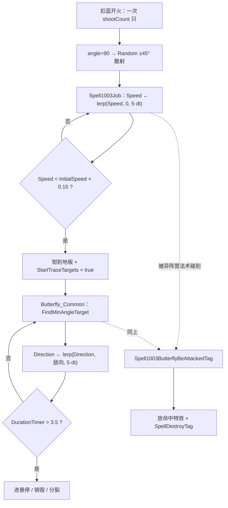

# 蝴蝶（Spell1003 / Butterfly）逆向分析

> 范围：仅玩家主动法术「蝴蝶」（`abilityType = 1003`，配置 ID `10031–10033`）。同 `abilityType` 的怪物换皮弹 `90121`（蝙蝠）不在本文范围。
> 方法：`SpellConfig.json` + 反编译 `Assembly-CSharp` 交叉验证。未标注「推测」的结论均有代码/数据直接证据。
> 主路径：玩家施法走 **ECS**（`Spell1003ButterFlySystem` + `SpellMoveJob`）。Mono `Spell1003Butterfly` 为残留轨，第 9 节单独对照。
> 配套：总览见《魔法工艺法术系统逆向报告.md》，原始数值见《法术数值总表.md》。离线可开见 `蝴蝶逆向分析.html`。
> **本文是飞弹侧的第一篇文档**，第 7 节对已逆向的 21 张增强符文做了逐一校验，并列出需要回写既有文档的 5 处。

---

## 1. 身份与定位

| 项 | 值 |
| --- | --- |
| 中文名 | 蝴蝶 |
| 英文名 | Butterfly |
| `abilityType` | `1003` / `SpellAbilityType.Butterfly` |
| 配置 ID | `10031`（Lv1）/ `10032`（Lv2）/ `10033`（Lv3） |
| 文案 ID | 名 `701003x` / 机制 `711003x`（**三级全空**）/ 风味 `7210031` / 短评 `7310031` |
| 稀有度 | 普通（`dropType=1`） |
| `useType` | `0`（Missile 主动飞弹） |
| 槽位 / 蓝耗 | `slotCost=1`；`mpCost` = 8 / 11 / 15（**整发总价**，见 2.3） |
| 单只伤害 | `damage` = 10 / 18 / 34 |
| 每发只数 | `shootCount` = 3 / 4 / 5 |
| 飞行 | `speed=15`，`duration=3.5`，`angle=90`，`knockback=0.5` |
| 关键字段 | `float1=5`（减速率）、`float2=0.15`（速度地板比） |
| 预制体 | 三级共用 `prefab="10031"`，图标 `1003` |
| 合成 | Lv1→Lv2→Lv3（`canCompound`：Lv1/2=`true`，Lv3=`false`） |
| 售价（金币） | 6 / 18 / 54 |
| 复杂度 | `CalculateSpellComplexity` 记 3 分（与滚球、激光、霰弹同档） |

**机制一句话**：一发射出 3~5 只蝴蝶，在 90° 扇形内随机散开；出膛后按指数曲线减速，掉到初速的 **15%** 时相变为追踪态，锁定最小夹角敌人以硬编码 `5f·dt` 的速率转向；躯体脆弱，被**任何异阵营法术实体**碰到即当场销毁。



文案（`TextConfig_Spell`）：

- 名称 `7010031–7010033`：蝴蝶 / Butterfly（三级同名）
- 机制 `7110031–7110033`：**三级全为空字符串**——游戏内不解释减速转追踪，也不解释脆弱
- 风味 `7210031`：> 注入魔力的蝴蝶会被怪物的气息吸引，但脆弱的身体禁不住其他法术的干扰。
- 短评 `7310031`：> 数只会追踪敌人的脆弱蝴蝶

风味文案的两半各自对应一条真机制：「被怪物的气息吸引」= 追踪态，「禁不住其他法术的干扰」= 第 5 节的脆弱销毁。

---

## 2. 数值结构

### 2.1 配置表原始值（`assets_export/SpellConfig.json`）

| ID | Level | damage | shootCount | mpCost | speed | duration | angle | knockback | float1 | float2 | 售价 | 可合成 |
| --- | --- | --- | --- | --- | --- | --- | --- | --- | --- | --- | --- | --- |
| 10031 | 1 | **10** | **3** | 8 | 15 | 3.5 | 90 | 0.5 | 5 | 0.15 | 6 | true |
| 10032 | 2 | **18** | **4** | 11 | 15 | 3.5 | 90 | 0.5 | 5 | 0.15 | 18 | true |
| 10033 | 3 | **34** | **5** | 15 | 15 | 3.5 | 90 | 0.5 | 5 | 0.15 | 54 | false |

规律：升级同时抬 `damage` 和 `shootCount`，所以**整发伤害是两个乘数一起长**；`float1` / `float2` / `speed` / `duration` / `angle` / `knockback` 三级完全不变，`float3`、`int1/2/3`、`radius`、`gravity`、`upSpeed`、`summonID` 全 0。`isDPS=false`、`isKeepCasting=false`、`isParentTypeSpell=false`、`isSplitSpell=false`、`needActivate=false`。

`haveEffecforMissileSpell` / `haveEffecforSummonSpell` 两个字段都是 **false**——它们只对 `useType=2` 的强化符文有意义，主动法术这两位不被任何逻辑读取。

### 2.2 字段语义

| 字段 | 语义 | 置信度 | 证据 |
| --- | --- | --- | --- |
| **float1 = 5** | 减速率。`Speed ← lerp(Speed, 0, float1 · dt)`，即连续域 `v(t) = v₀·e^(−5t)` | 高 | `Spell1003ButterFlySystem` L429；Mono L39 |
| **float2 = 0.15** | 速度地板比。地板 = `InitialSpeed × float2`，触达即置 `StartTraceTargets` | 高 | 同上 L430–433；另被 `SpellGroupAttackDistanceCalculator` L259 用于射程估算 |
| **angle = 90** | 本发散射锥角；进 `GetSpellScatter` 的底数 | 高 | `SpellShootData.GetSpellScatter`；`CalculateRandomAngle` L631 |
| **shootCount = 3/4/5** | 单次施放生成的实体数；同时是蓝耗除数 | 高 | `GetSpellFinalCount_FinalPlayerValue` L37；`SipToSSP` L215 |
| **knockback = 0.5** | 击退，全表偏低（对比 90121 蝙蝠的 5.0） | 高 | 配置 |
| float3 / int1–3 / radius | 恒 0，无引用 | 高 | 配置 + 全工程检索 |
| `haveEffecfor*` | 主动法术不读 | 高 | 仅出现在 `SpellAutoFullTool` 的强化过滤 |

追踪态的**转向速率 `5f` 与重选目标不写在配置里**，是 `Butterfly_Common` 里的硬编码字面量。这一点很重要：蝴蝶的机动性无法通过任何配置字段调节，只能被自动导航整体顶替（见 7.1）。

### 2.3 蓝耗是整发价，不是单只价

`SipToSSP` 把整发蓝耗按最终只数均摊到每个实体：

```215:215:decompiled/Assembly-CSharp/ShootSpellUtils.cs
		spellSpawnParams.ManaCost = spellManaCost_FinalPlayerValue.Result / (float)spellFinalCount_FinalPlayerValue;
```

只数来自法术自己的 `shootCount`：

```35:40:decompiled/Assembly-CSharp/SpellShootDataExtend.cs
	public static int GetSpellFinalCount_FinalPlayerValue(this SpellShootData self, [CanBeNull] Wand wand, bool considerSplit = true)
	{
		int shootCount = self.Spell.GetFinalConfig().shootCount;
		int num = 1;
		int num2 = 0;
		int num3 = self.GetSpellMultiShootData().count;
```

所以 `mpCost = 8` 是「3 只一共 8 蓝」，不是「每只 8 蓝」。

### 2.4 每级性价比

| Level | 整发伤害 | 蓝耗 | 伤害/蓝 | 单只蓝耗 | 售价 |
| --- | --- | --- | --- | --- | --- |
| 1 | 10 × 3 = **30** | 8 | 3.75 | 2.67 | 6 |
| 2 | 18 × 4 = **72** | 11 | 6.55 | 2.75 | 18 |
| 3 | 34 × 5 = **170** | 15 | 11.3 | 3.00 | 54 |

整发伤害 Lv1→Lv3 涨 **5.67 倍**，蓝耗只涨 1.88 倍。这是三级主动法术里升级收益偏高的一档，原因是 `damage` 和 `shootCount` 同时递增。

---

## 3. 核心机制：减速—相变—追踪

### 3.1 ECS 的两段式

减速与相变判定单独一个 System，和弹道分派解耦：

```420:437:decompiled/Assembly-CSharp/Spell1003ButterFlySystem.cs
		private void Execute(ref SpellConfigComponentData config, ref SpellMovementComponentData movement, ref Spell1003ButterflyData data)
		{
			if (!data.IsInitialize)
			{
				data.IsInitialize = true;
				data.InitialSpeed = movement.Speed;
			}
			if (!data.StartTraceTargets && !movement.IsFallSpell)
			{
				float num = math.lerp(movement.Speed, 0f, config.Float1 * DeltaTime);
				if (num < data.InitialSpeed * config.Float2)
				{
					num = data.InitialSpeed * config.Float2;
					data.StartTraceTargets = true;
				}
				movement.Speed = num;
			}
		}
```

四个要点：

1. **`InitialSpeed` 是首帧从 `movement.Speed` 抓的**，不是配置 `speed`。所以它已经含了加速器、法杖速度修正等一切发射期加成（见 7.4）。
2. **地板是相对值**。`InitialSpeed × 0.15`，不是绝对 `0.15`。这是玩家版与怪物版的分界（Mono 非玩家分支用绝对值，见第 9 节）。
3. **`StartTraceTargets` 是单向闩锁**。一旦置真，整个 `if` 块永久跳过——蝴蝶不会再减速，也不会回到直飞态。
4. **坠落态被 `!movement.IsFallSpell` 完全排除**。这是 7.3 的根因。

状态存在一个三字段组件上，由 Authoring 在预制体烘焙时挂：

```1:10:decompiled/Assembly-CSharp/Spell1003ButterflyData.cs
using Unity.Entities;

public struct Spell1003ButterflyData : IComponentData, IQueryTypeParameter
{
	public float InitialSpeed;

	public bool IsInitialize;

	public bool StartTraceTargets;
}
```

`IsInitialize=false` / `StartTraceTargets=false` 是烘焙初值（`Spell1003ButterflyAuthoring` L11–17），所以**任何由这个预制体生成的新实体都会从头跑一遍完整周期**——包括分裂子弹（见 7.5）。

### 3.2 相变时刻与飞行距离

连续域解 `v(t) = v₀·e^(−5t)`，令 `v = 0.15·v₀`：

```
t_相变 = ln(1 / 0.15) / 5 = 1.897 / 5 ≈ 0.379 s
```

**相变时刻与 `v₀` 无关**，只由 `float1` 和 `float2` 决定。三级、任何加速器档位下都是约 0.38 秒。

减速段位移 `∫₀^0.379 v₀·e^(−5t) dt = (v₀/5)·(1 − 0.15) = 0.17·v₀`：

| 项 | 默认（v₀=15，duration=3.5） |
| --- | --- |
| 相变时刻 | 0.379 s |
| 速度地板 | 15 × 0.15 = **2.25 m/s** |
| 减速段位移 | 0.17 × 15 = **2.55 m** |
| 追踪段时长 | 3.5 − 0.379 = **3.12 s** |
| 追踪段位移 | 2.25 × 3.12 = **7.02 m** |
| 总航程 | ≈ **9.6 m** |

追踪段占了 89% 的寿命，但只占 73% 的航程——蝴蝶绝大部分时间在以 2.25 m/s 慢速盘旋，这是它能持续修正方向命中移动目标的原因，也是它「投射距离短」的原因。

### 3.3 追踪态的转向

```940:956:decompiled/Assembly-CSharp/SpellMoveJob.cs
	private void Butterfly_Common(ref SpellMovementComponentData movement, ref PhysicsVelocity velocity, ref SpellConfigComponentData config, Entity spell, LocalTransform transform)
	{
		if (ButterFlyDataLookUp[spell].StartTraceTargets)
		{
			bool hasTarget = false;
			float3 targetPosition = float3.zero;
			GetValidChaseEnemyPosition(ref movement, in config, in transform, out hasTarget, out targetPosition);
			if (hasTarget)
			{
				float3 end = DTool.IgnoreZDir(in targetPosition, in transform.Position);
				movement.Direction = math.lerp(movement.Direction, end, 5f * DeltaTime);
				velocity.Linear = math.lerp(velocity.Linear, movement.Direction * movement.Speed, 5f * DeltaTime);
				return;
			}
		}
		velocity.Linear = movement.Direction * movement.Speed;
	}
```

- **转向是按时间的 lerp，不是按路程的 `DirMoveTowards`。** 这和自动导航那套「`maxDelta = 速度 × 角速度 × dt`」是两种不同的模型：蝴蝶的转向快慢**不随速度变化**，`5f·dt` 的插值系数意味着约 0.2 秒收敛过半。速度慢反而让它转弯半径极小。
- `movement.Direction` 走 `lerp` 而非归一化插值，中间帧的 `Direction` 模长会短于 1；但 `velocity.Linear` 另有一条 lerp，两条叠加的净效果是速度矢量平滑追向目标。
- **没有目标时退化成直飞**（末行），并且**不重置 `StartTraceTargets`**——房间清空后蝴蝶继续以地板速度直线飞完剩余寿命。
- 目标由 `GetValidChaseEnemyPosition` 提供：先验证 `movement.ChaseTarget` 仍存在且 `CanBeTarget`，失效才 `FindMinAngleTarget` 重锁。是**最小夹角**、不是最近，且**粘住不换**。

```1081:1099:decompiled/Assembly-CSharp/SpellMoveJob.cs
	private void GetValidChaseEnemyPosition(ref SpellMovementComponentData movement, in SpellConfigComponentData config, in LocalTransform transform, out bool hasTarget, out float3 targetPosition)
	{
		hasTarget = false;
		targetPosition = float3.zero;
		Entity target;
		float3 targetPosition2;
		UnitProperty_Dots targetPpt;
		if (TransformLookup.TryGetComponent(movement.ChaseTarget, out var componentData) && UnitPropertyLookUp.TryGetComponent(movement.ChaseTarget, out var componentData2) && componentData2.CanBeTarget)
		{
			targetPosition = componentData.Position;
			hasTarget = true;
		}
		else if (CurrentRoomEntities.FindMinAngleTarget(transform.Position, movement.Direction, config.ShooterType, out target, out targetPosition2, out targetPpt))
		{
			hasTarget = true;
			targetPosition = targetPosition2;
			movement.ChaseTarget = target;
		}
	}
```

### 3.4 System 执行顺序

| System | 所属组 | 频率 |
| --- | --- | --- |
| `SpellMoveSystem`（含 `Butterfly_Common`） | `SpellPhysicsSystemGroup` ⊂ `FixedStepSimulationSystemGroup` | 固定步长，每帧 0~n 次 |
| `Spell1003ButterFlySystem`（减速/相变） | `SpacialSpellSystemGroup` ⊂ `SpellSimulationSystemGroup` | 每渲染帧 1 次 |
| `Spell1003ButterFlyBeAttackedSystem`（脆弱销毁） | `UnitTakeDamageGroup`，`UpdateAfter(SpellTakeDamageResultSystem)` | 每渲染帧 1 次 |

`SpellSimulationSystemGroup` 标了 `UpdateAfter(VariableRateSimulationSystemGroup)` + `UpdateBefore(UnitTakeDamageGroup)`，所以一帧内的顺序是：**物理位移 → 减速/相变 → 脆弱销毁**。

减速用的是 `state.WorldUnmanaged.Time.DeltaTime`（可变帧时长），位移消费在固定步长里。这个错配的后果见第 11 节。

### 3.5 `Spell1003BodyFlipJob`：纯表现

同一个 System 里还挂了第二个 Job，按 `lastFramePos.x` 与当前 x 的差决定 `PostTransformMatrix` 的 x 缩放正负，即蝴蝶朝哪飞就朝哪翻转贴图。查询的是 `Spell1003BodyTag`（挂在子物体上，不是弹体本身），**不影响任何数值**。Mono 侧对应 `FilpModel` 的 localScale 翻转（L86–93）。

---

## 4. 弹道分派：三条路，其中一条不存在

`SpellMoveJob.Execute` 先按 `movement.Type` 分派，再按 `config.AbilityType` 细分。蝴蝶在三种运动类型下的归属：

| `SpellSpecialMovementType` | 由谁写入 | 蝴蝶走哪个函数 |
| --- | --- | --- |
| `Normal`（默认） | — | **`Butterfly_Common`**（专属，L268） |
| `ChaseMouse` | 寻踪 `AroundMouse` | **`Butterfly_Mouse`**（专属，L368） |
| `Rotation` | 公转 `AroundOwner` | `Normal_Rotation`（通用 default） |
| `ChaseEnemy` | 自动导航 `FollowTarget` | **无 case → `Normal_ChaseTarget`**（通用 default，L473） |
| `ChaseOwner` | 自我追踪 | 同上 |

```262:269:decompiled/Assembly-CSharp/SpellMoveJob.cs
			switch (movement.Type)
			{
			case SpellSpecialMovementType.Normal:
				switch (config.AbilityType)
				{
				case SpellAbilityType.Butterfly:
					Butterfly_Common(ref movement, ref velocity, ref config, spellEtt, transform);
					break;
```

`ChaseMouse` 下的专属分支只做一件事：把通用 `Normal_Mouse` 的插值系数乘 4。

```655:660:decompiled/Assembly-CSharp/SpellMoveJob.cs
	private void Butterfly_Mouse(ref LocalTransform transform, ref SpellMovementComponentData movement, ref PhysicsVelocity velocity)
	{
		float3 end = DTool.IgnoreZDir(in MousePosition, in transform.Position) * movement.Speed;
		velocity.Linear = math.lerp(velocity.Linear, end, movement.Speed * DeltaTime * movement.ChaseMouseLerpSpeed * 4f);
		movement.Direction = math.normalize(velocity.Linear);
	}
```

对比 `Normal_Mouse`（L632–642）：完全一致，只差末尾的 `* 4f`。这个 4 倍是补偿——蝴蝶追踪态速度只有 2.25 m/s，而 `Normal_Mouse` 的插值系数含 `movement.Speed` 因子，速度低会让跟手性极差。乘 4 把它拉回可用水平。**注意 `Butterfly_Mouse` 里没有 `StartTraceTargets` 判定**，减速段和追踪段都走同一条公式，只是 `Speed` 不同。

而 `ChaseEnemy` / `ChaseOwner` 的 switch 里**没有 Butterfly 分支**：

```423:428:decompiled/Assembly-CSharp/SpellMoveJob.cs
			case SpellSpecialMovementType.ChaseEnemy:
			case SpellSpecialMovementType.ChaseOwner:
				switch (config.AbilityType)
				{
				case SpellAbilityType.HoverTorch:
					GhostFire_ChaseTarget(ref movement, in data, ref velocity, ref config, transform, spellEtt);
					break;
```

```472:474:decompiled/Assembly-CSharp/SpellMoveJob.cs
				default:
					Normal_ChaseTarget(ref movement, in data, ref velocity, ref config, transform);
					break;
```

整段 switch（L425–475）的 case 只有 `HoverTorch` / `Meteor` / `JudgementBlade` / `MagicBreaker` / `Boomerang` / `Summon4` / `BiAnLethalBlade` / `HighPressureWasher` / `BlueRune`。蝴蝶落到 `default`，这是 7.1 那条最重要的交互的直接原因。

坠落方面蝴蝶**不特殊**：`Execute` 尾部只对 `FireBall`（走 `TrickMine_Fall`）和 `HighPressureWasher`（`Int3==0` 时跳过）开了口子，其余全部进 `Normal_Fall` + z 轴积分（L479–505）。

---

## 5. 脆弱性：被任何异阵营法术碰到即死

### 5.1 判定链

命中分类函数把「目标是一个 `abilityType == Butterfly` 的法术实体」单独归成一类：

```2775:2779:decompiled/Assembly-CSharp/SpellTools.cs
			if (componentData2.AbilityType == SpellAbilityType.Butterfly)
			{
				cmd.SetComponentEnabled<Spell1003ButterflyBeAttackedTag>(sortKey, target, value: true);
				return HitType.Butterfly;
			}
```

标记一旦启用，下一帧 `UnitTakeDamageGroup` 里的专属 System 放命中特效并打销毁标记：

```147:155:decompiled/Assembly-CSharp/Spell1003ButterFlyBeAttackedSystem.cs
		private void Execute(EnabledRefRO<Spell1003ButterflyBeAttackedTag> _, SpellConfigComponentData config, SpellComponentData data, SpellMovementComponentData movement, LocalTransform transform, [ChunkIndexInQuery] int index, EnabledRefRW<SpellDestroyTag> destroyTagRef)
		{
			ref EntityCommandBuffer.ParallelWriter endSimulationEMD = ref EndSimulationEMD;
			ref SpellSingleton spellSingleton = ref SpellSingleton;
			ref float3 position = ref transform.Position;
			float3 direction = movement.Direction;
			endSimulationEMD.CreateSpellHitEffect(index, in spellSingleton, in config, in data, in position, in direction, transform.Scale);
			destroyTagRef.ValueRW = true;
		}
```

关键性质：

- **无伤害门槛、无生命值。** 和滚球对比——滚球走 `cmd.AttackRollball(...)` 扣 `Float1` 当血条（`SpellTools` L2770–2773），蝴蝶是**一击必杀**。
- 查询带 `[WithDisabled(typeof(SpellDestroyTag))]`，所以已在销毁队列里的蝴蝶不会重复放特效。
- 走的是 `SpellDestroyTag` 这条**正常销毁路径**，不是特殊回收。这意味着被打碎的蝴蝶**照常触发分裂、结束触发器、雷霆晶石落雷**（见 7.6、7.7）。这是一个容易漏的构筑点：蝴蝶被打碎不是纯损失。

Mono→ECS 的同步侧也有两处相同写法（`UnitDotsSyncSystem` L836、L1015）：

```834:838:decompiled/Assembly-CSharp/UnitDotsSyncSystem.cs
			if (rollballConfig.AbilityType == SpellAbilityType.Butterfly)
			{
				ettMgr.SetComponentEnabled<Spell1003ButterflyBeAttackedTag>(targetEtt, value: true);
				return SpellTools.HitType.Butterfly;
			}
```

### 5.2 自己的法术不会打碎自己的蝴蝶

这是本文核验过的**否定结论**，两条路径都有阵营守卫。

ECS 侧，凡是「按范围捞可攻击实体」的入口都会先过 `RemoveCannotAttackSpell`，它只保留**异阵营**的滚球 / 蝴蝶：

```2967:2981:decompiled/Assembly-CSharp/SpellTools.cs
	internal static void RemoveCannotAttackSpell_0024BurstManaged(ref NativeList<Entity> entities, UnitType selfCamp, in ComponentLookup<SpellConfigComponentData> configLookup)
	{
		for (int i = 0; i < entities.Length; i++)
		{
			if (configLookup.TryGetComponent(entities[i], out var componentData))
			{
				SpellAbilityType abilityType = componentData.AbilityType;
				if ((abilityType != SpellAbilityType.Rollball && abilityType != SpellAbilityType.Butterfly) || DTool.IsSameCamp(componentData.ShooterType, selfCamp))
				{
					entities.RemoveAt(i);
					i--;
				}
			}
		}
	}
```

`GetEntityHitType` 自身也在蝴蝶判定**之前**就 `return HitType.SameCamp`（L2766–2769）。

Mono 侧，落雷等 tag 扫描虽然把 `"Butterfly"` 写进了检测集合，但外层有显式阵营判断：

```1633:1645:decompiled/Assembly-CSharp/SpellBase.cs
			if (thunderColliderBuffer[i].CompareTag("RollBall") || thunderColliderBuffer[i].CompareTag("Butterfly"))
			{
				SpellBase componentInParent = thunderColliderBuffer[i].GetComponentInParent<SpellBase>();
				if (!componentInParent.IsSameCamp(this))
				{
					if (componentInParent.spellCfg.abilityType == SpellAbilityType.Rollball)
					{
						((Spell1002RollBall)componentInParent).TakeDamage(damage);
					}
					else if (componentInParent.spellCfg.abilityType == SpellAbilityType.Butterfly)
					{
						((Spell1003Butterfly)componentInParent).HitEFAndRecycle();
					}
```

**结论：己方法术、己方落雷、己方伞爆都碰不掉自己的蝴蝶。** 会打碎它的是敌方弹幕，以及若干**无阵营守卫的近战式判定**——`Teammate2_FuseLeg` / `Teammate3` / `Teammate4` / `Teammate6` / `Teammate7` / `Teammate3FuseController` / `Teammate4FuseController` / `SpiderEgg` / `SpellExplosionBug` / `SpellWandInvisibleSpellBreaker` 里的 `HitEFAndRecycle()` 调用点，多数是怪物侧或队友侧的碰撞清扫。这些属于各自单位的文档范围，本文不逐条展开（见第 11 节）。

### 5.3 蝴蝶也能被当成攻击目标

反过来看 `RemoveCannotAttackSpell` 的语义：**异阵营的蝴蝶是合法攻击目标**。所以怪物的 AoE、玩家打敌方蝴蝶（若有敌方使用同 abilityType 的弹）都成立。`GetAttackableEntitiesInBox` 末尾会把范围内所有带 `SpellConfigComponentData` 的实体一并塞进候选列表（`SpellTools` L2850–2857），再由 `RemoveCannotAttackSpell` 过滤。

---

## 6. 多发与散射

### 6.1 一发 3~5 只，各自随机偏角

散射底数取本法术的 `angle`，强化卡的 `angle` 进同一个加算池：

```117:126:decompiled/Assembly-CSharp/SpellShootData.cs
	public RatioValue GetSpellScatter()
	{
		RatioValue ratioValue = new RatioValue(Spell.GetFinalConfig().angle);
		ratioValue.AddBase(OwnerGroup.GetGroupShootScatterFromVolley(this));
		foreach (SpellConfig item in EnhanceList.Select((SlotData e) => e.GetFinalConfig()))
		{
			ratioValue.AddBase(item.angle);
		}
		return ratioValue;
	}
```

蝴蝶不设 `equalScatter`（只有霰弹 `ShotGun` 在 `SpellSpawnParamsProcessor` 里置真），所以走随机分支——**每只蝴蝶独立掷一次偏角**：

```627:643:decompiled/Assembly-CSharp/ShootSpellUtils.cs
	private static IEnumerable<float> CalculateRandomAngle(SpellShootInfo[] spells, (float add, float mul)[] finalScatterModify)
	{
		return spells.Zip(finalScatterModify).Select(delegate((SpellShootInfo Left, (float add, float mul) Right) e)
		{
			float num = (e.Left.ShootData.Spell.GetFinalConfig().angle + e.Right.add) * e.Right.mul;
			if (num < 0f)
			{
				num = 0f;
			}
			float result = UnityEngine.Random.Range(num * -0.5f, num * 0.5f);
			if (e.Left.IsCopyShoot)
			{
				result = UnityEngine.Random.Range(0f, 360f);
			}
			return result;
		});
	}
```

默认 `angle=90` → 每只蝴蝶偏角 `Random.Range(-45°, +45°)`。因为是**独立随机**而非等分，3 只蝴蝶可能挤在一起，也可能拉开 80°——这是蝴蝶手感上「散布不稳定」的来源。

`SipToSSP` 写入时再钳一次负值：

```282:282:decompiled/Assembly-CSharp/ShootSpellUtils.cs
			Scatter = ((result < 0f) ? 0f : result),
```

### 6.2 `angle=90` 让蝴蝶对散射类符文异常敏感

因为底数大，减散射的符文在蝴蝶身上有质变效果（详见 7.2）：

| 槽位 | 锥角计算 | 每只偏角范围 |
| --- | --- | --- |
| `[蝴蝶]` | 90 | ±45° |
| `[精准Lv1] [蝴蝶]` | 90 − 30 = 60 | ±30° |
| `[精准Lv2] [蝴蝶]` | 90 − 60 = 30 | ±15° |
| `[精准Lv1]×2 [蝴蝶]` | 90 − 60 = 30 | ±15° |
| `[精准Lv3] [蝴蝶]` | 90 − 100 = −10 → **0** | **±0°（完全同向）** |
| `[精准Lv1] [精准Lv2] [蝴蝶]` | 90 − 90 = 0 | **±0°** |
| `[超载散射Lv1] [蝴蝶]` | 90 + 60 = 150 | ±75° |

「完全同向」在蝴蝶身上不等于「叠成一发」：3~5 只实体仍然各自独立，只是初始方向相同；减速段结束后各自锁各自的最小夹角目标，很快就会散开。所以精准施法 Lv3 的实际效果是**把扇形前 0.38 秒压成一束**，而不是永久收束。

### 6.3 射程估算用了 `float2`

AI 与持续施法的攻击距离计算里，蝴蝶是**全表唯一乘 `float2` 的分支**：

```258:260:decompiled/Assembly-CSharp/SpellGroupAttackDistanceCalculator.cs
				case SpellAbilityType.Butterfly:
					num2 = spellMoveSpeed_FinalPlayerValue.Result * spellDuration_FinalPlayerValue.Result * finalConfig.float2;
					break;
```

即 `速度 × 时长 × 0.15`。默认值 `15 × 3.5 × 0.15 = 7.88 m`，和 3.2 节算出的**追踪段位移 7.02 m** 相当接近——这个估算式实际是在近似「蝴蝶以地板速度飞完全程」，忽略了减速段那 2.55 m。作为 AI 用的保守估计是合理的。

蝴蝶同时在 `IsSpellNeedTargetDistance` 的返回 `false` 名单里（L146），即不需要额外目标距离修正。

---

## 7. 增强符文 × 蝴蝶 逐一校验矩阵

对已逆向的 21 张增强符文逐条核对「原文档结论」与「蝴蝶实际走到的代码分支」。

| # | 符文 | abilityType | 原文档结论对蝴蝶是否成立 | 蝴蝶实际分支 | 判定 |
| --- | --- | --- | --- | --- | --- |
| 1 | 自动导航 | 3011 FollowTarget | ⚠ **不完整** | `ChaseEnemy` 无 case → `Normal_ChaseTarget`，专属追踪被顶替，但减速仍跑 | **需回写**（7.1） |
| 2 | 精准施法 | 3105 EnhanceCriticalChance | ✓ 成立，但漏了质变 | `angle` 池 90−100 → 钳 0 | **需回写**（7.2） |
| 3 | 坠落 | 3119 Fall | ⚠ **不完整** | `×0.35` 成立；另有 `!IsFallSpell` 关掉整个核心机制 | **需回写**（7.3） |
| 4 | 悬停 | 3008 SpellHover | ✓ 成立 | 走通用 4.1；机制族表缺行 + 理论竞态 | **需回写**（7.8） |
| 5 | 反弹 | 3012 Rebound | ✓ 成立，4.7 表述需分相位 | 通用墙撞前置；拧回行为分相变前后 | **需回写**（7.9） |
| 6 | 加速器 | 3106 EnhanceSpeedValue | ✓ 成立 | 进 `Speed.AddBase` → 被首帧抓成 `InitialSpeed`，地板等比抬高 | 一致（7.4） |
| 7 | 分裂 | 3013 SpellSplit | ✓ 成立 | 子弹继承烘焙初值，重跑完整周期 | 一致（7.5） |
| 8 | 时长强化 | 3103 EnhanceDurationValue | ✓ 成立 | `Duration.AddBase`；边际收益偏高 | 一致（7.6） |
| 9 | 齐射 | 3001 Volley | ✓ 成立 | 组容量 + 散射 `int2×(N−1)` 进同一 `angle` 池 | 一致（7.7） |
| 10 | 伤害强化 | 3102 EnhanceAttackRatio | ✓ 成立 | `Damage.AddRatio`，作用于**单只** | 一致 |
| 11 | 节能模式 | 3104 PowerSavingMode | ✓ 成立 | `Damage.MulRatio` + `Duration.MulRatio` + 蓝耗乘算 | 一致 |
| 12 | 范围增强 | 3107 EnhanceRadiusRatio | ✓ 成立 | 蝴蝶 `radius=0`，只改体积/碰撞盒表现 | 一致 |
| 13 | 寒霜晶石 | 3014 Frozen | ✓ 成立 | `FrozenDuration` 每只独立挂，但只有第一只的 `SetFrozen` 过门（见 8.2） | 一致 |
| 14 | 毒液晶石 | 3005 VenomCrystal | ✓ 成立 | `VenomApplyCount` / `VenomDuration`，每只独立叠层 | 一致 |
| 15 | 粘液晶石 | 3004 MucusCrystal | ✓ 成立 | `MucusDuration` 等，减的是被命中单位 | 一致 |
| 16 | 雷霆晶石 | 3101 ThunderCrystal | ✓ 成立，可补确认 | 每只销毁各自落雷；落雷不伤己方蝴蝶 | 一致（7.10） |
| 17 | 闪电链 | 3007 LightningChain | ✓ 成立 | `LightningChainDamage`；链在同发相邻实体间建 | 一致 |
| 18 | 奥术屏障 | 4012 Umbrella | ✓ 成立，可补确认 | 盾不飞；`thunderColliderTags` 是死字段 | 一致（7.10） |
| 19 | 蓄力模式 | 4004 ChargeMode | ✓ 成立 | `IsChargingSpell()` 只认 1026/1027，蝴蝶不攒星 | 一致 |
| 20 | 强制冷却 | 4006 ForceCoolDown | ✓ 成立 | 法杖层，不进发射包 | 一致 |
| 21 | 储魔之匣 | 4002 EmptyContainer | ✓ 成立 | 法杖层，不进发射包 | 一致 |

以下展开非平凡项。

### 7.1 自动导航（3011）：把蝴蝶的核心机制换掉一半

自动导航把 `movement.Type` 写成 `ChaseEnemy`（`GetSpellMovementType`）。而第 4 节已证明 `ChaseEnemy` 的 switch 里没有 Butterfly case，蝴蝶落到 `default → Normal_ChaseTarget`：

```861:876:decompiled/Assembly-CSharp/SpellMoveJob.cs
	private void Normal_ChaseTarget(ref SpellMovementComponentData movement, in SpellComponentData spellData, ref PhysicsVelocity velocity, ref SpellConfigComponentData config, LocalTransform transform)
	{
		GetValidChasePosition(ref movement, in spellData, in config, transform, out var hasTarget, out var targetPosition);
		if (hasTarget)
		{
			float num = (movement.IsFallSpell ? movement.OriginalSpellHorizontalSpeed : movement.Speed);
			float3 source = movement.Direction;
			float3 target = DTool.IgnoreZDir(in targetPosition, in transform.Position);
			movement.Direction = DTool.DirMoveTowardsIgnoreZ(in source, in target, num * movement.ChaseRotateSpeed * DeltaTime);
			velocity.Linear = movement.Direction * movement.Speed;
		}
		else
		{
			Normal_Common(ref movement, ref velocity, ref config);
		}
	}
```

**净效果**：

1. `Butterfly_Common` **完全不再被调用**。硬编码的 `5f·dt` 时间型 lerp 转向，被替换成 `maxDelta = Speed × ChaseRotateSpeed × dt` 的**路程型**转向。
2. `Spell1003ButterFlySystem` 的查询只要求 `Spell1003ButterflyData`、`SpellConfigComponentData`、`SpellMovementComponentData`，**不看 `movement.Type`**。所以减速照旧执行，`Speed` 仍然衰减到 `InitialSpeed × 0.15` 并钳住。
3. 于是转向速率 `Speed × ChaseRotateSpeed × dt` 里的 `Speed` 只有 2.25 m/s。自动导航 Lv1（`float1=12`）给出的 `maxDelta ≈ 2.25 × 12 = 27 °/s`，Lv3（38）约 85.5 °/s。而蝴蝶原生的 `5f·dt` lerp 在同等偏差下等效角速度远高于此。

**结论：给蝴蝶插自动导航是降级，不是升级。** 它把一套「与速度无关的快速转向」换成了「与速度成正比的慢速转向」，而蝴蝶恰好是全表速度最低的弹之一。只有叠到 Lv3 或多张才可能追平原生手感。

`StartTraceTargets` 在这条路径下仍会置真但**无人读取**（`Normal_ChaseTarget` 不查它），成为一个空转的状态位。

> 《自动导航逆向分析.md》第 6 节两张例外表（L221–241）都没有 1003。已回写。

### 7.2 精准施法（3105）：扇形塌缩

原文档 2.6 节的通用结论「`Scatter` 小于 0 钳成 0」完全正确，但没有点出对 `angle` 大的多发弹意味着什么。蝴蝶 `angle=90`，精准施法三级 `angle` 为 −30 / −60 / −100：

- 单张 Lv3 即 `90 − 100 = −10 → 0`
- Lv1 + Lv2 同样 `90 − 90 = 0`

3~5 只蝴蝶**初始方向完全相同**。如 6.2 节所述这不是永久收束（相变后各自锁目标会散开），但前 0.38 秒的减速段会挤成一束，近距离贴脸时表现为「集火」。

配合看：精准施法给蝴蝶的暴击是 `criticalChance/100` 进 `CriticalChance`，**每只独立掷骰**（`TakeDamageInfoPreProcessSystem` 读实体快照）。所以 5 只蝴蝶在 40% 暴击下的期望暴击数是 2 只，方差比单发弹小——多发弹天然更吃暴击率的期望值而非运气。

> 《精准施法逆向分析.md》2.6 节已补一段蝴蝶点名。

### 7.3 坠落（3119）：把核心机制整个关掉

原文档 4.13 表只写了「蝴蝶：坠落时三速 ×0.35」，这条没错：

```17:25:decompiled/Assembly-CSharp/SpellSpawnParamsProcessor.cs
		_processors.Add(SpellAbilityType.Butterfly, delegate(ShootSpellUtils.SpellShootInfo info, SpellInitialParameter sip, ref SpellSpawnParams ssp)
		{
			if (ssp.MovementComponentData.IsFallSpell)
			{
				ssp.MovementComponentData.CurrentFallSpeed *= 0.35f;
				ssp.MovementComponentData.Speed *= 0.35f;
				ssp.MovementComponentData.OriginalSpellHorizontalSpeed *= 0.35f;
			}
		});
```

但漏了更要紧的一半：`Spell1003Job` 的守卫是 `!data.StartTraceTargets && !movement.IsFallSpell`。**坠落蝴蝶的 `StartTraceTargets` 恒为 false**，于是：

- 不减速（整个 `if` 块跳过，`Speed` 保持 `15 × 0.35 = 5.25` 不变）
- `Butterfly_Common` 里 `if (StartTraceTargets)` 恒假，直接落到末行 `velocity.Linear = movement.Direction * movement.Speed`，**等价于 `Normal_Common`**
- 于是坠落蝴蝶既不减速也不追踪，是一枚 5.25 m/s 的普通坠落弹

**「坠落 + 蝴蝶」等于放弃蝴蝶的全部特色**，只保留「一次 3~5 发、单只伤害低」。这比「×0.35」重要得多，因为玩家看到的是「蝴蝶不追人了」。

坠落本身的落地处理蝴蝶不特殊：走 `Normal_Fall`（L532–557）+ z 轴积分，落地圈按 `Radius.Calculate()`，`radius=0` 时只有 `FallRadius` 那部分。

> 《坠落逆向分析.md》4.13 表的蝴蝶行已改写。

### 7.4 加速器（3106）：地板等比抬高，相变时刻不变

加速器把 `float1` 加进 `Speed.AddBase`，`SipToSSP` 算出 `Movement.Speed = speedAttribute.Calculate()`。`Spell1003Job` 首帧才抓 `InitialSpeed = movement.Speed`，所以抓到的是**已经含加速器的值**，地板随之等比抬高：

| 槽位 | v₀ | 地板 | 相变时刻 | 减速段位移 | 追踪段位移 | 总航程 |
| --- | --- | --- | --- | --- | --- | --- |
| `[蝴蝶]` | 15 | 2.25 | 0.379 s | 2.55 m | 7.02 m | **9.6 m** |
| `[加Lv1(+3)] [蝴蝶]` | 18 | 2.70 | 0.379 s | 3.06 m | 8.43 m | **11.5 m** |
| `[加Lv2(+6)] [蝴蝶]` | 21 | 3.15 | 0.379 s | 3.57 m | 9.83 m | **13.4 m** |
| `[加Lv3(+12)] [蝴蝶]` | 27 | 4.05 | 0.379 s | 4.59 m | 12.64 m | **17.2 m** |
| `[加Lv3]×2 [蝴蝶]` | 39 | 5.85 | 0.379 s | 6.63 m | 18.26 m | **24.9 m** |

两个非直觉结论：

1. **相变时刻恒为 0.379 s**，与加速器档位无关。加速器不会让蝴蝶「更晚才开始追踪」。
2. 加速器同时抬高**追踪态的巡航速度**。这是蝴蝶特有的收益——对普通弹加速器只是让它更快飞出屏幕，对蝴蝶则是让它在整个追踪段都跑得更快，航程近似线性放大。

反过来，粘液晶石那类**减速目标**的符文不影响蝴蝶自己（它减的是被命中单位的外射速度，见 15 号行）。

### 7.5 分裂（3013）：子弹重跑完整周期

`ToSplit` 整包复制发射快照，非坠落时 `Speed *= 0.5`。子弹用同一个预制体 `10031` 生成，因此**带着 Authoring 烘焙的 `Spell1003ButterflyData` 初值**（`IsInitialize=false`、`StartTraceTargets=false`）：

```10:20:decompiled/Assembly-CSharp/Spell1003ButterflyAuthoring.cs
			Entity entity = GetEntity(TransformUsageFlags.Dynamic);
			Spell1003ButterflyData component = new Spell1003ButterflyData
			{
				InitialSpeed = 0f,
				IsInitialize = false,
				StartTraceTargets = false
			};
			AddComponent(entity, in component);
			Spell1003ButterflyBeAttackedTag component2 = default(Spell1003ButterflyBeAttackedTag);
			AddComponent(entity, in component2);
			SetComponentEnabled<Spell1003ButterflyBeAttackedTag>(entity, enabled: false);
```

所以子蝴蝶：

- 以 `v₀ = 7.5`（母弹初速 ×0.5）重新起算，地板 = `7.5 × 0.15 = 1.125 m/s`
- 再花 0.379 s 减速、再进追踪态
- `Duration` 满额重开（`DurationTimer = 0`），追踪段 3.12 s
- 伤害 `Damage.MulRatio *= 0.33`

一发 Lv3 蝴蝶（5 只）+ 分裂 Lv3（`int1=8`）在**每只**寿命结束时各裂 8 只，即 40 只子蝴蝶，每只 `34 × 0.33 ≈ 11.2`。因为母弹寿命 3.5 s 内各自被打碎的时刻不同，子弹是分批涌出的。

**并且**：被脆弱机制打碎的蝴蝶走的是正常 `SpellDestroyTag` 路径（5.1 节），所以**它照样分裂**。敌方弹幕打碎你的蝴蝶反而提前触发了分裂。

### 7.6 时长强化（3103）：边际收益偏高

`duration` 只影响追踪段，而 0.379 s 的减速段是固定开销：

| 槽位 | duration | 追踪段时长 | 追踪段位移 | 总航程 | 相对默认 |
| --- | --- | --- | --- | --- | --- |
| `[蝴蝶]` | 3.5 | 3.12 s | 7.02 m | 9.6 m | — |
| `[时Lv1(+2)] [蝴蝶]` | 5.5 | 5.12 s | 11.52 m | 14.1 m | +47% |
| `[时Lv2(+3.5)] [蝴蝶]` | 7.0 | 6.62 s | 14.90 m | 17.5 m | +82% |
| `[时Lv3(+6)] [蝴蝶]` | 9.5 | 9.12 s | 20.52 m | 23.1 m | **+141%** |

因为蝴蝶不靠「飞过去撞」而靠「在场上盘旋等目标进来」，时长的价值高于同等速度加成。且 6.3 节的射程估算式 `速度 × 时长 × 0.15` 是**双线性**的，加速器和时长强化同时插会乘起来。

注意时长强化的 `haveEffecforSummonSpell=false` 与蝴蝶无关（蝴蝶是 Missile），`GetSpellDuration` 也不读这两个旗标。

### 7.7 齐射（3001）：散射与 `angle` 池共享

齐射有两条路作用到蝴蝶，方向相反：

1. **正面**：`int1`（2/3/4）加到组容量，让蝴蝶和别的法术同帧齐发。因为蝴蝶蓝耗按 `float1` 的 `Pow(float1/100, N−1)` 打折，多卡齐射时整组蓝耗下降。
2. **负面**：`GetGroupShootScatterFromVolley` 的 `int2 × (N−1)` 通过 `AddBase` 进的是**和 `angle` 同一个加算池**（见 6.1 的 `GetSpellScatter` 代码，第 4 行）。蝴蝶底数已经是 90，齐射 Lv3（`int2=20`）在 N=3 时再加 40 → 锥角 130，每只 ±65°。

**蝴蝶 + 齐射会让散布进一步恶化**，这是 `angle` 底数大的法术特有的副作用。想同时吃齐射的容量又不想散布爆炸，需要用精准施法把 `angle` 池压回来——三张卡在同一个加算池里做代数。

例：`[齐射Lv3] [精准Lv2] [蝴蝶] ...`，N=3 时锥角 = `90 + 20×2 − 60 = 70` → ±35°，比裸蝴蝶还收敛。

### 7.8 悬停（3008）：走通用路径，附一处理论竞态

蝴蝶在悬停的机制族里属于「通用导弹」：`duration` 用尽 → `Speed = 0` → 累加 `HoverTimer` → 到点销毁。`SpellMoveJob` 的悬停前置分支（`HoverTimer > 0 && HoverDuration > 0` → `Speed = 0`、`velocity.Linear = 0`）在 `switch (movement.Type)` **之前**，所以 `Butterfly_Common` 在悬停期根本不会被调用。悬停中的蝴蝶原地不动、不追踪。

**理论竞态（未在正常构筑下复现）**：`SpellMoveJob` 在 `FixedStepSimulationSystemGroup` 里把 `Speed` 压 0，而 `Spell1003ButterFlySystem` 在 `SpellSimulationSystemGroup` 里、每帧晚于它执行。若某帧进入悬停时 `StartTraceTargets` 仍为 false，`Spell1003Job` 会算 `lerp(0, 0, 5·dt) = 0 < InitialSpeed × 0.15`，于是**把 `Speed` 从 0 抬回地板值**并置 `StartTraceTargets = true`。下一个固定步长里 MoveJob 的悬停分支会再压回 0，所以最多漏一帧位移，且此后闩锁已置真不再复发。

触发前提是「`duration` 用尽早于相变」，即有效 `duration < 0.379 s`。蝴蝶基础 `duration = 3.5`，而 `GetSpellDuration` 里唯一的乘算是节能模式的 `float2/100`（最低 0.75），三张节能也只能压到 `3.5 × 0.75³ ≈ 1.48 s`。**当前配置下无法触发**，标记为理论问题。

> 《悬停逆向分析.md》4.2 机制族表已补蝴蝶行，4.3 节已补这条竞态的脚注。

### 7.9 反弹（3012）：拧回行为分相变前后

墙撞处理在 `SpellMoveJob.Execute` 的最前面（碰撞事件遍历），对蝴蝶照常生效：`Direction = normalize(velocity.Linear)`、`ReboundCount--`、`Duration.Extra += ReboundAddTime`。

但原文档 4.7 那句「同一帧后半，`SpellMoveJob` 按 `Movement.Type` 再跑追赶，把 `Direction` 往目标拧回去」在蝴蝶身上**分相位**：

| 相位 | 走哪条 | 墙弹方向是否被拧回 |
| --- | --- | --- |
| 减速段（`StartTraceTargets == false`） | `Butterfly_Common` 末行 `velocity = Direction × Speed` | **不拧回**，老实沿反射方向飞 |
| 追踪段（`StartTraceTargets == true`） | `Butterfly_Common` 的 lerp 分支 | 拧回，但系数是 `5f·dt`，比自动导航柔和 |

所以蝴蝶前 0.38 秒的墙弹是「真反弹」，之后才逐渐被追踪盖住。反弹给蝴蝶的 `Duration.Extra` 是纯收益（延长追踪段），而 `duration` 对蝴蝶的边际价值又偏高（7.6），两者相乘。

> 《反弹逆向分析.md》4.7 节已补这条分相位说明。

### 7.10 已核验的两条「无交互」

**雷霆晶石（3101）**：每只蝴蝶销毁时各自走 `SpellDestroyEventJob → CheckFallThunderDamage`，即 5 只蝴蝶落 5 次雷。落雷搜敌经 `RemoveCannotAttackSpell` 过滤，**不会打碎自己的蝴蝶**（5.2 节）。Mono 侧 `SpellBase` L1636 的 `!IsSameCamp(this)` 守卫同结论。原文档「敌对阵营 + 脆弱物」的表述与此一致，只是没提「法术实体也可能是落雷目标」。

**奥术屏障（4012）**：`UmbrellaShieldController` 里的 `thunderColliderTags`（含 `"Butterfly"`）与 `thunderColliderBuffer` 是**声明后全文零引用的死字段**，伞爆不会碰蝴蝶。这与原文档「晶石写字段但爆炸不读」的口径一致。

---

## 8. 数值算例

基准：蝴蝶 Lv1，单只 `B = 10`，一发 3 只，整发蓝耗 8。忽略法杖修正与 `Ceil`。

### 8.1 伤害类符文作用于「单只」

| 槽位 | 单只倍率 | 单只伤害 | 整发伤害 |
| --- | --- | --- | --- |
| `[蝴蝶Lv1]` | ×1.00 | 10 | 30 |
| `[伤Lv1] [蝴蝶Lv1]` | ×1.25 | 12.5 → 13 | 39 |
| `[伤Lv3] [蝴蝶Lv1]` | ×2.00 | 20 | 60 |
| `[伤Lv3] [蝴蝶Lv3]` | ×2.00 | 68 | **340** |
| `[节Lv1] [蝴蝶Lv3]` | ×0.75 | 25.5 → 26 | 130（蓝耗 15×0.6=9） |
| `[伤Lv3] [节Lv1] [蝴蝶Lv3]` | ×2.00×0.75=1.50 | 51 | 255（蓝耗 9） |

因为伤害强化作用在单只上、而蝴蝶只数随等级增长，**高级蝴蝶从伤害强化里拿到的绝对收益是低级的 5.67 倍**。蝴蝶是伤害强化性价比最高的载体之一。

### 8.2 元素层每只独立结算

`[毒Lv3] [蝴蝶Lv3]`：`int2 = 4` 层/次命中，5 只全中同一目标 → **一发叠 20 层毒**。

寒霜相反：`FrozenDuration` 同样每只独立调用 `SetFrozen`，但 `SetFrozen` 的三道门里有 `FronzenState == Normal`。第一只把目标打成 `Frozening` 后，紧随的 4 只**直接 return**；等冻结结束还有 2 秒 `FrozenImmune`，整段窗口内都刷不上。**5 只蝴蝶只有 1 只的冻结生效，另外 4 份时长全部浪费**。

毒层能叠满、冻结不能，是「多发弹 × 元素」的一条通用不对称，蝴蝶把它放大到 5 倍。

### 8.3 航程综合

| 槽位 | v₀ | duration | 地板 | 总航程 |
| --- | --- | --- | --- | --- |
| `[蝴蝶]` | 15 | 3.5 | 2.25 | 9.6 m |
| `[加Lv3] [蝴蝶]` | 27 | 3.5 | 4.05 | 17.2 m |
| `[时Lv3] [蝴蝶]` | 15 | 9.5 | 2.25 | 23.1 m |
| `[加Lv3] [时Lv3] [蝴蝶]` | 27 | 9.5 | 4.05 | **41.5 m** |
| `[坠落] [蝴蝶]` | 5.25（恒定） | — | — | 落地即止（无追踪） |

### 8.4 散射与齐射的代数

设锥角 `θ = 90 + Σ(增强 angle) + int2_maxVolley × (N−1)`，钳负为 0，每只偏角 `Random.Range(−θ/2, θ/2)`。

| 槽位（N = 齐射后同帧法术数） | θ | 每只偏角 |
| --- | --- | --- |
| `[蝴蝶]`，N=1 | 90 | ±45° |
| `[齐Lv1] [蝴蝶] [魔法弹] [滚球]`，N=3 | 90 + 10×2 = 110 | ±55° |
| `[齐Lv3] [蝴蝶] [魔法弹] [滚球]`，N=3 | 90 + 20×2 = 130 | ±65° |
| `[齐Lv3] [精Lv2] [蝴蝶] …`，N=3 | 90 + 40 − 60 = 70 | ±35° |
| `[齐Lv3] [精Lv3] [蝴蝶] …`，N=3 | 90 + 40 − 100 = 30 | ±15° |

---

## 9. Mono 残留轨对照

`Spell1003Butterfly : SpellBase` 仍在程序集里。玩家施法主路径是 ECS，这条轨对玩家蝴蝶不生效；但它是同 `abilityType` 的怪物换皮弹 `90121` 的实现，也是理解设计意图的参考。

### 9.1 相变判定分玩家/非玩家两支

```37:56:decompiled/Assembly-CSharp/Spell1003Butterfly.cs
		if (!base.isFlyFinish && !isTrace)
		{
			base.CurrentSpeed = Mathf.Lerp(base.CurrentSpeed, 0f, base.spellCfg.float1 * Time.deltaTime);
			UnitType unitType = ownerPpt.unitCfg.unitType;
			if (unitType == UnitType.Player || unitType == UnitType.Teammate || unitType == UnitType.TeammateNotAttack)
			{
				if (base.CurrentSpeed <= base.spellCfg.speed * base.spellCfg.float2)
				{
					base.CurrentSpeed = base.spellCfg.speed * base.spellCfg.float2;
					isTrace = true;
					spellFollowTargetPpt = GetMiniMalAngleTargetablePpt();
				}
			}
			else if (base.CurrentSpeed <= base.spellCfg.float2)
			{
				base.CurrentSpeed = base.spellCfg.float2;
				isTrace = true;
				spellFollowTargetPpt = GetMiniMalAngleTargetablePpt();
			}
		}
```

| 项 | ECS（玩家主路径） | Mono 玩家分支 | Mono 非玩家分支 |
| --- | --- | --- | --- |
| 地板 | `InitialSpeed × float2`（含加速器） | `spellCfg.speed × float2`（**表值**，不含加速器） | `float2`（**绝对速度**） |
| 目标重选 | `ChaseTarget` 失效才重锁 | 每 1 秒定时重锁（`checkTargetIntervalTimer`） | 同 |
| 转向 | `lerp(Direction, 敌向, 5f·dt)` | `Tool2D.DirMoveTowards(..., CurrentSpeed × spellFollowTargetRotateSpeed × dt)` | 同 |

三处差异各有含义：

1. **ECS 地板含加速器、Mono 玩家分支不含。** 这是 7.4 那条「加速器抬高巡航速度」的收益在 Mono 时代不存在——旧实现下加速器只影响减速段。
2. **Mono 每秒强制重选目标**，ECS 粘住直到目标失效。ECS 版更不容易在两个敌人之间来回摆。
3. **Mono 转向用 `spellFollowTargetRotateSpeed`**（自动导航写的字段），ECS 的 `Butterfly_Common` 用硬编码 `5f`。也就是说 Mono 时代蝴蝶的原生转向就吃自动导航加成，ECS 改成硬编码后反而变成 7.1 的互斥关系。

### 9.2 怪物版 `90121` 的退化行为

`90121`（蝙蝠，换皮蝴蝶）配置 `float1 = 0`、`float2 = 0`、`speed = 10`、`duration = 5`、`knockback = 5`、`shootCount = 1`。代入 Mono 非玩家分支：

- `Mathf.Lerp(CurrentSpeed, 0f, 0 × dt) = CurrentSpeed` → **不减速**
- `CurrentSpeed <= 0` 恒假 → **永不进入追踪态**

即蝙蝠是一枚 10 m/s 的匀速直飞弹，机制上和蝴蝶毫无共同点，只是复用了同一个 `abilityType` 与脆弱标记。（本文不展开怪物侧，此处仅说明 `float1/float2` 为 0 时的退化路径。）

### 9.3 其它 Mono 侧行为

- `FallInitialHeight => Random.Range(5f, 7f)`、`FallSpeedRatio => 0.8f`、`InFallingReboundingGravity => 10f`：坠落态的三个覆写。ECS 侧对应的是 `SpellSpawnParamsProcessor` 的 ×0.35 与 `SpellTools.SpellInitialFallData`。
- `InitSpeedAndPosition`：坠落时临时把 `spellCfg.speed /= 2.8f` 再调基类，之后还原。与 ECS 的 ×0.35（≈ 1/2.86）近似但不相等。
- `TryRefract` 覆写：折射成功后 `isTrace = false`，**把蝴蝶打回减速态**重新走一遍周期。**ECS 侧没有等价逻辑**——`Butterfly_Common` 不会因折射重置 `StartTraceTargets`。这是一处 Mono 独有行为。
- `SetIsTraceFalse()` / `Break()`：外部钩子，`Break()` 即 `HitEFAndRecycle()`。
- `Update` 末尾按 `rigid.linearVelocity.x` 正负翻转 `FilpModel`，对应 ECS 的 `Spell1003BodyFlipJob`。
- 寿命结束后若 `spellSplitCount != 0` 或有结束触发器则直接回收，否则 `tsf_Layer` 每秒缩 5 倍直到 0 再回收（淡出表现）。

---

## 10. 与构筑相关的行为摘要

| 行为 | 结果 |
| --- | --- |
| 裸放 | 3~5 只，±45° 散开，0.38 s 后转追踪，总航程约 9.6 m |
| 插伤害强化 | 作用于**单只**；等级越高的蝴蝶收益越大（只数乘数） |
| 插加速器 | 初速与巡航速度同时抬高，航程近似线性放大；相变时刻不变 |
| 插时长强化 | 边际收益偏高，全部加进追踪段 |
| 插自动导航 | **降级**：原生转向被通用路程型转向顶替，而蝴蝶速度极低 |
| 插精准施法 | Lv3 或 Lv1+Lv2 使散射锥角归零，前 0.38 s 集束 |
| 插齐射 | 容量与折扣是正收益，但 `int2` 让散布进一步恶化 |
| 插坠落 | **关掉核心机制**：不减速、不追踪，退化成 35% 速度的普通坠落弹 |
| 插悬停 | 寿命末原地不动、不追踪 |
| 插反弹 | 减速段真反弹，追踪段被柔和拧回；加时是纯收益 |
| 插分裂 | 每只各裂 `int1` 发；子弹以半速重跑完整周期；被打碎也照样分裂 |
| 插毒液晶石 | 层数按只数倍增（Lv3 × 5 只 = 20 层） |
| 插寒霜晶石 | 只有第一只的冻结生效，其余 4 只被 `FronzenState != Normal` 挡掉 |
| 插雷霆晶石 | 每只销毁各落一次雷；不伤己方蝴蝶 |
| 被敌方弹幕碰到 | 一击必杀，无生命值；但走正常销毁路径，分裂/结束触发/落雷照常 |
| 己方法术碰到 | 无事发生（阵营守卫） |
| 蓄力模式 / 强制冷却 / 储魔之匣 | 法杖层，不改单只属性 |

---

## 11. 证据索引

| 结论 | 文件 / 位置 |
| --- | --- |
| 配置数值 10/18/34、3/4/5、float1=5、float2=0.15 | `assets_export/SpellConfig.json`（10031–10033） |
| 文案（机制文本三级全空） | `assets_export/TextConfig_Spell.json`（701003x / 711003x / 7210031 / 7310031） |
| 减速 + 相变闩锁 | `Spell1003ButterFlySystem.cs` L420–437（`Spell1003Job.Execute`） |
| 状态组件三字段 | `Spell1003ButterflyData.cs` |
| 烘焙初值 + 脆弱标记初始关闭 | `Spell1003ButterflyAuthoring.cs` L10–20 |
| 贴图翻转（纯表现） | `Spell1003ButterFlySystem.cs` L126–134（`Spell1003BodyFlipJob`） |
| 追踪态转向 + 无目标退化 | `SpellMoveJob.cs` L940–956（`Butterfly_Common`） |
| 最小夹角锁敌 + 粘住 | `SpellMoveJob.cs` L1081–1099（`GetValidChaseEnemyPosition`） |
| 寻踪分支 ×4 系数 | `SpellMoveJob.cs` L655–660（`Butterfly_Mouse`）；对比 L632–642（`Normal_Mouse`） |
| `Normal` 分派 | `SpellMoveJob.cs` L262–269 |
| `ChaseEnemy` **无 Butterfly case** | `SpellMoveJob.cs` L423–475（default 在 L472–474） |
| 通用追敌（自动导航实际走的） | `SpellMoveJob.cs` L861–876（`Normal_ChaseTarget`） |
| 坠落位移与落地 | `SpellMoveJob.cs` L479–505、L532–557（`Normal_Fall`） |
| 坠落三速 ×0.35 | `SpellSpawnParamsProcessor.cs` L17–25 |
| 脆弱：命中分类 | `SpellTools.cs` L2775–2779（`GetEntityHitType`）；只读版 L2819–2822 |
| 脆弱：销毁 System | `Spell1003ButterFlyBeAttackedSystem.cs` L147–155 |
| 脆弱：Mono→ECS 同步 | `UnitDotsSyncSystem.cs` L834–838、L1013–1016 |
| 阵营守卫（己方不伤己方） | `SpellTools.cs` L2967–2981（`RemoveCannotAttackSpell`）；`SpellBase.cs` L1633–1645 |
| 蝴蝶可作为攻击目标 | `SpellTools.cs` L2850–2857（`GetAttackableEntitiesInBox` 尾部） |
| 散射底数与加算池 | `SpellShootData.cs` L117–126（`GetSpellScatter`） |
| 每只独立掷偏角 + 负值钳零 | `ShootSpellUtils.cs` L627–643、L282 |
| 蓝耗按只数均摊 | `ShootSpellUtils.cs` L215；`SpellShootDataExtend.cs` L35–40 |
| 射程估算乘 `float2`（全表唯一） | `SpellGroupAttackDistanceCalculator.cs` L258–260；免修正名单 L146 |
| 复杂度 3 分 | `SpellTools.cs` L3022–3031（`CalculateSpellComplexity`） |
| System 组归属与顺序 | `SpacialSpellSystemGroup.cs`、`SpellSimulationSystemGroup.cs`、`SpellPhysicsSystemGroup.cs`、`UnitTakeDamageGroup.cs` |
| Mono 双分支相变 | `Spell1003Butterfly.cs` L37–56 |
| Mono 折射重置追踪态（ECS 无） | `Spell1003Butterfly.cs` L140–149（`TryRefract`） |
| Mono 坠落覆写 | `Spell1003Butterfly.cs` L12–16、L151–162 |
| 枚举 | `SpellAbilityType.cs` L6（`Butterfly = 1003`）；`TagEnum.cs` L6；`TagMgr.cs` L9 |

---

## 12. 待决 / 局限

1. **减速率的帧率依赖。** `Spell1003Job` 用 `WorldUnmanaged.Time.DeltaTime`（可变帧时长）做 `lerp`，而位移消费在固定步长。离散迭代 `v ← v(1 − 5·dt)` 与连续解 `v₀e^(−5t)` 存在二阶误差：`dt` 越大衰减越快。60 FPS 下 `dt≈0.0167`，单帧因子 0.9167 对比 `e^(−0.0833)=0.9200`，相变时刻略早于 0.379 s；30 FPS 下偏差约翻倍。本文所有算例用连续解，实测应略小于表值。Mono 侧 `DurationTimer` 有 `GetLowFPSTimeScale(5f)` 补偿，但速度 `lerp` 没有。
2. **`Butterfly_Common` 里 `movement.Direction` 走非归一化 `lerp`。** 中间帧模长 < 1，而下一帧 `Direction` 又作为 lerp 起点。这条链的稳态与收敛速度未做数值验证，`5f·dt` 的「等效角速度」在本文只作定性描述，未给出精确公式。
3. **无阵营守卫的 `HitEFAndRecycle()` 调用点未逐条核验。** 第 5.2 节列出的 9 个文件（队友、蜘蛛卵、自爆虫、隐身破除器等）里，部分调用在 `CompareAnyTag("Spell", "RollBall", "Butterfly")` 之后**没有** `IsSameCamp` 判断。这可能意味着某些己方队友技能会打碎自己的蝴蝶。逐条确认属于各单位文档的范围，本文不下结论。
4. **`FindMinAngleTarget` 的搜索半径与候选集未展开。** 它在 `CurrentRoomEntitiesSingleton` 上，决定蝴蝶「能感知多远的敌人」。这是理解蝴蝶实际有效范围的关键参数，但属于通用锁敌系统的议题。
5. **多重施法 3002、超载散射 3003、寻踪 3010、自我追踪 3114、公转 3009 尚无逆向文档**，本文只在必要处引用其代码行为（如 3003 的 `angle` 同池、3010 触发 `Butterfly_Mouse`），未做逐一校验。飞弹侧后续文档铺开时应回补。
6. **`Spell1003BodyTag` 的挂载位置未确认。** `Spell1003BodyFlipJob` 查询的是 `Spell1003BodyTag` + `PostTransformMatrix` + `LocalToWorld`，而 `Spell1003ButterflyAuthoring` 只挂 `Spell1003ButterflyData` 与 `Spell1003ButterflyBeAttackedTag`。`Spell1003BodyTag` 应由预制体子物体上的另一个 Authoring 挂载，未在反编译里定位到。仅影响表现。
7. **`knockback = 0.5` 的实际效果未验算。** 蝴蝶击退在全表偏低，但 `knockbackRatio` 的完整链路（遗物、`SpellKnockback` 等）不在本文范围。
