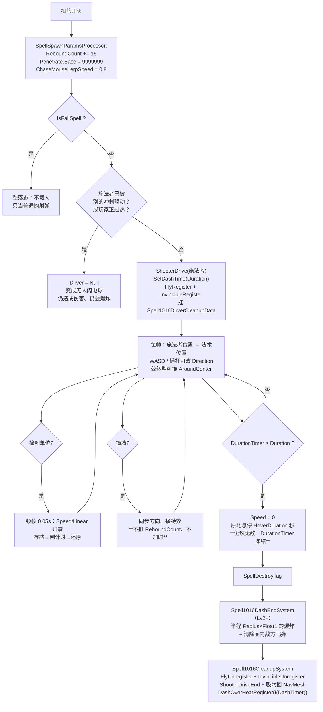

# 闪电疾行（Spell1016 / Dash）逆向分析

> 范围：仅玩家主动法术「闪电疾行」（`abilityType = 1016` / `SpellAbilityType.Dash`，配置 ID `10161–10163`）。精英怪 `Elite13` 里那个写作「闪电急行」的 `[Header]` 分组是**另一套独立脚本**（`Monster308DashSystem` / `Elite13.cs` 自己的状态机），第 11.3 节只做一次差异对照，不展开。`Boss13DashBullet` / `Boss13DashLaser` / `Monster308DashSystem` 同理。
> 方法：`SpellConfig.json` + `TextConfig_Spell.json` + 反编译 `Assembly-CSharp` 交叉验证。未标注「推测」「置信度中/低」的结论均有代码或数据直接证据。
> 主路径：玩家施法走 **ECS**，共 **6 个专属系统**（`Spell1016DashSystem` / `Spell1016DashHitEffectSystem` / `Spell1016DashEndSystem` / `Spell1016DashOverheatSystem` / `Spell1016CleanupSystem` / `Spell1016DashEffectDestroySystem`）。Mono `Spell1016Dash`（约 930 行）为残留轨，第 10 节单独对照。
> 配套：总览见《魔法工艺法术系统逆向报告.md》，原始数值见《法术数值总表.md》，同类深挖参考《激光逆向分析.md》。离线可开见 `闪电疾行逆向分析.html`。
> 本文给出三条既有文档没有的关键结论：**过热时间是驾驶时长的分段线性凹函数且封顶 8 秒**（4.2）、**悬停给的无敌完全不计入过热**（4.3、7.4）、**齐射/多重施法产生的额外冲刺不载人但照常爆炸**（6.5、7.7）。并修正了《悬停逆向分析.md》《时长强化逆向分析.md》里「冲刺施法锁」的适用对象（7.5）。

---

## 1. 身份与定位

| 项 | 值 |
| --- | --- |
| 中文名 | 闪电疾行（繁：閃電疾行） |
| 英文名 | Lightning Dash |
| `abilityType` | `1016` / `SpellAbilityType.Dash` |
| 配置 ID | `10161`（Lv1）/ `10162`（Lv2）/ `10163`（Lv3） |
| 文案 ID | 名 `701016x` / 机制 `711016x`（**Lv1 只有两行，Lv2/3 多一行爆炸**）/ 风味 `7210161` / 短评 `7310161` |
| 稀有度 | **稀有**（`dropType=2`） |
| `useType` | `0`（Missile 主动飞弹） |
| 槽位 / 蓝耗 | `slotCost=1`；`mpCost` = **33 / 43 / 56**（`shootCount=1`，不均摊） |
| 伤害 | `damage` = **14 / 28 / 56**（每级 ×2） |
| 自带暴击率 | `criticalChance` = **70 三级恒定**（`criticalDamageMultiplier = 2`） |
| 驾驶时长 | `duration` = **1.0 秒**（三级不变，**真的被读**，见 2.3） |
| 速度 | `speed` = 19（真速度，不是长度） |
| 击退 | `knockback` = **20**，**全表最高**（次高是巨大气泡 Lv3 / 鱼叉的 16） |
| 半径 | `radius` = 1（同时是碰撞盒尺寸与结束爆炸的底数） |
| 爆炸倍率 | `float1` = **2 / 2.5 / 3.5**（乘在 `Radius.Calculate()` 上） |
| 爆炸开关 | `int1` = **0 / 1 / 1**（Mono 读它；ECS 改判 `Level > 1`，等价） |
| 持续施法 | `isKeepCasting = true`、`canCancelCasting = false`（**ECS 里几乎是死字段**，见 2.2） |
| 预制体 | 三级共用 `prefab="10161"`，图标 `1016` |
| 合成 | Lv1→Lv2→Lv3（`canCompound`：Lv1/2=`true`，Lv3=`false`） |
| 售价（金币） | 18 / 54 / 162 |
| 复杂度 | `CalculateSpellComplexity` 记 **7 分**（与彩虹同档；激光只有 3 分） |
| 死字段 | `float2` / `float3` / `int2` / `int3` / `gravity` / `upSpeed` / `summonID` 全 0 |

**机制一句话**：这不是一发「打出去的弹」，而是一发**反过来把施法者装进去开走的载具**。开火当帧法术实体给施法者挂上 `FlyRegister()` + `InvincibleRegister()`，此后**每帧把施法者的 `LocalTransform.Position` 强制同步到法术实体身上**；玩家在这 1 秒里全程无敌、碰撞体关闭、可用 WASD 改向、撞墙无限反弹、碾过的敌人吃 `damage` + 击退 20。1 秒结束后实体销毁，玩家落地、解除无敌，并按**实际驾驶时长**换算出一段「过热」——过热期间这根法杖打不出任何含冲刺的法术组。Lv2/3 在销毁点额外炸一圈 `radius × float1`，并**清掉圈内绝大部分敌方飞弹**。



文案（`TextConfig_Spell`）：

- 名称 `7010161–7010163`：闪电疾行 / Lightning Dash（三级同名）
- 机制 `7110161`（Lv1）：> 持续施法\施法期间无敌
- 机制 `7110162` / `7110163`（Lv2/3）：> 持续施法\施法期间无敌\结束时产生 **float1** 倍半径的爆炸，并消除半径内的大部分敌方飞弹
- 风味 `7210161`：> 一团可以被驾驶的闪电，驾驶者在内部可以免受外界伤害，如果不是魔力消耗太高，这可能会成为一种交通工具。
- 短评 `7310161`：> 施法者化作无敌的闪电球，结束后会过热

四段文案与实装的对应关系**只有一处对不上**：机制栏第一行「持续施法」在 ECS 里**并没有走通用的持续施法通道**（冲刺不在 `SpellShootSystem` 的 `UnitKeepCastingSpells` 注册名单里，见 2.5），玩家侧的「按住」体感来自 `PlayerMgr.inDashSpell` 这个完全独立的开关。剩下三条——无敌、结束爆炸、过热——都能逐字落到代码。**短评那句「结束后会过热」是全表唯一一处在短评里点名过热机制的法术**，而过热的具体曲线从来没有在游戏内任何地方展示过（UI 只画进度条），见第 4 节。

---

## 2. 数值结构

### 2.1 配置表原始值（`assets_export/SpellConfig.json`）

| ID | Lv | damage | mpCost | criticalChance | duration | speed | knockback | radius | float1 | int1 | isKeepCasting | 售价 | 可合成 |
| --- | --- | --- | --- | --- | --- | --- | --- | --- | --- | --- | --- | --- | --- |
| 10161 | 1 | **14** | **33** | 70 | 1.0 | 19 | 20 | 1 | **2** | **0** | true | 18 | true |
| 10162 | 2 | **28** | **43** | 70 | 1.0 | 19 | 20 | 1 | **2.5** | **1** | true | 54 | true |
| 10163 | 3 | **56** | **56** | 70 | 1.0 | 19 | 20 | 1 | **3.5** | **1** | true | 162 | false |

规律：升级只动三样——`damage`（×2 递增）、`mpCost`、`float1`（爆炸半径倍率）。`int1` 只在 Lv1→Lv2 从 0 跳到 1，Lv2→Lv3 不变（它是**开关**不是数量）。`criticalChance` / `duration` / `speed` / `knockback` / `radius` 三级完全一致；`float2` / `float3` / `int2` / `int3` / `angle` / `recoil` / `gravity` / `upSpeed` / `summonID` 全 0。

**注意 `duration = 1.0` 是真的被读的。** 这和激光形成鲜明对照——激光的 `duration = 0` 是死字段、寿命硬编码 `0.2 + HoverDuration`；冲刺则完全走 `SpellSystem.UpdateDuration` 的**正常分支**（见 3.5），`Duration.Calculate()` 就是驾驶时长，因此**时长强化对冲刺是满额生效的**（7.2）。

`shootIntervalAddSubRevise` / `coolDownAddSubRevise` / `coolDownRatio` 三个法杖层字段分别是 0 / 0 / 1，即**冲刺不改整杖的射速间隔与冷却**。这一点也和激光相反。

### 2.2 字段语义

| 字段 | 语义 | 置信度 | 证据 |
| --- | --- | --- | --- |
| **duration = 1.0** | **驾驶时长（秒）**，同时是无敌时长与过热换算的输入 | 高 | `SpellSystem.UpdateDuration` L274–307 不排除 Dash；`Spell1016DashSystem` L957 `SetDashTime(Duration.Calculate())` |
| **speed = 19** | 真·飞行速度。**ECS 不再叠加玩家移速**（Mono 会叠，见 10.1） | 高 | `SpellMoveJob` 通用位移；`Spell1016Dash.GetCurrentSpeed` L141–148 对照 |
| **radius = 1** | 首帧写进 `LocalTransform.Scale`，同时是结束爆炸的半径底数 | 高 | `Spell1016DashSystem` L936；`Spell1016DashEndSystem` L151 |
| **float1 = 2/2.5/3.5** | 结束爆炸半径的**乘数**：`Radius.Calculate() × Float1` | 高 | `Spell1016DashEndSystem` L151；文案 `7110162` 占位符 |
| **int1 = 0/1/1** | 结束爆炸开关。**ECS 不读它**，改判 `Level > 1`；Mono 读 `int1 != 0` | 高 | `Spell1016DashEndSystem` L147–150；`Spell1016Dash` L600/L614/L707 |
| **criticalChance = 70** | 自带暴击率（百分数），三级恒定；暴击倍率 2 | 高 | 配置；`GameConst` |
| **knockback = 20** | 击退力度，全表最高档 | 高 | 配置 + 《法术数值总表.md》全表比对 |
| **`isKeepCasting = true`** | **ECS 里近乎死字段**，见下 | 高 | 全工程检索 |
| `canCancelCasting = false` | 全工程无功能性读取点，只有配置拷贝 | 高 | 全工程检索 |
| `angle = 0` | 散射底数 0 → 裸冲刺完全笔直 | 高 | `SpellShootData.GetSpellScatter` |
| float2 / float3 / int2 / int3 / recoil / gravity / upSpeed | 恒 0，无引用 | 高 | 配置 + 全工程检索 |

**`isKeepCasting` 为什么近乎是死字段。** 全工程检索 `isKeepCasting` 只有三类命中：`SpellConfig` / `SpellConfig_Struct` 的字段声明与拷贝，以及**唯一一处功能性读取**：

```357:366:decompiled/Assembly-CSharp/ShootSpellUtils.cs
		if ((bool)sip.ChargeStar)
		{
			if (configCopy.isKeepCasting)
			{
				ssp.MovementComponentData.AroundTarget = sip.Shooter;
			}
			else if (sip.OwnerUnit == playerEntity)
			{
				ssp.MovementComponentData.AroundTarget = playerAroundCenterEntity;
			}
```

也就是说，只有在「有蓄力星（`ChargeStar`）+ 公转」这种很窄的组合下，`isKeepCasting` 才会让公转中心绑到 `Shooter` 而不是玩家的公转中心实体。除此之外，**ECS 的持续施法注册名单是硬编码的、不含冲刺**（2.5）。

### 2.3 `duration` 的三层语义

`duration` 在冲刺身上一个字段管三件事，这是它和其它法术最不一样的地方：

1. **飞行段长度**：`UpdateDuration` 里 `DurationTimer < Duration.Calculate()` 时正常累加，到点把 `Movement.Speed = 0`。
2. **无敌与驾驶的窗口**：`FlyRegister` / `InvincibleRegister` 在首帧挂上，直到实体**销毁**才解除——注意是销毁，不是 duration 到点，所以悬停段也算在无敌里（4.3）。
3. **过热的输入**：`Spell1016DirverCleanupData.DashTimer` 每帧被刷成 `Config.DurationTimer`，销毁时喂给 `GetOverheatTime`。因为 `DurationTimer` 在 duration 用尽后就**停止累加**，过热只反映飞行段、不反映悬停段（4.3）。

```1070:1079:decompiled/Assembly-CSharp/Spell1016DashSystem.cs
	private void UpdateCleanupData(ref SystemState state, ref EntityCommandBuffer cmd)
	{
		foreach (var (uncheckedRefRW, uncheckedRefRO, uncheckedRefRO2, uncheckedRefRO3) in IFE_573865035_2.Query(__query_573865035_2, __TypeHandle.__IFE_573865035_2_TypeHandle, ref state))
		{
			uncheckedRefRW.ValueRW.DashTimer = uncheckedRefRO2.ValueRO.DurationTimer;
			uncheckedRefRW.ValueRW.Radius = uncheckedRefRO2.ValueRO.Radius.Calculate();
			uncheckedRefRW.ValueRW.LastPosition = uncheckedRefRO.ValueRO.Position;
			uncheckedRefRW.ValueRW.LastLinear = uncheckedRefRO3.ValueRO.Linear;
		}
	}
```

这段跑在 `Spell1016DashSystem.OnUpdate` 的**最前面**，而且查询是 `WithAll<LocalTransform, SpellConfigComponentData, PhysicsVelocity, Spell1016DirverCleanupData>`——实体还活着时每帧刷新，实体销毁后 `LocalTransform` 没了就不再进这个查询，`Spell1016CleanupSystem` 读到的就是**最后一帧的快照**。这个「Cleanup 组件缓存最后一帧状态」的写法保证了销毁后还能拿到位置、速度、半径和计时。

### 2.4 蓝耗与每级性价比

`shootCount = 1`，`mpCost` 就是单发价。把 70% 自带暴击算进去（期望倍率 `1 + 0.7 = 1.7`）：

| Lv | damage | 期望伤害 | 蓝耗 | 期望伤害/蓝 | 爆炸半径 | 售价 |
| --- | --- | --- | --- | --- | --- | --- |
| 1 | 14 | **23.8** | 33 | 0.72 | 无 | 18 |
| 2 | 28 | **47.6** | 43 | 1.11 | `1 × 2.5 = 2.5` | 54 |
| 3 | 56 | **95.2** | 56 | 1.70 | `1 × 3.5 = 3.5` | 162 |

Lv1→Lv3 伤害 4 倍、蓝耗只涨 1.7 倍，**每点蓝的效率翻了 2.36 倍**，是全表升级收益最陡的法术之一。但要注意「期望伤害」这一列对冲刺的意义和普通飞弹不同——冲刺是**碾过去**的，实际总伤害 = 单次伤害 × 碾到的敌人数 × 每个敌人被碾的次数（`Penetrate.Base = 9999999`，见 2.6），再加上 Lv2+ 的结束爆炸。所以上表严重低估了它。

**冲刺的蓝耗在 Lv1 就是 33，是全表 Lv1 最贵的主动法术之一**（对照：分解射线 43、次元行者 40、巨大气泡 35、龙息 30）。它是一张「你得先有蓝池才配用」的卡。

### 2.5 冲刺**不在** ECS 的持续施法注册名单里

这是本节最反直觉的一条。配置写着 `isKeepCasting = true`，游戏内文案第一行写着「持续施法」，但 `SpellShootSystem` 挂 `UnitKeepCastingSpells` 的门是硬编码的：

```545:563:decompiled/Assembly-CSharp/SpellShootSystem.cs
		if (((abilityType == SpellAbilityType.DragonBreath || abilityType == SpellAbilityType.DisintegrationRay || (spawnParams.ConfigComponentData.AbilityType == SpellAbilityType.HighPressureWasher && spawnParams.ConfigComponentData.Int3 == 0)) && !spawnParams.IsSplitSpell && !spawnParams.MovementComponentData.IsFallSpell && !spawnParams.RandomPosFocusMouse) || InternalCompilerInterface.HasComponentAfterCompletingDependency(ref __TypeHandle.__SpellChargeData_RO_ComponentLookup, ref state, entity))
		{
			Entity entity6 = default(Entity);
			if (InternalCompilerInterface.HasBufferAfterCompletingDependency(ref __TypeHandle.__UnitKeepCastingSpells_RO_BufferLookup, ref state, spawnParams.Shooter))
			{
				entity6 = spawnParams.Shooter;
			}
			else if (spawnParams.ChargeStarEntity != Entity.Null && !InternalCompilerInterface.HasComponentAfterCompletingDependency(ref __TypeHandle.__SpellChargingTag_RO_ComponentLookup, ref state, entity))
			{
				entity6 = spawnParams.OwnerUnit;
			}
			if (entity6 != default(Entity) && !spawnParams.FromEcho && (!spawnParams.FromPostSlot || spawnParams.ConfigComponentData.AbilityType == SpellAbilityType.Dash))
			{
				InternalCompilerInterface.GetBufferAfterCompletingDependency(ref __TypeHandle.__UnitKeepCastingSpells_RW_BufferLookup, ref state, entity6).Add(new UnitKeepCastingSpells
				{
					Spell = entity,
					ReduceMoveSpeed = (spawnParams.ConfigComponentData.AbilityType != SpellAbilityType.DragonBreath)
				});
			}
```

外层 `if` 只认**龙息 / 分解射线 / 高压水枪(Int3==0)**，再或上「这发法术带 `SpellChargeData`（蓄力模式 4004）」。**冲刺进不去外层 if**，除非同槽插了蓄力模式。

耐人寻味的是内层 L556 那句 `(!spawnParams.FromPostSlot || AbilityType == Dash)`——它**专门给冲刺开了后置槽的口子**。这说明作者确实想过「冲刺 + 后置槽」的场景，但那条路径只有在冲刺同时带蓄力数据时才可达。判定为**代码残留或未完成分支**，置信度中。

那么玩家体感上的「持续施法」从哪来？完全是另一条线：

```703:710:decompiled/Assembly-CSharp/PlayerController.cs
	private void Shoot()
	{
		changeWandCooling -= PlayerMgr.Inst.PlayerDeltaTime;
		dashOverHeatTimer -= PlayerMgr.Inst.PlayerDeltaTime;
		if (PlayerMgr.Inst.inDashSpell || isFrozen || !isHoldMouse0 || usingPotion || !CanMotion || UIPlayerDataMgr.Inst.IsDraging || IsKeepCasting || changeWandCooling > 0f || ...)
		{
			return;
		}
```

`PlayerMgr.inDashSpell` 由 `OnPlayerDash()` / `OnPlayerDashEnd()` 直接开关，命中就**整个 `Shoot()` 提前 return**——冲刺期间玩家手动开火被彻底掐断。而 `Wand.CanShoot` 里那句反过来：

```1964:1971:decompiled/Assembly-CSharp/Wand.cs
		if (PlayerMgr.Inst.PlayerCtrller.IsKeepCasting && !PlayerMgr.Inst.inDashSpell)
		{
			return false;
		}
		if (PlayerMgr.Inst.PlayerCtrller.isDashOverHeat && currentShootGroup.HasShootableSpell(SpellAbilityType.Dash, deepSearch: false))
		{
			return false;
		}
```

`IsKeepCasting && !inDashSpell` 的意思是：**冲刺期间反而解除「持续施法禁止开火」这道锁**——留给自动法杖（`passiveAutoWand`）、后置槽、法杖精灵这些不走 `PlayerController.Shoot()` 的开火源。所以「冲刺时自动法杖照打」是有意设计，不是漏洞。

### 2.6 发射参数后处理：三条硬改写

冲刺是 `SpellSpawnParamsProcessor` 里少数有专属条目的法术之一（激光完全没有条目）：

```106:114:decompiled/Assembly-CSharp/SpellSpawnParamsProcessor.cs
		_processors.Add(SpellAbilityType.Dash, delegate(ShootSpellUtils.SpellShootInfo info, SpellInitialParameter sip, ref SpellSpawnParams ssp)
		{
			if (!ssp.MovementComponentData.IsFallSpell)
			{
				ssp.MovementComponentData.ReboundCount += 15;
			}
			ssp.ConfigComponentData.Penetrate.Base = 9999999;
			ssp.MovementComponentData.ChaseMouseLerpSpeed = 0.8f;
		});
```

三条改写各自的后果：

| 改写 | 后果 |
| --- | --- |
| `ReboundCount += 15`（仅非坠落） | 给足 15 次墙反弹底子。**但冲刺根本不扣这个数**（第 8 节），所以它更像是「让反弹碰撞体保持启用」的开关而不是次数 |
| `Penetrate.Base = 9999999` | **穿透无限**。冲刺不会因为撞到敌人而消失，也不会被穿透符文影响——穿透符文（3006）对冲刺是**纯废槽**（7.9） |
| `ChaseMouseLerpSpeed = 0.8` | 寻踪（3010）下的鼠标跟随插值系数被写死成 0.8，**覆盖掉寻踪符文自己写的值**（7.6） |

这和奥术新星（`ArcaneNova`）的条目一模一样（同文件 L98–105，只差没有 `ChaseMouseLerpSpeed`），说明这两个法术共享「无限穿透 + 高反弹的大球」这个设计模板。

---

## 3. 核心机制：法术反过来驾驶施法者

### 3.1 首帧接管

整段接管逻辑跑在 `Spell1016DashSystem.OnUpdate` 的**主线程**上（不是 Job），查询是 `WithAll<Spell1016InitTag>` + 五个 RW 组件，`Spell1016InitTag` 是个可启用组件，处理完立刻置 false，所以每个实体只进一次：

```932:982:decompiled/Assembly-CSharp/Spell1016DashSystem.cs
			if (uncheckedRefRW5.ValueRO.IsFallSpell)
			{
				continue;
			}
			uncheckedRefRW2.ValueRW.Scale = uncheckedRefRW4.ValueRO.Radius.Calculate();
			InternalCompilerInterface.SetComponentEnabledAfterCompletingDependency(ref __TypeHandle.__Spell1016InitTag_RW_ComponentLookup, ref state, entity2, value: false);
			Entity entity3 = uncheckedRefRW3.ValueRO.Shooter;
			if (InternalCompilerInterface.HasComponentAfterCompletingDependency(ref __TypeHandle.__Spell4004StartData_RO_ComponentLookup, ref state, entity3))
			{
				entity3 = uncheckedRefRW3.ValueRO.OwnerEntity;
			}
			if (!InternalCompilerInterface.HasComponentAfterCompletingDependency(ref __TypeHandle.__UnitProperty_Dots_RO_ComponentLookup, ref state, entity3))
			{
				continue;
			}
			RefRW<UnitProperty_Dots> componentRWAfterCompletingDependency = ...;
			bool flag2 = InternalCompilerInterface.HasComponentAfterCompletingDependency(ref __TypeHandle.__Spell4005WandSpiritData_RO_ComponentLookup, ref state, entity3);
			UnitType unitType = componentRWAfterCompletingDependency.ValueRO.unitCfg.unitType;
			if ((unitType != 0 && unitType != UnitType.Teammate && unitType != UnitType.Monster && !flag2) || singletonRW.ValueRW.IsShooterDriving(entity3) || (componentRWAfterCompletingDependency.ValueRO.unitCfg.unitType == UnitType.Player && PlayerMgr.Inst.PlayerCtrller.isDashOverHeat))
			{
				continue;
			}
			singletonRW.ValueRW.ShooterDrive(entity3);
			if (componentRWAfterCompletingDependency.ValueRO.unitCfg.unitType == UnitType.Player)
			{
				singletonRW.ValueRW.SetDashTime(uncheckedRefRW4.ValueRW.Duration.Calculate());
			}
			componentRWAfterCompletingDependency.ValueRW.FlyRegister();
			componentRWAfterCompletingDependency.ValueRW.InvincibleRegister();
			cmd.AddComponent<Spell1016DirverCleanupData>(entity2);
			cmd.SetComponent(entity2, new Spell1016DirverCleanupData
			{
				Dirver = entity3,
				ColorType = uncheckedRefRW4.ValueRO.ColorType
			});
			uncheckedRefRW.ValueRW.Dirver = entity3;
```

拆开看六个要点：

1. **坠落态直接 `continue`。** `[坠落] [冲刺]` 不载人、不无敌、不注册驾驶权——它退化成一颗普通的抛物线弹（4.5 / 7.3）。
2. **`Scale = Radius.Calculate()` 只在首帧写一次**，之后不再刷新。范围增强因此能放大碰撞盒，但中途改半径无效。
3. **蓄力模式（4004）会把驾驶目标从 `Shooter` 换成 `OwnerEntity`。** 有 `Spell4004StartData` 时 `Shooter` 是那颗蓄力星而不是人，所以要回溯到 `OwnerEntity`。
4. **可被驾驶的单位类型**：`Player`（`unitType == 0`）、`Teammate`、`Monster`，外加任何挂了 `Spell4005WandSpiritData`（法杖精灵）的实体。其它类型直接跳过。
5. **三道否决门**（任一命中就不载人）：类型不符 / **该施法者已经被别的冲刺驱动** / **玩家正在过热**。
6. **`SetDashTime` 只对玩家调用**，它写的是 `SpellDashDriverSingleton` 上的 UI 进度条数据，与实际驾驶无关。

被否决的实体不会消失——它的 `Spell1016InitTag` 已经在第 3 步被关掉了，`Dirver` 保持 `Entity.Null`，于是变成一颗**无人驾驶的闪电球**继续飞、继续撞人、继续在销毁时爆炸。这是齐射/多重施法构筑的核心（6.5）。

### 3.2 驾驶权单例：一人同时只能被一发冲刺开走

```1:35:decompiled/Assembly-CSharp/SpellDashDriverSingleton.cs
using Unity.Collections;
using Unity.Entities;

[ChunkSerializable]
public struct SpellDashDriverSingleton : IComponentData, IQueryTypeParameter
{
	public NativeHashSet<Entity> OnDashDriver;

	public float DashRemainingTime;

	public float TotalDashTime;

	public bool IsDashing => DashRemainingTime > 0f;

	public bool IsShooterDriving(Entity entity)
	{
		return OnDashDriver.Contains(entity);
	}

	public void ShooterDrive(Entity shooter)
	{
		OnDashDriver.Add(shooter);
	}

	public void ShooterDriveEnd(Entity shooter)
	{
		OnDashDriver.Remove(shooter);
	}

	public void SetDashTime(float duration)
	{
		TotalDashTime = duration;
		DashRemainingTime = TotalDashTime;
	}
}
```

单例在 `Spell1016DashSystem.OnCreate` 里创建，容量初值 8（`Allocator.Persistent`），并在 `OnDestroy` 里 `Dispose`。注意 `DashRemainingTime` / `TotalDashTime` 是**全局单值**而不是每人一份——所以它只服务于玩家的 UI 进度条；队友/怪物冲刺时也会走 `ShooterDrive` 进 HashSet，但不会写这两个数（`SetDashTime` 只在 `unitType == Player` 时调）。

`DashRemainingTime` 的倒计时由一个只有六行有效逻辑的独立系统负责：

```76:81:decompiled/Assembly-CSharp/Spell1016DashOverheatSystem.cs
		RefRW<SpellDashDriverSingleton> singletonRW = __query_263253330_0.GetSingletonRW<SpellDashDriverSingleton>();
		if (singletonRW.ValueRO.IsDashing)
		{
			singletonRW.ValueRW.DashRemainingTime -= state.WorldUnmanaged.Time.DeltaTime;
		}
```

**名字叫 `OverheatSystem`，但它跟过热毫无关系**——真正的过热在 `Spell1016CleanupSystem`（第 4 节）。这个系统唯一的作用是给 `UIPlayerDashProgressBar` 喂进度条数值。属于命名误导，值得在阅读代码时留意。

### 3.3 每帧位置同步与玩家输入

第二个 foreach 是每帧跑的，查询 `WithAll<PhysicsVelocity>` + `Spell1016DashData/SpellMovementComponentData/LocalTransform/SpellComponentData` 全 RW：

```988:1024:decompiled/Assembly-CSharp/Spell1016DashSystem.cs
			if (uncheckedRefRW7.ValueRO.IsFallSpell || uncheckedRefRW6.ValueRO.Dirver == Entity.Null || !InternalCompilerInterface.HasComponentAfterCompletingDependency(ref __TypeHandle.__Unity_Transforms_LocalTransform_RO_ComponentLookup, ref state, uncheckedRefRW6.ValueRO.Dirver))
			{
				continue;
			}
			RefRW<LocalTransform> componentRWAfterCompletingDependency2 = ...Dirver...;
			float3 position2 = DTool.IgnoreZPosition(in uncheckedRefRW8.ValueRO.Position, componentRWAfterCompletingDependency2.ValueRW.Position.z);
			...
			else
			{
				componentRWAfterCompletingDependency2.ValueRW.Position = position2;
			}
			if (math.length(uncheckedRefRO.ValueRO.Linear) > 0f)
			{
				uncheckedRefRW6.ValueRW.LastLinear = uncheckedRefRO.ValueRO.Linear;
			}
```

**方向是「法术 → 驾驶者」，不是反过来。** 法术实体由通用的 `SpellMoveJob` 正常驱动（冲刺没有被 `SpellPhysicsSystemGroup` 排除），然后这里把结果**盖到驾驶者的 Transform 上**，只保留驾驶者原本的 z。`LastLinear` 每帧记录非零速度，用于销毁时给驾驶者一个惯性击退（4.4）。

第三章特殊房间（`Theme6_Chapter3` / `Theme22_Chapter3_Shortcut1`）的循环空间重定位有一条反向分支：`PlayerMgr.inDashSpellAccessT6` 为真时改成**法术位置 ← 玩家位置**，并临时关掉拖尾粒子发射器（`AcceessTheme6StopTrail`，L998–1016），避免拖尾在瞬移时拉出一条横跨房间的线。这是纯表现修补。

玩家输入在同一个循环的尾部处理，且只对 `unitType == 0`（玩家本人）生效：

```1042:1058:decompiled/Assembly-CSharp/Spell1016DashSystem.cs
			Vector2 vector = ((PlayerMgr.Inst.PlayerCtrller.inputLeftStick != Vector2.zero) ? PlayerMgr.Inst.PlayerCtrller.inputLeftStick : ((Vector2)PlayerMgr.Inst.PlayerCtrller.inputRightStick));
			Vector2 vector2 = (GameMgr.IsMobile_Static ? vector : ControlMgr.Inst.GetInputWASD());
			if (!(vector2.sqrMagnitude <= 0f))
			{
				PlayerController_Dots singleton = __query_573865035_7.GetSingleton<PlayerController_Dots>();
				vector2 *= singleton.playerCtrllerMono.Value.myPpt.MoveSpeedRatio;
				if (uncheckedRefRW7.ValueRO.Type == SpellSpecialMovementType.Rotation)
				{
					uncheckedRefRW7.ValueRW.AroundCenter += new float3(vector2.x, vector2.y, 0f) * state.WorldUnmanaged.Time.DeltaTime * singleton.playerCtrllerMono.Value.myPpt.MoveSpeed;
					CamController.Inst.dashCamFollowPoint = uncheckedRefRW7.ValueRW.AroundCenter;
				}
				else
				{
					vector2 = math.normalize(vector2);
					uncheckedRefRW7.ValueRW.Direction = new float3(vector2.x, vector2.y, uncheckedRefRW7.ValueRW.Direction.z);
				}
			}
		}
```

两条完全不同的操控模型：

- **非公转**：WASD **直接改写 `Direction`**（归一化，速度不变）。所以冲刺不是「射出去就没法管」，玩家全程能转向，而且转向是**瞬时的、没有转速上限**。
- **公转**：WASD **推动 `AroundCenter`**（不归一化，所以斜向输入会更快），玩家保持绕圈，圆心跟着走。同时把摄像机跟随点也同步过去。

注意非公转分支归一化了输入而公转分支没有——**公转冲刺斜着推圆心的速度是正方向的 √2 倍**。判定为小瑕疵，置信度高（代码事实），影响很小。

移动端还有一条特判（L1029–1041）：寻踪型冲刺在玩家拨动左摇杆时**临时切成 `Normal`**，松手再切回 `ChaseMouse`，用 `PauseMouseEffect` 记状态。PC 端不进这个分支。

### 3.4 摄像机接管

```298:305:decompiled/Assembly-CSharp/CamController.cs
	public void FinalCamClamp()
	{
		Vector3 position = followTargetT.position;
		if (PlayerMgr.Inst.inDashSpell && playerInRotateDash && LevelMgr.Inst.CurrentRoomCfg.themeType != RoomThemeType.Theme6_Chapter3 && LevelMgr.Inst.CurrentRoomCfg.themeType != RoomThemeType.Theme22_Chapter3_Shortcut1)
		{
			position = dashCamFollowPoint;
		}
```

**只有公转型冲刺才接管摄像机**（`playerInRotateDash` 在 `Spell1016DashSystem` L971–974 里设为 true，在 `Spell1016CleanupSystem` L218 与 `UIMenu` L1418 里清回 false）。普通冲刺摄像机照常跟人——也就是跟着那颗球满屏乱飞。这是 `[公转] [冲刺]` 手感明显更稳的原因：镜头锁在圆心，不跟着绕圈晃。

`UIMenu` L1410–1420 那段是**暂停菜单里的兜底**：如果玩家在冲刺中打开某些菜单，会强制 `FlyUnregister` + `InvincibleUnregister` + `OnPlayerDashEnd()` + 清 `playerInRotateDash`，防止无敌状态泄漏。

### 3.5 System 执行顺序

| System | 所属组 | 频率 | 职责 |
| --- | --- | --- | --- |
| `Spell1016DashSystem` | `SpacialSpellSystemGroup` | 每帧（主线程 + 1 个 Job） | Cleanup 快照 → 首帧接管 → 位置同步与输入 → 落地特效 Job |
| `Spell1016DashHitEffectSystem` | — | 每帧 | 命中粒子 + **顿帧**（6.3） |
| `Spell1016DashOverheatSystem` | `SpacialSpellSystemGroup` | 每帧 | 只给 UI 进度条倒计时 |
| `Spell1016DashEndSystem` | `SpellEndSystemGroup`，`[UpdateBefore(SpellDestroySystem)]` | 每帧 | Lv2+ 结束爆炸 + 清弹幕（6.4） |
| `Spell1016DashEffectDestroySystem` | — | 每帧 | 销毁 `SpellGameObjectEffectLink` 挂的 GO 特效，纯表现 |
| `Spell1016CleanupSystem` | `SystemBase` | 每帧 | 实体消失后解无敌、还驾驶权、吸附 NavMesh、**注册过热**（第 4 节） |
| `SpellSystem.UpdateDuration` | — | 每帧 | **走正常分支**，累加 `DurationTimer` 并在到点后销毁 |

**冲刺照常进 `SpellPhysicsSystemGroup`**（`SpellMoveJob` 有 `Dash` 分支且不排除它）——这是它和激光最根本的架构差异：激光是一次性几何计算，冲刺是货真价实的物理弹。

销毁判定完全交给通用路径：

```274:307:decompiled/Assembly-CSharp/SpellSystem.cs
			if (!spell.Movement.ValueRO.IsFallSpell)
			{
				SpellAbilityType abilityType = spell.Config.ValueRO.AbilityType;
				if (abilityType != SpellAbilityType.Laser && abilityType != SpellAbilityType.RuneHammer && abilityType != SpellAbilityType.LaserBeam && abilityType != SpellAbilityType.BiAnLethalBlade && abilityType != SpellAbilityType.Umbrella && abilityType != SpellAbilityType.HighPressureWasher && abilityType != SpellAbilityType.DaveHarpoons)
				{
					if (valueRW.DurationTimer < valueRW.Duration.Calculate())
					{
						valueRW.DurationTimer += DeltaTime;
						return;
					}
					spell.Movement.ValueRW.Speed = 0f;
					if (valueRW.HoverTimer < valueRW.HoverDuration)
					{
						valueRW.HoverTimer += DeltaTime;
					}
					...
					else
					{
						destroySelf = true;
					}
					return;
				}
			}
```

**`Dash` 不在排除名单里。** 这直接推出三条：时长强化有效（7.2）、悬停有效且是「原地停住」（7.4）、`DurationTimer` 在 duration 用尽后**停止累加**（因为那个 `return` 只在 `<` 分支里执行，之后每帧都走到 `Speed = 0` 那一支）。第三条是 4.3 节全部结论的基础。

---

## 4. 过热：全表唯一的「用完要凉一会儿」机制

### 4.1 过热怎么被触发和消费

过热是一个纯 Mono 侧的单浮点计时器：

```2084:2091:decompiled/Assembly-CSharp/PlayerController.cs
	public void DashOverHeatRegister(float duration)
	{
		if (!(duration <= dashOverHeatTimer))
		{
			dashOverHeatTimer = duration;
			lastDashOverHeatTimeMax = duration;
		}
	}
```

```198:200:decompiled/Assembly-CSharp/PlayerController.cs
	public float dashOverHeatProgressRatio => dashOverHeatTimer / lastDashOverHeatTimeMax;

	public bool isDashOverHeat => dashOverHeatTimer > 0f;
```

三个细节：

- **注册是取大值不是累加**（`if (!(duration <= dashOverHeatTimer))`）。连续两次冲刺不会叠加过热，只会被更长的那次覆盖。
- **倒计时挂在 `PlayerController.Shoot()` 的第一行**（L706 `dashOverHeatTimer -= PlayerMgr.Inst.PlayerDeltaTime;`），在所有 early-return 之前。用的是 `PlayerDeltaTime`——**所以子弹时间/减速道具会同步拉长过热**，推测（未验证 `PlayerDeltaTime` 的完整定义）。
- 玩家重生 / 换层时 `dashOverHeatTimer = 0f`（L512、L1603）。

过热的两处消费点都在 `Wand`：

| 位置 | 行为 |
| --- | --- |
| `Wand.CanShoot` L1968–1971 | 当前法术组里**只要有一张冲刺**（`HasShootableSpell(Dash, deepSearch: false)`）就整组不能开火 |
| `Wand.TryShoot` L2022–2025 | 同样条件下**直接跳到下一组**（`EnterNextGroup(setCoolDownOrInterval: true)`）并照常吃冷却 |

这两条合起来意味着：**过热锁的是「组」不是「法杖」**。多组法杖里冲刺单独占一组时，过热期间会自动轮空那一组继续打别的组；冲刺和输出法术挤在同一组时，过热就是整组停摆。**这是冲刺构筑最重要的一条排版规则，游戏内没有任何提示。**

注意 `deepSearch: false`——只看当前组的直接槽位，不递归子组。

### 4.2 过热曲线：分段线性、凹、封顶 8 秒

```251:268:decompiled/Assembly-CSharp/Spell1016CleanupSystem.cs
	private void GetOverheatTime(float duration, out float overheatTime)
	{
		if (duration <= 1f)
		{
			overheatTime = duration;
		}
		else if (duration <= 8f)
		{
			overheatTime = 0.357f * duration + 0.643f;
		}
		else if (duration <= 50f)
		{
			overheatTime = 0.107f * duration + 2.65f;
		}
		else
		{
			overheatTime = 8f;
		}
	}
```

三段在断点处几乎连续（d=1 两边都是 1.000；d=8 分别是 3.499 与 3.506；d=50 是 8.000，正好接上封顶），说明这是策划在曲线编辑器里拉出来后拟合成三段直线的。**Mono 侧对应的就是一条 `AnimationCurve DurationTimeToOverheatCurve`**（`Spell1016Dash` L53、L79），ECS 化时把曲线烘成了这段分段函数。

代入实际构筑（`duration` 底数 1.0，时长强化 3103 的 `float1` = 2 / 3.5 / 6）：

| 槽位 | 驾驶时长 d | 过热时长 f(d) | **驾驶/过热** |
| --- | --- | --- | --- |
| `[冲刺]` | 1.0 | **1.00** | 1.00 |
| `[时Lv1(+2)] [冲刺]` | 3.0 | **1.71** | 1.75 |
| `[时Lv2(+3.5)] [冲刺]` | 4.5 | **2.25** | 2.00 |
| `[时Lv3(+6)] [冲刺]` | 7.0 | **3.14** | 2.23 |
| `[时Lv3]×2 [冲刺]` | 13.0 | **4.04** | 3.22 |
| `[时Lv3]×3 [冲刺]` | 19.0 | **4.68** | 4.06 |
| `[时Lv3]×8 [冲刺]` | 49.0 | **7.89** | 6.21 |
| 任何 d > 50 | >50 | **8.00**（封顶） | 无上限 |

**这是本文最有构筑价值的一条结论：过热对驾驶时长是次线性的，而且硬封顶在 8 秒。** 堆时长强化的边际成本递减——第一张 +2 秒换来 +0.71 秒过热，而从 13 秒堆到 19 秒（+6 秒）只换来 +0.64 秒过热。理论上把 `duration` 堆过 50 秒后，冲刺就变成「50 秒无敌换 8 秒不能用这一组」。

**置信度：高**（代码事实）。**但有一个未验证前提**：`DashTimer` 是实际跑完的时间，如果玩家的冲刺被中途打断（例如进入菜单走 `UIMenu` 的兜底路径），`Spell1016CleanupSystem` 仍会用当时的 `DashTimer` 算过热——即**提前结束会得到更短的过热**。这条推论没有实机验证。

### 4.3 悬停给的无敌是「免费」的

把 3.5 节和 2.3 节拼起来会得到一个很强的结论：

1. `UpdateDuration` 在 `DurationTimer >= Duration.Calculate()` 之后**不再累加 `DurationTimer`**，改为累加 `HoverTimer`。
2. `Spell1016DirverCleanupData.DashTimer` 每帧同步的是 `DurationTimer`，所以它在悬停段**冻结**。
3. `FlyRegister` / `InvincibleRegister` 直到 `Spell1016CleanupSystem` 检测到实体消失才解除，而实体在悬停结束前不会消失。
4. `Spell1016DashSystem` 的位置同步循环**不检查任何计时**，只要 `Dirver != Null` 就一直把玩家钉在球上。

⇒ **悬停段里玩家仍然无敌、仍然被驾驶（只是速度为 0，原地悬空），但这段时间完全不进过热计算。**

| 槽位 | 飞行段 | 悬停段 | **总无敌时长** | 过热 | 无敌/过热 |
| --- | --- | --- | --- | --- | --- |
| `[冲刺]` | 1.0 | 0 | **1.0** | 1.00 | 1.00 |
| `[悬Lv1(+2)] [冲刺]` | 1.0 | 2.0 | **3.0** | **1.00** | 3.00 |
| `[悬Lv2(+3)] [冲刺]` | 1.0 | 3.0 | **4.0** | **1.00** | 4.00 |
| `[悬Lv3(+5)] [冲刺]` | 1.0 | 5.0 | **6.0** | **1.00** | 6.00 |
| `[悬Lv3]×2 [冲刺]` | 1.0 | 10.0 | **11.0** | **1.00** | 11.00 |
| `[时Lv3] [悬Lv3] [冲刺]` | 7.0 | 5.0 | **12.0** | 3.14 | 3.82 |
| `[悬Lv3]×3 [冲刺]` | 1.0 | 15.0 | **16.0** | **1.00** | 16.00 |

**纯堆悬停是过热效率最高的路线，纯堆时长是位移距离最长的路线。** 前者把冲刺变成「原地无敌罚站」，后者把它变成「长距离无敌冲撞」。

两个代价需要说清楚：

- 悬停段 `Movement.Speed = 0`，所以**不会碾到新的敌人**（除非敌人自己撞上来——碰撞盒还在）。它是纯防御时间。
- 悬停段玩家仍处于 `inDashSpell`，**手动开火依然被 `PlayerController.Shoot()` 掐断**。也就是说这是一段「什么都做不了的无敌」，只能拿来躲弹幕/等 Boss 读条。

**置信度：中高。** 逻辑链每一环都有代码直接证据，但「悬停段玩家可见的实际表现」（是否真的悬在空中、是否会被吸回 NavMesh）没有实机验证。另外 `SpellComponentData.ReduceSizeWhenLifeEnd` 是预制体序列化字段，如果它为 true，悬停结束后还会有一段 `Scale` 从 1 缩到 0.01 的时间（`5f * DeltaTime` 的速率，约 0.2 秒），这段时间实体仍存在、玩家仍无敌。**该字段的实际取值无法从代码确定。**

### 4.4 结束与清理

`Spell1016CleanupSystem` 是个 `SystemBase`（托管系统，因为要碰 `PlayerMgr` / `CamController` 这些 Mono 单例），查询是 `WithAll<Spell1016DirverCleanupData>().WithNone<LocalTransform>()`——**即「组件还在但实体已经被销毁」的清理态**，这是 `ICleanupComponentData` 的标准用法：

```203:248:decompiled/Assembly-CSharp/Spell1016CleanupSystem.cs
			entityCommandBuffer.RemoveComponent<Spell1016DirverCleanupData>(e);
			Entity dirver = uncheckedRefRO.ValueRO.Dirver;
			if (!InternalCompilerInterface.HasComponentAfterCompletingDependency(ref __TypeHandle.__Unity_Transforms_LocalTransform_RO_ComponentLookup, ref base.CheckedStateRef, dirver))
			{
				continue;
			}
			RefRW<UnitProperty_Dots> componentRWAfterCompletingDependency = ...;
			if (componentRWAfterCompletingDependency.ValueRO.unitCfg.unitType == UnitType.Player)
			{
				PlayerController_Dots singleton2 = __query_538091119_3.GetSingleton<PlayerController_Dots>();
				if ((bool)singleton2.playerCtrllerMono)
				{
					flag = true;
					GetOverheatTime(uncheckedRefRO.ValueRO.DashTimer, out var overheatTime);
					singleton2.playerCtrllerMono.Value.DashOverHeatRegister(overheatTime);
					CamController.Inst.playerInRotateDash = false;
				}
			}
			RefRW<LocalTransform> componentRWAfterCompletingDependency2 = ...;
			Vector3 navMeshPointIngoreZ = Tool2D.GetNavMeshPointIngoreZ(componentRWAfterCompletingDependency2.ValueRO.Position);
			ref readonly float3 position = ref componentRWAfterCompletingDependency2.ValueRO.Position;
			float3 @float = navMeshPointIngoreZ;
			bool num = DTool.IgnoreZDistanceSqr(in position, in @float) > 0.1f;
			componentRWAfterCompletingDependency2.ValueRW.Position = navMeshPointIngoreZ;
			if (singleton.IsShooterDriving(dirver))
			{
				singleton.ShooterDriveEnd(dirver);
			}
			componentRWAfterCompletingDependency.ValueRW.FlyUnregister();
			componentRWAfterCompletingDependency.ValueRW.InvincibleUnregister();
			uncheckedRefRO.ValueRO.ColorType.ColorEnumToString(out var result);
			if (!num)
			{
				componentRWAfterCompletingDependency.ValueRW.TakeKnockback(uncheckedRefRO.ValueRO.LastLinear * UnityEngine.Random.Range(0.3f, 0.5f));
			}
```

按顺序七件事：

1. **移除 cleanup 组件**（否则实体会永远留在清理态）。
2. **驾驶者已经不存在就 `continue`**——注意这条 `continue` 在移除组件之后，所以不会泄漏组件，但**会泄漏 `FlyRegister` / `InvincibleRegister` 和 HashSet 里的条目**。玩家死亡时靠 `PlayerController` 的重置兜底。
3. **玩家专属**：算过热并注册、清 `playerInRotateDash`。
4. **强制吸附回 NavMesh**：`Tool2D.GetNavMeshPointIngoreZ` 把驾驶者拉回可行走区域。这是「冲刺穿墙后不会卡在墙里」的保证。
5. **还驾驶权**（`ShooterDriveEnd`）。
6. **解除飞行与无敌**。
7. **惯性击退**：只有当**吸附前后位置几乎没变**（`num == false`，即距离平方 ≤ 0.1）时，才用 `LastLinear × Random(0.3, 0.5)` 给一个顺势的推力。落点如果被 NavMesh 大幅拉回，就不给击退——避免把玩家又推进墙里。

最后统一发一个 `1016_DashWave_{颜色}` 全局粒子（`Size = 最后一帧的 Radius`）并调 `PlayerMgr.Inst.PlayerCtrller.OnPlayerDashEnd()` 收尾（恢复碰撞体、可交互、可见性、法杖显示、`inDashSpell = false`）。

### 4.5 过热 UI

```34:49:decompiled/Assembly-CSharp/UIPlayerDashProgressBar.cs
	private bool IsHeating()
	{
		return PlayerMgr.Inst.PlayerCtrller.dashOverHeatProgressRatio > 0f;
	}

	private float GetProgress(SpellDashDriverSingleton data)
	{
		if (IsHeating())
		{
			return 1f - PlayerMgr.Inst.PlayerCtrller.dashOverHeatProgressRatio;
		}
		if (data.IsDashing)
		{
			return data.DashRemainingTime / data.TotalDashTime;
		}
		return 0f;
	}
```

同一根条复用两个含义：冲刺中显示**剩余驾驶时间**（从满掉到空），过热中显示**过热恢复进度**（从空长到满），靠 `_Progress` 材质属性切换外观。因为 `TotalDashTime` 只在玩家冲刺时被 `SetDashTime` 写过，**队友或怪物冲刺不会点亮这根条**。

另外 `IsHeating()` 用的是 `dashOverHeatProgressRatio > 0f` 而不是 `isDashOverHeat`，两者在 `lastDashOverHeatTimeMax == 0`（从未冲刺过）时会得到 `0/0 = NaN`，`NaN > 0` 为 false，所以不会误触发。属于能工作的巧合，不是 bug。

---

## 5. 运动类型

`movement.Type` 决定几何。冲刺**没有像激光那样为每种类型写专属生成器**，它复用通用的 `SpellMoveJob`，只在 `ChaseMouse` 上有一个专属函数。

| `SpellSpecialMovementType` | 由谁写入 | 冲刺的行为 |
| --- | --- | --- |
| `Normal`（默认） | — | 直线飞；**WASD 可瞬时改向**（3.3） |
| `ChaseMouse` | 寻踪 `AroundMouse` 3010 | 专属 `Dash_Mouse`（5.1） |
| `Rotation` | 公转 `AroundOwner` 3009 | 绕 `AroundCenter` 转圈；**WASD 推圆心**；接管摄像机（5.2） |
| `ChaseEnemy` | 自动导航 `FollowTarget` 3011 | 通用追踪；转速受 `ChaseRotateSpeed` 限制 |
| `ChaseOwner` | 自我追踪 3114 | 通用绕施法者——但施法者就是自己，见 5.3 |

### 5.1 `ChaseMouse`：专属的 `Dash_Mouse`

```690:704:decompiled/Assembly-CSharp/SpellMoveJob.cs
	private void Dash_Mouse(ref LocalTransform transform, ref SpellMovementComponentData movement, ref PhysicsVelocity velocity)
	{
		float num = DTool.IgnoreZDistance(in MousePosition, in transform.Position);
		float num2 = math.clamp(num, 0.6f, 1f);
		float3 @float = DTool.IgnoreZDir(in MousePosition, in transform.Position);
		float playerMoveSpeed = PlayerMoveSpeed;
		float3 end = (movement.IsFallSpell ? (@float * movement.Speed) : (@float * playerMoveSpeed * movement.Speed * 0.25f));
		if (num < 0.4f)
		{
			end = 0;
		}
		float t = math.clamp(movement.IsFallSpell ? (movement.Speed * DeltaTime * num2 * movement.ChaseMouseLerpSpeed) : ((movement.Speed + playerMoveSpeed) * DeltaTime * num2 * movement.ChaseMouseLerpSpeed), 0f, 1f);
		velocity.Linear = math.lerp(velocity.Linear, end, t);
		movement.Direction = math.normalizesafe(velocity.Linear);
	}
```

四个只有冲刺才有的特性：

1. **目标速度含玩家移速因子**：非坠落时 `Direction × PlayerMoveSpeed × Speed × 0.25`。这是 ECS 里**唯一**一处让玩家移速影响冲刺的地方（Mono 是全局影响，见 10.1）。默认移速约 5、`Speed = 19` 时目标速度约 `5 × 19 × 0.25 = 23.75`，比裸速 19 快。
2. **鼠标 0.4 单位内目标速度归零**——球会停在鼠标上，不会绕着鼠标画圈。
3. **插值系数含 `(Speed + PlayerMoveSpeed)` 与 `ChaseMouseLerpSpeed`**，而后者已经被发射后处理**写死成 0.8**（2.6）。所以**寻踪符文自己的 `LerpSpeed` 对冲刺无效**。
4. `num2 = clamp(距离, 0.6, 1)` 是个近距离减速项：离鼠标越近插值越慢，防止抖动。

**净效果**：`[寻踪] [冲刺]` 变成一个「用鼠标画路线、球贴着鼠标跑」的操控模式，是全表手感最独特的组合之一。

### 5.2 `Rotation`：绕一个可推的自由圆心

首帧把圆心设成施法者当前位置，并**显式把 `AroundTarget` 清成 `Entity.Null`**：

```976:982:decompiled/Assembly-CSharp/Spell1016DashSystem.cs
			if (uncheckedRefRW5.ValueRO.Type == SpellSpecialMovementType.Rotation)
			{
				float3 position = InternalCompilerInterface.GetComponentAfterCompletingDependency(ref __TypeHandle.__Unity_Transforms_LocalTransform_RO_ComponentLookup, ref state, entity3).Position;
				uncheckedRefRW5.ValueRW.AroundCenter = position;
				CamController.Inst.dashCamFollowPoint = uncheckedRefRW5.ValueRW.AroundCenter;
				uncheckedRefRW5.ValueRW.AroundTarget = Entity.Null;
			}
```

为什么要清空 `AroundTarget`？看通用实现：

```77:90:decompiled/Assembly-CSharp/SpellMovementComponentData.cs
	public float3 UpdateAroundFollowAndGetAroundPositionWhenAround(ComponentLookup<LocalTransform> transformLookup)
	{
		if (transformLookup.TryGetComponent(AroundTarget, out var componentData, out var entityExists) && entityExists)
		{
			return UpdateAroundFollowAndGetAroundPositionWhenAround(componentData.Position);
		}
		return UpdateAroundFollowAndGetAroundPositionWhenAround(AroundCenter);
	}
```

有 `AroundTarget` 时圆心**每帧跟着那个实体走**。而冲刺的驾驶者位置又被法术反过来同步——如果不断开，就会形成「球绕玩家转、玩家被球拽着走、圆心跟着玩家跑」的正反馈自激。**清空 `AroundTarget` 是打断这个循环的必要操作**，圆心从此变成一个由 WASD 推动的自由点（3.3）。

这也是设计上唯一自洽的解法，可以合理推断作者踩过这个坑。

### 5.3 `ChaseOwner`（自我追踪 3114）：一个逻辑死结

`ChaseOwner` 的语义是「绕回施法者」，但冲刺的施法者位置**就是法术自己的位置**（每帧被同步）。所以追踪目标与自身重合，方向计算退化。

代码没有为这个组合做任何特判（`SpellMoveJob` 的 `ChaseOwner` 分支不认 `Dash`），实际表现取决于 `math.normalizesafe` 在零向量上的行为（返回零向量）。**推测**：`[自我追踪] [冲刺]` 大概率表现为原地不动或方向随机抖动。

**置信度：低。** 这是从数据流推出来的，没有代码里的显式证据，也没有实机验证。Mono 侧倒是有专属处理（`SpellFollowOwner` 覆写用 `independentRotateFollowPoint` 而不是施法者位置，`Spell1016Dash` L534–550），说明 Mono 时代确实处理过这个问题——**ECS 化时这份处理没有跟过来**。列入第 13 节待决。

### 5.4 `ChaseEnemy`（自动导航 3011）

走通用追踪，`ChaseRotateSpeed` 限制转速。但因为**玩家的 WASD 也在每帧改写 `Direction`**（3.3），两者会互相打架：`SpellMoveJob` 先按追踪算出方向，`Spell1016DashSystem` 后面又用输入覆盖。

从系统顺序看，`Spell1016DashSystem` 在 `SpacialSpellSystemGroup`、`SpellMoveJob` 在 `SpellPhysicsSystemGroup`，两组的相对顺序决定了谁最后写赢。**未确认**，列入第 13 节。经验上：只要玩家松开 WASD，追踪就完全接管。

### 5.5 坠落态：完全不是同一个法术

坠落（3119）下 `Spell1016DashSystem` 的两个循环都在开头 `continue`（L932、L990）——**不载人、不无敌、不注册驾驶权、不同步位置、不响应输入**。它退化成一颗普通的抛物线弹，走通用的 `SpellFallDamageSystem` 落地伤害。

唯一的专属处理是一个只做表现的 Job：

```139:163:decompiled/Assembly-CSharp/Spell1016DashSystem.cs
		private void Execute([ChunkIndexInQuery] int chunkIndex, EnabledRefRO<SpellGroundedTag> groundedTag, in SpellConfigComponentData config, in LocalTransform transform)
		{
			if (groundedTag.ValueRO)
			{
				config.ColorType.ColorEnumToString(out var result);
				CMD.AppendToBuffer(chunkIndex, UnfollowingRequireEntity, new SpellEffectSystem.UnfollowingRequire
				{
					SpellId = (int)config.AbilityType,
					Color = result,
					StartPosition = transform.Position,
					Scale = config.Radius.Calculate(),
					Settings = new SpellEffect
					{
						Name = "Fall",
						DestroyDelay = 1f,
						Layer = LayerCorrectType.Coordinate
					}
				});
				CMD.AppendToBuffer(chunkIndex, ScreenShakeSingleton, new ScreenShakeData
				{
					Radius = 0.1f,
					Speed = 1f,
					Time = 0.08f
				});
			}
		}
```

只发一个 `1016_Fall_*` 特效和一次屏震，**没有任何伤害逻辑**。伤害仍由 `SpellFallDamageSystem` 用 `Radius.Calculate()` 结算——冲刺 `radius = 1`，所以坠落冲刺的落地圈是实打实的 1 个单位（这点比坠落激光好得多，激光 `radius = 0`）。

不过 `Spell1016DashEndSystem` **不区分坠落**（它的查询只有 `SpellDestroyTag + Spell1016DashData`），所以**坠落冲刺在 Lv2+ 仍然会炸那一圈 `Radius × Float1`**。

**`[坠落] [冲刺]` = 把一张 33~56 蓝的位移/无敌卡换成一颗普通落地炸弹，丢掉全部核心机制。** 这是全表最亏的坠落组合之一。

《坠落逆向分析.md》L358 已正确记载「非坠落 +15 `ReboundCount`；挂上坠落不再加」，本节是对「挂上坠落之后还剩什么」的补完。

---

## 6. 伤害模型

### 6.1 飞行期：普通碰撞伤害 + 无限穿透

冲刺没有专属的伤害结算系统，走的是通用触发器伤害（`SpellHitEntity` 缓冲）。关键在 `Penetrate.Base = 9999999`（2.6）——**撞到敌人不会消失，也不会被穿透次数限制**。加上 `radius = 1` 写进 `LocalTransform.Scale`，它就是一颗直径 2 的实心碾压球。

每个敌人在一次冲刺里能被打几次，取决于通用的重复命中去重机制（`SpellRemoveDuplicatesHitEntityBufferSystem`）与命中后的顿帧（6.3）。**这一段没有展开逆向**，列入第 13 节。

### 6.2 击退 20 的意义

`knockback = 20` 是全表最高（对照：诡雷 15、巨大气泡 Lv3 16、鱼叉 16、滚球 Lv3 16）。配合无限穿透，冲刺穿过一群怪的实际效果是**把整群推开**而不是逐个击杀——它的定位是「开路 + 打断」而不是「清场」。

### 6.3 命中顿帧：0.05 秒的速度归零

```150:194:decompiled/Assembly-CSharp/Spell1016DashHitEffectSystem.cs
		private void Execute(DynamicBuffer<SpellHitEntity> hitEntities, ref Spell1016DashData spell1016Data, ref PhysicsVelocity velocity, ref SpellConfigComponentData spellConfig, ref SpellMovementComponentData movementData, [ChunkIndexInQuery] int chunkIndex)
		{
			if (spell1016Data.Dirver == Entity.Null)
			{
				return;
			}
			spellConfig.ColorType.ColorEnumToString(out var result);
			foreach (SpellHitEntity item in hitEntities)
			{
				if (LocaltransformLookup.HasComponent(item.Entity))
				{
					CMD.AppendToBuffer(chunkIndex, GlobalParticleEntity, new GlobalParticleEmitParams
					{
						Position = LocaltransformLookup[item.Entity].Position + new float3(0f, 0.3f, 0f),
						Size = spellConfig.Radius.Calculate() * 0.75f,
						Name = $"1016_Hit_{result}"
					});
				}
			}
			if (hitEntities.Length > 0 && !spell1016Data.IsInCooldown)
			{
				spell1016Data.IsInCooldown = true;
				spell1016Data.OriginalPhysicsVelocitySpeed = velocity.Linear;
				spell1016Data.OriginalMovementSpeed = movementData.Speed;
				movementData.Speed = 0f;
				velocity.Linear = 0f;
				CMD.AppendToBuffer(chunkIndex, ScreenShakeSingleton, new ScreenShakeData { Radius = 0.1f, Speed = 1f, Time = 0.08f });
			}
			else if (spell1016Data.IsInCooldown)
			{
				spell1016Data.RemainingTime -= DeltaTime;
				if (spell1016Data.RemainingTime <= 0f)
				{
					velocity.Linear = spell1016Data.OriginalPhysicsVelocitySpeed;
					movementData.Speed = spell1016Data.OriginalMovementSpeed;
					spell1016Data.IsInCooldown = false;
					spell1016Data.RemainingTime = spell1016Data.HitSpeedCoolDownDuration;
				}
			}
		}
```

命中时**存档当前速度 → 归零 → 0.05 秒后还原**。`HitSpeedCoolDownDuration` 由 Authoring 烘焙，默认值 `0.05f`：

```9:25:decompiled/Assembly-CSharp/Spell1016DashAuthoring.cs
			Entity entity = GetEntity(TransformUsageFlags.Dynamic);
			Spell1016DashData component = new Spell1016DashData
			{
				HitSpeedCoolDownDuration = authoring.HitSpeedCoolDownDuration,
				RemainingTime = authoring.HitSpeedCoolDownDuration,
				PauseMouseEffect = false,
				AcceessTheme6StopTrail = false
			};
			AddComponent(entity, in component);
			AddComponent<Spell1016InitTag>(entity);
			SetComponentEnabled<Spell1016InitTag>(entity, enabled: true);
		}
	}

	public float HitSpeedCoolDownDuration = 0.05f;
```

三个要点：

1. **顿帧的第一道门是 `Dirver == Entity.Null` 就 return**——**无人驾驶的冲刺球既不顿帧也不放命中粒子**，只是无声地碾过去。这是区分「本体」和「齐射副本」的最直接观感差异。
2. **顿帧不重置驾驶计时。** `DurationTimer` 由 `UpdateDuration` 独立累加，顿帧只冻结位移。所以**碾人越多、实际位移越短，但过热一分不少**。这是冲刺「不能当纯位移用」的隐性代价。
3. `RemainingTime` 的初值和重置值都是 `HitSpeedCoolDownDuration`，所以顿帧是可重复触发的——连续碾一排怪会变成一串 0.05 秒的停顿。

### 6.4 结束爆炸（Lv2+）与弹幕清除

```145:187:decompiled/Assembly-CSharp/Spell1016DashEndSystem.cs
		private void Execute(SpellAspect spellAspect, [ChunkIndexInQuery] int chunkIndex)
		{
			if (spellAspect.Config.ValueRO.Level <= 1)
			{
				return;
			}
			float radius = spellAspect.Config.ValueRO.Radius.Calculate() * spellAspect.Config.ValueRO.Float1;
			NativeList<Entity> entities = new NativeList<Entity>(Allocator.Temp);
			SpellTools.GetAttackableEntitiesInRange(in spellAspect.Transform.ValueRO.Position, in radius, in spellAspect.Config.ValueRO.ShooterType, containsBrittleness: true, in UnitPropertyLookup, in SpellConfigLookup, in PhysicsWorld, ref entities);
			TakeDamageInfo_Dots damage = spellAspect.MakeDamageInfo(costPenetrate: false);
			foreach (Entity item in entities)
			{
				Entity target = item;
				float3 position = TransformLookup[target].Position;
				damage.spell.HitPosition = position;
				damage.spell.IgnoreHitEffect = true;
				CMD.TryAttackEntity(chunkIndex, in target, in damage, in UnitPropertyLookup, in SpellConfigLookup);
			}
			spellAspect.Config.ValueRO.ColorType.ColorEnumToString(out var result);
			CMD.AppendToBuffer(chunkIndex, GlobalParticleEntity, new GlobalParticleEmitParams { Position = ..., Size = radius, Name = $"1016_Fall_{result}" });
			CMD.AppendToBuffer(chunkIndex, ScreenShakeSingleton, new ScreenShakeData { Radius = 0.1f, Speed = 1f, Time = 0.08f });
			CollisionFilter @default = CollisionFilter.Default;
			@default.CollidesWith = 8388608u;
			NativeList<DistanceHit> outHits = new NativeList<DistanceHit>(Allocator.Temp);
			PhysicsWorld.OverlapSphere(spellAspect.Transform.ValueRO.Position, radius, ref outHits, @default);
			foreach (DistanceHit item2 in outHits)
			{
				if (SpellConfigLookup.TryGetComponent(item2.Entity, out var componentData) && componentData.AbilityType != SpellAbilityType.Dash && !DTool.IsSameCamp(spellAspect.Config.ValueRO.ShooterType, componentData.ShooterType))
				{
					CMD.SetComponentEnabled<SpellDestroyTag>(chunkIndex, item2.Entity, value: true);
				}
			}
		}
```

拆成两半：

**伤害半圈**。`radius = Radius.Calculate() × Float1`，注意这是**乘法**——范围增强通过 `Radius.Calculate()` 进来后会被 `Float1` 再放大一次：

| 槽位 | `Radius.Calculate()` | `Float1` | 爆炸半径 | 面积倍数 |
| --- | --- | --- | --- | --- |
| `[冲刺Lv2]` | 1.0 | 2.0 | **2.5** | 1.00 |
| `[冲刺Lv3]` | 1.0 | 3.5 | **3.5** | 1.96 |
| `[范Lv1(+30%)] [冲刺Lv3]` | 1.3 | 3.5 | **4.55** | 3.31 |
| `[范Lv2(+60%)] [冲刺Lv3]` | 1.6 | 3.5 | **5.6** | 5.02 |
| `[范Lv3(+120%)] [冲刺Lv3]` | 2.2 | 3.5 | **7.7** | 9.49 |
| `[范Lv3]×2 [冲刺Lv3]` | 3.4 | 3.5 | **11.9** | 22.7 |

（面积倍数以 `[冲刺Lv2]` 的 2.5 半径为基准。范围增强 `float1` = 30/60/120 走 `AddRatio`，`1 × (1 + 1.2) = 2.2`。）

**`[范围增强] [冲刺Lv3]` 是冲刺唯一的 AoE 放大路径，而且因为 `Float1` 是乘算，收益是平方级的。**

`containsBrittleness: true` 说明脆弱物也吃这一下；`IgnoreHitEffect = true` 是为了避免每个目标各放一次命中特效（统一用那个 `1016_Fall_*` 大特效）。

**弹幕清除半圈**。用一个独立的 `CollidesWith = 8388608 = 1 << 23` 过滤器做 `OverlapSphere`，命中的实体只要**是法术 + 不是冲刺 + 不同阵营**，就直接挂 `SpellDestroyTag`。

三个限制解释了文案里那句「**大部分**敌方飞弹」的措辞：

- 排除 `AbilityType == Dash`——**不会清掉别的冲刺**（包括敌方 Boss 的冲刺，如果它走的是同一个 abilityType）。
- 同阵营法术免疫，所以不会误伤自己人。
- 只碰第 23 层，不在这一层的敌方法术（多半是那些有自己销毁逻辑的特殊弹）清不掉。

`[UpdateBefore(typeof(SpellDestroySystem))]` 保证这个系统在实体被真正回收前跑到。**查询里没有 `Dirver != Null` 的检查**——所以无人驾驶的副本球一样会炸、一样会清弹幕（6.5）。

### 6.5 齐射 / 多重施法：一发载人，其余全是自由炸弹

把 3.1 的否决门和 6.4 的无检查合起来：

1. 同帧生成 N 发冲刺 → 都跑 `Spell1016DashSystem` 首帧逻辑。
2. 第一发 `ShooterDrive(玩家)` 成功，载人。
3. 第 2..N 发撞上 `IsShooterDriving(玩家) == true` → `continue`，`Dirver` 保持 `Entity.Null`。
4. 这 N−1 发**照常飞、照常碾人**（伤害系统不看 `Dirver`），**但不顿帧、不放命中粒子**（6.3 第一道门）。
5. 销毁时**每一发都独立跑一次结束爆炸 + 弹幕清除**（6.4 无检查）。

**净效果：`[齐射Lv3] [冲刺Lv3] [X] [Y]` 或 `[多重施法] [冲刺Lv3]` 会在同一片区域炸出 N 个半径 3.5 的爆炸圈并清 N 次弹幕。**

顺带确认多重施法**不被钳制**——`ShootSpellUtils.CreateShootInfoFromShootData` 里强制 `count = 1` 的名单是 `BiAnLethalBlade / LaserBeam / BlueRune / RedRune / GreenRune`，**不含 `Dash`**：

```756:761:decompiled/Assembly-CSharp/ShootSpellUtils.cs
		if (config.abilityType == SpellAbilityType.BiAnLethalBlade || config.abilityType == SpellAbilityType.LaserBeam || config.abilityType == SpellAbilityType.BlueRune || config.abilityType == SpellAbilityType.RedRune || config.abilityType == SpellAbilityType.GreenRune)
		{
			multiShootData.count = 1;
			multiShootData.gap = 0f;
		}
```

需要提醒的现实约束：冲刺 Lv3 蓝耗 56，`[多重施法]` 会按份数乘蓝耗，实际能开几发受蓝池限制。另外**复杂度 7 分**会让低帧优化（`GetFinalSpawnCountWithLimitCount`）更早砍数量。

**置信度：高**（三条代码事实各自确凿）。**但组合效果未实机验证**，列入第 13 节。

### 6.6 冲刺是「打不碎的法术」

三处独立的法术破坏逻辑都专门给 `Dash` 开了后门：

| 位置 | 代码 | 含义 |
| --- | --- | --- |
| `Spell1021MagicBreakerDamageSystem.cs` L777 | `if (targetConfig.AbilityType != SpellAbilityType.Dash)` | 破魔剑（ECS）打不掉冲刺 |
| `Spell1021MagicBreaker.cs` L455 | `&& _spellBase.spellCfg.abilityType != SpellAbilityType.Dash` | 破魔剑（Mono）同上 |
| `SpellWandInvisibleSpellBreaker.cs` L46 | 同上 | 隐身法杖的破法环打不掉冲刺 |
| `Monster39_Sword.cs` L429 | 同上 | 剑怪的挥砍消不掉冲刺 |
| `Spell1016DashEndSystem.cs` L182 | `componentData.AbilityType != SpellAbilityType.Dash` | 冲刺自己的爆炸也不清冲刺 |

**冲刺一旦发出就不可能被任何来源提前销毁**（除了菜单兜底）。考虑到它承载着玩家的无敌状态，这是必须的——否则破法效果会把玩家从无敌里踢出来，甚至可能卡住 `Fly` / `Invincible` 计数器。

唯一的例外是**被反射**：`Monster17_Hat` 与 `Monster39_Sword` 的 `allowRebounceType` 都含 `Dash`。但反射的前提是 `info.spell.Config.ShooterType` 为玩家或队友且 `!IsFallSpell`，反射时原实体会被 `SetComponentEnabled<SpellDestroyTag>` 销毁。**载着玩家的冲刺被反射会发生什么，未验证**——列入第 13 节，这是本文风险最高的一个未知项。

---

## 7. 增强符文 × 冲刺 逐一校验矩阵

对已逆向的增强符文逐条核对结论。

| # | 符文 | abilityType | 对冲刺的判定 | 展开 |
| --- | --- | --- | --- | --- |
| 1 | 时长强化 | 3103 EnhanceDurationValue | ✅ **满额生效，且是核心卡** | 7.2 |
| 2 | 悬停 | 3008 SpellHover | ✅ **免费无敌，过热效率最高** | 7.4 |
| 3 | 范围增强 | 3107 EnhanceRadiusRatio | ✅ **平方级收益**（碰撞盒 + 爆炸半径双吃） | 7.3 |
| 4 | 加速器 | 3106 EnhanceSpeedValue | ✅ 生效，但换成的是**距离**不是时间 | 7.1 |
| 5 | 反弹 | 3012 Rebound | ❌ **纯废槽**——冲刺自带 15 次且**不扣次** | 第 8 节 |
| 6 | 穿透 | 3006 Penetrate | ❌ **纯废槽**——`Penetrate.Base` 被写死 9999999 | 7.9 |
| 7 | 坠落 | 3119 Fall | ❌ **毁卡**——丢掉载人/无敌/输入的全部核心 | 5.5 |
| 8 | 齐射 | 3001 Volley | ⚠️ **只有一发载人，其余变自由炸弹** | 6.5 |
| 9 | 多重施法 | 3002 MultiShoot | ⚠️ 同上，且不被钳制 | 6.5 |
| 10 | 寻踪 | 3010 AroundMouse | ✅ 生效，但**自己的 LerpSpeed 被覆盖** | 5.1、7.6 |
| 11 | 公转 | 3009 AroundOwner | ✅ 生效，**唯一会接管摄像机的组合** | 5.2、3.4 |
| 12 | 自动导航 | 3011 FollowTarget | ⚠️ 与玩家 WASD 抢方向，顺序未确认 | 5.4 |
| 13 | 自我追踪 | 3114 | ⚠️ **疑似逻辑死结**（置信度低） | 5.3 |
| 14 | 精准施法 | 3105 EnhanceCriticalChance | ❌ **纯废槽**——`angle` 已是 0，且该卡不给暴击 | 7.8 |
| 15 | 伤害强化 | 3102 EnhanceAttackRatio | ✅ 生效，飞行伤害与结束爆炸都吃 | 7.7 |
| 16 | 节能模式 | 3104 PowerSavingMode | ✅ **蓝耗大户的天然搭档**；但会缩短驾驶时长 | 7.7 |
| 17 | 分裂 | 3013 SpellSplit | ⚠️ 子弹**不载人**，等于免费多几个爆炸圈 | 7.10 |
| 18 | 雷霆晶石 | 3101 ThunderCrystal | ✅ **会落雷**——`Dash` 不在排除名单 | 7.11 |
| 19 | 寒霜 / 毒液 / 粘液晶石 | 3014 / 3005 / 3004 | ✅ 生效，按碾到的每个目标各自结算 | 7.12 |
| 20 | 闪电链 | 3007 LightningChain | ✅ 生效，不在排除名单 | — |
| 21 | 蓄力模式 | 4004 ChargeMode | ⚠️ **唯一能把冲刺挂进持续施法通道的卡** | 2.5、3.1 |
| 22 | 强制冷却 / 储魔之匣 / 奥术屏障 | 4006 / 4002 / 4012 | ✅ 法杖层，不进发射包，与冲刺无耦合 | — |

以下展开非平凡项。

### 7.1 加速器（3106）：买的是距离，不是时间

`speed = 19` 是真速度，`duration = 1` 是真时长，所以**位移距离 = speed × duration**（忽略碰撞与顿帧）：

| 槽位 | Speed | 驾驶时长 | 理论直线距离 |
| --- | --- | --- | --- |
| `[冲刺]` | 19 | 1.0 | **19** |
| `[加Lv1(+3)] [冲刺]` | 22 | 1.0 | **22** |
| `[加Lv2(+6)] [冲刺]` | 25 | 1.0 | **25** |
| `[加Lv3(+12)] [冲刺]` | 31 | 1.0 | **31** |
| `[加Lv3]×2 [冲刺]` | 43 | 1.0 | **43** |
| `[时Lv3(+6)] [冲刺]` | 19 | 7.0 | **133** |
| `[加Lv3] [时Lv3] [冲刺]` | 31 | 7.0 | **217** |

关键差别：**加速器不改过热**（过热只看 `duration`），时长强化会。所以想「跑得远又不太热」，加速器是零代价的；想「无敌久」，只能吃时长强化的过热。两者相乘。

副作用：速度越高，`ChaseMouse` 下的插值系数 `(Speed + PlayerMoveSpeed) × DeltaTime × ...` 越大（5.1），寻踪冲刺会更"黏"鼠标。

《加速器逆向分析.md》给出的 `float1` = 3/6/12 与 `AddBase` 加算规则在冲刺上原样成立，无需修正。

### 7.2 时长强化（3103）：冲刺的核心卡

冲刺是**极少数把 `Duration.Calculate()` 同时当寿命、无敌时长和过热输入的法术**（2.3），所以时长强化在它身上是三重收益：更久的无敌 + 更远的位移 + 次线性增长的过热（4.2）。

| 槽位 | 驾驶时长 | 距离（Speed=19） | 过热 | 无敌/过热 |
| --- | --- | --- | --- | --- |
| `[冲刺]` | 1.0 | 19 | 1.00 | 1.00 |
| `[时Lv1] [冲刺]` | 3.0 | 57 | 1.71 | 1.75 |
| `[时Lv2] [冲刺]` | 4.5 | 85.5 | 2.25 | 2.00 |
| `[时Lv3] [冲刺]` | 7.0 | 133 | 3.14 | 2.23 |
| `[时Lv3]×2 [冲刺]` | 13.0 | 247 | 4.04 | 3.22 |

**注意距离已经远超任何房间尺寸**——`[时Lv3] [冲刺]` 的 133 个单位意味着球会在房间里来回撞墙反弹十几次（第 8 节，反弹不扣次也不加时）。所以时长强化的实际价值全在「无敌秒数」上，位移早就溢出了。

《时长强化逆向分析.md》L289、L337 把冲刺归入「吃施法锁」类是对的，但那个施法锁的适用对象需要修正，见 7.5。

### 7.3 范围增强（3107）：三处同时吃

冲刺读 `Radius.Calculate()` 的位置有四类：

| 位置 | 用途 | 生效 |
| --- | --- | --- |
| `Spell1016DashSystem` L936 | 首帧写 `LocalTransform.Scale` → 碰撞盒尺寸 | ✅（Unity Physics 会用 LocalTransform 的均匀缩放缩 collider，**置信度中**） |
| `Spell1016DashEndSystem` L151 | 结束爆炸半径的**底数**，再乘 `Float1` | ✅ **平方级** |
| `Spell1016DashHitEffectSystem` L164 | 命中粒子大小 `× 0.75` | 纯表现 |
| `SpellFallDamageSystem` L207（坠落态） | 落地圈半径 | ✅ |
| `Spell1016DirverCleanupData.Radius` → `1016_DashWave_*` | 结束波纹粒子大小 | 纯表现 |

**这是冲刺最被低估的一张卡。** 它同时放大「碾人判定的宽度」和「结束爆炸的面积」，而后者因为要再乘 `Float1`（2/2.5/3.5）是二次放大（表见 6.4）。`[范Lv3] [冲刺Lv3]` 的爆炸半径 7.7 已经能覆盖大半个普通房间。

**碰撞盒那一条置信度中**——依据是 Unity Physics（Entities 1.x）会把 `LocalTransform.Scale` 应用到 collider 上，但也可能被 `SpellResizeSystem` 覆盖：该系统在 `SpellNeedResize.ResizeByDamage` 为真时会用 `CallulateSpellScaleByDamage(...)` **重写 `transform.Scale`**。`SpellNeedResize` 是预制体序列化字段，**冲刺预制体上它是否开启无法从代码确定**。若开启，则 `Scale` 会被伤害值算出的尺寸盖掉，范围增强对碰撞盒无效（爆炸半径仍有效，因为那里读的是 `Radius.Calculate()` 不是 `Scale`）。列入第 13 节。

《范围增强逆向分析.md》L195 已把冲刺列为「把 `Scale` 设成 `Calculate()` 的法术」之一，方向正确；本节补上了「爆炸半径二次放大」这一半。

### 7.4 悬停（3008）：把冲刺变成罚站型无敌

见 4.3 的完整推导与数值表。补三条：

1. **悬停段不会新增伤害**（`Speed = 0`，球停在原地），它是纯防御时间。
2. **悬停段仍然不能开火**（`inDashSpell` 还是 true）。
3. **悬停段会不会被 `ReduceSizeWhenLifeEnd` 再延长一点**取决于预制体字段，未知（4.3）。

《悬停逆向分析.md》L224、L327、L363 已经正确记载「冲刺按住时长 = `Duration + Σ悬停`」，但**没有指出这段悬停不计入过热**——这是本文新增的结论，需要回写。同时那三处对「施法锁」的表述需要按 7.5 修正。

### 7.5 「冲刺施法锁」只对队友生效

`GetMaxKeepCastSpellDuration` 里冲刺确实是唯一一个把悬停算进去的：

```73:90:decompiled/Assembly-CSharp/SpellGroupShootDurationCalculator.cs
			if (!flag2)
			{
				switch (finalConfig.abilityType)
				{
				case SpellAbilityType.DisintegrationRay:
				case SpellAbilityType.HighPressureWasher:
				case SpellAbilityType.DragonBreath:
					num2 = ratioValue.Result;
					break;
				case SpellAbilityType.Dash:
					num2 = ratioValue.Result + num3;
					break;
				default:
					num2 = 0f;
					break;
				}
				num = Mathf.Max(num2, num);
			}
```

（`num3` 是同槽所有悬停符文 `float1` 之和，`flag2` 是「同槽有坠落」——**有坠落则整句跳过**，与 5.5 一致。）

**但这个函数的调用链只通向队友。** 全工程检索 `GetMaxKeepCastSpellDuration` 只有 `GetMaxCastDuration` 一个调用者，而 `GetMaxCastDuration` 只有两个调用者：`Teammate5.cs`（L636、L910）与 `Teammate5FuseController.cs`（L651、L884）——都是「法杖精灵/召唤伙伴」的施法状态机，用它来决定 `castingSkillRemainingTimer` 和 `moveSpeedRatio *= 0.6f`。

**玩家自己的开火节流走的是完全不同的两条路**：`PlayerController.Shoot()` 的 `inDashSpell` 早退（2.5）和 `Wand.CanShoot` 的过热门（4.1）。**`GetMaxKeepCastSpellDuration` 与玩家无关。**

这需要回写到《悬停逆向分析.md》与《时长强化逆向分析.md》——两份文档目前都把它描述成一般意义上的「施法锁」，容易被读成玩家侧行为。

### 7.6 寻踪（3010）：自己的插值参数被覆盖

`SpellSpawnParamsProcessor` 在发射后处理里把 `ChaseMouseLerpSpeed` 硬写成 `0.8f`（2.6），而这个字段正是寻踪符文用来控制"跟手程度"的。**寻踪符文的等级对冲刺的跟随手感没有影响**，只有「是否切成 `ChaseMouse` 模式」这一个开关作用。

寻踪符文同时还给 `Duration` 加 `AddBase(float2)`（《时长强化逆向分析.md》第 3 节确认寻踪走同一条加算池），**那一半对冲刺是正常生效的**——所以寻踪对冲刺的实际收益是「换操控模式 + 蹭一点驾驶时长」。

### 7.7 伤害强化（3102）与节能模式（3104）

**伤害强化**：`Damage.AddRatio` 加算，飞行碾压和结束爆炸都读同一份 `Damage`（`MakeDamageInfo` / `TakeDamageInfo_Dots.NewInfo` 都走 `Config.Damage`），所以两段都吃满。

**节能模式**：`Damage.MulRatio ×0.75`、蓝耗 `×0.7`。冲刺 Lv3 蓝耗 56 → 39.2，是全表最需要这张卡的法术之一。但要注意节能同时改 `Duration.MulRatio`——对激光那是空转（激光不读 Duration），**对冲刺是实打实地缩短驾驶时长**。

| 槽位 | 单次伤害期望 | 驾驶时长 | 蓝耗 | 过热 |
| --- | --- | --- | --- | --- |
| `[冲刺Lv3]` | 95.2 | 1.00 | 56 | 1.00 |
| `[伤Lv3(+100%)] [冲刺Lv3]` | 190.4 | 1.00 | 56 | 1.00 |
| `[节Lv1] [冲刺Lv3]` | 71.4 | **0.75** | **39.2** | **0.75** |
| `[节Lv1] [时Lv3] [冲刺Lv3]` | 71.4 | **5.25** | 39.2 | 2.51 |
| `[伤Lv3] [节Lv1] [时Lv3] [冲刺Lv3]` | 142.8 | 5.25 | 39.2 | 2.51 |

（`Duration.Calculate() = (Base + AddBase) × (1 + AddRatio) × MulRatio + Extra`；`[节Lv1] [时Lv3]` = `(1 + 6) × 0.75 = 5.25`。节能的具体 `MulRatio` 取值以《节能模式逆向分析.md》为准，此处按 0.75 计。）

**节能对冲刺是双刃剑**：省了 30% 蓝但砍了 25% 无敌时间。不过它**同时也砍了 25% 过热**，所以「无敌/过热」的比值不变——纯粹是把整个冲刺按比例缩小。

### 7.8 精准施法（3105）：双重废槽

冲刺 `angle = 0`，散射底数已经是最小值，精准施法的 `angle` = −30/−60/−100 加进池子后被钳到 0，**没有任何变化**。而《激光逆向分析.md》7.6 已经确认这张卡在当前版本里 `criticalChance` 字段是 0、**不给暴击率**。

⇒ **`[精准施法] [冲刺]` 是完全的空槽位**，除非同组还有齐射/超载带来的散射需要抵消（散射池是整组共享的）。

顺带一提：冲刺自带 70% 暴击已经是全表偏高档（对照滚球 Lv3 80%、火球 Lv3 80%、激光 Lv3 50%），而且**三级恒定**——不像激光那样把暴击写成升级奖励。

### 7.9 穿透（3006）：被 `Penetrate.Base = 9999999` 顶死

发射后处理把 `Penetrate.Base` 直接赋值成 9999999（**是赋值不是相加**，2.6），穿透符文的 `int1`（1/2/4）走的是同一个 `Penetrate` 的加算池。9999999 + 4 与 9999999 在任何有意义的场景下都不可区分。

⇒ **`[穿透] [冲刺]` 是纯废槽。** 这和激光正好相反——激光 Lv2+ 会把穿透当折射用，是它最强的搭配之一。

### 7.10 分裂（3013）：子弹不载人

`ToSplit` 复制发射快照并把 `IsSplitSpell` 置真。子弹用同一个预制体，也会跑 `Spell1016DashSystem` 首帧逻辑——但那时玩家已经被母弹驱动（`IsShooterDriving == true`），所以**子弹全部走 `Dirver = Entity.Null` 分支**，变成 6.5 那种无人闪电球。

因为 `Level` 跟着复制，**Lv3 母弹分裂出的每一颗子弹都会独立炸一圈半径 3.5**（伤害 `MulRatio ×0.33`）。`[分裂Lv3(int1=8)] [冲刺Lv3]` = 冲刺结束时炸 1 + 8 = 9 个圈。

不过分裂发生在母弹**销毁**时，而母弹销毁时玩家的驾驶权也在同一帧被 `Spell1016CleanupSystem` 归还——**子弹会不会因此抢到驾驶权、把玩家再拽走一次，取决于两个系统的执行顺序**。`Spell1016CleanupSystem` 是 `SystemBase` 且查询要求 `WithNone<LocalTransform>`（实体已销毁），而分裂生成在 `SpellDestroySystem` 附近。**未确认**，列入第 13 节——如果顺序不巧，可能出现「分裂链式无限冲刺」。

### 7.11 雷霆晶石（3101）：会落雷

```127:131:decompiled/Assembly-CSharp/SpellDestroyEventJob.cs
		SpellAbilityType abilityType = spell.Config.ValueRO.AbilityType;
		if (abilityType != SpellAbilityType.DaveHarpoons && abilityType != SpellAbilityType.BiAnLethalBlade && abilityType != SpellAbilityType.LaserBeam)
		{
			CMD.CheckFallThunderDamage(chunkIndex, spell3101Buffer, spell.Transform.ValueRO.Position, UnitPropertyLookup, Physics, in spell.Config.ValueRO, in spell.Movement.ValueRO, in spell.Transform.ValueRO, in spell.ElementEffect.ValueRO, in spell.Data.ValueRO, spell.Entity);
		}
```

排除名单只有三个，`Dash` 不在其中。落雷圈心是**销毁时的法术位置 = 玩家结束冲刺的位置**。因为冲刺 100% 会销毁，**这套落雷是必定触发的**（前提是 `ColorType == Thunder`）。

和 Lv2+ 的结束爆炸叠加：`[雷霆晶石] [冲刺Lv3]` 在落点同时有一圈 3.5 的直接爆炸和一圈落雷。齐射/分裂产生的每一颗副本球也各自落一次雷（6.5、7.10）。

### 7.12 元素晶石：按碾到的每个目标各自结算

冲刺属于《激光逆向分析.md》7.11 里说的「单体穿多个目标」模型而不是「多发弹叠同一目标」模型——寒霜晶石的 `SetFrozen` 门是按目标判的，冲刺碾过 N 个不同敌人就给 N 个人各上一份冻结，**没有蝴蝶那种浪费**。

结束爆炸那一圈也带元素（`MakeDamageInfo` 携带 `ElementEffect`），所以 Lv2+ 冲刺实际上是「一条线上的元素涂抹 + 落点一个元素爆炸圈」。

---

## 8. 墙壁：无限反弹

冲刺是**唯一一个撞墙不扣次数、也不加时间**的法术：

```238:242:decompiled/Assembly-CSharp/SpellMoveJob.cs
				if (config.AbilityType != SpellAbilityType.Dash)
				{
					movement.ReboundCount--;
					config.Duration.Extra += movement.ReboundAddTime;
				}
```

方向同步（L235–237）、反弹特效（L248）照常，只是不消耗。配合发射后处理给的 `ReboundCount += 15`（2.6），实际效果是：

- **`ReboundCount` 永远 > 0**，所以 `if (movement.ReboundCount <= 0) DisableSpellReboundCollider(...)` 那条永远不触发，反弹碰撞体全程启用。
- **反弹符文（3012）对冲刺是纯废槽**——它加的次数用不掉，加的 `ReboundAddTime` 也进不了 `Duration.Extra`。
- 冲刺可以在房间里无限次弹墙直到 `duration` 耗尽。这正是 7.2 里「133 个单位的位移会在房间里撞十几次墙」的实现基础。

《反弹逆向分析.md》L147、L154、L268 已经完整正确地记载了这一条（「墙撞仍同步方向、播特效；**不扣次、不加时**」），无需修正。

**注意 `+= 15` 只在非坠落时执行**（2.6）。坠落态冲刺不加这 15，但因为坠落走的是另一套落地逻辑，实际影响有限。

---

## 9. 数值算例

基准：冲刺 Lv3，`damage = 56`，自带暴击 70%（×2），期望单次伤害 `56 × 1.7 = 95.2`，蓝耗 56，`duration = 1`，`speed = 19`，`radius = 1`，`float1 = 3.5`。忽略法杖修正与 `Ceil`。

### 9.1 无敌时长与过热

| 槽位 | 飞行 | 悬停 | **总无敌** | 过热 | 无敌/过热 |
| --- | --- | --- | --- | --- | --- |
| `[冲刺Lv3]` | 1.0 | 0 | 1.0 | 1.00 | 1.00 |
| `[悬Lv3] [冲刺Lv3]` | 1.0 | 5.0 | **6.0** | 1.00 | **6.00** |
| `[时Lv3] [冲刺Lv3]` | 7.0 | 0 | 7.0 | 3.14 | 2.23 |
| `[时Lv3] [悬Lv3] [冲刺Lv3]` | 7.0 | 5.0 | **12.0** | 3.14 | 3.82 |
| `[时Lv3]×2 [悬Lv3]×2 [冲刺Lv3]` | 13.0 | 10.0 | **23.0** | 4.04 | **5.69** |
| `[悬Lv3]×4 [冲刺Lv3]` | 1.0 | 20.0 | **21.0** | 1.00 | **21.0** |

### 9.2 结束爆炸

| 槽位 | 爆炸半径 | 覆盖面积（相对） | 期望单目标伤害 |
| --- | --- | --- | --- |
| `[冲刺Lv2]` | 2.5 | 1.00× | 47.6 |
| `[冲刺Lv3]` | 3.5 | 1.96× | 95.2 |
| `[范Lv3] [冲刺Lv3]` | **7.7** | **9.49×** | 95.2 |
| `[范Lv3] [伤Lv3] [冲刺Lv3]` | 7.7 | 9.49× | **190.4** |
| `[范Lv3]×2 [冲刺Lv3]` | **11.9** | **22.7×** | 95.2 |

### 9.3 位移距离

| 槽位 | Speed | 时长 | 理论距离 | 备注 |
| --- | --- | --- | --- | --- |
| `[冲刺]` | 19 | 1.0 | 19 | 约一个房间的对角线 |
| `[加Lv3] [冲刺]` | 31 | 1.0 | 31 | |
| `[时Lv3] [冲刺]` | 19 | 7.0 | 133 | 已远超房间尺寸，全在弹墙 |
| `[加Lv3] [时Lv3] [冲刺]` | 31 | 7.0 | 217 | 同上 |
| `[寻踪] [冲刺]` | — | — | 到鼠标为止 | `Dash_Mouse` 在 0.4 内归零（5.1） |
| `[公转] [冲刺]` | 19 | 1.0 | 绕圈 | 圆心可推，摄像机锁圆心 |
| `[坠落] [冲刺]` | — | — | 抛物线 | 不载人（5.5） |

（理论距离未扣除撞墙折返与命中顿帧，实战有效位移显著更短——每碾到一个新目标就扣 0.05 秒，见 6.3。）

---

## 10. Mono 残留轨对照

`Spell1016Dash : SpellBase, IOnLaunchFromUnitNotPlayer` 仍在程序集里（约 930 行）。玩家施法主路径是 ECS，这条轨对玩家不生效，但它是理解设计意图的最佳参考——**ECS 版明显是 Mono 版的简化重写，丢掉了若干特性**。

### 10.1 关键差异

| 项 | ECS（玩家主路径） | Mono |
| --- | --- | --- |
| **速度** | `speed = 19`，**不叠玩家移速** | `(config.speed + bonusSpeed + 玩家 moveSpeed) × speedRatio × finalSpeedRatio × abs(MoveSpeedRatio)`（L141–148），**每帧重算**（L372） |
| 爆炸开关 | 判 `Level > 1` | 判 `int1 != 0` |
| 爆炸目标 | `GetAttackableEntitiesInRange` + `OverlapSphere(1<<23)` | 按 tag 遍历 `Player/Teammate/Monster/RollBall/Butterfly/Destructible/Brittleness/Spell`（L712） |
| 打敌方滚球 / 蝴蝶 | 走通用伤害 | 显式 `((Spell1002RollBall)x).TakeDamage(damage)` / `((Spell1003Butterfly)x).HitEFAndRecycle()`（L660–668、L740–748） |
| 命中顿帧 | `HitSpeedCoolDownDuration = 0.05`，速度存档/还原 | `hitSlowTimeEffectDuration`（预制体字段），且**在每个运动分支里各写一遍**（L446、L481、L517、L538、L560） |
| **乘客可以是另一发法术** | ❌ 只能是单位 | ✅ `currentSpellPassenger` + `spellPassengerList`（L185–205），冲刺能载着别的法术飞 |
| **撞墙后短暂失控** | ❌ 无 | ✅ `afterHitWallControllabilityRecovyTime` + `controllabilityRecovyTimer`（L360–371、L420–428） |
| **`ChaseOwner` 专属处理** | ❌ 无（5.3 的死结） | ✅ `SpellFollowOwner` 覆写用 `independentRotateFollowPoint`（L534–550） |
| **`Hijack()` 强制中断** | ❌ 无 | ✅ 外部可调，提前结束驾驶（L779–798） |
| 手柄寻踪 | 移动端切 `Normal`（`PauseMouseEffect`） | `UIMgr.InputType == Gamepad` 时直接用 WASD 方向（L475–479） |
| 深渊落点保护 | ❌ 无对应逻辑 | ✅ `GeneralTool.HaveCollider(..., "Abyss")` 判定后决定是否给击退（L595–599） |
| NavMesh 吸附 | `Tool2D.GetNavMeshPointIngoreZ`（Cleanup L222） | 同名函数，多处调用（L199、L266、L698、L763） |
| 过热曲线 | 硬编码三段线性（4.2） | `AnimationCurve DurationTimeToOverheatCurve`（L53、L79） |
| 循环护栏 | 无（不需要） | 无 |

三处值得单独说：

1. **ECS 丢掉了「移速影响冲刺速度」。** Mono 的 `GetCurrentSpeed()` 每帧把玩家 `moveSpeed` 和 `MoveSpeedRatio` 乘进去，所以 Mono 时代移速道具会直接加快冲刺。ECS 只在 `Dash_Mouse` 里保留了 `PlayerMoveSpeed` 因子（5.1）——**其它运动模式下移速对冲刺完全无效**。这是一处明确的行为退化。
2. **ECS 丢掉了「冲刺载着别的法术飞」。** Mono 的 `Abord()` 有一整套 `OwnerSpell` 分支，能让冲刺把母法术当乘客。`Spell1016DashData.Dirver` 是单个 `Entity` 且只写单位，没有对应结构。
3. **ECS 丢掉了撞墙失控。** Mono 撞到 `SolidObj` 会把 `controllabilityRecovyTimer` 清零，之后 WASD 有一段时间不生效（L360）。ECS 版撞墙后玩家立刻能改向，**手感明显更可控**。

### 10.2 Mono 特有：`Hijack()`

```779:798:decompiled/Assembly-CSharp/Spell1016Dash.cs
	public void Hijack()
	{
		if (base.OwnerSpell == null && currentUnitPassenger != null && currentUnitPassenger.unitCfg.unitType == UnitType.Player && mainDriver)
		{
			PlayerDashEnd();
			EffectBase.ManualCreateEffect("DashWave");
			PlaySE("Teleport");
		}
		else if (currentUnitPassenger != null && mainDriver && passengerVisualObject != null)
		{
			...
		}
		DashEnd();
	}
```

一个供外部强制打断冲刺的公开入口。ECS 侧没有等价物——最接近的是 `UIMenu` L1410–1420 的菜单兜底，但那是手写的、只在特定 UI 路径上调用，不是通用接口。

### 10.3 Mono 侧的队友支持

`OnLaunchFromUnitNotPlayer`（L894–919）会针对 `Teammate5` / `Teammate52` 把队友的视觉对象（`Motion` / `LoopVF` / `ProgressBar` / 阴影）藏起来，模拟"队友钻进闪电球"。ECS 侧只有 `FlyRegister` + `InvincibleRegister` + 位置同步，**没有隐藏队友外观的逻辑**——队友驾驶的冲刺在 ECS 下大概率是"队友和球叠在一起"。**未验证**，属表现层，影响小。

---

## 11. 差异对照

### 11.1 与激光（`Laser = 1004`）的架构对照

两者都是「主动飞弹」，但架构几乎完全相反，适合放在一起理解这个项目的两套法术范式：

| 项 | 激光 `1004` | 闪电疾行 `1016` |
| --- | --- | --- |
| 稀有度 / 蓝耗 | 普通 / 2–4 | **稀有 / 33–56** |
| 复杂度 | 3 | **7** |
| 伤害模型 | hitscan，首帧一次算完 | 物理弹，全程碰撞 |
| 进 `SpellPhysicsSystemGroup` | ❌ 完全不进 | ✅ 正常进 |
| `speed` 语义 | **长度预算**（读走后置 0） | **真速度** |
| `duration` | **死字段**（寿命硬编码 0.2） | **驾驶时长 + 无敌时长 + 过热输入** |
| 时长强化 | ❌ 无效 | ✅ **核心卡** |
| 穿透符文 | ✅ 转折射，最强搭配 | ❌ 纯废槽（`Base` 被写死） |
| 反弹符文 | ✅ 生效（自己 `math.reflect`） | ❌ 纯废槽（不扣次） |
| 范围增强 | ❌ 非坠落态纯废槽 | ✅ **平方级收益** |
| 悬停 | ✅ 变绊线，可再命中 | ✅ **免费无敌**，不能再命中 |
| 与施法者的关系 | 无 | **反向驾驶施法者** |
| 专属系统数 | 3 | **6** |
| 专属 Cleanup 组件 | 无 | `Spell1016DirverCleanupData` |
| 击退 | 0.5（全表偏低） | **20（全表最高）** |
| 销毁落雷 | ✅ 会 | ✅ 会 |

一句话概括：**激光是「把伤害算完就走的一次性几何」，冲刺是「把玩家状态托管出去的有状态载具」。** 冲刺的复杂度 7 分（vs 激光 3 分）如实反映了它需要维护的状态量。

### 11.2 与其它三个「按住类」法术的对照

`GetMaxKeepCastSpellDuration` 里有四个法术，冲刺是其中的异类：

| 项 | 分解射线 1011 | 高压水枪 1019 | 龙息 1025 | **冲刺 1016** |
| --- | --- | --- | --- | --- |
| 进 ECS 持续施法名单 | ✅ | ✅（`Int3==0`） | ✅ | ❌ |
| `ReduceMoveSpeed` | ✅ | ✅ | ❌ | 不适用 |
| 施法锁公式 | `Duration` | `Duration` | `Duration` | **`Duration + Σ悬停`** |
| 施法锁作用对象 | 队友 | 队友 | 队友 | 队友（7.5） |
| `UpdateDuration` 排除 | ❌ | ✅ 被排除 | ❌ | ❌ |
| 玩家侧节流手段 | `UnitKeepCastingSpells` | 同左 | 同左 | **`inDashSpell` + 过热** |

**冲刺是唯一一个不靠 `UnitKeepCastingSpells` 而是靠一套自己的开关 + 过热机制实现「按住感」的法术。**

### 11.3 与精英怪「闪电急行」（`Elite13`）的区分

`Elite13.cs` 里有一个 `[Header("闪电急行")]` 分组，字段包括 `dashBackwardDistance` / `dashBackwardCurve` / `maxBounceTime` / `maxDashTime`：

```914:918:decompiled/Assembly-CSharp/Elite13.cs
			if (stateExistTime > maxDashTime || bounceTimeCounter >= maxBounceTime)
			{
				lr_warning.enabled = true;
				state = MonsterState.LightningDashAfter;
```

这是一套**完全独立的怪物状态机**（`MonsterState.LightningDashAfter` 等），不走 `SpellAbilityType.Dash`、不生成 1016 法术实体、没有过热、没有驾驶权单例。它和玩家的「闪电疾行」除了名字近似（「急」vs「疾」）之外没有任何代码共享。同理 `Monster308DashSystem` / `Boss13DashBullet` / `Boss13DashLaser` 也都是独立实现。

**本文全部结论不适用于这些怪物技能。**

---

## 12. 与构筑相关的行为摘要

| 行为 | 结果 |
| --- | --- |
| 裸放 | 化作闪电球飞 1 秒（约 19 个单位），全程无敌，碾人 14/28/56 + 击退 20，结束后过热 1 秒 |
| 升级 | 买的是**伤害**（×2/级）和**结束爆炸**（Lv1 没有 → Lv2 半径 2.5 → Lv3 半径 3.5） |
| **过热机制** | 过热期间**整个含冲刺的法术组**都打不出来；多组法杖会自动跳过那一组 |
| **过热曲线** | 分段线性、**凹**、**封顶 8 秒**——堆时长的边际过热成本递减（4.2） |
| 插时长强化 | **核心卡**：无敌 + 位移 + 次线性过热，三重收益 |
| 插悬停 | **过热效率之王**：悬停段全额无敌但**完全不计入过热**；代价是原地不动、不能开火 |
| 插范围增强 | **平方级**：碰撞盒 + 爆炸半径（爆炸半径还要再乘 `float1`），`[范Lv3][Lv3]` 半径 7.7 |
| 插加速器 | 只加距离不加过热，零代价；但 19×1 已经够用，收益不如时长 |
| 插穿透 | **纯废槽**——`Penetrate.Base` 被硬写成 9999999 |
| 插反弹 | **纯废槽**——冲刺撞墙不扣次、不加时，本来就是无限反弹 |
| 插精准施法 | **纯废槽**——`angle` 已是 0，且该卡不给暴击率 |
| 插坠落 | **毁卡**——不载人、不无敌、不响应输入，退化成普通落地弹（但仍会炸 Lv2+ 那圈） |
| 插齐射 / 多重施法 | **只有一发载人**，其余变自由闪电球：照常碾人、照常爆炸、照常清弹幕、照常落雷；但不顿帧、不放命中粒子 |
| 插分裂 | 子弹全部不载人，等于免费多 `int1` 个爆炸圈（伤害 ×0.33） |
| 插寻踪 | 换成「球贴着鼠标跑」的操控；符文自己的插值参数被覆盖成 0.8 |
| 插公转 | 绕一个 WASD 可推的自由圆心；**唯一会接管摄像机的组合**，手感最稳 |
| 插自动导航 | 追踪与玩家 WASD 抢方向，松手时追踪接管 |
| 插自我追踪 | **疑似逻辑死结**（追踪目标 = 自己），置信度低 |
| 插节能模式 | 蓝耗 −30%，但驾驶时长和过热同步 −25%，无敌/过热比不变 |
| 插雷霆晶石 | **会落雷**，圈心在冲刺结束位置；副本球各自落一次 |
| 插元素晶石 | 按碾到的每个不同目标各自结算，无浪费；结束爆炸也带元素 |
| 冲刺期间开火 | 手动开火被 `PlayerController.Shoot()` 掐断；**自动法杖 / 后置槽 / 法杖精灵照常开火** |
| 冲刺期间被打 | 无敌（`InvincibleRegister`），碰撞体关闭（`ClosePlayerCollider`） |
| 冲刺被破法 | **不可能**——破魔剑 / 隐身法杖破法环 / 剑怪挥砍 / 冲刺自己的爆炸都排除了 `Dash` |
| 冲刺被怪反射 | `Monster17_Hat` / `Monster39_Sword` 的 `allowRebounceType` 含 `Dash`，**后果未验证**（高风险未知项） |
| 结束落点 | 强制吸附回 NavMesh；吸附距离小时给一个 `LastLinear × Random(0.3,0.5)` 的顺势推力 |
| 多张冲刺同槽 | 只有第一发载人；`shootIntervalAddSubRevise` / `coolDownAddSubRevise` 都是 0，不改整杖节奏 |

---

## 13. 证据索引

| 结论 | 文件 / 位置 |
| --- | --- |
| 配置数值 14/28/56、蓝耗 33/43/56、crit 70、duration 1、speed 19、knockback 20、radius 1、float1 2/2.5/3.5、int1 0/1/1 | `assets_export/SpellConfig.json`（10161–10163） |
| 文案（Lv1 两行 / Lv2+ 三行讲爆炸；短评点名过热） | `assets_export/TextConfig_Spell.json`（701016x / 711016x / 7210161 / 7310161） |
| 击退 20 为全表最高 | `法术数值总表.md` 全表比对 |
| 复杂度 7 分（与彩虹同档） | `SpellTools.cs` L3047–3050（`CalculateSpellComplexity`） |
| 发射后处理：`ReboundCount += 15`、`Penetrate.Base = 9999999`、`ChaseMouseLerpSpeed = 0.8` | `SpellSpawnParamsProcessor.cs` L106–114 |
| 首帧接管：Scale / 驾驶权 / FlyRegister / InvincibleRegister / Cleanup 组件 | `Spell1016DashSystem.cs` L932–982 |
| 坠落态两个循环都 `continue` | `Spell1016DashSystem.cs` L932、L990 |
| 每帧位置同步（法术 → 驾驶者） | `Spell1016DashSystem.cs` L988–1024 |
| 玩家输入：非公转改 `Direction`、公转推 `AroundCenter` | `Spell1016DashSystem.cs` L1042–1058 |
| 移动端寻踪切 `Normal` | `Spell1016DashSystem.cs` L1029–1041 |
| 第三章循环空间反向同步 + 拖尾暂停 | `Spell1016DashSystem.cs` L998–1016 |
| Cleanup 快照每帧刷新（`DashTimer` ← `DurationTimer`） | `Spell1016DashSystem.cs` L1070–1079 |
| 坠落落地特效 Job（无伤害） | `Spell1016DashSystem.cs` L139–163 |
| 驾驶权单例（`NativeHashSet`）与 UI 计时 | `SpellDashDriverSingleton.cs` L1–35；`Spell1016DashSystem.cs` L889–900 |
| `OverheatSystem` 其实只做 UI 倒计时 | `Spell1016DashOverheatSystem.cs` L76–81 |
| **过热曲线（三段线性 + 封顶 8s）** | `Spell1016CleanupSystem.cs` L251–268（`GetOverheatTime`） |
| 过热注册取大值、倒计时挂在 `Shoot()` 首行 | `PlayerController.cs` L2084–2091、L706；属性 L198–200 |
| 过热锁「组」不锁「杖」 | `Wand.cs` L1968–1971（`CanShoot`）、L2022–2025（`TryShoot`） |
| 冲刺期间玩家手动开火被掐断 | `PlayerController.cs` L707 |
| 冲刺期间解除「持续施法禁开火」锁 | `Wand.cs` L1964–1967 |
| `OnPlayerDash` / `OnPlayerDashEnd` 的完整副作用 | `PlayerController.cs` L2093–2116；`ClosePlayerCollider` L1966–1981 |
| 清理：过热注册 / NavMesh 吸附 / 解无敌 / 还驾驶权 / 惯性击退 | `Spell1016CleanupSystem.cs` L193–248；查询 L275–277 |
| UI 进度条双语义复用 | `UIPlayerDashProgressBar.cs` L13–49 |
| 命中顿帧 0.05s（存档→归零→还原）+ `Dirver == Null` 早退 | `Spell1016DashHitEffectSystem.cs` L150–194 |
| `HitSpeedCoolDownDuration` 默认 0.05 | `Spell1016DashAuthoring.cs` L9–25 |
| **结束爆炸（Lv2+）与弹幕清除** | `Spell1016DashEndSystem.cs` L145–187；查询 L55–59；组 L16–17 |
| 状态组件字段 | `Spell1016DashData.cs`；`Spell1016DirverCleanupData.cs` |
| **冲刺不在 ECS 持续施法注册名单**（且有一条只给 Dash 开的后置槽口子） | `SpellShootSystem.cs` L545–563 |
| `isKeepCasting` 唯一功能性读取点 | `ShootSpellUtils.cs` L357–366 |
| 施法锁 `Duration + Σ悬停`；有坠落则跳过 | `SpellGroupShootDurationCalculator.cs` L58–90 |
| **施法锁只对队友生效**（调用链） | `SpellGroupShootDurationCalculator.cs` L5–8 → `Teammate5.cs` L636/L910、`Teammate5FuseController.cs` L651/L884（全工程无其它调用者） |
| 撞墙不扣次、不加时 | `SpellMoveJob.cs` L238–242 |
| `Dash_Mouse` 专属鼠标跟随 | `SpellMoveJob.cs` L397–399、L690–704 |
| 公转清空 `AroundTarget` 的必要性 | `Spell1016DashSystem.cs` L976–982；`SpellMovementComponentData.cs` L77–90 |
| 只有公转型冲刺接管摄像机 | `CamController.cs` L298–305；置位 `Spell1016DashSystem.cs` L971–974；清位 `Spell1016CleanupSystem.cs` L218、`UIMenu.cs` L1418 |
| 菜单兜底防无敌泄漏 | `UIMenu.cs` L1410–1420 |
| 走 `UpdateDuration` 正常分支（不在排除名单） | `SpellSystem.cs` L274–307 |
| 多重施法不被钳制 | `ShootSpellUtils.cs` L756–761（名单不含 `Dash`） |
| 冲刺不可被破法（四处） | `Spell1021MagicBreakerDamageSystem.cs` L777；`Spell1021MagicBreaker.cs` L455；`SpellWandInvisibleSpellBreaker.cs` L46；`Monster39_Sword.cs` L429 |
| 冲刺可被怪反射 | `Monster17_Hat.cs` L24；`Monster39_Sword.cs` L112（`allowRebounceType`） |
| **销毁落雷不排除 Dash** | `SpellDestroyEventJob.cs` L127–131 |
| AI 射程估算含 `duration`；免修正名单含 Dash | `SpellGroupAttackDistanceCalculator.cs` L83–94、L147–163 |
| 坠落落地伤害走通用系统、半径 `Radius.Calculate()` | `SpellFallDamageSystem.cs` L190–241 |
| Mono 速度含玩家移速、每帧重算 | `Spell1016Dash.cs` L141–148、L372 |
| Mono 乘客可以是法术 | `Spell1016Dash.cs` L185–205 |
| Mono 撞墙短暂失控 | `Spell1016Dash.cs` L360–371、L420–428 |
| Mono `ChaseOwner` 专属处理 | `Spell1016Dash.cs` L534–550 |
| Mono `Hijack()` 强制中断 | `Spell1016Dash.cs` L779–798 |
| Mono 过热曲线为 `AnimationCurve` | `Spell1016Dash.cs` L53、L79 |
| Mono 队友视觉隐藏 | `Spell1016Dash.cs` L894–919 |
| `Elite13` 的「闪电急行」是独立状态机 | `Elite13.cs` L122–130、L870–918 |

---

## 14. 待决 / 局限

按优先级排列。

1. **载着玩家的冲刺被 `Monster17_Hat` / `Monster39_Sword` 反射会怎样？**（6.6）反射流程会 `SetComponentEnabled<SpellDestroyTag>(原实体)` 并生成一发新的敌方冲刺。原实体销毁 → `Spell1016CleanupSystem` 正常解无敌，这一半应该没问题。但**新生成的那发敌方冲刺会不会反过来把玩家当驾驶者装进去**？它的 `ShooterType` 是怪物，`Spell1016DashSystem` 的驾驶者取自 `SpellComponentData.Shooter`，理论上是那只怪。**需要实机验证。** 这是本文风险最高的未知项——如果处理不当会导致无敌状态泄漏或玩家被怪物冲刺劫持。
2. **`[分裂] [冲刺]` 会不会链式续杯？**（7.10）分裂子弹生成的时机与 `Spell1016CleanupSystem` 归还驾驶权的时机哪个先，决定了子弹能不能抢到驾驶权。若子弹先跑，玩家会被子弹再拽走一次，且每次都触发一段新的过热注册（取大值，所以不会无限叠）。**需要确认 `SpellDestroySystem` / 分裂生成 / `Spell1016CleanupSystem` 三者的组内顺序。**
3. **`[自动导航] [冲刺]` 里谁最后写赢 `Direction`？**（5.4）`Spell1016DashSystem` 在 `SpacialSpellSystemGroup`、`SpellMoveJob` 在 `SpellPhysicsSystemGroup`，两组的相对顺序没有从 `SpellSimulationSystemGroup` 的定义里确认。影响的是「按住 WASD 时追踪还起不起作用」。
4. **`[自我追踪] [冲刺]` 的实际表现**（5.3）。ECS 没有 Mono 那套 `independentRotateFollowPoint` 处理，追踪目标与自身重合。**置信度低的推测：原地抖动或不动。** 需要实机验证。
5. **`SpellNeedResize.ResizeByDamage` 在 1016 预制体上是否开启**（7.3）。若开启，`SpellResizeSystem` 会用伤害算出的尺寸覆盖 `Spell1016DashSystem` 写的 `Scale`，范围增强对碰撞盒失效（对爆炸半径仍有效）。这决定了范围增强是「双吃」还是「单吃」。同理 `SpellComponentData.ReduceSizeWhenLifeEnd`（4.3）与 `DisableDefaultFallDamage`（5.5）也是预制体序列化字段，**无法从代码确定**，需要 dump 预制体。
6. **齐射/多重施法的副本球实际行为未实机验证**（6.5）。三条代码事实（否决门 `continue`、伤害系统不看 `Dirver`、EndSystem 不看 `Dirver`）各自确凿，但组合起来的观感——尤其是「N 个爆炸圈是否真的都生成」——没有验证。低帧优化（复杂度 7 分）可能在实战中砍掉数量。
7. **`PlayerDeltaTime` 与过热倒计时的关系**（4.1）。过热用 `PlayerDeltaTime` 而不是 `Time.deltaTime`，推测子弹时间/减速效果会同步拉长过热，但 `PlayerDeltaTime` 的完整定义没有展开逆向。
8. **重复命中的去重规则未展开**（6.1）。同一个敌人在一次冲刺里能被打几次，取决于 `SpellRemoveDuplicatesHitEntityBufferSystem` 与顿帧的交互。这直接决定冲刺的实际 DPS，是数值评估里最大的空白。属通用触发器伤害系统的议题。
9. **`isKeepCasting` / `canCancelCasting` 在冲刺上是否为有意留白**（2.5）。代码事实是它们几乎不被读，且 `SpellShootSystem` L556 那条「只给 Dash 开的后置槽口子」永远走不到。**性质判定未定**：可能是从 Mono 迁移时漏掉的一条注册，也可能是刻意改成用 `inDashSpell` 单独管。需要开发者确认。
10. **`[冲刺]` 与「持续施法」相关遗物/诅咒的交互未检查。** 本文只覆盖了增强符文与法杖层，遗物（`RelicConfig`）、套装（`SetConfig`）、诅咒（`CurseConfig`）里可能有针对无敌/飞行/过热的条目，未做检索。
