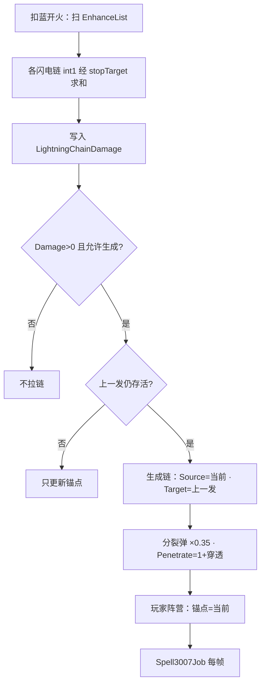
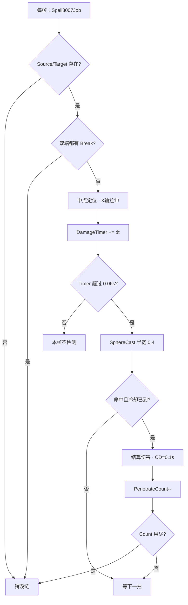

# 闪电链（Spell3007 / LightningChain）逆向分析

> 范围：仅玩家法术增强符文「闪电链」（`abilityType = 3007`，配置 ID `30071–30073`）。不含鱼叉链（`Spell1030`）与精英怪闪电链。
> 方法：`SpellConfig.json` + 反编译 `Assembly-CSharp` 交叉验证。未标注「推测」的结论均有代码/数据直接证据。
> 配套：总览见《魔法工艺法术系统逆向报告.md》，原始数值见《法术数值总表.md》。离线可开见 `闪电链逆向分析.html`。

---

## 1. 身份与定位


| 项             | 值                                                              |
| ------------- | -------------------------------------------------------------- |
| 中文名           | 闪电链                                                            |
| 英文名           | Chain of Lightning                                             |
| `abilityType` | `3007` / `SpellAbilityType.LightningChain`                     |
| 配置 ID         | `30071`（Lv1）/ `30072`（Lv2）/ `30073`（Lv3）                       |
| 稀有度           | 普通（`dropType=1`）                                               |
| `useType`     | `2`（Enhance 强化符文）                                              |
| 槽位消耗          | `slotCost=1`，`mpCost=0`，自身 `damage=0`                          |
| 作用对象          | `haveEffecforMissileSpell=true`，`haveEffecforSummonSpell=true` |
| 合成            | Lv1→Lv2→Lv3（`canCompound`：Lv1/2=`true`，Lv3=`false`）            |
| 售价（金币）        | 6 / 18 / 54                                                    |


**机制一句话**：插在主动法术前的 Enhance；当带闪电链伤害的法术被施放时，在**当前法术实体**与**上一发仍存活的法术实体**之间拉一条链，对路径上单位造成伤害。



文案（`TextConfig_Spell` id `7130071–7130073`）：

> 链接上一个施放的法术并对路径上的物体造成 **int1** 点伤害

---


## 2. 数值结构


### 2.1 配置表原始值（`assets_export/SpellConfig.json`）


| ID    | Level | float1 | int1（路径伤害基数） | 其余 float/int |
| ----- | ----- | ------ | ------------ | ------------ |
| 30071 | 1     | 0.2    | **12**       | 全 0          |
| 30072 | 2     | 0.2    | **24**       | 全 0          |
| 30073 | 3     | 0.2    | **48**       | 全 0          |


规律：`int1` 每级 ×2；`float1` 三级恒为 `0.2`。

### 2.2 通用槽位语义


| 字段              | 语义                                                              | 置信度     | 证据                                                       |
| --------------- | --------------------------------------------------------------- | ------- | -------------------------------------------------------- |
| **int1**        | 路径伤害基数；进 `GetLightningChainDamage_FinalPlayerValue`，并用于 UI 描述替换 | 高       | `CanShootSpellUtils.cs`；`SpellConfig.GetDes`；文案占位 `int1` |
| **float1**      | 配置存在但**当前 ECS/伤害结算均未读取**；运行时碰撞半宽硬编码为 `0.4`                      | 低（疑似残留） | Job 写死 `width = 0.4f`；描述与伤害公式均不用 `float1`                |
| float2/3、int2/3 | 未使用                                                             | 高       | 配置恒 0，无引用                                                |


> 既有《法术能力类型字段语义表》曾将 float1 标为「碰撞宽/半径?」。对照 `Spell3007Job` 后应修正为：**配置残留，运行时未接入**。


### 2.3 运行时常量（写死在代码，非配置）


| 常量            | 值                     | 位置                                                             |
| ------------- | --------------------- | -------------------------------------------------------------- |
| 伤害检测间隔        | `0.06` s              | `Spell3007Job`：`DamageTimer`                                   |
| 同目标伤害冷却       | `0.1` s               | `Spell3007DamageCoolDownBuffer.CoolDownTimer`                  |
| SphereCast 半宽 | `0.4`                 | `Spell3007Job`：`width = 0.4f`                                  |
| 分裂弹伤害系数       | `0.35`                | `SpellShootSystem.TrySpawnLightningChain`                      |
| 低帧优化阈值        | 桌面 `30` / 移动 `15` FPS | 同上（`DynamicOptimizeData`）                                      |
| 基础可命中敌人数      | `1 + BonusPenetrate`  | `PenetrateCount`；`BonusPenetrate = sip.PenetrateCount`（来自穿透符文） |


### 2.4 最终伤害公式

入口：`CanShootSpellUtils.GetLightningChainDamage_FinalPlayerValue`

```
对 EnhanceList 中每一个 LightningChain 配置 e：
  partial = GetDamage_FinalPlayerValue(e.int1, EnhanceList配置数组, stopTarget=e, wand).Result
  （即：只吃 e 之前的伤害加算/乘算强化 + 玩家 ExtraDamageRatio + 法杖 passiveDamageRatio + damageCorrection/100）

LightningChainDamage = Ceil( Σ partial )
```

关键代码：

```69:78:decompiled/Assembly-CSharp/CanShootSpellUtils.cs
	public static int GetLightningChainDamage_FinalPlayerValue(SpellShootData shootData, Wand wand)
	{
		SpellConfig[] array = shootData.EnhanceList.Select((SlotData e) => e.GetFinalConfig()).ToArray();
		float num = 0f;
		foreach (SpellConfig item in array.Where((SpellConfig e) => e.abilityType == SpellAbilityType.LightningChain))
		{
			num += GetDamage_FinalPlayerValue(item.int1, array, item, wand).Result;
		}
		return Mathf.CeilToInt(num);
	}
```

`GetDamage` 遇到 `stopTarget`（当前这张闪电链自身）即停止，因此：

- **闪电链左侧**的增强攻击/火晶石/过载/折射/节能等会影响其伤害；
- **闪电链右侧**的同段强化不计入该张闪电链；
- 多张闪电链各自结算后**求和**。

```7:39:decompiled/Assembly-CSharp/CanShootSpellUtils.cs
	public static RatioValue GetDamage(float baseDamage, IEnumerable<SpellConfig> enhances, SpellConfig stopTarget)
	{
		RatioValue ratioValue = new RatioValue(baseDamage);
		foreach (SpellConfig enhance in enhances)
		{
			if (enhance != stopTarget)
			{
				switch (enhance.abilityType)
				{
				case SpellAbilityType.EnhanceAttackRatio:
				case SpellAbilityType.FireCrystal:
				case SpellAbilityType.OverDrive:
					ratioValue.AddRatio(enhance.float1 / 100f);
					break;
				case SpellAbilityType.Refraction:
					ratioValue.MulRatio(enhance.float2 / 100f);
					break;
				case SpellAbilityType.PowerSavingMode:
					ratioValue.MulRatio(enhance.float3 / 100f);
					break;
				}
				continue;
			}
			return ratioValue;
		}
		return ratioValue;
	}

	public static RatioValue GetDamage_FinalPlayerValue(float baseDamage, SpellConfig[] enhances, SpellConfig stopTarget, Wand wand)
	{
		RatioValue damage = GetDamage(baseDamage, enhances, stopTarget);
		damage.AddRatio(PlayerMgr.Inst.ExtraDamageRatio).MulRatio(wand.passiveDamageRatio).MulRatio(wand.WandCfg.damageCorrection / 100f);
		return damage;
	}
```

写入施法参数：`SpellInitialParameter.ProcessShootDataEffect` → `sip.lightningChainDamage` → `SpellConfigComponentData.LightningChainDamage`。

UI 展示：`SpellConfig.GetDes` 对闪电链把描述里的 `int1` 替换为 `Ceil(int1 * damageRatio)`（带绿/红染色），与运行时完整公式不完全同一套，属展示层简化。

---


## 3. 运行时架构（双轨）

游戏同时残留 **MonoBehaviour 旧轨** 与 **DOTS/ECS 主轨**。当前施法主路径走 ECS。

```
法杖槽位解析 → SpellShootData.EnhanceList 含 LightningChain
        ↓
SpellInitialParameter：结算 lightningChainDamage / PenetrateCount
        ↓
ShootSpellUtils：写入 SpellSpawnParams.ConfigComponentData.LightningChainDamage
                 BonusPenetrate = sip.PenetrateCount
        ↓
SpellShootSystem 生成主动法术 Entity
  ├─ 若 LightningChainDamage > 0 且允许生成：
  │     TrySpawnLightningChain：
  │       Source = 当前法术，Target = _lastSpellEntity（上一发）
  │       Damage / PenetrateCount 写入 Spell3007LightningChainEffect
  │       玩家阵营则更新 _lastSpellEntity = 当前
  └─ 特殊武器可通过 Spell3007CreateRequest 缓冲走 SpawnLightningChainForRequest
        ↓
Spell3007LightningChainAttackSystem（EnhanceSpellSystemGroup）
  └─ Spell3007Job：跟点、SphereCast、冷却、穿透计数、销毁
```

**视觉双轨对照**（详见第 6 节）：


| 路径      | 视觉手段                                                                    | 伤害手段                      |
| ------- | ----------------------------------------------------------------------- | ------------------------- |
| ECS 主轨  | 子实体 `Spell3007Chain{Color}` + `LocalTransform`/`PostTransformMatrix` 拉伸 | `Spell3007Job` SphereCast |
| Mono 旧轨 | 双 `LineRenderer`（`lr_Laser` / `lr_Shadow`）逐帧 `SetPosition`              | `Physics.Raycast` 一击即毁    |


### 3.1 关键类型 / 文件


| 文件                                                 | 角色                                                     |
| -------------------------------------------------- | ------------------------------------------------------ |
| `Spell3007LightningChainEffect`                    | ECS 组件：Source/Target/Damage/PenetrateCount/DamageTimer |
| `Spell3007DamageCoolDownBuffer`                    | 每条链上的「已碰敌人 + 冷却」缓冲                                     |
| `Spell3007CreateRequest`                           | 外部请求生成链（如彼岸刀）                                          |
| `BreakLightningChain`                              | 空 tag；源/目标皆挂上时 Job 销毁链                                 |
| `Spell3007LightningChainAuthoring`                 | Baker：烘焙 Effect + CoolDownBuffer                       |
| `Spell3007LightningChainAttackSystem`              | 调度 Job                                                 |
| `Spell3007Job`                                     | 跟点 + 伤害主逻辑                                             |
| `SpellShootSystem`                                 | `_lastSpellEntity`、生成链、低帧优化                            |
| `CanShootSpellUtils`                               | 伤害结算                                                   |
| `Spell3007LightningChain` + `Spell3007ChainSystem` | **旧 Mono 路径**（LineRenderer + 分裂弹等）                     |


---


## 4. 生成逻辑（ECS 主路径）


### 4.1 触发条件（`SpellShootSystem`）

同时满足才 `TrySpawnLightningChain`：

1. `LightningChainDamage > 0`
2. `IgnoreSpawnLightningChain == false`
3. 主动法术 `AbilityType` **不是**：`BiAnLethalBlade` / `Umbrella` / `RuneHammer` / `LaserBeam`（这些走别的链生成或禁用）

```606:613:decompiled/Assembly-CSharp/SpellShootSystem.cs
		if (spawnParams.ConfigComponentData.LightningChainDamage > 0f && !spawnParams.IgnoreSpawnLightningChain && spawnParams.ConfigComponentData.AbilityType != SpellAbilityType.BiAnLethalBlade && spawnParams.ConfigComponentData.AbilityType != SpellAbilityType.Umbrella && spawnParams.ConfigComponentData.AbilityType != SpellAbilityType.RuneHammer && spawnParams.ConfigComponentData.AbilityType != SpellAbilityType.LaserBeam)
		{
			TrySpawnLightningChain(ref state, spawnParams, spellSingleton, entity);
			if (DTool.IsSameCamp(spawnParams.ConfigComponentData.ShooterType, UnitType.Player))
			{
				_lastSpellEntity = entity;
			}
		}
```

玩家阵营成功走完生成分支后：`_lastSpellEntity = 当前法术`。  
系统 `OnCreate` 会把 `_lastSpellEntity` 置空——换场景/重建后第一发只更新锚点、不拉链。

### 4.2 `TrySpawnLightningChain` 要点

1. 需要 `_lastSpellEntity` 仍存在且带 `SpellConfigComponentData`，否则直接 return。
2. 实例化预制体键：`"Spell_3007"`（逻辑根）+ 颜色子实体 `"Spell3007Chain{Color}"`（视觉），子实体 `Parent` 到链根，并加入 `LinkedEntityGroup`。
3. 伤害：普通用 `LightningChainDamage`；分裂弹 `×0.35`；低帧优化可能跳过或再乘补偿系数。
4. 写入 Effect：`Source=当前`，`Target=上一发`，`PenetrateCount=1+BonusPenetrate`。

```616:655:decompiled/Assembly-CSharp/SpellShootSystem.cs
	private void TrySpawnLightningChain(ref SystemState state, SpellSpawnParams spawnParams, SpellSingleton spellSingleton, Entity spell)
	{
		if (!_lastSpellEntity.HasValue || !InternalCompilerInterface.DoesEntityExist(ref __TypeHandle.__EntityStorageInfoLookup, ref state, _lastSpellEntity.Value) || !InternalCompilerInterface.HasComponentAfterCompletingDependency(ref __TypeHandle.__SpellConfigComponentData_RO_ComponentLookup, ref state, _lastSpellEntity.Value))
		{
			return;
		}
		// ... 低帧优化：可能 return，或 num2 = 阈值/CurrentFPS ...
		FixedString64Bytes fs = "Spell_3007";
		Entity entity = state.EntityManager.Instantiate(spellSingleton.Prefabs[fs]);
		spawnParams.ConfigComponentData.ColorType.ColorEnumToString(out var result);
		fs = $"Spell3007Chain{result}";
		Entity entity2 = state.EntityManager.Instantiate(spellSingleton.Prefabs[fs]);
		state.EntityManager.AddComponent<Parent>(entity2);
		state.EntityManager.SetComponentData(entity2, new Parent
		{
			Value = entity
		});
		state.EntityManager.AddBuffer<LinkedEntityGroup>(entity).Add(new LinkedEntityGroup
		{
			Value = entity2
		});
		float num3 = (spawnParams.IsSplitSpell ? (spawnParams.ConfigComponentData.LightningChainDamage * 0.35f) : spawnParams.ConfigComponentData.LightningChainDamage);
		num3 *= num2;
		InternalCompilerInterface.SetComponentAfterCompletingDependency(ref __TypeHandle.__Spell3007LightningChainEffect_RW_ComponentLookup, ref state, new Spell3007LightningChainEffect
		{
			SourceEntity = spell,
			TargetEntity = _lastSpellEntity.Value,
			Damage = num3,
			PenetrateCount = 1 + spawnParams.BonusPenetrate
		}, entity);
	}
```


### 4.3 `Spell3007CreateRequest` 旁路

缓冲字段：`Source / Damage / Penetrate / ColorName / MarkAsFired`。  
`SpawnLightningChainForRequest` 用 `1 + req.Penetrate` 作穿透，并按 `MarkAsFired` 更新 `_lastSpellEntity`。彼岸刀等武器通过此缓冲造链。

### 4.4 旧 Mono 路径（对照）

```1:24:decompiled/Assembly-CSharp/Spell3007ChainSystem.cs
public static class Spell3007ChainSystem
{
	public static SpellBase lastChainSpell;

	public static void CreateChains(SpellBase[] spells, Wand targetWand)
	{
		SpellBase[] array = spells.Where((SpellBase e) => e.lightningChainDamage > 0f).ToArray();
		for (int i = 0; i < array.Length; i++)
		{
			if (lastChainSpell != null && lastChainSpell.gameObject.activeInHierarchy)
			{
				CreateChain(lastChainSpell, array[i], targetWand, PlayerMgr.Inst.PlayerPpt);
			}
			lastChainSpell = array[i];
		}
	}

	private static void CreateChain(SpellBase s1, SpellBase s2, Wand wand, UnitProperty unitPpt)
	{
		float chainDamage = (s1.lightningChainDamage + s2.lightningChainDamage) / 2f;
		ObjPoolMgr.Inst.GetGO("Prefabs/Spell/30071").GetComponent<Spell3007LightningChain>().Iniatialize(unitPpt, s1.transform, s2.transform, chainDamage, wand, s1, s2);
	}
}
```

要点：

- 伤害取 **两发平均值** `(s1+s2)/2`（与 ECS「只用当前发 Damage」不同）
- 对象池路径：`Prefabs/Spell/30071` → `Spell3007LightningChain`
- `Update` 里 `Physics.Raycast` 命中后结算一次，然后回收——**单次命中即毁**
- 分裂弹经 `SpellBase.CreateSplitSpellLightningChain` 仍可能走此轨

---


## 5. 帧逻辑（`Spell3007Job`，ECS）

每个带 `Spell3007LightningChainEffect` 的实体每帧：

1. **端点失效**（Source/Target 不存在或坐标 NaN）→ 销毁链。
2. **双端均有** `BreakLightningChain` → 销毁链。
3. **视觉跟点**：链中点定位、朝向 `atan2`、`PostTransformMatrix` 按两端距离在 X 轴缩放（**不用 LineRenderer**）。
4. `DamageTimer += dt`；未超过 `0.06` 则本帧不检测。
5. 到期后：`SphereCast`（起=Source，终=Target，宽=`0.4`，阵营 `Teammate`）。
6. 命中单位：冷却 `0.1s`；`PenetrateCount--`，`<=0` 销毁。
7. 伤害包 `AbilityType` 强制为 `LightningChain`；元素/配置取自 **Source**。



```179:201:decompiled/Assembly-CSharp/Spell3007Job.cs
			float3 rayStart = componentData.Position;
			float3 position = componentData2.Position;
			float3 @float = ((math.distance(rayStart, position) <= 0.01f) ? new float3(1f, 0f, 0f) : math.normalize(position - rayStart));
			float num = math.distance(rayStart, position);
			float3 rootPosition = rayStart + (position - rayStart) / 2f;
			float3 layerPosition = DTool.GetLayerPosition(in rootPosition, LayerCorrectType.Coordinate);
			rootPosition += layerPosition;
			chainTrans.Position = rootPosition;
			float3 xyz = new float3(0f, 0f, math.atan2(@float.y, @float.x));
			chainTrans.Rotation = quaternion.Euler(xyz);
			freeScale.Value = Matrix4x4.Scale(new Vector3(num, 1f, 1f));
			singleton.DamageTimer += DeltaTime;
			if (singleton.DamageTimer <= 0.06f)
			{
				return;
			}
			singleton.DamageTimer -= 0.06f;
			// ...
			float width = 0.4f;
			UnitType selfCamp = UnitType.Teammate;
			SpellTools.GetAttackableEntitiesInSphereCast(in rayStart, in rayEnd, in width, in selfCamp, containsBrittleness: false, ...);
```

单位结算与穿透消耗：

```233:261:decompiled/Assembly-CSharp/Spell3007Job.cs
					if (value.CoolDownTimer <= 0f && list.Contains(damageCoolDownBuffer[num2].EnemyEntity))
					{
						value.CoolDownTimer = 0.1f;
						TakeDamageInfo_Dots.NewInfo(singleton.Damage, out var info2);
						info2.spell = new TakeDamageInfo_Dots.SpellData
						{
							Entity = chainSpell,
							Transform = chainTrans,
							Config = SpellConfigLookup[singleton.SourceEntity],
							ElementEffect = SpellElementLookup[singleton.SourceEntity],
							CostPenetrate = false,
							CostRefraction = false
						};
						info2.attackerEntity = SpellLookup[singleton.SourceEntity].OwnerEntity;
						flag3 = true;
						info2.spell.Config.AbilityType = SpellAbilityType.LightningChain;
						Cmd.AppendToBuffer(chunkIndexInQuery, damageCoolDownBuffer[num2].EnemyEntity, info2);
						// ... 粒子 3007_Hit_{Color} ...
						singleton.PenetrateCount--;
						if (singleton.PenetrateCount <= 0)
						{
							Cmd.DestroyEntity(chunkIndexInQuery, chainSpell);
							list.Dispose();
							return;
						}
					}
```


### 5.1 穿透语义（易误解）

此处 `PenetrateCount` **不是**弹道穿墙次数，而是：**这条链在销毁前最多能对多少个「单位目标」完成一次伤害结算**。  
基础为 1；同段穿透符文（`SpellAbilityType.Penetrate` 的 `int1` 累加）经 `BonusPenetrate` 追加。

### 5.2 元素与表现继承

ECS 路径：伤害 info 携带 Source 的 `SpellElementEffectComponentData` / `SpellConfigComponentData`。  
旧 Mono 路径：从 `targetSpell` 拷贝冰冻/粘液/毒/燃烧/虚空、暴击率、拉扯晶石、**LineRenderer 线宽与材质**等。

---


## 6. 视觉表现：LineRenderer（Mono）与 ECS 缩放链

闪电链有两套视觉实现，**不要混为一谈**。

### 6.1 总览


|       | Mono 旧轨 `Spell3007LightningChain`                                        | ECS 主轨 `Spell3007Job`                                   |
| ----- | ------------------------------------------------------------------------ | ------------------------------------------------------- |
| 组件    | 两个 `LineRenderer`：`lr_Laser`、`lr_Shadow`                                 | 无 LineRenderer；子实体 `Spell3007Chain{Color}`              |
| 端点更新  | 每帧 `SetPosition(0/1, …)`                                                 | 中点 `LocalTransform` + X 轴 `PostTransformMatrix` 缩放为两端距离 |
| 线宽    | `startWidth = Pow(伤害倍率, 1/3) * spellVolumeRatio`                         | 由预制体自身厚度决定（Job 不改宽度）                                    |
| 颜色/元素 | 按 `SpellColorType` 换 `lr_Laser.material`（冰/粘/毒/火/雷/虚空/玩家）                | 生成时选对应颜色预制体键                                            |
| 透明度   | `OnEnable` 用设置里的 `FinalSpellTransparent` 改 `colorGradient`               | 预制体/材质侧                                                 |
| 层级校正  | Laser：`Tool2D.GetLayerPoint` + `z+0.05`；Shadow：`IgnoreZPoint(..., 1.05)` | `DTool.GetLayerPosition` 加到中点                           |
| 命中后视觉 | 对象池 `Prefabs/Spell/30071/30071_Hit_{colorType}`                          | 全局粒子缓冲 `3007_Hit_{Color}`                               |


### 6.2 Mono：双 LineRenderer 职责

```6:10:decompiled/Assembly-CSharp/Spell3007LightningChain.cs
public class Spell3007LightningChain : MonoBehaviour
{
	public LineRenderer lr_Laser;

	public LineRenderer lr_Shadow;
```

- `lr_Laser`：主闪电光束。换材质表达元素色；参与玩家「法术透明度」设置。
- `lr_Shadow`：投影/阴影线。与 Laser 同步端点与线宽，但 Z/层级处理不同（压到阴影层），材质不随元素切换（代码只改 `lr_Laser.material`）。

这是项目里激光类法术的常见模式（高压射线 `Spell1019`、蛇行 `Spell1010` 等也是 BodyLine + ShadowLine）。

### 6.3 初始化：透明度、材质、线宽

对象从池取出 `OnEnable` 时重置状态，并按全局法术透明度改两条线的渐变：

```112:113:decompiled/Assembly-CSharp/Spell3007LightningChain.cs
		lr_Laser.colorGradient = lr_Laser.colorGradient.GetGradientWithTransparent(new float[2] { 1f, 1f }, DataMgr.settingData.FinalSpellTransparent);
		lr_Shadow.colorGradient = lr_Shadow.colorGradient.GetGradientWithTransparent(new float[2] { 1f, 1f }, DataMgr.settingData.FinalSpellTransparent);
```

`Iniatialize` 中：

1. 绑定两端 `Transform`（两发法术）与伤害；
2. 从 `targetSpell`（通常为较新的一端）继承元素/暴击/体积等；
3. `switch (ColorType)` 把 `lr_Laser.material` 换成 `mat_ECFrozen` / `mat_ECFire` / …；
4. 线宽：

```289:292:decompiled/Assembly-CSharp/Spell3007LightningChain.cs
		lr_Laser.startWidth = Mathf.Pow(f, 0.3333f) * targetSpell.spellVolumeRatio;
		lr_Shadow.startWidth = Mathf.Pow(f, 0.3333f) * targetSpell.spellVolumeRatio;
		casterWand = targetWand;
		Update();
```

其中 `f = damageRatio * finalDamageRatio`。立方根缩放让伤害倍率变化时线宽不会线性暴涨。  
（注意：这里只设了 `startWidth`，未改 `endWidth`——若预制体两端宽度本就一致，视觉上仍是等宽线段。）

### 6.4 每帧：端点跟随 + Raycast 打断

未命中时，两条 LineRenderer 各两点连成线段：

```177:180:decompiled/Assembly-CSharp/Spell3007LightningChain.cs
		lr_Laser.SetPosition(0, Tool2D.GetLayerPoint(tsf_Spell1.position) + new Vector3(0f, 0f, 0.05f));
		lr_Laser.SetPosition(1, Tool2D.GetLayerPoint(tsf_Spell2.position) + new Vector3(0f, 0f, 0.05f));
		lr_Shadow.SetPosition(0, Tool2D.IgnoreZPoint(tsf_Spell1, 1.05f));
		lr_Shadow.SetPosition(1, Tool2D.IgnoreZPoint(tsf_Spell2, 1.05f));
```


| 调用                         | 作用                             |
| -------------------------- | ------------------------------ |
| `Tool2D.GetLayerPoint`     | 把世界坐标校正到游戏 2D 逻辑层，避免深度穿插       |
| `z + 0.05`                 | Laser 略抬起，压在场景之上               |
| `IgnoreZPoint(tsf, 1.05f)` | Shadow 固定到阴影 Z（`1.05`），形成贴地投影感 |


命中逻辑（与视觉同帧）：

```132:185:decompiled/Assembly-CSharp/Spell3007LightningChain.cs
		if (Physics.Raycast(tsf_Spell1.position, tsf_Spell2.position - tsf_Spell1.position, out hit, 100f, attackLayer)
			&& (tsf_Spell1.position - hit.point).sqrMagnitude <= (tsf_Spell1.position - tsf_Spell2.position).sqrMagnitude)
		{
			UnitProperty component = hit.transform.GetComponent<UnitProperty>();
			SetElementEffect(component);
			TakeDamageInfo takeDamageInfo = component.TakeDamage(damage, ownerPpt, new TakeDamageInfo
			{
				criticalChance = lightCriticalChance
			});
			// ... 蓄能槽充能 / 暴击拉扯 ...
			SpawnHitObject(hit.transform.position);
			ObjPoolMgr.Inst.RecycleGO(base.gameObject);
			SEMgr.Inst.spell3007Hit.PlaySE();
		}
```

要点：

- Raycast 方向为 spell1→spell2，距离上限 `100`；`attackLayer` 在 Inspector 配置；
- 额外判断命中点不超出两端距离（避免打到线段延长线上的物体）；
- **命中即回收**，LineRenderer 生命周期随对象池 GO 结束——这与 ECS 链「持续存在直到穿透耗尽/端点消失」不同；
- 任一端 `activeSelf==false` 或彼岸刀进入 `Follow` 状态也会直接回收。


### 6.5 ECS：为何不用 LineRenderer

ECS 链根实体每帧做的是「把一根预制体线段放到中点并按长度拉伸」：

```
position = midpoint(Source, Target) + layerCorrect
rotation = Euler(0, 0, atan2(dir.y, dir.x))
scale.x  = distance(Source, Target)   // PostTransformMatrix
```

子实体键名 `Spell3007Chain{Color}` 在生成时按颜色 Instantiate，相当于把「换 LineRenderer 材质」换成「换彩色预制体」。  
Burst Job 无法方便地驱动托管 `LineRenderer`，因此主路径改用纯 Transform 缩放，这是 DOTS 化后的自然结果。

---


## 7. 数据结构速查

```csharp
// 配置侧（SpellConfig）
// abilityType=3007, int1=伤害基数, float1=0.2（未使用）

struct Spell3007LightningChainEffect : IComponentData {
    Entity SourceEntity;   // 当前法术（新）
    Entity TargetEntity;   // 上一发法术（旧）
    float  Damage;
    int    PenetrateCount;
    float  DamageTimer;
}

struct Spell3007DamageCoolDownBuffer : IBufferElementData {
    Entity EnemyEntity;
    float  CoolDownTimer;  // 归零可再伤，命中后置 0.1
}

struct Spell3007CreateRequest : IBufferElementData {
    Entity Source;
    int Penetrate;
    FixedString32Bytes ColorName;
    float Damage;
    bool MarkAsFired;
}

struct BreakLightningChain : IComponentData { } // tag

// Mono 视觉（仅旧轨）
// Spell3007LightningChain : MonoBehaviour
//   LineRenderer lr_Laser;   // 主光束 + 元素材质
//   LineRenderer lr_Shadow;  // 阴影线
//   Material mat_ECFrozen / Mucus / Player / Venom / Fire / Thunder / Void;
```

---


## 8. 与构筑相关的行为摘要


| 行为            | 结果                                       |
| ------------- | ---------------------------------------- |
| 仅一张闪电链 + 主动法术 | 主动法术带 `LightningChainDamage`；第二发起与上一发连线  |
| 多张闪电链在同一主动前   | `int1` 各自经强化后**求和**                      |
| 闪电链左侧放伤害%强化   | 提高链伤害（`stopTarget` 截断规则）                 |
| 同段加穿透         | 提高链可伤害的敌人数（`1+Σ穿透int1`）                  |
| 分裂弹           | ECS：链伤害 ×0.35；Mono：平均伤害 + LineRenderer 链 |
| 彼岸刀/伞/符文锤/激光束 | 默认自动建链被排除；刀类走 CreateRequest              |
| 低帧优化          | 可能跳过生成，或抬高单次 Damage 补偿                   |


---


## 9. 证据索引


| 结论                           | 文件                                                                          |
| ---------------------------- | --------------------------------------------------------------------------- |
| 配置数值                         | `assets_export/SpellConfig.json`（30071–30073）                               |
| 描述文案                         | `assets_export/TextConfig_Spell.json`（703007x / 713007x）                    |
| 伤害求和公式                       | `CanShootSpellUtils.GetLightningChainDamage_FinalPlayerValue`               |
| 通用伤害 Ratio                   | `CanShootSpellUtils.GetDamage` / `GetDamage_FinalPlayerValue`               |
| SIP 写入                       | `SpellInitialParameter.Builder.ProcessShootDataEffect`                      |
| SpawnParams 映射               | `ShootSpellUtils`（`LightningChainDamage`、`BonusPenetrate`）                  |
| 生成与上一发锚点                     | `SpellShootSystem.TrySpawnLightningChain` / `SpawnLightningChainForRequest` |
| 帧伤害与 ECS 视觉缩放                | `Spell3007Job.Execute`                                                      |
| System 分组                    | `Spell3007LightningChainAttackSystem` → `EnhanceSpellSystemGroup`           |
| Mono 建链                      | `Spell3007ChainSystem`                                                      |
| **LineRenderer 双线/材质/线宽/端点** | `Spell3007LightningChain`（`lr_Laser` / `lr_Shadow`）                         |
| UI int1 染色                   | `SpellConfig.GetDes`（`abilityType == LightningChain`）                       |


---


## 10. 待决 / 局限

1. `float1=0.2`：全链路未读；是否历史碰撞宽或策划废弃字段，静态分析无法证实。建议以「未使用」对待，勿写入复刻逻辑。
2. **Mono 与 ECS 并存**：复刻应以 ECS（`SpellShootSystem` + `Spell3007Job`）为准；旧轨伤害取平均、LineRenderer + 单次 Raycast 即毁。
3. **SphereCast 与墙体**：Job 未在链上做「撞墙截断」；旧 Mono 的 Raycast 会在墙/单位处打断。
4. **ECS 链预制体网格**：`Spell3007Chain{Color}` 的具体 Mesh/Shader 在资源侧，未导出 Prefab 细节；本文只还原了 Transform 驱动方式。
5. 本文不覆盖 `Spell1030` 鱼叉传导链、遗物 `LightningHarpoon`、精英 `Elite13_LightningChain`。

