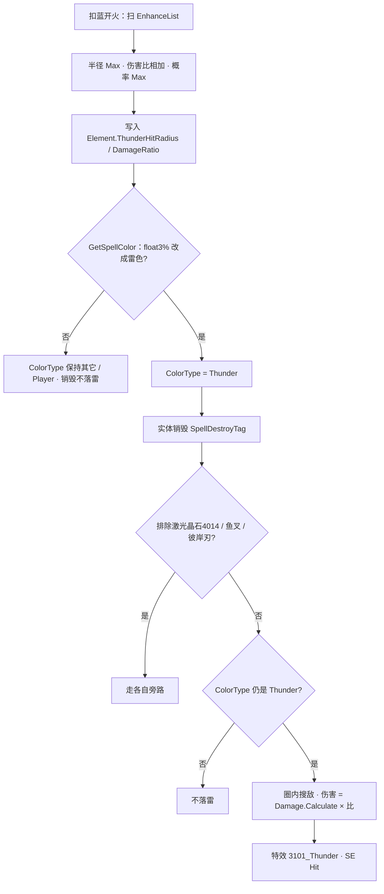

# 雷霆晶石（Spell3101 / ThunderCrystal）逆向分析

> 范围：仅玩家强化符文「雷霆晶石」（`abilityType = 3101`，配置 ID `31011–31013`）。重点是**概率怎么变成外观色**，以及**销毁时 `CheckFallThunderDamage` 怎么落雷**。
> 不展开激光晶石 / 鱼叉 / 彼岸刃 / 符文锤自己的 `ThunderStone` 周期落雷，只写它们是否复用同一包 `ThunderHit*`。不写雷霆导游旗、敌人雷弹。
> 方法：`SpellConfig.json` + 反编译 `Assembly-CSharp` 交叉验证。未标注「推测」的结论均有代码/数据直接证据。
> 玩家施法主路径是 ECS。Mono `SpellBase` 叠加上限与 ECS 一致，销毁判定多一次「伤害比 > 0」，文末单独对照。
> 配套：总览见《魔法工艺法术系统逆向报告.md》，原始数值见《法术数值总表.md》，槽位解析骨架见《伤害强化逆向分析.md》，半径加算见《范围增强逆向分析.md》，子弹整包继承元素见《分裂逆向分析.md》，其它晶石见《粘液晶石逆向分析.md》。

---

## 1. 身份与定位


| 项 | 值 |
| --- | --- |
| 中文名 | 雷霆晶石 |
| 英文名 | Thunder Crystal |
| `abilityType` | `3101` / `SpellAbilityType.ThunderCrystal` |
| 配置 ID | `31011`（Lv1）/ `31012`（Lv2）/ `31013`（Lv3） |
| 稀有度 | 稀有（`dropType=2`），`needActivate=true` |
| `useType` | `2`（Enhance 强化符文） |
| 槽位消耗 | `slotCost=1`，自身 `mpCost=0`、`damage=0` |
| 作用对象 | `haveEffecforMissileSpell=true`，`haveEffecforSummonSpell=true` |
| 合成 | Lv1→Lv2→Lv3（`canCompound`：Lv1/2=`true`，Lv3=`false`） |
| 售价（金币） | 18 / 54 / 162 |


**机制一句话**：插在主动/召唤**左侧**。发射时把半径和伤害比烘焙进 `SpellElementEffectComponentData`；`float3%` 只在**染色**时掷一次，成功就把 `ColorType` 改成 `Thunder`。实体挂 `SpellDestroyTag` 时，若外观仍是雷色，就在销毁点对圈内敌人打一记额外伤害。`Spell3101ThunderCrystalSystem` 只播特效和音效，不算伤。



文案（`TextConfig_Spell` id `7131011–7131013`）：

> 法术结束时**float3**%的概率会对**float1**米影响半径内的敌人造成**float2**%的额外伤害

名称（`7031011–7031013`）：雷霆晶石 / Thunder Crystal。三级名称相同，只有三个 `float` 不同。

底部补充（`7231011`）：

> 应用多个雷霆晶石时，雷霆概率取最高，伤害合并。
> 雷霆晶石带来的的外观变化会覆盖其他元素附着效果，但不影响最终效果。

「法术结束时再掷 float3%」与实现不符，见 2.3。

---

## 2. 数值与叠加

### 2.1 配置表（`assets_export/SpellConfig.json`）


| ID | Level | float1 半径(m) | float2 伤害% | float3 概率% | int1 | int2 | 售价 | 可合成 |
| --- | --- | --- | --- | --- | --- | --- | --- | --- |
| 31011 | 1 | **2.2** | **200** | **15** | 40 | 2 | 18 | true |
| 31012 | 2 | **2.4** | **270** | **20** | 60 | 3 | 54 | true |
| 31013 | 3 | **2.8** | **320** | **30** | 80 | 4 | 162 | false |


规律：售价每级 ×3。三个 `float` 都不是「每级 ×2」。`int3` 为 0。无耗蓝倍率。比伤害强化（9/27/81）贵一档，和粘液同档的两倍。

### 2.2 字段语义


| 字段 | 语义 | 运行时是否被读 | 置信度 |
| --- | --- | --- | --- |
| **float1** | 落雷半径（米）；多张取 **Max**；写入后再乘范围加算 / 聚爆 / 缩范围 | 是 | 高 |
| **float2** | 额外伤害百分比；多张 **相加** `float2/100` | 是 | 高 |
| **float3** | 染色成 `Thunder` 的概率（文案写成「结束时概率」）；多张取 **Max** | 是（染色时） | 高 |
| int1 / int2 | 配置有值（40/60/80，2/3/4） | ECS / Mono 玩家路径 **未读** | 高 |
| int3 | 配置为 0 | 未读 | 高 |
| `haveEffecforMissile/Summon` | 对弹幕与召唤都标为生效 | `GetThunderElementData` **不读** | 高 |


`int1` / `int2` 很像旧版「概率 / 段数」残留。当前叠加入口、染色、销毁落雷都不碰它们。

### 2.3 文案 vs 实现

`GetThunderElementData` 算出的 `ThunderHitChance` **没有**写入 `SpellElementEffectComponentData`（组件里只有半径和伤害比）。销毁时也不再掷骰。

真正的门槛是两段：

1. **发射时** `SpellTools.GetSpellColor`：用 EnhanceList 里 `float3` 的 Max / 100 掷一次。成功则 `ColorType = Thunder`，并且**先于**其它晶石的随机色。
2. **销毁时** `CheckFallThunderDamage`：只问 `ColorType == Thunder`。是则 100% 落雷；不是则半径和伤害比都在包里也**不打**。

所以文案「结束时 float3%」的实际含义是「发射时 float3% 染成雷色，染上了结束必落」。底部「外观覆盖不影响最终效果」指的是**其它**元素（粘/毒/冰/烧/虚空）仍按数据包挂；雷霆自己的圈伤**跟外观走**。

`7231011` 前半句是对的：概率 Max、伤害相加。

### 2.4 法术侧：组卡时合成一包（Max + 相加）

```466:482:decompiled/Assembly-CSharp/SpellShootData.cs
	public (float ThunderHitChance, float ThunderHitRadius, float ThunderHitDamageRatio) GetThunderElementData()
	{
		// ...
			if (finalConfig.abilityType == SpellAbilityType.ThunderCrystal)
			{
				num = math.max(num, finalConfig.float3 / 100f);
				num2 = math.max(num2, finalConfig.float1);
				num3 += finalConfig.float2 / 100f;
			}
		return (num, num2, num3);
	}
```

- **概率 / 半径**：取最大，不累加。
- **伤害比**：相加。两张 Lv1 是 **400%**，不是 200%。
- 这个函数**不读** `haveEffecfor*`。只要解析器把卡挂进 `EnhanceList`，弹幕和召唤都会带上数据包。

`SipToSSP` 丢掉 Chance，只写后两个，并且半径再乘三层范围：

```311:312:decompiled/Assembly-CSharp/ShootSpellUtils.cs
			ThunderHitRadius = sip.ThunderElementData.ThunderHitRadius * (1f + sip.extraSizeRatio) * sip.finalSizeRatio * info.ShootData.GetSpellDecreaseRadiuSpeedInfo().radiusRatio,
			ThunderHitDamageRatio = sip.ThunderElementData.ThunderHitDamageRatio
```

| 乘数 | 来源 |
| --- | --- |
| `1 + extraSizeRatio` | 范围增强加算 + 玩家/法杖半径遗物 |
| `finalSizeRatio` | 聚爆一类乘算（常见 ×0.5） |
| `GetSpellDecreaseRadiuSpeedInfo().radiusRatio` | 缩范围符文 `RadiuRatioDown`，连乘 `float1/100` |


之后飞行中不再重算。分裂复印的是这份已经乘完的半径（见 4.3）。

等级**不能**按「2×Lv1 = 1×Lv2」换算：

```
2×Lv1：概率 15%，半径 2.2，伤害比 4.00
1×Lv2：概率 20%，半径 2.4，伤害比 2.70
3×Lv1：概率 15%，半径 2.2，伤害比 6.00
1×Lv3：概率 30%，半径 2.8，伤害比 3.20
```

合成省槽，换「更稳的染色、稍大的圈」；叠低级在伤害比上往往更高。

### 2.5 谁吃得到这张卡

`SpellGroupParser` 从左到右扫，规则与粘液 / 伤害强化相同：只强化自己右边、同一段。主槽加不到后槽。

```
[雷] [弹]           弹带雷霆包
[弹] [雷]           弹带不到
[雷] [弹] [弹]      两发都带
[雷A] [弹] [雷B] [滚球]   弹吃 A；滚球吃 A+B（伤害比相加，半径/概率取 max）
```

自动填槽：`SelfRepelSpells` 含 `ThunderCrystal`，**同一根杖不会自动再塞第二张**。手摆可以叠。测试相加必须手插。

魔能升阶把 `31011` 抬成 `31012` / `31013`。叠加规则不变，变的是送进 Max / 相加的那组数。

---

## 3. 主路径（核心）

普通弹道走下面四步。落雷**不是**命中时挂的 Debuff，也不是独立追踪弹。圈心是**销毁瞬间的实体位置**。

### 3.1 发射时烘焙，只扫一次

1. `SpellInitialParameter.Builder` 调 `GetThunderElementData`，写入 `SIP.ThunderElementData`。
2. 同一轮末尾 `ProcessSpellColor` → `GetSpellColor`。
3. `ShootSpellUtils.SipToSSP` 写 `ColorType`、`ThunderHitRadius`、`ThunderHitDamageRatio`。

`GetSpellColor`：

```1639:1664:decompiled/Assembly-CSharp/SpellTools.cs
	public static SpellColorType GetSpellColor(SpellShootData shoot, SpellColorType currentColor, bool useRandomColorByWand)
	{
		if (currentColor != SpellColorType.Thunder)
		{
			float num = /* EnhanceList 里 ThunderCrystal 的 Max(float3) */ / 100f;
			if (UnityEngine.Random.Range(0f, 1f) < num)
			{
				return SpellColorType.Thunder;
			}
		}
		if (useRandomColorByWand)
		{
			return currentColor;
		}
		// 其它晶石 ToSpellColor() 去重后随机；雷晶石不在这张映射里
		return SpellColorType.Player;
	}
```

要点：

- 雷色判定**最先**。成功就直接返回，不再和粘/毒/冰/火/虚空抽签。
- `ThunderCrystal` **不在** `ToSpellColor()` 里。染色失败、又没有其它晶石时，回落 `Player`。
- 当前颜色已经是 `Thunder`（彩虹 / 随机色杖先涂过）时，**不再掷** `float3`。若 `IsRandomColor` 为真，就保持雷色 → 这发 **100%** 会落雷。
- 彩虹 / 随机色杖的灌晶石发生在 `SipToSSP` **之后**，按**最终** `ColorType` 再 `ApplyElementSpell`：半径再 Max 一次表值（**不再乘**范围加算），伤害比再加一档对应等级。

### 3.2 销毁时：只认颜色

`SpellDestroyEventJob` 在带 `SpellDestroyTag` 的法术实体上调用 `CheckFallThunderDamage`。名字带 Fall，实际是**通用销毁**，不是坠落专用。

排除三种自己管落雷的法术：`LaserBeam`（**4014**，激光晶石 / 棱镜核心）、`DaveHarpoons`（4024）、`BiAnLethalBlade`（4019）。

> **勿与激光 `Laser`（1004）混淆。** 排除项是 `SpellAbilityType.LaserBeam = 4014`，主动飞弹「激光」是 `SpellAbilityType.Laser = 1004`（`SpellAbilityType.cs` L7 / L107），**不在**排除名单里，照常走这套销毁落雷。详见 `激光逆向分析.md` §7.10。

```2254:2273:decompiled/Assembly-CSharp/SpellTools.cs
	public static void CheckFallThunderDamage(...)
	{
		if (spellConfig.ColorType != SpellColorType.Thunder)
		{
			return;
		}
		DTool.GetEnemyEntityInRange(..., ThunderHitRadius, ..., containsBrittleness: true, ...);
		CMD.AppendToBuffer(..., new Spell3101NewThunderHitData { StartPos = position, Scale = ThunderHitRadius });
		info.spell.Config.AbilityType = SpellAbilityType.ThunderCrystal;
		info.damage = spellConfig.Damage.Calculate() * spellElementEffect.ThunderHitDamageRatio;
		// 圈内每个敌人 Append TakeDamageInfo
	}
```

- 门闩只有 `ColorType`。**不读** `ThunderHitChance`，也不看伤害比是否 > 0。
- 搜敌：敌对阵营 + 脆弱物，半径用已经乘完范围的 `ThunderHitRadius`。「脆弱物」包含**法术实体**：`RemoveCannotAttackSpell` 只保留异阵营的滚球 `1002` 与蝴蝶 `1003`，其余法术实体一律剔除。所以落雷会打掉敌方的滚球/蝴蝶，但**打不到自己的**（`DTool.IsSameCamp` 守卫；Mono 侧 `SpellBase` L1636 同样有 `!IsSameCamp(this)`）。一发多弹的法术是每个实体销毁时各落一次雷——Lv3 蝴蝶 5 只就是 5 次。
- 伤害：`Damage.Calculate()` × 伤害比。`Calculate()` 是发射快照里的最终伤害（含伤害强化加算、法杖乘算等），**不是**表 `damage` 原值。DPS 间隔伤不会再乘一遍 `DamageInterval`——`NewInfo` 先按间隔写过，随即被这行覆盖。
- `CostPenetrate = false`。`CostRefraction` 走 `NewInfo` 默认值 **true**：销毁当帧实体若还在，圈内每个目标都可能尝试折射（`RemainCount`、非坠落）。
- `info` 带着原弹的整包 `ElementEffect`。`UnitPropertyJob` 在 `damage > 0` 时会**再挂**粘/毒/冰/烧/虚空。圈里没被母弹打到的敌人，也可能被这记落雷上元素。
- 复制配置的 `AbilityType` 改成 `ThunderCrystal`，只影响这包伤害 info，不改实体本身。
- 没搜到敌人也会丢一条 `Spell3101NewThunderHitData`，特效照播。

`Spell3101ThunderCrystalSystem`（`EnhanceSpellSystemGroup`）消费这个 buffer：粒子 `3101_Thunder`，尺寸 = `Scale.x / SpellConfig.dic[31011].float1`（用 Lv1 的 2.2 做基准），SE `Hit`（`Replay`，3，0.2）。播完清空。

### 3.3 「法术结束」包含哪些销毁

凡是给实体挂上 `SpellDestroyTag` 且不是上面三个排除项，都会走 3.2。包括：

| 情况 | 圈心 |
| --- | --- |
| 飞行到时 / 持续时间走完 | 当时位置 |
| 命中后销毁（穿透耗尽、打墙且不能穿） | 命中 / 撞墙点 |
| 悬停第二段走完 | 悬停位置，不是起飞点 |
| 坠落落地后销毁 | 落地点（坠落附加圈是另一套伤） |
| 召唤物实体销毁 | 死亡位置（配置允许挂到召唤上） |


穿透还没耗尽时实体还活着，**不会**提前落雷。打空飞到时才落。

激光 1004 **不在**排除名单（名单里是 `LaserBeam` 4014），槽位上的 3101 **会**走这套销毁落雷。而且激光寿命只有 0.2s（硬编码，`SpellSystem` 里被排除出 `Duration` 检查）且必然销毁，门闩又只看 `ColorType == Thunder` —— 所以雷色激光是 **100% 触发**。圈心 = 实体 `Transform.Position`，被 `Spell1004LaserJob` L651 搬到了折线远端（`lineBuffer[0]`）：打中人时在命中点，打空时在射线最远端（默认 15 单位外），折射/反弹后在最后一段终点。射速快 + 必定销毁 + 圈心能靠射线送到远处，激光是雷霆晶石的优质载体。详见 `激光逆向分析.md` §7.10。

### 3.4 落雷次数按「销毁了几个实体」算，不按「打了几次伤害」算

`SpellDestroyEventJob`（`SpellDestroyEventJob.cs` L127–131）是对每个带 `SpellDestroyTag` 的**法术实体**各调一次 `CheckFallThunderDamage`。所以落雷次数只跟这发法术在场上存在过几个实体有关，和它造成过多少次伤害**完全无关**：


| 载体 | 场上实体数 | 对同一目标的命中次数 | 落雷次数 |
| --- | --- | --- | --- |
| 普通单发弹 | 1 | 1 | 1 |
| 蝴蝶 `1003` Lv3 | 5 | 最多 5 | **5** |
| 落雷阵 `1018` | **1**（活 5 秒） | 约 20 | **1** |
| 落雷阵 + 分裂 Lv3 | 1 母 + 8 子 | 约 20 × 9 | **9** |


落雷阵是反直觉的一档。它 `isDPS = true`、`DPSDamageInterval = 0.25`、`duration = 5`，每 0.25 秒结算一次、5 秒共约 20 次命中，但整发**只有一个实体**，寿命走完那一刻才挂 `SpellDestroyTag`，落雷只落 **1 次**（1018 不在 `DaveHarpoons` / `BiAnLethalBlade` / `LaserBeam` 三个排除项里，走的就是 3.2 的通用路径）。

构筑含义：**裸落雷阵配雷霆晶石收益极低**，和「多发弹每只销毁各落一次雷」的直觉正相反；要出收益必须配分裂——分裂 Lv3 的 8 个子光环各自到时销毁，母体 1 次 + 子体 8 次 = 9 次落雷。

再叠上 3.1 的染色骰之后差距更明显。落雷阵 Lv3 单目标 5 秒基础输出 704，配雷霆晶石 Lv3 的期望增伤只有 `30% × (88 × 3.2) = 84.5`，即 **+12%**，而且是全有全无的高方差。分裂那条同理：子体的 `ColorType` 来自 `ToSplit` 复制的快照、**不重新掷骰**，所以是「30% 概率九发全响、70% 概率一发不响」。

两个对 1018 特有的细节值得单记：

- **落雷打的是满额伤害。** `info.damage = spellConfig.Damage.Calculate() * ThunderHitDamageRatio` 直接覆写 `NewInfo` 的结果，**不乘 `DamageInterval`**。所以落雷阵 Lv3 的落雷是 `88 × 3.2 = 281.6`，不是 `22 × 3.2` —— 对 `isDPS` 法术，这一发比它自己任何一跳都重一个数量级。
- **落雷能打可破坏物，光环本体不能。** `CheckFallThunderDamage` 走的是 `DTool.GetEnemyEntityInRange(..., containsBrittleness: true, ...)`（阵营参数仍是 `spellConfig.ShooterType`，不伤己方），而落雷阵自己的 tick 用 `containsBrittleness: false` 且额外剔一遍 `Brittleness`。同一套符文组合下这两个行为不一致，容易被看成 bug。

详见《落雷阵逆向分析.md》7.15。

---

## 4. 和其它法术的关系

只写会改雷霆行为的交互。齐射 / 多重 / 伤害强化只改发射或 `Damage.Calculate()` 底数，不改门闩，不列。

### 4.1 其它元素晶石（粘 3004 / 毒 3005 / 寒霜 3014 / 炽焰 3111 / 坍缩 3129）

两套独立数据，命中挂元素，销毁落雷。

- 染色：雷晶石 `float3%` **先手覆盖**外观。失败才在其它晶石色里抽。
- 效果：`UnitPropertyJob` 并列 if，不看 `ColorType`。弹是雷颜色，只要 `MucusDuration > 0` 仍减速。
- 落雷：只看雷颜色。`[粘][雷][弹]` 没染成雷色时，命中仍粘，**没有**圈伤。

这就是 `7231011`「外观覆盖、其它效果还在」——但雷霆圈伤本身被外观门住。

### 4.2 范围增强 3107 / 聚爆 / 缩范围

半径在 `SipToSSP` 一次性乘完，见 2.4。圈的视觉按 `ThunderHitRadius / 2.2` 缩放。

伤害比**不吃**范围增强。聚爆把圈缩小，不自动提高落雷伤害（缩范围符文自己的「半径换伤害」是另一张卡，作用在法术 `Radius`，不改 `ThunderHitDamageRatio`）。

### 4.3 分裂 3013

`ToSplit` 整包复制 `SpellSpawnParams`，**不改** `ThunderHitRadius` / `ThunderHitDamageRatio` / `ColorType`。Chance 本来就不在 ECS Element 里。

- 染色只在母弹发射时掷一次。子弹不重掷。
- `Radius.Base *= 0.8` **不管**已经写进 Element 的落雷半径。
- 母弹销毁当帧：`SpellDestroyEventJob` 先落雷，随后 `SpellDestroySystem.Split` 出子弹。子弹带着同一份雷色，**各自销毁时再落一次**。

详见《分裂逆向分析.md》6.4。

### 4.4 悬停 3008 / 坠落 3119 / 反弹 3012 / 穿透 3006

都不改雷霆包。它们只改变「实体何时、在哪销毁」：

- 悬停：飞行段结束还不销毁，落雷等到悬停走完。
- 反弹加时：把销毁（以及后面的悬停）往后推，圈心跟着最后位置走。
- 穿透耗尽：在单位身上销毁，圈心在目标附近；穿过去再撞墙才销毁，圈心在墙。
- 坠落：落地销毁走通用 Job，圈心在落点。坠落附加爆炸是另一包伤害。

### 4.5 彩虹丝带 / 随机色杖

先随机 `ColorType` 并标 `IsRandomColor`。`GetRandomColor` 约 10% 雷，`GetRandomColorIncludeVoid` 约 15% 雷；`GetRandomBaseColor` 只有冰/毒/粘，没有雷。

然后 `GetSpellColor`：

| 先涂的色 | 槽位有 3101 | 结果 |
| --- | --- | --- |
| 已经是雷 | 有或无 | 不再掷 `float3`，保持雷色 → 销毁必落 |
| 不是雷 | 有 | 再掷 Max(float3)% 覆盖成雷 |
| 不是雷 | 无 | 保持杖色 |


ECS 灌晶石看**最终**颜色：`ColorType.ToSpellId(1 或 2)` → `ApplyElementSpell`。雷色对应 `31011` / `31012`。槽位里已经有更高半径时，Max 吃不到这张 Lv1 的 2.2；伤害比仍会再加 200% / 270%。

杖自己涂成雷、槽位没有 3101：仍会灌一张对应等级晶石，销毁会落雷。半径是表值，**不乘**范围加算。

### 4.6 闪电链 3007

链命中抄宿主整份 `SpellElementEffectComponentData`，用来挂元素，**不**在链上再跑 `CheckFallThunderDamage`。落雷仍等宿主实体销毁。

### 4.7 召唤

配置 `haveEffecforSummonSpell=true`，自动填槽可以插。召唤实体若走带 `SpellAspect` 的销毁 Job，死亡位置会落雷（仍要求雷色）。自动填槽自排斥，不会插第二张。

### 4.8 旁路：复用同一包数据，不走销毁 Job

按 1A 只点是否复用，不写完整算法。


| 对象 | 是否复用 `ThunderHit*` | 触发 |
| --- | --- | --- |
| 激光 1004 | 复用 `CheckFallThunderDamage`，**不是**旁路 | **不在**排除名单，走 3.2 的通用销毁路径。0.2s 后必然销毁 → 雷色时 100% 触发，圈心在折线远端 / 命中点 |
| 激光晶石 4014 `LaserBeam` | 半径 / 伤害比用 Element；概率用整杖 `Max(float3)` 写入 `ThunderStoneRate` | 销毁 Job **排除**它。命中帧 `NextInt(100) < Rate` 时 `GenerateThunderDamage`（**不看** `ColorType`）。另外 `SpellSpawnParamsProcessor` 里 `ThunderHitChance>0` 且颜色不是 `Player` 时会强行涂雷（`Random.Range(0,1)==0` 对整数恒真），只改外观 |
| 鱼叉 4024 / 彼岸刃 4019 | 复用 `CheckFallThunderDamage` | 销毁 Job 排除它们，改在自己的捕捉 / 斩击 Job 里调 |
| 符文锤 4013 | 复用同一函数 | **不在**排除列表：落地和命中（0.5s CD）自己调一次，实体销毁时通用 Job 可能再来一次 |


`GenerateThunderDamage` 与 `CheckFallThunderDamage` 的差别：前者不检查颜色，伤害底数由调用方传入（激光晶石用当帧 DPS 间隔伤）。

---

## 5. Mono 残留轨对照

`SpellBase.ApplyEnhanceSpell` 同样：半径 Max、伤害比相加、`endTHunderHitChance = Max(float3/100)`。和 ECS 叠加规则一致。

销毁走 `PoolRecycle` → `EndThunderAttackCheck()`：

- 默认 `thunderOnly=true`：要求 `ColorType == Thunder` **且** `endThunderHitPercent > 0`。ECS 销毁路径不检查伤害比。
- 伤害 `Ceil(伤害比 × 表 damage 或指定值)`，圈半径再乘 Mono 的 `radiusRatio * finalRadiusRatio`。
- 预制体 `Prefabs/Spell/31011` 做圈，SE `spell3101Hit`。

彩虹 / 随机色的 `extraEnhanceIds` 在 Mono 里会再跑一遍 `ApplyEnhanceSpell`（按**当初随机到的色**灌，不是 ECS 那种「按最终 ColorType」）。玩家主路径以 ECS 为准。

伞盾 `UmbrellaShieldController` 自己扫 Enhance，规则与 Mono 相同。

若干召唤 / 激光晶石 / 符文锤 Mono 仍用 `endTHunderHitChance` 在攻击时再掷一次——这是旁路，不是普通弹的销毁路径。

---

## 6. 算例

普通弹，先不算彩虹 / 随机色杖 / 范围增强。表伤按最终 `Damage.Calculate() = 10`。


| 槽位 | 染色概率 | 若染上：半径 / 圈伤 |
| --- | --- | --- |
| `[弹]` | 0 | 无 |
| `[雷Lv1] [弹]` | 15% | 2.2 m / 20 |
| `[雷Lv2] [弹]` | 20% | 2.4 m / 27 |
| `[雷Lv3] [弹]` | 30% | 2.8 m / 32 |
| `[雷Lv1]×2 [弹]` | 15% | 2.2 m / 40 |
| `[雷Lv1][雷Lv2] [弹]` | 20% | 2.4 m / 47 |
| `[范Lv1][雷Lv1] [弹]` | 15% | 2.2×1.3=**2.86** m / 20 |
| `[雷Lv1] [弹]` + 彩虹抽到雷 | 100%（已是雷色） | 半径 Max(已乘范围的值, 2.2)，伤害比再 +200% |
| `[粘][雷Lv1] [弹]` 没染成雷 | 外观黄或其它 | 命中仍粘，**无**圈伤 |
| `[粘][雷Lv1] [弹]` 染成雷 | 15% | 外观雷；命中仍粘；销毁落雷 |


`[雷Lv1] [弹]` 命中且穿透耗尽：圈心在目标，圈内其它敌人也会吃 20 点（以及粘液等再挂一层）。

---

## 7. 证据索引


| 文件 | 作用 |
| --- | --- |
| `SpellShootData.GetThunderElementData` | 概率 Max、半径 Max、伤害比相加 |
| `SpellInitialParameter.Builder` | 写入 `SIP.ThunderElementData`；末尾 `GetSpellColor` |
| `SpellTools.GetSpellColor` / `ToSpellColor` / `ToSpellId` | 雷色先判定；雷晶石不进随机色池；雷色映射 `31010+level` |
| `ShootSpellUtils.SipToSSP` | 快照半径（含范围三层）/ 伤害比；丢掉 Chance |
| `ShootSpellUtils.ApplyElementSpell` | 彩虹 / 随机色再灌一张晶石 |
| `SpellDestroyEventJob` | 通用销毁调 `CheckFallThunderDamage`；排除 **4014** / 4024 / 4019（**不含** 激光 1004） |
| `SpellTools.CheckFallThunderDamage` | 只认雷色；搜敌；改 AbilityType；`Damage.Calculate×比` |
| `SpellTools.GenerateThunderDamage` | 旁路：不认颜色，底数由调用方给 |
| `Spell3101ThunderCrystalSystem` | 消费 `Spell3101NewThunderHitData`，粒子 + SE |
| `SpellElementEffectComponentData` | 只有 Radius / DamageRatio，没有 Chance |
| `UnitPropertyJob` | 落雷 info 在 `damage>0` 时再挂整包元素 |
| `SpellTakeDamageResultSystem` | `CostRefraction` 默认 true 时可能折射 |
| `SpellSpawnParamsStorage.ToSplit` | 元素 + ColorType 整包复制 |
| `SpellAutoFullTool.SelfRepelSpells` | 自动填槽自排斥 |
| `SpellSpawnParamsProcessor` `LaserBeam` | 有 Chance 且非 Player 色时强行涂雷 |
| `Wand.GetWandThunderEnhanceData` | 整杖 Max(float3) → 激光晶石 `ThunderStoneRate` |
| `SpellBase` `case ThunderCrystal` / `EndThunderAttackCheck` | Mono 叠加与销毁 |
| `SpellConfig.json` `31011–31013` | 配置原始值 |
| `TextConfig_Spell` `703101*` / `713101*` / `7231011` | 名称、文案、叠加说明 |


---

## 8. 待决 / 局限

1. **召唤物销毁**：配置允许挂到召唤；未逐只核对每种队友实体是否带 `SpellAspect` 并走进 `SpellDestroyEventJob`。
2. **折射时序**：销毁当帧 `CostRefraction=true` 是否总能吃到还活着的实体，取决于系统顺序，未做帧级日志。
3. **int1 / int2**：当前玩家路径未读。不排除编辑器、旧档或未反编译到的测试法术仍用。
4. **旁路落雷**：激光晶石 / 鱼叉 / 彼岸刃 / 符文锤只确认复用入口，不展开各自 CD、落点、与坠落的叠加次数。
