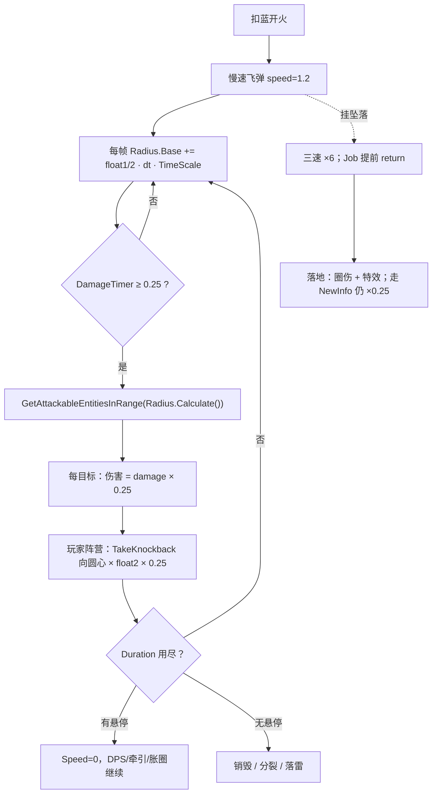

# 黑洞（Spell1007 / BlackHole）逆向分析

> 范围：仅玩家主动法术「黑洞」（`abilityType = 1007`，配置 ID `10071–10073`）。`Elite6` 把黑洞列入可捕捉名单并另开 `Spell1007BlackHoleData` 查询，属怪物侧，不在本文范围。
> 方法：`SpellConfig.json` + 反编译 `Assembly-CSharp` 交叉验证。未标注「推测」的结论均有代码/数据直接证据。
> 主路径：玩家施法走 **ECS**。位移走通用 `SpellMoveJob`（无 `BlackHole` case）；半径增长 / DPS / 拖尾在 `Spell1007Job`；落地炸在 `Spell1007FallJob`；牵引在 `SpellTakeDamageResultSystem` 的 `BlackHole` 分支。Mono `Spell1007BlackHole` 为残留轨，第 9 节单独对照。
> 配套：总览见《魔法工艺法术系统逆向报告.md》，原始数值见《法术数值总表.md》。离线可开见 `黑洞逆向分析.html`。
> 本文修正了既有文档的 **6 处不完整 / 偏差**：坠落只写了三速 ×6；悬停把「DPS 继续转」写成未核验的「通常」；范围增强把黑洞误写成「把 `Scale` 设成 `Calculate()`」；自动导航缺行；加速器 3.4 只点了落雷阵；精准 / 毒液的 tick 载体表没算黑洞。第 7 节对已逆向的 21 张增强符文做了逐一校验。

---

## 1. 身份与定位

| 项 | 值 |
| --- | --- |
| 中文名 | 黑洞 |
| 英文名 | Black Hole |
| `abilityType` | `1007` / `SpellAbilityType.BlackHole` |
| 配置 ID | `10071`（Lv1）/ `10072`（Lv2）/ `10073`（Lv3） |
| 文案 ID | 名 `701007x` / 机制 `711007x`（**Lv1 空**，Lv2/3 写半径增长）/ 风味 `7210071` / 短评 `7310071` |
| 稀有度 | 稀有（`dropType=2`） |
| `useType` | `0`（Missile 主动飞弹） |
| 槽位 / 蓝耗 | `slotCost=1`；`mpCost` = 27 / 36 / 54（`shootCount=1`，不均摊） |
| 伤害 | `damage` = 22 / 56 / 140（**每秒伤害**，见 2.3） |
| `isDPS` | **true**（`DPSDamageInterval=0.25`） |
| 飞行 | `speed=1.2`，`duration=5`，`angle=0`，`knockback=0`，`recoil=1.2` |
| 半径 | `radius=2.25`（三级相同；总表写成 2.2 是四舍五入） |
| 关键字段 | `float1` = 0 / 0.4 / 0.8（半径增长率）；`float2` = 25 / 30 / 40（牵引力）；`float3=25`（**死字段**） |
| 法杖税 | `coolDownAddSubRevise=+0.1s`（插上这张卡，整杖射击间隔 +0.1 秒） |
| 预制体 | 三级共用 `prefab="10071"`，图标 `1007` |
| 合成 | Lv1→Lv2→Lv3（`canCompound`：Lv1/2=`true`，Lv3=`false`） |
| 售价（金币） | 14 / 42 / 126 |
| 复杂度 | `CalculateSpellComplexity` 记 **4** 分（与冥蛇、瓦解射线、破法者同档） |
| AI 射程估算 | `speed × duration` = **6 m**（不加算半径） |
| 自动填槽 | 列入 `RecommendedCastFromTriggerSpells`（和奥爆、瓦解射线、龙息同组：适合后槽触发器扔） |

**机制一句话**：一颗 `1.2 m/s` 的慢速驻场圈。每 **0.25 秒**对圈内全部可攻击目标打一刀（单次 = 表伤 × 0.25），并按 `float2 × 0.25` 把**玩家阵营**打中的单位拉向圆心。Lv2/3 的圈还会按 `float1 / 2` m/s 胀大。坠落关掉 DPS 与牵引，落地改打一记圈伤。



文案（`TextConfig_Spell`）：

- 名称 `7010071–7010073`：黑洞 / Black Hole（三级同名）
- 机制 `7110071`：**空字符串**
- 机制 `7110072`：> 影响半径随时间缓慢增长
- 机制 `7110073`：> 影响半径随时间增长
- 风味 `7210071`：> 一块致密的内核以及巨大的吸积盘构成一颗黑洞，将周围目标不断吸引向中心的同时对它们造成伤害。升级后的黑洞会利用吸收到的物质提升自身体积。
- 短评 `7310071`：> 持续牵引敌人的范围法术

三段都能落地，但落地位置不同：

| 文案 | 对应实装 | 注意 |
| --- | --- | --- |
| 「吸引向中心」 | `SpellTakeDamageResultSystem` 用 `Float2 × DamageInterval` 做 `TakeKnockback` | **只在伤害 tick 上拉**，且只认玩家阵营；配置 `knockback=0` |
| 「造成伤害」 | `Spell1007Job` 每 0.25 s 圈伤 | 表 `damage` 是每秒伤，单 tick = ×0.25 |
| 「升级后提升体积」 | `Radius.Base += Float1/2 · dt` | Lv1 `float1=0` **不胀**；Lv2 慢胀、Lv3 快胀。机制栏 Lv1 为空，和代码一致 |
| 「缓慢增长 / 增长」 | 同上，Lv2 `0.4`、Lv3 `0.8` | 增长率是 `float1/2`，不是 `float1` |

---

## 2. 数值结构

### 2.1 配置表原始值（`assets_export/SpellConfig.json`）

| ID | Level | damage | mpCost | float1 | float2 | float3 | radius | speed | duration | 售价 | 可合成 |
| --- | --- | --- | --- | --- | --- | --- | --- | --- | --- | --- | --- |
| 10071 | 1 | **22** | 27 | **0** | **25** | 25 | 2.25 | 1.2 | 5 | 14 | true |
| 10072 | 2 | **56** | 36 | **0.4** | **30** | 25 | 2.25 | 1.2 | 5 | 42 | true |
| 10073 | 3 | **140** | 54 | **0.8** | **40** | 25 | 2.25 | 1.2 | 5 | 126 | false |

三级共用：`isDPS=true`、`DPSDamageInterval=0.25`、`shootCount=1`、`angle=0`、`knockback=0`、`recoil=1.2`、`coolDownAddSubRevise=0.1`、`slotCost=1`、`dropType=2`、`prefab="10071"`。`int1/2/3`、`gravity`、`upSpeed`、`summonID` 全 0。`isKeepCasting=false`、`isParentTypeSpell=false`、`isSplitSpell=false`、`needActivate=false`。

`haveEffecforMissileSpell` / `haveEffecforSummonSpell` 都是 **false**——主动法术这两位不被任何逻辑读取。

升级只抬三件事：`damage`、`float1`（胀圈）、`float2`（拉力）。半径底数、速度、时长、DPS 间隔三级完全不变。

### 2.2 字段语义

| 字段 | 语义 | 置信度 | 证据 |
| --- | --- | --- | --- |
| **float1 = 0 / 0.4 / 0.8** | 半径增长率。`Radius.Base += float1 · dt / 2 · TimeScale`，即连续域每秒胀 `float1/2` 米底数 | 高 | `Spell1007Job` L180–181；Mono `UpdateEffectRadius` L189–190 |
| **float2 = 25 / 30 / 40** | 牵引力。每次有效命中 `TakeKnockback(向圆心 × float2 × DamageInterval)` | 高 | `SpellTakeDamageResultSystem` L274–279 |
| **float3 = 25** | 配置有值，**黑洞专属路径全不读** | 高 | 全工程检索：`Spell1007*` 零引用；`SipToSSP` 只是原样抄进快照 |
| **radius = 2.25** | DPS / 牵引 / 落地圈 / 特效缩放的底数，进 `Radius.Calculate()` | 高 | `Spell1007Job` L206；`Spell1007FallJob` L224；`SpellEffectSystem` `ScaleMode.Radius` |
| **damage = 22 / 56 / 140** | **每秒伤害**。`isDPS=true` → 单 tick = `Calculate() × 0.25` | 高 | `ShootSpellUtils` L286；`TakeDamageInfo_Dots.NewInfo` L153 |
| **DPSDamageInterval = 0.25** | 写入 `DamageInterval`；同时是拉力公式里的时间步 | 高 | 同上两处 + `SpellTakeDamageResultSystem` L278 |
| **knockback = 0** | `NewInfo` 那条击退链的乘数。黑洞的拉人**不走这条** | 高 | 配置；`SetKnockbackForceIgnoreZBySpell` L168–173 |
| **speed = 1.2** | 水平爬行速度；AI 射程 = `1.2 × duration` | 高 | 配置；`SpellGroupAttackDistanceCalculator` L245–249 |
| **recoil = 1.2** | 开火后坐，`GetSpellRecoil` 原样返回。与牵引无关 | 高 | `SpellShootData` L545–547 |
| **coolDownAddSubRevise = 0.1** | 法杖射击间隔 +0.1 s | 高 | 配置；法杖层冷却修正 |
| float3 / int1–3 | float3 死；int 恒 0 | 高 | 配置 + 全工程检索 |

旧工具表把 `float2` / `float3` 都标成「配置有值代码未读」——**`float2` 已由结果系统读走**，那条备注过期。

### 2.3 `damage` 是每秒伤，不是单 tick

和落雷阵同一条 `isDPS` 管线：

```286:286:decompiled/Assembly-CSharp/ShootSpellUtils.cs
			DamageInterval = (configCopy.isDPS ? configCopy.DPSDamageInterval : 0f),
```

```153:153:decompiled/Assembly-CSharp/TakeDamageInfo_Dots.cs
		info.damage = ((config.DamageInterval > 0f) ? (config.Damage.Calculate() * config.DamageInterval) : config.Damage.Calculate());
```

| Level | 表伤（每秒） | 单 tick | 满 5 s、单目标不脱圈 | 伤/蓝 |
| --- | --- | --- | --- | --- |
| 1 | 22 | 5.5 | **110** | 4.07 |
| 2 | 56 | 14 | **280** | 7.78 |
| 3 | 140 | 35 | **700** | 13.0 |

`duration / 0.25 = 20` 次结算。边界帧可能少 1 次（见第 12 节）。面板给伤害挂「(秒伤)」后缀，蓝耗仍是施放时一次性扣 27 / 36 / 54。

多目标不封顶：圈里有几个打几个。这是和落雷阵 `int1` 上限的本质差别。

### 2.4 半径怎么胀

`Spell1007Job` 每渲染帧：

```180:181:decompiled/Assembly-CSharp/Spell1007Job.cs
			float num = config.Float1 * DeltaTime / 2f * TimeScale;
			config.Radius.Base += num;
```

`Calculate() = (Base + FallRadius) × (1+AddRatio) × MulRatio + Extra`。**底数增长会被范围增强 / 聚爆再乘一遍**：

| 槽位 | t=0 半径 | 胀速（底数） | t=5 底数 | t=5 最终半径 |
| --- | --- | --- | --- | --- |
| `[黑洞Lv1]` | 2.25 | 0 | 2.25 | **2.25** |
| `[黑洞Lv2]` | 2.25 | 0.20 m/s | 3.25 | **3.25** |
| `[黑洞Lv3]` | 2.25 | 0.40 m/s | 4.25 | **4.25** |
| `[范Lv1] [黑洞Lv3]` | 2.925 | 0.40（底） | 4.25 | **5.525** |
| `[聚爆] [黑洞Lv3]` | 1.125 | 0.40（底） | 4.25 | **2.125** |

Lv3 满寿面积从 `π·2.25² ≈ 15.9` 涨到 `π·4.25² ≈ 56.7`（**3.56 倍**）。`TimeScale` 来自 `DynamicOptimizeData.LastFrameTimeScale`，低帧时胀得更快。

特效同步：`SpellEffectSystem` 在 `ScaleMode.Radius` 下每帧把特效 `localScale` 写成 `Radius.Calculate()`。拖尾另算 `pow(clamp(DurationTimer, 0.01, 0.3), 0.25) × Radius.Calculate() × transform.Scale`，前 0.3 秒从接近 0 爬到满尺寸。本体 `LocalTransform.Scale` **不**随胀圈改写——伤害圈不靠碰撞盒。

---

## 3. 核心机制：胀圈 — 圈伤 — 牵引

### 3.1 一帧里三件事的顺序

`Spell1007BlackHoleSystem` 在 `SpacialSpellSystemGroup` ⊂ `SpellSimulationSystemGroup`，每渲染帧 1 次：

1. 首帧：非坠落藏影子、实例化 `1007_NormalTrail_{颜色}` 拖尾；坠落给特效实体挂 `1007_FallTrail_{颜色}` 粒子。
2. `Spell1007Job`：胀圈 →（非坠落才）同步拖尾 → 到点就圈伤。
3. `Spell1007FallJob`（查询带 `SpellGroundedTag`）：落地炸、震屏、再决定是否反弹 / 销毁。

位移在更早的 `SpellPhysicsSystemGroup`（固定步长）里走通用 `Normal_Common`。一帧顺序：**物理位移 → 胀圈 / DPS → 伤害结果里的牵引**。

### 3.2 DPS：到点就捞圈，不消耗穿透

```200:239:decompiled/Assembly-CSharp/Spell1007Job.cs
		if (!(config.DamageTimer >= config.DamageInterval))
		{
			return;
		}
		NativeList<Entity> entities = new NativeList<Entity>(Allocator.Temp);
		ref readonly float3 position = ref transform.Position;
		float radius = config.Radius.Calculate();
		SpellTools.GetAttackableEntitiesInRange(in position, in radius, in config.ShooterType, containsBrittleness: true, in UnitPropertyLookup, in SpellConfigLookup, in PhysicsWorld, ref entities);
		SpellTools.GetSpellElementDataWithTimeScale(in elementEffect, in OptimizeData, out var result);
		TakeDamageInfo_Dots.NewInfo(spell, CostPenetrate: false, in config, in movement, in transform, in result, in data, out var info);
		// ... 对每个目标 TryAttackEntity，CostPenetrate = false
		config.DamageTimer -= config.DamageInterval;
```

要点：

1. **`CostPenetrate = false`。** 黑洞没有穿透条，不会因为打人打完自己。
2. **`containsBrittleness: true`。** 圈里的异阵营蝴蝶 / 滚球是合法目标（蝴蝶一碰即碎，见《蝴蝶逆向分析.md》5）。
3. **搜敌现算 `Radius.Calculate()`**，胀圈、范围增强、聚爆当帧生效。
4. **元素走 `GetSpellElementDataWithTimeScale`。** 和落雷阵一样，低帧只放大毒层 `VenomApplyCount`。
5. Job **不读** `DurationTimer` / `HoverTimer` / `movement.Type`。实体还在，DPS 就转——这是悬停期继续输出的根因。
6. `DamageTimer` 用可变帧 `DeltaTime`。低帧单次间隔会抖，但累加仍按时间走。

`GetAttackableEntitiesInRange` 先捞敌对单位，再对敌对法术层做一次 `OverlapSphere`。己方法术被阵营层滤掉；`GetEntityHitType` 还有 `SameCamp` 早退。**己方蝴蝶不会被自己的黑洞打碎。**

坠落态在胀圈之后立刻 `return`，整段搜敌不跑。

### 3.3 牵引：挂在伤害结果上，不走 `knockback`

`SetKnockbackForceIgnoreZBySpell` 用的是 `config.Knockback`（表值 0），那条链是空的。真正的拉人在伤害结算之后：

```274:279:decompiled/Assembly-CSharp/SpellTakeDamageResultSystem.cs
			case SpellAbilityType.BlackHole:
				if (DTool.IsSameCamp(spell.Config.ValueRO.ShooterType, UnitType.Player))
				{
					float3 @float = DTool.IgnoreZDir(in spell.Transform.ValueRO.Position, in info.spell.HitPosition);
					UnitPropertiesLookup.GetRefRW(targetEntity).ValueRW.TakeKnockback(@float * spell.Config.ValueRO.Float2 * spell.Config.ValueRO.DamageInterval);
				}
				break;
```

`IgnoreZDir(to, from)` = 从 `from` 指向 `to` 的水平单位向量。这里 `to` 是黑洞位置、`from` 是命中点 → **把目标推向圆心**。

| Level | 每 tick 拉力（再乘目标 `knockbackRatio`） |
| --- | --- |
| 1 | 25 × 0.25 = **6.25** |
| 2 | 30 × 0.25 = **7.5** |
| 3 | 40 × 0.25 = **10** |

四个边界：

1. **只在成功打出伤害的 tick 上拉。** 不在圈里、或这一帧没结算，不受力。不是每帧连续场。
2. **只认玩家阵营施法者**（`IsSameCamp(..., Player)`）。队友扔的也算玩家阵营；若存在敌方黑洞，这条分支不拉。
3. `OnMakeDamage` 开头就读 `UnitPropertiesLookup[target]`，所以牵引只作用在带单位属性的目标上。打碎异阵营蝴蝶走的是脆弱标签，不走这条 `TakeKnockback`。
4. `TakeKnockback` 累加到 `thisFrameKnockback`，再乘目标自己的 `knockbackRatio`。单位抗击退会削弱吸力。

### 3.4 聚爆（3113）是黑洞的专属转伤通道

`SpellSpawnParamsProcessor` 把 `radiuDecreaseRatio` / `radiuDcreaseTransIntoDamageRatio` 抄进黑洞快照。发射时若转伤比 ≠ 0，实体挂 `SpellradiuDcreaseTransIntoDamageData`。`Spell1007Job` 每帧用**这一帧胀出来的底数**去加伤害乘算：

```182:188:decompiled/Assembly-CSharp/Spell1007Job.cs
		if (ImplosionLookup.HasComponent(spell))
		{
			RefRW<SpellradiuDcreaseTransIntoDamageData> refRW = ImplosionLookup.GetRefRW(spell);
			float num2 = num / refRW.ValueRW.radiuDecreaseRatio * (1f - refRW.ValueRW.radiuDecreaseRatio) * refRW.ValueRW.radiuDcreaseTransIntoDamageRatio;
			config.Damage.MulRatio *= (holeData.implosionBonusDamageRatio + num2) / holeData.implosionBonusDamageRatio;
			holeData.implosionBonusDamageRatio += num2;
		}
```

`num` 是当帧 `Float1·dt/2·TimeScale`。Lv1 `float1=0` → `num=0` → **聚爆转伤整段空转**，只剩半径 ×50%。Lv2/3 才一边胀一边把「少掉的米」兑成 `Damage.MulRatio`。`implosionBonusDamageRatio` 烘焙初值 1。

聚爆尚未单独成文，这里只记黑洞这条专属通道。通用转伤公式见《范围增强逆向分析.md》4.3。

### 3.5 状态组件

```1:10:decompiled/Assembly-CSharp/Spell1007BlackHoleData.cs
public struct Spell1007BlackHoleData : IComponentData, IQueryTypeParameter
{
	public bool IsInitialized;
	public Entity TrailEntity;
	public float implosionBonusDamageRatio;
}
```

Authoring 只写 `implosionBonusDamageRatio = 1`。`IsInitialized` / `TrailEntity` 默认零值，每个新实体（含分裂子弹）都会再跑一遍首帧拖尾逻辑。

---

## 4. 弹道分派：没有专属位移

`SpellMoveJob.Execute` 的 `AbilityType` switch **没有 `BlackHole` case**。黑洞在所有运动类型下都走对应的通用 default：

| `SpellSpecialMovementType` | 由谁写入 | 黑洞走哪个函数 |
| --- | --- | --- |
| `Normal`（默认） | — | `Normal_Common`（`Direction × Speed`） |
| `ChaseMouse` | 寻踪 `AroundMouse` | `Normal_Mouse` |
| `Rotation` | 公转 `AroundOwner` | `Normal_Rotation` |
| `ChaseEnemy` | 自动导航 `FollowTarget` | **`Normal_ChaseTarget`** |
| `ChaseOwner` | 自我追踪 | 同上 |

`ChaseEnemy` 的 case 名单和蝴蝶那节相同：`HoverTorch` / `Meteor` / `JudgementBlade` / `MagicBreaker` / `Boomerang` / `Summon4` / `BiAnLethalBlade` / `HighPressureWasher` / `BlueRune`。黑洞落到 default。

和蝴蝶的差别：蝴蝶本来有一套更好的专属转向，插导航是**降级**；黑洞本来就是匀速直飞，插导航是**给它补上追敌**，只是 `Speed=1.2` 让路程型转向极慢（见 7.1）。

坠落走末尾统一的 `Normal_Fall` + z 轴积分。黑洞不在坠落排除名单。

悬停前置分支（`HoverTimer > 0 && HoverDuration > 0` → `Speed=0`、`velocity=0`）在 `switch (movement.Type)` **之前**，悬停期黑洞原地锁死，但 `Spell1007Job` 不看速度，DPS 照转。

---

## 5. 坠落：加速落地，关掉核心输出

### 5.1 三速 ×6

```33:43:decompiled/Assembly-CSharp/SpellSpawnParamsProcessor.cs
		_processors.Add(SpellAbilityType.BlackHole, delegate(ShootSpellUtils.SpellShootInfo info, SpellInitialParameter sip, ref SpellSpawnParams ssp)
		{
			if (ssp.MovementComponentData.IsFallSpell)
			{
				ssp.MovementComponentData.Speed *= 6f;
				ssp.MovementComponentData.CurrentFallSpeed *= 6f;
				ssp.MovementComponentData.OriginalSpellHorizontalSpeed *= 6f;
			}
			ssp.radiuDecreaseRatio = sip.radiuDecreaseRatio;
			ssp.radiuDcreaseTransIntoDamageRatio = sip.radiuDcreaseTransIntoDamageRatio;
		});
```

裸装水平 `1.2 × 6 = 7.2`、下落也 ×6，所以坠落黑洞几乎是砸下去的。处理器后半段抄聚爆参数，和是否坠落无关。

### 5.2 `!IsFallSpell` 关掉 DPS 和牵引

`Spell1007Job` 在胀圈、聚爆转伤之后：

```189:192:decompiled/Assembly-CSharp/Spell1007Job.cs
		if (movement.IsFallSpell)
		{
			return;
		}
```

坠落途中：**圈还在胀，但不搜敌、不打 tick、结果系统也就没有牵引。** 和蝴蝶一样——坠落改的不只是运动学，带 `IsFallSpell` 守卫的专属 Job 会被整段剪掉。

### 5.3 落地是一记圈，伤害仍走 `NewInfo`

`Spell1007FallJob` 查询 `SpellGroundedTag`。落地时播 `Explosion` / `ExplosionB`、`FallingGround` 音效、0.2 s 震屏，再按 `Radius.Calculate()` 搜敌。击退向量先按 `SetKnockbackForceIgnoreZBySpell` 算再 **×4**——但 `Knockback=0`，这条仍是 0。真正的拉人如果发生，还是结果系统那记 `Float2 × 0.25`。

伤害调用的是同一个 `NewInfo`，**没有覆写 `info.damage`**。`DamageInterval=0.25` 仍然生效，落地一击 = 表伤 × 0.25，不是满额。Mono 残留轨相反：坠落用满额 `spellCfg.damage`（见 9.2）。

落地后 `TryRefractOrReboundWhenFall` 失败则打 `SpellDestroyTag`。黑洞不是「落地变成地面光环」，是砸一下就消失。

---

## 6. 多发、散射、后坐

`shootCount=1`、`angle=0`。单卡没有散射可塌。齐射的 `int2 × (N−1)` 仍进同一个 `angle` 加算池，会把「笔直出手」抵消掉（见 7.7）。

蓝耗不均摊。开火后坐 `recoil=1.2` 走通用 `GetSpellRecoil`。法杖射击间隔 +0.1 s 是这张卡的固定税，和强制冷却不是同一条通道。

---

## 7. 增强符文 × 黑洞 逐一校验矩阵

对已逆向的 21 张增强符文逐条核对「原文档结论」与「黑洞实际走到的代码分支」。

| # | 符文 | abilityType | 原文档结论对黑洞是否成立 | 黑洞实际分支 | 判定 |
| --- | --- | --- | --- | --- | --- |
| 1 | 自动导航 | 3011 FollowTarget | ⚠ **缺行** | 无 case → `Normal_ChaseTarget`；`Speed=1.2` 让转向极慢，但是从「无追踪」变成「有追踪」 | **需回写**（7.1） |
| 2 | 坠落 | 3119 Fall | ⚠ **不完整** | ×6 成立；另有 `IsFallSpell` 关掉 DPS / 牵引，落地仍 ×0.25 | **需回写**（7.3） |
| 3 | 悬停 | 3008 SpellHover | ⚠ **「通常」未核验** | Job 不读 `HoverTimer`，悬停期 DPS / 牵引 / 胀圈全继续 | **需回写**（7.4） |
| 4 | 范围增强 | 3107 EnhanceRadiusRatio | ⚠ **表述偏差** | 伤害圈与特效都读 `Calculate()`；不是把本体 `Scale` 设成半径 | **需回写**（7.2） |
| 5 | 加速器 | 3106 EnhanceSpeedValue | ⚠ **3.4 只点了落雷阵** | `1.2+12=13.2` 会把驻场圈送出交战区 | **需回写**（7.5） |
| 6 | 精准施法 | 3105 EnhanceCriticalChance | ⚠ **tick 表缺行** | `angle` 段空转；每 tick 独立掷骰，单目标 20 次 | **需回写**（7.6） |
| 7 | 时长强化 | 3103 EnhanceDurationValue | ✓ 成立，可补 tick | `Duration.AddBase`；多活的每一秒换 4 次结算 | 一致（7.8） |
| 8 | 反弹 | 3012 Rebound | ✓ 成立 | 通用墙撞；`ReboundAddTime` 加的是 DPS 段 | 一致 |
| 9 | 齐射 | 3001 Volley | ✓ 成立 | 容量正收益；`int2` 让 `angle=0` 的笔直出手开始散 | 一致（7.7） |
| 10 | 伤害强化 | 3102 EnhanceAttackRatio | ✓ 成立 | `Damage.AddRatio`，每 tick、每个目标都吃 | 一致 |
| 11 | 节能模式 | 3104 PowerSavingMode | ✓ 成立 | 伤 `MulRatio` + 持续 `MulRatio`（少活就少 tick） | 一致 |
| 12 | 分裂 | 3013 SpellSplit | ✓ 成立 | 复印发射快照，半径 ×0.8、伤 ×0.33、速度 ×0.5；子弹从烘焙初值再胀 | 一致（7.9） |
| 13 | 寒霜晶石 | 3014 Frozen | ✓ 成立 | 每 tick 调 `SetFrozen`，过门后其余 tick 被 `FronzenState` 挡掉 | 一致（8.2） |
| 14 | 毒液晶石 | 3005 VenomCrystal | ⚠ **载体表缺行** | 每 tick 独立叠层，单目标 20 次；还有牵引帮人留在圈里 | **需回写**（7.10） |
| 15 | 粘液晶石 | 3004 MucusCrystal | ✓ 成立 | 减的是被命中单位 | 一致 |
| 16 | 雷霆晶石 | 3101 ThunderCrystal | ✓ 成立 | 销毁落雷；圈内打死的单位各走自己的击杀事件 | 一致 |
| 17 | 闪电链 | 3007 LightningChain | ✓ 成立 | 黑洞不在排除名单；每个 tick 的每个目标都是一个链源 | 一致 |
| 18 | 奥术屏障 | 4012 Umbrella | ✓ 成立 | 盾不飞 | 一致 |
| 19 | 蓄力模式 | 4004 ChargeMode | ✓ 成立 | `IsChargingSpell()` 只认 1026/1027 | 一致 |
| 20 | 强制冷却 | 4006 ForceCoolDown | ✓ 成立 | 法杖层；黑洞自己另有 +0.1 s 射击间隔税 | 一致 |
| 21 | 储魔之匣 | 4002 EmptyContainer | ✓ 成立 | 法杖层，不进发射包 | 一致 |

聚爆 3113 尚无独立文档，专属转伤见 3.4。公转 3009 / 寻踪 3010 / 自我追踪 3114 / 多重施法 3002 / 超载散射 3003 尚无逆向文档，只在必要处引用。

以下展开非平凡项。

### 7.1 自动导航（3011）：从无到有，但转不动

插上之后 `movement.Type = ChaseEnemy`，走到 `Normal_ChaseTarget`：

```
maxDelta = Speed × ChaseRotateSpeed × dt
```

| 槽位 | Speed | ChaseRotateSpeed（Lv1/2/3 = 12/22/38） | 等效角速度 |
| --- | --- | --- | --- |
| `[导Lv1] [黑洞]` | 1.2 | 12 | **14.4 °/s** |
| `[导Lv3] [黑洞]` | 1.2 | 38 | **45.6 °/s** |
| `[导Lv3] [加Lv3] [黑洞]` | 13.2 | 38 | **502 °/s** |

黑洞**没有**被顶替的专属追踪，导航是纯增量。但 1.2 m/s 的路程型转向肉眼几乎看不出来；真正把人留在圈里的是 `float2` 拉力。单插导航 ≈ 让这颗慢弹偶尔弯向最近夹角的敌人。

要让导航「看得见」，得叠加速器把 `Speed` 抬上去——而加速器自己会把圈送出交战区（7.5）。组合上更干净的是「导航只负责弯、悬停负责停」，或干脆不插导航、靠拉力吃饭。

> 《自动导航逆向分析.md》第 6 节例外表已补黑洞行。

### 7.2 范围增强（3107）：吃的是 `Calculate()`，不是本体 Scale

黑洞 `radius=2.25`。`GetAttackableEntitiesInRange`、落地圈、`ScaleMode.Radius` 特效都读 `Radius.Calculate()`。范围增强的 `AddRatio` 同时放大：

- 初始圈
- 之后每一米胀出来的底数（`Base` 增长 × `(1+AddRatio)`）

所以 `[范] [黑洞Lv3]` 不只是「出生大一圈」，整段寿命的膨胀也被加成。这和「把 `transform.Scale` 设成 `Calculate()`」不是一回事——本体 `LocalTransform.Scale` 保持预制体默认值，碰撞盒不跟圈走。

虚胖（`SpellExtraSizeRatio` → `SpellNeedResize`）是另一条，只在 `ResizeByDamage` 时按伤害比改 Scale，黑洞 DPS 不走那条。

> 《范围增强逆向分析.md》4.1「弹体碰撞盒」行已改写。

### 7.3 坠落（3119）：×6 不是主要影响

原文档 4.13 只写「黑洞：坠落时三速 ×6」，这条没错。更要紧的一半：

- 坠落途中 `Spell1007Job` 提前 return → **不 DPS、不牵引**
- 落地 `NewInfo` 仍乘 `DamageInterval` → 一击只有表伤的 25%
- 圈在坠落途中**继续胀**，落地圈用胀过后的 `Calculate()`（含 `FallRadius`）
- 落地即销毁（反弹失败时），不会变成地面光环

「坠落 + 黑洞」= 一颗 ×6 速的坠落弹，砸一下出 0.25× 表伤的圈。放弃了这张卡几乎全部的持续输出。玩家侧看到的是「黑洞不吸人了、落地炸一下就没」。

> 《坠落逆向分析.md》4.13 黑洞行已改写。

### 7.4 悬停（3008）：第二段继续满速输出

`GetSpellHoverDuration` 把 `float1` 相加写入 `HoverDuration`（2 / 3 / 5）。黑洞不在 `UpdateDuration` 短路名单里。飞行结束：

1. `Speed = 0`，原地锁死
2. `HoverTimer` 走到 `HoverDuration`
3. 再销毁 / 分裂 / 落雷

`Spell1007Job` 不读这两支计时器。悬停期 **DPS、牵引、胀圈、聚爆转伤全部继续**。`[悬停Lv3] [黑洞Lv1]` 是 5 s 爬行 + 5 s 驻扎，单目标从 20 tick 变成 40 tick，总伤 220。

这不是「悬停 = 自动 DPS」这条卡的特权，而是「专属 Job 不对生命周期设门」。落雷阵是已核验的第一例，黑洞是第二例。悬停原文「通常继续转」对黑洞可以改成**确证**。

坠落短路仍然成立：`IsFallSpell` 不加 `HoverTimer`，悬停秒数写进快照但 4.1 走不到。

> 《悬停逆向分析.md》4.5 与文首「唯一例」已改写。

### 7.5 加速器（3106）：驻场圈被送走

加速器把 `float1` 加进 `Speed.AddBase`。黑洞底数只有 1.2，加算的相对量极大：

| 槽位 | Speed | 5 s 位移 | 相对裸装 |
| --- | --- | --- | --- |
| `[黑洞]` | 1.2 | 6.0 m | — |
| `[加Lv1(+3)] [黑洞]` | 4.2 | 21 m | 3.5× |
| `[加Lv2(+6)] [黑洞]` | 7.2 | 36 m | 6× |
| `[加Lv3(+12)] [黑洞]` | 13.2 | 66 m | 11× |

判定和落雷阵同一类：**对驻场圈是负收益，等级越高越差。** 黑洞的价值是把人留在 `2.25+` 的圈里持续吃伤；让它匀速飞走会大幅缩短窗口。缓解也一样：配悬停，「推到位再停」；或配寻踪（`AddBase` 只有 1/2/4，方向跟鼠标）。

AI 射程估算 `speed × duration` 会跟着加速器线性放大，队友可能隔着半个房间就扔。

> 《加速器逆向分析.md》3.4 已补黑洞。

### 7.6 精准施法（3105）：散射空转，暴击吃满 tick

黑洞 `angle=0`、`shootCount=1`，和落雷阵同一类：`angle` 段加减都是 0 进 0 出，**没有扇形可塌**。只剩暴击率。

每 tick、每个目标各写一条 `TakeDamageInfo`，掷骰独立。单目标满 5 s = 20 次；圈里 5 个不脱圈 = 100 次。40% 暴击下单目标期望 8 次暴击，总量等价于「整段伤害 × 1.4」，抖动被摊平。

暴击 ×2 乘在已经 ×0.25 的单 tick 上，和落雷阵同一条 `isDPS` 口径。

> 《精准施法逆向分析.md》2.6 掷骰表已补黑洞行。

### 7.7 齐射（3001）：多一颗圈，也多一份散射

`int1` 加到组容量，一次齐射可以并排扔多颗黑洞，每颗独立胀、独立拉、独立 tick。蓝耗按齐射折扣。

负面：`GetGroupShootScatterFromVolley` 的 `int2 × (N−1)` 进 `angle` 池。黑洞底数是 0，齐射 Lv3、N=3 时锥角 = 40，每颗 ±20°。慢弹偏 20° 飞 5 秒，落点可以差出好几米——多颗圈不再重叠。想叠圈要用精准把池子压回来。

### 7.8 时长强化（3103）：每一秒换 4 次结算

| 槽位 | duration | tick（满窗口） | Lv1 单目标 | Lv3 单目标 | Lv3 满寿半径 |
| --- | --- | --- | --- | --- | --- |
| `[黑洞]` | 5 | 20 | 110 | 700 | 4.25 |
| `[时Lv1(+2)]` | 7 | 28 | 154 | 980 | 5.05 |
| `[时Lv2(+3.5)]` | 8.5 | 34 | 187 | 1190 | 5.65 |
| `[时Lv3(+6)]` | 11 | 44 | 242 | 1540 | 6.65 |

Lv2/3 多活的时间也在胀圈，时长强化对高级黑洞是「更多 tick + 更大圈」双收益。节能模式的 `Duration.MulRatio` 反向砍 tick。

### 7.9 分裂（3013）：复印发射快照，不复印已经胀大的圈

`ToSplit` 拿的是**发射时**的 `SpellSpawnParams`，不是母弹此刻的 `Radius.Base`。子弹：

- 伤 `MulRatio × 0.33`
- 半径底数 ×0.8（Lv1 子弹圈 1.8）
- 速度 ×0.5（0.6 m/s）
- `DurationTimer=0`，满额再活 5 s
- `Spell1007BlackHoleData` 烘焙初值，再胀、再挂拖尾

母弹若插了悬停，分裂点在第二段结束（见《悬停逆向分析.md》4.4）。一发 Lv3 黑洞 + 分裂 Lv3（`int1=8`）在寿命结束时裂 8 颗 0.33 伤的小黑洞，每颗再跑完整套 DPS / 牵引 / 胀圈。

### 7.10 毒液晶石（3005）：和落雷阵同结构的 tick 叠层

`SetVenom` 没有「已中毒则跳过」的门。每 tick 对每个仍在圈里的目标各加 `int2` 层。单目标满 5 s：

| 槽位 | 层数 |
| --- | --- |
| `[毒Lv1] [黑洞]` | 20 |
| `[毒Lv3] [黑洞]` | **80** |
| `[毒Lv3] [时Lv3] [黑洞]` | 176 |
| `[毒Lv3] [悬停Lv3] [黑洞]` | 160（5+5 s） |

和落雷阵的差别：

| | 落雷阵 | 黑洞 |
| --- | --- | --- |
| 单目标 tick | 20 / 5 s | 20 / 5 s |
| 同时打几人 | 钳在 `int1` | **不封顶** |
| 把人留在圈里 | 靠站桩 | **每 tick 拉一次** |
| 低帧毒层 | `GetSpellElementDataWithTimeScale` | 同一条 API |

单目标叠层两者持平；多目标和「会走的敌人」上，黑洞的拉力和无上限更占便宜。落雷阵「全表最强毒液载体」的表述需要改成「tick 类并列最强，场景不同」。

黑洞每 tick 也调 `GetSpellElementDataWithTimeScale`，低帧只放大毒层，冻结 / 粘液 / 伤害本身不动。

> 《毒液晶石逆向分析.md》6.2 载体表已补黑洞。

---

## 8. 数值算例

基准：黑洞 Lv1，表伤 `B=22`，蓝 27，圈 2.25，5 s。忽略法杖、`Ceil`、目标 `knockbackRatio`。

### 8.1 伤害类符文乘在每 tick 上

| 槽位 | 每秒 | 单 tick | 20 tick 单目标 |
| --- | --- | --- | --- |
| `[黑洞Lv1]` | 22 | 5.5 | 110 |
| `[伤Lv1] [黑洞Lv1]` | 27.5 | 6.875 | 137.5 |
| `[伤Lv3] [黑洞Lv1]` | 44 | 11 | 220 |
| `[伤Lv3] [黑洞Lv3]` | 280 | 70 | **1400** |
| `[节Lv1] [黑洞Lv3]` | 105 | 26.25 | 525（蓝 54×0.6，时长 3.75 s → 实际约 15 tick / 394） |

节能同时砍伤和时长，tick 数按缩短后的 `duration` 算，上表最后一行如果按满 20 tick 会高估。

### 8.2 元素：毒能叠满，冻结不能

`[毒Lv3] [黑洞Lv3]`：单目标 80 层；圈里 4 个不脱圈 → 320 层总量。

寒霜相反：第一 tick 把目标打成 `Frozening`，其后 19 次 `SetFrozen` 直接 return；解冻后还有 `FrozenImmune`。**整发只有第一刀的冻结生效。** 多目标则是「每个目标各吃第一刀」。

这是「高频 tick × 元素」的通用不对称，黑洞和落雷阵、蝴蝶同一条。

### 8.3 航程与圈

| 槽位 | Speed | duration | 位移 | 满寿半径（Lv3） |
| --- | --- | --- | --- | --- |
| `[黑洞Lv3]` | 1.2 | 5 | 6 m | 4.25 |
| `[加Lv3] [黑洞Lv3]` | 13.2 | 5 | 66 m | 4.25 |
| `[时Lv3] [黑洞Lv3]` | 1.2 | 11 | 13.2 m | 6.65 |
| `[悬停Lv3] [黑洞Lv3]` | 1.2 → 0 | 5+5 | 6 m 后原地 | 6.25（10 s 胀） |
| `[坠落] [黑洞Lv3]` | 7.2（水平） | 落到地 | 落地即止 | 途中略胀 |

### 8.4 拉力

`F_tick = float2 × 0.25 × knockbackRatio`。默认 `knockbackRatio=1`：Lv1 6.25、Lv3 10。单位抗击退按比例缩小。圈外不受力——要把人吸进来，得先有一 tick 打中他。

---

## 9. Mono 残留轨对照

`Spell1007BlackHole : SpellBase` 仍在程序集里。玩家施法主路径是 ECS，这条轨对玩家黑洞不生效；它是理解设计意图和若干字段错位的参考。

### 9.1 牵引在 Mono 里是死的

```46:48:decompiled/Assembly-CSharp/Spell1007BlackHole.cs
		pullForce = base.spellCfg.knockback;
		base.spellCfg.knockback = 0f;
```

配置 `knockback=0`，`pullForce` 恒为 0。之后每帧对圈内单位 `TakeKnockback(... * pullForce * ...)` 全是空操作。ECS 改去读 `float2`，这是主路径和残留轨最大的机制分叉。

Mono 的拉力还是**每帧、对圈内所有 `CanTouch`，不要求这一帧出伤**；ECS 改成「只在伤害 tick 上拉被打中的单位」。即便把 Mono 的 `knockback` 改非 0，手感也会和现网不一致。

### 9.2 坠落伤害：满额 vs ×0.25

```179:179:decompiled/Assembly-CSharp/Spell1007BlackHole.cs
		takeDamageInfo.damage = (base.SIP.spellIsFall ? base.spellCfg.damage : ((float)Mathf.CeilToInt(base.spellCfg.damage * base.spellCfg.DPSDamageInterval)));
```

| | ECS | Mono |
| --- | --- | --- |
| 非坠落单 tick | `damage × 0.25`（浮点） | `Ceil(damage × 0.25)` |
| 坠落落地 | 同一个 `NewInfo`，仍 ×0.25 | **满额 `damage`** |
| 坠落途中 DPS | Job `return`，不打 | `UpdateAttackBehaviour` 被 `!spellIsFall` 跳过，也不打 |
| 低帧伤害 | 元素毒层 × `TimeScale` | `CreateDefaultTakeDamageInfo` 可再乘低帧倍数 |

坠落途中两边都不打 tick，一致。落地一击 ECS 弱于 Mono。

### 9.3 其它 Mono 侧行为

- `UpdateEffectRadius`：`spellCfg.radius += float1/2·dt`，然后 `localScale = one * radius * 2`。ECS 特效走 `ScaleMode.Radius` = `Calculate()`（不 ×2），预制体基准不同则视觉直径会对不上，见第 12 节。
- 聚爆：`extraRadiu` 只累加 `num × radiuDecreaseRatio`，再 `GetSpellRadiusToDamageRatio` 重算整份 `spellCfg.damage`。ECS 是对 `Damage.MulRatio` 做增量乘。公式不等价。
- 分裂：`CreateSplitSpell` 非坠落时用 DOTween 0.6 s 把子弹从母体位置移到目标点。ECS `ToSplit` 没有这段位移动画。
- `TriggerIn` 空覆写——Mono 不用碰撞 Enter 出伤，只靠 overlap。这支持「ECS 主路径也应是 overlap-only」的设计意图，但 ECS 预制体是否还有物理碰撞盒未拆（第 12 节）。
- `FallSpeedRatio => 5`（属性覆写，和处理器 ×6 不是同一个数）。
- 循环音 `as_Loop`、音量跟随设置；ECS 首帧只在非坠落时建拖尾。

---

## 10. 与构筑相关的行为摘要

| 行为 | 结果 |
| --- | --- |
| 裸放 | 1.2 m/s 爬 5 s，每 0.25 s 圈伤 + 拉人；Lv1 圈恒 2.25，Lv3 胀到 4.25 |
| 插伤害强化 | 每 tick、每个目标都吃 `AddRatio` |
| 插时长强化 | 每多 1 秒 +4 tick；Lv2/3 还多胀一段时间 |
| 插悬停 | **飞行结束原地继续满速输出**（DPS / 拉 / 胀全在） |
| 插加速器 | **负收益**：驻场圈被送出交战区 |
| 插自动导航 | 补上追敌，但 1.2 m/s 几乎转不动；要配加速才看得出来，又和 加速器冲突 |
| 插精准施法 | 散射空转；暴击按 tick 吃满期望 |
| 插齐射 | 多颗独立圈是正收益；`int2` 让它们不再重叠 |
| 插坠落 | **关掉核心机制**：途中不打不拉，落地一击只有 25% 表伤 |
| 插范围增强 | 初始圈和膨胀段一起放大；伤害圈吃 `Calculate()` |
| 插聚爆 | Lv1 只缩圈不转伤；Lv2/3 边胀边兑 `Damage.MulRatio` |
| 插分裂 | 发射快照 ×0.33 / ×0.8 / ×0.5；子弹重跑完整周期 |
| 插毒液晶石 | 单目标 20×`int2` 层；拉力帮人留圈；多目标不封顶 |
| 插寒霜晶石 | 每个目标只有第一 tick 的冻结生效 |
| 插雷霆晶石 | 销毁落雷；不伤己方蝴蝶 |
| 插反弹 | 墙弹加时 = 多 tick |
| 蓄力 / 强制冷却 / 储魔之匣 | 法杖层；黑洞另有 +0.1 s 射击间隔税 |
| 后槽触发器扔 | 自动填槽推荐这张卡当「扔出去的圈」 |

---

## 11. 证据索引

| 结论 | 文件 / 位置 |
| --- | --- |
| 配置数值、`isDPS=true`、`radius=2.25`、`float1/2/3` | `assets_export/SpellConfig.json`（10071–10073） |
| 文案（Lv1 机制空，Lv2/3 写胀圈） | `assets_export/TextConfig_Spell.json`（701007x / 711007x / 7210071 / 7310071） |
| 胀圈 + 聚爆转伤 + DPS | `Spell1007Job.cs` L173–239 |
| 坠落途中提前 return | `Spell1007Job.cs` L189–192 |
| 状态组件 / 烘焙初值 | `Spell1007BlackHoleData.cs`；`Spell1007BlackHoleAuthoring.cs` L11–15 |
| 首帧拖尾 / 影子 | `Spell1007BlackHoleSystem.cs` L362–400 |
| 落地炸 | `Spell1007FallJob.cs` L181–255 |
| 单 tick 伤 = `damage × DamageInterval` | `TakeDamageInfo_Dots.cs` L149–166 |
| `isDPS` → `DamageInterval` | `ShootSpellUtils.cs` L286 |
| 牵引 = `Float2 × DamageInterval` | `SpellTakeDamageResultSystem.cs` L274–279 |
| `IgnoreZDir` 指向圆心 | `DTool.cs` L17–20 |
| `knockback` 链是空的 | `TakeDamageInfo_Dots.cs` L168–173；配置 `knockback=0` |
| 坠落三速 ×6 + 抄聚爆参数 | `SpellSpawnParamsProcessor.cs` L33–43 |
| 搜敌圈 + 脆皮 | `SpellTools.cs` L2862–2888 |
| 复杂度 4 分 | `SpellTools.cs` L3032–3036 |
| AI 射程 `speed × duration` | `SpellGroupAttackDistanceCalculator.cs` L245–249 |
| 后槽触发器推荐名单 | `SpellAutoFullTool.cs` L84–90 |
| 特效按半径缩放 | `SpellEffectSystem.cs` L188–196 |
| 分裂复印发射快照 | `SpellSpawnParamsStorage.cs` L36–58 |
| 开火后坐 | `SpellShootData.cs` L545–547 |
| Mono 拉力抄 `knockback`（死） | `Spell1007BlackHole.cs` L46–48、L116–173 |
| Mono 坠落满额伤 | `Spell1007BlackHole.cs` L175–185 |
| Mono 胀圈 ×2 缩放 | `Spell1007BlackHole.cs` L187–198 |
| 特效旋转（纯表现） | `Spell1007EffectRotateSystem.cs` L122–124 |
| 枚举 | `SpellAbilityType.cs` L10（`BlackHole = 1007`） |

---

## 12. 待决 / 局限

1. **满寿 tick 数的边界帧。** `DamageTimer` 与 `DurationTimer` 独立累加。`duration` 恰好用尽的那一帧，DPS Job 和 `UpdateDuration` 谁先跑决定第 20 刀在不在。本文按 `duration / 0.25 = 20` 计，实测可能是 19。时长强化后的 28 / 34 / 44 同理。
2. **ECS 预制体是否还有物理碰撞盒。** Mono `TriggerIn` 为空，设计意图是 overlap-only。若 ECS 预制体在伤害层留了碰撞体，`SpellSystem` 的 Enter 可能再打一记**不乘 interval** 的满额伤。未拆 prefab，不下结论。
3. **特效直径的 ×2 偏差。** Mono `localScale = radius × 2`；ECS `ScaleMode.Radius` 用 `Calculate()` 不乘 2。若两边预制体基准不同，视觉圈和伤害圈会对不齐。只影响表现。
4. **`FindMinAngleTarget` / 搜敌半径未展开。** 导航锁敌、以及 `GetEnemyEntityInRange` 的物理层过滤属于通用锁敌系统。
5. **牵引在抗击退、冰冻、击退衰减（`lerp(..., 5·dt)`）下的手感未做数值验证。** `float2 × 0.25` 只是写入量。
6. **公转 / 寻踪 / 自我追踪 / 多重施法 / 超载散射** 尚无独立文档，本文只在分派表里点名。
7. **`Elite6` 捕捉黑洞** 的行为属于该怪物文档。查询实体存在，证明黑洞在 ECS 里是可被外部系统点名的独立实体，不是纯 VFX。
)
