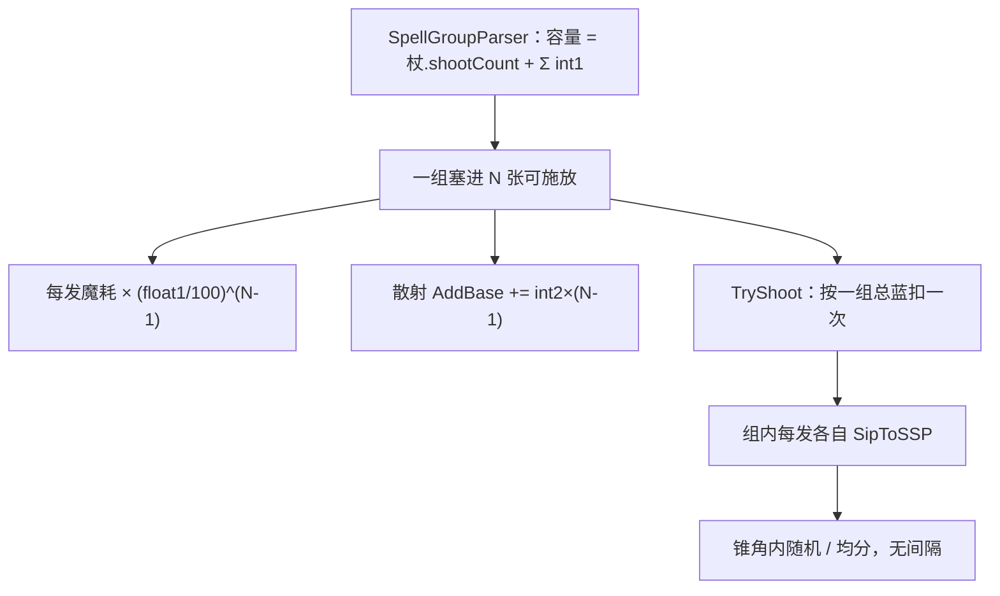

# 齐射（Spell3001 / Volley）逆向分析

> 范围：仅玩家强化符文「齐射」（`abilityType = 3001`，配置 ID `30011–30013`）。重点是**一组里能同时塞几张可施放卡**、**每多一张怎么乘蓝和加散射**，以及**开火时这几发怎么打出去**。
> 不把 3002 多重、3003 超载散射写成同级全文；它们只在第 4 节对照。不展开遗物/诅咒逐条来源。
> 方法：`SpellConfig.json` + 反编译 `Assembly-CSharp` 交叉验证。未标注「推测」的结论均有代码/数据直接证据。
> 玩家施法主路径是 ECS。组解析与扣蓝在 `Wand` / `SpellGroupParser`，生成走 `ShootSpellUtils`。Mono `SpellBase.ApplyEnhanceSpell` **没有**齐射分支，文末单独对照。
> 配套：总览见《魔法工艺法术系统逆向报告.md》，原始数值见《法术数值总表.md》，槽位解析骨架见《精准施法逆向分析.md》3.1，子弹不重跑见《分裂逆向分析.md》。

---

## 1. 身份与定位


| 项 | 值 |
| --- | --- |
| 中文名 | 齐射 |
| 英文名 | Volley |
| `abilityType` | `3001` / `SpellAbilityType.Volley` |
| 配置 ID | `30011`（Lv1）/ `30012`（Lv2）/ `30013`（Lv3） |
| 稀有度 | 普通（`dropType=1`） |
| `useType` | `2`（Enhance 强化符文） |
| 槽位消耗 | `slotCost=1`，自身 `mpCost=0`、`damage=0`、`shootCount=0`、`angle=0` |
| 作用对象 | `haveEffecforMissileSpell=true`，`haveEffecforSummonSpell=true` |
| 合成 | Lv1→Lv2→Lv3（`canCompound`：Lv1/2=`true`，Lv3=`false`） |
| 售价（金币） | 12 / 36 / 108 |


**机制一句话**：插在主动/召唤**左侧**的发射形态符文。它**不把同一张卡复制成多发**，而是把法杖这一段的「同时施放容量」加上 `int1`；解析时往**同一个 `SpellShootGroup`** 里多塞几张可施放卡。组内实际张数 `N` 再拿来算：魔耗 × `(float1/100)^(N-1)`，散射 + `int2×(N-1)`。散射和魔耗**只读最高级那一张**。没有独立 ECS Job。



文案（`TextConfig_Spell` id `7130011–7130013`）：

> 法杖同时施放法术数量+**int1**
> 同时施法时每多一个可施放法术，魔耗×**float1**%，散射+**int2**°

名称（`7030011–7030013`）：齐射 / Volley。三级名称相同，只有 `int1` / `float1` / `int2` 不同。

俄语本地化把第一句写成「法术块容量」，和代码一致：改的是**一组能装几张卡**，不是「这一张弹复制几份」。

---

## 2. 数值与叠加

### 2.1 配置表（`assets_export/SpellConfig.json`）


| ID | Level | int1 容量 | float1 魔耗% | int2 散射° | float2 | 售价 | 可合成 |
| --- | --- | --- | --- | --- | --- | --- | --- |
| 30011 | 1 | **2** | **78** | **10** | 0 | 12 | true |
| 30012 | 2 | **3** | **73** | **15** | 2 | 36 | true |
| 30013 | 3 | **4** | **68** | **20** | 0 | 108 | false |


规律：`int1` / `int2` 每级 +1 / +5；`float1` 每级 -5；售价每级 ×3。`mpCostMulDivCorrection=0`，不走多重那种耗蓝字段。

### 2.2 字段语义


| 字段 | 语义 | 运行时是否被读 | 置信度 |
| --- | --- | --- | --- |
| **int1** | 同时施放容量加算（多张**相加**） | 是 | 高 |
| **float1** | 每多一张可施放，魔耗再乘 `float1/100` | 是；**只取最高级一张** | 高 |
| **int2** | 每多一张可施放，散射 +`int2`° | 是；**只取最高级一张** | 高 |
| float2 | Lv2 配了 2，Lv1/Lv3 为 0 | 齐射路径 **未读** | 高 |
| int3 / float3 | 配置为 0 | 未读 | 高 |
| `angle` / `mpCostMulDivCorrection` | 均为 0 | 散射不靠自己的 `angle`；耗蓝不靠这字段 | 高 |
| `haveEffecforMissile/Summon` | 表上对弹幕与召唤都标生效 | 容量 / 魔耗 / 散射函数 **不读**这两旗 | 高 |


### 2.3 叠加：容量相加，魔耗和散射只吃最高级

容量入口：`SpellShootData.GetMaxMeantimeShootCount`。

```52:67:decompiled/Assembly-CSharp/SpellShootData.cs
	public int GetMaxMeantimeShootCount(int baseMeantimeShootCount)
	{
		int num = baseMeantimeShootCount;
		SlotData[] enhanceList = EnhanceList;
		for (int i = 0; i < enhanceList.Length; i++)
		{
			SpellConfig finalConfig = enhanceList[i].GetFinalConfig();
			int num2 = num;
			num = num2 + finalConfig.abilityType switch
			{
				SpellAbilityType.Volley => finalConfig.int1, 
				SpellAbilityType.TotalScattering => finalConfig.int1, 
				_ => 0, 
			};
		}
		return num;
	}
```

`baseMeantimeShootCount` 是法杖 `WandCfg.shootCount`（多数杖是 **1**，少数 2 / 3 / 5）。齐射和超载散射的 `int1` **加在同一个容量上**。

魔耗、散射不扫每一张齐射，只取 `GetMaxLevelVolley`：`EnhanceList` 里 `abilityType == Volley` 的卡，按 `level` 取最高，同级取第一张。

```249:262:decompiled/Assembly-CSharp/SpellShootDataExtend.cs
	public static SpellConfig GetMaxLevelVolley(this SpellShootData self)
	{
		SpellConfig[] array = (from e in self.EnhanceList
			select e.GetFinalConfig() into e
			where e.abilityType == SpellAbilityType.Volley
			select e).ToArray();
		if (array.Length == 0)
			return null;
		int maxLevel = array.Max((SpellConfig e) => e.level);
		return array.FirstOrDefault((SpellConfig e) => e.level == maxLevel);
	}
```

因此：

```
容量   = 杖.shootCount + Σ 齐射.int1 + Σ 超载.int1
散射°  = 最高级齐射.int2 × (N - 1)     （没有齐射则为 0）
魔耗比 = (最高级齐射.float1 / 100)^(N - 1)
```

`N` 是**这一组树里实际装进去的可施放张数**（含触发器后槽），不是容量上限，也不是「齐射 int1 本身」。

| 左侧 | 容量（杖 shootCount=1） | 散射 / 魔耗用哪张 |
| --- | --- | --- |
| 一张 Lv1 | 1+2=**3** | Lv1：10°、×78% |
| 两张 Lv1 | 1+2+2=**5** | 仍是 Lv1（只取一张） |
| 一张 Lv2 | 1+3=**4** | Lv2：15°、×73% |
| 一张 Lv3 | 1+4=**5** | Lv3：20°、×68% |
| Lv1 + Lv3 | 1+2+4=**7** | **只吃 Lv3** |


两张 Lv1 **不能**合成一张 Lv2 的魔耗 / 散射；合成的意义是省槽，并换更高的 `int1` / 更好的 `float1` / `int2`。魔能升阶走 `GetFinalConfig()`，抬的是这张卡自己的三级数字，叠加规则不变。

`haveEffecforSummonSpell` 不进这三个函数。自动填槽会避开齐射（见 4.8）；手动插在召唤左侧，召唤一样进组、一样乘蓝、一样加散射。

---

## 3. 主路径（核心）

齐射没有自己的 Job。它改的是「这一枪的组里有几张卡、这几张怎么算蓝和锥角」。之后每张卡各自走一遍 `SipToSSP`，和没齐射时同一条生成轨。

### 3.1 容量：解析时往一组里塞，不绕回复制

`Wand.RecalculateSpellGroups`：

```
shootGroups = SpellGroupParser.Parse(normalSlots, WandCfg.shootCount)
postSlotShootGroups = SpellGroupParser.Parse(postSlots, WandCfg.shootCount)
```

主槽和后槽分开 Parse，互不串。Enhance 从左往右累积，**消耗后不清空**（和精准施法 3.1 同一套）：插在最左的齐射，会进它右边所有主动 / 召唤的 `EnhanceList`。

`NextGroup` 的装箱条件：

```76:84:decompiled/Assembly-CSharp/SpellGroupParser.cs
		while (list.Count == 0 || list.Count < list.Max((SpellShootData e) => e.GetMaxMeantimeShootCount(_baseMaxShootCount)))
		{
			SpellShootData spellShootData = NextShoot(spellShootGroup, hideEnhances2);
			if (spellShootData == null)
			{
				break;
			}
			list.Add(spellShootData);
		}
```

从左到右继续取下一张 Missile / Summon。组内张数还没到 `GetMaxMeantimeShootCount` 就继续取；取完了就停。**不会绕回再放同一张卡。**

所以：

- `[齐射 Lv1][魔法弹]`：容量 3，但右边只有 1 张可施放 → 一组 `N=1`。多出来的 +2 **空着**。
- `[齐射 Lv1][弹][弹][弹]`：一组塞 3 张，一次扳机打出 3 张不同的卡。
- `[齐射 Lv1][弹A][弹B][弹C][弹D]`：第一组 A+B+C，第二组只剩 D。
- `[弹A][齐射][弹B][弹C]`：A 吃不到齐射，单独一组；B 带着齐射开新组，再把 C 拉进来。

可施放 = `useType` 为 Missile(0) 或 Summon。齐射自己是 Enhance，不进组、不占容量。触发器会挂到前一张主动上，后槽进 `SubGroup`（见 4.5）。

`CreateShootInfoFromShootData` 里那层 `for (inShootCountIndex < config.shootCount)` × `multiShootCount` **不是**齐射：前者是法术自己的 `shootCount`（散弹 / 彩虹等），后者是多重 3002。齐射不进这个双重循环。

### 3.2 魔耗：最高级 `float1` 的 `(N-1)` 次幂

`N` 来自 `GetGroupTotalShootDataForVolley`：从根组 BFS，把 `Shoots` 和每发的 `SubGroup` 都算上。子组会先回根再数，所以同一棵树共用一个 `N`。

```97:105:decompiled/Assembly-CSharp/SpellShootGroup.cs
	private float GetGroupManaCostRatioFromVolley(SpellShootData shootData)
	{
		SpellConfig maxLevelVolley = shootData.GetMaxLevelVolley();
		if (maxLevelVolley == null)
			return 1f;
		int num = GetGroupTotalShootDataForVolley().ToArray().Length;
		return Mathf.Pow(maxLevelVolley.float1 / 100f, num - 1);
	}
```

`GetSpellManaCost` 先 `MulRatio(GetGroupManaCostRatio)`。齐射比乘在多重、父法术（秘法新星 / 礼花）之前；多重自己的 `mpCostMulDivCorrection` 还在 EnhanceList 开关里再乘一次，那是多重的事。

`N=1`（只有一张可施放）时幂为 0，比为 **1**：单独一张弹 + 齐射，**不打折也不加价**。

`TryShoot` 按**一组总蓝**扣一次：`CostMp(currentShootGroup.GetGroupManaCost_FinalPlayerValue)`。组总蓝 = 组内每发（含需要扣后槽的 SubGroup）已经乘过齐射比之后再相加。

以魔法弹（`10011`，`mpCost=3`）、杖 `shootCount=1`、只有齐射 Lv1 为例：


| 槽位 | N | 每发比 | 每发蓝 | 一组总蓝 | 若拆开点 N 次 |
| --- | --- | --- | --- | --- | --- |
| `[齐射][弹]` | 1 | `0.78^0 = 1` | 3 | **3** | 3 |
| `[齐射][弹][弹]` | 2 | `0.78` | 2.34 | **4.68** | 6 |
| `[齐射][弹][弹][弹]` | 3 | `0.78² = 0.6084` | 1.825 | **5.48** | 9 |


`×78%` 是折扣，不是加价。装得越满，单张越便宜；一组总蓝仍高于单张，但低于「拆开点同样多张」。

### 3.3 散射：最高级 `int2 × (N-1)`

```72:84:decompiled/Assembly-CSharp/SpellShootGroup.cs
	public float GetGroupShootScatterFromVolley(SpellShootData shootData)
	{
		SpellConfig maxLevelVolley = shootData.GetMaxLevelVolley();
		if (maxLevelVolley == null)
			return 0f;
		int num = GetGroupTotalShootDataForVolley().ToArray().Length;
		return maxLevelVolley.int2 * (num - 1);
	}
```

`GetSpellScatter`：底数是主动法术自己的 `angle`，再 `AddBase(齐射散射)`，再把 EnhanceList 里每张卡的 `angle` 加上（超载、精准施法）。

```117:126:decompiled/Assembly-CSharp/SpellShootData.cs
	public RatioValue GetSpellScatter()
	{
		RatioValue ratioValue = new RatioValue(Spell.GetFinalConfig().angle);
		ratioValue.AddBase(OwnerGroup.GetGroupShootScatterFromVolley(this));
		foreach (SpellConfig item in EnhanceList.Select((SlotData e) => e.GetFinalConfig()))
		{
			ratioValue.AddBase(item.angle);
		}
		return ratioValue;
	}
```

`ProcessShootDataEffect`：`extraScatter += CurrentAddBase`（齐射度数 + 增强卡 `angle`；不含主动自己的 `angle`）。法杖自身散射在 `ProcessWandEffect` 另加一份。

开火锥角在 `ShootSpellGroup` 里算：

- 默认：`CalculateRandomAngle`，每发独立 `Random(−cone/2, +cone/2)`
- 法杖均分被动：`CalculateEqualScatterAngle`，用组内最大锥角，按本枪全部 `SpellShootInfo` 均分

```
cone = (主动.angle + extraScatter) × finalScatterRatio
```

`SipToSSP` 另写一份快照 `Config.Scatter = GetSpellShootScatter_FinalPlayerValue.Result`（再加法杖、再乘「站定专注」一类遗物），**小于 0 钳成 0**。发射方向用的是上面的 `extraScatter` 锥，不是事后改这份快照。

同一组 `N=3`、齐射 Lv1：散射 **+20°**。魔法弹自身 `angle=0` 时，随机锥是 ±10°。

`angle=0` 的主动没有自己的底数，锥角**全部来自齐射这一份**。但度数算出来不等于落到实处——偏角最后只写进方向：

```631:636:decompiled/Assembly-CSharp/ShootSpellUtils.cs
			float num = (e.Left.ShootData.Spell.GetFinalConfig().angle + e.Right.add) * e.Right.mul;
			if (num < 0f)
			{
				num = 0f;
			}
			float result = UnityEngine.Random.Range(num * -0.5f, num * 0.5f);
```

`ApplyScatterAngleToSpellSIP` 把这个 `result` 拧进 `parameter.shootDirection`，再进实体的 `MovementComponentData.Direction`。**所以散射恶化的前提是「方向对这发法术有意义」。**


| 主动 | 自身 `angle` | 齐射 Lv1、`N=3` 的锥 | 偏角落在哪 | 副作用 |
| --- | --- | --- | --- | --- |
| 蝴蝶 `1003`（`shootCount` 3~5） | 90 | 110° → 每只 ±55° | 每只的初速方向 | **明显恶化**：本来 ±45° 的扇形再摊开 |
| 魔法弹 `1001` | 0 | 20° → ±10° | 飞行方向 | 轻微，只是准星飘 |
| 落雷阵 `1018`（`speed=0`、`shootCount=1`） | 0 | 20° → ±10° | `Direction`，但 `Direction × Speed = 0` | **完全免疫** |


落雷阵生成在枪口后原地不动 5 秒，每 0.25 秒的结算只读 `Transform.Position` 和 `Radius`，`Direction` 没有消费方。`SipToSSP` 另写的那份 `Config.Scatter` 快照也只有少数法术自己的 Job 会读（激光 `1004`、分解射线 `1011`、破法者 `1021`、龙息 `1025`、彼岸刃 `4019`、鱼叉 `4024`），`Spell1018ThunderAuraSystem` 不在其中。

所以**齐射对 `angle=0` 的静止法术是纯正收益**：容量 `int1`（+2/3/4）、魔耗 `(float1/100)^(N-1)`（×78/73/68%）照拿，唯一的副作用被免掉。和蝴蝶那种「容量正收益 / 散布恶化」的两面性正好是两个极端。

一个例外：**免疫只对光环形态成立。** 落雷阵插了坠落 `3119` 之后，`Direction` 变成第一跳的方向（`Spell1018ThunderAuraSystem.cs` L847：`fallTargetPosition = originalPosition + Direction × Radius`）；而 `ApplyScatterAngleToSpellSIP` 对 `spellIsFall` 且有瞄准点的那发走的是另一条分支——不转方向，改**抖瞄准点**：`Target += 随机单位向量 × (锥角 × 0.06)`（`ShootSpellUtils.cs` L708–714）。齐射 Lv1、`N=3` 时锥角 20°，落点抖动最多 1.2 个单位，整条落雷线的起点跟着偏。详见《落雷阵逆向分析.md》7.8。

### 3.4 开火：一组同时打，无间隔

`TryShoot`：蓝够 → 扣一组蓝 → `Shoot` → `EnterNextGroup`。

`Shoot` 把**当前这一组**交给 `ShootSpellGroup`。组内每张卡各自 `ApplySpellShootDataEffect` + `SipToSSP`。齐射**不写** `multiShootGap`，几发在同一帧生成，没有多重那种横向错开间隔。

方向：共享这一枪的瞄准，再各自加散射偏角。复制遗物打出的那发（`IsCopyShoot`）改走 `Random(0, 360)`，与齐射锥无关。

分裂子弹不再跑 `SpellGroupParser`，也不会再齐射一次（见 4.4）。

---

## 4. 和其它法术的关系

只写会改容量 / `N` / 魔耗比 / 散射锥 / 发射循环的交互。伤害强化 / 加速器 / 时长只改别的池，不列。

### 4.1 多重施法 3002

完全另一条轴。`GetSpellMultiShootData`：`count = 1 + Σ int1`，`gap = Max(float1)`（0.4）。`CreateShootInfoFromShootData` 按 `count` 再复制，并写 `multiShootGap` 做横向错位。

| | 齐射 3001 | 多重 3002 |
| --- | --- | --- |
| 改什么 | 一组塞几张**不同的卡** | **同一张卡**再打几发 |
| 间隔 | 无 | `float1` 横向错开 |
| 耗蓝 | `(float1/100)^(N-1)`，只吃最高级齐射 | `mpCostMulDivCorrection`（×150%），每张多重都乘 |
| 进 SubGroup | 会（不 `HindInSubGroup`） | **不会**（`HindInSubGroup` 只挡多重） |


`[齐射 Lv1][多重 Lv1][弹][弹][弹]`：先装箱 3 张弹，每张再打 2 发，一共 6 个实体。齐射按 `N=3` 乘蓝、+20°；多重再对每张 ×150%。奥术屏障的齐发点数读的是多重，不是齐射。

### 4.2 超载散射 3003

和齐射进**同一句**容量加算（`GetMaxMeantimeShootCount` 的 `TotalScattering => int1`）。Lv1/2/3 的 `int1` 是 5 / 8 / 12。

散射不走齐射那条 `int2×(N-1)`。超载用的是自己的 `angle` 字段（+60 / +90 / +150），在 `GetSpellScatter` 的 foreach 里和精准施法的 `angle` 相加。

两边可以同时在：容量 `杖 + 齐射Σint1 + 超载Σint1`；锥角 = 齐射公式 + 超载 `angle` + 精准 `angle`。超载**不改**齐射魔耗幂。

自动填槽把超载和齐射一起列进 `IgnoreSpells`，推荐填槽不会塞这两张。

### 4.3 精准施法 3105

不改容量、不改 `N`、不改魔耗幂。它的 `angle`（−30 / −60 / −100）和齐射散射进**同一个** `GetSpellScatter` 加算池，可以部分对冲 `int2×(N-1)`。

`SipToSSP` 的 `Scatter` 钳 0：减到没有锥角为止，不会变成负锥再对称。详见《精准施法逆向分析.md》2.6。

### 4.4 分裂 3013

发射时齐射已经装箱、扣过蓝、打出过锥角。`ToSplit` 整包复制快照，不再 `Parse`、不再齐射。子弹是「这一发实体」的复制，不是「再来一组」。

耗蓝修正只在母弹那次 `CostMp` 用过。见《分裂逆向分析.md》第 7 节。

### 4.5 触发器 / 后槽

`GetGroupTotalShootDataForVolley` 会把 `SubGroup` 算进 `N`。`[齐射][弹A][二重奏][弹B][弹C]`：根组只有 A，但 B/C 在 A 的后槽里，`N=3`。魔耗幂和散射按 3 算。

齐射不 `HindInSubGroup`，后槽里的弹仍带着齐射，自己也会乘这份比、加这份散射。

主槽齐射加不到后槽整段（后槽自己 `Parse`）。后槽里另插齐射，只改后槽各组的容量 / `N`。

### 4.6 法杖 `shootCount` / 四向

容量底数是杖的 `shootCount`。`shootCount=3` 的杖，**不插齐射**也能一组打 3 张；此时没有 `GetMaxLevelVolley`，魔耗比 1、齐射散射 0。

一旦插了齐射，公式按**实际 N** 生效——杖原生就能齐发的那几张，也会吃 `×78%` 和 `+10°`。这是「有齐射卡才开公式」，不是「只对 int1 多出来的那几张开」。

四向法杖（`WandAbility.FourDirShoot`）把**同一组**打 4 个方向。蓝仍按一组扣一次。齐射的装箱 / 幂 / 散射公式不变；每个方向各自再滚一遍锥角。

### 4.7 召唤

召唤是可施放，占容量、进 `N`。`[齐射][召唤A][召唤B]` 一次扳机放出两个召唤物，并按 `N=2` 乘蓝、加散射。

`Wand.GetWandOnceShootCountWithEnhance` 会把杖上**所有**齐射 + 超载的 `int1` 加到 `WandCfg.shootCount` 上。玩家 ECS 主路径**不读**这个函数。目前只有召唤物 `Teammate6` 用它当 `onceShootCount`。一般召唤物不靠这套「整杖加总」来复制自己。

### 4.8 自动填槽

`SpellAutoFullTool.IgnoreSpells` 含 `Volley` 和 `TotalScattering`。推荐填槽不会塞齐射。不阻止手动插。

---

## 5. Mono 残留轨对照

`SpellBase.ApplyEnhanceSpell` 的 switch **没有** `Volley` / `TotalScattering`。齐射不靠给单个 `SpellBase` 加字段生效。

组解析、容量、魔耗幂、散射加算都在 `SpellGroupParser` / `SpellShootGroup` / `SpellShootData`，和 ECS、Mono 共用。玩家开火走 `ShootSpellUtils.ShootSpellGroup` → `SipToSSP` → `SpellShootSystem`。

Mono 残留如果仍从 SIP 读 `extraScatter` 拧方向，锥角和 ECS 同构。`extraEnhanceIds` 再跑 `ApplyEnhanceSpell` 也不会补上齐射。讨论玩家构筑时以第 3 节为准。

---

## 6. 证据索引


| 文件 | 作用 |
| --- | --- |
| `SpellGroupParser.NextGroup` | 按 `GetMaxMeantimeShootCount` 往一组里装箱；取完即停，不绕回 |
| `SpellShootData.GetMaxMeantimeShootCount` | 齐射 / 超载 `int1` 加在杖 `shootCount` 上 |
| `SpellShootDataExtend.GetMaxLevelVolley` | 只取最高级齐射 |
| `SpellShootGroup.GetGroupTotalShootDataForVolley` | `N` = 根组树里全部可施放（含 SubGroup） |
| `SpellShootGroup.GetGroupManaCostRatioFromVolley` | `(float1/100)^(N-1)` |
| `SpellShootGroup.GetGroupShootScatterFromVolley` | `int2 × (N-1)` |
| `SpellShootData.GetSpellScatter` | 齐射散射 + 增强卡 `angle` |
| `SpellShootData.GetSpellManaCost` | `MulRatio(组魔耗比)` |
| `SpellInitialParameter.Builder` | `extraScatter += CurrentAddBase` |
| `ShootSpellUtils.ShootSpellGroup` | 一组同时生成；随机 / 均分锥角 |
| `ShootSpellUtils.CreateShootInfoFromShootData` | 法术 `shootCount` × 多重；**不含**齐射 |
| `ShootSpellUtils.SipToSSP` | `Scatter` 钳 0；每发独立快照 |
| `Wand.TryShoot` / `RecalculateSpellGroups` | 按一组扣蓝；主槽 / 后槽分别 Parse |
| `Wand.GetWandOnceShootCountWithEnhance` | 整杖齐射+超载加总；仅 `Teammate6` 读 |
| `SlotData.HindInSubGroup` | 只挡多重，不挡齐射 |
| `SpellAutoFullTool.IgnoreSpells` | 自动填槽跳过齐射 / 超载 |
| `SpellBase.ApplyEnhanceSpell` | 无 `Volley` 分支 |
| `SpellConfig.json` `30011–30013` | 配置原始值 |
| `TextConfig_Spell` `703001*` / `713001*` | 名称与文案 |
